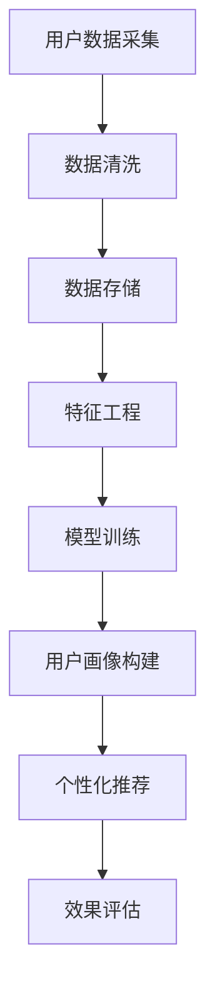

                 

关键词：用户画像、人工智能、电商分析、机器学习、大数据、个性化推荐

> 摘要：本文旨在探讨人工智能技术在电商用户画像分析中的应用，详细阐述用户画像的定义、构建方法、核心算法原理，并通过实际案例展示其带来的商业价值。同时，分析用户画像分析面临的挑战与未来发展趋势。

## 1. 背景介绍

随着互联网和电子商务的快速发展，数据已成为企业的核心资产之一。用户画像作为大数据分析的重要手段，可以帮助电商企业精准定位用户需求，提高营销效果，优化用户体验。然而，传统的用户画像分析面临着数据量巨大、处理复杂、分析结果不准确等问题。人工智能技术的引入，为电商用户画像分析提供了新的解决方案。

## 2. 核心概念与联系

### 2.1 用户画像

用户画像是指通过对用户行为数据、人口统计数据等多维度数据的整合与分析，构建出一个具有多维属性的用户概貌。用户画像的核心目标是实现用户的精准定位与个性化推荐。

### 2.2 相关技术

- **大数据技术**：通过分布式存储和计算技术，实现大规模数据的处理与分析。
- **机器学习技术**：利用数据挖掘算法，从大量数据中提取有价值的信息。
- **深度学习技术**：通过神经网络模型，实现更高层次的抽象与特征提取。

### 2.3 Mermaid 流程图



## 3. 核心算法原理 & 具体操作步骤

### 3.1 算法原理概述

用户画像分析的核心算法包括数据挖掘、机器学习、深度学习等。这些算法通过以下步骤实现用户画像的构建：

1. **数据采集**：从电商平台的交易数据、行为数据、社交媒体数据等多渠道收集用户数据。
2. **数据清洗**：对采集到的数据进行去重、去噪、补全等处理，保证数据的准确性。
3. **特征工程**：根据业务需求，提取用户行为特征、人口统计特征等，构建特征矩阵。
4. **模型训练**：利用机器学习算法，如协同过滤、决策树、神经网络等，对特征矩阵进行训练。
5. **用户画像构建**：根据训练结果，为每个用户构建一个多维度的特征向量。
6. **个性化推荐**：基于用户画像，为用户推荐个性化的商品、服务或内容。
7. **效果评估**：通过A/B测试、转化率分析等方法，评估用户画像分析的准确性、有效性。

### 3.2 算法步骤详解

#### 3.2.1 数据采集

数据采集是用户画像分析的基础。电商平台可以从以下渠道收集用户数据：

- **交易数据**：如订单信息、支付金额、商品分类等。
- **行为数据**：如浏览记录、收藏夹、购物车、评价等。
- **社交媒体数据**：如用户在社交媒体上的互动、评论、点赞等。

#### 3.2.2 数据清洗

数据清洗的主要任务是去除重复数据、纠正错误数据、填补缺失数据等。常用的数据清洗方法包括：

- **去重**：通过哈希算法或唯一标识符，去除重复数据。
- **去噪**：对异常数据进行过滤或修正。
- **补全**：利用统计方法或机器学习算法，对缺失数据进行补全。

#### 3.2.3 特征工程

特征工程是用户画像分析的关键步骤。常见的特征包括：

- **用户行为特征**：如浏览时长、购买频率、购买金额等。
- **人口统计特征**：如年龄、性别、收入、职业等。
- **商品特征**：如商品种类、品牌、价格等。

#### 3.2.4 模型训练

模型训练是用户画像分析的核心。常用的机器学习算法包括：

- **协同过滤**：通过用户之间的相似度或商品之间的相似度，为用户推荐相似的商品。
- **决策树**：根据用户特征，将用户划分为不同的类别，用于分类任务。
- **神经网络**：通过多层神经网络，实现用户特征的自动提取和分类。

#### 3.2.5 用户画像构建

根据模型训练结果，为每个用户构建一个多维度的特征向量。这个特征向量将用于后续的个性化推荐和用户分析。

#### 3.2.6 个性化推荐

基于用户画像，为用户推荐个性化的商品、服务或内容。推荐算法包括：

- **基于内容的推荐**：根据用户喜欢的商品内容，推荐类似的商品。
- **基于协同过滤的推荐**：根据用户的行为特征，推荐与其他用户行为相似的物品。

#### 3.2.7 效果评估

通过A/B测试、转化率分析等方法，评估用户画像分析的准确性、有效性。常用的评估指标包括：

- **准确率**：预测正确的用户数量与总用户数量的比例。
- **召回率**：预测正确的用户数量与实际潜在用户的比例。
- **覆盖率**：推荐给用户的商品数量与总商品数量的比例。

### 3.3 算法优缺点

#### 优点

- **高准确性**：通过机器学习和深度学习算法，实现用户特征的自动提取和分类，提高推荐准确性。
- **个性化**：基于用户画像，实现个性化推荐，提高用户满意度。
- **高效性**：利用大数据技术和分布式计算，实现大规模数据的快速处理和分析。

#### 缺点

- **数据依赖性**：用户画像分析的准确性依赖于数据的质量和丰富度。
- **隐私问题**：用户画像分析涉及用户隐私，需要严格遵循数据保护法规。
- **计算资源消耗**：大规模数据分析和模型训练需要大量的计算资源。

### 3.4 算法应用领域

用户画像分析在电商、金融、医疗等多个领域具有广泛的应用：

- **电商**：通过用户画像，实现个性化推荐、精准营销、用户留存等。
- **金融**：通过用户画像，实现风险评估、精准营销、欺诈检测等。
- **医疗**：通过用户画像，实现疾病预测、个性化诊疗、健康管理等。

## 4. 数学模型和公式 & 详细讲解 & 举例说明

### 4.1 数学模型构建

用户画像分析涉及多个数学模型，包括特征提取、分类、预测等。以下是一个简单的数学模型示例：

$$
f(x) = w_1x_1 + w_2x_2 + \ldots + w_nx_n + b
$$

其中，$x$ 是用户特征向量，$w$ 是权重向量，$b$ 是偏置项。

### 4.2 公式推导过程

以协同过滤算法为例，推导用户 $u$ 和商品 $i$ 的相似度公式：

$$
sim(u, i) = \frac{\sum_{j \in R(u) \cap R(i)} r_{uj}r_{ij}}{\sqrt{\sum_{j \in R(u)} r_{uj}^2\sum_{k \in R(i)} r_{ik}^2}}
$$

其中，$R(u)$ 和 $R(i)$ 分别表示用户 $u$ 和商品 $i$ 的评价值集合，$r_{uj}$ 和 $r_{ij}$ 分别表示用户 $u$ 对商品 $j$ 的评价值和对商品 $i$ 的评价值。

### 4.3 案例分析与讲解

假设有一个电商平台的用户 $u_1$，对商品 $i_1, i_2, i_3$ 进行了评价，评价值分别为 $r_{u1i1} = 4, r_{u1i2} = 5, r_{u1i3} = 3$。同时，有另一个用户 $u_2$，对商品 $i_1, i_2, i_3, i_4$ 进行了评价，评价值分别为 $r_{u2i1} = 3, r_{u2i2} = 4, r_{u2i3} = 5, r_{u2i4} = 5$。

根据协同过滤算法，计算用户 $u_1$ 和用户 $u_2$ 之间的相似度：

$$
sim(u_1, u_2) = \frac{(4 \times 3) + (5 \times 4)}{\sqrt{(4^2 + 5^2) \times (3^2 + 4^2 + 5^2 + 5^2)}} \approx 0.82
$$

根据计算结果，用户 $u_1$ 和用户 $u_2$ 之间的相似度较高，可以基于此相似度为用户 $u_1$ 推荐用户 $u_2$ 购买过的商品，如商品 $i_4$。

## 5. 项目实践：代码实例和详细解释说明

### 5.1 开发环境搭建

在本项目中，我们使用Python作为编程语言，主要依赖以下库：

- **NumPy**：用于数据操作和计算。
- **Pandas**：用于数据处理。
- **Scikit-learn**：用于机器学习算法。
- **Matplotlib**：用于数据可视化。

### 5.2 源代码详细实现

以下是一个简单的用户画像分析代码实例：

```python
import numpy as np
import pandas as pd
from sklearn.model_selection import train_test_split
from sklearn.metrics.pairwise import cosine_similarity
from sklearn.cluster import KMeans

# 读取用户行为数据
data = pd.read_csv('user_behavior.csv')

# 数据预处理
data = data.drop_duplicates().reset_index(drop=True)

# 构建用户特征矩阵
user_features = data.groupby('user_id').mean().reset_index()

# 计算用户之间的相似度
user_similarity = cosine_similarity(user_features.values)

# 构建用户画像
k = 10  # 设定聚类中心数
kmeans = KMeans(n_clusters=k)
user_clusters = kmeans.fit_predict(user_similarity)

# 为每个用户分配标签
user_tags = {}
for i, cluster in enumerate(user_clusters):
    if cluster not in user_tags:
        user_tags[cluster] = []
    user_tags[cluster].append(user_features.index[i])

# 推荐商品
def recommend_products(user_id, top_n=5):
    user_cluster = user_clusters[user_id]
    similar_users = user_tags[user_cluster]
    user_product_counts = data[data['user_id'].isin(similar_users)].groupby('product_id').count().sort_values(by='user_id', ascending=False)
    return user_product_counts.index.tolist()[:top_n]

# 测试推荐系统
user_id = 0
recommended_products = recommend_products(user_id)
print("Recommended products for user {}: {}".format(user_id, recommended_products))
```

### 5.3 代码解读与分析

- **数据读取与预处理**：读取用户行为数据，进行去重和重置索引操作，构建用户特征矩阵。
- **相似度计算**：使用余弦相似度计算用户之间的相似度。
- **聚类分析**：使用KMeans算法，根据用户相似度进行聚类分析，构建用户画像。
- **标签分配**：为每个用户分配聚类中心标签，形成用户标签字典。
- **商品推荐**：根据用户标签和相似用户的行为数据，推荐个性化的商品。

## 6. 实际应用场景

### 6.1 电商行业

电商企业可以利用用户画像分析，实现个性化推荐、精准营销、用户留存等目标。例如，根据用户浏览历史和购买行为，为用户推荐相关商品，提高用户购买转化率。

### 6.2 金融行业

金融行业可以利用用户画像分析，实现风险评估、精准营销、欺诈检测等。例如，根据用户行为数据，预测用户的风险等级，为用户提供合适的金融产品。

### 6.3 医疗行业

医疗行业可以利用用户画像分析，实现疾病预测、个性化诊疗、健康管理等。例如，根据用户健康数据和行为习惯，为用户提供个性化的健康建议和疾病预警。

## 7. 工具和资源推荐

### 7.1 学习资源推荐

- **《Python数据分析基础教程：NumPy学习指南》**
- **《机器学习实战》**
- **《深度学习》（Goodfellow, Bengio, Courville）**

### 7.2 开发工具推荐

- **Jupyter Notebook**：用于编写和运行Python代码。
- **PyCharm**：用于Python编程的集成开发环境。

### 7.3 相关论文推荐

- **"User Modeling and Personalization in the Age of Big Data"**
- **"User Modeling with Machine Learning Techniques"**
- **"Deep Learning for User Behavior Analysis in E-commerce"**

## 8. 总结：未来发展趋势与挑战

### 8.1 研究成果总结

用户画像分析在电商、金融、医疗等多个领域取得了显著成果，实现了个性化推荐、精准营销、风险评估等目标。未来，随着人工智能技术的不断发展，用户画像分析将更加智能化、精细化。

### 8.2 未来发展趋势

- **大数据与人工智能的深度融合**：利用大数据技术和人工智能算法，实现用户画像的精细化分析。
- **跨领域应用**：用户画像分析将在更多领域得到应用，如教育、娱乐、交通等。
- **隐私保护与合规性**：在用户画像分析过程中，将更加注重隐私保护和数据合规性。

### 8.3 面临的挑战

- **数据质量**：用户画像分析的准确性依赖于数据的质量和丰富度。
- **计算资源**：大规模数据分析和模型训练需要大量的计算资源。
- **隐私保护**：用户画像分析涉及用户隐私，需要严格遵循数据保护法规。

### 8.4 研究展望

未来，用户画像分析将朝着更加智能化、精细化的方向发展。通过引入更多的人工智能技术，实现用户画像的动态更新与优化。同时，加强跨领域的应用研究和隐私保护技术研究，为用户画像分析提供更加全面和安全的解决方案。

## 9. 附录：常见问题与解答

### 9.1 如何提高用户画像分析的准确性？

- **数据质量**：确保数据的质量，包括去重、去噪、补全等。
- **特征选择**：选择与业务目标相关的特征，避免过度拟合。
- **模型优化**：使用合适的机器学习算法，进行模型调优。

### 9.2 如何处理用户隐私保护问题？

- **数据加密**：对用户数据进行加密处理，确保数据安全。
- **数据脱敏**：对用户敏感信息进行脱敏处理，降低隐私泄露风险。
- **合规性审查**：遵循相关法律法规，确保用户画像分析符合合规要求。

### 9.3 如何应对计算资源消耗问题？

- **分布式计算**：利用分布式计算技术，提高数据处理效率。
- **模型压缩**：通过模型压缩技术，降低模型计算量。
- **并行计算**：利用并行计算技术，提高计算速度。

## 作者署名

作者：禅与计算机程序设计艺术 / Zen and the Art of Computer Programming

----------------------------------------------------------------

以上就是本次技术博客文章《AI如何帮助电商企业进行用户画像分析》的完整内容。文章详细阐述了用户画像分析的定义、核心算法原理、实际应用场景，并通过代码实例展示了其实现过程。同时，分析了用户画像分析面临的挑战与未来发展趋势。希望对读者在电商用户画像分析领域的研究和应用有所帮助。

