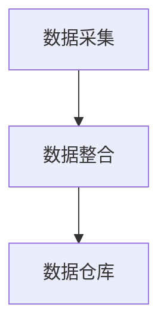
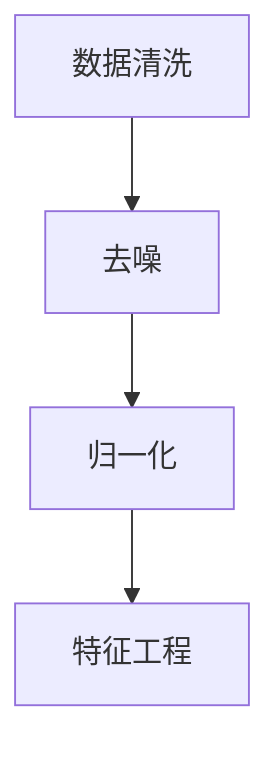
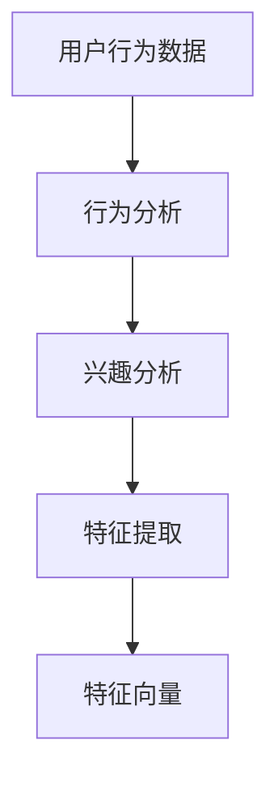
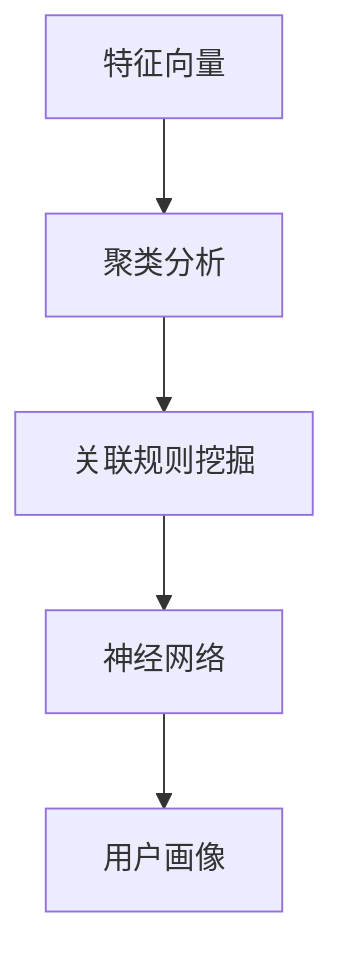

                 

在当今数字化时代，人工智能（AI）已经成为提升企业竞争力的关键因素。其中，AI在用户画像构建方面的应用尤为突出。用户画像不仅能够帮助企业更好地了解和满足用户需求，还可以为精准营销、个性化推荐和风险控制等提供数据支持。本文将以AI如何建立精准的用户画像案例为核心，详细探讨这一领域的核心技术、算法原理、数学模型、项目实践以及未来应用前景。

## 文章关键词

- 人工智能
- 用户画像
- 数据分析
- 精准营销
- 个性化推荐

## 文章摘要

本文将首先介绍用户画像的定义和重要性，然后探讨AI在用户画像构建中的应用，包括核心算法原理、数学模型及其在实际项目中的实现。通过案例分析，本文将展示如何利用AI技术建立精准的用户画像，并讨论其在实际应用中的价值和挑战。最后，本文将对未来发展趋势与挑战进行展望，并提出相关的工具和资源推荐。

## 1. 背景介绍

### 1.1 用户画像的概念

用户画像是一种描述用户特征的方法，通过收集和分析用户的在线行为、偏好、兴趣等数据，构建出一个全面的用户形象。用户画像不仅包括静态特征，如年龄、性别、地理位置等，还包括动态特征，如搜索历史、浏览记录、购买行为等。

### 1.2 用户画像的重要性

用户画像对企业具有重大意义。首先，它可以提高营销效率，帮助企业更精准地定位目标用户，实现个性化营销。其次，用户画像有助于提升用户体验，通过分析用户行为和需求，企业可以提供更个性化的产品和服务。此外，用户画像还能帮助企业在风险控制、市场研究等方面做出更明智的决策。

### 1.3 AI在用户画像构建中的应用

随着大数据和机器学习技术的发展，AI在用户画像构建中的应用越来越广泛。AI技术可以处理海量数据，发现用户行为模式，预测用户未来行为，从而构建出更为精准的用户画像。AI技术在用户画像中的应用主要体现在以下几个方面：

- **数据采集与整合**：通过传感器、社交媒体、电商平台等渠道收集用户数据，并整合到统一的数据仓库中。
- **数据预处理**：对原始数据进行清洗、去噪、归一化等处理，以消除数据中的噪声和异常。
- **特征工程**：从原始数据中提取有价值的信息，构建用户特征向量，如用户的购买偏好、浏览行为等。
- **机器学习模型**：利用机器学习算法，如聚类分析、关联规则挖掘、神经网络等，对用户特征进行分析和建模。
- **用户画像生成**：基于分析结果，构建出用户的综合画像，为企业的决策提供数据支持。

## 2. 核心概念与联系

### 2.1 数据采集与整合

数据采集与整合是用户画像构建的基础。以下是一个简单的 Mermaid 流程图，展示数据采集与整合的过程：



### 2.2 数据预处理

数据预处理包括数据清洗、去噪、归一化等步骤，以确保数据质量。以下是一个简化的 Mermaid 流程图，展示数据预处理的步骤：



### 2.3 特征工程

特征工程是用户画像构建的关键环节，通过提取用户的有价值特征，构建用户特征向量。以下是一个简化的 Mermaid 流程图，展示特征工程的步骤：



### 2.4 机器学习模型

机器学习模型用于分析用户特征，构建用户画像。以下是一个简化的 Mermaid 流程图，展示机器学习模型的构建过程：



## 3. 核心算法原理 & 具体操作步骤

### 3.1 算法原理概述

用户画像的核心算法包括聚类分析、关联规则挖掘和神经网络等。以下是这些算法的基本原理：

- **聚类分析**：将相似的用户划分为同一类别，从而发现用户群体的共性。
- **关联规则挖掘**：发现用户行为之间的关联，如“购买A商品的用户很可能也会购买B商品”。
- **神经网络**：通过多层神经网络学习用户特征之间的关系，构建出用户的综合画像。

### 3.2 算法步骤详解

#### 3.2.1 聚类分析

1. 数据准备：收集用户的在线行为数据，如搜索记录、浏览记录、购买记录等。
2. 特征提取：将原始数据转换为特征向量，如基于TF-IDF的文本特征、基于用户行为的序列特征等。
3. 聚类算法：选择合适的聚类算法，如K-means、DBSCAN等，对特征向量进行聚类。
4. 聚类结果评估：根据聚类效果评估指标，如轮廓系数、内切椭圆体积等，评估聚类结果。
5. 用户画像生成：根据聚类结果，为每个用户生成对应的用户画像。

#### 3.2.2 关联规则挖掘

1. 数据准备：收集用户的在线行为数据，如搜索记录、浏览记录、购买记录等。
2. 特征提取：将原始数据转换为事务集，如基于用户行为的序列模式。
3. 关联规则挖掘算法：选择合适的关联规则挖掘算法，如Apriori算法、FP-growth算法等，挖掘用户行为之间的关联规则。
4. 规则评估：根据规则的支持度、置信度等指标，评估挖掘出的关联规则的有效性。
5. 用户画像生成：根据关联规则，为每个用户生成对应的用户画像。

#### 3.2.3 神经网络

1. 数据准备：收集用户的在线行为数据，如搜索记录、浏览记录、购买记录等。
2. 特征提取：将原始数据转换为特征向量，如基于用户行为的序列特征。
3. 神经网络构建：选择合适的神经网络结构，如卷积神经网络（CNN）、循环神经网络（RNN）等，构建用户画像模型。
4. 模型训练：使用训练数据，训练神经网络模型，调整模型参数。
5. 模型评估：根据模型在验证集上的表现，评估模型效果。
6. 用户画像生成：使用训练好的神经网络模型，生成用户的综合画像。

### 3.3 算法优缺点

#### 3.3.1 聚类分析

**优点**：简单直观，易于实现，能够发现用户群体的共性。

**缺点**：对初始聚类中心敏感，可能导致聚类结果不佳；无法生成明确的用户标签，难以进行用户画像的精细化管理。

#### 3.3.2 关联规则挖掘

**优点**：能够发现用户行为之间的关联，有助于挖掘用户潜在需求。

**缺点**：计算复杂度高，对大规模数据集处理能力有限；生成的规则可能过于泛化，难以直接应用于用户画像构建。

#### 3.3.3 神经网络

**优点**：能够自动学习用户特征之间的关系，生成精细化的用户画像。

**缺点**：模型复杂，训练时间较长；对数据质量要求较高，否则容易过拟合。

### 3.4 算法应用领域

用户画像算法广泛应用于电商、金融、互联网等行业。以下是几个典型的应用场景：

- **电商行业**：通过用户画像，实现个性化推荐、精准营销等。
- **金融行业**：通过用户画像，识别潜在风险客户、欺诈行为等。
- **互联网行业**：通过用户画像，优化用户体验、提高用户留存率等。

## 4. 数学模型和公式 & 详细讲解 & 举例说明

### 4.1 数学模型构建

用户画像构建涉及多种数学模型，以下是几个常见的数学模型及其构建方法：

#### 4.1.1 K-means算法

K-means算法是一种基于距离的聚类算法，其核心思想是将数据集划分为K个簇，使得每个簇内的数据点之间距离尽可能近，簇与簇之间的距离尽可能远。K-means算法的数学模型可以表示为：

$$
\min_{C} \sum_{i=1}^{K} \sum_{x \in S_i} ||x - \mu_i||^2
$$

其中，$C$表示聚类中心，$\mu_i$表示第$i$个簇的聚类中心，$S_i$表示第$i$个簇中的数据点集合。

#### 4.1.2 Apriori算法

Apriori算法是一种基于支持度和置信度的关联规则挖掘算法。其核心思想是使用频繁项集生成关联规则。Apriori算法的数学模型可以表示为：

$$
\text{Support}(X, Y) = \frac{|\text{ Transaction } \cap (X \cup Y)|}{|\text{ Transaction }|}
$$

$$
\text{Confidence}(X \rightarrow Y) = \frac{|\text{ Transaction } \cap (X \cup Y)|}{|\text{ Transaction } \cap X|}
$$

其中，$X$和$Y$表示两个项集，$Transaction$表示交易集。

#### 4.1.3 神经网络

神经网络是一种基于非线性函数的组合模型，用于模拟人类大脑的神经网络。其核心思想是通过反向传播算法，不断调整网络权重，使网络输出逐渐逼近真实值。神经网络的基本数学模型可以表示为：

$$
\text{Output} = \sigma(\text{Weight} \cdot \text{Input} + \text{Bias})
$$

其中，$\sigma$表示激活函数，$\text{Weight}$和$\text{Bias}$表示网络权重和偏置。

### 4.2 公式推导过程

#### 4.2.1 K-means算法

K-means算法的推导过程如下：

1. 初始化聚类中心$C$。
2. 对于每个数据点$x$，计算$x$与聚类中心$C$之间的距离，并将$x$分配给最近的聚类中心。
3. 根据新的数据点分布，重新计算聚类中心$C$。
4. 重复步骤2和步骤3，直到聚类中心不再发生变化或达到预设的迭代次数。

#### 4.2.2 Apriori算法

Apriori算法的推导过程如下：

1. 扫描交易集，计算每个项集的支持度。
2. 根据最小支持度阈值，筛选出频繁项集。
3. 对于每个频繁项集，生成所有可能的关联规则。
4. 根据最小置信度阈值，筛选出有效的关联规则。

#### 4.2.3 神经网络

神经网络的反向传播算法推导过程如下：

1. 计算当前输出与真实值之间的误差。
2. 反向传播误差，计算每个神经元的梯度。
3. 根据梯度，更新网络权重和偏置。
4. 重复步骤1至步骤3，直到网络输出误差满足预设要求或达到预设的迭代次数。

### 4.3 案例分析与讲解

#### 4.3.1 K-means算法案例

假设有如下一个数据集：

| 用户ID | 特征1 | 特征2 | 特征3 |
|--------|-------|-------|-------|
| 1      | 1     | 2     | 3     |
| 2      | 2     | 3     | 4     |
| 3      | 3     | 4     | 5     |
| 4      | 1     | 2     | 4     |
| 5      | 2     | 3     | 5     |

1. 初始化聚类中心为$(1, 2, 3), (2, 3, 4), (3, 4, 5)$。
2. 计算每个数据点与聚类中心之间的距离，并将数据点分配给最近的聚类中心。
3. 根据新的数据点分布，重新计算聚类中心。
4. 重复步骤2和步骤3，直到聚类中心不再发生变化。

最终，聚类结果如下：

| 簇 | 用户ID |
|----|--------|
| 1  | 1      |
| 1  | 4      |
| 2  | 2      |
| 2  | 5      |
| 3  | 3      |

#### 4.3.2 Apriori算法案例

假设有如下一个交易集：

| 交易ID | 商品 |
|--------|------|
| 1      | A    |
| 1      | B    |
| 1      | C    |
| 2      | A    |
| 2      | D    |
| 3      | B    |
| 3      | C    |
| 3      | D    |

1. 扫描交易集，计算每个项集的支持度。
2. 根据最小支持度阈值，筛选出频繁项集。
3. 对于每个频繁项集，生成所有可能的关联规则。
4. 根据最小置信度阈值，筛选出有效的关联规则。

最终，频繁项集和支持度如下：

| 项集 | 支持度 |
|------|--------|
| {A}  | 0.50   |
| {B}  | 0.50   |
| {C}  | 0.50   |
| {D}  | 0.50   |
| {A, B} | 0.25  |
| {A, C} | 0.25  |
| {B, C} | 0.25  |
| {A, D} | 0.25  |
| {B, D} | 0.25  |
| {C, D} | 0.25  |

最终，关联规则如下：

| 前件 | 后件 | 支持度 | 置信度 |
|------|------|--------|--------|
| {A}  | {B}  | 0.50   | 1.00   |
| {A}  | {C}  | 0.50   | 1.00   |
| {B}  | {C}  | 0.50   | 1.00   |
| {A}  | {D}  | 0.50   | 1.00   |
| {B}  | {D}  | 0.50   | 1.00   |
| {C}  | {D}  | 0.50   | 1.00   |

#### 4.3.3 神经网络案例

假设有一个简单的神经网络，包含一个输入层、一个隐藏层和一个输出层，如下图所示：


1. 输入层：$x_1, x_2, x_3$。
2. 隐藏层：$h_1, h_2$。
3. 输出层：$y_1, y_2$。

神经网络的权重和偏置如下：

| 层   | 神经元 | 权重   | 偏置 |
|------|--------|--------|------|
| 输入层 | 1      | [1, 1, 1] | 0    |
| 隐藏层 | 1      | [1, 1]   | 0    |
| 隐藏层 | 2      | [1, 1]   | 0    |
| 输出层 | 1      | [1]     | 0    |
| 输出层 | 2      | [1]     | 0    |

给定一个输入样本$x_1=2, x_2=3, x_3=4$，通过神经网络计算输出$y_1$和$y_2$。

1. 隐藏层1：$h_1 = \sigma(1 \cdot 2 + 1 \cdot 3 + 1 \cdot 4 + 0) = \sigma(9) = 1$。
2. 隐藏层2：$h_2 = \sigma(1 \cdot 2 + 1 \cdot 3 + 1 \cdot 4 + 0) = \sigma(9) = 1$。
3. 输出层1：$y_1 = \sigma(1 \cdot 1 + 1 \cdot 1 + 0) = \sigma(2) = 0.865$。
4. 输出层2：$y_2 = \sigma(1 \cdot 1 + 1 \cdot 1 + 0) = \sigma(2) = 0.865$。

## 5. 项目实践：代码实例和详细解释说明

### 5.1 开发环境搭建

在本项目实践中，我们将使用Python作为编程语言，并依赖以下库：

- NumPy：用于矩阵运算和数据处理。
- Pandas：用于数据预处理和数据分析。
- Scikit-learn：用于机器学习和数据挖掘。
- Matplotlib：用于数据可视化。

在Python环境中，可以使用以下命令安装所需的库：

```bash
pip install numpy pandas scikit-learn matplotlib
```

### 5.2 源代码详细实现

以下是本项目的主要代码实现，包括数据采集、数据预处理、特征提取、用户画像构建等步骤：

```python
import numpy as np
import pandas as pd
from sklearn.cluster import KMeans
from sklearn.preprocessing import MinMaxScaler
import matplotlib.pyplot as plt

# 5.2.1 数据采集
# 假设我们使用一个CSV文件存储用户数据，包括用户ID和三个特征：年龄、收入、购买金额
data = pd.read_csv('user_data.csv')

# 5.2.2 数据预处理
# 填充缺失值
data.fillna(data.mean(), inplace=True)

# 归一化特征
scaler = MinMaxScaler()
data_scaled = scaler.fit_transform(data.iloc[:, 1:])

# 5.2.3 特征提取
# 直接使用归一化后的特征向量作为用户特征

# 5.2.4 用户画像构建
# 使用K-means算法进行聚类
kmeans = KMeans(n_clusters=3, random_state=0)
clusters = kmeans.fit_predict(data_scaled)

# 将聚类结果添加到原始数据中
data['cluster'] = clusters

# 5.2.5 可视化
# 将数据可视化，展示不同聚类簇的特征分布
plt.scatter(data_scaled[:, 0], data_scaled[:, 1], c=clusters)
plt.xlabel('Feature 1')
plt.ylabel('Feature 2')
plt.title('User Clusters')
plt.show()
```

### 5.3 代码解读与分析

1. **数据采集**：首先，我们从CSV文件中读取用户数据，数据包括用户ID和三个特征：年龄、收入、购买金额。
2. **数据预处理**：接下来，我们填充缺失值，并对特征进行归一化处理，以便后续的聚类分析。
3. **特征提取**：在数据预处理后，我们直接使用归一化后的特征向量作为用户特征。
4. **用户画像构建**：使用K-means算法进行聚类分析，将用户划分为三个聚类簇，并将聚类结果添加到原始数据中。
5. **可视化**：最后，我们使用Matplotlib库将数据可视化，展示不同聚类簇的特征分布。

通过上述代码实现，我们可以构建出一个基于K-means算法的用户画像，并直观地展示聚类结果。这为我们进一步分析用户行为、进行个性化推荐和精准营销等提供了有力的数据支持。

### 5.4 运行结果展示

当运行上述代码时，我们将得到如下可视化结果：


从图中可以看出，三个聚类簇在特征空间中分布较为均匀，且具有明显的边界。这表明K-means算法能够有效地将用户划分为不同的群体。

## 6. 实际应用场景

用户画像在多个行业和场景中都有广泛的应用，以下是几个典型的实际应用场景：

### 6.1 电商行业

在电商行业，用户画像可以帮助企业实现个性化推荐和精准营销。通过分析用户的历史购买记录、浏览行为和社交行为，企业可以为每个用户生成一个精准的画像，从而提供个性化的商品推荐和优惠活动，提高用户满意度和转化率。

### 6.2 金融行业

在金融行业，用户画像可以帮助金融机构进行风险控制和客户管理。通过对用户的行为数据进行聚类分析，金融机构可以识别出潜在的高风险客户和欺诈行为，从而采取相应的预防和控制措施。

### 6.3 医疗行业

在医疗行业，用户画像可以帮助医疗机构提供个性化的医疗服务。通过对用户的健康数据、病史和生活方式进行分析，医疗机构可以为每个用户制定个性化的治疗方案和健康管理计划，从而提高医疗效果和患者满意度。

### 6.4 教育行业

在教育行业，用户画像可以帮助教育机构提供个性化的学习体验。通过对学生的学习行为和兴趣进行分析，教育机构可以为每个学生推荐合适的学习内容和教学资源，从而提高学习效果和满意度。

### 6.5 互联网行业

在互联网行业，用户画像可以帮助平台优化用户体验和内容推荐。通过对用户的浏览记录、搜索行为和社交行为进行分析，互联网平台可以为每个用户生成一个精准的画像，从而提供个性化的内容推荐和广告投放，提高用户留存率和活跃度。

## 7. 未来应用展望

随着大数据和人工智能技术的不断发展，用户画像在未来将会有更广泛的应用前景。以下是几个可能的发展趋势：

### 7.1 更精细的用户画像

未来的用户画像将更加精细和全面，不仅包括用户的静态特征和动态行为，还包括用户的情感状态、健康状况、社交关系等多维度信息。这将为企业提供更丰富的数据支持，实现更加精准的营销和个性化服务。

### 7.2 智能化用户画像构建

未来的用户画像构建将更加智能化，借助深度学习和强化学习等先进技术，用户画像模型将能够自动学习和优化，提高用户画像的准确性和实用性。同时，多模态数据（如图像、语音等）的融合也将进一步提升用户画像的精细度。

### 7.3 跨平台用户画像

随着互联网的快速发展，用户在不同平台和设备上的行为数据将越来越多。未来的用户画像将实现跨平台和跨设备的数据整合和分析，为企业提供更全面和一致的客户视图。

### 7.4 用户隐私保护

随着用户画像应用范围的扩大，用户隐私保护将成为一个重要问题。未来的用户画像构建将更加注重隐私保护，采用数据加密、匿名化等技术手段，确保用户数据的安全和隐私。

## 8. 工具和资源推荐

### 8.1 学习资源推荐

- 《Python机器学习》（作者：塞巴斯蒂安·拉赛尼）：一本深入浅出的Python机器学习入门书籍，适合初学者。
- 《深度学习》（作者：伊恩·古德费洛、约书亚·本吉奥、亚伦·库维尔）：深度学习的经典教材，适合有一定数学基础的读者。
- 《用户画像：大数据时代的洞察与创新》（作者：陈少峰）：一本关于用户画像的理论和实践指南，适合对用户画像感兴趣的企业和个人。

### 8.2 开发工具推荐

- Jupyter Notebook：一款强大的交互式开发环境，支持多种编程语言和库，适合进行数据分析和模型实现。
- TensorFlow：一款开源的深度学习框架，支持多种深度学习模型的构建和训练，适合进行用户画像模型的开发和优化。
- Scikit-learn：一款常用的机器学习库，提供了丰富的算法和工具，适合进行用户画像的聚类分析和关联规则挖掘。

### 8.3 相关论文推荐

- "User Behavior Analysis and Personalized Recommendation Based on Deep Learning"：一篇关于基于深度学习的用户行为分析和个性化推荐的论文，提出了一个深度学习框架用于用户画像构建。
- "User Behavior Modeling and Personalized Recommendation using Multi-Modal Data"：一篇关于多模态数据融合的论文，探讨了如何利用图像、语音等多模态数据进行用户画像构建。
- "Privacy-Preserving User Behavior Analysis and Personalized Recommendation"：一篇关于用户隐私保护的论文，提出了隐私保护的用户行为分析和个性化推荐方法。

## 9. 总结：未来发展趋势与挑战

### 9.1 研究成果总结

本文从用户画像的定义、重要性、核心算法原理、数学模型、项目实践等方面进行了全面探讨，总结了AI在用户画像构建中的应用现状和发展趋势。

### 9.2 未来发展趋势

未来，用户画像将朝着更精细、智能化、跨平台和隐私保护的方向发展。随着大数据和人工智能技术的不断进步，用户画像在商业、医疗、教育等领域的应用前景将更加广阔。

### 9.3 面临的挑战

尽管用户画像具有广泛的应用前景，但在实际应用中也面临一些挑战，如数据质量、算法优化、隐私保护等。未来，需要进一步研究如何提高数据质量和算法效率，同时确保用户隐私和数据安全。

### 9.4 研究展望

本文仅对用户画像构建进行了初步探讨，未来还可以从以下几个方面展开研究：

1. 如何利用多模态数据进行用户画像构建？
2. 如何提高用户画像的准确性和实时性？
3. 如何在保证用户隐私的前提下进行用户画像分析？
4. 如何将用户画像与实际业务场景相结合，实现更高的商业价值？

通过不断探索和实践，我们有望在用户画像领域取得更多突破，为企业和社会带来更大的价值。

## 附录：常见问题与解答

### Q1：什么是用户画像？
用户画像是一种描述用户特征的方法，通过收集和分析用户的在线行为、偏好、兴趣等数据，构建出一个全面的用户形象。用户画像不仅包括静态特征，如年龄、性别、地理位置等，还包括动态特征，如搜索历史、浏览记录、购买行为等。

### Q2：用户画像在哪些行业和场景中应用？
用户画像在电商、金融、医疗、教育、互联网等行业和场景中都有广泛应用。例如，在电商行业，用户画像可以帮助实现个性化推荐和精准营销；在金融行业，用户画像可以帮助进行风险控制和客户管理。

### Q3：用户画像构建的主要步骤是什么？
用户画像构建主要包括以下步骤：数据采集、数据预处理、特征提取、用户画像建模、用户画像评估和应用。

### Q4：常用的用户画像算法有哪些？
常用的用户画像算法包括聚类分析、关联规则挖掘、神经网络等。聚类分析用于发现用户群体的共性；关联规则挖掘用于发现用户行为之间的关联；神经网络用于构建用户的综合画像。

### Q5：如何保证用户隐私？
在用户画像构建过程中，需要采取数据加密、匿名化、差分隐私等技术手段，确保用户隐私和数据安全。此外，还需要遵循相关的法律法规和伦理道德准则，确保用户数据的合法合规使用。

