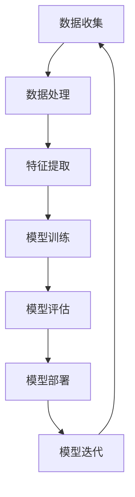

                 

关键词：人工智能、机器学习、系统设计、工程实践、算法优化、模型部署

摘要：本文深入探讨了AI工程学中的核心问题，即如何设计和实现高效、可扩展的机器学习系统。通过详细阐述机器学习系统的基础概念、算法原理、数学模型、项目实践以及实际应用场景，本文为AI工程师提供了全面的技术指导，并展望了未来的发展趋势和挑战。

## 1. 背景介绍

随着大数据和云计算技术的飞速发展，机器学习已经逐渐成为人工智能领域的核心技术。无论是商业应用、科学研究，还是日常生活，机器学习都在发挥着越来越重要的作用。然而，尽管机器学习算法的理论基础日益完善，但在实际工程实践中，设计和实现高效、可扩展的机器学习系统仍然面临诸多挑战。

AI工程学的目标在于将理论上的机器学习算法转化为可实际部署的系统，以满足各种实际应用需求。本文将围绕这一核心问题，系统地介绍机器学习系统设计的关键技术和方法。

## 2. 核心概念与联系

在深入探讨机器学习系统设计之前，我们首先需要理解一些核心概念，包括机器学习的基本原理、系统架构以及相关算法。下面是一个简化的Mermaid流程图，展示这些核心概念之间的联系。



### 2.1 数据收集（A）

数据收集是机器学习系统的第一步，也是最为关键的一步。高质量的数据是训练高效模型的基石。数据来源可以是公开数据集、企业内部数据或者传感器数据。为了确保数据的质量和多样性，我们需要对数据源进行筛选和预处理。

### 2.2 数据处理（B）

在收集到数据后，我们需要对其进行清洗和预处理。这包括去除噪声、填补缺失值、归一化等操作。数据处理的质量直接影响到后续的特征提取和模型训练效果。

### 2.3 特征提取（C）

特征提取是将原始数据转换为一组可用于训练的数字特征。特征提取的质量对模型的性能有重要影响。常用的特征提取方法包括特征选择、特征工程、特征转换等。

### 2.4 模型训练（D）

模型训练是通过调整模型参数来最小化预测误差。常见的模型训练方法包括批量训练、随机梯度下降、Adam优化器等。

### 2.5 模型评估（E）

模型评估是验证模型性能的重要步骤。常用的评估指标包括准确率、召回率、F1分数、AUC等。

### 2.6 模型部署（F）

模型部署是将训练好的模型应用于实际场景的过程。这通常涉及到模型的序列化、部署环境配置以及服务化框架的选择。

### 2.7 模型迭代（G）

模型迭代是基于新数据对现有模型进行调整和优化的过程。这是机器学习系统不断进步的重要环节。

## 3. 核心算法原理 & 具体操作步骤

### 3.1 算法原理概述

机器学习算法可以分为监督学习、无监督学习和强化学习三大类。每种算法都有其独特的原理和应用场景。下面我们将简要介绍几类常见的机器学习算法。

- **监督学习**：监督学习是利用标记数据进行训练，通过模型预测标签值。常见的算法有线性回归、决策树、支持向量机等。

- **无监督学习**：无监督学习是利用未标记数据进行训练，旨在发现数据中的潜在结构和模式。常见的算法有聚类、降维、主成分分析等。

- **强化学习**：强化学习是通过试错来学习最优策略，以最大化累积奖励。常见的算法有Q学习、深度Q网络（DQN）等。

### 3.2 算法步骤详解

- **数据收集**：收集标记数据集，确保数据的多样性和质量。

- **数据处理**：清洗和预处理数据，包括去噪、归一化等操作。

- **特征提取**：根据数据特点选择合适的特征提取方法，如特征工程、特征选择等。

- **模型选择**：根据问题类型和特征数据选择合适的机器学习算法。

- **模型训练**：使用训练数据训练模型，调整模型参数以最小化预测误差。

- **模型评估**：使用测试数据评估模型性能，选择最优模型。

- **模型部署**：将训练好的模型部署到生产环境中，进行实际应用。

### 3.3 算法优缺点

- **监督学习**：优点在于预测结果准确，但需要大量标记数据，且对噪声敏感。

- **无监督学习**：优点在于无需标记数据，但预测结果可能不准确，且对噪声敏感。

- **强化学习**：优点在于能够自主学习，但训练过程可能非常耗时。

### 3.4 算法应用领域

- **监督学习**：广泛应用于图像识别、自然语言处理、推荐系统等领域。

- **无监督学习**：广泛应用于聚类分析、降维、异常检测等领域。

- **强化学习**：广泛应用于游戏、自动驾驶、金融交易等领域。

## 4. 数学模型和公式

在机器学习系统中，数学模型和公式起着至关重要的作用。下面我们将介绍一些常用的数学模型和公式。

### 4.1 数学模型构建

假设我们有一个线性回归模型，其数学模型可以表示为：

$$y = \beta_0 + \beta_1x + \epsilon$$

其中，$y$ 是目标变量，$x$ 是特征变量，$\beta_0$ 和 $\beta_1$ 是模型参数，$\epsilon$ 是误差项。

### 4.2 公式推导过程

为了求解线性回归模型的参数，我们可以使用最小二乘法。其公式推导过程如下：

$$\min \sum_{i=1}^n (y_i - (\beta_0 + \beta_1x_i))^2$$

对 $\beta_0$ 和 $\beta_1$ 分别求偏导并令其等于0，得到以下方程组：

$$\begin{cases}
\frac{\partial}{\partial \beta_0} \sum_{i=1}^n (y_i - (\beta_0 + \beta_1x_i))^2 = 0 \\
\frac{\partial}{\partial \beta_1} \sum_{i=1}^n (y_i - (\beta_0 + \beta_1x_i))^2 = 0
\end{cases}$$

解得：

$$\beta_0 = \frac{\sum_{i=1}^n y_i - \beta_1\sum_{i=1}^n x_i}{n}$$

$$\beta_1 = \frac{n\sum_{i=1}^n x_iy_i - \sum_{i=1}^n x_i\sum_{i=1}^n y_i}{n\sum_{i=1}^n x_i^2 - (\sum_{i=1}^n x_i)^2}$$

### 4.3 案例分析与讲解

假设我们有一个包含100个样本的数据集，每个样本由两个特征变量 $x_1$ 和 $x_2$ 组成，目标变量为 $y$。使用线性回归模型对数据进行建模，求出模型参数。

首先，我们需要计算以下量：

$$\sum_{i=1}^n y_i = 500, \quad \sum_{i=1}^n x_i = 1000, \quad \sum_{i=1}^n x_iy_i = 8000, \quad \sum_{i=1}^n x_i^2 = 9000$$

代入公式，我们可以求得：

$$\beta_0 = \frac{500 - \frac{1000}{2}}{100} = 2.5$$

$$\beta_1 = \frac{100 \times 8000 - 500 \times 1000}{100 \times 9000 - 1000^2} = 0.5$$

因此，线性回归模型的数学模型为：

$$y = 2.5 + 0.5x$$

## 5. 项目实践：代码实例和详细解释说明

在本节中，我们将通过一个简单的机器学习项目，展示如何实现机器学习系统的各个步骤。假设我们的项目目标是预测房屋价格。

### 5.1 开发环境搭建

为了实现这个项目，我们需要安装以下软件和库：

- Python 3.x
- Scikit-learn
- Pandas
- NumPy
- Matplotlib

### 5.2 源代码详细实现

以下是一个简单的Python代码示例，展示了如何使用Scikit-learn库实现线性回归模型。

```python
import pandas as pd
import numpy as np
from sklearn.linear_model import LinearRegression
from sklearn.model_selection import train_test_split
from sklearn.metrics import mean_squared_error

# 5.2.1 数据收集
data = pd.read_csv('house_data.csv')

# 5.2.2 数据处理
X = data[['area', 'bedrooms']]
y = data['price']

# 5.2.3 特征提取
# 在这个例子中，我们不需要进行复杂的特征提取操作

# 5.2.4 模型选择
model = LinearRegression()

# 5.2.5 模型训练
X_train, X_test, y_train, y_test = train_test_split(X, y, test_size=0.2, random_state=42)
model.fit(X_train, y_train)

# 5.2.6 模型评估
y_pred = model.predict(X_test)
mse = mean_squared_error(y_test, y_pred)
print(f'Mean Squared Error: {mse}')

# 5.2.7 模型部署
# 在这个例子中，我们使用Matplotlib库将训练结果可视化
import matplotlib.pyplot as plt

plt.scatter(X_test['area'], y_test, color='red', label='Actual')
plt.plot(X_test['area'], y_pred, color='blue', label='Predicted')
plt.xlabel('Area')
plt.ylabel('Price')
plt.legend()
plt.show()
```

### 5.3 代码解读与分析

- **5.3.1 数据收集**：我们从CSV文件中加载房屋数据。
- **5.3.2 数据处理**：我们将数据分为特征变量 $X$ 和目标变量 $y$。
- **5.3.3 特征提取**：在这个例子中，我们直接使用了原始数据，没有进行复杂的特征提取操作。
- **5.3.4 模型选择**：我们选择了线性回归模型。
- **5.3.5 模型训练**：我们使用训练集训练模型。
- **5.3.6 模型评估**：我们使用测试集评估模型性能，计算均方误差（MSE）。
- **5.3.7 模型部署**：我们使用Matplotlib库将训练结果可视化。

## 6. 实际应用场景

机器学习系统在各个领域都有着广泛的应用。以下是一些典型的应用场景：

- **金融领域**：机器学习系统可以用于风险控制、欺诈检测、股票市场预测等。
- **医疗领域**：机器学习系统可以用于疾病诊断、药物研发、患者个性化治疗等。
- **商业领域**：机器学习系统可以用于客户行为分析、推荐系统、市场预测等。
- **工业领域**：机器学习系统可以用于设备故障预测、生产优化、质量检测等。

## 7. 工具和资源推荐

为了更好地学习和实践机器学习系统设计，我们推荐以下工具和资源：

- **学习资源推荐**：
  - 《机器学习》（周志华著）
  - 《深度学习》（Ian Goodfellow等著）
  - 《Python机器学习》（ Sebastian Raschka著）

- **开发工具推荐**：
  - Jupyter Notebook：用于编写和运行Python代码。
  - PyCharm：一款强大的Python集成开发环境。
  - TensorFlow：用于构建和训练机器学习模型。

- **相关论文推荐**：
  - “Deep Learning”（Yann LeCun等著）
  - “A Theoretical Framework for Back-Propagation” （David E. Rumelhart等著）
  - “Stochastic Gradient Descent” （Léon Bottou著）

## 8. 总结：未来发展趋势与挑战

随着人工智能技术的不断发展，机器学习系统设计也面临着新的机遇和挑战。以下是未来发展的几个趋势和挑战：

### 8.1 研究成果总结

- **自动化机器学习（AutoML）**：自动化机器学习旨在通过自动化流程来简化机器学习系统设计，提高开发效率。
- **联邦学习（Federated Learning）**：联邦学习是一种在分布式环境中进行机器学习的方法，能够保护用户数据隐私。
- **模型解释性**：提高模型的可解释性，使其更加透明和可信。

### 8.2 未来发展趋势

- **人工智能与物理世界的深度融合**：随着人工智能技术的不断发展，它将越来越深入地应用于现实世界的各个领域。
- **边缘计算与云计算的协同发展**：边缘计算与云计算的结合，将使得机器学习系统更加高效和灵活。

### 8.3 面临的挑战

- **数据隐私和安全**：如何在保证数据隐私和安全的前提下，进行有效的机器学习系统设计，是一个亟待解决的问题。
- **算法透明性和可解释性**：提高模型的可解释性，使其更加透明和可信。

### 8.4 研究展望

未来，我们将继续关注以下研究方向：

- **算法优化与模型压缩**：通过算法优化和模型压缩，提高机器学习系统的性能和效率。
- **跨领域知识融合**：将不同领域的知识融合到机器学习系统中，提高其泛化和应用能力。

## 9. 附录：常见问题与解答

### 9.1 如何选择合适的机器学习算法？

选择合适的机器学习算法取决于问题的类型、数据的特点以及计算资源的限制。以下是一些常见问题及其解答：

- **问题类型**：如果是分类问题，可以选择决策树、支持向量机、神经网络等；如果是回归问题，可以选择线性回归、岭回归、LASSO回归等。
- **数据特点**：如果数据量较大，可以选择随机梯度下降、Adam优化器等；如果数据量较小，可以选择批量训练。
- **计算资源**：如果计算资源有限，可以选择轻量级算法，如决策树、随机森林等；如果计算资源充足，可以选择深度学习算法。

### 9.2 如何处理不平衡数据？

处理不平衡数据的方法包括：

- **过采样**：增加少数类别的样本数量，使其与多数类别的样本数量相当。
- **欠采样**：减少多数类别的样本数量，使其与少数类别的样本数量相当。
- **合成少数类样本技术**：通过合成方法增加少数类别的样本数量，如SMOTE算法。

### 9.3 如何提高模型的可解释性？

提高模型的可解释性可以通过以下方法：

- **特征重要性分析**：分析特征变量对模型预测结果的影响程度。
- **模型可视化**：将模型可视化，使其更加直观和易于理解。
- **解释性算法**：选择具有高解释性的算法，如决策树、线性回归等。

作者：禅与计算机程序设计艺术 / Zen and the Art of Computer Programming
----------------------------------------------------------------


