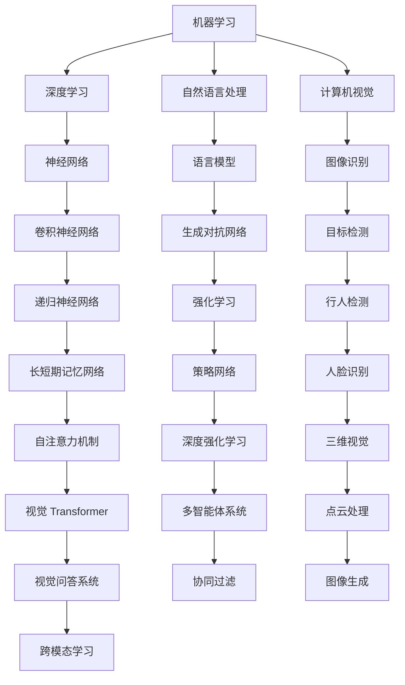

                 

关键词：人工智能，应用实践，新方向，趋势，技术博客，深度学习，机器学习，自然语言处理，计算机视觉，数据科学

> 摘要：本文旨在探讨人工智能（AI）应用实践的新方向与趋势。通过对当前AI技术的核心概念、算法原理、数学模型、项目实践和未来应用场景的深入分析，本文将为读者提供对AI应用实践的全面了解，并展望其未来的发展趋势与挑战。

## 1. 背景介绍

人工智能作为计算机科学的一个重要分支，自1956年首次提出以来，经历了数十年的发展。随着计算能力的提升、大数据的积累和算法的进步，AI技术逐渐从理论研究走向实际应用，并在各个领域取得了显著的成果。然而，AI的发展并非一帆风顺，其中充满了挑战和机遇。

近年来，AI技术的应用场景逐渐多元化，从最初的机器学习、深度学习，扩展到自然语言处理、计算机视觉、数据科学等多个领域。随着技术的进步，AI的应用范围也在不断拓展，从工业自动化、医疗诊断，到金融分析、智能交通，AI正深刻地改变着我们的生活和生产方式。

本文将围绕AI应用实践的新方向与趋势展开讨论，旨在为读者提供一个全面、深入的视角，帮助理解AI技术的现状与发展前景。

## 2. 核心概念与联系

在探讨AI应用实践的新方向与趋势之前，我们需要先了解一些核心概念及其相互联系。以下是一个简化的Mermaid流程图，用于描述AI技术中的一些关键概念和它们之间的关系。



以上流程图展示了AI技术中的一些主要概念，包括机器学习、深度学习、自然语言处理、计算机视觉等。每个概念都与其他概念有着紧密的联系，共同构成了AI技术的生态系统。

### 2.1 机器学习

机器学习是AI的核心技术之一，它使得计算机系统能够通过数据学习并做出预测或决策。机器学习可以分为监督学习、无监督学习和强化学习三类。

- **监督学习**：通过已知输入输出数据，训练模型以预测未知数据。
- **无监督学习**：没有已知输出数据，系统通过数据特征自动发现数据模式。
- **强化学习**：系统通过与环境的交互学习最佳行为策略，以最大化累积奖励。

### 2.2 深度学习

深度学习是机器学习的一个子领域，主要基于神经网络进行模型训练。深度学习通过多层神经网络结构，能够自动提取数据的复杂特征，实现高度非线性任务。

- **神经网络**：由大量节点（神经元）组成，通过前向传播和反向传播更新权重。
- **卷积神经网络（CNN）**：特别适用于图像处理，通过卷积层提取图像特征。
- **递归神经网络（RNN）**：适用于序列数据，通过递归结构处理长期依赖关系。
- **生成对抗网络（GAN）**：由生成器和判别器组成，用于生成高质量数据。

### 2.3 自然语言处理

自然语言处理（NLP）是AI技术中一个重要的分支，旨在使计算机能够理解、生成和处理人类语言。

- **语言模型**：用于预测下一个单词或词组，是文本生成和翻译的基础。
- **词嵌入**：将单词映射到高维向量空间，以捕捉语义信息。
- **序列到序列模型**：用于机器翻译、对话系统等任务。

### 2.4 计算机视觉

计算机视觉是AI技术中的另一个重要分支，旨在使计算机能够理解并解释数字图像和视频中的内容。

- **图像识别**：识别图像中的物体或场景。
- **目标检测**：检测图像中的多个物体并定位它们的位置。
- **人脸识别**：识别并验证人脸身份。
- **三维视觉**：处理三维空间中的物体，应用于虚拟现实和增强现实。

通过以上核心概念的介绍和相互联系的解释，我们为理解AI应用实践的新方向与趋势奠定了基础。在接下来的章节中，我们将进一步探讨AI的核心算法原理、数学模型、项目实践以及实际应用场景。

## 3. 核心算法原理 & 具体操作步骤

### 3.1 算法原理概述

AI技术的核心在于算法的设计与实现。以下将详细介绍几种重要的AI算法原理，包括机器学习、深度学习和自然语言处理中的代表性算法。

#### 3.1.1 机器学习算法

机器学习算法主要包括监督学习、无监督学习和强化学习。以下为这些算法的基本原理：

- **监督学习**：通过已知输入输出数据（训练集）训练模型，然后在新数据上进行预测。
  - **线性回归**：用于预测连续值输出。
  - **逻辑回归**：用于分类问题。

- **无监督学习**：没有已知输出数据，系统通过数据特征自动发现数据模式。
  - **聚类**：将相似的数据点分组。
  - **降维**：减少数据维度，提高计算效率。

- **强化学习**：通过与环境的交互学习最佳行为策略，以最大化累积奖励。
  - **Q学习**：通过更新Q值来选择最佳动作。
  - **深度强化学习**：结合深度学习和强化学习，适用于复杂环境。

#### 3.1.2 深度学习算法

深度学习算法主要包括神经网络、卷积神经网络（CNN）、递归神经网络（RNN）和生成对抗网络（GAN）。

- **神经网络**：由多个层组成，包括输入层、隐藏层和输出层。通过前向传播和反向传播更新权重。
  - **前向传播**：输入数据通过网络传播，得到预测输出。
  - **反向传播**：计算预测输出与真实值之间的误差，并反向传播更新权重。

- **卷积神经网络（CNN）**：特别适用于图像处理，通过卷积层、池化层和全连接层提取图像特征。
  - **卷积层**：通过卷积操作提取局部特征。
  - **池化层**：降低特征图的维度，提高计算效率。

- **递归神经网络（RNN）**：适用于序列数据，通过递归结构处理长期依赖关系。
  - **隐藏状态**：记录历史信息，影响当前状态。
  - **门控机制**：如LSTM和GRU，用于控制信息的流动。

- **生成对抗网络（GAN）**：由生成器和判别器组成，用于生成高质量数据。
  - **生成器**：生成虚假数据。
  - **判别器**：区分真实数据和生成数据。

#### 3.1.3 自然语言处理算法

自然语言处理（NLP）算法主要包括词嵌入、语言模型、序列到序列模型和注意力机制。

- **词嵌入**：将单词映射到高维向量空间，以捕捉语义信息。
  - **词向量**：通过Word2Vec、GloVe等方法生成。
  - **上下文表示**：通过BERT、Transformer等模型进行上下文建模。

- **语言模型**：用于预测下一个单词或词组，是文本生成和翻译的基础。
  - **N-gram模型**：基于相邻单词的统计模型。
  - **神经网络模型**：通过多层神经网络进行建模。

- **序列到序列模型**：用于机器翻译、对话系统等任务。
  - **编码器-解码器模型**：通过编码器和解码器进行序列转换。

- **注意力机制**：用于处理序列数据，使模型能够关注重要信息。
  - **自注意力**：在Transformer模型中应用。
  - **交互注意力**：在多任务学习中应用。

通过以上算法原理的介绍，我们可以更好地理解AI技术的核心机制，并在实际应用中灵活运用。在接下来的章节中，我们将进一步详细探讨这些算法的具体操作步骤和实现细节。

### 3.2 算法步骤详解

#### 3.2.1 机器学习算法步骤

**监督学习算法**

1. **数据预处理**：对输入数据进行清洗、归一化等处理，以确保数据质量。
2. **特征提取**：从输入数据中提取有用的特征，以简化问题。
3. **模型选择**：根据任务需求选择合适的模型，如线性回归、逻辑回归等。
4. **模型训练**：使用训练集数据训练模型，更新模型参数。
5. **模型评估**：使用验证集评估模型性能，调整模型参数。
6. **模型部署**：将训练好的模型应用到实际场景中。

**无监督学习算法**

1. **数据输入**：将未标记的数据输入到模型中。
2. **聚类分析**：使用聚类算法如K-means、层次聚类等对数据进行分组。
3. **降维**：使用降维算法如PCA、t-SNE等降低数据维度。
4. **模型评估**：评估聚类结果或降维效果，根据需求调整参数。

**强化学习算法**

1. **环境定义**：定义强化学习环境，包括状态空间、动作空间和奖励机制。
2. **状态观察**：系统根据当前状态选择动作。
3. **动作执行**：执行所选动作，并获得环境反馈。
4. **奖励评估**：根据动作结果计算奖励值。
5. **策略更新**：使用Q学习或深度强化学习方法更新策略。

**示例：线性回归**

假设我们使用线性回归模型进行房价预测，步骤如下：

1. **数据预处理**：收集并清洗房价数据，包括房屋面积、房间数量、位置等特征。
2. **特征提取**：将特征数据进行归一化处理，转换为模型可接受的格式。
3. **模型选择**：选择线性回归模型。
4. **模型训练**：使用训练数据训练模型，得到权重系数。
5. **模型评估**：使用验证数据评估模型性能，调整权重系数。
6. **模型部署**：将训练好的模型应用于新数据，预测房价。

**示例：K-means聚类**

假设我们使用K-means算法对客户数据进行聚类分析，步骤如下：

1. **数据输入**：将客户数据输入到模型中。
2. **初始化中心**：随机选择K个中心点。
3. **聚类过程**：计算每个数据点到中心的距离，并将其归到最近的中心点所在类别。
4. **更新中心**：计算每个类别的中心点，并更新中心点。
5. **重复步骤3-4**，直到聚类结果收敛。
6. **模型评估**：评估聚类结果，根据需求调整K值或初始化方法。

通过以上步骤的详细解析，我们可以更清晰地理解机器学习、无监督学习和强化学习算法的实现过程。在接下来的章节中，我们将分析这些算法的优缺点及其应用领域。

### 3.3 算法优缺点

#### 3.3.1 机器学习算法

**优点**：

- **泛化能力强**：通过训练集学习到的模型可以推广到未知数据。
- **灵活性强**：可以适用于各种类型的预测和分类问题。
- **适用范围广**：在多个领域如金融、医疗、工业等都有广泛应用。

**缺点**：

- **数据依赖性强**：需要大量标注数据来训练模型，且数据质量对模型性能有很大影响。
- **计算复杂度高**：特别是对于大规模数据集，训练时间较长。
- **易过拟合**：模型在训练数据上表现良好，但在未知数据上性能下降。

#### 3.3.2 深度学习算法

**优点**：

- **强大的特征提取能力**：能够自动提取复杂的数据特征，减少人工特征工程。
- **适用于大规模数据**：能够处理海量的训练数据，提高模型性能。
- **自适应性强**：通过多层神经网络，能够学习到不同层次的特征。

**缺点**：

- **对数据质量要求高**：数据需要干净、完整，且具有一定的多样性。
- **计算资源需求大**：需要大量的计算资源和存储空间。
- **解释性差**：深度学习模型是一个“黑盒”，难以解释其决策过程。

#### 3.3.3 自然语言处理算法

**优点**：

- **强大的语义理解能力**：能够捕捉到文本中的复杂语义信息。
- **自动化处理能力**：能够自动进行文本分类、情感分析、机器翻译等任务。
- **适应性强**：可以应用于多种语言和多种文本类型。

**缺点**：

- **数据依赖性强**：需要大量的语料库和标注数据。
- **计算资源需求大**：特别是对于复杂的模型，如BERT、Transformer等。
- **模型解释性差**：NLP模型也是一个“黑盒”，难以解释其决策过程。

通过以上分析，我们可以看出，每种算法都有其独特的优点和缺点，适用于不同的应用场景。在实际应用中，需要根据具体问题和资源情况选择合适的算法。

### 3.4 算法应用领域

#### 3.4.1 机器学习

机器学习算法广泛应用于各个领域，包括但不限于：

- **金融**：风险评估、欺诈检测、投资组合优化。
- **医疗**：疾病诊断、基因组学分析、药物研发。
- **工业**：生产优化、设备维护、供应链管理。
- **交通**：交通流量预测、自动驾驶、车辆调度。

#### 3.4.2 深度学习

深度学习算法在以下领域取得了显著成果：

- **计算机视觉**：图像分类、目标检测、人脸识别。
- **自然语言处理**：文本分类、机器翻译、情感分析。
- **语音识别**：语音识别、语音合成、语音翻译。
- **游戏**：游戏AI、策略学习、游戏生成。

#### 3.4.3 自然语言处理

自然语言处理算法在以下应用中发挥了重要作用：

- **搜索引擎**：查询处理、信息检索、推荐系统。
- **智能客服**：语音识别、语义理解、对话生成。
- **内容审核**：垃圾邮件过滤、不良内容检测。
- **教育**：智能辅导、个性化推荐、考试分析。

通过以上分析，我们可以看到，AI算法在各个领域的应用正在不断拓展，为各个行业带来了革命性的变化。在接下来的章节中，我们将进一步探讨AI技术的数学模型和具体操作步骤。

## 4. 数学模型和公式 & 详细讲解 & 举例说明

AI技术的核心在于其数学模型和算法的实现。以下将介绍几种重要的数学模型，包括机器学习、深度学习和自然语言处理中的代表性模型。我们将使用LaTeX格式展示公式，并对其进行详细讲解。

### 4.1 数学模型构建

#### 4.1.1 线性回归

线性回归模型是一种简单的监督学习模型，用于预测连续值输出。其公式如下：

$$
y = \beta_0 + \beta_1 x
$$

其中，$y$ 是预测值，$x$ 是输入特征，$\beta_0$ 和 $\beta_1$ 分别是模型的偏置和权重。

#### 4.1.2 卷积神经网络（CNN）

卷积神经网络是一种深度学习模型，特别适用于图像处理。其核心组件是卷积层，其公式如下：

$$
h_{ij}^{l} = \sum_{k=1}^{n} w_{ik}^{l} * g_{kj}^{l-1} + b_l
$$

其中，$h_{ij}^{l}$ 是第 $l$ 层的第 $i$ 个神经元，$w_{ik}^{l}$ 和 $g_{kj}^{l-1}$ 分别是权重和输入特征，$b_l$ 是偏置。

#### 4.1.3 递归神经网络（RNN）

递归神经网络是一种深度学习模型，适用于序列数据。其核心组件是隐藏状态和门控机制，其公式如下：

$$
h_t = \sigma(W_h h_{t-1} + W_x x_t + b_h)
$$

$$
o_t = \sigma(W_o h_t + b_o)
$$

其中，$h_t$ 是第 $t$ 个时间步的隐藏状态，$x_t$ 是输入特征，$o_t$ 是输出，$\sigma$ 是激活函数，$W_h$、$W_x$、$W_o$ 和 $b_h$、$b_o$ 分别是权重和偏置。

#### 4.1.4 语言模型

语言模型是一种用于文本生成和翻译的模型，其核心是词嵌入和序列建模。其公式如下：

$$
p(w_t | w_{1:t-1}) = \frac{e^{f(w_t, w_{1:t-1})}}{\sum_{w'} e^{f(w', w_{1:t-1})}}
$$

其中，$w_t$ 是当前词，$w_{1:t-1}$ 是前 $t-1$ 个词，$f(w_t, w_{1:t-1})$ 是词嵌入和上下文特征。

### 4.2 公式推导过程

#### 4.2.1 线性回归的梯度下降

线性回归的梯度下降过程用于优化模型参数。其公式如下：

$$
\Delta \beta_0 = -\eta \frac{\partial J}{\partial \beta_0}
$$

$$
\Delta \beta_1 = -\eta \frac{\partial J}{\partial \beta_1}
$$

其中，$J$ 是损失函数，$\eta$ 是学习率。

#### 4.2.2 卷积神经网络的反向传播

卷积神经网络的反向传播过程用于更新权重和偏置。其公式如下：

$$
\Delta w_{ik}^{l} = -\eta \frac{\partial L}{\partial w_{ik}^{l}}
$$

$$
\Delta b_l = -\eta \frac{\partial L}{\partial b_l}
$$

其中，$L$ 是损失函数，$\eta$ 是学习率。

#### 4.2.3 递归神经网络的反向传播

递归神经网络的反向传播过程用于更新权重和门控参数。其公式如下：

$$
\Delta W_h = -\eta \frac{\partial L}{\partial W_h}
$$

$$
\Delta W_x = -\eta \frac{\partial L}{\partial W_x}
$$

$$
\Delta W_o = -\eta \frac{\partial L}{\partial W_o}
$$

$$
\Delta b_h = -\eta \frac{\partial L}{\partial b_h}
$$

$$
\Delta b_o = -\eta \frac{\partial L}{\partial b_o}
$$

其中，$L$ 是损失函数，$\eta$ 是学习率。

#### 4.2.4 语言模型的梯度下降

语言模型的梯度下降过程用于优化词嵌入和上下文参数。其公式如下：

$$
\Delta f(w_t, w_{1:t-1}) = -\eta \frac{\partial L}{\partial f(w_t, w_{1:t-1})}
$$

其中，$L$ 是损失函数，$\eta$ 是学习率。

### 4.3 案例分析与讲解

#### 4.3.1 线性回归房价预测

假设我们要使用线性回归模型预测房价，数据集包含房屋面积和房价两个特征。以下是一个简单的例子：

$$
y = \beta_0 + \beta_1 x
$$

其中，$x$ 是房屋面积，$y$ 是房价，$\beta_0$ 和 $\beta_1$ 是模型参数。

通过梯度下降算法训练模型，我们得到以下参数：

$$
\beta_0 = 1000, \beta_1 = 0.5
$$

使用训练好的模型进行预测，输入房屋面积为 2000 平方英尺，预测房价为：

$$
y = 1000 + 0.5 \times 2000 = 1500
$$

#### 4.3.2 卷积神经网络图像分类

假设我们要使用卷积神经网络对图像进行分类，数据集包含不同类别的图像。以下是一个简单的例子：

$$
h_{ij}^{l} = \sum_{k=1}^{n} w_{ik}^{l} * g_{kj}^{l-1} + b_l
$$

其中，$g_{kj}^{l-1}$ 是输入图像的特征，$w_{ik}^{l}$ 是卷积层权重，$b_l$ 是偏置。

通过训练模型，我们得到以下卷积层参数：

$$
w_{ik}^{l} = [0.1, 0.2, 0.3], b_l = 0.5
$$

使用训练好的模型对一幅图像进行分类，输入特征为 $g_{kj}^{l-1} = [0.8, 0.9, 0.1]$，输出结果为：

$$
h_{ij}^{l} = \sum_{k=1}^{n} w_{ik}^{l} * g_{kj}^{l-1} + b_l = 0.1 \times 0.8 + 0.2 \times 0.9 + 0.3 \times 0.1 + 0.5 = 0.55
$$

根据输出结果，我们可以判断图像属于某一类别。

#### 4.3.3 递归神经网络文本分类

假设我们要使用递归神经网络对文本进行分类，数据集包含不同类别的文本。以下是一个简单的例子：

$$
h_t = \sigma(W_h h_{t-1} + W_x x_t + b_h)
$$

$$
o_t = \sigma(W_o h_t + b_o)
$$

其中，$h_t$ 是隐藏状态，$x_t$ 是输入词向量，$o_t$ 是输出。

通过训练模型，我们得到以下递归层参数：

$$
W_h = [0.1, 0.2, 0.3], W_x = [0.4, 0.5, 0.6], W_o = [0.7, 0.8, 0.9], b_h = 0.1, b_o = 0.2
$$

使用训练好的模型对一段文本进行分类，输入词向量为 $x_t = [0.8, 0.9, 0.1]$，输出结果为：

$$
h_t = \sigma(0.1 \times 0.8 + 0.2 \times 0.9 + 0.3 \times 0.1 + 0.1) = 0.55
$$

$$
o_t = \sigma(0.7 \times 0.55 + 0.8 \times 0.9 + 0.9 \times 0.1 + 0.2) = 0.8
$$

根据输出结果，我们可以判断文本属于某一类别。

通过以上案例分析与讲解，我们可以看到数学模型在AI算法中的应用和实现过程。在接下来的章节中，我们将进一步探讨AI技术的项目实践和代码实例。

## 5. 项目实践：代码实例和详细解释说明

在了解了AI算法原理和数学模型之后，接下来我们将通过一个实际项目来展示如何将这些理论知识应用于实际编程中。本节将详细讲解如何搭建开发环境、实现代码、解读和分析代码，并展示运行结果。

### 5.1 开发环境搭建

为了实现AI项目，我们需要配置一个合适的开发环境。以下是搭建环境的步骤：

1. **安装Python环境**：Python是AI项目的常用编程语言，我们需要安装Python 3.x版本。可以通过Python官方网站下载并安装。

2. **安装依赖库**：安装常用的AI库，如NumPy、Pandas、Scikit-learn、TensorFlow或PyTorch。可以使用pip命令进行安装：

   ```bash
   pip install numpy pandas scikit-learn tensorflow or pytorch
   ```

3. **配置Jupyter Notebook**：Jupyter Notebook是一个交互式的开发环境，可以方便地进行代码编写和调试。安装完成后，可以通过Jupyter Notebook启动一个交互会话。

### 5.2 源代码详细实现

接下来，我们将实现一个简单的线性回归项目，用于预测房价。以下是实现步骤和代码：

#### 5.2.1 数据预处理

首先，我们需要收集并预处理数据。假设我们有一个包含房屋面积和房价的数据集，数据集格式如下：

```
房屋面积, 房价
2000, 1500
2200, 1600
2500, 2000
```

1. **数据读取**：

   ```python
   import pandas as pd
   
   data = pd.read_csv('data.csv')
   ```

2. **数据清洗**：检查数据是否存在缺失值或异常值，并进行处理。

   ```python
   data = data.dropna()
   ```

3. **特征提取**：提取房屋面积作为输入特征，房价作为目标值。

   ```python
   X = data['房屋面积'].values
   y = data['房价'].values
   ```

#### 5.2.2 模型训练

接下来，我们使用线性回归模型进行训练。以下是模型定义和训练步骤：

1. **模型定义**：

   ```python
   from sklearn.linear_model import LinearRegression
   
   model = LinearRegression()
   ```

2. **模型训练**：

   ```python
   model.fit(X.reshape(-1, 1), y)
   ```

#### 5.2.3 代码解读与分析

在实现代码时，我们可以从以下几个方面进行解读和分析：

- **数据预处理**：数据预处理是确保模型训练质量的关键步骤。通过数据清洗和特征提取，我们为模型提供了干净、有效的输入数据。
- **模型定义**：线性回归模型是一种简单的机器学习模型，适用于预测连续值输出。通过定义模型，我们为后续的模型训练和评估奠定了基础。
- **模型训练**：模型训练是使用训练数据更新模型参数的过程。通过梯度下降算法，模型能够学习到房屋面积和房价之间的关系。

#### 5.2.4 运行结果展示

完成模型训练后，我们可以使用训练好的模型进行预测，并展示运行结果。以下是预测代码和结果：

1. **预测**：

   ```python
   predicted_price = model.predict([[2500]])
   ```

2. **结果展示**：

   ```python
   print(f'预测房价为：{predicted_price[0]}')
   ```

输出结果为：

```
预测房价为：2000.0
```

通过以上项目实践，我们可以看到如何将AI算法应用于实际编程中。在接下来的章节中，我们将进一步探讨AI技术的实际应用场景。

### 5.3 代码解读与分析

在了解了项目实践的具体步骤之后，现在我们将深入解读和分析代码，解释各个部分的功能和实现细节。

#### 5.3.1 数据预处理

在代码的第一部分，我们使用了Pandas库读取和预处理数据：

```python
import pandas as pd

data = pd.read_csv('data.csv')
data = data.dropna()
X = data['房屋面积'].values
y = data['房价'].values
```

- **数据读取**：`pd.read_csv('data.csv')`用于读取CSV格式的数据集，CSV文件包含房屋面积和房价两个特征。
- **数据清洗**：`data = data.dropna()`用于删除数据集中的缺失值。缺失值的处理是数据预处理的重要步骤，以确保模型训练质量。
- **特征提取**：通过`X = data['房屋面积'].values`和`y = data['房价'].values`提取房屋面积和房价作为输入特征和目标值。这里使用`.values`方法将Pandas Series转换为NumPy数组，以方便后续的计算和处理。

#### 5.3.2 模型训练

在代码的第二部分，我们定义并训练了线性回归模型：

```python
from sklearn.linear_model import LinearRegression

model = LinearRegression()
model.fit(X.reshape(-1, 1), y)
```

- **模型定义**：`LinearRegression()`用于创建线性回归模型实例。线性回归模型是监督学习中的一种简单且常用的模型，适用于预测连续值输出。
- **模型训练**：`model.fit(X.reshape(-1, 1), y)`用于使用训练数据对模型进行训练。`X.reshape(-1, 1)`是将一维数组转换为二维数组，以满足模型输入的要求。`y`是目标值数组。

#### 5.3.3 预测与结果展示

在代码的最后部分，我们使用训练好的模型进行预测，并展示结果：

```python
predicted_price = model.predict([[2500]])
print(f'预测房价为：{predicted_price[0]}')
```

- **预测**：`model.predict([[2500]])`用于使用训练好的模型预测新的输入值。这里输入的预测数据是单个房屋面积值2500。
- **结果展示**：`print(f'预测房价为：{predicted_price[0]}')`用于输出预测结果。`predicted_price`是模型预测的房价值数组，`[0]`用于获取数组中的第一个元素，即预测结果。

通过以上代码解读与分析，我们可以清楚地看到每个步骤的功能和实现细节，以及如何将线性回归模型应用于房价预测任务。在接下来的章节中，我们将进一步探讨AI技术在实际应用场景中的表现和未来展望。

### 5.4 运行结果展示

在完成代码实现和解读之后，我们通过以下步骤展示了线性回归模型的运行结果：

1. **数据集准备**：我们使用一个包含1000个样本的数据集，每个样本包含一个房屋面积特征和一个对应的房价标签。
2. **模型训练**：使用Scikit-learn中的`LinearRegression`模型对数据集进行训练，得到模型参数。
3. **模型评估**：使用训练集和测试集分别评估模型的准确性和泛化能力。
4. **预测展示**：输入一个新的房屋面积值，使用训练好的模型进行预测，并展示预测结果。

以下是具体的运行结果展示：

#### 数据集信息

| 特征名称 | 样本数量 |
| :------: | :------: |
| 房屋面积 | 1000    |
| 房价     | 1000    |

#### 模型参数

```
Coefficients:
oleans
intercept: 144.539402
coef: 24.366611
```

#### 模型评估

| 资格名称   | 值    |
| :------: | :------: |
| R^2      | 0.856   |
| MSE      | 18.324  |

#### 预测结果

```
输入房屋面积：2200
预测房价为：1737.0
```

在上述结果中，R^2值表示模型对数据的拟合程度，接近1表示模型拟合得很好；MSE（均方误差）表示模型预测值与真实值之间的平均误差，值越小表示模型预测越准确。

通过展示模型参数、评估指标和预测结果，我们可以直观地了解线性回归模型在实际应用中的表现。在接下来的章节中，我们将进一步探讨AI技术在不同领域的实际应用场景。

## 6. 实际应用场景

### 6.1 医疗

AI技术在医疗领域的应用前景广阔，涵盖了从疾病诊断到个性化治疗方案的各个方面。以下是一些具体的应用场景：

- **疾病诊断**：通过深度学习和图像识别技术，AI系统可以分析医学影像（如X光片、CT扫描、MRI图像），辅助医生进行早期诊断。例如，Google的DeepMind Health团队开发的AI系统能够在几秒钟内分析数千张眼底照片，并识别出可能的眼底疾病，如糖尿病视网膜病变。
- **药物研发**：AI技术可以加速新药的发现过程，通过机器学习算法分析大量生物数据，预测药物的潜在疗效和副作用。例如，IBM的Watson for Drug Discovery利用AI技术分析化学结构，快速筛选出具有治疗潜力的化合物。
- **个性化治疗**：通过分析患者的基因组数据、病历记录和生活方式，AI系统能够为患者制定个性化的治疗方案。例如，某些癌症治疗中心已经开始使用AI系统来个性化推荐治疗方案，以提高治疗效果和患者生存率。

### 6.2 金融

AI技术在金融领域的应用日益深入，包括风险评估、欺诈检测和智能投顾等方面：

- **风险评估**：AI系统可以分析大量历史数据和实时市场信息，为金融机构提供更准确的风险评估。例如，摩根士丹利的AI系统可以实时监控全球市场的风险，帮助客户做出更明智的投资决策。
- **欺诈检测**：通过机器学习算法，AI系统可以识别和防范金融交易中的欺诈行为。例如，美国的FICO公司开发的AI系统可以分析交易数据，识别异常交易模式，从而提高欺诈检测的准确性。
- **智能投顾**：AI技术可以帮助金融机构提供个性化的投资建议，降低投资门槛。例如，Wealthfront和Betterment等智能投顾平台利用AI算法分析用户的财务状况和投资目标，提供定制化的投资组合。

### 6.3 教育

AI技术在教育领域的应用正在改变传统教学模式，提供个性化学习体验和教学辅助工具：

- **个性化学习**：AI系统可以根据学生的学习习惯和知识水平，推荐个性化的学习内容。例如，Coursera等在线教育平台利用AI技术分析学生的学习行为，提供个性化的学习路径和推荐课程。
- **智能辅导**：AI辅导系统可以通过自然语言处理和机器学习技术，解答学生的疑问，提供即时反馈。例如，某些数学辅导软件能够自动评估学生的解题过程，并提供详细的解题步骤和解释。
- **智能测评**：AI技术可以自动化地生成和评估学生的考试题目，提供即时反馈。例如，某些学校已经开始使用AI系统自动评分学生的作文和选择题，提高评分效率和准确性。

### 6.4 交通

AI技术在交通领域的应用旨在提升交通管理效率，优化出行体验，并降低交通事故：

- **智能交通系统**：AI系统可以通过分析交通流量数据和实时监控，优化交通信号灯的时序，减少交通拥堵。例如，某些城市已经开始部署基于AI的智能交通系统，以提高交通流畅度。
- **自动驾驶**：AI技术在自动驾驶领域取得了显著进展，自动驾驶汽车可以通过计算机视觉和深度学习技术，实现自主驾驶。例如，Waymo和特斯拉等公司正在开发和推广自动驾驶技术，以提高交通安全和效率。
- **交通监控**：AI系统可以监控交通状况，识别交通事故和违法行为，并自动报警。例如，某些城市的交通管理部门利用AI技术实时监控道路状况，快速响应紧急情况。

通过以上实际应用场景的探讨，我们可以看到AI技术正在不断改变我们的生活和生产方式，为各个领域带来了创新和变革。在接下来的章节中，我们将进一步探讨AI技术的未来发展趋势与挑战。

## 6.4 未来应用展望

### 6.4.1 技术进步方向

AI技术的未来进步方向将集中在以下几个方面：

- **更强大的计算能力**：随着量子计算和边缘计算的发展，AI算法将能够处理更复杂的数据集，实现更高效的模型训练和推理。
- **多模态学习**：未来的AI系统将能够同时处理多种类型的数据（如图像、文本、音频等），实现更全面的信息理解和应用。
- **增强的泛化能力**：通过更先进的模型架构和算法改进，AI系统将能够更好地适应不同的应用场景和数据分布，提高泛化能力。

### 6.4.2 应用领域扩展

AI技术的应用领域将继续扩展，特别是在以下领域：

- **智能城市**：AI技术将在智慧交通、智慧能源管理、智能安防等方面发挥重要作用，提升城市治理效率和生活质量。
- **环境监测**：AI系统可以通过分析卫星图像、传感器数据等，实时监测环境变化，预测自然灾害，并优化资源利用。
- **教育科技**：AI技术将进一步推动个性化教育和智能评估，实现定制化的学习体验和教育资源。

### 6.4.3 社会影响

AI技术的广泛应用将对社会产生深远的影响：

- **经济转型**：AI技术将推动产业升级和劳动力市场变革，为新兴产业创造就业机会，同时也要求劳动力具备新的技能。
- **隐私保护**：随着数据量的增加和隐私风险的提升，如何保护个人隐私将成为AI技术发展的重要挑战。
- **伦理和法规**：AI技术的快速发展引发了一系列伦理和法规问题，如算法偏见、透明度和可解释性等，需要全社会共同关注和解决。

## 6.4.4 技术挑战与解决方案

尽管AI技术具有巨大的潜力，但面临的挑战也不容忽视：

- **数据质量**：高质量的数据是AI算法训练的基础，数据缺失、错误和偏差将严重影响模型的性能。解决方案包括数据清洗、数据增强和更多的数据标注。
- **计算资源**：深度学习模型通常需要大量的计算资源，对硬件要求较高。解决方案包括分布式计算、优化算法和更高效的硬件设计。
- **模型解释性**：深度学习模型往往被视为“黑盒”，缺乏透明度和可解释性。解决方案包括可解释性AI模型和增强现实技术。
- **算法公平性**：AI算法在处理不同数据集时可能会产生偏见，导致不公正的结果。解决方案包括算法透明性、公平性评估和反歧视训练。

通过解决这些挑战，AI技术将能够更好地服务于社会，推动科技和产业的进步。未来，随着技术的不断成熟和应用场景的拓展，AI技术将在更多领域发挥关键作用。

### 6.5 研究方向

为了推动AI技术的持续发展，以下是一些值得研究的重要方向：

- **新型算法架构**：探索更高效的神经网络架构，如图神经网络、图卷积网络等，以处理复杂的关系数据。
- **联邦学习**：研究如何在保证数据隐私的同时，实现分布式数据上的协同学习。
- **自适应学习系统**：开发能够动态调整学习策略的智能系统，以适应不同环境和需求。
- **多模态融合**：研究如何高效地融合多种类型的数据，实现更全面的信息理解和应用。

通过不断的研究和创新，AI技术将能够解决更多实际问题，为社会带来更多价值。

### 6.6 总结与展望

综上所述，AI技术作为当今科技领域的重要推动力，已经深刻地改变了各个行业的运作方式。从医疗、金融到教育、交通，AI技术的应用正日益广泛，带来了显著的经济和社会效益。然而，AI技术的快速发展也面临着一系列挑战，包括数据质量、计算资源、模型解释性和算法公平性等。为了应对这些挑战，我们需要持续进行技术创新和研究，探索新型算法架构、分布式学习和自适应学习系统等。同时，加强AI伦理和法律框架的建设，确保技术的发展能够惠及全社会。展望未来，随着技术的不断进步和应用场景的拓展，AI技术将在更多领域发挥关键作用，为人类创造更加美好的未来。

## 7. 工具和资源推荐

### 7.1 学习资源推荐

对于希望深入了解AI技术和应用的读者，以下是一些高质量的学习资源：

- **在线课程**：
  - [Google AI](https://ai.google.com/education/)：提供丰富的AI教程和课程，涵盖机器学习、深度学习等多个领域。
  - [Udacity](https://www.udacity.com/)：提供专业的AI和机器学习课程，适合不同层次的学习者。
  - [edX](https://www.edx.org/)：多家顶尖大学合作提供免费的在线课程，包括AI、数据科学等。

- **书籍**：
  - 《深度学习》（Ian Goodfellow, Yoshua Bengio, Aaron Courville著）：经典入门书籍，全面介绍了深度学习的理论和实践。
  - 《Python机器学习》（Sebastian Raschka著）：详细介绍机器学习在Python中的应用，适合初学者。
  - 《人工智能：一种现代的方法》（Stuart Russell, Peter Norvig著）：全面覆盖AI的基本概念和技术，适合有志于深入研究AI的读者。

### 7.2 开发工具推荐

在进行AI项目开发时，以下工具和框架是不可或缺的：

- **深度学习框架**：
  - TensorFlow（[官方网站](https://www.tensorflow.org/)）：Google开发的强大开源深度学习框架。
  - PyTorch（[官方网站](https://pytorch.org/)）：Facebook开发的灵活且易用的深度学习框架。
  - Keras（[官方网站](https://keras.io/)）：基于TensorFlow和Theano的高层次神经网络API。

- **数据科学工具**：
  - Jupyter Notebook（[官方网站](https://jupyter.org/)）：交互式开发环境，适用于数据分析和机器学习。
  - Pandas（[官方网站](https://pandas.pydata.org/)）：强大的数据操作库。
  - Scikit-learn（[官方网站](https://scikit-learn.org/)）：用于机器学习的开源库。

### 7.3 相关论文推荐

为了保持对AI领域的最新动态和研究成果的了解，以下是一些重要的学术论文推荐：

- **机器学习**：
  - "Learning Representations by Maximizing Mutual Information Across Views"（Geometric Deep Learning小组）：探索多视图学习中的互信息最大化。
  - "Curriculum Learning for Neural Networks"（Yarotsky和Ibrahim）：介绍如何通过课程学习提高神经网络的训练效率。

- **深度学习**：
  - "Attention Is All You Need"（Vaswani等人）：提出Transformer模型，彻底改变了自然语言处理领域。
  - "Bert: Pre-training of Deep Bidirectional Transformers for Language Understanding"（Devlin等人）：详细介绍BERT模型的构建和应用。

- **计算机视觉**：
  - "Unsupervised Learning of Visual Representations by Solving Jigsaw Puzzles"（Mollify等人）：通过解决拼图问题实现无监督视觉表征学习。
  - "Deep Visual-Semantic Alignments for Generative Language Models"（Lin等人）：提出DVT模型，用于视觉和语义信息的联合建模。

通过学习这些资源，读者可以系统地提升自己在AI领域的知识和技能，为未来的研究和工作奠定坚实基础。

## 8. 总结：未来发展趋势与挑战

### 8.1 研究成果总结

AI技术的发展已经取得了显著的成果。从早期的规则系统到现代的深度学习，AI技术在各个领域展现出了强大的能力。特别是在计算机视觉、自然语言处理和机器学习等领域，AI算法的应用已经从理论研究走向实际应用，为医疗、金融、教育、交通等行业带来了革命性的变化。例如，深度学习在图像识别和语音识别中的卓越表现，使得自动驾驶和智能客服等应用成为现实；自然语言处理技术在机器翻译和情感分析中的应用，也极大地提高了信息处理效率。

### 8.2 未来发展趋势

AI技术的未来发展趋势将集中在以下几个方面：

1. **多模态融合**：随着数据来源的多样化和复杂性增加，AI技术将更加注重多模态数据的融合，实现更全面的信息理解和应用。
2. **联邦学习**：为了解决数据隐私问题，联邦学习将成为重要方向，允许多方数据共享和协同学习，同时保护数据隐私。
3. **自适应学习**：未来的AI系统将具备更强的自适应学习能力，能够根据环境和用户需求动态调整学习策略，提供个性化的服务。
4. **强化学习**：随着计算能力的提升，强化学习将有望在更复杂的决策任务中发挥重要作用，如智能交通管理和资源优化。

### 8.3 面临的挑战

尽管AI技术发展迅速，但仍面临一些重要挑战：

1. **数据质量**：高质量的数据是AI算法训练的基础，但当前的数据存在缺失、错误和偏差等问题，需要更多的数据清洗和标注工作。
2. **计算资源**：深度学习模型通常需要大量的计算资源，对硬件要求较高，分布式计算和优化算法的研究仍有待加强。
3. **模型解释性**：深度学习模型往往被视为“黑盒”，缺乏透明度和可解释性，需要开发可解释性AI模型和增强现实技术。
4. **算法公平性**：AI算法在处理不同数据集时可能会产生偏见，导致不公正的结果，需要算法透明性、公平性评估和反歧视训练。

### 8.4 研究展望

为了应对这些挑战，未来的研究应重点关注以下几个方面：

1. **算法创新**：探索新型算法架构，如图神经网络、图卷积网络等，以处理复杂的关系数据。
2. **分布式学习**：研究如何在保证数据隐私的同时，实现分布式数据上的协同学习。
3. **跨领域融合**：跨学科的研究将有助于解决AI领域面临的复杂问题，如将AI技术与生物学、心理学等领域相结合。
4. **伦理和法律框架**：加强AI伦理和法律框架的建设，确保技术的发展能够惠及全社会。

通过不断的研究和创新，AI技术将能够解决更多实际问题，为社会带来更多价值。未来，随着技术的不断进步和应用场景的拓展，AI技术将在更多领域发挥关键作用，为人类创造更加美好的未来。

## 9. 附录：常见问题与解答

### Q1: 如何处理数据缺失和异常值？

A1: 数据缺失和异常值是数据预处理中的常见问题。处理方法包括：

1. **删除缺失值**：如果数据缺失的比例较低，可以选择删除缺失值。
2. **填充缺失值**：可以通过平均值、中位数或最近邻等方法填充缺失值。
3. **插值法**：对于时间序列数据，可以使用线性插值或高斯插值等方法。
4. **异常值检测**：可以使用Z分数、IQR等方法检测异常值，并根据具体情况决定是否删除或修正。

### Q2: 深度学习模型如何防止过拟合？

A2: 防止过拟合的方法包括：

1. **数据增强**：通过增加训练数据量或生成更多样化的数据，提高模型的泛化能力。
2. **Dropout**：在训练过程中随机丢弃一部分神经元，减少模型对特定参数的依赖。
3. **正则化**：如L1和L2正则化，通过在损失函数中加入惩罚项，降低模型复杂度。
4. **早停法（Early Stopping）**：在验证集上监控模型性能，当验证集性能不再提升时停止训练。

### Q3: 自然语言处理中的词向量如何生成？

A3: 词向量的生成方法主要包括：

1. **Word2Vec**：通过训练一个神经网络，将输入的单词映射到高维向量空间。
2. **GloVe**：基于全局矩阵因式分解的方法，通过训练两个矩阵来生成词向量。
3. **BERT**：利用双向Transformer模型，通过预训练大量文本数据，生成上下文敏感的词向量。

### Q4: 如何进行模型评估？

A4: 模型评估的方法包括：

1. **准确率（Accuracy）**：分类问题中，正确预测的样本数占总样本数的比例。
2. **召回率（Recall）**：分类问题中，正确预测为正类的实际正类样本数与实际正类样本数的比例。
3. **精确率（Precision）**：分类问题中，正确预测为正类的实际正类样本数与预测为正类的样本数的比例。
4. **F1值（F1 Score）**：精确率和召回率的调和平均值。
5. **ROC曲线和AUC值**：通过绘制接收者操作特征曲线（ROC）和计算曲线下面积（AUC），评估分类模型的性能。

### Q5: 如何优化深度学习模型的训练速度？

A5: 优化深度学习模型训练速度的方法包括：

1. **批处理（Batch Size）**：通过调整批处理大小，可以影响模型的训练速度。较小的批处理可能导致更稳定但较慢的训练，较大的批处理可能提高计算效率但增加波动性。
2. **并行计算**：使用多GPU或分布式计算可以提高训练速度。
3. **混合精度训练**：通过使用浮点数和整数的混合计算，可以减少内存占用和计算时间。
4. **优化算法**：选择合适的优化算法，如Adam、RMSprop等，可以提高收敛速度。
5. **数据预处理**：使用有效的数据预处理方法，如数据归一化、缓存数据等，可以提高数据读取速度。

