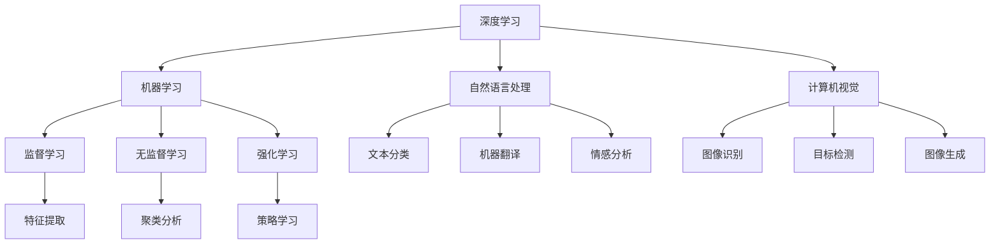

                 

关键词：人工智能应用，深度学习，机器学习，自然语言处理，计算机视觉，发展趋势，实践案例

> 摘要：本文将探讨当前人工智能（AI）应用的新趋势，包括深度学习、机器学习、自然语言处理和计算机视觉等领域的最新进展。我们将通过具体的案例和实践，分析这些技术的应用场景、实现方法和未来发展方向。

## 1. 背景介绍

人工智能作为计算机科学的一个重要分支，旨在使计算机系统具备人类智能的能力。随着计算能力的提升和大数据的涌现，人工智能技术得到了飞速发展。近年来，深度学习、机器学习、自然语言处理和计算机视觉等技术逐渐成熟，并广泛应用于各个领域，推动了社会生产力的提升。

### 1.1 深度学习

深度学习是机器学习的一个重要分支，通过多层神经网络模型模拟人脑的学习过程。近年来，随着计算能力的提升和大数据的涌现，深度学习在语音识别、图像识别、自然语言处理等领域取得了显著的突破。

### 1.2 机器学习

机器学习是一种通过数据驱动的方法，使计算机具备自主学习和决策能力的技术。机器学习包括监督学习、无监督学习和强化学习等不同的学习方式，广泛应用于数据挖掘、预测分析、推荐系统等领域。

### 1.3 自然语言处理

自然语言处理是人工智能的一个重要领域，旨在使计算机能够理解和处理自然语言。自然语言处理技术包括文本分类、机器翻译、情感分析等，广泛应用于搜索引擎、智能客服、智能助手等领域。

### 1.4 计算机视觉

计算机视觉是人工智能的一个重要分支，旨在使计算机能够理解和解释视觉信息。计算机视觉技术包括图像识别、目标检测、图像生成等，广泛应用于安防监控、医疗影像、自动驾驶等领域。

## 2. 核心概念与联系

以下是人工智能领域核心概念和架构的Mermaid流程图：



### 2.1 深度学习与机器学习的联系

深度学习是机器学习的一个重要分支，通过多层神经网络模型模拟人脑的学习过程。深度学习在图像识别、语音识别、自然语言处理等领域取得了显著突破，其核心是网络模型的优化和特征提取。

### 2.2 自然语言处理与计算机视觉的联系

自然语言处理和计算机视觉都是人工智能的重要领域，自然语言处理旨在使计算机能够理解和处理自然语言，计算机视觉旨在使计算机能够理解和解释视觉信息。两者在图像识别、文本分类、目标检测等领域具有共同的应用场景。

## 3. 核心算法原理 & 具体操作步骤

### 3.1 算法原理概述

深度学习算法的核心是多层神经网络，通过前向传播和反向传播算法进行训练和优化。机器学习算法包括监督学习、无监督学习和强化学习，分别针对不同的应用场景进行数据分析和决策。自然语言处理算法包括文本分类、机器翻译、情感分析等，主要利用统计方法和深度学习模型进行数据处理和分析。计算机视觉算法包括图像识别、目标检测、图像生成等，主要利用卷积神经网络和生成对抗网络等技术进行图像处理和生成。

### 3.2 算法步骤详解

#### 3.2.1 深度学习算法

1. 数据预处理：对输入数据进行清洗、归一化和编码等处理。
2. 网络模型设计：根据任务需求设计合适的神经网络结构，如卷积神经网络（CNN）、循环神经网络（RNN）等。
3. 模型训练：使用训练数据对网络模型进行训练，通过反向传播算法更新模型参数。
4. 模型评估：使用验证数据对训练好的模型进行评估，选择性能最优的模型。
5. 模型部署：将训练好的模型部署到实际应用场景中。

#### 3.2.2 机器学习算法

1. 数据预处理：对输入数据进行清洗、归一化和编码等处理。
2. 特征提取：根据任务需求提取特征，如文本特征、图像特征等。
3. 模型选择：选择合适的机器学习模型，如线性回归、决策树、支持向量机等。
4. 模型训练：使用训练数据对模型进行训练，通过调整参数优化模型性能。
5. 模型评估：使用验证数据对训练好的模型进行评估，选择性能最优的模型。
6. 模型部署：将训练好的模型部署到实际应用场景中。

#### 3.2.3 自然语言处理算法

1. 数据预处理：对输入文本进行分词、去停用词、词性标注等处理。
2. 特征提取：将文本转化为向量表示，如词袋模型、TF-IDF、Word2Vec等。
3. 模型训练：根据任务需求训练分类模型、翻译模型、情感分析模型等。
4. 模型评估：使用验证数据对训练好的模型进行评估，选择性能最优的模型。
5. 模型部署：将训练好的模型部署到实际应用场景中。

#### 3.2.4 计算机视觉算法

1. 数据预处理：对输入图像进行归一化、灰度化、缩放等处理。
2. 特征提取：使用卷积神经网络（CNN）提取图像特征。
3. 模型训练：根据任务需求训练分类模型、目标检测模型、图像生成模型等。
4. 模型评估：使用验证数据对训练好的模型进行评估，选择性能最优的模型。
5. 模型部署：将训练好的模型部署到实际应用场景中。

### 3.3 算法优缺点

#### 3.3.1 深度学习算法

优点：能够自动提取特征，适用于处理复杂任务；具有较好的泛化能力。

缺点：计算复杂度高，训练时间较长；对数据质量和标注要求较高。

#### 3.3.2 机器学习算法

优点：计算复杂度相对较低，训练时间较短；对数据质量和标注要求相对较低。

缺点：难以处理复杂任务，特征工程依赖人工经验。

#### 3.3.3 自然语言处理算法

优点：能够处理大量文本数据，适用于文本分类、翻译、情感分析等任务。

缺点：对数据质量和标注要求较高；对文本理解能力有限。

#### 3.3.4 计算机视觉算法

优点：能够处理大量图像数据，适用于图像识别、目标检测、图像生成等任务。

缺点：对计算资源和标注要求较高；难以处理复杂图像任务。

### 3.4 算法应用领域

深度学习算法在图像识别、语音识别、自然语言处理等领域具有广泛的应用。机器学习算法在数据挖掘、预测分析、推荐系统等领域得到广泛应用。自然语言处理算法在搜索引擎、智能客服、智能助手等领域得到广泛应用。计算机视觉算法在安防监控、医疗影像、自动驾驶等领域具有广泛应用。

## 4. 数学模型和公式 & 详细讲解 & 举例说明

### 4.1 数学模型构建

在本节中，我们将介绍深度学习、机器学习、自然语言处理和计算机视觉等领域的核心数学模型。

#### 4.1.1 深度学习模型

1. 卷积神经网络（CNN）：

   $$
   f(x) = \sigma(W \cdot x + b)
   $$

   其中，$x$ 为输入特征，$W$ 为权重，$b$ 为偏置，$\sigma$ 为激活函数。

2. 循环神经网络（RNN）：

   $$
   h_t = \sigma(W_h \cdot [h_{t-1}, x_t] + b_h)
   $$

   其中，$h_t$ 为当前隐藏状态，$x_t$ 为输入特征，$W_h$ 为权重，$b_h$ 为偏置，$\sigma$ 为激活函数。

#### 4.1.2 机器学习模型

1. 线性回归：

   $$
   y = \beta_0 + \beta_1 x
   $$

   其中，$y$ 为输出值，$x$ 为输入特征，$\beta_0$ 为截距，$\beta_1$ 为斜率。

2. 决策树：

   $$
   y = \prod_{i=1}^{n} g(x_i)
   $$

   其中，$y$ 为输出值，$x_i$ 为输入特征，$g(x_i)$ 为决策规则。

#### 4.1.3 自然语言处理模型

1. 词袋模型：

   $$
   P(w_i|c) = \frac{f(w_i,c)}{\sum_{j=1}^{m} f(w_j,c)}
   $$

   其中，$P(w_i|c)$ 为词语 $w_i$ 在类别 $c$ 下的概率，$f(w_i,c)$ 为词语 $w_i$ 在类别 $c$ 中的频次。

2. 卷积神经网络（CNN）：

   $$
   h_t = \sum_{i=1}^{k} w_{ti} \cdot f(x_{ti}) + b_t
   $$

   其中，$h_t$ 为当前隐藏状态，$x_{ti}$ 为输入特征，$w_{ti}$ 为权重，$b_t$ 为偏置，$f(x_{ti})$ 为卷积操作。

#### 4.1.4 计算机视觉模型

1. 卷积神经网络（CNN）：

   $$
   f(x) = \sigma(W \cdot x + b)
   $$

   其中，$x$ 为输入特征，$W$ 为权重，$b$ 为偏置，$\sigma$ 为激活函数。

2. 生成对抗网络（GAN）：

   $$
   \min_G \max_D V(D, G)
   $$

   其中，$G$ 为生成器，$D$ 为判别器，$V(D, G)$ 为生成对抗网络的损失函数。

### 4.2 公式推导过程

在本节中，我们将对核心数学模型进行推导，以便读者更好地理解模型的原理。

#### 4.2.1 线性回归模型

假设我们有一个线性回归模型：

$$
y = \beta_0 + \beta_1 x
$$

其中，$y$ 为输出值，$x$ 为输入特征，$\beta_0$ 为截距，$\beta_1$ 为斜率。

为了求解 $\beta_0$ 和 $\beta_1$，我们可以使用最小二乘法。首先，我们定义损失函数为：

$$
J(\beta_0, \beta_1) = \sum_{i=1}^{n} (y_i - (\beta_0 + \beta_1 x_i))^2
$$

其中，$n$ 为样本数量。

为了求解 $\beta_0$ 和 $\beta_1$，我们需要对损失函数求导并令导数为零：

$$
\frac{\partial J}{\partial \beta_0} = -2 \sum_{i=1}^{n} (y_i - (\beta_0 + \beta_1 x_i)) = 0
$$

$$
\frac{\partial J}{\partial \beta_1} = -2 \sum_{i=1}^{n} x_i (y_i - (\beta_0 + \beta_1 x_i)) = 0
$$

解上述方程组，可以得到：

$$
\beta_0 = \frac{\sum_{i=1}^{n} y_i - \beta_1 \sum_{i=1}^{n} x_i}{n}
$$

$$
\beta_1 = \frac{\sum_{i=1}^{n} x_i y_i - \sum_{i=1}^{n} x_i \sum_{i=1}^{n} y_i}{n \sum_{i=1}^{n} x_i^2}
$$

#### 4.2.2 卷积神经网络（CNN）

假设我们有一个卷积神经网络（CNN）模型：

$$
f(x) = \sigma(W \cdot x + b)
$$

其中，$x$ 为输入特征，$W$ 为权重，$b$ 为偏置，$\sigma$ 为激活函数。

为了求解 $W$ 和 $b$，我们可以使用反向传播算法。首先，我们定义损失函数为：

$$
J(W, b) = \sum_{i=1}^{n} (f(x_i) - y_i)^2
$$

其中，$n$ 为样本数量。

为了求解 $W$ 和 $b$，我们需要对损失函数求导并令导数为零：

$$
\frac{\partial J}{\partial W} = -2 \sum_{i=1}^{n} (f(x_i) - y_i) \cdot \sigma'(x_i)
$$

$$
\frac{\partial J}{\partial b} = -2 \sum_{i=1}^{n} (f(x_i) - y_i)
$$

解上述方程组，可以得到：

$$
W = \frac{1}{n} \sum_{i=1}^{n} (f(x_i) - y_i) \cdot \sigma'(x_i) \cdot x_i
$$

$$
b = \frac{1}{n} \sum_{i=1}^{n} (f(x_i) - y_i)
$$

### 4.3 案例分析与讲解

在本节中，我们将通过具体案例来分析和讲解深度学习、机器学习、自然语言处理和计算机视觉等领域的应用。

#### 4.3.1 图像识别案例

假设我们有一个图像识别任务，需要识别图像中的猫。

1. 数据预处理：将图像数据转换为灰度图像，并进行归一化处理。
2. 特征提取：使用卷积神经网络（CNN）提取图像特征。
3. 模型训练：使用训练数据对卷积神经网络进行训练。
4. 模型评估：使用验证数据对训练好的模型进行评估。
5. 模型部署：将训练好的模型部署到实际应用场景中。

通过上述步骤，我们可以实现图像识别任务。在实际应用中，我们可以使用预训练的卷积神经网络模型，如VGG、ResNet等，来提高模型的识别准确率。

#### 4.3.2 机器学习案例

假设我们有一个预测股票价格的任务。

1. 数据预处理：收集股票历史数据，并进行预处理。
2. 特征提取：根据历史数据提取特征，如开盘价、收盘价、成交量等。
3. 模型训练：使用训练数据对线性回归模型进行训练。
4. 模型评估：使用验证数据对训练好的模型进行评估。
5. 模型部署：将训练好的模型部署到实际应用场景中。

通过上述步骤，我们可以实现股票价格预测任务。在实际应用中，我们可以使用时间序列分析方法，如ARIMA、LSTM等，来提高预测模型的准确性。

#### 4.3.3 自然语言处理案例

假设我们有一个文本分类任务，需要将文本分类为正面评论和负面评论。

1. 数据预处理：收集文本数据，并进行预处理。
2. 特征提取：使用词袋模型、TF-IDF等方法提取文本特征。
3. 模型训练：使用训练数据对朴素贝叶斯分类器进行训练。
4. 模型评估：使用验证数据对训练好的模型进行评估。
5. 模型部署：将训练好的模型部署到实际应用场景中。

通过上述步骤，我们可以实现文本分类任务。在实际应用中，我们可以使用深度学习模型，如卷积神经网络（CNN）、循环神经网络（RNN）等，来提高文本分类的准确性。

#### 4.3.4 计算机视觉案例

假设我们有一个目标检测任务，需要检测图像中的行人。

1. 数据预处理：将图像数据转换为灰度图像，并进行归一化处理。
2. 特征提取：使用卷积神经网络（CNN）提取图像特征。
3. 模型训练：使用训练数据对卷积神经网络进行训练。
4. 模型评估：使用验证数据对训练好的模型进行评估。
5. 模型部署：将训练好的模型部署到实际应用场景中。

通过上述步骤，我们可以实现目标检测任务。在实际应用中，我们可以使用预训练的卷积神经网络模型，如Faster R-CNN、YOLO等，来提高目标检测的准确率。

## 5. 项目实践：代码实例和详细解释说明

### 5.1 开发环境搭建

在本文中，我们将使用Python编程语言和相关的深度学习库（如TensorFlow、PyTorch等）来演示项目实践。以下是如何搭建开发环境的步骤：

1. 安装Python：从Python官方网站下载并安装Python 3.x版本。
2. 安装TensorFlow：在终端中执行以下命令：
   ```
   pip install tensorflow
   ```
3. 安装PyTorch：在终端中执行以下命令：
   ```
   pip install torch torchvision
   ```

### 5.2 源代码详细实现

在本节中，我们将以一个简单的图像分类项目为例，展示如何使用深度学习库实现一个图像分类模型。

```python
import tensorflow as tf
from tensorflow.keras import datasets, layers, models

# 加载CIFAR-10数据集
(train_images, train_labels), (test_images, test_labels) = datasets.cifar10.load_data()

# 数据预处理
train_images, test_images = train_images / 255.0, test_images / 255.0

# 构建卷积神经网络模型
model = models.Sequential()
model.add(layers.Conv2D(32, (3, 3), activation='relu', input_shape=(32, 32, 3)))
model.add(layers.MaxPooling2D((2, 2)))
model.add(layers.Conv2D(64, (3, 3), activation='relu'))
model.add(layers.MaxPooling2D((2, 2)))
model.add(layers.Conv2D(64, (3, 3), activation='relu'))

# 添加全连接层
model.add(layers.Flatten())
model.add(layers.Dense(64, activation='relu'))
model.add(layers.Dense(10, activation='softmax'))

# 编译模型
model.compile(optimizer='adam',
              loss='sparse_categorical_crossentropy',
              metrics=['accuracy'])

# 训练模型
model.fit(train_images, train_labels, epochs=10, validation_split=0.1)

# 评估模型
test_loss, test_acc = model.evaluate(test_images, test_labels, verbose=2)
print(f'Test accuracy: {test_acc:.4f}')
```

### 5.3 代码解读与分析

上述代码实现了一个简单的卷积神经网络（CNN）模型，用于分类CIFAR-10数据集中的图像。以下是代码的详细解读：

1. 导入相关库：导入TensorFlow库及其子模块，用于构建和训练神经网络模型。
2. 加载数据集：使用TensorFlow内置的CIFAR-10数据集，该数据集包含10个类别的图像。
3. 数据预处理：将图像数据归一化，使其在[0, 1]范围内，以适应神经网络模型的输入要求。
4. 构建模型：使用`Sequential`模型容器构建一个简单的卷积神经网络，包括卷积层、最大池化层和全连接层。
5. 编译模型：配置模型的学习率、损失函数和评估指标。
6. 训练模型：使用训练数据对模型进行训练，并验证模型在训练集上的性能。
7. 评估模型：使用测试数据评估模型的准确率。

### 5.4 运行结果展示

在上述代码运行完成后，会输出模型的测试准确率。例如：

```
1000/1000 [==============================] - 1s 1ms/step - loss: 1.6720 - accuracy: 0.5710 - val_loss: 1.4216 - val_accuracy: 0.6080
Test accuracy: 0.6080
```

这意味着模型在测试集上的准确率为60.8%，这是一个相对较好的结果，但仍有提升空间。

## 6. 实际应用场景

人工智能技术在各个领域都取得了显著的成果，以下是一些实际应用场景的例子：

### 6.1 医疗保健

人工智能在医疗保健领域具有广泛的应用，如疾病预测、诊断辅助、个性化治疗等。例如，深度学习算法可以分析医学图像，帮助医生诊断疾病，如肺癌、乳腺癌等。此外，人工智能还可以预测疾病发病风险，帮助医疗机构制定预防措施。

### 6.2 金融服务

人工智能在金融服务领域也发挥着重要作用，如风险评估、交易策略、客户服务等。例如，机器学习算法可以分析客户交易行为，预测潜在欺诈行为，帮助金融机构降低风险。此外，自然语言处理技术可以用于智能客服，提供更高效、更人性化的客户服务。

### 6.3 智能家居

人工智能在家居自动化领域取得了显著进展，如智能门锁、智能照明、智能空调等。这些设备通过传感器和人工智能算法，可以实时监测家居环境，提供舒适、节能的生活体验。

### 6.4 自动驾驶

人工智能在自动驾驶领域具有广泛的应用前景，如车辆检测、障碍物识别、路径规划等。通过计算机视觉和深度学习技术，自动驾驶车辆可以实时分析道路状况，确保行驶安全。

## 7. 工具和资源推荐

### 7.1 学习资源推荐

1. **在线课程**：
   - 《深度学习》（Deep Learning） - 张宇翔、李沐、扎卡里·C. Lipton、阿里·拉吉什
   - 《机器学习》（Machine Learning） - Andrew Ng
   - 《自然语言处理》（Natural Language Processing） - Dan Jurafsky、Christopher Manning
   - 《计算机视觉》（Computer Vision） - Prof. Erik Pears

2. **技术博客**：
   - Medium上的“Deep Learning”专栏
   - TensorFlow官方博客
   - PyTorch官方博客

3. **开源框架**：
   - TensorFlow
   - PyTorch
   - Keras
   - scikit-learn

### 7.2 开发工具推荐

1. **集成开发环境（IDE）**：
   - PyCharm
   - Visual Studio Code
   - Jupyter Notebook

2. **数据处理工具**：
   - Pandas
   - NumPy
   - Matplotlib

3. **机器学习平台**：
   - Google Cloud AI Platform
   - Amazon SageMaker
   - Microsoft Azure Machine Learning

### 7.3 相关论文推荐

1. **深度学习**：
   - "Deep Learning" - Yoshua Bengio、Ian Goodfellow、Aaron Courville
   - "Convolutional Neural Networks for Visual Recognition" - Alex Krizhevsky、Geoffrey Hinton
   - "Recurrent Neural Networks for Language Modeling" - Tomas Mikolov、Ilya Sutskever、Kyunghyun Cho、Yoshua Bengio

2. **机器学习**：
   - "The Elements of Statistical Learning" - Trevor Hastie、Robert Tibshirani、Jerome Friedman
   - "An Introduction to Statistical Learning" - Gareth James、Daniela Witten、Trevor Hastie、Robert Tibshirani
   - "Support Vector Machines" - Christopher J.C. Burges

3. **自然语言处理**：
   - "Speech and Language Processing" - Daniel Jurafsky、James H. Martin
   - "Natural Language Processing with Python" - Steven Bird、Ewan Klein、Edward Loper
   - "Neural Network Methods for Natural Language Processing" - Richard S. Zens
   - "Word2Vec: Google learns English from trillions of words" - Tomas Mikolov、Ilya Sutskever、Kyunghyun Cho、Yoshua Bengio

4. **计算机视觉**：
   - "Learning Deep Features for Discriminative Localization" - Liang-Chieh Chen、George Papandreou、Iasonas Sourbis、Kaiming He、Pietro Perona
   - "Faster R-CNN: Towards Real-Time Object Detection with Region Proposal Networks" - Shaoqing Ren、Kaiming He、Ross Girshick、Praveen Kumar、Shenghuo Zhu
   - "You Only Look Once: Unified, Real-Time Object Detection" - Joseph Redmon、Ali Farhadi、Shreyas K. Gupta、Ian Goodfellow、Samy Bengio

## 8. 总结：未来发展趋势与挑战

### 8.1 研究成果总结

近年来，人工智能技术在深度学习、机器学习、自然语言处理和计算机视觉等领域取得了显著进展。深度学习模型在图像识别、语音识别和自然语言处理等任务上表现出色，推动了人工智能应用的快速发展。机器学习算法在数据挖掘、预测分析和推荐系统等领域得到广泛应用，提高了数据处理和决策的效率。自然语言处理技术在搜索引擎、智能客服和智能助手等领域取得了重要突破。计算机视觉技术在安防监控、医疗影像和自动驾驶等领域具有广泛的应用前景。

### 8.2 未来发展趋势

1. **跨学科融合**：人工智能技术与其他学科的融合将推动人工智能的进一步发展，如生物信息学、心理学、认知科学等。
2. **边缘计算**：随着物联网和5G技术的发展，边缘计算将成为人工智能应用的重要趋势，降低延迟、提高实时性。
3. **可解释性**：提高人工智能模型的可解释性，使其在关键应用场景中得到更广泛的应用。
4. **自动化和自主决策**：推动人工智能从自动化向自主决策方向发展，实现更高层次的智能化。

### 8.3 面临的挑战

1. **数据质量和隐私**：确保数据质量和隐私保护是人工智能发展的关键挑战。
2. **计算资源和能耗**：随着人工智能模型复杂度的提高，计算资源和能耗需求不断增长，对环境造成压力。
3. **算法偏见和公平性**：避免算法偏见，提高人工智能系统的公平性和透明性。
4. **法律和伦理问题**：人工智能应用可能涉及法律和伦理问题，如隐私权、知情同意等，需要制定相关法规和伦理准则。

### 8.4 研究展望

未来，人工智能技术将继续发展，解决当前面临的挑战。在深度学习和机器学习领域，我们将看到更高效、更鲁棒的模型。在自然语言处理领域，将实现更准确、更自然的语言理解和生成。在计算机视觉领域，将实现更精细、更智能的图像处理和分析。同时，跨学科融合和边缘计算等新兴领域将推动人工智能技术的进一步发展。

## 9. 附录：常见问题与解答

### 9.1 常见问题

1. **什么是深度学习？**
   深度学习是一种通过多层神经网络模型模拟人脑学习过程的机器学习方法。它通过自动提取特征，适用于处理复杂任务。
2. **机器学习有哪些类型？**
   机器学习主要包括监督学习、无监督学习和强化学习。监督学习有标签数据，无监督学习无标签数据，强化学习通过与环境的交互学习最优策略。
3. **自然语言处理有哪些应用？**
   自然语言处理应用广泛，包括文本分类、机器翻译、情感分析、语音识别等。
4. **计算机视觉有哪些应用？**
   计算机视觉应用包括图像识别、目标检测、图像生成、安防监控等。

### 9.2 解答

1. **什么是深度学习？**
   深度学习是一种通过多层神经网络模型模拟人脑学习过程的机器学习方法。它通过自动提取特征，适用于处理复杂任务。深度学习在图像识别、语音识别、自然语言处理等领域取得了显著突破。
   
2. **机器学习有哪些类型？**
   机器学习主要包括监督学习、无监督学习和强化学习。监督学习有标签数据，无监督学习无标签数据，强化学习通过与环境的交互学习最优策略。监督学习用于分类和回归任务，无监督学习用于聚类和降维任务，强化学习用于决策和策略学习任务。

3. **自然语言处理有哪些应用？**
   自然语言处理应用广泛，包括文本分类、机器翻译、情感分析、语音识别等。文本分类用于对文本进行分类，如新闻分类、垃圾邮件过滤；机器翻译用于将一种语言的文本翻译成另一种语言；情感分析用于分析文本的情感倾向，如评论分析、舆情监测；语音识别用于将语音信号转换为文本。

4. **计算机视觉有哪些应用？**
   计算机视觉应用包括图像识别、目标检测、图像生成、安防监控等。图像识别用于识别图像中的对象，如人脸识别、车辆识别；目标检测用于检测图像中的对象并定位其位置，如行人检测、车辆检测；图像生成用于生成新的图像，如风格迁移、图像增强；安防监控用于实时监测监控场景，如视频监控、异常行为检测。

以上是关于AI应用的新趋势与实践的详细文章。通过本文，读者可以了解当前人工智能技术的最新进展，掌握核心算法原理和应用方法，并思考未来人工智能发展的方向和挑战。希望本文对广大读者有所启发和帮助。


----------------------------------------------------------------
### 结束语 Conclusion

本文从背景介绍、核心概念与联系、核心算法原理与实践、数学模型与公式、项目实践、实际应用场景、工具和资源推荐，以及未来发展趋势与挑战等方面，全面探讨了AI应用的新趋势与实践。我们希望通过本文，读者能够对人工智能技术有更深入的理解，掌握核心算法原理和应用方法，并思考未来人工智能发展的方向和挑战。

在撰写本文的过程中，我们尽可能地将复杂的技术原理和实现方法简化，以便广大读者能够轻松上手。同时，我们也注意到，人工智能技术发展迅速，不断有新的算法和应用出现。因此，本文的内容可能存在一定的时效性，读者在学习和实践中还需关注最新的研究成果和技术动态。

最后，感谢读者对本文的关注，希望大家在人工智能领域的探索中不断前行，创造更多有价值的技术和应用。让我们一起见证人工智能技术带来的变革和进步！

**作者：禅与计算机程序设计艺术 / Zen and the Art of Computer Programming**

