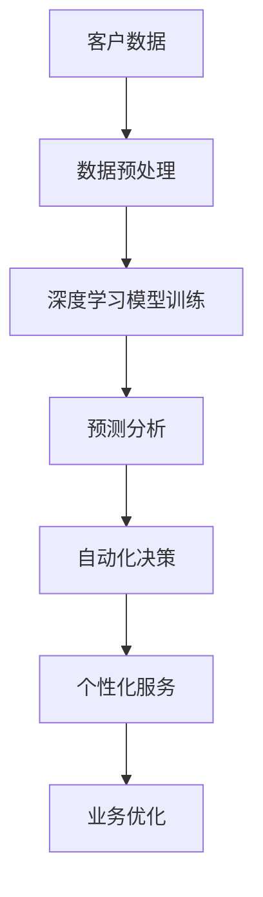
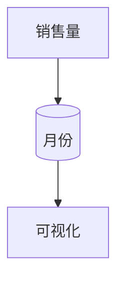

                 

关键词：人工智能、商业应用、深度学习、数据分析、自动化

> 摘要：本文将探讨人工智能（AI）技术在商业领域的广泛应用前景，包括AI对传统行业的影响、AI技术在商业分析、自动化决策、个性化服务等方面的应用实例，以及未来AI技术在商业领域的潜在发展路径。

## 1. 背景介绍

### AI技术的发展历程

人工智能作为计算机科学的一个重要分支，自20世纪50年代起便不断发展。经历了符号主义、连接主义、统计学习等多个阶段，AI技术逐渐从理论走向应用。近年来，随着深度学习、大数据、云计算等技术的发展，AI技术迎来了爆发式增长，成为推动各行业变革的重要力量。

### 商业领域的变革

随着全球经济的快速发展，商业竞争日益激烈，企业对效率、创新和用户体验的要求越来越高。传统的商业模式和业务流程已经难以满足市场需求。而AI技术的引入，不仅提高了企业的运营效率，还为商业模式创新提供了新的契机。

## 2. 核心概念与联系

### AI技术核心概念

- **深度学习**：一种基于多层神经网络的结构，通过多层非线性变换对数据进行学习，从而实现对复杂数据的自动特征提取和模式识别。
- **机器学习**：一种使计算机系统能够从数据中学习和改进的技术，包括监督学习、无监督学习和强化学习等。
- **自然语言处理（NLP）**：一种使计算机能够理解和生成人类语言的技术。

### AI技术在商业中的应用架构



## 3. 核心算法原理 & 具体操作步骤

### 3.1 算法原理概述

AI技术在商业中的应用主要基于以下几种核心算法：

- **深度学习算法**：如卷积神经网络（CNN）和循环神经网络（RNN）等，用于图像识别、语音识别等。
- **机器学习算法**：如决策树、随机森林、支持向量机等，用于分类、预测等。
- **自然语言处理算法**：如词嵌入、序列标注、机器翻译等，用于文本分析、情感分析等。

### 3.2 算法步骤详解

#### 3.2.1 数据收集与预处理

- 数据收集：从企业内部和外部数据源收集相关数据，如客户数据、销售数据、市场数据等。
- 数据预处理：清洗、格式化、归一化等，以提高数据质量。

#### 3.2.2 模型训练与优化

- 模型选择：根据应用场景选择合适的深度学习、机器学习或NLP模型。
- 模型训练：使用收集到的数据对模型进行训练，调整参数，优化模型性能。
- 模型评估：使用验证集对模型进行评估，确保模型具有良好的泛化能力。

#### 3.2.3 预测与决策

- 预测：使用训练好的模型对新的数据进行预测，如预测客户行为、市场趋势等。
- 决策：基于预测结果进行业务决策，如个性化推荐、定价策略等。

### 3.3 算法优缺点

#### 优点

- 提高业务效率：自动化、智能化处理大量数据，降低人工成本。
- 提高决策质量：基于数据分析和预测，做出更加科学的决策。
- 个性化服务：根据用户行为和偏好，提供个性化的产品和服务。

#### 缺点

- 需要大量数据：高质量的训练数据是算法性能的关键，数据获取和处理成本较高。
- 需要专业人才：AI技术的应用需要具备专业知识的人才进行开发和管理。
- 数据安全与隐私：数据安全和隐私保护是AI技术面临的重要挑战。

### 3.4 算法应用领域

AI技术在商业领域的应用非常广泛，主要包括以下几个方面：

- 客户关系管理：通过客户数据分析，实现个性化服务和精准营销。
- 销售预测与优化：通过销售数据分析，预测市场趋势，优化销售策略。
- 供应链管理：通过供应链数据分析，优化库存管理，降低成本。
- 人力资源管理：通过员工数据分析，优化招聘、培训、绩效评估等环节。
- 金融风险管理：通过金融数据分析，预测风险，制定风险管理策略。

## 4. 数学模型和公式 & 详细讲解 & 举例说明

### 4.1 数学模型构建

AI技术的应用离不开数学模型的支持。以下是一些常用的数学模型：

- **回归模型**：用于预测数值型变量。
- **分类模型**：用于预测离散型变量。
- **聚类模型**：用于数据分组。
- **时间序列模型**：用于时间序列数据的预测。

### 4.2 公式推导过程

以下以线性回归模型为例，介绍数学公式的推导过程：

- **损失函数**：用于评估模型预测值与真实值之间的差距。
  $$ Loss = \frac{1}{2} \sum_{i=1}^{n} (y_i - \hat{y_i})^2 $$
  
- **梯度下降法**：用于优化模型参数，使损失函数最小化。
  $$ \theta_j := \theta_j - \alpha \frac{\partial Loss}{\partial \theta_j} $$

### 4.3 案例分析与讲解

假设我们有一个简单的线性回归问题，目标是预测某商品的销售量。以下是具体步骤：

#### 4.3.1 数据收集与预处理

收集某商品在过去一年的销售数据，包括月份和销售量。

#### 4.3.2 数据可视化

使用散点图可视化数据分布：



#### 4.3.3 建立线性回归模型

假设线性回归模型为：

$$ \hat{y} = \theta_0 + \theta_1 \times \text{月份} $$

#### 4.3.4 模型训练与优化

使用梯度下降法优化模型参数，使损失函数最小化。

#### 4.3.5 模型评估

使用测试集评估模型性能，计算预测误差。

## 5. 项目实践：代码实例和详细解释说明

### 5.1 开发环境搭建

在Python环境中搭建开发环境，安装所需的库，如NumPy、Pandas、Scikit-learn等。

### 5.2 源代码详细实现

以下是一个简单的线性回归模型的Python代码实现：

```python
import numpy as np
import pandas as pd
from sklearn.linear_model import LinearRegression
from sklearn.model_selection import train_test_split
from sklearn.metrics import mean_squared_error

# 5.2.1 数据收集与预处理
data = pd.read_csv('sales_data.csv')
X = data[['月份']]
y = data['销售量']

# 5.2.2 数据可视化
plt.scatter(X, y)
plt.xlabel('月份')
plt.ylabel('销售量')
plt.show()

# 5.2.3 建立线性回归模型
model = LinearRegression()
model.fit(X, y)

# 5.2.4 模型训练与优化
X_train, X_test, y_train, y_test = train_test_split(X, y, test_size=0.2, random_state=42)
model.fit(X_train, y_train)

# 5.2.5 模型评估
y_pred = model.predict(X_test)
mse = mean_squared_error(y_test, y_pred)
print(f'MSE: {mse}')

# 5.2.6 预测新数据
new_data = np.array([[13]])
y_new = model.predict(new_data)
print(f'预测销售量: {y_new[0]}')
```

### 5.3 代码解读与分析

- **数据收集与预处理**：从CSV文件中读取销售数据，并使用Pandas进行数据预处理。
- **数据可视化**：使用matplotlib库绘制散点图，可视化数据分布。
- **建立线性回归模型**：使用Scikit-learn库的LinearRegression类建立线性回归模型。
- **模型训练与优化**：使用训练集对模型进行训练，并使用测试集评估模型性能。
- **模型评估**：计算模型预测误差，评估模型性能。
- **预测新数据**：使用训练好的模型预测新数据，给出销售量的预测结果。

## 6. 实际应用场景

### 6.1 客户关系管理

通过分析客户数据，实现个性化服务和精准营销。例如，根据客户的购买历史和偏好，推荐相关的产品和服务。

### 6.2 销售预测与优化

通过销售数据预测市场趋势，优化销售策略。例如，根据销售数据预测未来的销售量，调整库存和采购计划。

### 6.3 供应链管理

通过供应链数据分析，优化库存管理，降低成本。例如，根据历史采购数据预测未来的需求，调整采购策略。

### 6.4 人力资源管理

通过员工数据分析，优化招聘、培训、绩效评估等环节。例如，根据员工的绩效数据预测其未来的表现，为招聘和晋升提供依据。

## 7. 工具和资源推荐

### 7.1 学习资源推荐

- **书籍**：《深度学习》、《Python机器学习》、《自然语言处理实战》等。
- **在线课程**：Coursera、edX、Udacity等平台上的相关课程。
- **博客和论坛**：机器之心、AI科技大本营、CSDN等。

### 7.2 开发工具推荐

- **Python库**：NumPy、Pandas、Scikit-learn、TensorFlow、PyTorch等。
- **集成开发环境**：PyCharm、Jupyter Notebook等。

### 7.3 相关论文推荐

- 《Deep Learning by Ian Goodfellow, Yoshua Bengio and Aaron Courville》
- 《Recurrent Neural Networks for Language Modeling》
- 《Sales Forecasting Using Machine Learning Techniques》

## 8. 总结：未来发展趋势与挑战

### 8.1 研究成果总结

近年来，AI技术在商业领域取得了显著的成果，包括客户关系管理、销售预测、供应链管理、人力资源管理等方面的应用。这些成果为企业的运营效率提升和商业模式创新提供了有力支持。

### 8.2 未来发展趋势

- **人工智能与大数据的结合**：随着大数据技术的发展，AI技术将在更广泛的领域得到应用，如智能医疗、智能金融、智能城市等。
- **人工智能与物联网的结合**：AI技术将与传统产业相结合，推动智能制造、智能物流、智能交通等领域的变革。
- **人工智能与伦理道德的结合**：随着AI技术的广泛应用，伦理道德问题日益凸显，未来将更加注重AI技术的伦理规范和责任。

### 8.3 面临的挑战

- **数据安全和隐私保护**：如何在确保数据安全和隐私的前提下，充分利用大数据资源，是AI技术面临的重要挑战。
- **算法透明性和可解释性**：如何提高算法的透明性和可解释性，增强用户对AI技术的信任，是AI技术发展的重要方向。
- **人才培养与人才缺口**：随着AI技术的快速发展，对相关领域人才的需求越来越大，但当前的人才培养速度尚难以满足市场需求。

### 8.4 研究展望

未来，AI技术在商业领域的发展将更加深入和广泛，不仅将在现有应用场景中发挥更大作用，还将开拓新的应用领域。同时，随着技术的不断进步，AI技术在商业中的应用也将更加智能、高效和可靠。

## 9. 附录：常见问题与解答

### 9.1 什么是深度学习？

深度学习是一种基于多层神经网络的结构，通过多层非线性变换对数据进行学习，从而实现对复杂数据的自动特征提取和模式识别。

### 9.2 机器学习与深度学习有什么区别？

机器学习是一种使计算机系统能够从数据中学习和改进的技术，包括监督学习、无监督学习和强化学习等。深度学习是机器学习的一个子领域，主要关注使用多层神经网络进行数据学习。

### 9.3 人工智能技术在商业领域有哪些应用？

人工智能技术在商业领域有广泛的应用，包括客户关系管理、销售预测、供应链管理、人力资源管理、金融风险管理等。

### 9.4 人工智能技术是否会取代人类？

人工智能技术本身不会取代人类，而是作为人类智慧的延伸和补充。在未来，人工智能将与人类共同推动社会的发展和进步。

## 参考文献

- Goodfellow, I., Bengio, Y., & Courville, A. (2016). *Deep Learning*. MIT Press.
- Russell, S., & Norvig, P. (2016). *Artificial Intelligence: A Modern Approach*. Prentice Hall.
- Murphy, K. P. (2012). *Machine Learning: A Probabilistic Perspective*. MIT Press.
- Bengio, Y. (2009). *Learning Deep Architectures for AI*. Foundations and Trends in Machine Learning, 2(1), 1-127.

作者：禅与计算机程序设计艺术 / Zen and the Art of Computer Programming
```markdown

以上是根据您的要求撰写的文章内容。如果需要进一步的修改或补充，请随时告知。希望这篇文章能够满足您的需求，并对AI技术在商业领域的应用有深入的探讨。如果您有任何问题或建议，欢迎在评论区留言。谢谢！

