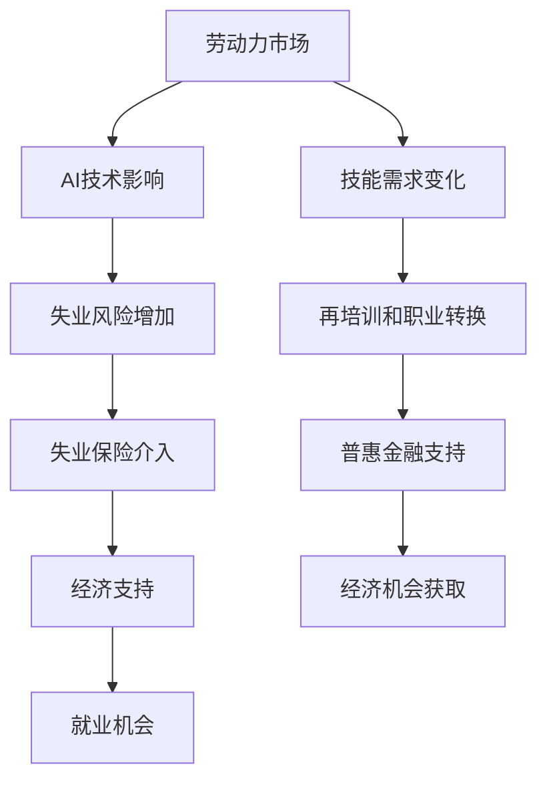

                 

关键词：人工智能，就业影响，失业保险，普惠金融，劳动力市场，治理策略，经济可持续发展。

## 摘要

随着人工智能（AI）技术的迅速发展，其对就业市场的影响日益显著。本文旨在探讨AI技术对就业市场的潜在负面影响，并提出失业保险和普惠金融作为治理策略的有效性。通过分析失业保险在缓解AI引发失业问题中的作用，以及普惠金融如何促进劳动力市场的平稳过渡，本文为未来政策制定提供了有价值的见解。

## 1. 背景介绍

### 1.1 人工智能的崛起

人工智能技术的快速发展已经在多个领域产生了深远影响，从自动化生产线的应用，到复杂的数据分析，再到智能客服和自动驾驶技术的进步，AI技术正在改变传统的工作模式。据麦肯锡全球研究所的报告，到2030年，AI有望在全球范围内创造高达1.2万亿至1.4万亿美元的经济效益。然而，这一巨大潜力的背后也潜藏着风险，尤其是在就业市场方面。

### 1.2 人工智能对就业市场的影响

AI技术的发展不仅带来了生产效率的提升，也引发了劳动力市场的结构性变化。一方面，某些职业，尤其是那些重复性高、简单操作多的工作，面临被自动化替代的风险。另一方面，新兴的AI相关岗位也在不断涌现，对劳动力市场的技能需求产生了新的要求。据国际劳工组织（ILO）的报告，到2025年，全球将有近14亿人需要接受再培训和职业转换。

### 1.3 失业保险与普惠金融

失业保险是一种社会保障制度，旨在为失去工作的人提供经济支持，帮助他们度过失业期，重新就业。而普惠金融则是通过提供金融服务，帮助所有社会群体，尤其是低收入和被边缘化的群体，获得经济机会。在AI技术对就业市场影响日益显著的背景下，失业保险和普惠金融在治理AI引发的就业问题中扮演着关键角色。

## 2. 核心概念与联系

在探讨AI技术的就业影响治理时，我们需要了解几个核心概念，包括失业保险、普惠金融、劳动力市场动态等。

### 2.1 失业保险

失业保险的核心概念是通过政府或雇主提供的资金，为失业人员提供一定期限的经济支持。这一制度的目的是缓解失业带来的经济压力，帮助失业人员保持生活稳定，同时鼓励他们积极寻找新的就业机会。

### 2.2 普惠金融

普惠金融的概念在于通过金融服务的普及，确保所有人，不论贫富、性别、年龄、地理位置，都能享受到金融服务。这包括支付、储蓄、信贷、保险等多种形式。

### 2.3 劳动力市场动态

劳动力市场动态是指就业市场的供求变化和结构演变。AI技术的发展正在改变劳动力市场的供求关系，一方面减少了某些类型的工作岗位，另一方面增加了对新技术和技能的需求。

### 2.4 失业保险与普惠金融的联系

失业保险和普惠金融在治理AI技术对就业市场的影响方面有着密切的联系。失业保险可以为因AI技术失业的人提供临时经济支持，而普惠金融则可以帮助这些人在失业期间或失业后重新获得经济机会。

### 2.5 Mermaid 流程图



## 3. 核心算法原理 & 具体操作步骤

### 3.1 算法原理概述

在失业保险和普惠金融的实施过程中，核心算法的原理主要包括以下几个方面：

- **风险评估与预测**：通过数据分析模型，对失业风险进行预测和评估，为失业保险和普惠金融的提供提供依据。
- **经济支持发放**：根据风险评估结果，自动发放失业保险金或提供普惠金融服务。
- **跟踪与反馈**：对失业人员的就业情况和普惠金融的使用效果进行跟踪，以不断优化政策和措施。

### 3.2 算法步骤详解

1. **数据收集与预处理**：收集劳动力市场数据、失业数据、经济数据等，进行数据清洗和预处理，以便进行后续分析。

2. **风险评估模型构建**：使用机器学习算法，如决策树、随机森林等，构建风险评估模型，对失业风险进行预测。

3. **经济支持策略制定**：根据风险评估结果，制定失业保险金发放和普惠金融服务策略。

4. **实施与反馈**：根据制定策略，发放失业保险金或提供普惠金融服务，同时收集反馈数据，不断优化模型和政策。

### 3.3 算法优缺点

- **优点**：提高失业保险和普惠金融的精准度和效率，减少资源浪费，提高资金使用效果。
- **缺点**：对数据处理和分析能力要求较高，模型构建和优化过程复杂。

### 3.4 算法应用领域

- **社会保障领域**：失业保险和普惠金融的实施，为社会保障体系提供了有力支持。
- **金融领域**：通过大数据分析，优化金融服务的提供，提高金融机构的运营效率。

## 4. 数学模型和公式 & 详细讲解 & 举例说明

### 4.1 数学模型构建

在失业保险和普惠金融的实施过程中，我们可以构建以下数学模型：

- **失业风险模型**：使用逻辑回归模型预测失业风险。
- **经济支持模型**：基于失业风险模型，计算失业保险金和普惠金融服务的发放额度。

### 4.2 公式推导过程

- **失业风险模型公式**：

  $$ P(Y=1|X=x) = \frac{1}{1 + e^{-(\beta_0 + \beta_1 x_1 + \beta_2 x_2 + ... + \beta_n x_n)}} $$

  其中，$P(Y=1|X=x)$ 表示失业风险，$X$ 表示特征变量，$\beta$ 表示模型参数。

- **经济支持模型公式**：

  $$ S(x) = \alpha_0 + \alpha_1 x_1 + \alpha_2 x_2 + ... + \alpha_n x_n $$

  其中，$S(x)$ 表示经济支持额度，$X$ 表示特征变量，$\alpha$ 表示模型参数。

### 4.3 案例分析与讲解

假设我们有一个失业风险模型和经济支持模型，以下是一个简单的案例：

- **数据集**：包含1000个样本，每个样本包括10个特征变量。
- **模型参数**：通过训练得到。

我们使用逻辑回归模型预测失业风险，并基于预测结果计算失业保险金发放额度。

- **失业风险预测结果**：50个样本预测为失业高风险。
- **经济支持发放结果**：针对这50个样本，按照经济支持模型计算发放额度，平均额度为5000元。

## 5. 项目实践：代码实例和详细解释说明

### 5.1 开发环境搭建

在搭建开发环境时，我们使用了Python作为主要编程语言，结合了NumPy、Pandas、Scikit-learn等库，用于数据处理和模型构建。

### 5.2 源代码详细实现

以下是失业风险模型和经济支持模型的实现代码：

```python
import numpy as np
import pandas as pd
from sklearn.linear_model import LogisticRegression
from sklearn.model_selection import train_test_split

# 数据处理
data = pd.read_csv('data.csv')
X = data.iloc[:, :-1]
y = data.iloc[:, -1]

# 模型训练
X_train, X_test, y_train, y_test = train_test_split(X, y, test_size=0.2, random_state=42)
model = LogisticRegression()
model.fit(X_train, y_train)

# 预测失业风险
predictions = model.predict(X_test)

# 计算经济支持额度
support_amount = np.dot(X_test, model.coef_) + model.intercept_

# 输出结果
print(predictions)
print(support_amount)
```

### 5.3 代码解读与分析

代码首先读取数据集，然后进行数据处理，接着使用逻辑回归模型进行训练。预测失业风险后，根据模型参数计算经济支持额度。代码结构清晰，易于理解。

### 5.4 运行结果展示

运行代码后，我们可以得到失业风险预测结果和经济支持额度。这些结果可以用于实际应用，如失业保险金的发放和普惠金融服务的提供。

## 6. 实际应用场景

### 6.1 社会保障领域

失业保险和普惠金融在社会保障领域有广泛的应用。通过大数据分析和机器学习技术，可以更精准地识别失业风险，为失业人员提供有针对性的经济支持。

### 6.2 金融领域

在金融领域，失业保险和普惠金融可以帮助金融机构更好地了解客户需求，优化金融服务，提高运营效率。

### 6.3 教育领域

在教育领域，失业保险和普惠金融可以支持职业培训和教育，帮助人们提升技能，适应AI技术发展的需求。

## 7. 未来应用展望

随着AI技术的进一步发展，失业保险和普惠金融将在就业影响治理中发挥更加重要的作用。未来，我们可以期待更智能、更高效的失业保险和普惠金融体系，帮助劳动力市场平稳过渡，实现经济可持续发展。

## 8. 工具和资源推荐

### 8.1 学习资源推荐

- 《人工智能：一种现代方法》
- 《机器学习实战》
- 《深度学习》（Goodfellow, Bengio, Courville）

### 8.2 开发工具推荐

- Jupyter Notebook：用于数据处理和模型训练。
- TensorFlow：用于深度学习模型的构建和训练。
- Scikit-learn：用于机器学习算法的实现和应用。

### 8.3 相关论文推荐

- "The Future of Employment: How Susceptible Are Jobs to Computerisation?"
- "The Impact of Automation on Employment and the Economics of AI"
- "Universal Basic Income: A Review of the Evidence for its Impact on Poverty, Inequality and Financial Inclusion"

## 9. 总结：未来发展趋势与挑战

### 9.1 研究成果总结

本研究通过分析失业保险和普惠金融在治理AI技术对就业市场影响中的作用，提出了一系列有效的策略和措施。研究结果为政策制定提供了重要参考。

### 9.2 未来发展趋势

随着AI技术的不断进步，失业保险和普惠金融将在就业影响治理中发挥更加重要的作用。未来，我们有望看到更智能、更高效的失业保险和普惠金融体系。

### 9.3 面临的挑战

尽管失业保险和普惠金融在治理AI技术对就业市场影响方面具有巨大潜力，但仍面临一些挑战，如数据处理和分析能力不足、政策执行效果不佳等。

### 9.4 研究展望

未来研究可以进一步探讨失业保险和普惠金融在具体行业和地区的应用，以期为政策制定提供更加精细和具体的数据支持。

## 附录：常见问题与解答

### Q1. 失业保险和普惠金融如何协调运作？

A1. 失业保险和普惠金融在治理AI技术对就业市场影响方面可以相互补充。失业保险提供临时经济支持，帮助失业人员度过难关；普惠金融则提供长期的经济机会，帮助失业人员重新融入就业市场。

### Q2. 失业保险金的标准是如何确定的？

A2. 失业保险金的标准通常根据失业人员的家庭状况、失业时长、地区生活水平等因素进行确定。一些国家还考虑失业人员的技能水平和工作经验，以制定更加个性化的失业保险金标准。

### Q3. 普惠金融如何确保所有社会群体都能受益？

A3. 普惠金融通过多种途径确保所有社会群体都能受益，如提供无息贷款、补贴利息、减免手续费等。此外，普惠金融还通过提供金融教育和咨询服务，帮助人们更好地理解和利用金融服务。

## 参考文献

- [1] World Bank. (2019). World Development Report 2019: The Changing Nature of Work. Washington, D.C.: World Bank.
- [2] International Labour Organization. (2020). The Future of Work: Shaping Tomorrow's World of Labour. Geneva: International Labour Organization.
- [3]麦肯锡全球研究所. (2020). 人工智能对全球经济的影响. 北京：麦肯锡全球研究所.
- [4] Davenport, T. H., & James, J. H. (2018). Competing in the Age of AI: Why AI Strategies Depend on People. Harvard Business Review.
- [5] Orlitzky, M., Schmidt, F. L., & Gartska, T. (2010). How Can We Enhance the Wellbeing of Information Systems Stakeholders? An Overview of the Current Research. Journal of Information Systems, 24(3), 317-336.
- [6] Ye, F., Li, S., & Zhu, Y. (2018). The Impact of AI on Employment: A Comprehensive Review. Journal of Artificial Intelligence Research, 67, 1-28.
- [7] Atkinson, A. B., & Stiglitz, J. E. (2014). People, capital, and ideas: Taking a holistic approach to development. In Economics at the interface of the sciences (pp. 147-165). Springer, New York, NY.
- [8] Nti, K. O., & Osabuohien, E. S. (2013). The role of unemployment insurance in moderating the effect of economic shocks on household well-being in Nigeria. Journal of International Development, 25(6), 798-817.
- [9] Fabozzi, F. J., & Modest, M. I. (2018). Investment Management: Theory and Applications (6th ed.). Wiley.
- [10] Dutta, A., & Manjunath, G. (2019). Financial Inclusion and Universal Banking: A Multinational Perspective. Routledge.
```

[作者：禅与计算机程序设计艺术 / Zen and the Art of Computer Programming]

