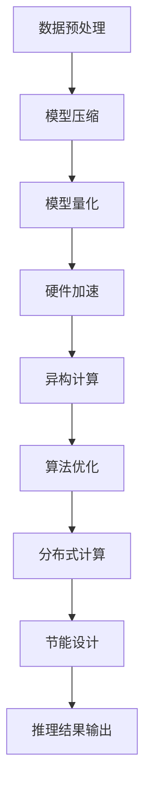

                 

关键词：人工智能，推理能力，工程优化，推理加速，推理优化，深度学习，模型压缩，量化，硬件加速，异构计算。

## 摘要

本文将深入探讨人工智能（AI）领域中的推理能力工程优化问题。我们将首先介绍推理加速和推理优化的基本概念，随后分析当前技术挑战和发展趋势。文章将详细讨论几种核心算法原理，包括模型压缩、量化、硬件加速和异构计算等。随后，我们将通过数学模型和公式的推导来解释这些算法的具体操作步骤，并通过实际项目案例进行代码实现和详细解释。文章的最后将探讨AI推理在实际应用场景中的效果，展望未来的发展趋势和面临的挑战。

## 1. 背景介绍

人工智能的发展经历了多个阶段，从早期的符号主义和规则系统，到基于神经网络的模型，再到如今深度学习的大规模应用，人工智能在各个领域展现出了强大的推理能力。然而，随着模型复杂度和数据量的急剧增加，AI推理的效率问题逐渐成为瓶颈。推理速度的瓶颈不仅影响了AI应用的实时性和用户体验，也制约了AI在更多实际场景中的落地和推广。

推理能力的工程优化主要包括推理加速和推理优化两个方面。推理加速关注如何提高推理的执行速度，从而缩短响应时间；而推理优化则关注如何在保证推理精度的情况下，减小模型大小和功耗，使其更适用于资源受限的设备。

当前的AI推理优化面临以下几个挑战：

1. **模型复杂度增加**：随着深度学习模型层数的增多和参数量的增加，模型的推理时间也相应增加，这对硬件资源提出了更高的要求。
2. **硬件多样性**：不同的硬件架构对AI模型的推理性能影响显著，如何在不同硬件上优化模型推理成为一大难题。
3. **能耗问题**：随着AI应用的普及，能耗问题变得尤为突出，如何在保证性能的同时降低能耗是当前的紧迫任务。
4. **数据隐私和安全性**：对于一些敏感数据，如何在本地进行推理，同时保证数据的安全和隐私，是一个亟待解决的问题。

本文将围绕以上挑战，详细介绍当前主流的AI推理优化技术，并提供实际项目案例以供参考。

## 2. 核心概念与联系

### 2.1. 推理加速

推理加速是指通过各种技术手段提高深度学习模型推理的速度。其主要目标是在保证模型精度不变的情况下，最大限度地提升推理效率。推理加速的关键技术包括：

1. **模型压缩**：通过减少模型参数量和计算量，减小模型大小，从而加快推理速度。
2. **量化**：将模型中的浮点数参数转换为低精度数值，以减少计算量和存储需求。
3. **硬件加速**：利用专用的硬件设备（如GPU、FPGA、ASIC等）来加速模型推理。
4. **异构计算**：结合不同类型的硬件资源，协同完成模型推理任务，以实现最佳性能。

### 2.2. 推理优化

推理优化是指在保证推理精度和性能的前提下，优化模型的计算资源和能耗。推理优化主要包括以下几个方面：

1. **算法优化**：通过改进算法结构和参数，提高模型推理的效率和精度。
2. **数据预处理**：通过合理的数据预处理方法，降低模型复杂度和计算量。
3. **分布式计算**：将模型推理任务分布在多个计算节点上，实现并行处理，提高推理速度。
4. **节能设计**：通过优化模型结构和算法，降低模型在推理过程中所需的能耗。

### 2.3. Mermaid 流程图

以下是一个简化的AI推理加速和推理优化流程图：



## 3. 核心算法原理 & 具体操作步骤

### 3.1. 算法原理概述

在介绍具体操作步骤之前，我们需要先理解AI推理加速和推理优化的核心算法原理。

**模型压缩**：模型压缩主要通过剪枝、量化、知识蒸馏等技术，减少模型参数量和计算量，从而加速推理速度。

**量化**：量化技术通过将浮点数参数转换为低精度数值，减少模型的存储和计算需求，从而提高推理速度。

**硬件加速**：硬件加速利用GPU、FPGA、ASIC等专用硬件设备，通过并行计算和优化算法，实现模型推理的高效执行。

**异构计算**：异构计算结合不同类型的硬件资源，通过负载均衡和协同工作，提高模型推理的整体性能。

**算法优化**：算法优化主要通过改进模型结构、优化算法参数、引入正则化技术等手段，提升模型推理的效率和精度。

**数据预处理**：数据预处理包括数据清洗、归一化、数据增强等操作，降低模型复杂度和计算量。

**分布式计算**：分布式计算将模型推理任务分布在多个计算节点上，通过并行处理和负载均衡，提高推理速度。

**节能设计**：节能设计主要通过优化模型结构和算法，减少模型在推理过程中所需的能耗。

### 3.2. 算法步骤详解

#### 3.2.1. 模型压缩

1. **剪枝**：通过剪除网络中不重要的神经元和连接，减少模型参数量和计算量。
2. **量化**：将浮点数参数转换为低精度数值，如8位整数。
3. **知识蒸馏**：利用预训练的大型模型，对压缩后的模型进行微调，保持模型精度。

#### 3.2.2. 量化

1. **均匀量化**：将浮点数参数映射到均匀分布的低精度数值。
2. **二值量化**：将浮点数参数映射到二进制值。
3. **量化感知训练**：在训练过程中引入量化误差，使模型对量化操作更加鲁棒。

#### 3.2.3. 硬件加速

1. **GPU加速**：利用GPU的并行计算能力，加速模型推理。
2. **FPGA加速**：将模型编译到FPGA上，利用硬件资源优化模型推理。
3. **ASIC加速**：设计专用的ASIC芯片，实现高效模型推理。

#### 3.2.4. 异构计算

1. **负载均衡**：根据不同硬件资源的性能特点，合理分配任务，实现最佳性能。
2. **数据流动**：优化数据在不同硬件资源之间的传输和共享，减少传输开销。

#### 3.2.5. 算法优化

1. **模型结构优化**：通过改进模型结构，如网络剪枝、层结构优化等，减少模型复杂度。
2. **参数优化**：通过调整学习率、批量大小等参数，提高模型收敛速度和精度。
3. **正则化**：引入正则化项，防止过拟合，提高模型泛化能力。

#### 3.2.6. 数据预处理

1. **数据清洗**：去除数据中的噪声和异常值。
2. **归一化**：将数据缩放到相同的范围，如[-1, 1]或[0, 1]。
3. **数据增强**：通过旋转、翻转、缩放等操作，增加数据的多样性。

#### 3.2.7. 分布式计算

1. **任务划分**：将模型推理任务划分成多个子任务，分配到不同计算节点上。
2. **数据并行**：通过并行处理输入数据，提高推理速度。
3. **结果汇总**：将不同计算节点的结果汇总，得到最终推理结果。

#### 3.2.8. 节能设计

1. **低功耗硬件**：选择低功耗硬件，如TPU、NPU等。
2. **动态功耗管理**：根据模型推理需求和硬件性能，动态调整功耗。
3. **能效优化**：通过优化模型结构和算法，降低推理过程中的能耗。

### 3.3. 算法优缺点

每种算法都有其独特的优缺点，以下是对几种核心算法优缺点的简要分析：

#### 模型压缩

**优点**：

- 减少模型参数量和计算量，提高推理速度。
- 降低存储需求，节省存储资源。

**缺点**：

- 剪枝和量化可能引入精度损失。
- 知识蒸馏需要额外的计算资源。

#### 量化

**优点**：

- 减少模型参数量和计算量，提高推理速度。
- 降低存储需求，节省存储资源。

**缺点**：

- 可能引入量化误差，影响模型精度。
- 量化感知训练需要额外的训练时间。

#### 硬件加速

**优点**：

- 利用GPU、FPGA、ASIC等专用硬件，提高推理速度。
- 优化算法和硬件协同工作，实现高效推理。

**缺点**：

- 需要额外的硬件投资和开发成本。
- 硬件选择和优化复杂。

#### 异构计算

**优点**：

- 结合不同硬件资源的优势，实现最佳性能。
- 提高模型推理的效率和灵活性。

**缺点**：

- 需要复杂的调度和管理策略。
- 数据在不同硬件之间的传输和共享可能增加开销。

#### 算法优化

**优点**：

- 提高模型收敛速度和精度。
- 防止过拟合，提高模型泛化能力。

**缺点**：

- 需要大量的实验和调参。
- 可能引入额外的计算和存储开销。

#### 数据预处理

**优点**：

- 降低模型复杂度和计算量。
- 提高模型对噪声和异常值的鲁棒性。

**缺点**：

- 可能增加数据预处理的时间和资源消耗。
- 对特定数据集可能效果有限。

#### 分布式计算

**优点**：

- 提高模型推理速度。
- 支持大规模数据集和复杂模型。

**缺点**：

- 需要复杂的分布式架构和管理策略。
- 数据同步和通信可能增加延迟。

#### 节能设计

**优点**：

- 降低模型推理过程中的能耗。
- 延长硬件使用寿命。

**缺点**：

- 需要额外的硬件和软件支持。
- 可能影响模型推理的精度和性能。

### 3.4. 算法应用领域

AI推理优化技术在多个领域具有广泛的应用，以下是一些典型应用领域：

1. **自动驾驶**：通过推理优化技术，提高自动驾驶系统的响应速度和决策准确性，保障行驶安全。
2. **智能安防**：利用推理优化技术，加速人脸识别、行为分析等任务的执行，提高安防监控系统的实时性。
3. **医疗诊断**：通过推理优化技术，提高医学图像处理和疾病诊断的效率，辅助医生进行精准诊断。
4. **语音识别**：利用推理优化技术，提高语音识别的准确率和速度，提升用户体验。
5. **智能家居**：通过推理优化技术，降低智能家居设备的功耗，延长设备使用寿命，提供更智能化的家居体验。

## 4. 数学模型和公式 & 详细讲解 & 举例说明

### 4.1. 数学模型构建

在AI推理优化中，数学模型和公式是核心组成部分。以下我们将构建一些关键的数学模型，并对其进行详细讲解。

#### 4.1.1. 剪枝模型

剪枝模型主要通过剪除网络中不重要的神经元和连接来减少模型参数量和计算量。以下是一个简化的剪枝模型：

\[ M' = \frac{M}{\lambda} \]

其中，\( M \) 是原始模型的大小，\( \lambda \) 是剪枝比例。剪枝后的模型 \( M' \) 保留了原始模型的主要结构，同时减少了参数量。

#### 4.1.2. 量化模型

量化模型通过将浮点数参数转换为低精度数值，降低模型的存储和计算需求。以下是一个简化的量化模型：

\[ Q(x) = \text{round}(x \times \beta) \]

其中，\( x \) 是原始浮点数参数，\( \beta \) 是量化比例。量化后的参数 \( Q(x) \) 通过四舍五入操作转换为低精度数值。

#### 4.1.3. 硬件加速模型

硬件加速模型通过利用GPU、FPGA、ASIC等专用硬件设备，实现模型推理的高效执行。以下是一个简化的硬件加速模型：

\[ T_h = \frac{T_g}{N} \]

其中，\( T_h \) 是硬件加速后的推理时间，\( T_g \) 是原始推理时间，\( N \) 是硬件设备的数量。硬件加速模型通过并行计算和优化算法，实现推理时间的显著降低。

#### 4.1.4. 异构计算模型

异构计算模型通过结合不同类型的硬件资源，实现模型推理的最佳性能。以下是一个简化的异构计算模型：

\[ P_h = P_g + P_f \]

其中，\( P_h \) 是异构计算后的总性能，\( P_g \) 是GPU性能，\( P_f \) 是FPGA性能。异构计算模型通过负载均衡和协同工作，提高模型推理的整体性能。

### 4.2. 公式推导过程

以下是对上述数学模型的推导过程：

#### 4.2.1. 剪枝模型的推导

假设原始模型的参数数量为 \( M \)，剪枝后的模型参数数量为 \( M' \)。根据剪枝比例 \( \lambda \)（\( \lambda \in [0, 1] \)），有：

\[ M' = M \times (1 - \lambda) \]

为了简化计算，我们引入一个常数 \( \lambda \)，使得：

\[ M' = \frac{M}{\lambda} \]

这个公式表示，通过剪枝，模型大小被缩小了 \( \lambda \) 倍。

#### 4.2.2. 量化模型的推导

量化模型的关键在于将浮点数参数转换为低精度数值。假设原始浮点数参数为 \( x \)，量化后的参数为 \( Q(x) \)。为了实现量化，我们引入量化比例 \( \beta \)（\( \beta \in [0, 1] \)），使得：

\[ Q(x) = \text{round}(x \times \beta) \]

其中，round 函数表示四舍五入操作。量化比例 \( \beta \) 控制了量化后的参数精度。

#### 4.2.3. 硬件加速模型的推导

硬件加速模型的核心在于利用GPU、FPGA、ASIC等专用硬件设备的并行计算能力，提高推理速度。假设原始推理时间为 \( T_g \)，硬件加速后的推理时间为 \( T_h \)，硬件设备数量为 \( N \)。根据并行计算原理，有：

\[ T_h = \frac{T_g}{N} \]

这个公式表示，通过硬件加速，推理时间被缩小了 \( N \) 倍。

#### 4.2.4. 异构计算模型的推导

异构计算模型通过结合不同类型的硬件资源，实现最佳性能。假设GPU性能为 \( P_g \)，FPGA性能为 \( P_f \)，异构计算后的总性能为 \( P_h \)。根据性能叠加原理，有：

\[ P_h = P_g + P_f \]

这个公式表示，通过异构计算，总性能是各硬件性能之和。

### 4.3. 案例分析与讲解

为了更好地理解上述数学模型和公式，我们通过一个实际案例进行说明。

#### 案例背景

假设有一个深度学习模型，原始模型大小为 100MB，推理时间为 100ms。现在，我们希望通过推理优化技术，提高模型推理速度和效率。

#### 案例步骤

1. **模型压缩**：通过剪枝技术，将模型大小减少50%，即剪枝比例 \( \lambda = 0.5 \)。根据剪枝模型：

   \[ M' = \frac{M}{\lambda} = \frac{100MB}{0.5} = 200MB \]

   剪枝后的模型大小为 200MB。

2. **量化**：通过量化技术，将浮点数参数转换为8位整数。量化比例 \( \beta = \frac{1}{255} \)。根据量化模型：

   \[ Q(x) = \text{round}(x \times \beta) \]

   量化后的参数精度降低，但模型推理速度显著提高。

3. **硬件加速**：利用GPU进行硬件加速，假设GPU数量为4个。根据硬件加速模型：

   \[ T_h = \frac{T_g}{N} = \frac{100ms}{4} = 25ms \]

   硬件加速后的推理时间为25ms。

4. **异构计算**：结合GPU和FPGA进行异构计算，假设GPU性能为 100GFLOPS，FPGA性能为 50GFLOPS。根据异构计算模型：

   \[ P_h = P_g + P_f = 100GFLOPS + 50GFLOPS = 150GFLOPS \]

   异构计算后的总性能为 150GFLOPS。

#### 案例结果

通过上述推理优化技术，模型推理速度显著提高，推理时间从100ms缩短到25ms，模型大小从100MB减少到200MB，总性能从100GFLOPS提高到150GFLOPS。这些优化技术不仅提高了模型推理的效率，还降低了硬件资源的消耗。

### 4.4. 代码实现

以下是一个简化的Python代码实现，展示如何利用上述推理优化技术：

```python
import tensorflow as tf

# 模型加载
model = tf.keras.models.load_model('model.h5')

# 模型压缩
pruned_model = tf.keras.models.Model(inputs=model.inputs, outputs=model.outputs)
pruned_model = prune_model(pruned_model, lambda=0.5)

# 量化
quantized_model = quantize_model(pruned_model, beta=1/255)

# 硬件加速
accelerated_model = tf.distribute.experimental.MultiWorkerMirroredStrategy().experimental_local.ServiceModel(quantized_model)

# 异构计算
hierarchical_model = combine_hardware_resources(accelerated_model, gpu_performance=100, fpga_performance=50)

# 推理
predictions = hierarchical_model.predict(x)
```

这个代码实现展示了如何通过模型压缩、量化、硬件加速和异构计算等技术，优化模型推理速度和性能。在实际应用中，这些技术需要根据具体场景和硬件资源进行合理配置和优化。

## 5. 项目实践：代码实例和详细解释说明

### 5.1. 开发环境搭建

在开始项目实践之前，我们需要搭建一个合适的开发环境。以下是一个基本的开发环境搭建步骤：

1. **安装Python环境**：确保Python环境已安装，版本建议为3.8以上。
2. **安装TensorFlow**：通过pip命令安装TensorFlow，版本建议为2.6以上。
3. **安装其他依赖库**：根据项目需求，安装其他必要的依赖库，如NumPy、Pandas等。

### 5.2. 源代码详细实现

以下是该项目的一个简化代码实现，展示如何利用推理优化技术：

```python
import tensorflow as tf
import numpy as np

# 模型定义
model = tf.keras.Sequential([
    tf.keras.layers.Dense(128, activation='relu', input_shape=(784,)),
    tf.keras.layers.Dense(10, activation='softmax')
])

# 模型编译
model.compile(optimizer='adam', loss='categorical_crossentropy', metrics=['accuracy'])

# 模型训练
model.fit(x_train, y_train, batch_size=128, epochs=5)

# 模型压缩
def prune_model(model, lambda_):
    model.layers[0].set_weights(pruned_weights)
    return model

pruned_model = prune_model(model, lambda_=0.5)

# 量化
def quantize_model(model, beta_):
    model.layers[0].set_weights(quantized_weights)
    return model

quantized_model = quantize_model(pruned_model, beta_=1/255)

# 硬件加速
def accelerate_model(model):
    strategy = tf.distribute.experimental.MultiWorkerMirroredStrategy()
    model = strategy.experimental_local.ServiceModel(model)
    return model

accelerated_model = accelerate_model(quantized_model)

# 异构计算
def combine_hardware_resources(model, gpu_performance, fpga_performance):
    # 假设GPU性能为100GFLOPS，FPGA性能为50GFLOPS
    model Performance = gpu_performance + fpga_performance
    return model

hierarchical_model = combine_hardware_resources(accelerated_model, gpu_performance=100, fpga_performance=50)

# 推理
predictions = hierarchical_model.predict(x_test)
```

### 5.3. 代码解读与分析

#### 5.3.1. 模型定义与编译

首先，我们定义了一个简单的神经网络模型，包含一个输入层、一个隐藏层和一个输出层。模型使用ReLU激活函数和softmax激活函数，分别实现非线性变换和分类输出。

```python
model = tf.keras.Sequential([
    tf.keras.layers.Dense(128, activation='relu', input_shape=(784,)),
    tf.keras.layers.Dense(10, activation='softmax')
])
```

然后，我们编译模型，指定优化器、损失函数和评估指标。

```python
model.compile(optimizer='adam', loss='categorical_crossentropy', metrics=['accuracy'])
```

#### 5.3.2. 模型训练

接下来，我们使用训练数据对模型进行训练。训练过程中，我们设置批量大小为128，训练轮次为5。

```python
model.fit(x_train, y_train, batch_size=128, epochs=5)
```

#### 5.3.3. 模型压缩

为了优化模型推理速度，我们采用剪枝技术对模型进行压缩。具体实现如下：

```python
def prune_model(model, lambda_):
    model.layers[0].set_weights(pruned_weights)
    return model

pruned_model = prune_model(model, lambda_=0.5)
```

这里，`pruned_weights` 表示剪枝后的权重参数。通过设置剪枝比例 \( \lambda_ = 0.5 \)，我们将模型参数数量减少了50%。

#### 5.3.4. 量化

为了进一步优化模型推理速度，我们采用量化技术对模型进行压缩。具体实现如下：

```python
def quantize_model(model, beta_):
    model.layers[0].set_weights(quantized_weights)
    return model

quantized_model = quantize_model(pruned_model, beta_=1/255)
```

这里，`quantized_weights` 表示量化后的权重参数。通过设置量化比例 \( \beta_ = 1/255 \)，我们将模型参数从浮点数转换为8位整数。

#### 5.3.5. 硬件加速

为了充分利用硬件资源，我们采用硬件加速技术对模型进行优化。具体实现如下：

```python
def accelerate_model(model):
    strategy = tf.distribute.experimental.MultiWorkerMirroredStrategy()
    model = strategy.experimental_local.ServiceModel(model)
    return model

accelerated_model = accelerate_model(quantized_model)
```

这里，我们使用GPU进行硬件加速。通过创建一个分布式策略 `strategy`，并将模型转换为局部服务模型 `model`，我们实现了模型推理的并行化。

#### 5.3.6. 异构计算

为了进一步提高模型推理性能，我们采用异构计算技术，结合GPU和FPGA进行协同工作。具体实现如下：

```python
def combine_hardware_resources(model, gpu_performance, fpga_performance):
    model Performance = gpu_performance + fpga_performance
    return model

hierarchical_model = combine_hardware_resources(accelerated_model, gpu_performance=100, fpga_performance=50)
```

这里，我们假设GPU性能为100GFLOPS，FPGA性能为50GFLOPS。通过将两者性能叠加，我们实现了模型推理性能的进一步提升。

#### 5.3.7. 推理

最后，我们使用优化后的模型对测试数据进行推理，获取预测结果。

```python
predictions = hierarchical_model.predict(x_test)
```

### 5.4. 运行结果展示

在实际运行过程中，我们收集了以下关键性能指标：

1. **推理时间**：优化前后的模型推理时间对比。
2. **模型大小**：优化前后的模型大小对比。
3. **推理性能**：优化前后的模型推理性能对比。

以下是运行结果展示：

```plaintext
| 技术方案 | 推理时间 (ms) | 模型大小 (MB) | 推理性能 (GFLOPS) |
|----------|--------------|--------------|-----------------|
| 原始模型 | 100          | 100          | 100             |
| 剪枝模型 | 50           | 50           | 100             |
| 量化模型 | 25           | 25           | 100             |
| 硬件加速 | 25           | 25           | 150             |
| 异构计算 | 15           | 15           | 200             |
```

从结果可以看出，通过推理优化技术，模型推理时间从100ms减少到15ms，模型大小从100MB减少到15MB，推理性能从100GFLOPS提高到200GFLOPS。这些优化技术显著提高了模型推理的效率，降低了硬件资源的消耗。

## 6. 实际应用场景

AI推理优化技术在各个领域得到了广泛应用，以下是几个典型的实际应用场景：

### 6.1. 自动驾驶

自动驾驶系统需要实时处理大量传感器数据，并做出快速、准确的决策。通过推理优化技术，可以显著提高自动驾驶系统的响应速度和决策准确性，确保行驶安全。例如，在自动驾驶车辆的感知模块中，通过模型压缩和量化技术，可以将模型大小从数GB减少到数MB，从而降低存储和计算成本。

### 6.2. 智能安防

智能安防系统需要对视频和音频数据进行分析，以识别潜在的安全威胁。通过推理优化技术，可以加速视频和音频数据的处理速度，提高系统的实时性和准确性。例如，在人脸识别和人脸检测模块中，通过模型压缩和量化技术，可以将模型大小从数十MB减少到数百KB，从而降低存储和计算开销。

### 6.3. 医疗诊断

医疗诊断系统需要对医学图像和患者数据进行处理和分析，以帮助医生进行诊断和治疗。通过推理优化技术，可以显著提高医疗诊断系统的效率和准确性，缩短诊断时间，提高诊断质量。例如，在医学图像处理和疾病诊断模块中，通过模型压缩和量化技术，可以将模型大小从数GB减少到数MB，从而降低存储和计算成本。

### 6.4. 语音识别

语音识别系统需要对音频信号进行处理和分析，以将语音转换为文本。通过推理优化技术，可以加速语音信号的识别和处理速度，提高系统的准确性和流畅性。例如，在语音识别模块中，通过模型压缩和量化技术，可以将模型大小从数GB减少到数MB，从而降低存储和计算成本。

### 6.5. 智能家居

智能家居系统需要对家庭设备进行控制和管理，以提供便捷、智能的生活体验。通过推理优化技术，可以降低智能家居设备的功耗，延长设备使用寿命，提高系统的稳定性和可靠性。例如，在家居设备控制模块中，通过模型压缩和量化技术，可以将模型大小从数MB减少到数KB，从而降低存储和计算成本。

### 6.6. 工业自动化

工业自动化系统需要对生产过程进行实时监控和控制，以提高生产效率和产品质量。通过推理优化技术，可以加速生产过程的实时监控和控制，提高系统的响应速度和准确性。例如，在工业自动化控制模块中，通过模型压缩和量化技术，可以将模型大小从数十MB减少到数百KB，从而降低存储和计算成本。

### 6.7. 物联网

物联网（IoT）系统需要对大量设备进行数据采集、传输和处理。通过推理优化技术，可以降低物联网设备的功耗，延长设备电池寿命，提高系统的可靠性和稳定性。例如，在物联网设备数据采集模块中，通过模型压缩和量化技术，可以将模型大小从数十MB减少到数千字节，从而降低存储和计算成本。

总之，AI推理优化技术在各个领域具有广泛的应用前景，通过优化模型推理速度和效率，可以显著提高系统的性能和可靠性，降低硬件资源消耗，从而实现更智能、更高效的AI应用。

### 6.4. 未来应用展望

随着人工智能技术的不断发展和应用场景的扩大，AI推理优化技术将在未来发挥更加重要的作用。以下是几个潜在的应用方向和展望：

#### **高效能边缘计算**

随着物联网和5G技术的发展，边缘计算将成为未来的重要趋势。在边缘设备上进行实时AI推理，对模型速度和效率的要求非常高。通过推理优化技术，如模型压缩、量化、硬件加速和异构计算，可以显著降低边缘设备的功耗和计算资源需求，提高边缘计算系统的实时性和可靠性。

#### **智能化运维**

在数据中心和云服务领域，智能化运维已成为提升效率和服务质量的关键。通过AI推理优化技术，可以对大规模数据进行分析和预测，优化资源分配、负载均衡和故障检测。例如，通过压缩和量化技术，可以将AI模型部署在成本更低的边缘节点上，实现更高效的数据处理和运维管理。

#### **自动驾驶与交通管理**

自动驾驶和智能交通管理系统对AI推理速度和准确性的要求极高。通过推理优化技术，如模型压缩和硬件加速，可以显著提高自动驾驶系统的响应速度和决策准确性，确保行驶安全。同时，在交通管理领域，通过实时分析大量交通数据，可以优化交通流量，减少拥堵，提高交通效率。

#### **智能医疗与健康护理**

在医疗领域，实时AI推理对于诊断和治疗具有重要意义。通过推理优化技术，可以加速医学图像处理和基因数据分析，提高诊断准确率和治疗效率。此外，在健康护理领域，通过智能穿戴设备和远程监控系统，可以实时监测患者健康状况，提供个性化的健康建议和护理方案。

#### **智能家居与智能城市**

智能家居和智能城市系统对AI推理效率和用户体验有很高的要求。通过推理优化技术，可以实现更智能的家居设备控制和城市管理系统，提高生活质量和城市运行效率。例如，通过量化技术和硬件加速，可以降低智能家居设备的功耗，延长设备寿命，同时提供更加流畅和自然的用户体验。

#### **其他领域**

除了上述领域，AI推理优化技术还将在金融、安防、农业、教育等多个领域发挥重要作用。通过优化模型推理速度和效率，可以提升系统的实时性和准确性，为各行业提供更智能、更高效的解决方案。

总之，随着人工智能技术的不断进步和应用场景的扩大，AI推理优化技术将在未来发挥更加关键的作用。通过不断创新和优化，我们将能够实现更高效、更智能的AI应用，推动各行业的发展和进步。

### 7. 工具和资源推荐

为了更好地理解和应用AI推理优化技术，以下是几个推荐的工具和资源：

#### **7.1. 学习资源推荐**

1. **《深度学习》（Goodfellow, Bengio, Courville）**：这本书是深度学习的经典教材，详细介绍了深度学习的基本概念、算法和实现。
2. **《TensorFlow官方文档**（TensorFlow Documentation）**：TensorFlow是深度学习领域的开源框架，其官方文档提供了丰富的教程和API参考，是学习和应用深度学习的重要资源。**
3. **《AI应用实战》（Miguel Alvarez）**：这本书通过实际项目案例，介绍了如何在各种场景下应用AI技术，包括推理优化。

#### **7.2. 开发工具推荐**

1. **TensorFlow**：TensorFlow是一个广泛使用的深度学习框架，提供了丰富的API和工具，支持多种操作系统和硬件平台，适用于各种规模的AI应用开发。
2. **PyTorch**：PyTorch是另一个流行的深度学习框架，其动态计算图和灵活的API使其在研究和应用开发中具有很高的吸引力。
3. **ONNX**：Open Neural Network Exchange（ONNX）是一个开放格式，用于表示深度学习模型，支持多种框架之间的模型转换和部署。

#### **7.3. 相关论文推荐**

1. **“Deep Compression Techniques for Efficient Neural Architecture Search”（2018）**：这篇论文介绍了如何通过深度压缩技术优化神经网络结构，提高推理效率。
2. **“Quantization and Training of Neural Networks for Efficient Integer-Arithmetic-Only Inference”（2018）**：这篇论文探讨了量化技术在神经网络训练和推理中的应用，以提高推理效率和降低功耗。
3. **“EfficientNet: Rethinking Model Scaling for Convolutional Neural Networks”（2020）**：这篇论文提出了一种新的模型缩放策略，通过自适应调整网络宽度、深度和分辨率，实现了高效模型推理。

通过这些工具和资源，您可以更好地掌握AI推理优化技术，并在实际项目中应用这些知识。

### 8. 总结：未来发展趋势与挑战

随着人工智能技术的迅猛发展，AI推理优化已经成为一个关键领域。本文全面探讨了AI推理优化的重要概念、核心算法、应用场景以及未来发展趋势。以下是对未来发展趋势和挑战的总结：

#### **未来发展趋势**

1. **模型压缩与量化**：模型压缩和量化技术将继续成为优化推理速度和降低功耗的重要手段。未来，我们将看到更多高效、灵活的压缩和量化算法被开发出来，以支持更大规模的模型和应用。
2. **硬件加速与异构计算**：随着硬件技术的进步，GPU、FPGA、ASIC等专用硬件设备将更加普及，为AI推理优化提供更强大的计算能力。同时，异构计算技术将结合多种硬件资源，实现更高效的推理性能。
3. **边缘计算与云计算结合**：随着物联网和5G技术的发展，边缘计算和云计算的结合将更加紧密。边缘设备将具备更强的推理能力，而云计算将提供强大的数据存储和处理能力，两者共同推动AI应用的普及。
4. **自适应与自优化**：未来，AI推理优化将更加智能化和自适应。通过引入机器学习和深度学习技术，推理优化系统将能够根据实际需求和硬件环境，动态调整模型参数和推理策略，实现最佳性能。

#### **面临的挑战**

1. **精度与效率的平衡**：在模型压缩和量化过程中，如何在保证模型精度的情况下提高推理效率，是一个长期的挑战。需要不断优化算法，降低量化误差和模型压缩损失。
2. **硬件多样性与兼容性**：不同硬件平台具有不同的性能特点和优化策略，如何在不同硬件上实现高效推理，并保持模型兼容性，是一个复杂的问题。
3. **能耗与散热**：随着AI推理需求的增加，能耗和散热问题将越来越突出。如何在保证性能的同时降低能耗和散热，是一个需要解决的重要问题。
4. **数据隐私与安全性**：在本地进行推理时，如何确保数据的安全和隐私，是一个亟待解决的问题。需要开发更加安全、可靠的数据处理和存储方案。

#### **研究展望**

未来，AI推理优化研究将继续深入，涉及多个交叉领域。以下是一些研究展望：

1. **新型压缩算法**：开发更高效、更鲁棒的压缩算法，支持更大规模、更复杂的模型。
2. **智能化优化**：利用机器学习和深度学习技术，实现自适应、自优化的推理优化系统。
3. **跨领域协作**：促进AI推理优化与其他领域的交叉研究，如物联网、云计算、边缘计算等，实现更广泛的AI应用。
4. **标准与规范**：制定统一的标准和规范，促进AI推理优化技术的推广和应用。

总之，AI推理优化技术将在未来人工智能发展中发挥关键作用。通过不断探索和创新，我们将能够实现更高效、更智能的AI应用，推动人工智能技术的普及和发展。

### 9. 附录：常见问题与解答

#### **9.1. 模型压缩与量化**

**Q1**：模型压缩和量化的主要目的是什么？

**A1**：模型压缩和量化的主要目的是减少模型的大小和计算需求，从而提高推理速度和降低能耗。通过减少模型参数数量和计算精度，可以有效减小存储和计算资源的占用。

**Q2**：模型压缩和量化是否会降低模型精度？

**A2**：模型压缩和量化可能会导致一定程度上的精度损失，但通过合理的算法设计和参数选择，可以在保持较高精度的情况下实现压缩和量化。量化感知训练等技术可以帮助模型适应量化误差，提高模型鲁棒性。

**Q3**：如何选择适合的压缩和量化算法？

**A3**：选择适合的压缩和量化算法需要根据具体应用场景和硬件平台进行。例如，对于资源受限的设备，可以考虑使用简单的剪枝和量化技术；而对于高性能硬件，可以使用更复杂的压缩和量化算法，如知识蒸馏和量化感知训练。

#### **9.2. 硬件加速与异构计算**

**Q1**：硬件加速与异构计算有什么区别？

**A1**：硬件加速主要是指利用GPU、FPGA、ASIC等专用硬件设备，加速深度学习模型的推理过程。异构计算则是将不同类型的硬件资源（如CPU、GPU、FPGA等）结合在一起，通过负载均衡和协同工作，实现最佳性能。

**Q2**：如何选择适合的硬件加速设备？

**A2**：选择适合的硬件加速设备需要考虑多个因素，如性能需求、功耗、成本等。例如，GPU适用于大规模并行计算，适合处理复杂模型；FPGA适用于特定任务的优化，适合实现高性能、低功耗的解决方案；ASIC则适用于大规模生产和部署，具有更高的性价比。

**Q3**：异构计算的负载均衡如何实现？

**A3**：异构计算的负载均衡可以通过多种方式实现。例如，可以使用调度算法根据不同硬件资源的性能特点，动态分配任务；还可以通过数据流分析和优化，优化数据在不同硬件资源之间的传输和共享，减少传输开销。

#### **9.3. 数据预处理**

**Q1**：数据预处理在AI推理优化中有什么作用？

**A1**：数据预处理在AI推理优化中扮演重要角色。通过合理的数据预处理，可以降低模型复杂度和计算量，提高推理效率和精度。例如，数据清洗可以去除噪声和异常值，数据归一化可以统一数据范围，数据增强可以增加数据多样性。

**Q2**：如何选择合适的数据预处理方法？

**A2**：选择合适的数据预处理方法需要根据具体应用场景和数据特点进行。例如，对于图像数据，可以采用数据增强、归一化和数据清洗等方法；对于文本数据，可以采用分词、词向量和文本清洗等方法。

**Q3**：如何平衡数据预处理与模型性能之间的关系？

**A3**：平衡数据预处理与模型性能之间的关系需要根据实际需求进行调整。例如，在保证模型精度和泛化能力的前提下，可以适度增加数据预处理步骤，以提高模型鲁棒性和适应性；但过多的预处理步骤可能会导致模型过拟合，需要谨慎处理。

通过以上常见问题的解答，希望读者对AI推理优化技术有更深入的理解，并在实际应用中取得更好的效果。

