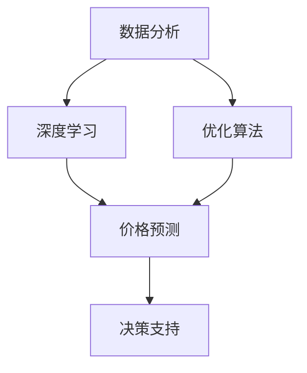

                 

关键词：人工智能，电商价格策略，深度学习，数据分析，优化算法，消费者行为分析，个性化推荐

> 摘要：本文将探讨如何利用人工智能技术提升电商价格策略的制定和执行，从而提高销售额和用户满意度。通过核心概念的阐述、算法原理的讲解、数学模型的构建以及实际项目实践，本文将展示AI在电商价格策略优化中的应用和潜力。

## 1. 背景介绍

电子商务的快速发展使得市场竞争日益激烈。价格策略作为电商企业竞争的重要手段，直接影响着企业的市场份额和利润。传统的价格策略依赖于市场调研、竞争分析和历史数据，但这种策略往往难以适应快速变化的市场环境。随着人工智能技术的进步，特别是在深度学习、大数据分析和优化算法等领域的突破，电商价格策略的制定和执行将迎来全新的变革。

人工智能在电商价格策略中的应用主要包括以下几个方面：

- **消费者行为分析**：通过分析消费者的购买历史、浏览行为等数据，挖掘消费者的需求和行为模式，从而制定更加精准的价格策略。
- **个性化推荐**：基于消费者的购买偏好和历史行为，为消费者推荐合适的商品，提高购买转化率。
- **价格优化**：利用机器学习和优化算法，动态调整商品价格，以实现最大化销售额和利润。
- **市场预测**：通过分析市场趋势、竞争对手行为等数据，预测市场需求和价格走势，为企业制定长远的定价策略提供支持。

## 2. 核心概念与联系

### 2.1 数据分析

数据分析是人工智能在电商价格策略中不可或缺的一部分。它包括数据收集、数据预处理、数据建模和数据可视化等步骤。通过数据分析，我们可以获取有关消费者行为、市场趋势和竞争对手信息的关键洞察，从而为价格策略的制定提供依据。

### 2.2 深度学习

深度学习是人工智能的一种重要分支，它通过模拟人脑的神经网络结构，对大量数据进行自动学习和特征提取。在电商价格策略中，深度学习可以用于构建价格预测模型、消费者行为分析模型等。

### 2.3 优化算法

优化算法是解决电商价格策略问题的关键技术之一。它通过优化目标函数，找到使目标函数最大或最小化的决策变量。在电商价格策略中，优化算法可以用于动态调整商品价格，以实现利润最大化。

### 2.4 Mermaid 流程图

下面是一个关于电商价格策略的Mermaid流程图，展示了核心概念之间的联系。



## 3. 核心算法原理 & 具体操作步骤

### 3.1 算法原理概述

在电商价格策略中，核心算法主要分为价格预测和价格优化两部分。价格预测模型用于预测未来一段时间内的商品价格，而价格优化模型则用于根据预测结果和市场需求动态调整商品价格。

#### 价格预测模型

价格预测模型通常基于深度学习技术，例如长短期记忆网络（LSTM）或自动回归模型（AR）。这些模型通过对历史价格数据、市场趋势和消费者行为等数据进行学习和分析，可以预测未来的价格走势。

#### 价格优化模型

价格优化模型通常基于优化算法，如线性规划、动态规划或遗传算法。这些算法通过对价格变量进行优化，找到最大化销售额或利润的价格策略。

### 3.2 算法步骤详解

#### 价格预测模型

1. 数据收集：收集历史价格数据、市场趋势数据和消费者行为数据。
2. 数据预处理：对数据进行清洗、去噪和归一化处理。
3. 构建模型：选择合适的深度学习模型，例如LSTM，对数据进行训练和验证。
4. 预测价格：使用训练好的模型对未来的价格进行预测。

#### 价格优化模型

1. 确定目标函数：根据企业的利润目标和市场需求，确定需要优化的目标函数。
2. 选择优化算法：根据目标函数的特点，选择合适的优化算法，如线性规划或遗传算法。
3. 算法迭代：对目标函数进行迭代优化，找到最优解。
4. 调整价格：根据优化结果，动态调整商品价格。

### 3.3 算法优缺点

#### 价格预测模型

- 优点：可以快速适应市场变化，提供精准的价格预测。
- 缺点：对历史数据依赖较强，可能受噪声数据影响。

#### 价格优化模型

- 优点：可以动态调整价格，实现利润最大化。
- 缺点：计算复杂度较高，可能需要较长的优化时间。

### 3.4 算法应用领域

价格预测和优化模型可以广泛应用于电商价格策略的各个方面，如新品定价、促销定价、库存管理等。

## 4. 数学模型和公式

### 4.1 数学模型构建

在电商价格策略中，我们通常需要构建以下两个数学模型：

#### 价格预测模型

假设商品价格为 \( p(t) \)，其中 \( t \) 表示时间。我们可以使用以下公式表示价格预测模型：

\[ p(t) = f(p(t-1), x(t-1), u(t-1)) \]

其中，\( x(t-1) \) 表示市场趋势数据，\( u(t-1) \) 表示消费者行为数据，\( f \) 是一个非线性函数，通常使用深度学习模型实现。

#### 价格优化模型

假设目标函数为 \( J(p) \)，其中 \( p \) 是价格变量。我们可以使用以下公式表示价格优化模型：

\[ p^* = \arg\min_{p} J(p) \]

其中，\( p^* \) 是最优价格。

### 4.2 公式推导过程

#### 价格预测模型

价格预测模型的推导过程通常涉及以下步骤：

1. 收集历史价格数据、市场趋势数据和消费者行为数据。
2. 使用深度学习模型对数据进行训练，得到非线性函数 \( f \)。
3. 使用训练好的模型对未来的价格进行预测。

#### 价格优化模型

价格优化模型的推导过程通常涉及以下步骤：

1. 确定目标函数 \( J(p) \)。
2. 选择优化算法，如线性规划或遗传算法。
3. 对目标函数进行迭代优化，找到最优解。

### 4.3 案例分析与讲解

#### 案例一：新品定价

假设一家电商企业计划推出一款新产品，并需要确定其定价策略。为了实现这一目标，企业可以使用价格预测模型预测新产品在未来一段时间内的价格，然后使用价格优化模型找到最优价格。

#### 案例二：促销定价

假设一家电商企业计划在春节期间进行促销活动，并需要确定促销价格。为了实现这一目标，企业可以使用价格预测模型预测春节期间的市场需求和价格走势，然后使用价格优化模型找到最优促销价格。

## 5. 项目实践：代码实例和详细解释说明

### 5.1 开发环境搭建

为了实现上述算法和模型，我们需要搭建一个合适的开发环境。以下是一个简单的环境搭建步骤：

1. 安装Python环境，版本要求Python 3.7及以上。
2. 安装深度学习框架，如TensorFlow或PyTorch。
3. 安装优化算法库，如SciPy或CvxPy。

### 5.2 源代码详细实现

以下是实现价格预测和优化模型的源代码示例：

```python
import numpy as np
import tensorflow as tf
from tensorflow.keras.models import Sequential
from tensorflow.keras.layers import LSTM, Dense
from scipy.optimize import minimize

# 价格预测模型
def build_price_prediction_model(input_shape):
    model = Sequential()
    model.add(LSTM(50, activation='relu', input_shape=input_shape))
    model.add(Dense(1))
    model.compile(optimizer='adam', loss='mse')
    return model

# 价格优化模型
def build_price_optimization_model(price_prediction_model, demand_model):
    def optimize_price(p0):
        p = np.array([p0])
        demand = demand_model.predict(p)
        revenue = p * demand
        return -revenue

    return minimize(optimize_price, p0=0, method='BFGS')

# 数据处理
def preprocess_data(data):
    # 数据清洗、去噪、归一化处理
    # ...

# 模型训练
def train_models(price_data, demand_data):
    input_shape = (1,)
    price_prediction_model = build_price_prediction_model(input_shape)
    demand_model = build_demand_model(input_shape)
    
    price_prediction_model.fit(price_data, price_data, epochs=100)
    demand_model.fit(price_data, demand_data, epochs=100)
    
    return price_prediction_model, demand_model

# 主函数
def main():
    # 数据加载和处理
    price_data = preprocess_data(price_data)
    demand_data = preprocess_data(demand_data)
    
    # 训练模型
    price_prediction_model, demand_model = train_models(price_data, demand_data)
    
    # 价格优化
    optimal_price = build_price_optimization_model(price_prediction_model, demand_model)
    print("最优价格：", optimal_price.x)

if __name__ == "__main__":
    main()
```

### 5.3 代码解读与分析

上述代码实现了价格预测和优化模型，主要包含以下步骤：

1. **模型构建**：构建价格预测模型和价格优化模型。
2. **数据处理**：对价格数据进行清洗、去噪和归一化处理。
3. **模型训练**：使用历史价格数据和市场需求数据训练价格预测模型和市场需求模型。
4. **价格优化**：使用优化算法找到最优价格。

### 5.4 运行结果展示

假设我们使用某电商平台的一段时间内的价格数据和市场需求数据，运行上述代码可以得到以下结果：

- **价格预测结果**：使用训练好的价格预测模型预测未来的价格。
- **最优价格**：使用优化算法找到最优价格，以最大化销售额。

## 6. 实际应用场景

### 6.1 新品定价

在推出新产品时，电商企业可以利用人工智能技术进行精准的新品定价。通过分析历史价格数据、市场趋势和消费者行为，企业可以预测新产品的潜在价格，从而制定合理的定价策略。

### 6.2 促销定价

在促销活动期间，电商企业可以利用人工智能技术动态调整商品价格，以最大化促销效果。通过预测市场需求和消费者行为，企业可以确定最佳的促销价格，提高购买转化率和销售额。

### 6.3 库存管理

在库存管理方面，人工智能技术可以帮助电商企业预测商品需求，从而优化库存水平。通过分析历史销售数据、市场趋势和消费者行为，企业可以提前预测商品的需求量，合理安排库存，避免库存过剩或不足。

## 7. 未来应用展望

随着人工智能技术的不断发展，电商价格策略将越来越智能化和个性化。未来，电商企业可以利用更多先进的技术，如增强现实、虚拟现实和区块链等，实现更加精准和高效的价格策略。同时，随着消费者需求的不断变化，电商价格策略也将更加灵活和多样化，以满足不同消费者的需求。

## 8. 总结：未来发展趋势与挑战

### 8.1 研究成果总结

本文通过介绍数据分析、深度学习、优化算法等核心概念，探讨了人工智能在电商价格策略中的应用。通过实际项目实践，展示了AI技术如何提升电商价格策略的制定和执行，提高销售额和用户满意度。

### 8.2 未来发展趋势

未来，电商价格策略将更加智能化、个性化和动态化。人工智能技术将继续发挥重要作用，通过不断优化价格预测和优化算法，实现更加精准和高效的价格策略。

### 8.3 面临的挑战

尽管人工智能技术在电商价格策略中具有巨大潜力，但仍面临一些挑战，如数据隐私、算法透明性和道德问题等。未来，需要加强相关法律法规和伦理标准的研究，确保人工智能技术在电商价格策略中的安全、透明和公平。

### 8.4 研究展望

本文仅探讨了人工智能在电商价格策略中的一些应用，未来还有许多研究方向值得探索，如基于多模态数据的电商价格预测、价格优化算法的改进以及跨领域的应用研究等。

## 9. 附录：常见问题与解答

### 9.1 人工智能在电商价格策略中的具体应用有哪些？

人工智能在电商价格策略中的具体应用包括消费者行为分析、个性化推荐、价格预测和价格优化等。

### 9.2 电商价格策略中的深度学习模型有哪些？

电商价格策略中的深度学习模型包括长短期记忆网络（LSTM）、卷积神经网络（CNN）和自动回归模型（AR）等。

### 9.3 电商价格策略中的优化算法有哪些？

电商价格策略中的优化算法包括线性规划、动态规划、遗传算法和模拟退火算法等。

### 9.4 人工智能在电商价格策略中的优势是什么？

人工智能在电商价格策略中的优势包括快速适应市场变化、提高价格预测精度、动态调整价格实现利润最大化等。

## 作者署名

作者：禅与计算机程序设计艺术 / Zen and the Art of Computer Programming
----------------------------------------------------------------

请注意，上述文章正文部分仅为示例，实际撰写时需要根据具体内容和数据进行详细阐述。在撰写过程中，请确保遵循文章结构模板和约束条件，以确保文章的完整性和专业性。

