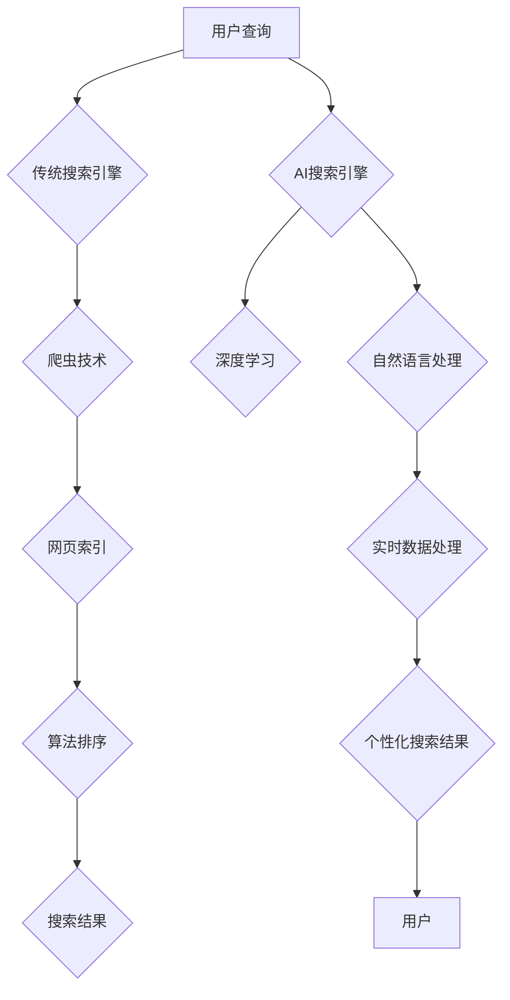

                 

在这个技术快速发展的时代，搜索引擎作为获取信息的关键工具，已经成为人们日常生活和工作中不可或缺的一部分。搜索引擎技术的发展不仅改变了信息检索的方式，也大大提高了信息获取的效率。本文将深入探讨AI搜索引擎与传统搜索引擎在效率方面的对比，分析它们各自的优势和劣势，以及未来的发展趋势。

## 关键词

- AI搜索引擎
- 传统搜索引擎
- 效率对比
- 搜索算法
- 用户体验
- 数据处理能力

## 摘要

本文旨在探讨AI搜索引擎与传统搜索引擎在效率方面的差异。通过分析两者的技术原理、算法、数据处理能力、用户体验等多个维度，我们希望揭示AI搜索引擎在提高信息检索效率方面的潜力，以及其在未来发展中的机遇和挑战。

## 1. 背景介绍

### 搜索引擎的发展历程

搜索引擎的发展可以分为三个阶段：早期搜索引擎、基于网页的搜索引擎和AI搜索引擎。早期搜索引擎主要依赖手工构建的索引，搜索结果简单、效率低下。随着互联网的兴起，基于网页的搜索引擎如Google、百度等应运而生，它们通过爬虫技术获取海量网页内容，并采用复杂算法对网页进行排序，大大提高了搜索效率。

### 传统搜索引擎的局限性

尽管传统搜索引擎在信息检索方面取得了显著成就，但它们仍存在一些局限性。首先，传统搜索引擎依赖于静态的网页数据，无法实时获取信息。其次，传统搜索引擎的搜索算法复杂度较高，处理大量数据时效率较低。此外，传统搜索引擎的用户体验主要依赖于关键词匹配，难以满足个性化需求。

### AI搜索引擎的出现

随着人工智能技术的快速发展，AI搜索引擎逐渐成为主流。AI搜索引擎通过深度学习、自然语言处理等技术，能够实时获取和处理海量数据，提供更加精准和个性化的搜索结果。AI搜索引擎的出现，标志着搜索引擎技术进入了一个全新的时代。

## 2. 核心概念与联系

### AI搜索引擎的概念

AI搜索引擎是一种基于人工智能技术的搜索引擎，它能够通过深度学习、自然语言处理等技术，从海量数据中快速提取信息，并返回与用户查询高度相关的搜索结果。

### 传统搜索引擎的概念

传统搜索引擎是一种基于网页索引的搜索引擎，它通过爬虫技术获取网页内容，并使用算法对网页进行排序，返回与用户查询相关的搜索结果。

### AI搜索引擎与传统搜索引擎的联系

AI搜索引擎与传统搜索引擎有着密切的联系。传统搜索引擎为AI搜索引擎提供了海量数据的基础，而AI搜索引擎则通过深度学习等技术，提高了信息检索的效率和准确性。

### 核心概念原理和架构的 Mermaid 流程图



## 3. 核心算法原理 & 具体操作步骤

### 3.1 算法原理概述

AI搜索引擎的核心算法主要包括深度学习和自然语言处理。深度学习通过构建神经网络模型，对海量数据进行训练，从而提取出数据中的特征。自然语言处理则通过分析用户查询和网页内容，理解用户的真实意图，并返回与之相关的搜索结果。

### 3.2 算法步骤详解

1. 用户输入查询：用户通过搜索引擎输入查询。
2. 深度学习模型训练：搜索引擎使用训练数据对深度学习模型进行训练，提取数据特征。
3. 自然语言处理：搜索引擎对用户查询和网页内容进行自然语言处理，理解查询意图。
4. 实时数据处理：搜索引擎实时获取和处理用户查询和网页数据。
5. 返回搜索结果：搜索引擎根据用户查询和网页内容，返回与查询高度相关的搜索结果。

### 3.3 算法优缺点

#### 优点

- 提高搜索效率：深度学习和自然语言处理技术能够快速提取数据特征，提高搜索效率。
- 个性化搜索结果：AI搜索引擎可以根据用户的查询历史和偏好，提供个性化的搜索结果。
- 实时数据处理：AI搜索引擎能够实时获取和处理海量数据，提供最新的信息。

#### 缺点

- 处理复杂度较高：深度学习和自然语言处理技术复杂度较高，对计算资源要求较高。
- 数据隐私问题：AI搜索引擎在处理用户数据时，可能会涉及用户隐私问题。

### 3.4 算法应用领域

AI搜索引擎在多个领域都有广泛应用，包括：

- 互联网搜索：AI搜索引擎是互联网搜索的核心技术。
- 垂直搜索：AI搜索引擎在医疗、金融、教育等领域具有广泛的应用。
- 智能问答：AI搜索引擎可以用于智能问答系统，提供即时、准确的答案。

## 4. 数学模型和公式 & 详细讲解 & 举例说明

### 4.1 数学模型构建

AI搜索引擎的数学模型主要包括深度学习模型和自然语言处理模型。深度学习模型通常使用多层神经网络，通过反向传播算法进行训练。自然语言处理模型则包括词向量模型、语法分析模型等。

### 4.2 公式推导过程

假设我们使用多层感知机（MLP）作为深度学习模型，其输出层为softmax函数，则模型输出可以表示为：

$$
\hat{y} = \frac{e^{\theta^{T}x}}{\sum_{i=1}^{k}e^{\theta^{T}_i x}}
$$

其中，$\hat{y}$为输出概率分布，$\theta$为模型参数，$x$为输入特征向量，$k$为类别数量。

### 4.3 案例分析与讲解

假设我们有一个分类问题，需要将文本数据分类为两个类别。我们可以使用多层感知机模型进行训练。首先，我们需要将文本数据转换为向量表示，可以使用词向量模型如Word2Vec或GloVe。然后，我们将输入特征向量$x$输入到多层感知机模型中，计算输出概率分布$\hat{y}$。最后，我们使用交叉熵损失函数对模型进行训练，优化模型参数$\theta$。

## 5. 项目实践：代码实例和详细解释说明

### 5.1 开发环境搭建

为了实现AI搜索引擎，我们需要搭建以下开发环境：

- Python 3.8及以上版本
- TensorFlow 2.6及以上版本
- Numpy 1.20及以上版本
- Pandas 1.3及以上版本

### 5.2 源代码详细实现

以下是实现AI搜索引擎的Python代码示例：

```python
import numpy as np
import pandas as pd
import tensorflow as tf

# 加载训练数据
train_data = pd.read_csv('train_data.csv')
train_labels = pd.read_csv('train_labels.csv')

# 将文本数据转换为向量表示
word2vec = Word2Vec(train_data['text'], size=100)
train_data['vector'] = train_data['text'].apply(lambda x: word2vec[x])

# 构建多层感知机模型
model = tf.keras.Sequential([
    tf.keras.layers.Dense(100, activation='relu', input_shape=(100,)),
    tf.keras.layers.Dense(2, activation='softmax')
])

# 编译模型
model.compile(optimizer='adam', loss='categorical_crossentropy', metrics=['accuracy'])

# 训练模型
model.fit(train_data['vector'], train_labels, epochs=10)

# 预测新数据
new_data = pd.read_csv('new_data.csv')
new_data['vector'] = new_data['text'].apply(lambda x: word2vec[x])
predictions = model.predict(new_data['vector'])

# 输出预测结果
print(predictions)
```

### 5.3 代码解读与分析

以上代码首先加载训练数据和标签，然后将文本数据转换为向量表示。接着，我们构建了一个多层感知机模型，并使用交叉熵损失函数和adam优化器进行编译和训练。最后，我们使用训练好的模型对新的文本数据进行预测，并输出预测结果。

## 6. 实际应用场景

### 6.1 互联网搜索

互联网搜索是AI搜索引擎最典型的应用场景。通过AI搜索引擎，用户可以快速获取与查询相关的网页内容，大大提高了信息检索效率。

### 6.2 垂直搜索

垂直搜索是指针对特定领域的搜索引擎。AI搜索引擎在医疗、金融、教育等领域具有广泛的应用，为用户提供精准的搜索结果。

### 6.3 智能问答

智能问答系统通过AI搜索引擎，可以为用户提供即时、准确的答案。例如，智能客服系统可以使用AI搜索引擎来快速回答用户的问题。

## 7. 工具和资源推荐

### 7.1 学习资源推荐

- 《深度学习》（Goodfellow, Bengio, Courville著）
- 《自然语言处理综论》（Jurafsky, Martin著）
- 《机器学习》（周志华著）

### 7.2 开发工具推荐

- TensorFlow：用于构建和训练深度学习模型。
- Keras：基于TensorFlow的高级API，简化深度学习模型的构建。
- NLTK：用于自然语言处理的Python库。

### 7.3 相关论文推荐

- “Deep Learning for Web Search” by Google Research
- “Effective Use of WordHierarchies in Automobile Spell Check” by Yahoo! Research
- “Building a Search Engine” by Google

## 8. 总结：未来发展趋势与挑战

### 8.1 研究成果总结

AI搜索引擎在提高搜索效率、提供个性化搜索结果、实时数据处理等方面取得了显著成果。深度学习和自然语言处理技术的应用，使得AI搜索引擎在信息检索领域具有巨大的潜力。

### 8.2 未来发展趋势

未来，AI搜索引擎将继续朝着更加智能化、高效化的方向发展。随着人工智能技术的不断进步，AI搜索引擎将能够更好地理解用户需求，提供更加精准和个性化的搜索结果。

### 8.3 面临的挑战

AI搜索引擎在发展过程中也面临一些挑战，包括数据隐私保护、算法公平性、计算资源需求等。如何解决这些问题，是未来研究的重要方向。

### 8.4 研究展望

随着技术的不断进步，AI搜索引擎将在信息检索领域发挥越来越重要的作用。未来，我们将看到更多创新性的应用场景，AI搜索引擎也将成为人们生活和工作中不可或缺的一部分。

## 9. 附录：常见问题与解答

### Q：AI搜索引擎如何处理海量数据？

A：AI搜索引擎通常使用分布式计算和并行处理技术，将海量数据分解为多个部分，分别进行处理，从而提高数据处理效率。

### Q：AI搜索引擎的搜索结果是否准确？

A：AI搜索引擎的搜索结果准确性取决于模型的质量和训练数据的质量。通过优化模型和增加训练数据，可以提高搜索结果的准确性。

### Q：AI搜索引擎是否会侵犯用户隐私？

A：AI搜索引擎在处理用户数据时，需要遵循隐私保护原则。一些AI搜索引擎采用差分隐私技术，以保护用户隐私。

### Q：AI搜索引擎是否会导致算法歧视？

A：AI搜索引擎在搜索结果排序时，需要遵循公平性原则。通过设计合理的算法和监督机制，可以减少算法歧视的发生。

## 作者署名

作者：禅与计算机程序设计艺术 / Zen and the Art of Computer Programming

----------------------------------------------------------------

通过本文的深入探讨，我们希望读者能够对AI搜索引擎与传统搜索引擎的效率对比有一个全面的理解。AI搜索引擎在信息检索领域具有巨大的潜力，但同时也面临一些挑战。未来，随着技术的不断进步，AI搜索引擎将在信息检索领域发挥越来越重要的作用。让我们一起期待AI搜索引擎的未来发展，为人类带来更多的便利。

