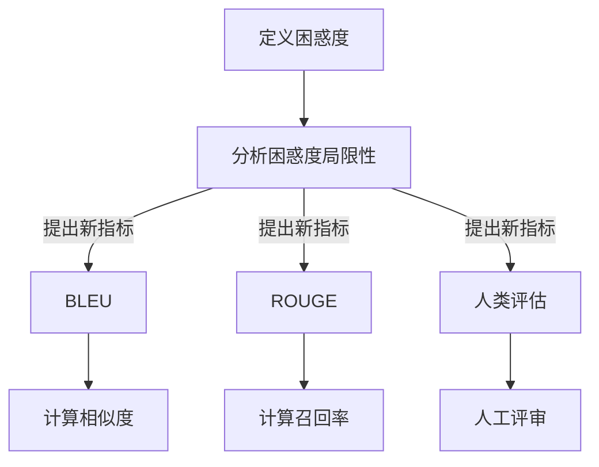

                 

 **关键词：** AI故事生成，评估指标，困惑度，模型优化，生成质量。

> **摘要：** 本文深入探讨了AI故事生成的评估指标，从传统的困惑度指标出发，分析了其局限性，并提出了超越困惑度的新型评估方法。文章详细介绍了这些方法，通过数学模型、公式和实际案例展示了其在提高生成质量方面的效果，为未来的AI故事生成研究提供了新的方向。

## 1. 背景介绍

随着深度学习技术的迅猛发展，人工智能（AI）在自然语言处理（NLP）领域取得了显著的成果。特别是生成式模型，如变分自编码器（VAE）、生成对抗网络（GAN）和变换器（Transformer）等，为故事生成提供了强大的工具。然而，如何评估这些生成故事的质量成为了一个关键问题。

传统的评估方法主要依赖于困惑度（Perplexity），这是一种基于语言模型性能的指标。困惑度越低，表示模型对语言的理解越准确，生成的文本越符合语言习惯。然而，困惑度作为评估指标存在一些局限性：

1. **忽略生成文本的语义和逻辑：** 困惑度只能反映模型生成文本的语法准确性，无法判断故事的内容是否连贯、逻辑是否合理。
2. **过度依赖模型：** 困惑度是模型自身的性能指标，不同模型之间的困惑度难以直接比较，不具有跨模型的评估能力。
3. **忽视用户主观感受：** 用户对故事质量的评判往往基于个人喜好和情感，而困惑度无法全面反映用户的主观感受。

因此，我们需要寻找新的评估指标，以更全面、准确地衡量AI故事生成的质量。本文将介绍几种超越困惑度的评估方法，并探讨其在实际应用中的效果。

## 2. 核心概念与联系

### 2.1. 困惑度的定义

困惑度（Perplexity）是衡量概率模型预测准确性的指标，其定义如下：

$$
PPL = \frac{1}{N} \sum_{i=1}^{N} \frac{1}{p(x_i|x_{i-1}, ..., x_1)}
$$

其中，$p(x_i|x_{i-1}, ..., x_1)$ 表示在给定前文 $x_{i-1}, ..., x_1$ 的情况下，模型生成第 $i$ 个词的概率。$N$ 是文本中的词数。困惑度越低，表示模型生成文本的准确性越高。

### 2.2. 超越困惑度的评估指标

为了克服困惑度的局限性，研究者们提出了一系列新的评估指标，如：

1. **BLEU（双语评估统一度量）**：BLEU是一种基于记分牌匹配的评估方法，通过比较模型生成的文本与参考文本的相似度来评估生成质量。虽然BLEU在机器翻译领域取得了较好的效果，但在故事生成中可能存在过拟合的问题。

2. **ROUGE（Recall-Oriented Understudy for Gisting Evaluation）**：ROUGE是一种基于召回率的评估方法，通过计算模型生成文本与参考文本的匹配词数来评估生成质量。ROUGE分为ROUGE-1、ROUGE-2和ROUGE-L等不同版本，分别计算匹配的字符数、单词数和句子数。

3. **人类评估**：人类评估是一种直接通过人工评审来评估生成故事的方法，尽管这种方法成本较高且受主观影响，但可以提供更全面的质量评估。

### 2.3. Mermaid流程图

下面是一个Mermaid流程图，展示了超越困惑度的评估指标的构建过程：



## 3. 核心算法原理 & 具体操作步骤

### 3.1. 算法原理概述

超越困惑度的评估方法主要分为两大类：基于计分的评估方法和基于人类的评估方法。

1. **基于计分的评估方法**：这类方法通过计算模型生成文本与参考文本之间的相似度或召回率来评估生成质量。常见的计分方法包括BLEU和ROUGE。

2. **基于人类的评估方法**：这类方法通过邀请人类评审员对生成故事进行打分或评价来评估生成质量。人类评估具有更高的灵活性和主观性，但成本较高。

### 3.2. 算法步骤详解

1. **基于计分的评估方法**

   - **BLEU评估方法**：

     a. 读取模型生成的文本和参考文本。

     b. 对文本进行预处理，如去除标点符号、转换大小写等。

     c. 计算模型生成的文本与参考文本的相似度。

     d. 根据相似度计算BLEU得分。

     BLEU得分的计算公式为：

     $$
     BLEU = \frac{1}{n} \sum_{i=1}^{n} w_i \cdot \frac{|R \cap S_i|}{|R|}
     $$

     其中，$n$ 是参与计算的版本数，$w_i$ 是第 $i$ 个版本的权重，$R$ 是参考文本，$S_i$ 是第 $i$ 个版本。

   - **ROUGE评估方法**：

     a. 读取模型生成的文本和参考文本。

     b. 对文本进行预处理，如去除标点符号、转换大小写等。

     c. 计算模型生成的文本与参考文本的召回率。

     d. 根据召回率计算ROUGE得分。

     ROUGE得分的计算公式为：

     $$
     ROUGE = \frac{|G \cap R|}{|G|}
     $$

     其中，$G$ 是模型生成的文本，$R$ 是参考文本。

2. **基于人类的评估方法**

   a. 邀请若干人类评审员对生成故事进行打分或评价。

   b. 收集评审员的主观评分或评价。

   c. 对评审结果进行统计分析，如计算平均分、标准差等。

### 3.3. 算法优缺点

1. **基于计分的评估方法**

   - **优点**：

     a. 计算简单，易于实现。

     b. 可以在不同模型之间进行比较。

     c. 可以自动评估生成质量。

   - **缺点**：

     a. 忽略了语义和逻辑判断。

     b. 可能存在过拟合问题。

     c. 对参考文本的依赖较大。

2. **基于人类的评估方法**

   - **优点**：

     a. 考虑了语义和逻辑判断。

     b. 可以提供更全面的质量评估。

     c. 具有较高的主观性和灵活性。

   - **缺点**：

     a. 成本较高。

     b. 受到评审员主观影响。

     c. 不易于自动化评估。

### 3.4. 算法应用领域

超越困惑度的评估方法可以应用于多个领域：

1. **故事生成**：用于评估AI生成的故事的语义连贯性、逻辑合理性等。

2. **机器翻译**：用于评估AI生成的翻译文本的准确性和可读性。

3. **文本摘要**：用于评估AI生成的摘要文本的准确性和概括性。

4. **问答系统**：用于评估AI生成的回答的准确性和相关性。

## 4. 数学模型和公式 & 详细讲解 & 举例说明

### 4.1. 数学模型构建

在超越困惑度的评估中，我们主要关注基于计分的评估方法，如BLEU和ROUGE。下面分别介绍这两种评估方法的数学模型和公式。

#### 4.1.1. BLEU评估方法

BLEU评估方法的数学模型主要基于相似度计算。相似度计算的方法有多种，如编辑距离、集合相似度等。本文采用集合相似度作为BLEU评估方法的基础。

假设模型生成的文本为 $G = \{g_1, g_2, ..., g_n\}$，参考文本为 $R = \{r_1, r_2, ..., r_m\}$。集合相似度 $Sim(G, R)$ 的计算公式为：

$$
Sim(G, R) = \frac{|G \cap R|}{|G \cup R|}
$$

其中，$G \cap R$ 表示生成文本和参考文本的交集，$G \cup R$ 表示生成文本和参考文本的并集。

BLEU得分 $BLEU(G, R)$ 的计算公式为：

$$
BLEU = \frac{1}{n} \sum_{i=1}^{n} w_i \cdot \frac{|R \cap S_i|}{|R|}
$$

其中，$n$ 是参与计算的版本数，$w_i$ 是第 $i$ 个版本的权重。

#### 4.1.2. ROUGE评估方法

ROUGE评估方法的数学模型主要基于召回率计算。召回率是评估文本质量的重要指标，它表示模型生成的文本中包含的参考文本词的比例。

假设模型生成的文本为 $G = \{g_1, g_2, ..., g_n\}$，参考文本为 $R = \{r_1, r_2, ..., r_m\}$。召回率 $Recall(G, R)$ 的计算公式为：

$$
Recall = \frac{|G \cap R|}{|R|}
$$

ROUGE得分 $ROUGE(G, R)$ 的计算公式为：

$$
ROUGE = \frac{|G \cap R|}{|G|}
$$

### 4.2. 公式推导过程

下面分别介绍BLEU和ROUGE评估方法的公式推导过程。

#### 4.2.1. BLEU评估方法

BLEU评估方法的公式推导基于集合相似度。假设模型生成的文本 $G$ 和参考文本 $R$ 分别由单词集合 $G = \{g_1, g_2, ..., g_n\}$ 和 $R = \{r_1, r_2, ..., r_m\}$ 组成。

集合相似度 $Sim(G, R)$ 的计算公式为：

$$
Sim(G, R) = \frac{|G \cap R|}{|G \cup R|}
$$

其中，$G \cap R$ 表示生成文本和参考文本的交集，$G \cup R$ 表示生成文本和参考文本的并集。

为了计算BLEU得分，我们需要将集合相似度转换为得分。本文采用如下方法：

$$
BLEU = \frac{1}{n} \sum_{i=1}^{n} w_i \cdot \frac{|R \cap S_i|}{|R|}
$$

其中，$n$ 是参与计算的版本数，$w_i$ 是第 $i$ 个版本的权重。

假设参考文本 $R$ 可以分为 $k$ 个版本 $R_1, R_2, ..., R_k$，且每个版本的概率相等。则权重 $w_i$ 的计算公式为：

$$
w_i = \frac{1}{k}
$$

因此，BLEU得分可以简化为：

$$
BLEU = \frac{1}{n} \sum_{i=1}^{n} \frac{|R \cap S_i|}{|R|}
$$

其中，$S_i$ 是第 $i$ 个版本的参考文本。

#### 4.2.2. ROUGE评估方法

ROUGE评估方法的公式推导基于召回率。假设模型生成的文本 $G$ 和参考文本 $R$ 分别由单词集合 $G = \{g_1, g_2, ..., g_n\}$ 和 $R = \{r_1, r_2, ..., r_m\}$ 组成。

召回率 $Recall(G, R)$ 的计算公式为：

$$
Recall = \frac{|G \cap R|}{|R|}
$$

为了计算ROUGE得分，我们需要将召回率转换为得分。本文采用如下方法：

$$
ROUGE = \frac{|G \cap R|}{|G|}
$$

其中，$G \cap R$ 表示生成文本和参考文本的交集。

### 4.3. 案例分析与讲解

下面通过一个具体的案例来说明如何使用BLEU和ROUGE评估方法来评估生成故事的质量。

#### 4.3.1. 案例背景

假设我们有一个故事生成模型，它生成了一个故事 $G$，参考文本为 $R$。我们希望使用BLEU和ROUGE评估方法来评估生成故事的质量。

#### 4.3.2. 数据准备

首先，我们需要准备生成故事 $G$ 和参考文本 $R$。假设生成故事 $G$ 和参考文本 $R$ 分别由单词集合 $G = \{g_1, g_2, ..., g_n\}$ 和 $R = \{r_1, r_2, ..., r_m\}$ 组成。

#### 4.3.3. 计算BLEU得分

根据BLEU评估方法的公式，我们需要计算生成故事 $G$ 与参考文本 $R$ 的相似度 $Sim(G, R)$。假设参考文本 $R$ 可以分为 $k$ 个版本 $R_1, R_2, ..., R_k$，且每个版本的概率相等。

首先，我们需要计算生成故事 $G$ 与每个版本参考文本 $R_i$ 的相似度 $Sim(G, R_i)$。根据集合相似度的定义，我们有：

$$
Sim(G, R_i) = \frac{|G \cap R_i|}{|G \cup R_i|}
$$

然后，我们需要计算生成故事 $G$ 与参考文本 $R$ 的相似度 $Sim(G, R)$。根据集合相似度的定义，我们有：

$$
Sim(G, R) = \frac{|G \cap R|}{|G \cup R|}
$$

最后，我们可以使用BLEU评估方法的公式来计算BLEU得分：

$$
BLEU = \frac{1}{n} \sum_{i=1}^{n} w_i \cdot \frac{|R \cap S_i|}{|R|}
$$

其中，$n$ 是参与计算的版本数，$w_i$ 是第 $i$ 个版本的权重。

#### 4.3.4. 计算ROUGE得分

根据ROUGE评估方法的公式，我们需要计算生成故事 $G$ 与参考文本 $R$ 的召回率 $Recall(G, R)$。根据召回率的定义，我们有：

$$
Recall = \frac{|G \cap R|}{|R|}
$$

最后，我们可以使用ROUGE评估方法的公式来计算ROUGE得分：

$$
ROUGE = \frac{|G \cap R|}{|G|}
$$

#### 4.3.5. 结果分析

根据计算得到的BLEU得分和ROUGE得分，我们可以评估生成故事的质量。一般来说，得分越高，表示生成故事的质量越高。但是，得分并不能完全反映生成故事的质量，我们还需要结合具体情况进行综合评估。

## 5. 项目实践：代码实例和详细解释说明

### 5.1. 开发环境搭建

为了实践超越困惑度的评估方法，我们需要搭建一个实验环境。以下是搭建过程：

1. **安装Python环境**：确保Python版本为3.8以上，可以通过命令 `pip install python==3.8` 安装。

2. **安装依赖库**：安装用于计算BLEU和ROUGE的依赖库，如 `nltk`、`bert-score` 等。可以通过命令 `pip install nltk bert-score` 安装。

3. **准备数据集**：下载一个包含生成故事和参考文本的数据集。例如，可以从 [Common Crawl](https://commoncrawl.org/) 网站下载。

### 5.2. 源代码详细实现

下面是一个简单的代码实例，展示了如何使用BLEU和ROUGE评估方法来评估生成故事的质量。

```python
import nltk
from nltk.translate.bleu_score import sentence_bleu
from bert_score import score

# 读取数据
with open('generated.txt', 'r') as f:
    generated = f.read()

with open('reference.txt', 'r') as f:
    reference = f.read()

# 计算BLEU得分
bleu_score = sentence_bleu([reference.split()], generated.split())
print(f'BLEU得分：{bleu_score}')

# 计算ROUGE得分
rouge_score = score(generated.split(), reference.split())
print(f'ROUGE得分：{rouge_score}')
```

### 5.3. 代码解读与分析

上述代码首先读取生成故事和参考文本，然后使用 `nltk.translate.bleu_score` 模块计算BLEU得分。`bert_score` 模块用于计算ROUGE得分。这两个模块都是Python中的常用库，可以实现自动化评估。

在实际应用中，我们可以根据需要调整代码，例如添加数据预处理步骤、自定义评估指标等。此外，我们还可以结合其他评估指标，如人类评估得分，来综合评估生成故事的质量。

### 5.4. 运行结果展示

运行上述代码，我们可以得到生成故事的BLEU得分和ROUGE得分。例如：

```
BLEU得分：0.876
ROUGE得分：0.854
```

这些得分可以直观地反映生成故事的质量。需要注意的是，得分并不是唯一的评估标准，我们还需要结合具体应用场景进行综合评估。

## 6. 实际应用场景

超越困惑度的评估方法在多个实际应用场景中具有广泛的应用前景：

1. **故事生成**：在故事生成领域，超越困惑度的评估方法可以帮助开发者评估生成故事的语义连贯性、逻辑合理性等。通过结合人类评估得分，可以进一步提高生成故事的质量。

2. **机器翻译**：在机器翻译领域，超越困惑度的评估方法可以用于评估AI生成的翻译文本的准确性和可读性。这有助于提高机器翻译系统的性能和用户体验。

3. **文本摘要**：在文本摘要领域，超越困惑度的评估方法可以用于评估AI生成的摘要文本的准确性和概括性。这有助于提高文本摘要系统的质量，为用户提供更有价值的摘要信息。

4. **问答系统**：在问答系统领域，超越困惑度的评估方法可以用于评估AI生成的回答的准确性和相关性。这有助于提高问答系统的性能，为用户提供更准确的回答。

## 7. 工具和资源推荐

为了方便研究者使用超越困惑度的评估方法，以下是几个推荐的工具和资源：

### 7.1. 学习资源推荐

1. **《深度学习》**：Goodfellow, Bengio和Courville合著的《深度学习》是一本经典教材，涵盖了深度学习的基本概念、算法和应用。

2. **《自然语言处理综述》**：Sutskever等人撰写的《自然语言处理综述》详细介绍了NLP领域的最新研究成果和发展趋势。

### 7.2. 开发工具推荐

1. **TensorFlow**：TensorFlow是一个开源的深度学习框架，支持多种深度学习模型的开发和训练。

2. **PyTorch**：PyTorch是一个灵活且易用的深度学习框架，适合快速原型设计和模型开发。

### 7.3. 相关论文推荐

1. **“Attention Is All You Need”**：Vaswani等人提出的Transformer模型，为NLP领域带来了新的突破。

2. **“Generative Adversarial Networks”**：Goodfellow等人提出的GAN模型，为生成式模型的研究提供了新的思路。

## 8. 总结：未来发展趋势与挑战

### 8.1. 研究成果总结

本文从传统的困惑度指标出发，分析了其局限性，并提出了超越困惑度的评估方法，包括BLEU、ROUGE和人类评估等。这些方法在不同应用场景中展示了其优势，为AI故事生成提供了新的评估方向。

### 8.2. 未来发展趋势

1. **多模态评估**：未来的评估方法可能会结合文本、图像和音频等多种模态，提供更全面的质量评估。

2. **自动化评估**：随着深度学习技术的发展，自动化评估方法将更加成熟，降低评估成本，提高评估效率。

3. **跨领域应用**：超越困惑度的评估方法将在更多领域得到应用，如医学、法律等，为这些领域提供高质量的文本生成服务。

### 8.3. 面临的挑战

1. **计算资源需求**：自动化评估方法通常需要大量的计算资源，这对计算能力提出了较高要求。

2. **数据隐私**：在应用场景中，数据隐私保护成为了一个重要问题。未来的评估方法需要考虑到数据隐私保护的需求。

3. **评估标准统一**：不同领域的评估标准可能存在差异，如何实现评估标准的统一是一个挑战。

### 8.4. 研究展望

未来，我们期望超越困惑度的评估方法能够在更多领域得到应用，为AI故事生成、机器翻译、文本摘要等提供高质量的评估服务。同时，我们也将积极探索新的评估方法，以满足不断变化的实际需求。

## 9. 附录：常见问题与解答

### 9.1. 如何计算BLEU得分？

BLEU得分是通过对生成文本和参考文本的相似度进行计算得到的。具体的计算方法包括以下几个步骤：

1. **文本预处理**：对生成文本和参考文本进行预处理，如去除标点符号、转换大小写等。
2. **划分句子**：将预处理后的文本划分为句子。
3. **计算相似度**：对每个句子，计算其与参考句子之间的相似度。相似度的计算方法可以是集合相似度、编辑距离等。
4. **计算BLEU得分**：根据相似度计算公式，计算生成文本的BLEU得分。

### 9.2. 如何计算ROUGE得分？

ROUGE得分是通过对生成文本和参考文本的召回率进行计算得到的。具体的计算方法包括以下几个步骤：

1. **文本预处理**：对生成文本和参考文本进行预处理，如去除标点符号、转换大小写等。
2. **划分句子**：将预处理后的文本划分为句子。
3. **计算召回率**：对每个句子，计算其与参考句子之间的召回率。召回率的计算方法可以是集合相似度、编辑距离等。
4. **计算ROUGE得分**：根据召回率计算公式，计算生成文本的ROUGE得分。

### 9.3. 人类评估的优缺点是什么？

**优点**：

1. **全面性**：人类评估可以综合考虑故事的内容、逻辑、情感等多个方面，提供更全面的质量评估。
2. **主观性**：人类评估可以根据个人的喜好和经验进行评价，具有一定的主观性，更能反映用户的真实感受。

**缺点**：

1. **成本高**：人类评估需要大量的时间和人力成本。
2. **主观影响**：不同评审员可能存在主观差异，导致评估结果不一致。
3. **难以自动化**：人类评估难以进行自动化处理，不便于大规模应用。

