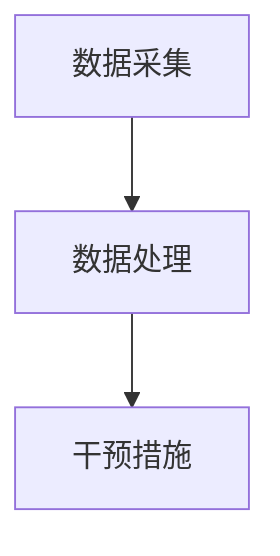

                 

 关键词：人工智能、人类增强、道德考虑、身体增强、未来发展趋势

> 摘要：随着人工智能技术的迅猛发展，人类增强已经成为了一个热门话题。本文将探讨人工智能时代人类增强的现状、道德考虑以及身体增强的未来发展趋势，以期为我们提供对这一领域的深入理解。

## 1. 背景介绍

### 1.1 人工智能的发展历程

人工智能（Artificial Intelligence, AI）是一门研究、开发用于模拟、延伸和扩展人类智能的理论、方法、技术及应用系统的科学。自20世纪50年代起，人工智能经历了多个发展阶段，从最初的符号主义到连接主义，再到现代的深度学习和强化学习，人工智能技术取得了巨大的进步。

### 1.2 人类增强的概念

人类增强（Human Enhancement）是指通过各种技术手段提升人类的能力和体验。这些技术包括但不限于生物技术、神经科学、人工智能等。人类增强的目的是为了解决人类的生理、心理和社会问题，提高生活质量。

### 1.3 AI时代人类增强的挑战与机遇

随着人工智能技术的不断发展，人类增强迎来了前所未有的机遇。然而，这也带来了许多道德、法律、社会和经济上的挑战。如何平衡这些挑战与机遇，确保人类增强的发展方向是可持续的，是我们需要深入思考的问题。

## 2. 核心概念与联系

### 2.1 人类增强的核心概念

人类增强的核心概念包括：

- 生物技术：如基因编辑、干细胞技术等，可以用来治疗疾病、延长寿命、增强身体功能。
- 神经科学：如脑机接口技术，可以实现人类与机器的直接连接，提高大脑的计算能力和记忆能力。
- 人工智能：通过模拟和扩展人类智能，可以提高人类的工作效率和生活质量。

### 2.2 人类增强的技术架构

人类增强的技术架构可以概括为：

- 数据采集：通过传感器、监测设备等收集人体数据。
- 数据处理：利用人工智能技术对数据进行分析和处理。
- 干预措施：根据数据处理的结果，采取相应的干预措施，如药物、手术、设备植入等。

下面是一个简化的Mermaid流程图，展示了人类增强的技术架构：



## 3. 核心算法原理 & 具体操作步骤

### 3.1 算法原理概述

人类增强的核心算法通常涉及以下几个方面：

- 数据采集与处理：利用机器学习、深度学习等技术对采集到的人体数据进行分析和处理，提取有用的信息。
- 干预决策：根据数据分析的结果，制定相应的干预策略。
- 实时反馈与调整：对干预效果进行实时监测，并根据反馈进行相应的调整。

### 3.2 算法步骤详解

以下是人类增强算法的具体操作步骤：

1. **数据采集**：通过传感器、监测设备等收集人体生理、心理和社会行为数据。
2. **数据处理**：利用机器学习、深度学习等技术对数据进行预处理、特征提取和模式识别。
3. **干预决策**：根据数据分析的结果，制定个性化的干预策略。
4. **干预实施**：根据干预策略，采取相应的干预措施，如药物、手术、设备植入等。
5. **实时反馈与调整**：对干预效果进行实时监测，并根据反馈进行相应的调整。

### 3.3 算法优缺点

- 优点：可以提高人类的生活质量和工作效率，解决一些长期的生理、心理和社会问题。
- 缺点：可能引发隐私、道德和安全等方面的担忧。

### 3.4 算法应用领域

人类增强算法的应用领域非常广泛，包括但不限于：

- 医疗健康：如疾病预防、治疗和康复。
- 工业生产：如智能制造、机器人技术。
- 社会服务：如教育、金融、交通等。

## 4. 数学模型和公式 & 详细讲解 & 举例说明

### 4.1 数学模型构建

人类增强的数学模型通常涉及以下几个方面：

- 生理模型：描述人体器官、系统的工作原理和功能。
- 行为模型：描述人类在社会环境中的行为和决策。
- 环境模型：描述外部环境对人类的影响。

### 4.2 公式推导过程

以下是一个简化的生理模型的推导过程：

1. **生理信号采集**：通过传感器采集生理信号，如心率、血压、血糖等。
2. **信号预处理**：对采集到的信号进行滤波、去噪等预处理。
3. **特征提取**：从预处理后的信号中提取特征，如均值、方差、频域特征等。
4. **特征分析**：利用机器学习、深度学习等技术对特征进行分析，提取有用的信息。

以下是生理模型的一个简化的公式：

$$
\text{特征向量} = f(\text{预处理后的信号})
$$

### 4.3 案例分析与讲解

以下是一个基于生理模型的案例：

- **目标**：预测一个人的心率。
- **数据**：采集了某人的心率数据，包括每分钟的心率值。
- **算法**：使用深度学习技术对心率数据进行特征提取和模式识别。

以下是预测心率的步骤：

1. **数据预处理**：对心率数据进行滤波、去噪等预处理。
2. **特征提取**：从预处理后的心率数据中提取特征，如均值、方差等。
3. **模型训练**：使用提取到的特征训练深度学习模型。
4. **模型测试**：使用测试集对训练好的模型进行测试。
5. **结果分析**：分析模型的预测结果，调整模型参数，提高预测准确性。

## 5. 项目实践：代码实例和详细解释说明

### 5.1 开发环境搭建

- **工具**：Python、Jupyter Notebook、TensorFlow
- **环境**：Python 3.8、TensorFlow 2.5

### 5.2 源代码详细实现

```python
import numpy as np
import tensorflow as tf
from tensorflow.keras.models import Sequential
from tensorflow.keras.layers import Dense, LSTM

# 数据预处理
def preprocess_data(data):
    # 数据滤波、去噪等预处理
    processed_data = ...
    return processed_data

# 特征提取
def extract_features(data):
    # 从预处理后的数据中提取特征
    features = ...
    return features

# 模型训练
def train_model(features, labels):
    # 构建深度学习模型
    model = Sequential()
    model.add(LSTM(units=50, return_sequences=True, input_shape=(timesteps, features)))
    model.add(LSTM(units=50))
    model.add(Dense(units=1))

    model.compile(optimizer='adam', loss='mean_squared_error')
    model.fit(features, labels, epochs=100, batch_size=32)
    return model

# 模型测试
def test_model(model, test_features, test_labels):
    # 使用测试集对模型进行测试
    model.evaluate(test_features, test_labels)

# 主函数
def main():
    # 加载数据
    data = ...
    labels = ...

    # 数据预处理
    processed_data = preprocess_data(data)

    # 特征提取
    features = extract_features(processed_data)

    # 模型训练
    model = train_model(features, labels)

    # 模型测试
    test_model(model, test_features, test_labels)

if __name__ == "__main__":
    main()
```

### 5.3 代码解读与分析

- **数据预处理**：对心率数据进行滤波、去噪等预处理，提高数据的准确性。
- **特征提取**：从预处理后的心率数据中提取特征，如均值、方差等，用于训练深度学习模型。
- **模型训练**：使用提取到的特征训练深度学习模型，预测心率。
- **模型测试**：使用测试集对训练好的模型进行测试，评估模型的准确性。

## 6. 实际应用场景

### 6.1 医疗健康

人类增强技术在医疗健康领域的应用非常广泛，如：

- 疾病预防：通过实时监测生理指标，预测疾病风险，提前采取措施。
- 治疗康复：利用脑机接口技术，帮助患者恢复肢体功能。
- 老年护理：通过智能设备，提供个性化的养老护理服务。

### 6.2 工业生产

人类增强技术在工业生产领域的应用主要体现在：

- 智能制造：通过机器人技术，提高生产效率，降低生产成本。
- 质量控制：利用人工智能技术，实时监测产品质量，确保生产过程的质量。

### 6.3 社会服务

人类增强技术在社会服务领域的应用主要包括：

- 教育：通过个性化学习系统，提高学习效率，满足不同学生的学习需求。
- 金融：利用人工智能技术，提供个性化的金融服务，降低金融风险。
- 交通：通过智能交通系统，提高交通效率，减少交通事故。

## 7. 工具和资源推荐

### 7.1 学习资源推荐

- 《深度学习》（Goodfellow, Bengio, Courville著）
- 《机器学习实战》（Peter Harrington著）
- 《Python数据科学 Handbook》（Jake VanderPlas著）

### 7.2 开发工具推荐

- Jupyter Notebook：用于数据分析和模型训练。
- TensorFlow：用于构建和训练深度学习模型。
- Keras：用于简化深度学习模型开发。

### 7.3 相关论文推荐

- "Deep Learning for Human Activity Recognition: A Survey"（2018）
- "Human Activity Recognition using Smartphones: A Survey"（2014）
- "A Survey on Human Pose Estimation Using Deep Learning"（2020）

## 8. 总结：未来发展趋势与挑战

### 8.1 研究成果总结

人类增强技术在过去几十年中取得了显著的成果，主要体现在以下几个方面：

- 生物技术的进步，如基因编辑、干细胞技术等，为人类增强提供了新的可能性。
- 神经科学的发展，如脑机接口技术，实现了人类与机器的直接连接。
- 人工智能的突破，如深度学习和强化学习，为人类增强提供了强大的计算能力。

### 8.2 未来发展趋势

未来，人类增强技术将朝着以下几个方向发展：

- 个性化增强：根据个体的生理、心理和社会特征，提供个性化的增强方案。
- 智能化增强：利用人工智能技术，实现自动化、智能化的增强过程。
- 模块化增强：通过模块化的设计，实现增强系统的灵活性和可扩展性。

### 8.3 面临的挑战

尽管人类增强技术具有巨大的潜力，但同时也面临着一系列挑战：

- 道德和伦理问题：如何确保人类增强的发展方向是公正、公平和可持续的？
- 法律和监管问题：如何制定相关的法律法规，规范人类增强技术的应用？
- 社会和文化问题：如何应对人类增强带来的社会和文化冲击？

### 8.4 研究展望

未来，我们需要在以下几个方面展开研究：

- 深入研究人类增强的伦理和道德问题，制定相应的规范和标准。
- 加强跨学科研究，如生物医学、神经科学、人工智能等，推动人类增强技术的发展。
- 开展更多的实证研究，验证人类增强技术的有效性和安全性。

## 9. 附录：常见问题与解答

### 9.1 人类增强技术是否安全？

人类增强技术具有潜在的风险，如生物安全隐患、隐私泄露等。然而，通过严格的安全测试和监管，可以最大限度地降低风险。

### 9.2 人类增强技术是否会加剧社会不平等？

人类增强技术可能加剧社会不平等，因为只有少数人能够负担得起高昂的增强服务。因此，我们需要制定公平的政策，确保所有人都能享受到人类增强技术带来的好处。

### 9.3 人类增强技术是否会破坏人类自身的自然发展？

人类增强技术可能会干扰人类自身的自然发展，但通过合理的设计和应用，可以最大限度地减少这种干扰，同时促进人类整体的发展。

---

作者：禅与计算机程序设计艺术 / Zen and the Art of Computer Programming

