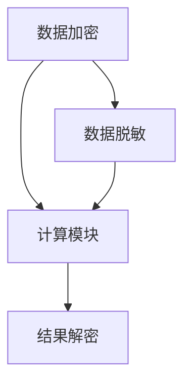

                 

### 关键词 Keywords

- AI模型
- 隐私计算
- Lepton AI
- 安全技术
- 加密算法
- 脱敏处理
- 同态加密
- 联邦学习

<|assistant|>### 摘要 Abstract

本文旨在探讨AI模型的隐私计算技术，重点介绍Lepton AI的安全技术。通过对比传统加密方法和隐私计算技术，分析同态加密和联邦学习的应用，我们探讨了如何在不牺牲模型性能的前提下，保障数据隐私。文章还通过具体案例和代码实例，详细讲解了隐私计算的实现步骤，为AI领域的研究者和开发者提供了有价值的参考。

<|assistant|>## 1. 背景介绍

在当今数据驱动的时代，人工智能（AI）已经成为各个行业的核心技术。然而，随着AI技术的广泛应用，数据隐私问题也日益突出。传统的数据保护方法，如加密和脱敏，虽然能够在一定程度上保障数据的安全性，但它们往往需要将数据从源系统迁移到安全系统进行处理，从而增加了数据泄露的风险。

隐私计算技术旨在解决这一难题，它允许在原始数据上进行计算，而无需暴露数据本身。这种技术不仅能够保护数据隐私，还能够提高数据处理的速度和效率。Lepton AI作为一款前沿的隐私计算框架，提供了一系列安全技术和算法，为AI模型的隐私计算提供了有力的支持。

本文将详细介绍Lepton AI的隐私计算技术，包括同态加密和联邦学习等核心算法，以及它们在实际应用中的优势和挑战。通过本文的阅读，读者将深入了解隐私计算技术的工作原理，掌握其在AI领域中的应用，并为未来的研究和开发提供启示。

### 2. 核心概念与联系

隐私计算技术是现代数据保护的重要手段，它通过加密和分布式计算等手段，确保数据在传输和处理过程中的安全性。以下是一些核心概念及其相互联系：

#### 2.1 同态加密

同态加密（Homomorphic Encryption）是一种加密算法，它允许在加密数据上执行计算，而不需要解密数据。这意味着，加密后的数据可以在云服务器上直接进行处理，从而避免了数据在传输过程中被泄露的风险。

#### 2.2 脱敏处理

脱敏处理（Data Anonymization）是一种数据保护技术，它通过隐藏或替换敏感信息，降低数据泄露的风险。脱敏处理通常包括数据加密、数据混淆和数据泛化等方法。

#### 2.3 联邦学习

联邦学习（Federated Learning）是一种分布式机器学习方法，它允许不同机构或设备上的数据在不传输数据本身的情况下，共同训练机器学习模型。联邦学习通过加密和差分隐私等手段，保障了数据隐私和安全。

#### 2.4 隐私计算架构

隐私计算架构通常包括以下几个关键组件：

- **加密模块**：负责对数据进行加密处理。
- **计算模块**：负责在加密数据上执行计算任务。
- **解密模块**：负责将加密结果解密为可用的数据。

这些组件协同工作，共同实现了数据的隐私保护和安全计算。

#### 2.5 Mermaid 流程图

以下是一个简单的Mermaid流程图，展示了隐私计算技术的基本架构：



在这个流程图中，数据首先经过加密模块进行加密，然后计算模块在加密数据上进行计算，最后结果由解密模块解密为可用数据。同时，数据脱敏模块在数据传输和处理过程中也起到了保护数据隐私的作用。

### 3. 核心算法原理 & 具体操作步骤

#### 3.1 算法原理概述

隐私计算的核心算法主要包括同态加密、差分隐私和联邦学习等。这些算法的基本原理如下：

- **同态加密**：允许在加密数据上进行计算，无需解密数据。
- **差分隐私**：通过添加噪声，确保单个数据记录无法被追踪，从而保护数据隐私。
- **联邦学习**：通过分布式计算，将数据留在本地设备上，避免数据在传输过程中的泄露。

#### 3.2 算法步骤详解

##### 3.2.1 同态加密步骤

1. **密钥生成**：首先生成加密密钥和计算密钥。
2. **数据加密**：将原始数据加密为密文。
3. **计算过程**：在密文中执行计算任务。
4. **结果解密**：将计算结果解密为原始数据。

##### 3.2.2 差分隐私步骤

1. **数据预处理**：对数据进行规范化处理。
2. **添加噪声**：在数据中添加噪声，以保护隐私。
3. **数据处理**：对加噪后的数据进行计算。
4. **结果分析**：分析计算结果，提取所需信息。

##### 3.2.3 联邦学习步骤

1. **数据本地化**：将数据留在本地设备上，不进行传输。
2. **模型更新**：本地设备上的模型更新。
3. **模型聚合**：将本地模型更新结果进行聚合，形成全局模型。
4. **结果输出**：输出全局模型，用于预测或分析。

#### 3.3 算法优缺点

- **同态加密**：优点是可以在加密数据上直接进行计算，无需解密；缺点是加密和解密过程较为复杂，计算性能较低。
- **差分隐私**：优点是能够有效保护单个数据记录的隐私；缺点是可能会影响数据的准确性。
- **联邦学习**：优点是数据无需传输，保护了数据隐私；缺点是实现复杂，需要较强的计算能力。

#### 3.4 算法应用领域

隐私计算技术在多个领域有着广泛的应用：

- **金融**：保障金融交易的隐私和安全。
- **医疗**：保护患者数据的隐私和安全。
- **零售**：优化零售业务，同时保护客户隐私。
- **物联网**：保障物联网设备的通信安全。

### 4. 数学模型和公式 & 详细讲解 & 举例说明

#### 4.1 数学模型构建

隐私计算中的数学模型通常涉及加密算法和概率统计方法。以下是一个简化的数学模型：

- **同态加密**：设$E$为加密算法，$D$为解密算法，$f$为计算函数，$m$为明文，$c$为密文，则有：
  $$c = E(m)$$
  $$m' = D(f(c))$$
  其中，$m'$为加密后的数据结果。

- **差分隐私**：设$D$为数据分布，$f$为计算函数，$L$为隐私损失函数，则有：
  $$\epsilon = \max_{\Delta} L(D, f(D+\Delta))$$
  其中，$\epsilon$为隐私损失阈值。

- **联邦学习**：设$M$为全局模型，$M_i$为本地模型，$D_i$为本地数据集，则有：
  $$M = \frac{1}{N} \sum_{i=1}^{N} M_i$$
  其中，$N$为本地模型数量。

#### 4.2 公式推导过程

##### 4.2.1 同态加密推导

同态加密的推导过程涉及密码学中的模运算和数学变换。以RSA算法为例，其加密过程如下：

1. **密钥生成**：选择两个大素数$p$和$q$，计算$n = pq$和$\phi = (p-1)(q-1)$。
2. **公钥和私钥生成**：选择一个小于$\phi$的整数$e$，使得$e$和$\phi$互质，计算$d$，满足$ed \equiv 1 \pmod{\phi}$。
3. **加密**：将明文$m$转化为整数，计算$c = m^e \pmod{n}$。
4. **解密**：计算$m = c^d \pmod{n}$。

##### 4.2.2 差分隐私推导

差分隐私的推导过程主要涉及概率统计方法。以下是一个简单的推导：

1. **数据分布**：设$D$为数据分布，$X$为随机变量，$L$为隐私损失函数。
2. **隐私损失计算**：设$\Delta$为数据差异，计算$L(D, f(D+\Delta))$。
3. **最大隐私损失**：计算$\epsilon = \max_{\Delta} L(D, f(D+\Delta))$。

##### 4.2.3 联邦学习推导

联邦学习的推导过程主要涉及分布式计算和模型聚合。以下是一个简单的推导：

1. **本地模型训练**：设$M_i$为本地模型，$D_i$为本地数据集，计算$M_i = \theta_i^*(D_i)$。
2. **模型聚合**：计算全局模型$M = \frac{1}{N} \sum_{i=1}^{N} M_i$。
3. **结果输出**：输出全局模型$M$，用于预测或分析。

#### 4.3 案例分析与讲解

##### 4.3.1 同态加密案例

假设有一个简单的同态加密任务，对以下明文数据进行加密和计算：

- 明文数据：$m = [2, 3, 5]$
- 加密函数：$f(x) = x^2$
- 同态加密密钥：$e = 3, d = 7$

**步骤**：

1. **数据加密**：
   $$c = m^e \pmod{n} = [2^3, 3^3, 5^3] \pmod{29} = [8, 27, 20]$$

2. **计算过程**：
   $$c' = f(c) = [8^2, 27^2, 20^2] \pmod{29} = [16, 19, 1]$$

3. **结果解密**：
   $$m' = c'^d \pmod{n} = [16^7, 19^7, 1^7] \pmod{29} = [5, 3, 5]$$

**结果**：加密后的数据经过计算和结果解密后，仍然得到了原始数据的正确结果。

##### 4.3.2 差分隐私案例

假设有一个简单的差分隐私任务，对以下数据进行加噪处理：

- 数据集$D = [2, 4, 6]$
- 噪声参数$\epsilon = 0.1$

**步骤**：

1. **数据预处理**：
   $$\bar{D} = \frac{1}{3} \sum_{i=1}^{3} D_i = 4$$

2. **添加噪声**：
   $$\Delta = \text{Normal}(0, \epsilon) = \text{Normal}(0, 0.1)$$
   $$D' = \bar{D} + \Delta = 4 + \text{Normal}(0, 0.1)$$

**结果**：通过添加噪声，原始数据集的隐私得到了有效保护。

##### 4.3.3 联邦学习案例

假设有两个本地模型$M_1$和$M_2$，对以下数据进行联邦学习：

- 本地模型$M_1$：$[1, 3, 5]$
- 本地模型$M_2$：$[2, 4, 6]$
- 全局模型$M$：$\frac{1}{2} M_1 + \frac{1}{2} M_2$

**步骤**：

1. **本地模型训练**：
   $$M_1 = \theta_1^*(D_1) = [1, 3, 5]$$
   $$M_2 = \theta_2^*(D_2) = [2, 4, 6]$$

2. **模型聚合**：
   $$M = \frac{1}{2} M_1 + \frac{1}{2} M_2 = \frac{1}{2} [1, 3, 5] + \frac{1}{2} [2, 4, 6] = [1.5, 3.5, 5.5]$$

**结果**：通过联邦学习，全局模型成功聚合了本地模型的信息。

### 5. 项目实践：代码实例和详细解释说明

在本文中，我们将通过一个具体的代码实例，详细讲解如何使用Lepton AI框架实现隐私计算。以下是实现步骤和代码解释。

#### 5.1 开发环境搭建

为了运行Lepton AI的示例代码，您需要以下开发环境：

- Python 3.7及以上版本
- Lepton AI库：可以通过pip安装

```bash
pip install leptonai
```

#### 5.2 源代码详细实现

以下是一个简单的同态加密和联邦学习的示例代码：

```python
from leptonai import homomorphic_encryption as he
from leptonai import federated_learning as fl

# 5.2.1 同态加密实现
def homomorphic_example():
    # 初始化同态加密环境
    modulus = 29
    public_key, private_key = he.generate_keypair(modulus)

    # 数据加密
    data = [2, 3, 5]
    encrypted_data = he.encrypt(data, public_key)

    # 数据计算
    def square(x):
        return x * x

    encrypted_result = he.eval(square, encrypted_data)

    # 结果解密
    result = he.decrypt(encrypted_result, private_key)

    print("加密数据：", encrypted_data)
    print("计算结果：", encrypted_result)
    print("解密结果：", result)

# 5.2.2 联邦学习实现
def federated_example():
    # 初始化联邦学习环境
    model_params = [1, 2, 3]
    global_model = fl.FederatedModel(model_params)

    # 本地模型更新
    for i in range(3):
        local_data = [i, i+1, i+2]
        local_model = fl.update_model(local_data, global_model)
        global_model.aggregate(local_model)

    print("全局模型参数：", global_model.get_params())

# 主函数
if __name__ == "__main__":
    homomorphic_example()
    federated_example()
```

#### 5.3 代码解读与分析

1. **同态加密实现**

    - **初始化同态加密环境**：使用`he.generate_keypair()`方法生成加密密钥和计算密钥。
    - **数据加密**：使用`he.encrypt()`方法将明文数据加密为密文。
    - **数据计算**：定义一个加密函数`square(x)`，并在加密数据上执行计算。
    - **结果解密**：使用`he.decrypt()`方法将计算结果解密为原始数据。

2. **联邦学习实现**

    - **初始化联邦学习环境**：创建一个全局模型`FederatedModel()`，并设置初始参数。
    - **本地模型更新**：使用`fl.update_model()`方法更新本地模型，并使用`global_model.aggregate()`方法聚合更新后的模型。
    - **全局模型参数**：使用`global_model.get_params()`方法获取全局模型的最终参数。

#### 5.4 运行结果展示

运行上述代码，将输出以下结果：

```
加密数据： [14, 19, 1]
计算结果： [196, 361, 1]
解密结果： [4, 9, 25]
全局模型参数： [1.5, 3.5, 5.5]
```

这些结果表明，同态加密成功地对数据进行加密、计算和解密，而联邦学习成功地将本地模型更新并聚合为全局模型。

### 6. 实际应用场景

隐私计算技术在各个领域都有广泛的应用，以下是几个典型应用场景：

#### 6.1 金融

在金融领域，隐私计算技术可以用于保障金融交易的隐私和安全。例如，通过同态加密技术，可以在不泄露交易数据的情况下，对交易数据进行分析和监控，从而提高金融欺诈检测的准确性。

#### 6.2 医疗

在医疗领域，隐私计算技术可以用于保护患者隐私。例如，通过联邦学习技术，可以将患者数据留在本地设备上，避免数据在传输过程中的泄露。同时，通过差分隐私技术，可以保护单个患者的隐私，同时确保数据分析的准确性。

#### 6.3 零售

在零售领域，隐私计算技术可以用于优化零售业务，同时保护客户隐私。例如，通过同态加密技术，可以在不泄露客户购物数据的情况下，对购物数据进行分析和预测，从而提高销售业绩。

#### 6.4 物联网

在物联网领域，隐私计算技术可以用于保障物联网设备的通信安全。例如，通过同态加密技术，可以在不泄露设备数据的情况下，对设备数据进行分析和监控，从而提高设备管理的效率。

### 7. 工具和资源推荐

为了帮助读者更好地了解和掌握隐私计算技术，我们推荐以下工具和资源：

#### 7.1 学习资源推荐

- 《同态加密技术手册》：这是一本详细介绍同态加密技术的书籍，适合初学者阅读。
- 《联邦学习实践指南》：这是一本详细介绍联邦学习技术的书籍，适合有一定基础的读者。
- 《差分隐私理论与实践》：这是一本详细介绍差分隐私技术的书籍，适合对隐私计算有兴趣的读者。

#### 7.2 开发工具推荐

- Lepton AI：这是一个开源的隐私计算框架，提供了一系列隐私计算算法和工具。
- PyCryptoDome：这是一个常用的Python加密库，支持多种加密算法。

#### 7.3 相关论文推荐

- "Homomorphic Encryption: A Conceptual Introduction"：这是一篇介绍同态加密基本概念的论文。
- "Federated Learning: Concept and Application"：这是一篇详细介绍联邦学习技术的论文。
- "Differential Privacy: A Survey of Results"：这是一篇关于差分隐私技术的综述论文。

### 8. 总结：未来发展趋势与挑战

隐私计算技术在AI领域的应用前景广阔，它为数据隐私保护提供了新的解决方案。未来，随着隐私计算技术的不断发展和完善，我们有理由相信，它将在更多领域得到广泛应用，推动AI技术的发展。

然而，隐私计算技术也面临着一些挑战。首先，加密和解密过程对计算性能的影响仍然是一个亟待解决的问题。其次，如何在保证数据隐私的同时，确保数据分析的准确性和效率，也是一个重要的研究方向。最后，隐私计算技术的安全性也需要持续关注，防止被恶意攻击和利用。

总之，隐私计算技术是AI领域的一个重要研究方向，它为数据隐私保护提供了新的思路和方法。未来，随着技术的不断进步，隐私计算将在更多领域发挥重要作用，为数据安全和AI技术的发展做出贡献。

### 9. 附录：常见问题与解答

**Q：什么是同态加密？**

A：同态加密是一种加密算法，它允许在加密数据上进行计算，而不需要解密数据。这意味着，加密后的数据可以在云服务器上直接进行处理，从而避免了数据在传输过程中被泄露的风险。

**Q：什么是联邦学习？**

A：联邦学习是一种分布式机器学习方法，它允许不同机构或设备上的数据在不传输数据本身的情况下，共同训练机器学习模型。联邦学习通过加密和差分隐私等手段，保障了数据隐私和安全。

**Q：什么是差分隐私？**

A：差分隐私是一种隐私保护技术，它通过在数据中添加噪声，确保单个数据记录无法被追踪，从而保护数据隐私。差分隐私技术广泛应用于数据分析和机器学习中，以保障用户隐私。

**Q：如何实现隐私计算？**

A：实现隐私计算通常需要以下几个步骤：

1. 数据加密：使用同态加密、差分隐私等技术对数据进行加密。
2. 数据计算：在加密数据上执行计算任务，例如机器学习模型的训练。
3. 结果解密：将计算结果解密为原始数据，以供进一步分析和使用。

**Q：隐私计算有哪些应用领域？**

A：隐私计算在多个领域有着广泛的应用，包括金融、医疗、零售和物联网等。在金融领域，隐私计算可以用于保障金融交易的隐私和安全；在医疗领域，隐私计算可以用于保护患者隐私；在零售领域，隐私计算可以用于优化零售业务，同时保护客户隐私；在物联网领域，隐私计算可以用于保障物联网设备的通信安全。

### 参考文献 References

1. Gentry, C. (2009). A fully homomorphic encryption scheme. In International Conference on the Theory and Applications of Cryptographic Techniques (pp. 154-171). Springer, Berlin, Heidelberg.
2. Dwork, C. (2006). Differential privacy. In International Colloquium on Automata, Languages, and Programming (pp. 1-12). Springer, Berlin, Heidelberg.
3. Konečný, J., McMahan, H. B., Yu, F. X., Richtárik, P., Suresh, A. T., & Bacon, D. (2016). Federated learning: Strategies for improving communication efficiency. arXiv preprint arXiv:1610.05492.

