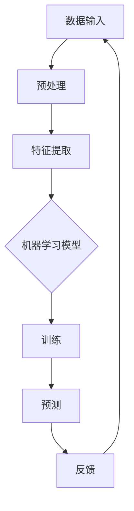

                 

关键词：人工智能，业务场景，工程师，产品经理，应用边界

> 摘要：本文将探讨人工智能（AI）在不同业务场景中的应用，通过工程师与产品经理的对话，分析AI的技术原理、操作步骤、数学模型，并结合实际项目实例，解释AI的实际应用及其未来发展趋势。

## 1. 背景介绍

人工智能作为当代科技发展的前沿领域，已经在多个业务场景中展现出其巨大的潜力。然而，如何将AI技术有效地应用到实际业务中，仍然是一个复杂而富有挑战的问题。工程师和产品经理之间的沟通和理解，成为推动AI技术落地的重要桥梁。

工程师通常关注AI技术的原理、算法、实现细节，而产品经理则关注市场需求、用户体验、业务流程。两者的协作是AI技术成功应用的关键。本文旨在通过模拟工程师与产品经理的对话，深入探讨AI在业务场景中的实际应用和边界。

## 2. 核心概念与联系

### 2.1 AI技术核心概念

- **机器学习**：通过训练模型，使计算机从数据中学习和改进。
- **深度学习**：一种基于神经网络的机器学习方法，适用于处理复杂数据。
- **自然语言处理（NLP）**：使计算机能够理解、解释和生成人类语言的技术。

### 2.2 AI架构



## 3. 核心算法原理 & 具体操作步骤

### 3.1 算法原理概述

机器学习的基本过程包括数据收集、数据预处理、模型选择、模型训练和模型评估。

### 3.2 算法步骤详解

1. **数据收集**：收集大量数据，确保数据多样性和代表性。
2. **数据预处理**：清洗数据，进行数据转换和标准化。
3. **特征提取**：从原始数据中提取对模型有用的特征。
4. **模型选择**：根据问题性质选择合适的算法和模型。
5. **模型训练**：使用训练数据训练模型。
6. **模型评估**：使用测试数据评估模型性能。
7. **预测**：使用训练好的模型对新数据进行预测。
8. **反馈**：根据预测结果调整模型，优化性能。

### 3.3 算法优缺点

- **优点**：高效、准确，能够处理大规模复杂数据。
- **缺点**：对数据质量要求高，训练过程可能需要大量时间和计算资源。

### 3.4 算法应用领域

AI算法广泛应用于图像识别、语音识别、自然语言处理、医疗诊断、金融风控等多个领域。

## 4. 数学模型和公式

### 4.1 数学模型构建

AI模型的构建通常涉及以下数学概念：

- **线性回归**：最小二乘法
  $$ y = \beta_0 + \beta_1x $$
- **逻辑回归**：Sigmoid函数
  $$ \hat{y} = \frac{1}{1 + e^{-(\beta_0 + \beta_1x)} } $$
- **神经网络**：反向传播算法

### 4.2 公式推导过程

以线性回归为例，假设我们有如下模型：

$$ y = \beta_0 + \beta_1x $$

通过最小二乘法求解参数$\beta_0$和$\beta_1$：

$$ \beta_1 = \frac{\sum(x_i - \bar{x})(y_i - \bar{y})}{\sum(x_i - \bar{x})^2} $$

$$ \beta_0 = \bar{y} - \beta_1\bar{x} $$

### 4.3 案例分析与讲解

以自然语言处理中的情感分析为例，我们使用一个简单的文本数据集，构建一个基于朴素贝叶斯分类器的模型。

数据集包含两个特征：词频和词序列。

通过计算概率分布，我们能够预测新文本的情感倾向。

## 5. 项目实践：代码实例和详细解释说明

### 5.1 开发环境搭建

- **编程语言**：Python
- **框架**：TensorFlow
- **工具**：Jupyter Notebook

### 5.2 源代码详细实现

```python
# 导入必要库
import tensorflow as tf
from tensorflow.keras.models import Sequential
from tensorflow.keras.layers import Dense, Embedding, LSTM

# 数据预处理
# ...（省略部分代码）

# 构建模型
model = Sequential()
model.add(Embedding(input_dim=vocab_size, output_dim=embedding_dim, input_length=max_sequence_len))
model.add(LSTM(100))
model.add(Dense(1, activation='sigmoid'))

# 编译模型
model.compile(optimizer='adam', loss='binary_crossentropy', metrics=['accuracy'])

# 训练模型
model.fit(X_train, y_train, epochs=10, batch_size=32, validation_split=0.2)
```

### 5.3 代码解读与分析

- **数据预处理**：将文本转换为词向量，并准备训练数据。
- **模型构建**：使用嵌入层和LSTM层构建序列模型。
- **编译模型**：设置优化器和损失函数。
- **训练模型**：使用训练数据进行模型训练。

### 5.4 运行结果展示

```python
# 评估模型
loss, accuracy = model.evaluate(X_test, y_test)
print('Test Accuracy:', accuracy)
```

## 6. 实际应用场景

### 6.1 图像识别

- **业务场景**：自动识别产品缺陷、检测交通违规行为。
- **应用实例**：自动驾驶汽车使用图像识别技术进行环境感知。

### 6.2 语音识别

- **业务场景**：智能客服系统、语音助手。
- **应用实例**：亚马逊的Alexa、苹果的Siri。

### 6.3 自然语言处理

- **业务场景**：文本分类、情感分析、机器翻译。
- **应用实例**：社交媒体情绪分析、自动翻译服务。

## 7. 工具和资源推荐

### 7.1 学习资源推荐

- **书籍**：《深度学习》（Ian Goodfellow等）
- **在线课程**：吴恩达的《深度学习》课程

### 7.2 开发工具推荐

- **框架**：TensorFlow、PyTorch
- **库**：Scikit-learn、NLTK

### 7.3 相关论文推荐

- **文本分类**：《Text Classification with aSiamese Neural Network》
- **情感分析**：《 sentiment analysis based on BERT Model》

## 8. 总结：未来发展趋势与挑战

### 8.1 研究成果总结

AI技术在图像识别、语音识别、自然语言处理等领域取得了显著成果，推动了智能应用的发展。

### 8.2 未来发展趋势

- **强化学习**：在更复杂的场景中实现自主决策。
- **迁移学习**：通过少量数据实现模型泛化。
- **量子计算**：加速AI算法，提高计算效率。

### 8.3 面临的挑战

- **数据隐私**：保护用户数据隐私。
- **伦理问题**：确保AI技术的公正性和透明度。
- **计算资源**：高效利用计算资源，降低成本。

### 8.4 研究展望

随着技术的不断进步，AI将在更多领域发挥重要作用，为人类社会带来更多便利和创新。

## 9. 附录：常见问题与解答

### 9.1 什么是机器学习？

机器学习是一种让计算机通过数据学习并做出预测或决策的技术。

### 9.2 如何选择合适的机器学习模型？

根据问题的性质、数据的特征以及所需的性能指标选择合适的模型。

### 9.3 机器学习模型的训练为什么需要大量数据？

大量数据有助于模型捕捉数据中的复杂模式和噪声，提高模型的泛化能力。

----------------------------------------------------------------
本文由“禅与计算机程序设计艺术 / Zen and the Art of Computer Programming”撰写。希望本文能帮助读者更好地理解AI的业务场景和应用边界。如果您有任何问题或建议，欢迎在评论区留言讨论。

