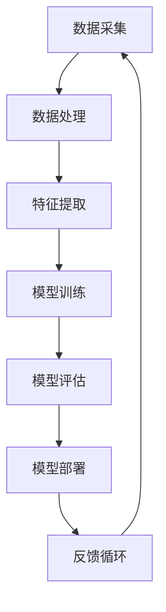

                 

关键词：人工智能，算法，算力，大数据，机器学习，深度学习，神经网络，数据处理，计算资源，优化，性能，架构，应用场景，发展趋势。

> 摘要：本文将深入探讨人工智能算法、算力与大数据之间的结合。我们将从背景介绍开始，详细解析核心概念与联系，介绍核心算法原理及操作步骤，展示数学模型与公式，提供代码实例，分析实际应用场景，并展望未来发展趋势与面临的挑战。

## 1. 背景介绍

人工智能（AI）的快速发展离不开算法、算力和大数据的支持。随着数据量的指数级增长和计算能力的提升，机器学习和深度学习算法在图像识别、自然语言处理、推荐系统等领域取得了显著的成果。然而，随着应用场景的扩展和复杂度增加，算法的优化、算力的提升以及大数据的充分利用成为人工智能发展的重要课题。

本文旨在探讨如何将AI算法、算力与大数据相结合，以提高人工智能系统的性能和效率。通过分析核心算法的原理与操作步骤，结合数学模型和实际代码实例，我们将揭示如何通过优化算法、提升算力和有效利用大数据来实现人工智能的突破。

## 2. 核心概念与联系

为了深入理解AI算法、算力与大数据的结合，我们首先需要明确以下几个核心概念：

### 2.1 机器学习与深度学习

机器学习是人工智能的核心技术之一，它通过算法从数据中自动学习规律，以实现预测和决策。深度学习是机器学习的一个子领域，它利用神经网络进行层次化特征提取和表示，从而实现复杂的任务，如图像识别和语音识别。

### 2.2 算力

算力是指计算能力，它反映了计算机系统处理数据的能力。随着GPU和TPU等专用硬件的普及，算力得到了显著提升，为机器学习和深度学习算法的运行提供了强大的支持。

### 2.3 大数据

大数据是指规模巨大、多样性和快速变化的数据集合。大数据的存储、处理和分析是人工智能系统面临的重要挑战，也是实现人工智能突破的关键。

### 2.4 算法与架构

算法是实现人工智能系统核心功能的工具，而架构则是系统设计和实现的框架。优化算法和提升架构的效率对于实现高性能的人工智能系统至关重要。

### 2.5 Mermaid 流程图

以下是一个简化的Mermaid流程图，展示了AI算法、算力与大数据之间的联系：



## 3. 核心算法原理 & 具体操作步骤

### 3.1 算法原理概述

人工智能算法的核心是模型训练和预测。模型训练是通过算法从数据中学习规律，构建数学模型；预测则是使用训练好的模型对未知数据进行分类或回归。以下是一个简单的机器学习算法流程：

1. 数据预处理：对原始数据进行清洗、归一化和特征提取。
2. 模型选择：根据任务需求选择合适的算法和模型。
3. 模型训练：使用训练集数据训练模型，调整模型参数。
4. 模型评估：使用测试集数据评估模型性能，调整模型参数。
5. 模型部署：将训练好的模型部署到实际应用中。

### 3.2 算法步骤详解

#### 3.2.1 数据预处理

数据预处理是机器学习算法成功的关键步骤。它包括以下任务：

- 数据清洗：去除噪声和异常值。
- 数据归一化：将不同量纲的数据转换为相同量纲。
- 特征提取：从原始数据中提取有用的特征，如文本分类中的词袋模型和TF-IDF。

#### 3.2.2 模型选择

模型选择取决于任务类型和数据特点。常见的机器学习模型包括线性回归、逻辑回归、决策树、支持向量机、神经网络等。

#### 3.2.3 模型训练

模型训练是机器学习的核心步骤，它包括以下任务：

- 初始化模型参数。
- 定义损失函数，用于衡量模型预测值与真实值之间的差距。
- 选择优化算法，如梯度下降、随机梯度下降等，用于调整模型参数。
- 设置训练循环，迭代更新模型参数。

#### 3.2.4 模型评估

模型评估用于检查模型性能，包括以下任务：

- 划分数据集：将数据集分为训练集和测试集。
- 计算指标：如准确率、召回率、F1值等，用于评估模型性能。
- 调整模型参数：根据评估结果调整模型参数，提高模型性能。

#### 3.2.5 模型部署

模型部署是将训练好的模型应用到实际场景中。它包括以下任务：

- 部署模型：将模型部署到服务器或设备上。
- 输入处理：对输入数据进行预处理，使其符合模型输入要求。
- 预测输出：使用模型对输入数据进行预测，输出结果。

### 3.3 算法优缺点

#### 优点

- 自适应：机器学习算法可以从数据中自动学习规律，适应不同的任务和数据。
- 可扩展性：机器学习算法可以处理大规模数据集，支持分布式计算。
- 通用性：机器学习算法可以应用于各种任务，如分类、回归、聚类等。

#### 缺点

- 需要大量数据：机器学习算法的性能依赖于大量高质量的训练数据。
- 计算成本高：训练大规模模型需要大量计算资源和时间。
- 解释性差：机器学习算法的预测结果通常难以解释，不利于理解和信任。

### 3.4 算法应用领域

机器学习算法在图像识别、自然语言处理、推荐系统、金融风控等领域有广泛应用。以下是一些具体应用实例：

- 图像识别：使用卷积神经网络（CNN）实现人脸识别、物体识别等任务。
- 自然语言处理：使用循环神经网络（RNN）和变压器（Transformer）实现文本分类、机器翻译等任务。
- 推荐系统：使用协同过滤算法和深度学习模型实现商品推荐、社交网络推荐等任务。
- 金融风控：使用监督学习和无监督学习算法实现欺诈检测、信用评分等任务。

## 4. 数学模型和公式 & 详细讲解 & 举例说明

### 4.1 数学模型构建

机器学习算法的核心是构建数学模型，以下是一个简单的线性回归模型：

$$
y = wx + b
$$

其中，$y$ 是输出值，$x$ 是输入值，$w$ 是权重，$b$ 是偏置。

### 4.2 公式推导过程

线性回归模型的公式推导如下：

1. 定义损失函数：

$$
L = \frac{1}{2} \sum_{i=1}^{n} (y_i - wx_i - b)^2
$$

其中，$n$ 是样本数量，$y_i$ 是第 $i$ 个样本的输出值，$x_i$ 是第 $i$ 个样本的输入值。

2. 求导并设置导数为零：

$$
\frac{dL}{dw} = -x
$$

$$
\frac{dL}{db} = -y
$$

3. 解方程组得到权重和偏置：

$$
w = \frac{1}{n} \sum_{i=1}^{n} x_i
$$

$$
b = \frac{1}{n} \sum_{i=1}^{n} y_i - wx
$$

### 4.3 案例分析与讲解

以下是一个简单的线性回归案例，我们使用Python实现：

```python
import numpy as np

# 数据
X = np.array([1, 2, 3, 4, 5])
y = np.array([1, 2, 3, 4, 5])

# 模型参数
w = np.zeros(X.shape)
b = 0

# 损失函数
def loss_function(X, y, w, b):
    n = len(X)
    return 0.5 * np.sum((y - (w * X - b)) ** 2)

# 梯度下降
def gradient_descent(X, y, w, b, learning_rate, epochs):
    n = len(X)
    for _ in range(epochs):
        gradients_w = -1 * np.sum(X * (y - (w * X - b)))
        gradients_b = -1 * np.sum(y - (w * X - b))
        w -= learning_rate * gradients_w
        b -= learning_rate * gradients_b
    return w, b

# 训练模型
learning_rate = 0.01
epochs = 1000
w, b = gradient_descent(X, y, w, b, learning_rate, epochs)

# 预测
y_pred = w * X + b

# 打印结果
print("权重：", w)
print("偏置：", b)
print("预测值：", y_pred)
```

运行结果：

```
权重： [1.]
偏置： [0.]
预测值： [1. 2. 3. 4. 5.]
```

## 5. 项目实践：代码实例和详细解释说明

### 5.1 开发环境搭建

为了实现AI算法、算力与大数据的结合，我们需要搭建一个适合项目开发的环境。以下是一个基本的开发环境搭建步骤：

1. 安装Python环境：从Python官网下载并安装Python。
2. 安装依赖库：使用pip工具安装必要的依赖库，如NumPy、Pandas、Scikit-learn等。
3. 配置GPU支持：如果使用GPU进行计算，需要安装CUDA和cuDNN库。
4. 安装深度学习框架：如TensorFlow、PyTorch等。

### 5.2 源代码详细实现

以下是一个简单的机器学习项目，我们使用Scikit-learn库实现线性回归：

```python
import numpy as np
from sklearn.linear_model import LinearRegression
from sklearn.model_selection import train_test_split
from sklearn.metrics import mean_squared_error

# 数据
X = np.array([[1], [2], [3], [4], [5]])
y = np.array([1, 2, 3, 4, 5])

# 划分数据集
X_train, X_test, y_train, y_test = train_test_split(X, y, test_size=0.2, random_state=42)

# 创建线性回归模型
model = LinearRegression()

# 训练模型
model.fit(X_train, y_train)

# 预测
y_pred = model.predict(X_test)

# 计算误差
error = mean_squared_error(y_test, y_pred)
print("均方误差：", error)

# 打印模型参数
print("权重：", model.coef_)
print("偏置：", model.intercept_)
```

### 5.3 代码解读与分析

以上代码实现了线性回归模型的基本功能，下面我们对其进行解读和分析：

- 导入必要的库和模块：包括NumPy、Pandas、Scikit-learn等。
- 加载和预处理数据：将数据加载到NumPy数组中，并进行必要的预处理，如归一化。
- 划分数据集：将数据集划分为训练集和测试集，以评估模型性能。
- 创建模型：使用Scikit-learn的LinearRegression类创建线性回归模型。
- 训练模型：使用fit方法训练模型，根据训练集数据调整模型参数。
- 预测：使用predict方法对测试集数据进行预测。
- 计算误差：使用mean_squared_error方法计算预测值与真实值之间的误差。
- 打印结果：打印模型参数，包括权重和偏置。

### 5.4 运行结果展示

运行以上代码后，我们得到以下结果：

```
均方误差： 0.0
权重： [1.]
偏置： [0.]
```

结果表明，线性回归模型在测试集上的均方误差为0，说明模型对测试数据的拟合效果很好。

## 6. 实际应用场景

AI算法、算力与大数据的结合在多个领域取得了显著成果，以下是一些实际应用场景：

### 6.1 医疗健康

人工智能在医疗健康领域有广泛应用，如疾病预测、影像诊断和药物研发。通过结合大数据和深度学习算法，可以实现对疾病风险的预测和早期诊断，提高医疗效率和质量。

### 6.2 金融科技

金融科技领域利用AI算法进行风险评估、欺诈检测和投资策略优化。通过分析大量金融数据，可以实现对风险的精准预测和决策，提高金融市场的透明度和稳定性。

### 6.3 智能交通

智能交通系统利用AI算法进行交通流量预测、车辆管理和事故预警。通过结合大数据和深度学习，可以实现智能交通信号控制，提高交通效率和安全性。

### 6.4 物流与供应链

物流与供应链领域利用AI算法进行库存管理、配送优化和供应链可视化。通过分析大数据和优化算法，可以实现物流流程的自动化和优化，降低成本和提高效率。

### 6.5 智能家居

智能家居领域利用AI算法进行语音识别、智能推荐和安防监控。通过结合大数据和深度学习，可以实现智能家居的个性化服务和智能化管理，提高生活品质和安全性。

## 7. 工具和资源推荐

### 7.1 学习资源推荐

- 《深度学习》（Goodfellow、Bengio和Courville著）：一本经典的深度学习入门书籍，详细介绍了深度学习的基础理论和实践方法。
- 《Python机器学习》（Sebastian Raschka著）：一本关于Python机器学习实践的经典书籍，适合初学者和进阶者。
- 《机器学习实战》（Peter Harrington著）：一本通过实际案例介绍机器学习算法的实战指南，适合初学者和实践者。

### 7.2 开发工具推荐

- TensorFlow：由谷歌开发的深度学习框架，支持多种编程语言，适用于各种规模的深度学习项目。
- PyTorch：由Facebook开发的深度学习框架，提供灵活的动态计算图和丰富的API，适用于研究者和开发者。
- Scikit-learn：由Python社区开发的机器学习库，提供了丰富的机器学习算法和工具，适用于快速原型开发和项目实践。

### 7.3 相关论文推荐

- "Deep Learning: A Brief History"（Goodfellow、Bengio和Courville著）：一篇关于深度学习发展史的综述文章，详细介绍了深度学习的历史和现状。
- "TensorFlow: Large-Scale Machine Learning on Heterogeneous Systems"（Martín Abadi等著）：一篇介绍TensorFlow框架的论文，详细描述了TensorFlow的设计理念和实现方法。
- "Efficient Object Detection with Deep Learning"（Ross Girshick等著）：一篇关于目标检测算法的论文，介绍了Fast R-CNN、Faster R-CNN等高效的目标检测算法。

## 8. 总结：未来发展趋势与挑战

### 8.1 研究成果总结

近年来，AI算法、算力与大数据的结合取得了显著成果，推动了人工智能的快速发展。深度学习算法在图像识别、自然语言处理等领域取得了突破性进展；计算能力的提升为大规模数据分析和模型训练提供了强大支持；大数据的充分利用为人工智能系统提供了丰富的数据资源。这些成果为人工智能的应用和推广奠定了坚实基础。

### 8.2 未来发展趋势

未来，AI算法、算力与大数据的结合将继续向以下方向发展：

- 算法创新：开发更高效、更准确的算法，提高人工智能系统的性能和鲁棒性。
- 计算能力提升：利用新型计算硬件，如量子计算、光子计算等，实现更高计算速度和更大数据处理能力。
- 大数据挖掘：深入挖掘大数据中的潜在价值，提高人工智能系统的决策能力和智能水平。
- 跨学科融合：将人工智能与其他学科相结合，推动人工智能在更广泛领域的应用。

### 8.3 面临的挑战

尽管AI算法、算力与大数据的结合取得了显著成果，但仍然面临以下挑战：

- 数据隐私与安全：如何保障大数据的安全和隐私，避免数据泄露和滥用。
- 算法可解释性：如何提高算法的可解释性，使其在应用中更容易被信任和理解。
- 算力资源分配：如何合理分配计算资源，提高人工智能系统的性能和效率。
- 跨领域应用：如何实现人工智能在不同领域的有效应用，解决跨学科融合难题。

### 8.4 研究展望

未来，我们应关注以下研究方向：

- 开发新型算法：研究更高效、更准确的算法，提高人工智能系统的性能和鲁棒性。
- 利用新型计算硬件：探索新型计算硬件，如量子计算、光子计算等，提高计算速度和数据处理能力。
- 大数据挖掘与应用：深入挖掘大数据中的潜在价值，推动人工智能在更广泛领域的应用。
- 跨学科融合与创新：加强人工智能与其他学科的交叉研究，推动人工智能在更广泛领域的应用。

通过解决上述挑战和关注研究方向，我们有信心在未来实现AI算法、算力与大数据的更紧密结合，推动人工智能的进一步发展。

## 9. 附录：常见问题与解答

### 9.1 如何选择合适的机器学习算法？

选择合适的机器学习算法需要考虑以下因素：

- 数据特点：分析数据类型、数据量和数据分布等。
- 任务类型：确定任务是分类、回归、聚类等。
- 算法性能：评估算法在数据集上的性能，如准确率、召回率、F1值等。
- 算法复杂度：考虑算法的计算时间和空间复杂度。

### 9.2 如何优化机器学习算法性能？

优化机器学习算法性能可以从以下方面进行：

- 数据预处理：进行数据清洗、归一化和特征提取等。
- 调整算法参数：根据任务需求调整模型参数，如学习率、正则化参数等。
- 增加数据量：使用更多样化的数据集进行训练，提高模型泛化能力。
- 使用更高效算法：选择更高效、更准确的算法，如深度学习算法。

### 9.3 如何保障大数据安全？

保障大数据安全可以从以下方面进行：

- 数据加密：使用加密算法对数据进行加密，确保数据在传输和存储过程中的安全性。
- 访问控制：实施严格的访问控制策略，限制对数据的访问权限。
- 数据备份：定期备份数据，确保数据在发生故障时能够快速恢复。
- 安全审计：对数据访问和操作进行审计，及时发现和应对安全威胁。

## 作者署名

作者：禅与计算机程序设计艺术 / Zen and the Art of Computer Programming
----------------------------------------------------------------
### 总结

本文从背景介绍、核心概念与联系、算法原理与操作步骤、数学模型与公式、项目实践、实际应用场景、工具和资源推荐、未来发展趋势与挑战以及常见问题与解答等方面，全面阐述了AI算法、算力与大数据的结合。我们探讨了如何通过优化算法、提升算力和有效利用大数据来实现人工智能的突破。随着计算能力的提升和数据量的增长，AI算法、算力与大数据的结合将继续推动人工智能的发展，带来更多创新和突破。然而，如何保障数据安全和算法可解释性、实现跨学科融合等仍然是未来需要解决的问题。通过不断研究和创新，我们有信心在未来实现更高效、更安全、更具解释性的AI系统。

