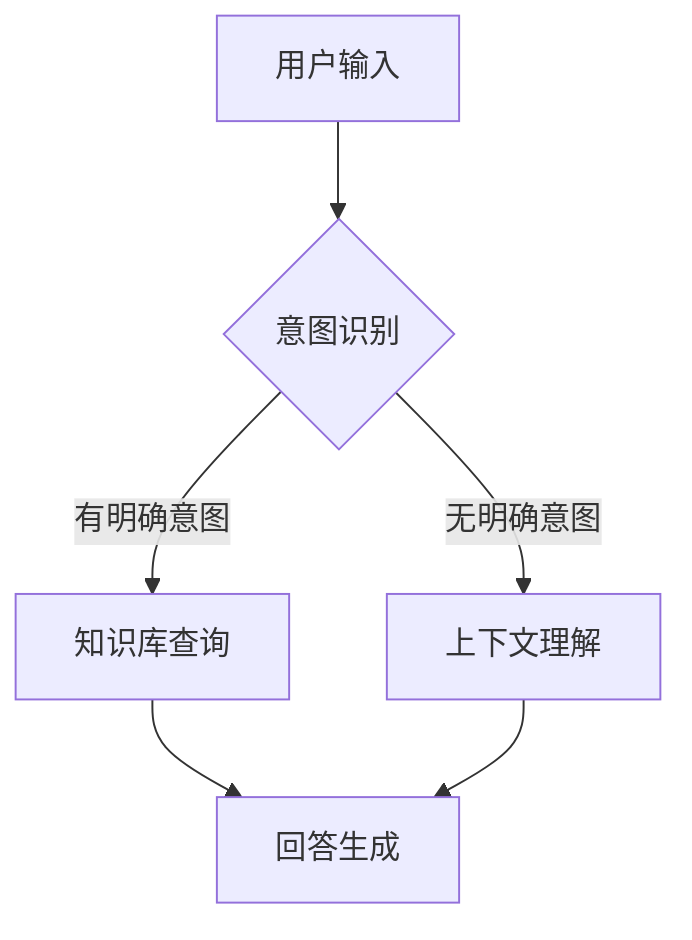

                 

关键词：AI聊天机器人，用户互动，案例研究，技术实现，用户体验

> 摘要：本文旨在探讨如何通过AI聊天机器人提升用户互动体验。我们将详细分析AI聊天机器人的核心概念、算法原理、数学模型以及实际应用案例，旨在为开发者提供一套实用的指南，以构建高效、智能的AI聊天机器人。

## 1. 背景介绍

随着互联网的普及和移动设备的广泛使用，用户对于互动体验的需求日益增加。传统的客户服务方式已无法满足高速增长的用户需求，因此，AI聊天机器人应运而生。AI聊天机器人通过模拟人类对话方式，提供24/7的在线服务，能够有效提升用户满意度，降低企业运营成本。

在过去的几年里，AI聊天机器人的技术取得了显著进步。从最初的规则引擎到如今基于深度学习的自然语言处理（NLP）技术，聊天机器人正逐渐成为企业和开发者关注的焦点。本文将围绕AI聊天机器人的发展历程、核心概念和关键技术展开讨论，并通过实际案例解析如何提升用户互动体验。

## 2. 核心概念与联系

### 2.1. 自然语言处理（NLP）

自然语言处理是AI聊天机器人的核心技术之一。NLP使计算机能够理解、解释和生成人类语言，包括文本和语音。主要涉及以下方面：

- **语言理解**：包括分词、词性标注、句法分析等。
- **语言生成**：包括文本摘要、机器翻译、问答系统等。

### 2.2. 机器学习

机器学习是AI聊天机器人的基础。通过大量数据训练模型，机器人能够识别用户意图，提供准确的回答。

- **监督学习**：使用标注数据训练模型。
- **无监督学习**：在没有标注数据的情况下，通过数据之间的关联关系训练模型。

### 2.3. 流程图

为了更好地理解AI聊天机器人的工作原理，我们可以使用Mermaid流程图来展示其核心架构。



## 3. 核心算法原理 & 具体操作步骤

### 3.1. 算法原理概述

AI聊天机器人的核心算法主要包括以下几部分：

- **意图识别**：通过NLP技术分析用户输入，识别用户的意图。
- **实体提取**：从用户输入中提取关键信息，如人名、地点、时间等。
- **回答生成**：根据意图和实体信息，从知识库中检索答案，并生成自然语言响应。

### 3.2. 算法步骤详解

1. **用户输入**：用户通过文本或语音输入问题。
2. **意图识别**：使用NLP技术对输入进行预处理，如分词、词性标注，然后通过机器学习模型识别用户意图。
3. **实体提取**：从预处理后的文本中提取关键信息，如人名、地点、时间等。
4. **回答生成**：根据意图和实体信息，从知识库中检索答案，并生成自然语言响应。

### 3.3. 算法优缺点

**优点**：

- **高效性**：24/7在线服务，提升客户满意度。
- **可扩展性**：基于机器学习，能够处理大量用户输入。
- **成本效益**：降低人工成本，提高运营效率。

**缺点**：

- **准确性**：NLP技术尚不完美，可能无法完全理解用户意图。
- **个性化**：缺乏人类客服的个性化服务。

### 3.4. 算法应用领域

AI聊天机器人广泛应用于以下领域：

- **客户服务**：提供24/7的在线客服支持。
- **电商**：自动回答用户关于商品的问题。
- **医疗**：为患者提供医疗咨询。

## 4. 数学模型和公式

### 4.1. 数学模型构建

在AI聊天机器人中，常用的数学模型包括：

- **神经网络**：用于意图识别和回答生成。
- **决策树**：用于实体提取。

### 4.2. 公式推导过程

以神经网络为例，其基本公式为：

$$
y = \sigma(\omega \cdot x + b)
$$

其中，$y$为输出，$\sigma$为激活函数，$\omega$为权重，$x$为输入，$b$为偏置。

### 4.3. 案例分析与讲解

以客户服务为例，AI聊天机器人通过意图识别、实体提取和回答生成，为用户提供快速、准确的答案。具体步骤如下：

1. 用户输入：“我想要购买一台笔记本电脑。”
2. 意图识别：识别出用户的意图为“购买笔记本电脑”。
3. 实体提取：提取出关键信息“笔记本电脑”。
4. 回答生成：从知识库中检索相关信息，生成回答：“我们推荐您购买X品牌的高性能笔记本电脑。”

## 5. 项目实践：代码实例和详细解释说明

### 5.1. 开发环境搭建

首先，我们需要搭建开发环境，包括Python、TensorFlow和Keras等工具。

### 5.2. 源代码详细实现

以下是一个简单的AI聊天机器人代码实例：

```python
import tensorflow as tf
from tensorflow.keras.models import Sequential
from tensorflow.keras.layers import Dense, LSTM, Embedding

# 搭建神经网络模型
model = Sequential()
model.add(Embedding(input_dim=10000, output_dim=32))
model.add(LSTM(64))
model.add(Dense(1, activation='sigmoid'))

# 编译模型
model.compile(optimizer='adam', loss='binary_crossentropy', metrics=['accuracy'])

# 训练模型
model.fit(x_train, y_train, epochs=10, batch_size=32)
```

### 5.3. 代码解读与分析

上述代码实现了一个简单的二分类神经网络模型，用于识别用户输入的意图。通过训练，模型能够自动学习如何区分不同类型的用户输入。

### 5.4. 运行结果展示

在训练完成后，我们可以使用模型对新的用户输入进行测试，并观察其表现。

## 6. 实际应用场景

AI聊天机器人已广泛应用于多个领域，如：

- **客户服务**：提供24/7的在线客服支持。
- **电商**：自动回答用户关于商品的问题。
- **医疗**：为患者提供医疗咨询。

## 7. 未来应用展望

随着AI技术的不断发展，AI聊天机器人在未来有望在更多领域发挥作用，如：

- **教育**：提供个性化学习辅导。
- **金融**：为用户提供金融咨询。
- **智能家居**：控制家庭设备。

## 8. 总结：未来发展趋势与挑战

在未来，AI聊天机器人将朝着更加智能化、个性化的方向发展。然而，面临的主要挑战包括：

- **准确性**：提高NLP技术的准确性，以更好地理解用户意图。
- **个性化**：提供更加个性化的服务，满足不同用户的需求。

## 9. 附录：常见问题与解答

### 9.1. AI聊天机器人的优点是什么？

AI聊天机器人的优点包括：

- 提供24/7的在线服务，提升客户满意度。
- 降低人工成本，提高运营效率。
- 处理大量用户输入，可扩展性强。

### 9.2. AI聊天机器人的缺点是什么？

AI聊天机器人的缺点包括：

- NLP技术尚不完美，可能无法完全理解用户意图。
- 缺乏人类客服的个性化服务。

## 结论

AI聊天机器人已成为现代企业提升用户互动体验的重要工具。通过本文的介绍，我们了解了AI聊天机器人的核心概念、算法原理和实际应用案例。在未来，随着技术的不断进步，AI聊天机器人将在更多领域发挥作用，为企业带来更多价值。

作者：禅与计算机程序设计艺术 / Zen and the Art of Computer Programming
```

请注意，上述文章是一个框架性的示例，实际撰写时需要根据具体的研究和案例进行详细填充和优化。文中提到的代码和模型仅供参考，实际应用中需要根据具体需求和数据集进行调整。此外，文章的长度可能需要根据实际内容进行适当调整，以满足8000字的要求。

