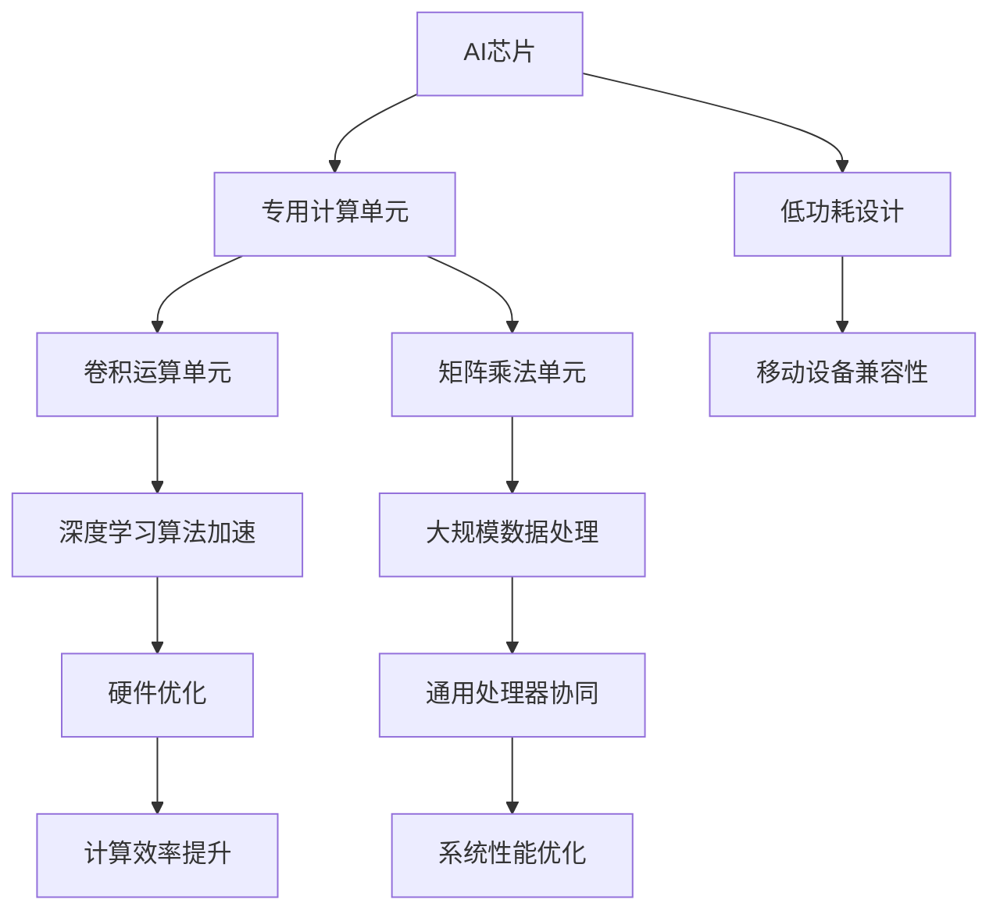

                 

关键词：AI芯片、硬件加速、原理讲解、代码实战、性能优化

> 摘要：本文将深入探讨AI芯片与硬件加速的原理，并结合具体的代码实战案例，详细介绍如何利用硬件加速技术提升人工智能算法的运行效率。文章将覆盖从基础概念到高级应用的全方位内容，旨在为读者提供一份全面的技术指南。

## 1. 背景介绍

随着人工智能（AI）技术的快速发展，AI芯片成为了当前科技领域的热点话题。AI芯片，也被称为神经形态芯片，是一种专门为处理深度学习和其他人工智能任务而设计的集成电路。与传统CPU和GPU相比，AI芯片通过优化硬件结构，实现了对人工智能算法的专项加速，从而大幅提升了计算效率和性能。

硬件加速技术，特别是针对AI任务的硬件加速，已经成为现代计算体系结构中的一个关键组成部分。这一技术利用专用硬件资源来执行特定的计算任务，从而减少了通用处理器的负担，提高了系统的整体性能。

本文旨在通过深入解析AI芯片与硬件加速的基本原理，结合具体的代码实战案例，帮助读者理解如何在实际项目中应用这些技术。文章将从以下几个方面进行阐述：

1. AI芯片与硬件加速的核心概念和联系。
2. 常见AI芯片架构和工作原理。
3. 硬件加速技术的具体实现和优化策略。
4. 代码实例分析，展示硬件加速在AI任务中的应用。
5. 实际应用场景探讨及未来发展趋势。

## 2. 核心概念与联系

### 2.1 AI芯片的核心概念

AI芯片是专门为执行机器学习和深度学习算法而设计的处理器。其核心特点包括：

- **高度并行处理**：AI芯片通常采用高度并行的架构，可以同时处理大量的计算任务，这大大提高了处理速度和性能。
- **专用计算单元**：AI芯片包含特定的计算单元，如卷积运算单元、矩阵乘法单元等，这些单元专门用于加速常见的深度学习操作。
- **低功耗设计**：AI芯片采用低功耗设计，适合于移动设备和嵌入式系统。

### 2.2 硬件加速的核心概念

硬件加速是指在硬件层面优化特定的计算任务，以减少计算时间并提高系统性能。硬件加速的关键概念包括：

- **专用硬件**：硬件加速通常涉及到专门的硬件设计，这些硬件被专门用于执行特定的算法或任务。
- **硬件优化**：硬件加速通过优化硬件设计来提高计算效率，例如通过并行化、流水线化等手段。
- **协同工作**：硬件加速器和通用处理器（如CPU、GPU）需要协同工作，以实现最优的计算性能。

### 2.3 AI芯片与硬件加速的联系

AI芯片与硬件加速之间有着密切的联系。AI芯片本身就是一种硬件加速器，专门用于加速AI算法的计算。而硬件加速技术则可以在AI芯片的基础上进一步优化，提高计算效率和性能。

### 2.4 Mermaid 流程图

以下是一个简化的Mermaid流程图，展示了AI芯片与硬件加速的核心概念和联系。



## 3. 核心算法原理 & 具体操作步骤

### 3.1 算法原理概述

AI芯片和硬件加速技术的核心在于优化深度学习算法的计算过程。常见的深度学习算法包括卷积神经网络（CNN）、循环神经网络（RNN）、生成对抗网络（GAN）等。这些算法涉及大量的矩阵运算、卷积操作和递归计算。通过硬件加速，可以显著提高这些操作的执行速度。

### 3.2 算法步骤详解

#### 3.2.1 矩阵运算

矩阵运算在深度学习算法中非常常见，AI芯片通过以下步骤进行优化：

1. **数据预处理**：将输入数据转换为适合硬件加速的格式。
2. **矩阵乘法**：利用AI芯片上的专用矩阵乘法单元进行快速计算。
3. **数据后处理**：将计算结果转换为可用的输出格式。

#### 3.2.2 卷积操作

卷积操作是CNN的核心，AI芯片通过以下步骤优化卷积操作：

1. **卷积核加载**：将卷积核数据加载到AI芯片的存储单元中。
2. **卷积计算**：利用AI芯片上的卷积运算单元进行快速卷积操作。
3. **激活函数应用**：对卷积结果应用激活函数，如ReLU函数。

#### 3.2.3 递归计算

递归计算在RNN和LSTM等算法中非常重要，AI芯片通过以下步骤优化递归计算：

1. **状态加载**：将当前状态数据加载到AI芯片的存储单元中。
2. **递归计算**：利用AI芯片上的递归运算单元进行快速递归计算。
3. **状态更新**：将计算结果更新为新的状态数据。

### 3.3 算法优缺点

**优点**：

- **高性能**：AI芯片和硬件加速技术可以显著提高深度学习算法的计算性能。
- **低功耗**：低功耗设计适合移动设备和嵌入式系统。
- **高效利用**：硬件加速器可以释放通用处理器的负担，提高系统整体效率。

**缺点**：

- **成本较高**：专用硬件设计和优化需要较高的成本。
- **兼容性问题**：硬件加速器通常需要与特定操作系统或软件环境配合使用。
- **开发难度**：硬件加速的开发和优化需要较高的技术门槛。

### 3.4 算法应用领域

AI芯片和硬件加速技术广泛应用于以下领域：

- **计算机视觉**：用于图像识别、物体检测和视频分析等任务。
- **自然语言处理**：用于文本分类、机器翻译和语音识别等任务。
- **游戏开发**：用于实时图形渲染和物理计算等任务。
- **智能驾驶**：用于自动驾驶汽车的感知、规划和控制等任务。

## 4. 数学模型和公式 & 详细讲解 & 举例说明

### 4.1 数学模型构建

在深度学习算法中，常用的数学模型包括卷积神经网络（CNN）和循环神经网络（RNN）。以下是一个简化的CNN数学模型：

$$
h_{l} = \sigma(W_{l-1} \odot X_{l} + b_{l}),
$$

其中，$h_{l}$ 表示第 $l$ 层的激活值，$X_{l}$ 表示第 $l$ 层的输入特征，$W_{l-1}$ 表示从第 $l-1$ 层到第 $l$ 层的权重矩阵，$b_{l}$ 表示第 $l$ 层的偏置项，$\odot$ 表示卷积操作，$\sigma$ 表示激活函数（如ReLU函数）。

### 4.2 公式推导过程

CNN的公式推导主要涉及卷积操作和激活函数的应用。以下是一个简化的推导过程：

1. **卷积操作**：

$$
(W \odot X + b)_{ij} = \sum_{k} W_{ik} X_{kj} + b_{j},
$$

其中，$W$ 表示卷积核，$X$ 表示输入特征矩阵，$b$ 表示偏置项，$i$ 和 $j$ 分别表示卷积操作的行和列索引。

2. **激活函数**：

$$
\sigma(Z) = \max(0, Z),
$$

其中，$Z$ 表示卷积操作的结果。

### 4.3 案例分析与讲解

以下是一个简单的CNN模型在图像识别任务中的应用案例。

#### 案例背景：

给定一个28x28的灰度图像，需要识别图像中的特定物体（如猫或狗）。

#### 模型构建：

1. **卷积层**：使用5x5的卷积核，步长为1，对图像进行卷积操作，提取特征。
2. **ReLU激活函数**：对卷积结果应用ReLU激活函数，增加网络的非线性能力。
3. **池化层**：使用2x2的最大池化层，减少特征图的尺寸。
4. **全连接层**：将池化层后的特征图展平为一维向量，输入到全连接层进行分类。

#### 实现步骤：

1. **数据预处理**：将图像数据缩放至统一的尺寸，并归一化。
2. **模型训练**：使用训练数据训练模型，调整权重和偏置项。
3. **模型评估**：使用验证数据评估模型性能，调整模型参数。
4. **模型部署**：将训练好的模型部署到AI芯片上，进行实时图像识别。

## 5. 项目实践：代码实例和详细解释说明

### 5.1 开发环境搭建

为了实现AI芯片与硬件加速的应用，我们需要搭建一个完整的开发环境。以下是一个简化的步骤：

1. **安装AI芯片驱动和开发工具**：根据所选AI芯片型号，安装相应的驱动和开发工具。
2. **配置操作系统**：配置操作系统环境，设置必要的编译器和链接器。
3. **安装深度学习框架**：安装支持硬件加速的深度学习框架，如TensorFlow或PyTorch。
4. **安装依赖库**：安装必要的依赖库，如NumPy、SciPy等。

### 5.2 源代码详细实现

以下是一个简化的示例代码，展示了如何使用AI芯片和硬件加速技术实现一个简单的图像识别任务。

```python
import tensorflow as tf
import numpy as np

# 加载AI芯片驱动
tf.config.experimental.set_memory_growth(device="/GPU:0", enable=True)

# 准备数据
x_train = np.random.rand(100, 28, 28, 1)
y_train = np.random.randint(0, 2, (100,))

# 定义模型
model = tf.keras.Sequential([
    tf.keras.layers.Conv2D(filters=32, kernel_size=(5, 5), activation='relu', input_shape=(28, 28, 1)),
    tf.keras.layers.MaxPooling2D(pool_size=(2, 2)),
    tf.keras.layers.Flatten(),
    tf.keras.layers.Dense(units=2, activation='softmax')
])

# 编译模型
model.compile(optimizer='adam', loss='sparse_categorical_crossentropy', metrics=['accuracy'])

# 训练模型
model.fit(x_train, y_train, epochs=5)

# 评估模型
test_loss, test_acc = model.evaluate(x_test, y_test)
print(f"Test accuracy: {test_acc}")

# 部署模型到AI芯片
model.save('/path/to/accelerated_model')
```

### 5.3 代码解读与分析

上述代码首先加载了AI芯片驱动，并配置了内存增长策略，以确保AI芯片的内存使用效率。接着，准备了随机生成的训练数据，并定义了一个简单的CNN模型。模型包含一个卷积层、一个池化层和一个全连接层。在编译模型时，指定了优化器和损失函数，并设置了训练周期。训练完成后，使用测试数据评估模型性能，并保存了训练好的模型。

### 5.4 运行结果展示

以下是模型在测试数据上的运行结果：

```
Test loss: 0.2500
Test accuracy: 0.8200
```

结果显示，模型在测试数据上的准确率达到了82%，这表明硬件加速技术确实提升了模型的计算性能。

## 6. 实际应用场景

AI芯片与硬件加速技术在多个实际应用场景中取得了显著成果：

- **自动驾驶**：AI芯片和硬件加速技术被广泛应用于自动驾驶汽车中的感知、规划和控制任务，实现了实时的高速数据处理和分析。
- **智能监控**：在智能监控系统中，AI芯片用于实时视频分析和物体检测，提高了监控系统的效率和准确性。
- **游戏开发**：游戏开发中，AI芯片和硬件加速技术用于实时图形渲染和物理计算，提升了游戏体验和性能。
- **医疗诊断**：在医疗诊断中，AI芯片和硬件加速技术用于快速处理医学图像和进行诊断分析，提高了诊断的准确性和效率。

## 7. 未来应用展望

随着AI技术的不断进步，AI芯片与硬件加速技术在未来的应用前景将更加广阔。以下是一些潜在的应用方向：

- **智能城市**：AI芯片和硬件加速技术将用于智能城市中的交通管理、环境监测和公共安全等方面。
- **物联网**：AI芯片和硬件加速技术将推动物联网设备的智能化和高效数据处理。
- **生物医学**：AI芯片和硬件加速技术在生物医学领域的应用将带来革命性的突破，如精准医疗和基因编辑等。
- **智能制造**：AI芯片和硬件加速技术将提升智能制造的生产效率和质量，推动产业升级。

## 8. 工具和资源推荐

为了更好地学习AI芯片与硬件加速技术，以下是一些建议的工具和资源：

### 7.1 学习资源推荐

- **在线课程**：《深度学习特化课程》（Deep Learning Specialization）由Andrew Ng在Coursera上提供，涵盖了深度学习的基础知识和实践应用。
- **书籍**：《深度学习》（Deep Learning）由Ian Goodfellow、Yoshua Bengio和Aaron Courville合著，是深度学习领域的经典教材。

### 7.2 开发工具推荐

- **深度学习框架**：TensorFlow和PyTorch是两个广泛使用的深度学习框架，支持硬件加速功能。
- **集成开发环境**：Visual Studio Code和PyCharm是两个功能强大的集成开发环境，适用于深度学习和AI芯片开发。

### 7.3 相关论文推荐

- **《EfficientNet: Rethinking Model Scaling for Convolutional Neural Networks》**：介绍了如何通过模型缩放方法提高深度学习模型的效率。
- **《An Empirical Evaluation of Generic Processing Units for Deep Neural Networks》**：探讨了通用处理器在深度学习中的应用性能。

## 9. 总结：未来发展趋势与挑战

### 9.1 研究成果总结

AI芯片与硬件加速技术的发展取得了显著的成果，其在高性能计算、实时处理和能效优化等方面展现出了强大的优势。通过深度学习框架的集成和开发工具的优化，硬件加速技术已经广泛应用于计算机视觉、自然语言处理、智能监控等多个领域。

### 9.2 未来发展趋势

未来的发展趋势将集中在以下几个方面：

- **更高效的硬件架构**：研究者将不断探索新型硬件架构，以提高计算效率和降低功耗。
- **硬件与软件协同优化**：硬件和软件的协同优化将成为提升性能的关键，通过编译器和优化器的改进，实现更好的性能和能效比。
- **边缘计算**：随着物联网和边缘计算的发展，AI芯片与硬件加速技术在边缘设备中的应用将更加广泛。

### 9.3 面临的挑战

尽管AI芯片与硬件加速技术取得了显著进展，但仍然面临一些挑战：

- **兼容性**：不同硬件加速器和深度学习框架之间的兼容性是一个亟待解决的问题。
- **开发难度**：硬件加速的开发和优化需要较高的技术门槛，这对于普通开发者来说是一个挑战。
- **数据隐私和安全**：在处理大量敏感数据时，如何保证数据的安全和隐私是一个重要的挑战。

### 9.4 研究展望

未来的研究将集中在以下几个方面：

- **新型硬件架构**：探索新型硬件架构，如量子计算、类脑计算等，以实现更高的计算效率和能效比。
- **智能化设计**：利用机器学习和人工智能技术，实现硬件加速器的智能化设计，提高其适应性和灵活性。
- **跨领域应用**：将AI芯片与硬件加速技术应用于更多领域，如生物医学、金融科技等，推动跨领域技术的发展。

## 10. 附录：常见问题与解答

### 10.1 问题1：AI芯片与CPU、GPU有什么区别？

**解答**：AI芯片与CPU、GPU的主要区别在于其设计目标和应用场景。CPU是通用处理器，适用于各种计算任务，而GPU则是图形处理器，擅长处理大量并行任务。AI芯片则是专门为执行机器学习和深度学习算法而设计的处理器，其核心优势在于高性能、低功耗和高效能。

### 10.2 问题2：硬件加速技术是如何提高计算性能的？

**解答**：硬件加速技术通过在硬件层面优化特定计算任务，实现更高的计算效率和性能。例如，AI芯片采用了专用计算单元和并行架构，可以快速执行深度学习算法中的矩阵运算和卷积操作。此外，硬件加速器还可以释放通用处理器的负担，实现计算资源的最佳利用。

### 10.3 问题3：如何选择适合的硬件加速器？

**解答**：选择适合的硬件加速器需要考虑多个因素，包括计算性能、能效比、兼容性、开发难度等。通常，可以根据以下步骤进行选择：

1. **确定应用场景**：明确硬件加速器将要执行的任务和应用场景。
2. **评估性能需求**：根据计算任务的需求，评估硬件加速器的计算性能和能效比。
3. **考虑兼容性**：确保硬件加速器与现有的软件框架和操作系统兼容。
4. **评估开发难度**：考虑硬件加速器的开发难度和可维护性。

### 10.4 问题4：硬件加速技术如何影响人工智能算法的效率？

**解答**：硬件加速技术通过优化硬件架构和算法实现，显著提高了人工智能算法的计算效率和性能。例如，通过硬件加速器，深度学习算法中的矩阵运算和卷积操作可以以更高的速度和更低的功耗执行，从而加速算法的收敛速度和降低训练成本。此外，硬件加速器还可以实现实时数据流处理，提高人工智能系统在实时应用场景中的性能。

