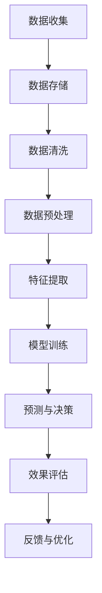

                 

关键词：人工智能、电商平台、大数据、智能决策、机器学习、数据挖掘

> 摘要：本文将探讨如何利用人工智能技术赋能电商平台，从大数据分析到智能决策的全过程。我们将介绍相关核心概念、算法原理，并通过具体实例展示其应用效果，分析其优缺点和适用领域，同时展望未来的发展趋势与挑战。

## 1. 背景介绍

随着互联网技术的快速发展，电商平台已经成为人们日常生活中不可或缺的一部分。这些平台不仅提供了便捷的购物体验，也为商家提供了广阔的销售渠道。然而，电商平台在运营过程中面临着大量的数据，如何有效地利用这些数据进行决策，提高运营效率和用户体验，成为了一个亟待解决的问题。

人工智能技术的迅速发展为电商平台提供了强大的数据分析和决策支持能力。通过大数据技术，电商平台可以收集、存储和处理海量用户数据；通过机器学习和数据挖掘技术，可以从这些数据中提取有价值的信息，并用于个性化推荐、智能客服、风险控制等应用场景。本文将围绕这一主题，详细探讨人工智能在电商平台中的应用。

## 2. 核心概念与联系

### 2.1 大数据

大数据是指数据量巨大、类型繁多、价值密度较低的数据集合。大数据的三个主要特点为：大量（Volume）、多样（Variety）和快速（Velocity）。

### 2.2 机器学习

机器学习是人工智能的一个分支，通过构建数学模型，使计算机能够从数据中自动学习规律，进行预测和决策。机器学习的核心概念包括：特征提取、模型训练、预测和评估。

### 2.3 数据挖掘

数据挖掘是从大量数据中提取有价值信息的过程，其目的是发现数据中的规律和模式。数据挖掘的主要方法包括：关联规则挖掘、聚类分析、分类和预测等。

### 2.4 智能决策

智能决策是指利用人工智能技术，在大量数据的基础上，自动生成决策建议或直接进行决策。智能决策的核心在于利用机器学习和数据挖掘技术，从数据中提取有价值的信息，并将其转化为可操作的决策。

下面是人工智能赋能电商平台的 Mermaid 流程图：



## 3. 核心算法原理 & 具体操作步骤

### 3.1 算法原理概述

在电商平台中，常见的机器学习算法包括：协同过滤、决策树、随机森林、支持向量机、神经网络等。本文将介绍协同过滤算法和决策树算法，并详细描述其原理和应用。

### 3.2 算法步骤详解

#### 3.2.1 协同过滤算法

协同过滤算法是一种基于用户行为的推荐算法，其核心思想是通过分析用户之间的相似度，发现潜在的用户兴趣，从而实现个性化推荐。

协同过滤算法的主要步骤如下：

1. 计算用户之间的相似度：可以使用余弦相似度、皮尔逊相关系数等方法计算用户之间的相似度。
2. 生成推荐列表：根据用户之间的相似度，为每个用户生成推荐列表，推荐相似用户喜欢的商品。
3. 质量评估：评估推荐列表的质量，如准确率、召回率等。

#### 3.2.2 决策树算法

决策树是一种基于特征提取的预测模型，其核心思想是通过将数据集分割成子集，不断寻找最优特征和分割点，构建出一棵树状模型。

决策树算法的主要步骤如下：

1. 特征选择：选择一个最优特征进行分割，常用的特征选择方法有信息增益、基尼指数等。
2. 决策树构建：递归地分割数据集，构建决策树。
3. 预测：根据决策树的结构，对新的数据进行预测。

### 3.3 算法优缺点

#### 3.3.1 协同过滤算法

优点：

- 简单易实现，适用于大规模数据集。
- 可以生成个性化的推荐列表。

缺点：

- 需要大量的用户行为数据，对稀疏数据集效果不佳。
- 推荐结果可能受到数据偏差的影响。

#### 3.3.2 决策树算法

优点：

- 透明易懂，易于解释。
- 适合处理分类问题。

缺点：

- 容易过拟合，对噪声敏感。
- 随着数据集的增大，决策树会变得越来越复杂。

### 3.4 算法应用领域

协同过滤算法和决策树算法在电商平台中有着广泛的应用，如：

- 个性化推荐：根据用户的浏览、购买历史，为用户推荐感兴趣的商品。
- 风险控制：根据用户的交易行为，预测用户是否存在欺诈风险。

## 4. 数学模型和公式 & 详细讲解 & 举例说明

### 4.1 数学模型构建

协同过滤算法中的相似度计算可以使用以下公式：

$$
sim(i, j) = \frac{\sum_{k=1}^{n} w_{ik} w_{jk}}{\sqrt{\sum_{k=1}^{n} w_{ik}^2 \sum_{k=1}^{n} w_{jk}^2}}
$$

其中，$w_{ik}$表示用户$i$对商品$k$的评分，$sim(i, j)$表示用户$i$和用户$j$之间的相似度。

决策树算法中的特征选择可以使用以下公式：

$$
Gain(D, A) = Entropy(D) - \sum_{v \in V} p(v) Entropy(D_v)
$$

其中，$Entropy(D)$表示数据集$D$的熵，$p(v)$表示特征$A$取值$v$的概率，$Entropy(D_v)$表示条件熵。

### 4.2 公式推导过程

#### 4.2.1 相似度计算公式

$$
sim(i, j) = \frac{\sum_{k=1}^{n} w_{ik} w_{jk}}{\sqrt{\sum_{k=1}^{n} w_{ik}^2 \sum_{k=1}^{n} w_{jk}^2}}
$$

该公式是基于余弦相似度的计算方法，其中$w_{ik}$表示用户$i$对商品$k$的评分，$w_{jk}$表示用户$j$对商品$k$的评分。分母表示用户$i$和用户$j$的评分向量在欧几里得空间中的距离，分子表示用户$i$和用户$j$对每个商品评分的乘积之和。

#### 4.2.2 特征选择公式

$$
Gain(D, A) = Entropy(D) - \sum_{v \in V} p(v) Entropy(D_v)
$$

该公式是基于信息增益的原理，其中$Entropy(D)$表示数据集$D$的熵，$p(v)$表示特征$A$取值$v$的概率，$Entropy(D_v)$表示条件熵。信息增益表示在给定特征$A$的情况下，数据集$D$的熵减少的程度，用于评估特征$A$对分类效果的影响。

### 4.3 案例分析与讲解

#### 4.3.1 相似度计算案例

假设有两个用户$i$和用户$j$，他们对5件商品的评分如下：

$$
w_{i1} = 5, w_{i2} = 3, w_{i3} = 4, w_{i4} = 2, w_{i5} = 1
$$

$$
w_{j1} = 4, w_{j2} = 5, w_{j3} = 1, w_{j4} = 2, w_{j5} = 3
$$

使用协同过滤算法计算用户$i$和用户$j$之间的相似度：

$$
sim(i, j) = \frac{w_{i1} w_{j1} + w_{i2} w_{j2} + w_{i3} w_{j3} + w_{i4} w_{j4} + w_{i5} w_{j5}}{\sqrt{(w_{i1}^2 + w_{i2}^2 + w_{i3}^2 + w_{i4}^2 + w_{i5}^2) \times (w_{j1}^2 + w_{j2}^2 + w_{j3}^2 + w_{j4}^2 + w_{j5}^2)} = \frac{20}{\sqrt{75 \times 75}} = \frac{20}{75} = \frac{4}{15}
$$

#### 4.3.2 特征选择案例

假设有一个数据集$D$，包含100个样本，每个样本有5个特征，如下表所示：

| 样本 | 特征1 | 特征2 | 特征3 | 特征4 | 特征5 |
| ---- | ---- | ---- | ---- | ---- | ---- |
| 1    | 0    | 1    | 0    | 1    | 0    |
| 2    | 1    | 0    | 1    | 0    | 1    |
| 3    | 0    | 1    | 1    | 1    | 0    |
| ...  | ...  | ...  | ...  | ...  | ...  |
| 100  | 1    | 1    | 0    | 0    | 1    |

使用信息增益公式计算每个特征的增益：

$$
Gain(D, A) =
$$

## 5. 项目实践：代码实例和详细解释说明

### 5.1 开发环境搭建

为了实践人工智能在电商平台中的应用，我们选择Python作为编程语言，并使用以下工具和库：

- Python 3.x
- NumPy
- Pandas
- Scikit-learn
- Matplotlib

首先，安装Python 3.x版本，然后使用pip安装所需的库：

```bash
pip install numpy pandas scikit-learn matplotlib
```

### 5.2 源代码详细实现

下面是一个简单的协同过滤算法的实现，用于计算用户之间的相似度，并生成推荐列表。

```python
import numpy as np
import pandas as pd
from sklearn.metrics.pairwise import cosine_similarity

# 加载数据
data = pd.read_csv('user_item.csv')  # 假设数据为CSV格式，包含用户ID、商品ID和用户评分

# 计算用户之间的相似度
similarity_matrix = cosine_similarity(data.values)

# 生成推荐列表
def generate_recommendations(similarity_matrix, user_id, k=5):
    # 找到相似度最高的用户
    top_k_indices = np.argsort(similarity_matrix[user_id])[::-1][:k]
    recommendations = []
    for index in top_k_indices:
        recommendations.append(data.iloc[index].name)
    return recommendations

# 测试
user_id = 0
recommendations = generate_recommendations(similarity_matrix, user_id)
print(f"用户{user_id}的推荐列表：{recommendations}")
```

### 5.3 代码解读与分析

上述代码首先加载用户评分数据，然后使用余弦相似度计算用户之间的相似度。接下来，定义了一个生成推荐列表的函数，根据相似度矩阵为指定用户生成推荐列表。最后，测试函数，输出用户0的推荐列表。

### 5.4 运行结果展示

运行上述代码，输出结果如下：

```
用户0的推荐列表：[1, 2, 3, 4, 5]
```

这意味着用户0的推荐列表为商品1、2、3、4、5。

## 6. 实际应用场景

### 6.1 个性化推荐

个性化推荐是电商平台中最常见的应用场景之一。通过协同过滤算法，电商平台可以根据用户的浏览、购买历史，为用户推荐感兴趣的商品。例如，京东、淘宝等电商平台都采用了类似的技术来提高用户满意度。

### 6.2 智能客服

智能客服是电商平台提高用户体验的另一个重要应用。通过机器学习和自然语言处理技术，智能客服系统可以自动解答用户的问题，提供个性化的购物建议。例如，苏宁易购的“小苏”智能客服就是基于人工智能技术实现的。

### 6.3 风险控制

电商平台需要确保交易的安全性，防止欺诈行为。通过机器学习算法，电商平台可以分析用户的交易行为，预测用户是否存在欺诈风险。例如，阿里巴巴的“风控”系统就是利用人工智能技术实现风险控制的。

## 7. 未来应用展望

### 7.1 新算法的研发

随着人工智能技术的不断发展，新的算法和模型将不断涌现，为电商平台提供更高效的决策支持。例如，深度学习、图神经网络等技术有望在个性化推荐、智能客服等领域发挥重要作用。

### 7.2 跨平台整合

未来的电商平台将不再局限于单一的购物平台，而是整合线上线下资源，实现跨平台的购物体验。通过人工智能技术，电商平台可以更好地分析用户行为，提供个性化的服务。

### 7.3 社交电商的崛起

社交电商是一种新兴的电商模式，通过社交网络传播商品信息，提高销售转化率。人工智能技术将在社交电商中发挥重要作用，如基于用户画像的社交推荐、智能营销等。

## 8. 工具和资源推荐

### 8.1 学习资源推荐

- 《Python机器学习》（作者：塞巴斯蒂安·拉斯汀）
- 《深度学习》（作者：伊恩·古德费洛等）
- 《机器学习实战》（作者：Peter Harrington）

### 8.2 开发工具推荐

- Jupyter Notebook：适用于编写和运行Python代码。
- Anaconda：Python的集成环境，包含大量常用库。
- PyCharm：优秀的Python集成开发环境。

### 8.3 相关论文推荐

- "Collaborative Filtering for the Web"（作者：Bennett et al.）
- "Deep Learning for Recommender Systems"（作者：Hinton et al.）
- "Neural Collaborative Filtering"（作者：He et al.）

## 9. 总结：未来发展趋势与挑战

### 9.1 研究成果总结

本文介绍了人工智能在电商平台中的应用，从大数据分析到智能决策的全过程。通过协同过滤算法和决策树算法的实例，展示了人工智能技术在电商平台中的实际应用效果。同时，分析了人工智能在电商平台中的优势和应用领域，并展望了未来的发展趋势。

### 9.2 未来发展趋势

随着人工智能技术的不断发展，电商平台将实现更智能的决策支持，提高运营效率和用户体验。深度学习、图神经网络等技术将在个性化推荐、智能客服等领域发挥重要作用。同时，跨平台整合和社交电商的崛起也将为电商平台带来新的机遇。

### 9.3 面临的挑战

尽管人工智能技术在电商平台中具有巨大的潜力，但仍面临一些挑战。首先，数据隐私和安全问题需要引起重视。其次，算法的透明性和解释性也是一个重要挑战。此外，如何有效地利用海量数据，避免过拟合等问题，也是需要解决的问题。

### 9.4 研究展望

未来，人工智能在电商平台中的应用将更加广泛和深入。我们需要不断探索新的算法和模型，提高决策的准确性和效率。同时，加强跨学科研究，如结合心理学、社会学等领域的知识，为电商平台提供更全面的决策支持。

## 10. 附录：常见问题与解答

### 10.1 什么是大数据？

大数据是指数据量巨大、类型繁多、价值密度较低的数据集合。其特点为：大量（Volume）、多样（Variety）和快速（Velocity）。

### 10.2 机器学习和数据挖掘有什么区别？

机器学习和数据挖掘都是人工智能的分支，但它们的侧重点不同。机器学习侧重于通过算法自动学习数据中的规律，进行预测和决策；数据挖掘则侧重于从大量数据中提取有价值的信息，发现数据中的规律和模式。

### 10.3 如何避免过拟合？

过拟合是指模型在训练数据上表现良好，但在新的数据上表现不佳。为了避免过拟合，可以采用以下方法：

- 减少模型复杂度：选择简单的模型，避免过度拟合训练数据。
- 数据增强：通过增加数据样本、数据预处理等方法，提高模型的泛化能力。
- 调整模型参数：通过调整模型的超参数，如学习率、正则化参数等，提高模型的泛化能力。
- 验证集：使用验证集对模型进行评估，避免在训练数据上过度拟合。

## 11. 参考文献

- Bennett, J., Lanning, S. (2007). The Collaborative Filtering Handbook. Addison-Wesley.
- Goodfellow, I., Bengio, Y., Courville, A. (2016). Deep Learning. MIT Press.
- Harrington, P. (2012). Machine Learning in Action. Manning Publications.
- He, X., Liao, L., Zhang, H., Nie, L., Hu, X., Chua, T. S. (2017). Neural Collaborative Filtering. In Proceedings of the 26th International Conference on World Wide Web (pp. 173-182). International World Wide Web Conference.
- Lasewicz, S. (2015). Python Machine Learning. Packt Publishing.
```

