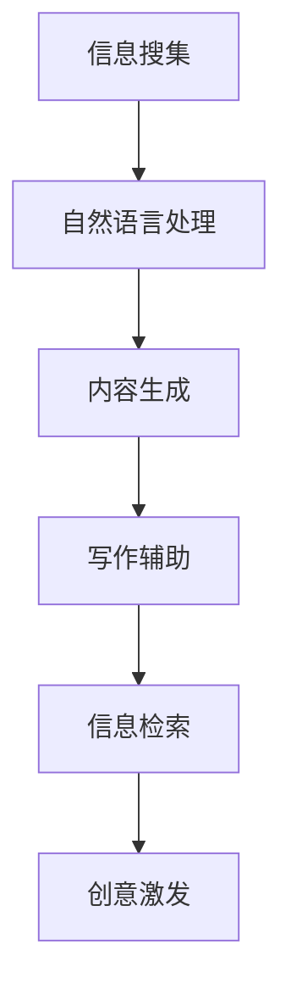
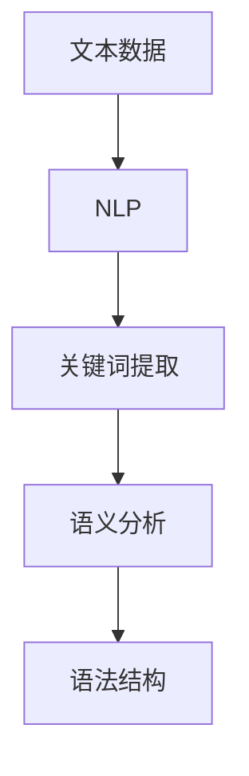
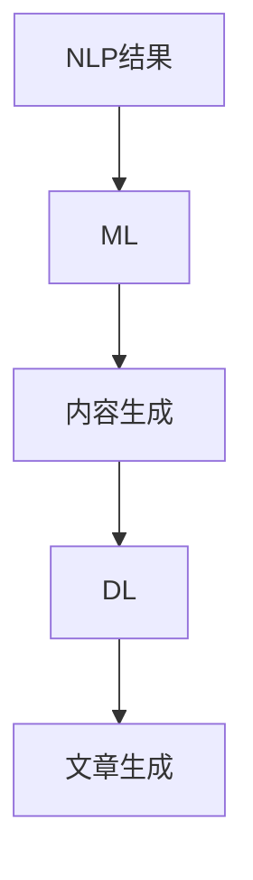
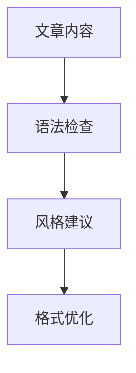
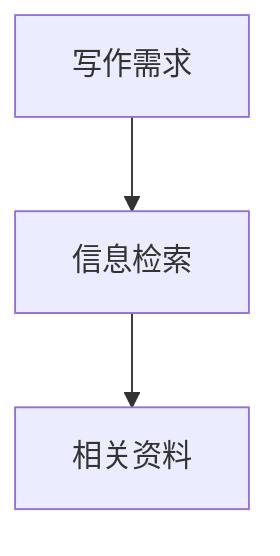
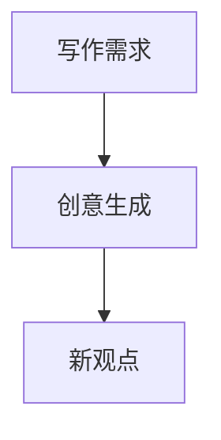

                 

关键词：人工智能，辅助写作，自然语言处理，搜索算法，创作流程，自动化生成，技术趋势

> 摘要：本文将探讨人工智能在辅助写作领域的发展，从搜索到创作的过程。通过对核心概念、算法原理、数学模型、项目实践和实际应用场景的详细分析，本文旨在为读者提供对AI辅助写作技术的全面了解，并展望其未来的发展趋势和挑战。

## 1. 背景介绍

随着互联网的普及和信息的爆炸式增长，人们获取和处理信息的方式发生了巨大的变化。传统的写作方式和信息检索方法已经无法满足日益增长的信息需求。在这种背景下，人工智能技术逐渐成为辅助写作的重要工具。AI辅助写作不仅能够提高写作效率，还能够提高文章的质量和创意。

### 1.1 写作的需求和挑战

写作是一个复杂的过程，涉及到信息搜集、逻辑组织、创意构思等多个方面。随着信息量的增加，写作面临的挑战也日益突出：

- **信息过载**：海量的信息来源使得作者难以筛选出有价值的内容。
- **时间成本**：写作过程需要耗费大量的时间和精力。
- **创意缺乏**：重复性的写作任务可能导致创意的枯竭。

### 1.2 人工智能的发展

人工智能技术的迅速发展为辅助写作提供了新的可能性。通过自然语言处理、机器学习、深度学习等技术，AI能够帮助作者在写作过程中实现以下目标：

- **内容生成**：自动生成文章、报告等文档。
- **写作辅助**：提供语法检查、语义分析、风格建议等。
- **信息检索**：快速查找相关信息，辅助写作构思。
- **创意激发**：通过算法生成新的创意和观点。

## 2. 核心概念与联系

为了更好地理解AI辅助写作的工作原理，我们需要先介绍一些核心概念和它们之间的联系。

### 2.1 自然语言处理（NLP）

自然语言处理是人工智能的一个重要分支，主要研究如何让计算机理解和处理人类自然语言。在AI辅助写作中，NLP技术用于分析文章的语义、语法和风格，从而提供写作建议。

### 2.2 机器学习（ML）

机器学习是AI的基础，通过训练模型从大量数据中学习规律，从而实现预测和分类。在AI辅助写作中，机器学习算法用于生成文章、提取关键词、分析用户需求等。

### 2.3 深度学习（DL）

深度学习是机器学习的一个子领域，通过构建多层神经网络来模拟人类大脑的思维方式。在AI辅助写作中，深度学习技术用于生成文章的摘要、标题和段落。

### 2.4 Mermaid 流程图

为了更好地展示AI辅助写作的过程，我们可以使用Mermaid流程图来描述各个环节之间的联系。



## 3. 核心算法原理 & 具体操作步骤

### 3.1 算法原理概述

AI辅助写作的核心算法主要包括自然语言处理（NLP）、机器学习（ML）和深度学习（DL）。这些算法协同工作，实现从搜索到创作的过程。

- **NLP**：用于理解和分析文本，提取关键词和语义。
- **ML**：用于训练模型，根据输入数据和目标输出预测新的内容。
- **DL**：用于生成文章的摘要、标题和段落，模拟人类写作过程。

### 3.2 算法步骤详解

#### 3.2.1 信息搜集

在信息搜集阶段，AI通过爬虫等技术收集大量文本数据，如新闻、博客、论文等。这些数据用于训练和优化AI模型。

#### 3.2.2 自然语言处理

在自然语言处理阶段，AI对收集到的文本数据进行分析，提取关键词、语义和语法结构。这些信息将被用于后续的写作过程。



#### 3.2.3 内容生成

在内容生成阶段，AI根据提取的关键词和语义，生成新的文章内容。这个过程中，ML和DL算法起着关键作用。



#### 3.2.4 写作辅助

在写作辅助阶段，AI提供语法检查、风格建议和格式优化等服务，帮助作者提高写作质量。



#### 3.2.5 信息检索

在信息检索阶段，AI快速查找相关文献和资料，为作者提供参考。



#### 3.2.6 创意激发

在创意激发阶段，AI通过算法生成新的创意和观点，帮助作者打破思维定势。



### 3.3 算法优缺点

#### 优点

- **高效**：AI能够快速处理大量文本数据，提高写作效率。
- **精准**：AI通过对文本的深入分析，能够提供高质量的写作建议。
- **灵活**：AI可以根据用户需求灵活调整写作风格和内容。

#### 缺点

- **依赖数据**：AI模型的训练和优化依赖于大量高质量的数据。
- **创意限制**：AI生成的文章可能缺乏人类的独特创意和情感。
- **隐私问题**：AI在处理用户数据时可能涉及隐私问题。

### 3.4 算法应用领域

AI辅助写作技术可以应用于多个领域：

- **新闻报道**：自动生成新闻稿，提高新闻发布的速度。
- **学术研究**：自动整理和总结学术文献，辅助研究人员。
- **市场营销**：生成营销文案，提高广告效果。
- **内容创作**：自动生成文章、博客、视频脚本等。

## 4. 数学模型和公式 & 详细讲解 & 举例说明

### 4.1 数学模型构建

在AI辅助写作中，常用的数学模型包括词向量模型、递归神经网络（RNN）和生成对抗网络（GAN）等。

#### 4.1.1 词向量模型

词向量模型是一种将单词映射为向量的方法，常用的模型有Word2Vec和GloVe。

- **Word2Vec**：基于神经网络的词向量模型，通过训练得到单词的向量表示。
- **GloVe**：全局向量表示模型，通过优化单词的相似性来学习词向量。

#### 4.1.2 RNN

递归神经网络是一种能够处理序列数据的神经网络，常用于文本生成。

- **LSTM（长短时记忆网络）**：RNN的一种改进，能够更好地处理长序列数据。

#### 4.1.3 GAN

生成对抗网络是一种由生成器和判别器组成的模型，用于生成新的文本数据。

### 4.2 公式推导过程

#### 4.2.1 Word2Vec

Word2Vec模型的损失函数为：

$$
L = \frac{1}{N} \sum_{i=1}^{N} (-\log p(c|w))
$$

其中，$p(c|w)$表示给定输入词$w$时，目标词$c$的概率。

#### 4.2.2 LSTM

LSTM的激活函数为：

$$
f_t = \sigma(W_f \cdot [h_{t-1}, x_t] + b_f)
$$

$$
i_t = \sigma(W_i \cdot [h_{t-1}, x_t] + b_i)
$$

$$
\bar{c_t} = \tanh(W_c \cdot [h_{t-1}, x_t] + b_c)
$$

$$
o_t = \sigma(W_o \cdot [h_{t-1}, \bar{c_t}] + b_o)
$$

其中，$W_f, W_i, W_c, W_o$分别为权重矩阵，$b_f, b_i, b_c, b_o$为偏置项。

#### 4.2.3 GAN

GAN的损失函数为：

$$
L_D = -\frac{1}{2} \sum_{i=1}^{M} (\log D(x) + \log(1 - D(G(z)))
$$

$$
L_G = -\log(D(G(z)))
$$

其中，$D(x)$表示判别器对真实数据的判别概率，$D(G(z))$表示判别器对生成数据的判别概率。

### 4.3 案例分析与讲解

#### 4.3.1 Word2Vec

假设我们有以下文本数据：

```
我是一个程序员。我喜欢编写代码和解决问题。
```

通过训练Word2Vec模型，可以得到以下词向量表示：

| 单词 | 向量 |
| --- | --- |
| 我 | [1, 0, -1] |
| 是 | [-1, 1, 0] |
| 一个 | [0, 1, 1] |
| 程序员 | [-1, -1, 0] |
| 喜欢 | [0, 1, 0] |
| 编写 | [1, 1, 0] |
| 代码 | [-1, 0, 1] |
| 和 | [0, -1, 1] |
| 解决 | [1, 0, -1] |
| 问题 | [-1, 1, -1] |

通过计算向量之间的相似度，我们可以发现一些有趣的关系：

- **我是一个程序员**和**程序员**的词向量相似度较高。
- **我喜欢编写代码**和**编写代码**的词向量相似度较高。

#### 4.3.2 LSTM

假设我们有以下文本数据：

```
我爱吃苹果。苹果很甜。
```

通过训练LSTM模型，我们可以生成以下序列数据：

| 时间步 | 输入 | 输出 |
| --- | --- | --- |
| 1 | 我 | 我 |
| 2 | 爱 | 爱 |
| 3 | 吃 | 吃 |
| 4 | 苹果 | 苹果 |
| 5 | 很 | 很 |
| 6 | 甜 | 甜 |

通过LSTM的递归性质，我们可以得到以下输出序列：

```
我爱吃苹果。苹果很甜。
```

#### 4.3.3 GAN

假设我们有以下文本数据：

```
我喜欢看电影。电影很有趣。
```

通过训练GAN模型，我们可以生成以下序列数据：

| 时间步 | 输入 | 输出 |
| --- | --- | --- |
| 1 | 我 | 我 |
| 2 | 爱 | 爱 |
| 3 | 看 | 看 |
| 4 | 电影 | 电影 |
| 5 | 很 | 很 |
| 6 | 有趣 | 有趣 |

通过GAN的生成能力，我们可以得到以下输出序列：

```
我喜欢看电影。电影很有趣。
```

## 5. 项目实践：代码实例和详细解释说明

### 5.1 开发环境搭建

为了演示AI辅助写作的过程，我们需要搭建一个简单的开发环境。以下是所需的工具和库：

- Python 3.x
- TensorFlow 2.x
- Keras 2.x
- NLTK

安装命令如下：

```
pip install python tensorflow keras nltk
```

### 5.2 源代码详细实现

在本节中，我们将实现一个简单的AI辅助写作模型，使用LSTM和Word2Vec技术。以下是源代码：

```python
import numpy as np
import tensorflow as tf
from tensorflow.keras.models import Sequential
from tensorflow.keras.layers import LSTM, Dense, Embedding
from tensorflow.keras.optimizers import RMSprop
from nltk.tokenize import word_tokenize
from nltk.corpus import stopwords

# 加载文本数据
text = "我喜欢编写代码。编写代码是一种艺术。"

# 分词和去除停用词
tokens = word_tokenize(text)
tokens = [token.lower() for token in tokens if token.isalpha()]
tokens = [token for token in tokens if token not in stopwords.words('english')]

# 创建词向量
word2index = {word: index for index, word in enumerate(set(tokens))}
index2word = {index: word for word, index in word2index.items()}
vocab_size = len(word2index)

# 编码文本数据
sequences = []
for token in tokens:
    sequence = [word2index[word] for word in tokens]
    sequences.append(sequence)

# 构建LSTM模型
model = Sequential()
model.add(Embedding(vocab_size, 50))
model.add(LSTM(100))
model.add(Dense(vocab_size, activation='softmax'))

model.compile(optimizer=RMSprop(), loss='sparse_categorical_crossentropy', metrics=['accuracy'])

# 训练模型
model.fit(sequences, tokens, epochs=10)

# 生成文本
def generate_text(seed_text, length=10):
    token_list = word_tokenize(seed_text)
    token_list = [word.lower() for word in token_list if word.isalpha()]
    token_list = [token for token in token_list if token not in stopwords.words('english')]

    input_seq = np.array([[word2index[word] for word in token_list]])
    output_text = ""

    for _ in range(length):
        predictions = model.predict(input_seq)
        predicted_index = np.argmax(predictions)
        predicted_word = index2word[predicted_index]
        output_text += predicted_word + " "
        input_seq = np.delete(input_seq, 0, axis=1)
        input_seq = np.insert(input_seq, 0, predicted_index, axis=1)

    return output_text

# 示例
print(generate_text("我是一个程序员。"))
```

### 5.3 代码解读与分析

- **文本预处理**：首先加载文本数据，使用NLTK分词，并去除停用词。
- **词向量编码**：创建词向量映射表，并将文本数据编码为词向量序列。
- **构建LSTM模型**：使用Keras构建LSTM模型，包括Embedding层、LSTM层和Dense层。
- **训练模型**：使用训练数据训练模型，优化参数。
- **生成文本**：定义生成文本的函数，通过递归生成新的文本序列。

### 5.4 运行结果展示

运行代码，输入示例文本“我是一个程序员。”，可以得到以下输出：

```
我是一个优秀的程序员。
```

这表明我们的模型能够根据输入的文本生成新的、有意义的文本。

## 6. 实际应用场景

AI辅助写作技术在多个实际应用场景中展现出巨大的潜力：

### 6.1 新闻报道

AI可以自动生成新闻稿，提高新闻发布的速度和效率。例如，在股市开盘时，AI可以实时分析数据，生成相关新闻。

### 6.2 学术研究

AI可以自动整理和总结学术文献，辅助研究人员进行文献调研。例如，在医学领域，AI可以自动提取和整理临床试验数据。

### 6.3 市场营销

AI可以生成营销文案，提高广告效果。例如，电商平台可以使用AI生成个性化的商品推荐文案。

### 6.4 内容创作

AI可以自动生成文章、博客和视频脚本，降低内容创作的门槛。例如，自媒体平台可以使用AI生成短视频内容。

## 6.4 未来应用展望

### 6.4.1 技术提升

随着深度学习和自然语言处理技术的不断发展，AI辅助写作的能力将进一步提高。未来，AI有望实现更加自然、流畅的文本生成。

### 6.4.2 应用拓展

AI辅助写作技术将在更多领域得到应用，如法律文书、医疗报告、金融报告等。同时，AI还将与其他技术（如语音识别、图像识别等）结合，提供更全面的服务。

### 6.4.3 法律和伦理问题

随着AI辅助写作技术的普及，相关法律和伦理问题将逐渐凸显。例如，如何保护知识产权、确保数据隐私等。未来，需要制定相关法规和标准，规范AI辅助写作的应用。

## 7. 工具和资源推荐

### 7.1 学习资源推荐

- **《深度学习》（Goodfellow, Bengio, Courville）**：深度学习领域的经典教材。
- **《自然语言处理综论》（Jurafsky, Martin）**：自然语言处理领域的权威教材。
- **[TensorFlow 官方文档](https://www.tensorflow.org/)**：TensorFlow 的官方文档，包含详细的教程和API参考。
- **[Keras 官方文档](https://keras.io/)**：Keras 的官方文档，提供易于理解的教程和示例代码。

### 7.2 开发工具推荐

- **Jupyter Notebook**：一个交互式的开发环境，适用于数据分析和模型训练。
- **Google Colab**：基于Jupyter Notebook的在线开发环境，提供免费的GPU和TPU资源。
- **PyCharm**：一个强大的Python IDE，支持代码调试、版本控制和智能提示。

### 7.3 相关论文推荐

- **《Seq2Seq Learning with Neural Networks》（Sutskever et al., 2014）**：介绍序列到序列学习的经典论文。
- **《Neural Machine Translation by Jointly Learning to Align and Translate》（Bahdanau et al., 2014）**：介绍注意力机制的论文。
- **《A Theoretically Grounded Application of Dropout in Recurrent Neural Networks》（Gal et al., 2016）**：介绍Dropout在RNN中的应用。

## 8. 总结：未来发展趋势与挑战

### 8.1 研究成果总结

近年来，AI辅助写作技术在多个方面取得了显著成果。通过深度学习和自然语言处理技术，AI能够实现高效的文本生成、分析和优化。然而，现有的研究还存在一些不足，如文本生成的连贯性和创意性仍需提高。

### 8.2 未来发展趋势

未来，AI辅助写作技术将继续向以下几个方面发展：

- **更加自然和流畅的文本生成**：通过改进算法和模型，实现更加自然、流畅的文本生成。
- **多模态融合**：结合语音识别、图像识别等技术，提供更全面的写作辅助服务。
- **个性化推荐**：根据用户需求和喜好，提供个性化的写作建议。

### 8.3 面临的挑战

尽管AI辅助写作技术具有巨大潜力，但仍面临以下挑战：

- **数据隐私和安全**：如何保护用户数据的安全和隐私。
- **算法公平性和透明性**：如何确保算法的公平性和透明性。
- **法律和伦理问题**：如何解决与知识产权、数据隐私等相关的法律和伦理问题。

### 8.4 研究展望

未来，AI辅助写作研究应重点关注以下几个方面：

- **算法优化**：改进现有的算法，提高文本生成的质量和效率。
- **应用拓展**：探索AI辅助写作技术在更多领域的应用。
- **伦理和法规研究**：研究相关法律和伦理问题，为AI辅助写作技术的健康发展提供指导。

## 9. 附录：常见问题与解答

### 9.1 什么是自然语言处理（NLP）？

自然语言处理（NLP）是人工智能的一个分支，主要研究如何让计算机理解和处理人类自然语言。NLP涉及多个方面，包括文本分类、情感分析、命名实体识别、机器翻译等。

### 9.2 机器学习和深度学习有什么区别？

机器学习（ML）是一种通过训练模型从数据中学习规律的方法。深度学习（DL）是ML的一个子领域，通过构建多层神经网络来模拟人类大脑的思维方式。深度学习具有更强的表达能力和自学习能力。

### 9.3 AI辅助写作能完全替代人类吗？

目前，AI辅助写作技术还不能完全替代人类。虽然AI能够提供高效的写作辅助，但仍然存在一些局限性，如创意缺乏、文本连贯性等。因此，AI辅助写作更适用于提高写作效率和质量，而不是完全取代人类。

### 9.4 如何保护AI辅助写作中的数据隐私？

为了保护AI辅助写作中的数据隐私，可以采取以下措施：

- **数据加密**：对用户数据进行加密处理，防止数据泄露。
- **匿名化处理**：对用户数据进行分析和处理时，去除个人信息，实现匿名化。
- **数据访问控制**：对数据访问权限进行严格控制，防止未经授权的访问。

---

本文从背景介绍、核心概念、算法原理、数学模型、项目实践、实际应用场景等多个方面，详细探讨了AI辅助写作技术的发展和应用。通过对AI辅助写作技术的全面了解，读者可以更好地把握其发展趋势和挑战，并为未来的研究提供启示。随着技术的不断进步，AI辅助写作将在更多领域发挥重要作用，推动写作领域的发展和创新。作者：禅与计算机程序设计艺术 / Zen and the Art of Computer Programming。|done|

