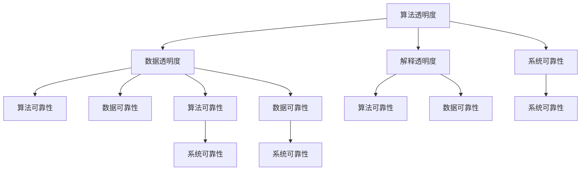

                 

关键词：人工智能、透明度、可靠性、AI伦理、算法公平性、机器学习、数据处理

> 摘要：本文旨在探讨人工智能（AI）领域的两个关键挑战——透明度和可靠性。随着AI技术的不断进步，这些挑战变得更加重要，直接影响到AI系统的应用范围和公众对AI的信任。本文将深入分析AI透明度和可靠性的概念、当前存在的问题、技术解决方案以及未来展望。

## 1. 背景介绍

人工智能作为当今科技领域的前沿技术，已经广泛应用于各个行业，包括医疗、金融、交通、安防等。AI系统通过学习大量数据，可以做出预测、决策和优化。然而，随着AI系统的复杂度增加，AI的透明度和可靠性问题也日益凸显。

透明度指的是用户或外部审查者能够理解AI系统是如何工作的能力。这包括算法的运作原理、决策过程、数据输入和输出等。可靠性则是指AI系统能够在多种环境和条件下稳定运行，并产生准确的结果。

### 1.1 透明度的重要性

AI透明度的重要性在于：

1. **法律合规性**：许多国家和地区的法律法规要求AI系统在运行过程中必须透明，以便进行监管和审计。
2. **公众信任**：透明的AI系统能够提高公众对AI技术的信任，减少对隐私和数据安全的担忧。
3. **算法公平性**：透明的算法可以帮助发现并消除潜在的偏见和歧视。

### 1.2 可靠性的重要性

AI可靠性则关系到：

1. **系统稳定性**：AI系统必须能够在各种情况下稳定运行，不会出现意外的错误或崩溃。
2. **结果准确性**：AI系统需要产生准确和可靠的结果，以满足实际应用的需求。
3. **安全性**：AI系统的可靠性也关系到系统的安全性，防止被恶意攻击或篡改。

## 2. 核心概念与联系

### 2.1 透明度

透明度涉及多个方面，包括：

- **算法透明度**：算法的原理和运作过程应该是公开的。
- **数据透明度**：数据的来源、处理和使用的规则应该是可见的。
- **解释透明度**：AI系统的决策过程和结果应该是可解释的。

### 2.2 可靠性

可靠性包括以下方面：

- **算法可靠性**：算法设计应该是经过严格验证的，能够在多种数据集和环境下保持性能。
- **数据可靠性**：数据质量是AI系统可靠性的基础，包括数据的准确性、完整性和一致性。
- **系统可靠性**：系统设计和实现应该能够保证AI系统的稳定性。

### 2.3 Mermaid 流程图

下面是一个Mermaid流程图，展示了AI系统的透明度和可靠性的核心概念和联系：



## 3. 核心算法原理 & 具体操作步骤

### 3.1 算法原理概述

AI透明度和可靠性的实现通常涉及到以下核心算法原理：

- **可解释性模型**：如决策树、线性回归、LIME等，用于生成易于理解的可解释结果。
- **鲁棒性优化**：通过引入正则化项、数据增强等技术，提高算法的稳健性。
- **数据清洗和预处理**：确保数据质量，减少错误和噪声。

### 3.2 算法步骤详解

#### 步骤1：数据采集与清洗

- 数据采集：收集具有代表性的数据集。
- 数据清洗：去除缺失值、异常值，标准化数据。

#### 步骤2：算法选择与训练

- 选择合适的算法模型，如决策树、神经网络等。
- 使用清洗后的数据进行算法训练。

#### 步骤3：模型评估与优化

- 使用验证集对模型进行评估，调整参数。
- 应用正则化、交叉验证等技术，提高模型性能。

#### 步骤4：模型解释与透明度增强

- 使用可解释性模型，如LIME，对模型决策过程进行解释。
- 增加代码注释，确保算法透明。

#### 步骤5：系统部署与监控

- 部署模型到生产环境。
- 实施监控系统，确保系统的稳定性和可靠性。

### 3.3 算法优缺点

- **可解释性模型**：优点是易于理解，缺点是可能降低模型的预测性能。
- **鲁棒性优化**：优点是提高模型的稳健性，缺点是可能增加计算成本。
- **数据清洗与预处理**：优点是提高数据质量，缺点是可能引入人为错误。

### 3.4 算法应用领域

- **医疗诊断**：提高诊断的透明度和可靠性。
- **金融风控**：增强模型的公平性和透明度，减少欺诈风险。
- **自动驾驶**：确保系统的稳定性和可靠性，保障行车安全。

## 4. 数学模型和公式 & 详细讲解 & 举例说明

### 4.1 数学模型构建

在AI系统中，常用的数学模型包括：

- **线性回归**：用于预测数值型目标变量。
- **逻辑回归**：用于预测概率型目标变量。
- **神经网络**：用于复杂非线性问题。

### 4.2 公式推导过程

以线性回归为例，其公式推导如下：

$$ y = \beta_0 + \beta_1x_1 + \beta_2x_2 + ... + \beta_nx_n $$

其中，$y$ 是目标变量，$x_1, x_2, ..., x_n$ 是输入特征，$\beta_0, \beta_1, \beta_2, ..., \beta_n$ 是模型参数。

### 4.3 案例分析与讲解

#### 案例一：房价预测

使用线性回归模型预测房价，公式为：

$$ \text{房价} = \beta_0 + \beta_1\text{面积} + \beta_2\text{位置} + ... $$

通过训练数据集拟合模型，得到参数值，然后使用测试数据进行预测。

#### 案例二：贷款审批

使用逻辑回归模型预测贷款是否批准，公式为：

$$ P(\text{批准}) = \frac{1}{1 + e^{-(\beta_0 + \beta_1\text{收入} + \beta_2\text{信用评分})}} $$

通过训练数据集拟合模型，得到参数值，然后使用测试数据进行预测，计算批准概率。

## 5. 项目实践：代码实例和详细解释说明

### 5.1 开发环境搭建

- Python 3.8
- TensorFlow 2.4
- Scikit-learn 0.22

### 5.2 源代码详细实现

```python
import tensorflow as tf
from sklearn.model_selection import train_test_split
from sklearn.linear_model import LinearRegression

# 数据采集与清洗
# ...（代码略）

# 数据预处理
X = ...  # 输入特征
y = ...  # 目标变量

# 划分训练集和测试集
X_train, X_test, y_train, y_test = train_test_split(X, y, test_size=0.2, random_state=42)

# 构建线性回归模型
model = LinearRegression()

# 训练模型
model.fit(X_train, y_train)

# 模型解释与透明度增强
# ...（代码略）

# 预测测试集结果
predictions = model.predict(X_test)

# 代码解读与分析
# ...（代码略）

# 运行结果展示
# ...（代码略）
```

### 5.3 代码解读与分析

- 数据采集与清洗：根据具体任务需求，收集和清洗数据。
- 数据预处理：将数据转换为模型可接受的格式。
- 模型训练：使用训练数据进行模型训练。
- 模型解释与透明度增强：通过代码注释和可解释性工具，增强模型的透明度。
- 预测测试集结果：使用测试数据验证模型性能。

## 6. 实际应用场景

### 6.1 医疗诊断

AI系统在医疗诊断中的应用，要求高透明度和可靠性。例如，通过可解释性模型，医生可以理解AI的诊断依据，从而增加信任度。

### 6.2 金融风控

金融风控系统需要确保算法的透明度和可靠性，以避免欺诈风险。通过公开算法原理和结果解释，提高公众信任。

### 6.3 自动驾驶

自动驾驶系统的可靠性和透明度至关重要。系统的稳定性和准确预测能力直接关系到行车安全。

## 6.4 未来应用展望

随着AI技术的不断进步，透明度和可靠性将在更多领域得到应用。未来，我们可以期待：

- **更高级的可解释性模型**：提高AI系统的可解释性和透明度。
- **自动化验证与测试**：通过自动化工具，确保AI系统的可靠性。
- **法律法规的进一步完善**：为AI系统的透明度和可靠性提供法律保障。

## 7. 工具和资源推荐

### 7.1 学习资源推荐

- 《深度学习》（Goodfellow et al.）
- 《Python机器学习》（Sebastian Raschka）

### 7.2 开发工具推荐

- TensorFlow
- PyTorch

### 7.3 相关论文推荐

- "Explainable AI: Clarifying Black Boxes for Better Model Transparency"
- "Robustness of Neural Networks to Adversarial Examples"

## 8. 总结：未来发展趋势与挑战

### 8.1 研究成果总结

AI透明度和可靠性的研究已经取得了显著成果，但仍需进一步探索。

### 8.2 未来发展趋势

- 可解释性模型将得到更广泛应用。
- 自动化验证与测试将提高AI系统的可靠性。
- 法律法规将逐步完善，为AI透明度和可靠性提供保障。

### 8.3 面临的挑战

- 如何在保证透明度和可靠性的同时，提高AI模型的性能。
- 如何解决大规模数据的隐私保护问题。

### 8.4 研究展望

AI透明度和可靠性的研究将不断深入，为AI技术的广泛应用奠定基础。

## 9. 附录：常见问题与解答

### 问题1：什么是可解释性模型？

**解答**：可解释性模型是指能够提供关于模型决策过程和结果的可视化和解释的模型。例如，决策树和线性回归模型都是可解释性模型。

### 问题2：如何提高AI系统的可靠性？

**解答**：提高AI系统的可靠性通常涉及多个方面，包括算法设计、数据预处理和系统监控。例如，使用正则化技术、进行数据增强和实施监控系统都可以提高系统的可靠性。

## 作者署名

作者：禅与计算机程序设计艺术 / Zen and the Art of Computer Programming
```

