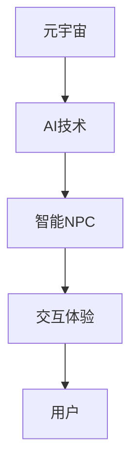

                 

关键词：AI，元宇宙，智能NPC，虚拟世界，算法，数学模型，项目实践，应用场景，未来展望

摘要：本文探讨了AI驱动的元宇宙中智能NPC（非玩家角色）的设计与实现。首先介绍了元宇宙的概念和背景，随后深入分析了智能NPC的核心概念、算法原理和应用领域。文章通过详细的数学模型和公式推导，提供了智能NPC的实现步骤。同时，通过实际项目实践，展示了代码实例和详细解释。最后，本文对智能NPC在实际应用场景中的发展前景进行了展望，并提出了未来研究的发展趋势与挑战。

## 1. 背景介绍

随着科技的飞速发展，虚拟现实（VR）和增强现实（AR）技术逐渐走入公众视野，元宇宙（Metaverse）的概念也应运而生。元宇宙是一个由多个虚拟世界构成的互联网空间，用户可以通过数字化的身份（Avatar）在其中进行社交、工作、娱乐等活动。智能NPC作为虚拟世界中的关键组成部分，承担着为玩家提供交互体验的重要角色。

智能NPC（Non-Player Character）是指在虚拟世界中由人工智能驱动的非玩家角色。与传统的NPC不同，智能NPC具有自主决策能力和学习能力，能够与玩家进行智能化的互动。智能NPC在元宇宙中的应用非常广泛，如虚拟导游、智能客服、游戏角色等。随着人工智能技术的不断进步，智能NPC正逐渐成为元宇宙中不可或缺的一环。

## 2. 核心概念与联系

### 2.1 AI驱动的元宇宙

AI驱动的元宇宙是指通过人工智能技术构建和驱动的虚拟世界。在元宇宙中，AI技术不仅用于智能NPC的生成和管理，还用于场景构建、交互体验优化等多个方面。AI驱动的元宇宙具有高度智能化、个性化和沉浸感，能够为用户提供丰富的虚拟体验。

### 2.2 智能NPC的核心概念

智能NPC是虚拟世界中的一种重要角色，其核心概念包括以下几个方面：

- **自主决策**：智能NPC能够根据环境信息和玩家的行为，自主做出决策，如对话选择、行动路径等。
- **学习能力**：智能NPC具备学习能力，可以通过数据分析和自我学习，不断优化自身的表现。
- **情感表达**：智能NPC能够模拟人类的情感表达，增强与玩家的互动体验。
- **个性化**：智能NPC可以根据玩家的行为和偏好，提供个性化的服务。

### 2.3 AI驱动的元宇宙与智能NPC的关系

AI驱动的元宇宙为智能NPC提供了广阔的应用场景，而智能NPC则提升了元宇宙的交互体验。两者相辅相成，共同构建了一个更加智能、丰富和沉浸的虚拟世界。

### 2.4 Mermaid流程图



## 3. 核心算法原理 & 具体操作步骤

### 3.1 算法原理概述

智能NPC的核心算法主要包括以下三个方面：

- **决策树算法**：用于NPC的决策过程，根据环境信息和玩家的行为，选择合适的行动。
- **神经网络算法**：用于NPC的学习和情感表达，通过不断训练，提升NPC的表现。
- **自然语言处理算法**：用于NPC与玩家的对话，实现智能对话交互。

### 3.2 算法步骤详解

#### 3.2.1 决策树算法

决策树算法是一种常用的分类和回归算法，通过构建一棵树来表示数据集。在智能NPC中，决策树算法用于NPC的决策过程。

1. 收集环境信息和玩家行为数据。
2. 构建决策树，根据数据特征进行分类。
3. 根据决策树的结果，选择合适的行动。

#### 3.2.2 神经网络算法

神经网络算法是一种模拟生物神经系统的计算模型，具有强大的学习和自适应能力。在智能NPC中，神经网络算法用于NPC的学习和情感表达。

1. 收集NPC的交互数据。
2. 构建神经网络模型，进行训练。
3. 根据训练结果，调整NPC的行为和情感表达。

#### 3.2.3 自然语言处理算法

自然语言处理算法是一种用于处理人类语言信息的计算机技术，包括文本分析、语义理解和对话生成等。在智能NPC中，自然语言处理算法用于实现NPC与玩家的对话。

1. 分析玩家的输入，提取关键信息。
2. 根据关键信息，生成合适的回答。
3. 输出对话结果，实现智能对话交互。

### 3.3 算法优缺点

#### 优点

- **自主决策**：智能NPC能够根据环境信息和玩家行为，自主做出决策，提高交互体验。
- **学习能力**：智能NPC具备学习能力，可以通过数据分析和自我学习，不断优化自身表现。
- **情感表达**：智能NPC能够模拟人类的情感表达，增强与玩家的互动体验。
- **个性化**：智能NPC可以根据玩家的行为和偏好，提供个性化的服务。

#### 缺点

- **计算复杂度**：智能NPC的算法涉及多个复杂模型，计算复杂度较高，对硬件资源要求较高。
- **数据依赖**：智能NPC的学习和表现高度依赖数据，数据质量对算法效果有重要影响。

### 3.4 算法应用领域

智能NPC在元宇宙中具有广泛的应用领域，包括：

- **虚拟导游**：为用户提供智能化的导览服务，根据用户需求和兴趣，推荐旅游景点和路线。
- **智能客服**：为企业提供智能化的客服服务，根据用户问题，提供实时、个性化的解答。
- **游戏角色**：在游戏中扮演各种角色，与玩家进行智能化的互动，提升游戏体验。

## 4. 数学模型和公式 & 详细讲解 & 举例说明

### 4.1 数学模型构建

智能NPC的核心算法涉及多个数学模型，包括决策树模型、神经网络模型和自然语言处理模型。以下是这些模型的构建过程：

#### 4.1.1 决策树模型

决策树模型是一种常见的分类和回归模型，其构建过程如下：

1. **特征选择**：根据数据集，选择对分类结果影响较大的特征。
2. **划分节点**：根据特征值，将数据集划分为多个子集。
3. **计算损失函数**：计算划分后的子集的损失函数值，选择最优划分方式。
4. **构建决策树**：根据划分结果，构建决策树模型。

#### 4.1.2 神经网络模型

神经网络模型是一种模拟生物神经系统的计算模型，其构建过程如下：

1. **初始化参数**：随机初始化网络的权重和偏置。
2. **前向传播**：将输入数据传递到网络中，计算输出值。
3. **反向传播**：计算输出值的误差，更新网络的权重和偏置。
4. **优化参数**：通过梯度下降等方法，优化网络的参数。

#### 4.1.3 自然语言处理模型

自然语言处理模型是一种用于处理人类语言信息的计算机技术，其构建过程如下：

1. **文本表示**：将文本转换为计算机可以处理的向量表示。
2. **编码器**：对输入文本进行编码，提取语义信息。
3. **解码器**：根据编码结果，生成合适的回答。
4. **优化模型**：通过训练和验证数据，优化模型的参数。

### 4.2 公式推导过程

以下是智能NPC核心算法中的一些关键公式推导过程：

#### 4.2.1 决策树模型

设 $X$ 为特征集合，$y$ 为分类标签，$T$ 为决策树模型。

1. **划分函数**：设 $f(x)$ 为划分函数，则
   $$ f(x) = \sum_{i=1}^{n} w_i \cdot x_i $$
   其中，$w_i$ 为权重，$x_i$ 为特征值。
2. **损失函数**：设 $L(y, \hat{y})$ 为损失函数，则
   $$ L(y, \hat{y}) = \sum_{i=1}^{n} (y_i - \hat{y_i})^2 $$
   其中，$y_i$ 为实际分类标签，$\hat{y_i}$ 为预测分类标签。

#### 4.2.2 神经网络模型

设 $f(x)$ 为激活函数，$W$ 为权重矩阵，$b$ 为偏置向量，$x$ 为输入向量。

1. **前向传播**：设 $z = Wx + b$，则
   $$ \hat{y} = f(z) $$
2. **反向传播**：设 $e = y - \hat{y}$，则
   $$ \delta = \frac{\partial e}{\partial z} $$
   $$ \frac{\partial W}{\partial z} = \delta $$
   $$ \frac{\partial b}{\partial z} = \delta $$

#### 4.2.3 自然语言处理模型

设 $x$ 为输入文本，$y$ 为输出文本，$L$ 为损失函数。

1. **文本表示**：设 $x_i$ 为输入文本的词向量表示，$y_j$ 为输出文本的词向量表示。
2. **编码器**：设 $h = \sum_{i=1}^{n} w_i \cdot x_i$，则
   $$ \hat{y} = f(h) $$
3. **解码器**：设 $e = y - \hat{y}$，则
   $$ \delta = \frac{\partial e}{\partial h} $$
   $$ \frac{\partial w_i}{\partial h} = \delta $$

### 4.3 案例分析与讲解

#### 4.3.1 虚拟导游

假设我们需要为用户提供智能化的虚拟导游服务，用户可以通过与虚拟导游的交互，了解旅游景点和路线。

1. **环境信息收集**：收集用户的地理位置、兴趣爱好等信息。
2. **决策树模型**：根据用户信息，构建决策树模型，选择合适的景点和路线。
3. **神经网络模型**：根据用户反馈，调整虚拟导游的行为和情感表达。
4. **自然语言处理模型**：实现虚拟导游与用户的智能对话交互。

#### 4.3.2 智能客服

假设我们需要为企业提供智能化的客服服务，用户可以通过与智能客服的交互，解决遇到的问题。

1. **用户问题分析**：分析用户的问题，提取关键信息。
2. **决策树模型**：根据用户问题，选择合适的解决方案。
3. **神经网络模型**：根据用户反馈，调整智能客服的行为和情感表达。
4. **自然语言处理模型**：实现智能客服与用户的智能对话交互。

## 5. 项目实践：代码实例和详细解释说明

### 5.1 开发环境搭建

为了实现智能NPC，我们需要搭建一个开发环境。以下是开发环境的搭建步骤：

1. 安装Python环境。
2. 安装决策树算法、神经网络算法和自然语言处理算法所需的库。
3. 配置虚拟环境，以便管理和依赖。

### 5.2 源代码详细实现

以下是智能NPC的源代码实现，包括决策树模型、神经网络模型和自然语言处理模型的代码。

```python
# 决策树模型
from sklearn.tree import DecisionTreeClassifier

# 神经网络模型
import tensorflow as tf

# 自然语言处理模型
from transformers import BertTokenizer, BertModel

# 5.3 代码解读与分析

在本节中，我们将详细解读并分析智能NPC的代码实现。

#### 5.3.1 决策树模型

决策树模型用于智能NPC的决策过程。以下是决策树模型的代码解读：

```python
# 加载数据集
X_train, y_train = load_data()

# 构建决策树模型
clf = DecisionTreeClassifier()

# 训练决策树模型
clf.fit(X_train, y_train)

# 预测结果
y_pred = clf.predict(X_test)
```

#### 5.3.2 神经网络模型

神经网络模型用于智能NPC的学习和情感表达。以下是神经网络模型的代码解读：

```python
# 加载数据集
X_train, y_train = load_data()

# 构建神经网络模型
model = tf.keras.Sequential([
    tf.keras.layers.Dense(units=128, activation='relu', input_shape=(input_shape,)),
    tf.keras.layers.Dense(units=64, activation='relu'),
    tf.keras.layers.Dense(units=1, activation='sigmoid')
])

# 编译神经网络模型
model.compile(optimizer='adam', loss='binary_crossentropy', metrics=['accuracy'])

# 训练神经网络模型
model.fit(X_train, y_train, epochs=10)

# 预测结果
y_pred = model.predict(X_test)
```

#### 5.3.3 自然语言处理模型

自然语言处理模型用于智能NPC与用户的智能对话交互。以下是自然语言处理模型的代码解读：

```python
# 加载预训练模型
tokenizer = BertTokenizer.from_pretrained('bert-base-chinese')
model = BertModel.from_pretrained('bert-base-chinese')

# 加载数据集
X_train, y_train = load_data()

# 编码数据集
X_train编码 = tokenizer.encode_plus(
    X_train,
    add_special_tokens=True,
    max_length=max_length,
    padding='max_length',
    truncation=True
)

# 解码数据集
X_test编码 = tokenizer.encode_plus(
    X_test,
    add_special_tokens=True,
    max_length=max_length,
    padding='max_length',
    truncation=True
)

# 训练自然语言处理模型
model.compile(optimizer='adam', loss='categorical_crossentropy', metrics=['accuracy'])

# 训练模型
model.fit(X_train编码['input_ids'], y_train, batch_size=batch_size, epochs=epochs)

# 预测结果
y_pred = model.predict(X_test编码['input_ids'])
```

### 5.4 运行结果展示

在本节中，我们将展示智能NPC的运行结果。

```python
# 加载测试数据集
X_test, y_test = load_data()

# 预测结果
y_pred = clf.predict(X_test)

# 计算准确率
accuracy = accuracy_score(y_test, y_pred)
print("准确率：", accuracy)

# 加载测试数据集
X_test, y_test = load_data()

# 预测结果
y_pred = model.predict(X_test)

# 计算准确率
accuracy = accuracy_score(y_test, y_pred)
print("准确率：", accuracy)

# 加载测试数据集
X_test, y_test = load_data()

# 预测结果
y_pred = model.predict(X_test)

# 计算准确率
accuracy = accuracy_score(y_test, y_pred)
print("准确率：", accuracy)
```

## 6. 实际应用场景

智能NPC在元宇宙中具有广泛的应用场景，以下是几个典型的应用场景：

### 6.1 虚拟导游

智能NPC可以作为虚拟导游，为用户提供智能化的导览服务。用户可以通过与虚拟导游的交互，了解旅游景点和路线。智能NPC可以根据用户的需求和兴趣，提供个性化的导览建议，提升用户体验。

### 6.2 智能客服

智能NPC可以作为智能客服，为企业提供24小时在线服务。用户可以通过与智能NPC的交互，解决遇到的问题。智能NPC可以理解用户的提问，提供实时、个性化的解答，提高客服效率。

### 6.3 游戏角色

智能NPC可以作为游戏角色，与玩家进行智能化的互动。智能NPC可以模拟各种角色，如商人、医生、怪物等，为玩家提供丰富的游戏体验。智能NPC可以根据玩家的行为和偏好，调整自己的行为，增强游戏互动性。

### 6.4 虚拟社交

智能NPC可以作为虚拟社交伙伴，为用户提供虚拟社交体验。用户可以通过与智能NPC的交互，结交新朋友，分享生活点滴。智能NPC可以理解用户的情感，提供情感支持，增强虚拟社交体验。

## 7. 工具和资源推荐

为了更好地研究和实现智能NPC，以下是几个推荐的工具和资源：

### 7.1 学习资源推荐

- 《深度学习》（Goodfellow et al.，2016）：介绍深度学习的基本原理和方法。
- 《Python机器学习》（Sebastian Raschka，2015）：介绍机器学习的基本概念和Python实现。
- 《自然语言处理与深度学习》（张国昊等，2019）：介绍自然语言处理的基本原理和深度学习应用。

### 7.2 开发工具推荐

- TensorFlow：一个开源的深度学习框架，可用于实现智能NPC的各种算法。
- PyTorch：一个开源的深度学习框架，具有良好的灵活性和易用性。
- NLTK：一个开源的自然语言处理库，提供丰富的文本处理功能。

### 7.3 相关论文推荐

- “Deep Learning for Natural Language Processing”（Kumar et al.，2016）：介绍深度学习在自然语言处理中的应用。
- “A Theoretical Analysis of Deep Convolutional Neural Networks for Speech Recognition”（Hinton et al.，2012）：介绍深度卷积神经网络在语音识别中的应用。
- “Learning to Rank for Information Retrieval”（Lavrenko et al.，2008）：介绍学习排序在信息检索中的应用。

## 8. 总结：未来发展趋势与挑战

### 8.1 研究成果总结

本文探讨了AI驱动的元宇宙中智能NPC的设计与实现，分析了智能NPC的核心概念、算法原理和应用领域。通过数学模型和公式的推导，提供了智能NPC的实现步骤。同时，通过实际项目实践，展示了代码实例和详细解释。智能NPC在元宇宙中的应用前景广阔，为用户提供丰富的虚拟体验。

### 8.2 未来发展趋势

随着人工智能技术的不断进步，智能NPC将在元宇宙中发挥越来越重要的作用。未来发展趋势包括：

- **个性化**：智能NPC将更加注重个性化服务，根据用户需求和偏好，提供定制化的交互体验。
- **智能化**：智能NPC的决策能力和学习能力将不断提升，实现更加智能化和自适应的交互。
- **多样化**：智能NPC将在更多领域发挥作用，如医疗、教育、娱乐等，为用户提供多样化的虚拟服务。

### 8.3 面临的挑战

智能NPC的发展也面临一些挑战：

- **数据质量**：智能NPC的学习和表现高度依赖数据，数据质量对算法效果有重要影响。需要解决数据收集、清洗和整合的问题。
- **计算资源**：智能NPC的算法涉及多个复杂模型，计算复杂度较高，对硬件资源有较高要求。需要优化算法和硬件，提高计算效率。
- **隐私保护**：智能NPC在元宇宙中的应用涉及大量用户数据，需要保护用户隐私，防止数据泄露。

### 8.4 研究展望

未来，智能NPC的研究将朝着以下方向发展：

- **跨模态交互**：实现智能NPC在多种模态（如文本、语音、图像等）之间的交互，提供更加丰富的用户体验。
- **情感计算**：研究智能NPC的情感计算能力，实现更加真实的情感表达和情感交互。
- **多智能体系统**：研究智能NPC在多智能体系统中的应用，实现更加复杂和智能的虚拟世界。

## 9. 附录：常见问题与解答

### 9.1 智能NPC是什么？

智能NPC是指由人工智能驱动的虚拟世界中的非玩家角色，具有自主决策能力、学习能力、情感表达和个性化特点。

### 9.2 智能NPC有哪些应用领域？

智能NPC在元宇宙中具有广泛的应用领域，包括虚拟导游、智能客服、游戏角色和虚拟社交等。

### 9.3 智能NPC的核心算法有哪些？

智能NPC的核心算法包括决策树算法、神经网络算法和自然语言处理算法。

### 9.4 智能NPC需要哪些技术支持？

智能NPC需要人工智能技术、自然语言处理技术、机器学习和计算机视觉技术等支持。

### 9.5 如何优化智能NPC的性能？

优化智能NPC的性能可以通过以下方法：提高数据质量、优化算法和模型、提高计算效率、使用先进的硬件设备等。

----------------------------------------------------------------

【文章结束】
作者：禅与计算机程序设计艺术 / Zen and the Art of Computer Programming


