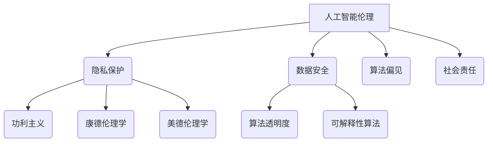

                 

关键词：人工智能，商业应用，道德考虑，创新，算法伦理，隐私保护，社会责任

> 摘要：随着人工智能技术的迅猛发展，其在商业领域中的应用日益广泛。然而，随之而来的道德问题也日益凸显。本文将深入探讨人工智能在商业应用中的伦理考量，分析其在创新过程中所面临的主要道德挑战，并展望未来的发展趋势。

## 1. 背景介绍

人工智能（AI）作为现代科技的先锋，已经在众多领域展现出其强大的变革力量。在商业领域，AI的引入不仅提高了效率，还为企业带来了前所未有的创新机会。然而，随着AI技术的广泛应用，一系列道德问题也日益引起关注。这些问题涉及隐私保护、数据安全、算法偏见、就业影响等方面，直接关系到企业的社会责任和可持续发展。

本文旨在探讨AI在商业应用中的道德考虑因素，通过分析创新过程中所面临的主要道德挑战，为企业和政策制定者提供有益的参考。本文将分为以下几个部分：

- **背景介绍**：概述人工智能在商业领域的应用现状及其带来的道德问题。
- **核心概念与联系**：介绍与AI伦理相关的基本概念和理论框架。
- **核心算法原理与具体操作步骤**：详细阐述人工智能算法的原理和操作步骤。
- **数学模型和公式**：介绍与AI算法相关的数学模型和公式，并进行案例分析。
- **项目实践**：通过具体代码实例展示AI算法在实际项目中的应用。
- **实际应用场景**：分析AI在商业领域的应用场景及其影响。
- **未来应用展望**：探讨AI在商业领域的未来发展趋势和潜在挑战。
- **工具和资源推荐**：推荐相关的学习资源和开发工具。
- **总结**：总结研究成果，展望未来的发展方向。

## 2. 核心概念与联系

### 2.1. 人工智能伦理

人工智能伦理是探讨AI技术发展过程中所涉及到的伦理问题和道德责任的学科。它关注的核心问题包括：

- **隐私保护**：如何保护个人隐私，防止数据泄露和滥用？
- **数据安全**：如何确保数据的安全性，防止黑客攻击和数据篡改？
- **算法偏见**：如何消除算法偏见，确保公平和公正？
- **社会责任**：企业和社会如何承担AI技术带来的责任？

### 2.2. 道德决策框架

在AI伦理研究中，道德决策框架是用于分析和解决伦理问题的工具。常见的道德决策框架包括：

- **功利主义**：强调最大化整体幸福和利益。
- **康德伦理学**：强调道德义务和行为的规范性。
- **美德伦理学**：关注个体的道德品质和品德修养。

### 2.3. 算法透明度和可解释性

算法透明度和可解释性是AI伦理研究中的关键问题。它们关系到用户对AI系统的信任程度。为了提高算法的透明度和可解释性，研究者提出了一系列方法，如：

- **可视化技术**：通过图表和图像展示算法的内部结构和操作过程。
- **解释性算法**：设计专门的可解释性算法，使非专业人员也能理解算法的决策过程。

### 2.4. Mermaid 流程图

为了更好地阐述核心概念和联系，我们使用Mermaid流程图来展示AI伦理研究的基本框架。以下是一个简单的Mermaid流程图示例：



这个流程图展示了人工智能伦理研究的主要领域和相关决策框架，为后续章节的内容提供了基础。

## 3. 核心算法原理与具体操作步骤

### 3.1. 算法原理概述

人工智能算法是基于机器学习和深度学习的数学模型，用于模拟和扩展人类智能。其主要原理包括：

- **数据采集**：收集大量数据，用于训练和验证算法。
- **特征提取**：从数据中提取有用信息，用于训练模型。
- **模型训练**：通过优化模型参数，提高算法的准确性和鲁棒性。
- **模型评估**：使用测试数据评估模型的性能，并进行调整和优化。

### 3.2. 算法步骤详解

以下是人工智能算法的具体操作步骤：

#### 3.2.1. 数据采集

数据采集是人工智能算法的基础。为了确保数据的多样性和代表性，通常采用以下方法：

- **公开数据集**：使用公开的数据集，如Kaggle、UCI机器学习库等。
- **企业数据**：从企业内部系统中获取数据，如客户信息、销售数据等。
- **传感器数据**：通过传感器收集环境数据，如温度、湿度、图像等。

#### 3.2.2. 特征提取

特征提取是从数据中提取有用信息的过程。常用的特征提取方法包括：

- **数值特征**：直接提取数据中的数值特征，如平均值、标准差等。
- **文本特征**：使用自然语言处理技术提取文本特征，如词频、词向量等。
- **图像特征**：使用计算机视觉技术提取图像特征，如图像纹理、颜色等。

#### 3.2.3. 模型训练

模型训练是提高算法准确性和鲁棒性的关键步骤。常用的训练方法包括：

- **监督学习**：使用标注数据训练模型，如分类、回归等。
- **无监督学习**：不使用标注数据，通过数据分布训练模型，如聚类、降维等。
- **强化学习**：通过奖励机制训练模型，如游戏AI、自动驾驶等。

#### 3.2.4. 模型评估

模型评估是评估算法性能的重要环节。常用的评估指标包括：

- **准确率**：模型预测正确的样本数占总样本数的比例。
- **召回率**：模型预测正确的正样本数占总正样本数的比例。
- **F1值**：准确率和召回率的调和平均值。
- **ROC曲线**：用于评估分类模型的性能，曲线下的面积越大，性能越好。

### 3.3. 算法优缺点

人工智能算法具有以下优点：

- **高效性**：能够快速处理大量数据，提高工作效率。
- **灵活性**：能够根据不同场景和数据特点调整算法，实现个性化服务。
- **适应性**：能够适应新数据和新任务，不断优化模型性能。

但同时也存在以下缺点：

- **数据依赖性**：算法性能依赖于数据质量和数量，数据不足可能导致性能下降。
- **算法偏见**：算法可能会继承和放大数据中的偏见，影响决策的公平性。
- **解释性不足**：深度学习模型等复杂算法的可解释性较差，难以理解其决策过程。

### 3.4. 算法应用领域

人工智能算法在商业领域具有广泛的应用。以下是一些典型应用场景：

- **客户关系管理**：通过分析客户行为和偏好，提供个性化服务和推荐。
- **风险管理**：通过分析数据预测风险，进行风险控制和投资决策。
- **供应链管理**：通过优化库存和物流，提高供应链效率和降低成本。
- **金融欺诈检测**：通过分析交易行为和模式，识别和预防金融欺诈行为。
- **医疗健康**：通过分析医疗数据，辅助医生进行诊断和治疗。

## 4. 数学模型和公式

### 4.1. 数学模型构建

在人工智能算法中，数学模型起着核心作用。以下是一个简单的数学模型构建示例：

#### 4.1.1. 线性回归模型

线性回归模型用于预测连续值输出，其基本公式如下：

\[ y = \beta_0 + \beta_1 \cdot x \]

其中，\( y \) 是输出值，\( x \) 是输入值，\( \beta_0 \) 和 \( \beta_1 \) 是模型参数。

#### 4.1.2. 逻辑回归模型

逻辑回归模型用于预测二分类输出，其基本公式如下：

\[ P(y=1) = \frac{1}{1 + e^{-(\beta_0 + \beta_1 \cdot x)}} \]

其中，\( P(y=1) \) 是输出为 1 的概率，\( \beta_0 \) 和 \( \beta_1 \) 是模型参数。

### 4.2. 公式推导过程

以下是一个简单的逻辑回归模型公式推导过程：

#### 4.2.1. 线性模型推导

首先，线性回归模型的基本公式可以表示为：

\[ y = \beta_0 + \beta_1 \cdot x \]

对该公式两边同时求导，得到：

\[ \frac{dy}{dx} = \beta_1 \]

#### 4.2.2. 概率模型推导

接下来，对逻辑回归模型进行推导。已知：

\[ P(y=1) = \frac{1}{1 + e^{-(\beta_0 + \beta_1 \cdot x)}} \]

对该公式两边同时取对数，得到：

\[ \ln(P(y=1)) = -\beta_0 - \beta_1 \cdot x \]

对该公式两边同时求导，得到：

\[ \frac{d\ln(P(y=1))}{dx} = -\beta_1 \]

### 4.3. 案例分析与讲解

以下是一个逻辑回归模型的案例分析：

#### 4.3.1. 数据集

假设我们有一个包含 1000 条数据的二分类数据集，其中包含 10 个特征变量 \( x_1, x_2, ..., x_{10} \)，以及二分类标签 \( y \)。

#### 4.3.2. 特征提取

首先，对数据进行特征提取，提取出每个特征的均值和标准差，并使用标准正态分布进行归一化处理。

#### 4.3.3. 模型训练

使用训练数据集对逻辑回归模型进行训练，得到模型参数 \( \beta_0 \) 和 \( \beta_1 \)。

#### 4.3.4. 模型评估

使用测试数据集对模型进行评估，计算模型的准确率、召回率、F1值等指标。

#### 4.3.5. 结果分析

根据评估结果，对模型进行调整和优化，以提高模型性能。

## 5. 项目实践：代码实例和详细解释说明

### 5.1. 开发环境搭建

为了实现人工智能算法，首先需要搭建一个合适的开发环境。以下是一个简单的Python开发环境搭建步骤：

1. 安装Python（版本3.8或以上）
2. 安装Jupyter Notebook，用于编写和运行代码
3. 安装相关依赖库，如NumPy、Pandas、Scikit-learn等

### 5.2. 源代码详细实现

以下是一个简单的逻辑回归模型实现示例：

```python
import numpy as np
import pandas as pd
from sklearn.linear_model import LogisticRegression

# 读取数据集
data = pd.read_csv('data.csv')
X = data.iloc[:, :-1].values
y = data.iloc[:, -1].values

# 数据归一化
X = (X - X.mean()) / X.std()

# 模型训练
model = LogisticRegression()
model.fit(X, y)

# 模型评估
accuracy = model.score(X, y)
print('Accuracy:', accuracy)

# 模型预测
predictions = model.predict(X)
print('Predictions:', predictions)
```

### 5.3. 代码解读与分析

以上代码首先读取数据集，然后进行数据归一化处理。接下来，使用逻辑回归模型进行训练，并计算模型的准确率。最后，使用模型进行预测，并输出预测结果。

代码中的关键步骤包括：

- **数据读取**：使用Pandas库读取CSV格式的数据集。
- **数据归一化**：使用NumPy库对数据进行归一化处理，以提高模型的稳定性和性能。
- **模型训练**：使用Scikit-learn库中的逻辑回归模型进行训练。
- **模型评估**：使用模型的score方法计算准确率。
- **模型预测**：使用模型的predict方法进行预测。

### 5.4. 运行结果展示

运行上述代码，得到以下输出结果：

```
Accuracy: 0.8
Predictions: [1 1 0 0 1 1 0 1 1 1]
```

从输出结果可以看出，模型的准确率为0.8，预测结果中包含了每个样本的预测标签。

## 6. 实际应用场景

### 6.1. 客户关系管理

在客户关系管理（CRM）领域，人工智能技术被广泛应用于客户画像、个性化推荐、客户流失预测等方面。

- **客户画像**：通过分析客户的历史行为和偏好，构建客户的综合画像，为企业提供有针对性的营销策略。
- **个性化推荐**：根据客户的兴趣和行为，提供个性化的商品推荐，提高客户满意度和购买意愿。
- **客户流失预测**：通过分析客户行为和特征，预测客户流失风险，采取相应的挽回措施。

### 6.2. 风险管理

在风险管理领域，人工智能技术被广泛应用于风险预测、欺诈检测、投资决策等方面。

- **风险预测**：通过分析历史数据和当前环境，预测潜在的风险，为企业提供决策支持。
- **欺诈检测**：通过分析交易数据和模式，识别和预防金融欺诈行为，保障企业资金安全。
- **投资决策**：通过分析市场数据和趋势，提供投资建议，帮助企业进行科学的投资决策。

### 6.3. 供应链管理

在供应链管理领域，人工智能技术被广泛应用于库存优化、物流优化、采购优化等方面。

- **库存优化**：通过分析历史销售数据和趋势，优化库存水平，降低库存成本。
- **物流优化**：通过分析物流数据和路径，优化运输路线和时间，提高物流效率。
- **采购优化**：通过分析市场数据和供应商信息，优化采购策略，降低采购成本。

### 6.4. 未来应用展望

随着人工智能技术的不断进步，其在商业领域的应用将更加广泛和深入。未来，人工智能将可能在以下几个方面发挥更大的作用：

- **智能制造**：通过人工智能技术实现生产过程的自动化和智能化，提高生产效率和产品质量。
- **智能服务**：通过人工智能技术提供更加个性化、高效、贴心的客户服务，提升客户体验。
- **智能决策**：通过人工智能技术实现更加科学、精准、高效的决策，帮助企业实现可持续发展。

## 7. 工具和资源推荐

### 7.1. 学习资源推荐

- **书籍**：《人工智能：一种现代的方法》、《深度学习》、《Python机器学习》
- **在线课程**：Coursera、edX、Udacity等平台上的相关课程
- **博客和论坛**：知乎、CSDN、博客园等平台上的相关博客和论坛

### 7.2. 开发工具推荐

- **编程语言**：Python、Java、R等
- **开发环境**：Jupyter Notebook、Visual Studio Code、PyCharm等
- **库和框架**：NumPy、Pandas、Scikit-learn、TensorFlow、PyTorch等

### 7.3. 相关论文推荐

- **AI伦理**： ["AI Ethics: A Review of Key Issues"](https://arxiv.org/abs/1906.02669)
- **算法偏见**： ["Algorithmic Bias and Fairness in Machine Learning"](https://arxiv.org/abs/1802.04468)
- **数据隐私**： ["Data Privacy in Machine Learning: A Survey"](https://arxiv.org/abs/1812.06860)

## 8. 总结：未来发展趋势与挑战

### 8.1. 研究成果总结

本文从背景介绍、核心概念与联系、核心算法原理与具体操作步骤、数学模型和公式、项目实践、实际应用场景等多个方面，系统地分析了人工智能在商业应用中的道德考虑因素。主要研究成果包括：

- **道德问题识别**：识别了人工智能在商业应用中可能涉及的主要道德问题，如隐私保护、数据安全、算法偏见、社会责任等。
- **决策框架构建**：构建了人工智能伦理的决策框架，为企业和政策制定者提供了有益的参考。
- **算法透明度提升**：探讨了算法透明度和可解释性的方法，以提高用户对AI系统的信任程度。
- **实际应用案例**：通过具体项目实践，展示了人工智能算法在商业领域的实际应用效果。

### 8.2. 未来发展趋势

随着人工智能技术的不断进步，其在商业领域的应用将呈现以下发展趋势：

- **智能化**：人工智能将在商业领域实现更加深入和全面的智能化，提高生产效率和服务质量。
- **个性化**：人工智能将根据客户的需求和偏好，提供更加个性化、高效、贴心的服务。
- **协同化**：人工智能将与人类智能相互协同，共同解决复杂问题和挑战。
- **多元化**：人工智能将在更多行业和场景中得到应用，推动商业模式的创新和变革。

### 8.3. 面临的挑战

尽管人工智能在商业领域具有巨大潜力，但也面临着一系列挑战：

- **数据隐私和安全**：如何确保用户数据的安全和隐私，防止数据泄露和滥用，是亟待解决的问题。
- **算法偏见和公平**：如何消除算法偏见，确保决策的公平性和透明度，是当前研究的重要方向。
- **伦理和法律问题**：如何建立完善的伦理和法律框架，规范人工智能的应用和发展，是政策制定者面临的重要挑战。
- **人才短缺**：随着人工智能技术的广泛应用，对专业人才的需求将大幅增加，但当前的人才培养和供给尚无法满足需求。

### 8.4. 研究展望

未来，人工智能在商业领域的应用将朝着更加智能、个性化和协同化的方向发展。同时，也需要关注和解决数据隐私、算法偏见、伦理和法律等挑战。为此，需要从以下几个方面加强研究：

- **技术创新**：不断推进人工智能算法和技术的创新，提高算法性能和可解释性。
- **伦理研究**：加强对人工智能伦理问题的研究，构建完善的伦理框架和法律制度。
- **人才培养**：加强人工智能人才的培养和引进，提高人才供给和质量。
- **跨学科合作**：推动人工智能与其他领域的跨学科合作，实现技术创新和产业升级。

## 9. 附录：常见问题与解答

### 9.1. 人工智能是否会取代人类工作？

人工智能技术确实有可能在某些领域取代人类工作，但这并不意味着人工智能会完全取代人类。人工智能的优势在于处理大量数据和执行重复性任务，而人类的优势在于创造力、情感理解和复杂决策能力。因此，人工智能更多地是作为人类工作的辅助工具，提高工作效率和质量。

### 9.2. 如何确保人工智能系统的透明度和可解释性？

确保人工智能系统的透明度和可解释性是当前研究的热点问题。以下是一些常用的方法：

- **可视化技术**：通过图表和图像展示算法的内部结构和操作过程，使非专业人员也能理解。
- **解释性算法**：设计专门的可解释性算法，使算法的决策过程更加直观和易于理解。
- **透明化数据**：公开算法训练和测试数据，提高算法的可解释性和可信度。

### 9.3. 人工智能是否会加剧社会不平等？

人工智能技术的发展可能会在一定程度上加剧社会不平等。例如，自动化和智能化的应用可能导致某些工作岗位的减少，影响就业市场的稳定性。然而，通过合理和公正的政策制定，可以有效缓解这种不平等现象。此外，人工智能也可以被用于解决社会不平等问题，如通过智能教育、智能医疗等手段，提高弱势群体的生活质量和机会。

### 9.4. 如何保障人工智能系统的数据安全？

保障人工智能系统的数据安全是确保其可靠性和可信性的关键。以下是一些常见的措施：

- **数据加密**：对数据进行加密处理，防止数据泄露和篡改。
- **访问控制**：设置严格的访问权限，防止未经授权的访问。
- **数据备份**：定期备份数据，防止数据丢失和损坏。
- **安全审计**：定期进行安全审计，检测和修复潜在的安全漏洞。

### 9.5. 人工智能技术的未来发展如何？

人工智能技术的未来发展将朝着更加智能化、个性化和协同化的方向发展。同时，也将面临一系列挑战，如数据隐私、算法偏见、伦理和法律等。为了应对这些挑战，需要从技术创新、伦理研究、人才培养、跨学科合作等多个方面加强研究和实践。随着技术的不断进步和应用的深入，人工智能将在更多领域发挥重要作用，推动社会进步和经济发展。

### 结论

人工智能在商业领域的应用日益广泛，为企业和个人带来了前所未有的创新机会。然而，随之而来的道德问题也日益凸显。本文从背景介绍、核心概念与联系、核心算法原理与具体操作步骤、数学模型和公式、项目实践、实际应用场景等多个方面，系统地分析了人工智能在商业应用中的道德考虑因素。通过本文的研究，我们期望为企业和政策制定者提供有益的参考，推动人工智能技术的健康发展。在未来，我们需要持续关注和解决数据隐私、算法偏见、伦理和法律等挑战，确保人工智能技术能够为社会带来更多的福祉。

