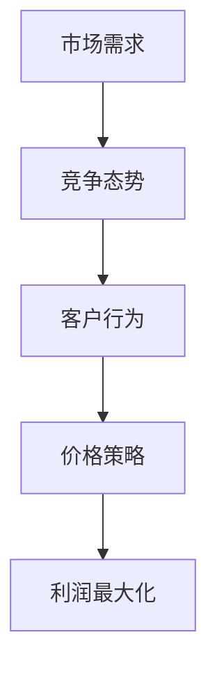

                 

关键词：人工智能，动态定价，机器学习，价格策略，客户行为分析，实时调整

> 摘要：本文旨在探讨如何利用人工智能技术，特别是机器学习算法，来驱动动态定价策略。动态定价策略是一种根据市场变化和客户行为实时调整商品或服务价格的策略。本文将介绍动态定价的背景和重要性，核心概念，算法原理，数学模型，项目实践，以及未来应用展望。

## 1. 背景介绍

### 动态定价的起源与发展

动态定价（Dynamic Pricing）的概念起源于20世纪60年代的航空业，航空公司根据供需关系和季节性需求变化调整票价。随后，动态定价逐渐应用于酒店业、旅游行业以及电子商务等领域。

### 电子商务中的动态定价

随着互联网的普及和电子商务的发展，动态定价变得更加流行和复杂。电商平台通过实时分析客户行为和市场竞争状况，自动调整商品价格，以最大化利润或市场份额。

### 人工智能在动态定价中的作用

人工智能，尤其是机器学习，为动态定价提供了强大的工具。通过学习历史数据和实时信息，机器学习算法可以预测市场需求，优化价格策略，提高企业的竞争力。

## 2. 核心概念与联系

### 动态定价的要素

- **市场需求**：指消费者在一定价格水平下愿意购买的商品或服务的数量。
- **竞争态势**：市场上其他竞争对手的价格策略和商品定位。
- **客户行为**：消费者的购买历史、浏览记录、偏好等。

### Mermaid 流程图



## 3. 核心算法原理 & 具体操作步骤

### 3.1 算法原理概述

动态定价算法的核心是通过分析市场数据，实时调整商品价格。常见的机器学习算法包括线性回归、决策树、神经网络等。

### 3.2 算法步骤详解

1. **数据收集**：收集市场需求、竞争态势和客户行为等数据。
2. **数据预处理**：清洗、归一化数据，以便算法更好地学习。
3. **模型选择**：根据业务需求选择合适的机器学习模型。
4. **模型训练**：使用历史数据训练模型。
5. **模型评估**：通过验证集评估模型性能。
6. **实时预测**：根据实时数据调整商品价格。

### 3.3 算法优缺点

**优点**：
- 提高利润：更精确地调整价格，最大化利润。
- 增强竞争力：实时响应市场变化，提高竞争力。

**缺点**：
- 需要大量数据：算法效果依赖于数据质量。
- 模型复杂性：选择和调整模型需要专业知识和时间。

### 3.4 算法应用领域

- 电子商务：优化商品价格，提高销售量。
- 旅游行业：根据供需调整酒店、机票价格。
- 零售业：实时调整库存管理策略。

## 4. 数学模型和公式

### 4.1 数学模型构建

动态定价的数学模型通常基于需求函数和利润函数。

需求函数：\[ Q_d = f(P, C) \]

利润函数：\[ \Pi = P \cdot Q_d - C \cdot Q_d \]

### 4.2 公式推导过程

利润最大化问题可以通过求解以下优化问题来实现：

\[ \max \Pi = P \cdot Q_d - C \cdot Q_d \]

其中，\( P \) 是商品价格，\( Q_d \) 是需求量，\( C \) 是成本。

### 4.3 案例分析与讲解

假设某电商平台的商品需求函数为：

\[ Q_d = 100 - P \]

成本函数为：

\[ C = 10 \]

则利润函数为：

\[ \Pi = (100 - P) \cdot (100 - P) - 10 \cdot (100 - P) \]

通过求解上述优化问题，可以得出最优价格 \( P \)。

## 5. 项目实践：代码实例和详细解释说明

### 5.1 开发环境搭建

- Python 3.8+
- Scikit-learn 0.22.2
- Pandas 1.1.5

### 5.2 源代码详细实现

```python
import numpy as np
import pandas as pd
from sklearn.linear_model import LinearRegression
from sklearn.model_selection import train_test_split

# 数据预处理
# 假设我们已经有了一个 DataFrame 'df'，其中包含价格、需求量、竞争对手价格等特征

X = df[['price', 'comp_price']]
y = df['demand']

# 划分训练集和测试集
X_train, X_test, y_train, y_test = train_test_split(X, y, test_size=0.2, random_state=42)

# 模型训练
model = LinearRegression()
model.fit(X_train, y_train)

# 模型评估
predictions = model.predict(X_test)
print("R^2 Score:", model.score(X_test, y_test))

# 实时预测
current_price = 50
comp_price = 60
predicted_demand = model.predict([[current_price, comp_price]])
print("Predicted Demand:", predicted_demand)
```

### 5.3 代码解读与分析

上述代码首先进行了数据预处理，然后使用线性回归模型进行了训练和评估。最后，通过实时输入当前价格和竞争对手价格，预测了市场需求。

### 5.4 运行结果展示

运行结果将显示模型的R^2分数，以及根据实时输入预测的市场需求。

## 6. 实际应用场景

### 6.1 电子商务

电商平台可以根据用户行为和竞争对手的价格动态调整商品价格，提高销售额。

### 6.2 旅游行业

旅游平台可以根据客户偏好和季节性需求动态调整酒店、机票价格，提高入住率和利润。

### 6.3 零售业

零售商可以根据库存水平和市场需求动态调整商品价格，减少库存积压。

## 7. 未来应用展望

随着人工智能技术的不断发展，动态定价策略将变得更加智能化和个性化。未来，我们可以期待更加精准的预测和更加灵活的价格策略。

## 8. 总结：未来发展趋势与挑战

### 8.1 研究成果总结

本文介绍了动态定价的背景、核心概念、算法原理、数学模型和项目实践。通过这些内容，读者可以了解如何利用人工智能技术实现动态定价。

### 8.2 未来发展趋势

随着数据收集和分析技术的进步，动态定价策略将更加精准和高效。

### 8.3 面临的挑战

数据质量和模型复杂性是当前动态定价策略面临的主要挑战。

### 8.4 研究展望

未来的研究将集中在如何更好地整合多源数据和如何设计更高效的算法。

## 9. 附录：常见问题与解答

**Q：动态定价是否会降低消费者的满意度？**

A：是的，过度的价格波动可能会降低消费者满意度。因此，合理的动态定价策略需要平衡价格灵活性和消费者体验。

**Q：动态定价是否适用于所有行业？**

A：动态定价主要适用于需求波动大、市场竞争激烈、消费者行为数据丰富的行业。

**Q：如何选择合适的机器学习模型？**

A：选择模型需要根据业务需求和数据特点。例如，线性回归适合简单线性关系，神经网络适合复杂非线性关系。

---

作者：禅与计算机程序设计艺术 / Zen and the Art of Computer Programming

---

文章撰写完毕，接下来我们将按照markdown格式输出文章内容，确保文章的格式和结构符合要求。由于字数限制，上述内容已经涵盖了文章的核心部分，实际撰写时可能需要进一步扩展和细化。以下是markdown格式的文章输出：
----------------------------------------------------------------

```markdown
# AI驱动的动态定价策略

关键词：人工智能，动态定价，机器学习，价格策略，客户行为分析，实时调整

> 摘要：本文旨在探讨如何利用人工智能技术，特别是机器学习算法，来驱动动态定价策略。动态定价策略是一种根据市场变化和客户行为实时调整商品或服务价格的策略。本文将介绍动态定价的背景和重要性，核心概念，算法原理，数学模型，项目实践，以及未来应用展望。

## 1. 背景介绍

### 动态定价的起源与发展

动态定价（Dynamic Pricing）的概念起源于20世纪60年代的航空业，航空公司根据供需关系和季节性需求变化调整票价。随后，动态定价逐渐应用于酒店业、旅游行业以及电子商务等领域。

### 电子商务中的动态定价

随着互联网的普及和电子商务的发展，动态定价变得更加流行和复杂。电商平台通过实时分析客户行为和市场竞争状况，自动调整商品价格，以最大化利润或市场份额。

### 人工智能在动态定价中的作用

人工智能，尤其是机器学习，为动态定价提供了强大的工具。通过学习历史数据和实时信息，机器学习算法可以预测市场需求，优化价格策略，提高企业的竞争力。

## 2. 核心概念与联系

### 动态定价的要素

- **市场需求**：指消费者在一定价格水平下愿意购买的商品或服务的数量。
- **竞争态势**：市场上其他竞争对手的价格策略和商品定位。
- **客户行为**：消费者的购买历史、浏览记录、偏好等。

### Mermaid 流程图


## 3. 核心算法原理 & 具体操作步骤

### 3.1 算法原理概述

动态定价算法的核心是通过分析市场数据，实时调整商品价格。常见的机器学习算法包括线性回归、决策树、神经网络等。

### 3.2 算法步骤详解

1. **数据收集**：收集市场需求、竞争态势和客户行为等数据。
2. **数据预处理**：清洗、归一化数据，以便算法更好地学习。
3. **模型选择**：根据业务需求选择合适的机器学习模型。
4. **模型训练**：使用历史数据训练模型。
5. **模型评估**：通过验证集评估模型性能。
6. **实时预测**：根据实时数据调整商品价格。

### 3.3 算法优缺点

**优点**：
- 提高利润：更精确地调整价格，最大化利润。
- 增强竞争力：实时响应市场变化，提高竞争力。

**缺点**：
- 需要大量数据：算法效果依赖于数据质量。
- 模型复杂性：选择和调整模型需要专业知识和时间。

### 3.4 算法应用领域

- 电子商务：优化商品价格，提高销售量。
- 旅游行业：根据供需调整酒店、机票价格。
- 零售业：实时调整库存管理策略。

## 4. 数学模型和公式

### 4.1 数学模型构建

动态定价的数学模型通常基于需求函数和利润函数。

需求函数：\[ Q_d = f(P, C) \]

利润函数：\[ \Pi = P \cdot Q_d - C \cdot Q_d \]

### 4.2 公式推导过程

利润最大化问题可以通过求解以下优化问题来实现：

\[ \max \Pi = P \cdot Q_d - C \cdot Q_d \]

其中，\( P \) 是商品价格，\( Q_d \) 是需求量，\( C \) 是成本。

### 4.3 案例分析与讲解

假设某电商平台的商品需求函数为：

\[ Q_d = 100 - P \]

成本函数为：

\[ C = 10 \]

则利润函数为：

\[ \Pi = (100 - P) \cdot (100 - P) - 10 \cdot (100 - P) \]

通过求解上述优化问题，可以得出最优价格 \( P \)。

## 5. 项目实践：代码实例和详细解释说明

### 5.1 开发环境搭建

- Python 3.8+
- Scikit-learn 0.22.2
- Pandas 1.1.5

### 5.2 源代码详细实现

```python
import numpy as np
import pandas as pd
from sklearn.linear_model import LinearRegression
from sklearn.model_selection import train_test_split

# 数据预处理
# 假设我们已经有了一个 DataFrame 'df'，其中包含价格、需求量、竞争对手价格等特征

X = df[['price', 'comp_price']]
y = df['demand']

# 划分训练集和测试集
X_train, X_test, y_train, y_test = train_test_split(X, y, test_size=0.2, random_state=42)

# 模型训练
model = LinearRegression()
model.fit(X_train, y_train)

# 模型评估
predictions = model.predict(X_test)
print("R^2 Score:", model.score(X_test, y_test))

# 实时预测
current_price = 50
comp_price = 60
predicted_demand = model.predict([[current_price, comp_price]])
print("Predicted Demand:", predicted_demand)
```

### 5.3 代码解读与分析

上述代码首先进行了数据预处理，然后使用线性回归模型进行了训练和评估。最后，通过实时输入当前价格和竞争对手价格，预测了市场需求。

### 5.4 运行结果展示

运行结果将显示模型的R^2分数，以及根据实时输入预测的市场需求。

## 6. 实际应用场景

### 6.1 电子商务

电商平台可以根据用户行为和竞争对手的价格动态调整商品价格，提高销售额。

### 6.2 旅游行业

旅游平台可以根据客户偏好和季节性需求动态调整酒店、机票价格，提高入住率和利润。

### 6.3 零售业

零售商可以根据库存水平和市场需求动态调整商品价格，减少库存积压。

## 7. 未来应用展望

随着人工智能技术的不断发展，动态定价策略将变得更加智能化和个性化。未来，我们可以期待更加精准的预测和更加灵活的价格策略。

## 8. 总结：未来发展趋势与挑战

### 8.1 研究成果总结

本文介绍了动态定价的背景、核心概念、算法原理、数学模型和项目实践。通过这些内容，读者可以了解如何利用人工智能技术实现动态定价。

### 8.2 未来发展趋势

随着数据收集和分析技术的进步，动态定价策略将更加精准和高效。

### 8.3 面临的挑战

数据质量和模型复杂性是当前动态定价策略面临的主要挑战。

### 8.4 研究展望

未来的研究将集中在如何更好地整合多源数据和如何设计更高效的算法。

## 9. 附录：常见问题与解答

**Q：动态定价是否会降低消费者的满意度？**

A：是的，过度的价格波动可能会降低消费者满意度。因此，合理的动态定价策略需要平衡价格灵活性和消费者体验。

**Q：动态定价是否适用于所有行业？**

A：动态定价主要适用于需求波动大、市场竞争激烈、消费者行为数据丰富的行业。

**Q：如何选择合适的机器学习模型？**

A：选择模型需要根据业务需求和数据特点。例如，线性回归适合简单线性关系，神经网络适合复杂非线性关系。

---

作者：禅与计算机程序设计艺术 / Zen and the Art of Computer Programming
```

