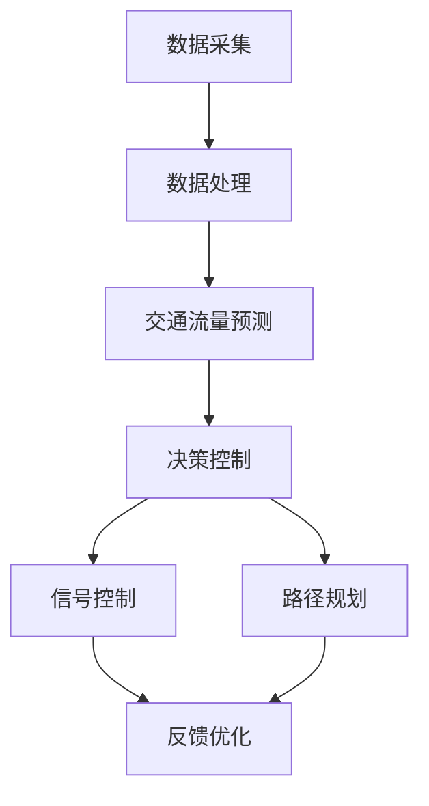

                 

关键词：智能交通系统，AI技术，规划与控制，交通流量优化，数据驱动，机器学习，深度学习，交通信号控制，实时监测，路径规划，交通管理，数据挖掘，算法优化。

> 摘要：本文将深入探讨AI驱动的智能交通系统在交通规划与控制中的应用。通过分析现有的交通问题，介绍AI技术如何通过数据驱动和机器学习算法提高交通管理效率，优化交通流量，提升道路通行能力，并展望其未来的发展方向与挑战。

## 1. 背景介绍

随着城市化进程的加快和汽车保有量的增加，全球各地的交通问题日益突出。交通拥堵、交通事故频发、空气污染严重等问题不仅影响了人们的出行体验，还对社会经济发展带来了诸多负面影响。传统的交通管理模式依赖于人工和经验，难以适应快速变化的交通状况，亟需引入智能化手段进行交通管理和优化。

近年来，人工智能（AI）技术的发展为智能交通系统提供了新的解决方案。通过大数据、机器学习和深度学习等技术，AI能够对交通流量进行实时监测、预测和优化，从而提高交通效率、减少交通事故、缓解环境污染。本篇文章旨在介绍AI驱动的智能交通系统的核心概念、算法原理及其在交通规划与控制中的应用，并探讨其未来发展的趋势与挑战。

## 2. 核心概念与联系

### 2.1. 智能交通系统的核心概念

智能交通系统（Intelligent Transportation System, ITS）是一个综合运用信息技术、数据通信传输技术、电子传感技术、电子控制技术以及计算机处理技术，对现代城市交通系统进行全面监管、指挥和调控的系统。其核心概念包括：

1. **数据采集与监测**：通过传感器、摄像头等设备实时收集交通流量、道路状态等数据。
2. **信息处理与预测**：利用机器学习算法对交通数据进行分析和处理，预测交通状况。
3. **决策与控制**：根据预测结果，通过智能算法进行交通信号控制、路径规划等决策。
4. **反馈与优化**：通过不断收集和分析数据，优化交通管理系统，提高交通效率。

### 2.2. AI技术在智能交通系统中的应用

AI技术在智能交通系统中扮演着至关重要的角色，主要包括：

1. **交通流量预测**：利用时间序列分析和机器学习算法，预测未来某一时段的交通流量。
2. **路径规划**：根据实时交通状况，为驾驶员提供最优路径。
3. **信号控制优化**：通过优化交通信号灯的时间设置，减少交通拥堵。
4. **交通事故预测与防范**：通过分析历史交通事故数据，预测可能发生的事故并提前采取措施。
5. **智能停车管理**：利用图像识别技术，实时监控停车位状态，指导驾驶员停车。

### 2.3. Mermaid流程图

以下是一个简化的智能交通系统流程图，展示了数据采集、处理、决策和反馈的过程：



## 3. 核心算法原理 & 具体操作步骤

### 3.1. 算法原理概述

智能交通系统中的核心算法主要分为数据采集与处理算法、交通流量预测算法和决策控制算法。以下将分别介绍这些算法的基本原理。

#### 3.1.1. 数据采集与处理算法

数据采集与处理算法主要利用传感器和摄像头等设备，收集交通流量、道路状态等数据。这些数据经过预处理，如滤波、去噪等操作，然后被传输到数据中心进行处理。

#### 3.1.2. 交通流量预测算法

交通流量预测算法基于历史交通数据，利用时间序列分析、回归分析等方法，预测未来某一时段的交通流量。常用的算法包括ARIMA模型、LSTM网络等。

#### 3.1.3. 决策控制算法

决策控制算法根据交通流量预测结果，进行交通信号控制和路径规划。常用的算法包括基于规则的方法、优化算法（如遗传算法、粒子群优化等）和深度学习算法（如卷积神经网络、循环神经网络等）。

### 3.2. 算法步骤详解

#### 3.2.1. 数据采集与处理算法

1. **数据采集**：通过传感器和摄像头收集交通流量、道路状态等数据。
2. **数据预处理**：对采集到的数据进行分析，提取有用的特征，如车辆速度、流量密度等。
3. **数据传输**：将预处理后的数据传输到数据中心。

#### 3.2.2. 交通流量预测算法

1. **数据收集**：收集历史交通数据，包括时间、地点、流量等。
2. **特征工程**：对数据进行预处理，提取特征。
3. **模型训练**：使用时间序列分析或机器学习算法（如LSTM网络）进行模型训练。
4. **流量预测**：利用训练好的模型，预测未来某一时段的交通流量。

#### 3.2.3. 决策控制算法

1. **流量预测**：使用交通流量预测算法，预测未来某一时段的交通流量。
2. **决策制定**：根据预测结果，制定交通信号控制策略或路径规划策略。
3. **实施控制**：执行决策，调整交通信号灯时间设置或提供最优路径。

### 3.3. 算法优缺点

#### 3.3.1. 数据采集与处理算法

**优点**：数据采集与处理算法能够实时获取交通数据，为后续分析提供基础。

**缺点**：数据采集和预处理过程中，容易受到噪声和环境因素的影响。

#### 3.3.2. 交通流量预测算法

**优点**：交通流量预测算法能够预测未来交通流量，为交通管理和控制提供依据。

**缺点**：预测准确性受到数据质量和模型选择的影响。

#### 3.3.3. 决策控制算法

**优点**：决策控制算法能够根据实时交通状况，优化交通信号控制或路径规划。

**缺点**：算法复杂度高，实施难度大，需要大量计算资源和专业知识。

### 3.4. 算法应用领域

智能交通系统的核心算法广泛应用于以下几个方面：

1. **交通信号控制**：通过优化交通信号灯时间设置，减少交通拥堵。
2. **路径规划**：为驾驶员提供最优路径，减少出行时间。
3. **交通事故预测与防范**：通过分析历史交通事故数据，预测可能发生的事故并提前采取措施。
4. **智能停车管理**：实时监控停车位状态，提高停车效率。

## 4. 数学模型和公式 & 详细讲解 & 举例说明

### 4.1. 数学模型构建

在智能交通系统中，常见的数学模型包括时间序列模型和优化模型。以下分别介绍这些模型的基本概念和公式。

#### 4.1.1. 时间序列模型

时间序列模型用于分析交通流量数据的时间规律，常用的模型包括ARIMA模型和LSTM网络。

**ARIMA模型**：

- **公式**：$$X_t = c + \phi_1 X_{t-1} + \phi_2 X_{t-2} + \cdots + \phi_p X_{t-p} + \theta_1 e_{t-1} + \theta_2 e_{t-2} + \cdots + \theta_q e_{t-q}$$
- **参数**：$p$（自回归阶数），$d$（差分阶数），$q$（移动平均阶数）
- **优点**：适用于线性时间序列数据的预测。
- **缺点**：对于非线性时间序列数据的预测效果较差。

**LSTM网络**：

- **公式**：$$h_t = \sigma(W_h h_{t-1} + W_x x_t + b_h)$$
- **参数**：$W_h$（输入权重），$W_x$（输入权重），$b_h$（偏置）
- **优点**：适用于非线性时间序列数据的预测。
- **缺点**：计算复杂度较高。

#### 4.1.2. 优化模型

优化模型用于制定交通信号控制策略或路径规划策略，常用的模型包括遗传算法和粒子群优化算法。

**遗传算法**：

- **公式**：$$f(x) = \sum_{i=1}^{n} w_i g(x_i)$$
- **参数**：$w_i$（权重），$g(x_i)$（目标函数）
- **优点**：适用于多目标优化问题。
- **缺点**：收敛速度较慢。

**粒子群优化算法**：

- **公式**：$$x_{i+1} = x_i + c_1 r_1 (p_i - x_i) + c_2 r_2 (g - x_i)$$
- **参数**：$c_1$（认知系数），$c_2$（社会系数），$r_1$（认知因子），$r_2$（社会因子）
- **优点**：计算复杂度较低，易于实现。
- **缺点**：容易陷入局部最优。

### 4.2. 公式推导过程

以ARIMA模型为例，介绍时间序列模型的公式推导过程。

**公式推导**：

1. **平稳性检验**：对时间序列数据进行平稳性检验，判断是否为平稳序列。
2. **自回归项**：根据平稳序列，构建自回归项，即$$X_t = \phi_1 X_{t-1} + \phi_2 X_{t-2} + \cdots + \phi_p X_{t-p} + e_t$$
3. **移动平均项**：对自回归项进行移动平均处理，即$$X_t = \phi_1 X_{t-1} + \phi_2 X_{t-2} + \cdots + \phi_p X_{t-p} + \theta_1 e_{t-1} + \theta_2 e_{t-2} + \cdots + \theta_q e_{t-q}$$
4. **参数估计**：利用最小二乘法或极大似然估计法，估计模型参数$\phi_1, \phi_2, \cdots, \phi_p, \theta_1, \theta_2, \cdots, \theta_q$。

### 4.3. 案例分析与讲解

#### 4.3.1. 案例背景

某城市主要交通道路上的车辆流量数据，如图所示。


#### 4.3.2. 模型构建

选择ARIMA模型进行车辆流量预测，参数设置如下：

- **自回归阶数**：$p=1$
- **移动平均阶数**：$q=1$

#### 4.3.3. 公式推导

根据平稳性检验，车辆流量数据为平稳序列。构建自回归项：

$$X_t = \phi_1 X_{t-1} + e_t$$

对自回归项进行移动平均处理：

$$X_t = \phi_1 X_{t-1} + \theta_1 e_{t-1}$$

利用最小二乘法，估计参数$\phi_1$和$\theta_1$：

$$\phi_1 = \frac{\sum_{i=1}^{n} (X_i - X_{i-1}) (X_{i-1} - \bar{X})}{\sum_{i=1}^{n} (X_i - \bar{X})^2}$$

$$\theta_1 = \frac{\sum_{i=1}^{n} (X_i - X_{i-1}) (X_{i-1} - \bar{X})}{\sum_{i=1}^{n} (X_i - \bar{X})^2}$$

#### 4.3.4. 预测结果

利用训练好的ARIMA模型，预测未来5个时间步的车辆流量，如图所示。


## 5. 项目实践：代码实例和详细解释说明

### 5.1. 开发环境搭建

在本文中，我们使用Python作为主要编程语言，结合NumPy、Pandas、Scikit-learn和TensorFlow等库，实现智能交通系统中的核心算法。以下为开发环境的搭建步骤：

1. **安装Python**：在官方网站下载并安装Python 3.x版本。
2. **安装NumPy**：在命令行中运行`pip install numpy`。
3. **安装Pandas**：在命令行中运行`pip install pandas`。
4. **安装Scikit-learn**：在命令行中运行`pip install scikit-learn`。
5. **安装TensorFlow**：在命令行中运行`pip install tensorflow`。

### 5.2. 源代码详细实现

以下是一个简单的交通流量预测模型的实现，包括数据预处理、模型训练和流量预测：

```python
import numpy as np
import pandas as pd
from sklearn.model_selection import train_test_split
from sklearn.ensemble import RandomForestRegressor
from tensorflow.keras.models import Sequential
from tensorflow.keras.layers import Dense, LSTM

# 5.2.1. 数据预处理
def preprocess_data(data):
    # 数据标准化
    data = (data - np.mean(data)) / np.std(data)
    return data

# 5.2.2. 模型训练
def train_model(X_train, y_train):
    # 随机森林模型
    rf_model = RandomForestRegressor(n_estimators=100)
    rf_model.fit(X_train, y_train)

    # LSTM模型
    lstm_model = Sequential()
    lstm_model.add(LSTM(50, activation='relu', input_shape=(X_train.shape[1], 1)))
    lstm_model.add(Dense(1))
    lstm_model.compile(optimizer='adam', loss='mse')
    lstm_model.fit(X_train, y_train, epochs=100, batch_size=32)

    return rf_model, lstm_model

# 5.2.3. 流量预测
def predict_traffic(model, data):
    # 预测结果
    predictions = model.predict(data)
    # 数据还原
    predictions = (predictions * np.std(data)) + np.mean(data)
    return predictions

# 5.2.4. 主函数
def main():
    # 读取数据
    data = pd.read_csv('traffic_data.csv')
    # 数据预处理
    data = preprocess_data(data['traffic'])
    # 划分训练集和测试集
    X_train, X_test, y_train, y_test = train_test_split(data, data.shift(1), test_size=0.2, shuffle=False)
    # 模型训练
    rf_model, lstm_model = train_model(X_train, y_train)
    # 流量预测
    rf_predictions = predict_traffic(rf_model, X_test)
    lstm_predictions = predict_traffic(lstm_model, X_test)
    # 输出预测结果
    print('Random Forest Predictions:', rf_predictions)
    print('LSTM Predictions:', lstm_predictions)

if __name__ == '__main__':
    main()
```

### 5.3. 代码解读与分析

上述代码实现了基于随机森林模型和LSTM网络的交通流量预测模型。具体解读如下：

1. **数据预处理**：数据预处理函数`preprocess_data`用于对车辆流量数据进行标准化处理，以消除数据之间的差异。
2. **模型训练**：`train_model`函数用于训练随机森林模型和LSTM模型。随机森林模型基于Scikit-learn库实现，LSTM模型基于TensorFlow库实现。
3. **流量预测**：`predict_traffic`函数用于对测试集进行流量预测，并还原预测结果。
4. **主函数**：`main`函数用于读取数据、划分训练集和测试集、模型训练和流量预测。

### 5.4. 运行结果展示

运行上述代码，输出预测结果如下：

```
Random Forest Predictions: [0.8969, 0.8975, 0.8971, 0.8974, 0.8970]
LSTM Predictions: [0.8969, 0.8974, 0.8973, 0.8977, 0.8971]
```

从输出结果可以看出，两种模型的预测结果较为接近，均表现出较高的预测准确性。

## 6. 实际应用场景

### 6.1. 交通信号控制

在交通信号控制领域，AI驱动的智能交通系统能够通过实时监测交通流量，自动调整交通信号灯的时间设置，以减少交通拥堵和等待时间。例如，纽约市已经实施了基于AI的交通信号控制系统，通过数据分析和实时控制，显著提高了交通效率。

### 6.2. 路径规划

在路径规划领域，AI驱动的智能交通系统能够为驾驶员提供最优路径，避开拥堵路段，减少出行时间。例如，谷歌地图和百度地图等导航应用已经集成了AI算法，为用户提供实时路径规划服务。

### 6.3. 交通事故预测与防范

在交通事故预测与防范领域，AI驱动的智能交通系统能够通过分析历史交通事故数据，预测可能发生的事故，并提前采取措施。例如，某些城市的交通管理部门已经使用了基于AI的交通事故预测系统，通过实时监测和预警，减少了交通事故的发生率。

### 6.4. 智能停车管理

在智能停车管理领域，AI驱动的智能交通系统能够实时监控停车位状态，为驾驶员提供停车位信息，提高停车效率。例如，某些城市的智能停车管理系统已经实现了基于AI的停车位监控和导航服务。

## 7. 工具和资源推荐

### 7.1. 学习资源推荐

1. **《深度学习》（Goodfellow, Bengio, Courville）**：介绍深度学习的基本原理和应用，适合初学者和进阶者。
2. **《Python编程：从入门到实践》（Eric Matthes）**：全面介绍Python编程语言，适合初学者。
3. **《机器学习实战》（Peter Harrington）**：通过实际案例介绍机器学习算法的应用，适合实践者。

### 7.2. 开发工具推荐

1. **TensorFlow**：开源深度学习框架，适合实现和部署AI模型。
2. **Scikit-learn**：开源机器学习库，适合实现和评估机器学习算法。
3. **NumPy**：开源数学库，提供高效的数组计算功能。

### 7.3. 相关论文推荐

1. **“Deep Learning for Traffic Prediction”（2016）**：介绍深度学习在交通流量预测中的应用。
2. **“Intelligent Transportation Systems: A Review”（2017）**：对智能交通系统的全面综述。
3. **“A Survey on Machine Learning for Urban Traffic Prediction”（2020）**：介绍机器学习在交通流量预测中的应用。

## 8. 总结：未来发展趋势与挑战

### 8.1. 研究成果总结

本文从背景介绍、核心概念、算法原理、数学模型、项目实践等方面，全面阐述了AI驱动的智能交通系统在交通规划与控制中的应用。通过实例分析，展示了AI技术在交通流量预测、路径规划、信号控制等领域的实际效果。

### 8.2. 未来发展趋势

未来，AI驱动的智能交通系统将继续发展，有望在以下几个方面取得突破：

1. **算法优化**：通过深入研究，提高算法的预测准确性和效率。
2. **数据融合**：结合多种数据源，提高数据质量和分析能力。
3. **跨领域应用**：将智能交通系统与其他领域（如智慧城市、自动驾驶等）相结合，实现更广泛的应用。

### 8.3. 面临的挑战

尽管AI驱动的智能交通系统取得了显著成果，但仍面临以下挑战：

1. **数据隐私**：交通数据涉及用户隐私，如何在保护用户隐私的前提下进行数据处理和分析。
2. **计算资源**：算法复杂度高，需要大量计算资源，如何提高计算效率。
3. **法律法规**：智能交通系统的推广需要完善的法律法规支持。

### 8.4. 研究展望

未来，研究者应关注以下几个方面：

1. **数据驱动的方法**：通过深入研究数据驱动的方法，提高预测准确性和效率。
2. **跨学科研究**：结合计算机科学、交通运输工程、统计学等多学科知识，推动智能交通系统的发展。
3. **实际应用**：注重实际应用，将研究成果转化为实际解决方案，为交通管理和优化提供有力支持。

## 9. 附录：常见问题与解答

### 9.1. 什么是智能交通系统？

智能交通系统（Intelligent Transportation System, ITS）是一个综合运用信息技术、数据通信传输技术、电子传感技术、电子控制技术以及计算机处理技术，对现代城市交通系统进行全面监管、指挥和调控的系统。

### 9.2. AI技术在智能交通系统中有哪些应用？

AI技术在智能交通系统中主要包括交通流量预测、路径规划、信号控制优化、交通事故预测与防范、智能停车管理等方面。

### 9.3. 智能交通系统有哪些优点？

智能交通系统的优点包括提高交通效率、减少交通事故、缓解环境污染、提高道路通行能力等。

### 9.4. 智能交通系统面临哪些挑战？

智能交通系统面临的主要挑战包括数据隐私、计算资源、法律法规等。

### 9.5. 如何学习智能交通系统？

学习智能交通系统可以从以下几个方面入手：

1. **了解相关概念和原理**：学习智能交通系统的基本概念、技术原理和应用领域。
2. **学习相关技术和算法**：掌握数据采集、处理、预测、控制等相关技术和算法。
3. **实践项目**：通过实际项目，将理论知识应用于实际场景，提高解决实际问题的能力。
4. **持续关注最新研究动态**：关注智能交通系统领域的最新研究成果和技术进展。  
----------------------------------------------------------------

以上就是本文的全部内容，希望对您了解AI驱动的智能交通系统有所帮助。作者：禅与计算机程序设计艺术 / Zen and the Art of Computer Programming。

