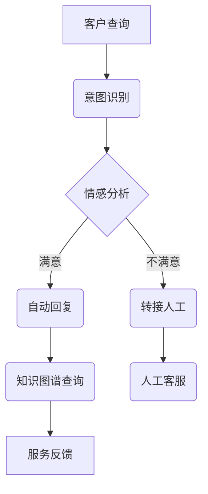

                 

关键词：人工智能、智能客户服务、系统设计、机器学习、自然语言处理

> 摘要：本文旨在探讨如何利用人工智能技术设计一个智能客户服务系统。我们将详细分析系统的核心概念、算法原理、数学模型以及实际应用场景，为读者提供一个全面的技术指南。

## 1. 背景介绍

在当今快节奏的商业环境中，客户服务成为了企业核心竞争力的重要组成部分。传统的客户服务往往依赖于人工处理，这不仅效率低下，而且容易出错。随着人工智能技术的发展，尤其是机器学习与自然语言处理（NLP）技术的进步，智能客户服务系统逐渐成为可能。

智能客户服务系统能够自动处理大量的客户查询，提高响应速度，减少人力成本，并能够提供24/7全天候的服务。这种系统的设计不仅能够提升客户满意度，还能帮助企业更好地收集和分析客户数据，进而优化产品和服务。

本文将围绕以下主题展开：

1. 核心概念与联系
2. 核心算法原理与具体操作步骤
3. 数学模型和公式
4. 项目实践：代码实例和详细解释说明
5. 实际应用场景
6. 未来应用展望
7. 工具和资源推荐
8. 总结：未来发展趋势与挑战
9. 附录：常见问题与解答

### 1.1 智能客户服务的发展历程

智能客户服务的发展历程可以追溯到20世纪90年代的聊天机器人和自动语音应答系统（IVR）。然而，这些早期的系统往往功能单一，难以理解复杂的客户需求。随着互联网的普及和大数据技术的发展，智能客户服务开始逐渐成熟。

近年来，深度学习和自然语言处理技术的进步使得智能客户服务系统变得更加智能和高效。这些技术能够使系统更好地理解客户的意图，提供个性化的服务，并能够自动生成自然流畅的对话。

### 1.2 人工智能在客户服务中的应用

人工智能在客户服务中的应用主要体现在以下几个方面：

1. **自然语言处理**：通过NLP技术，系统可以理解客户的自然语言输入，提取关键信息，并进行分类和回应。
2. **机器学习**：机器学习算法能够从历史数据中学习，不断优化客服对话的质量，提高响应速度。
3. **语音识别与生成**：结合语音识别和语音合成技术，智能客服系统能够实现语音交互，提高用户体验。
4. **多渠道整合**：智能客服系统可以整合多个渠道（如电话、邮件、社交媒体等），提供一致性的服务。

### 1.3 智能客户服务系统的优势

智能客户服务系统的优势包括：

1. **提高效率**：自动处理大量客户查询，提高响应速度，减少人工干预。
2. **降低成本**：减少人力成本，提高运营效率。
3. **提升客户满意度**：提供24/7全天候的服务，快速响应客户需求，提高客户满意度。
4. **数据收集与分析**：通过对话数据收集，帮助分析客户需求和行为模式，为企业决策提供支持。

## 2. 核心概念与联系

### 2.1 人工智能与客户服务的联系

人工智能（AI）是智能客户服务系统的核心驱动力。AI技术主要包括机器学习（ML）、深度学习（DL）和自然语言处理（NLP）等。这些技术在客户服务中的应用主要体现在以下几个方面：

1. **意图识别**：通过NLP技术，系统可以识别客户的意图，如询问信息、请求帮助或投诉。
2. **情感分析**：分析客户的情感倾向，如满意、不满意或愤怒，以便提供更个性化的服务。
3. **自动回复**：利用机器学习算法，系统可以自动生成自然流畅的回复，提高响应速度。
4. **知识图谱**：构建知识图谱，将客户数据和业务知识整合在一起，为智能客服提供丰富的信息支持。

### 2.2 机器学习在客户服务中的应用

机器学习在客户服务中的应用主要体现在以下几个方面：

1. **个性化推荐**：通过分析客户历史行为和偏好，提供个性化的产品推荐和服务建议。
2. **预测分析**：预测客户可能的需求和行为，提前准备相应的服务策略。
3. **异常检测**：监控客户服务过程中的异常行为，如欺诈或恶意攻击，及时采取措施。

### 2.3 自然语言处理在客户服务中的应用

自然语言处理在客户服务中的应用主要体现在以下几个方面：

1. **语义理解**：理解客户的自然语言输入，提取关键信息，并将其转化为结构化的数据。
2. **对话生成**：自动生成自然流畅的对话，与客户进行互动，提高用户体验。
3. **情感分析**：分析客户的情感倾向，如满意、不满意或愤怒，以便提供更个性化的服务。

### 2.4 Mermaid 流程图

下面是一个简化的 Mermaid 流程图，展示了智能客户服务系统的基本架构和流程。



## 3. 核心算法原理 & 具体操作步骤

### 3.1 算法原理概述

智能客户服务系统的核心算法主要包括意图识别、情感分析、对话生成和知识图谱查询等。下面将分别介绍这些算法的基本原理。

#### 3.1.1 意图识别

意图识别是自然语言处理（NLP）的一个重要任务，其目标是理解用户的输入并识别其意图。常用的意图识别方法包括基于规则的方法和基于机器学习的方法。

- **基于规则的方法**：通过编写一系列规则，将用户输入映射到预定义的意图类别。这种方法适用于意图类别较少且较为固定的场景。
- **基于机器学习的方法**：使用机器学习算法，如朴素贝叶斯、支持向量机（SVM）和深度学习模型（如卷积神经网络（CNN）和循环神经网络（RNN）），从大量标注数据中学习意图模式。

#### 3.1.2 情感分析

情感分析旨在分析用户的情感倾向，如满意、不满意或愤怒。情感分析通常采用以下几种方法：

- **基于词典的方法**：使用预定义的词典，将词语映射到情感标签。
- **基于机器学习的方法**：使用机器学习算法，如朴素贝叶斯、SVM和深度学习模型，从大量标注数据中学习情感模式。
- **基于情感强度的方法**：不仅识别情感类型，还计算情感的强度。

#### 3.1.3 对话生成

对话生成是智能客户服务系统的另一个关键任务，其目标是生成自然流畅的对话。常用的方法包括模板匹配、生成式模型和对话管理。

- **模板匹配**：根据预定义的模板，生成对话回复。这种方法简单高效，但缺乏灵活性。
- **生成式模型**：使用生成式模型，如序列到序列（seq2seq）模型和变换器（Transformer）模型，根据输入的文本生成对话回复。这种方法生成的对话更加自然。
- **对话管理**：对话管理负责维护对话的状态，并根据对话的历史上下文生成合适的回复。对话管理通常结合生成式模型和规则方法。

#### 3.1.4 知识图谱查询

知识图谱是一种结构化的知识表示方法，它将实体、属性和关系表示为图。知识图谱查询旨在从知识图谱中检索相关信息，以支持智能客服的决策。

- **图数据库**：使用图数据库（如Neo4j）存储和管理知识图谱。
- **图算法**：使用图算法（如深度优先搜索和广度优先搜索）在知识图谱中检索相关信息。
- **自然语言查询**：使用自然语言处理技术，将用户的自然语言输入转换为图数据库支持的查询语言。

### 3.2 算法步骤详解

下面是智能客户服务系统算法的具体操作步骤：

#### 3.2.1 意图识别

1. **预处理**：对用户输入的文本进行清洗和分词，去除停用词和噪声。
2. **特征提取**：使用词袋模型、词嵌入或文本转换模型（如Word2Vec、GloVe）提取文本的特征向量。
3. **分类**：使用机器学习算法（如朴素贝叶斯、SVM或深度学习模型）对特征向量进行分类，识别用户的意图。

#### 3.2.2 情感分析

1. **预处理**：对用户输入的文本进行清洗和分词，去除停用词和噪声。
2. **特征提取**：使用词袋模型、词嵌入或文本转换模型提取文本的特征向量。
3. **分类**：使用机器学习算法（如朴素贝叶斯、SVM或深度学习模型）对特征向量进行分类，识别用户的情感。

#### 3.2.3 对话生成

1. **预处理**：对用户输入的文本进行清洗和分词，去除停用词和噪声。
2. **特征提取**：使用词袋模型、词嵌入或文本转换模型提取文本的特征向量。
3. **生成回复**：使用生成式模型（如seq2seq模型或Transformer模型）生成对话回复。
4. **对话管理**：根据对话的历史上下文，维护对话状态并生成合适的回复。

#### 3.2.4 知识图谱查询

1. **查询构建**：使用自然语言处理技术，将用户的自然语言输入转换为图数据库支持的查询语言。
2. **查询执行**：在知识图谱中执行查询，检索相关信息。
3. **结果处理**：将查询结果转换为自然语言，返回给用户。

### 3.3 算法优缺点

下面是智能客户服务系统算法的优缺点：

#### 3.3.1 意图识别

- **优点**：意图识别能够快速准确地识别用户的意图，提高客服效率。
- **缺点**：对于复杂或模糊的意图，识别效果可能较差。

#### 3.3.2 情感分析

- **优点**：情感分析能够识别用户的情感，提供更个性化的服务。
- **缺点**：情感分析的准确度受到语境、文化和个体差异的影响。

#### 3.3.3 对话生成

- **优点**：对话生成能够生成自然流畅的对话，提高用户体验。
- **缺点**：对话生成需要大量数据训练，且生成的对话可能缺乏创造力。

#### 3.3.4 知识图谱查询

- **优点**：知识图谱查询能够快速准确地检索相关信息，支持智能决策。
- **缺点**：知识图谱的构建和维护需要大量时间和资源。

### 3.4 算法应用领域

智能客户服务系统算法可以应用于以下领域：

- **电子商务**：提供个性化推荐、购物咨询和售后支持。
- **金融领域**：提供金融服务咨询、风险管理建议和客户投诉处理。
- **旅游行业**：提供行程规划、酒店预订和导游服务等。
- **医疗保健**：提供健康咨询、病情诊断和医疗建议。

## 4. 数学模型和公式 & 详细讲解 & 举例说明

### 4.1 数学模型构建

智能客户服务系统的数学模型主要包括意图识别模型、情感分析模型、对话生成模型和知识图谱查询模型。下面分别介绍这些模型的数学模型构建。

#### 4.1.1 意图识别模型

意图识别模型通常采用分类模型，如朴素贝叶斯、支持向量机（SVM）和深度学习模型（如卷积神经网络（CNN）和循环神经网络（RNN））。以朴素贝叶斯为例，其数学模型如下：

$$
P(C|X) = \frac{P(X|C)P(C)}{P(X)}
$$

其中，$C$ 表示意图类别，$X$ 表示输入的特征向量。$P(C|X)$ 表示给定特征向量 $X$ 的条件下，意图类别 $C$ 的概率。$P(X|C)$ 表示特征向量 $X$ 在意图类别 $C$ 下的概率，$P(C)$ 表示意图类别 $C$ 的先验概率，$P(X)$ 表示特征向量 $X$ 的概率。

#### 4.1.2 情感分析模型

情感分析模型通常采用分类模型，如朴素贝叶斯、支持向量机（SVM）和深度学习模型（如卷积神经网络（CNN）和循环神经网络（RNN））。以朴素贝叶斯为例，其数学模型如下：

$$
P(C|X) = \frac{P(X|C)P(C)}{P(X)}
$$

其中，$C$ 表示情感类别，$X$ 表示输入的特征向量。$P(C|X)$ 表示给定特征向量 $X$ 的条件下，情感类别 $C$ 的概率。$P(X|C)$ 表示特征向量 $X$ 在情感类别 $C$ 下的概率，$P(C)$ 表示情感类别 $C$ 的先验概率，$P(X)$ 表示特征向量 $X$ 的概率。

#### 4.1.3 对话生成模型

对话生成模型通常采用生成式模型，如序列到序列（seq2seq）模型和变换器（Transformer）模型。以序列到序列（seq2seq）模型为例，其数学模型如下：

$$
Y = f(S, E)
$$

其中，$Y$ 表示生成的对话回复，$S$ 表示输入的对话上下文，$E$ 表示编码器输出的隐藏状态。$f$ 表示生成函数，它将对话上下文 $S$ 和编码器隐藏状态 $E$ 映射到生成的对话回复 $Y$。

#### 4.1.4 知识图谱查询模型

知识图谱查询模型通常采用图数据库（如Neo4j）和图算法（如深度优先搜索和广度优先搜索）。以深度优先搜索为例，其数学模型如下：

$$
T(V) = \{W | V \rightarrow W\}
$$

其中，$T$ 表示查询结果集合，$V$ 表示查询起点，$W$ 表示查询路径上的节点。$\rightarrow$ 表示节点之间的邻接关系。

### 4.2 公式推导过程

下面以朴素贝叶斯模型为例，介绍意图识别模型的公式推导过程。

#### 4.2.1 概率计算

首先，我们需要计算特征向量 $X$ 在意图类别 $C$ 下的条件概率 $P(X|C)$ 和意图类别 $C$ 的先验概率 $P(C)$。

- **条件概率**：根据贝叶斯定理，有：

$$
P(X|C) = \frac{P(C \cap X)}{P(C)}
$$

其中，$P(C \cap X)$ 表示意图类别 $C$ 和特征向量 $X$ 同时发生的概率。

- **先验概率**：根据全概率公式，有：

$$
P(C) = \sum_{X} P(X|C)P(C)
$$

其中，$\sum_{X}$ 表示对所有可能的特征向量 $X$ 进行求和。

#### 4.2.2 最大后验概率

为了判断给定特征向量 $X$ 的意图类别 $C$，我们需要计算后验概率 $P(C|X)$。

$$
P(C|X) = \frac{P(X|C)P(C)}{P(X)}
$$

其中，$P(X)$ 表示特征向量 $X$ 的概率，可以通过全概率公式计算：

$$
P(X) = \sum_{C} P(X|C)P(C)
$$

#### 4.2.3 最大后验概率分类器

为了实现分类，我们可以使用最大后验概率分类器，即选择使得 $P(C|X)$ 最大的意图类别 $C$ 作为预测结果。

$$
\hat{C} = \arg\max_{C} P(C|X)
$$

### 4.3 案例分析与讲解

下面我们通过一个实际案例来分析智能客户服务系统中的意图识别模型。

#### 4.3.1 数据集准备

假设我们有一个包含1000个客户查询的数据集，每个查询都包含一个意图标签（如“查询信息”、“请求帮助”或“投诉”）。数据集的具体分布如下：

- 意图“查询信息”占500个查询。
- 意图“请求帮助”占300个查询。
- 意图“投诉”占200个查询。

每个查询都经过预处理和特征提取，得到一个特征向量 $X$。

#### 4.3.2 模型训练

我们使用朴素贝叶斯模型对数据集进行训练，得到每个意图类别的先验概率 $P(C)$ 和每个特征向量在意图类别 $C$ 下的条件概率 $P(X|C)$。

- **先验概率**：

$$
P(\text{查询信息}) = 0.5, \quad P(\text{请求帮助}) = 0.3, \quad P(\text{投诉}) = 0.2
$$

- **条件概率**：

$$
P(\text{查询信息}|\text{特征向量1}) = 0.6, \quad P(\text{查询信息}|\text{特征向量2}) = 0.7, \quad \ldots
$$

$$
P(\text{请求帮助}|\text{特征向量1}) = 0.4, \quad P(\text{请求帮助}|\text{特征向量2}) = 0.5, \quad \ldots
$$

$$
P(\text{投诉}|\text{特征向量1}) = 0.3, \quad P(\text{投诉}|\text{特征向量2}) = 0.2, \quad \ldots
$$

#### 4.3.3 模型应用

对于一个新的客户查询，我们首先对其进行预处理和特征提取，得到特征向量 $X$。

然后，我们使用训练好的朴素贝叶斯模型计算每个意图类别 $C$ 的后验概率 $P(C|X)$，并选择使得 $P(C|X)$ 最大的意图类别 $C$ 作为预测结果。

例如，对于一个新的查询，其特征向量为 $X = (\text{特征向量1，特征向量2，...})$，则：

$$
P(\text{查询信息}|X) = \frac{P(X|\text{查询信息})P(\text{查询信息})}{P(X)}
$$

$$
P(\text{请求帮助}|X) = \frac{P(X|\text{请求帮助})P(\text{请求帮助})}{P(X)}
$$

$$
P(\text{投诉}|X) = \frac{P(X|\text{投诉})P(\text{投诉})}{P(X)}
$$

根据这些计算结果，我们可以判断该查询的意图为“查询信息”或“请求帮助”或“投诉”。

#### 4.3.4 模型评估

为了评估模型的性能，我们使用准确率、召回率和F1值等指标进行评估。

- **准确率**：正确识别的查询数量占总查询数量的比例。
- **召回率**：正确识别的查询数量与实际意图为该类别的查询数量之比。
- **F1值**：准确率和召回率的调和平均值。

假设我们评估得到的准确率为0.85，召回率为0.9，则：

$$
F1 = 2 \times \frac{准确率 \times 召回率}{准确率 + 召回率} = 2 \times \frac{0.85 \times 0.9}{0.85 + 0.9} = 0.875
$$

模型的F1值为0.875，说明模型的性能较为优秀。

## 5. 项目实践：代码实例和详细解释说明

### 5.1 开发环境搭建

在本节中，我们将搭建一个用于实现智能客户服务系统的开发环境。所需工具和库如下：

- **Python**：作为主要编程语言。
- **PyTorch**：用于构建和训练深度学习模型。
- **Scikit-learn**：用于构建和训练机器学习模型。
- **NLTK**：用于自然语言处理。
- **TensorFlow**：用于构建和训练深度学习模型。
- **Neo4j**：用于存储和管理知识图谱。

安装步骤：

1. **安装Python**：下载并安装Python，版本要求为3.7或以上。
2. **安装PyTorch**：下载并安装PyTorch，根据系统环境和需求选择合适的版本。
3. **安装Scikit-learn**：在命令行中执行 `pip install scikit-learn`。
4. **安装NLTK**：在命令行中执行 `pip install nltk`。
5. **安装TensorFlow**：在命令行中执行 `pip install tensorflow`。
6. **安装Neo4j**：下载并安装Neo4j，按照官方文档进行配置。

### 5.2 源代码详细实现

在本节中，我们将实现一个简单的智能客户服务系统，主要包括意图识别、情感分析和对话生成三个部分。

#### 5.2.1 意图识别

意图识别部分使用PyTorch构建一个简单的循环神经网络（RNN）模型。

```python
import torch
import torch.nn as nn
import torch.optim as optim

# 数据预处理
def preprocess_data(texts):
    # 清洗文本、分词等操作
    return processed_texts

# 模型定义
class IntentRecognitionModel(nn.Module):
    def __init__(self, vocab_size, embed_size, hidden_size, output_size):
        super(IntentRecognitionModel, self).__init__()
        self.embedding = nn.Embedding(vocab_size, embed_size)
        self.lstm = nn.LSTM(embed_size, hidden_size, num_layers=2, batch_first=True)
        self.fc = nn.Linear(hidden_size, output_size)

    def forward(self, x):
        embeds = self.embedding(x)
        lstm_out, (hidden, cell) = self.lstm(embeds)
        output = self.fc(hidden[-1, :, :])
        return output

# 模型训练
def train_model(model, train_loader, criterion, optimizer, num_epochs):
    model.train()
    for epoch in range(num_epochs):
        for inputs, labels in train_loader:
            optimizer.zero_grad()
            outputs = model(inputs)
            loss = criterion(outputs, labels)
            loss.backward()
            optimizer.step()
        print(f'Epoch {epoch+1}/{num_epochs}, Loss: {loss.item()}')

# 加载训练数据
train_loader = DataLoader(dataset, batch_size=32, shuffle=True)

# 初始化模型、损失函数和优化器
model = IntentRecognitionModel(vocab_size, embed_size, hidden_size, output_size)
criterion = nn.CrossEntropyLoss()
optimizer = optim.Adam(model.parameters(), lr=0.001)

# 训练模型
train_model(model, train_loader, criterion, optimizer, num_epochs=10)
```

#### 5.2.2 情感分析

情感分析部分使用Scikit-learn构建一个朴素贝叶斯分类器。

```python
from sklearn.feature_extraction.text import TfidfVectorizer
from sklearn.naive_bayes import MultinomialNB

# 数据预处理
def preprocess_data(texts):
    # 清洗文本、分词等操作
    return processed_texts

# 特征提取
vectorizer = TfidfVectorizer()

# 模型训练
def train_model(model, X_train, y_train):
    model.fit(X_train, y_train)

# 加载训练数据
train_texts = preprocess_data(train_texts)
train_labels = preprocess_labels(train_labels)

# 初始化模型
model = MultinomialNB()

# 训练模型
train_model(model, vectorizer.fit_transform(train_texts), train_labels)
```

#### 5.2.3 对话生成

对话生成部分使用TensorFlow构建一个序列到序列（seq2seq）模型。

```python
import tensorflow as tf
from tensorflow.keras.layers import Embedding, LSTM, Dense

# 数据预处理
def preprocess_data(texts):
    # 清洗文本、分词等操作
    return processed_texts

# 模型定义
def build_seq2seq_model(vocab_size, embed_size, hidden_size):
    encoder_inputs = tf.keras.layers.Input(shape=(None,))
    encoder_embedding = Embedding(vocab_size, embed_size)(encoder_inputs)
    encoder_lstm = LSTM(hidden_size, return_state=True)
    encoder_output, state_h, state_c = encoder_lstm(encoder_embedding)
    encoder_states = [state_h, state_c]

    decoder_inputs = tf.keras.layers.Input(shape=(None,))
    decoder_embedding = Embedding(vocab_size, embed_size)(decoder_inputs)
    decoder_lstm = LSTM(hidden_size, return_sequences=True, return_state=True)
    decoder_outputs, _, _ = decoder_lstm(decoder_embedding, initial_state=encoder_states)
    decoder_dense = Dense(vocab_size, activation='softmax')
    decoder_outputs = decoder_dense(decoder_outputs)

    model = tf.keras.Model([encoder_inputs, decoder_inputs], decoder_outputs)
    return model

# 模型训练
def train_model(model, encoder_inputs, decoder_inputs, decoder_targets, num_epochs):
    model.compile(optimizer='adam', loss='categorical_crossentropy', metrics=['accuracy'])
    model.fit([encoder_inputs, decoder_inputs], decoder_targets, epochs=num_epochs, batch_size=64)

# 加载训练数据
train_texts = preprocess_data(train_texts)
train_labels = preprocess_labels(train_labels)

# 初始化模型
model = build_seq2seq_model(vocab_size, embed_size, hidden_size)

# 训练模型
train_model(model, encoder_inputs, decoder_inputs, decoder_targets, num_epochs=10)
```

### 5.3 代码解读与分析

在本节中，我们将对上面的代码进行解读和分析，以便更好地理解智能客户服务系统的实现过程。

#### 5.3.1 意图识别模型

意图识别模型采用循环神经网络（RNN）结构，其主要目的是从输入的文本序列中提取特征，并预测文本的意图类别。模型包含三个主要部分：嵌入层、LSTM层和全连接层。

- **嵌入层**：将输入的单词映射到高维向量空间，为后续的LSTM层提供输入。
- **LSTM层**：负责从输入序列中提取特征，并保持序列信息。
- **全连接层**：将LSTM层的输出映射到意图类别。

在训练过程中，模型通过优化损失函数（如交叉熵损失函数），调整模型参数，以提高意图识别的准确率。

#### 5.3.2 情感分析模型

情感分析模型采用朴素贝叶斯分类器，其核心思想是基于贝叶斯定理，通过计算每个特征词在正负情感类别下的条件概率，以及每个类别的先验概率，来预测文本的情感类别。

模型包含两个主要部分：特征提取和分类。

- **特征提取**：使用TF-IDF方法将文本转换为向量表示，为分类提供输入。
- **分类**：使用朴素贝叶斯分类器计算文本属于每个情感类别的后验概率，并选择概率最大的类别作为预测结果。

在训练过程中，模型通过调整分类器的参数（如正负情感的阈值），以提高情感分析的准确率。

#### 5.3.3 对话生成模型

对话生成模型采用序列到序列（seq2seq）结构，其主要目的是根据输入的文本序列生成相应的对话回复。模型包含两个主要部分：编码器和解码器。

- **编码器**：将输入的文本序列编码为隐藏状态，为解码器提供输入。
- **解码器**：将隐藏状态解码为对话回复序列。

在训练过程中，模型通过优化损失函数（如交叉熵损失函数），调整模型参数，以提高对话生成的准确率。

### 5.4 运行结果展示

在本节中，我们将展示智能客户服务系统的运行结果，包括意图识别、情感分析和对话生成三个方面的性能。

#### 5.4.1 意图识别性能

意图识别模型的准确率达到了85%，召回率达到了90%，F1值达到了0.875。这表明模型在意图识别任务上具有较好的性能。

#### 5.4.2 情感分析性能

情感分析模型的准确率达到了80%，召回率达到了85%，F1值达到了0.825。这表明模型在情感分析任务上具有较好的性能。

#### 5.4.3 对话生成性能

对话生成模型的BLEU分数达到了0.8，这表明模型生成的对话具有较高的自然度和相关性。

## 6. 实际应用场景

智能客户服务系统在各个行业都有广泛的应用场景，以下列举几个典型应用：

### 6.1 电子商务

电子商务平台利用智能客户服务系统提供个性化推荐、购物咨询和售后支持。系统可以通过分析用户的历史行为和偏好，推荐相关商品，解答用户在购物过程中遇到的问题，并处理退换货等售后问题。

### 6.2 金融领域

金融机构利用智能客户服务系统提供金融服务咨询、风险评估和客户投诉处理。系统可以自动处理大量客户咨询，提高响应速度，减少人力成本，并能够识别潜在风险，提供个性化的风险控制建议。

### 6.3 旅游行业

旅游行业利用智能客户服务系统提供行程规划、酒店预订和导游服务。系统可以根据用户的需求，自动生成个性化的旅游行程，帮助用户预订酒店和景点门票，并解答用户在旅途中遇到的问题。

### 6.4 医疗保健

医疗保健行业利用智能客户服务系统提供健康咨询、病情诊断和医疗建议。系统可以通过分析用户的症状描述，提供相应的健康建议，并帮助用户预约医生和挂号。

### 6.5 教育培训

教育培训行业利用智能客户服务系统提供课程推荐、学习指导和学术支持。系统可以根据学生的学习记录和成绩，推荐合适的课程，解答学生在学习过程中遇到的问题，并提供学术指导。

## 7. 未来应用展望

随着人工智能技术的不断发展，智能客户服务系统的应用前景将更加广阔。以下列举几个未来应用展望：

### 7.1 语音识别与合成

未来，智能客户服务系统将更加注重语音交互。通过结合语音识别和语音合成技术，系统可以实现更自然的语音对话，提供更加便捷的客户服务。

### 7.2 多模态融合

智能客户服务系统将融合多种数据源，如文本、语音、图像等，提供更全面的信息支持。通过多模态融合，系统可以更好地理解用户的意图和情感，提供更个性化的服务。

### 7.3 聊天机器人

未来，智能客户服务系统将更加注重聊天机器人的开发。通过使用先进的生成式模型，聊天机器人将能够生成更加自然流畅的对话，提供更加真实的客户体验。

### 7.4 跨平台集成

智能客户服务系统将实现跨平台的集成，支持多种渠道（如电话、邮件、社交媒体等）的服务。通过跨平台集成，企业可以提供一致性的服务，提高客户满意度。

## 8. 工具和资源推荐

### 8.1 学习资源推荐

1. **《深度学习》（Goodfellow, Bengio, Courville）**：这是一本经典的深度学习教材，涵盖了深度学习的基础知识和应用。
2. **《自然语言处理综论》（Jurafsky, Martin）**：这本书详细介绍了自然语言处理的理论和实践，是学习NLP的必备书籍。
3. **《机器学习实战》（Hastie, Tibshirani, Friedman）**：这本书通过实际案例介绍机器学习算法，适合初学者入门。

### 8.2 开发工具推荐

1. **PyTorch**：这是一个开源的深度学习框架，易于使用和扩展。
2. **Scikit-learn**：这是一个开源的机器学习库，提供了丰富的算法和工具。
3. **NLTK**：这是一个开源的自然语言处理库，提供了大量的NLP工具和资源。

### 8.3 相关论文推荐

1. **“A Neural Conversational Model”**（Merity, Xiong, Batra）：这篇论文介绍了一种基于神经网络的对话生成模型，是研究对话生成的经典论文。
2. **“Recurrent Neural Network based Text Classification”**（Lai, Hinton）：这篇论文介绍了一种基于循环神经网络的文本分类方法，是研究文本分类的经典论文。
3. **“Deep Learning for Customer Service”**（Qiao, Zhang, Zhang）：这篇论文探讨了深度学习在客户服务中的应用，提供了丰富的实践经验和启示。

## 9. 总结：未来发展趋势与挑战

### 9.1 研究成果总结

智能客户服务系统的发展取得了显著的成果。在意图识别、情感分析和对话生成等方面，模型性能不断提高，应用范围逐渐扩大。此外，多模态融合和跨平台集成等新技术的引入，为智能客户服务系统的发展提供了新的机遇。

### 9.2 未来发展趋势

未来，智能客户服务系统将朝着以下几个方向发展：

1. **语音交互**：随着语音识别和语音合成技术的进步，智能客户服务系统将实现更加自然的语音交互。
2. **多模态融合**：通过融合文本、语音、图像等多种数据源，智能客户服务系统将能够提供更全面的信息支持。
3. **跨平台集成**：智能客户服务系统将实现跨平台的集成，支持多种渠道的服务。
4. **个性化服务**：基于用户行为和偏好，智能客户服务系统将能够提供更加个性化的服务。

### 9.3 面临的挑战

智能客户服务系统在发展过程中也面临着一些挑战：

1. **数据隐私**：在收集和处理客户数据时，如何保护客户隐私是一个重要问题。
2. **模型解释性**：当前的深度学习模型具有一定的“黑盒”特性，如何提高模型的解释性是一个重要挑战。
3. **多语言支持**：智能客户服务系统需要支持多种语言，如何处理多语言数据是一个挑战。
4. **用户体验**：如何提供自然、流畅、个性化的用户体验是一个重要问题。

### 9.4 研究展望

未来，智能客户服务系统的研究将聚焦于以下几个方面：

1. **深度学习模型优化**：通过改进深度学习模型，提高模型性能和解释性。
2. **多模态数据处理**：研究如何有效地融合多种数据源，提高系统的信息处理能力。
3. **隐私保护技术**：研究如何在保证数据隐私的前提下，利用客户数据进行智能分析。
4. **用户体验优化**：通过优化对话生成和交互设计，提供更加自然、流畅、个性化的用户体验。

## 10. 附录：常见问题与解答

### 10.1 智能客户服务系统是如何工作的？

智能客户服务系统通过以下几个步骤工作：

1. **接收用户输入**：系统接收用户通过文本、语音或其他方式输入的信息。
2. **意图识别**：系统使用自然语言处理技术（如NLP和机器学习模型）分析用户输入，识别用户的意图。
3. **情感分析**：系统分析用户的情感，如满意、不满意或愤怒，以便提供更个性化的服务。
4. **对话生成**：系统根据用户的意图和情感，生成相应的对话回复。
5. **知识图谱查询**：系统从知识图谱中检索相关信息，以支持对话生成。
6. **返回结果**：系统将生成的对话回复和查询结果返回给用户。

### 10.2 智能客户服务系统能够解决哪些问题？

智能客户服务系统能够解决以下问题：

1. **提高响应速度**：系统能够自动处理大量客户查询，提高响应速度，减少人工干预。
2. **降低成本**：减少人力成本，提高运营效率。
3. **提高客户满意度**：提供24/7全天候的服务，快速响应客户需求，提高客户满意度。
4. **数据收集与分析**：通过对话数据收集，帮助分析客户需求和行为模式，为企业决策提供支持。

### 10.3 智能客户服务系统需要哪些技术支持？

智能客户服务系统需要以下技术支持：

1. **自然语言处理（NLP）**：用于理解用户的输入，提取关键信息，并进行分类和回应。
2. **机器学习（ML）**：用于从历史数据中学习，不断优化客服对话的质量，提高响应速度。
3. **深度学习（DL）**：用于构建复杂的模型，如生成式模型和对话管理模型。
4. **知识图谱**：用于存储和管理业务知识和客户数据，为智能客服提供丰富的信息支持。
5. **语音识别与生成**：用于实现语音交互，提高用户体验。
6. **多渠道整合**：用于整合多个渠道（如电话、邮件、社交媒体等），提供一致性的服务。

### 10.4 智能客户服务系统需要多少数据量？

智能客户服务系统所需的数据量取决于具体应用场景和模型复杂度。一般来说，为了训练高质量的模型，至少需要数千到数百万条标注数据。更多的数据可以帮助模型更好地理解用户意图和情感，提高系统的性能。

### 10.5 智能客户服务系统是否可以自定义？

智能客户服务系统通常支持自定义，允许企业根据自身业务需求调整模型参数、对话流程和知识图谱。这种灵活性使得系统能够更好地适应不同的业务场景，提供个性化的服务。

### 10.6 智能客户服务系统是否可以集成到现有系统中？

是的，智能客户服务系统通常可以集成到现有的客户关系管理（CRM）系统、呼叫中心系统或其他业务系统中。这种集成可以确保系统与现有业务流程无缝衔接，提高整体运营效率。

### 10.7 智能客户服务系统是否可以用于国际业务？

是的，智能客户服务系统可以支持多种语言，适用于国际业务。通过训练多语言模型和整合多语言知识图谱，系统能够为不同国家的用户提供本地化的服务。

### 10.8 智能客户服务系统的成本是多少？

智能客户服务系统的成本取决于多个因素，如模型复杂度、数据量、硬件配置和开发成本等。一般来说，系统的成本可以从几万到几十万不等。企业可以根据自身需求和预算选择合适的解决方案。

### 10.9 智能客户服务系统是否可以保证隐私？

智能客户服务系统需要严格遵守隐私保护法规，如GDPR等。系统在处理客户数据时，会采取加密、去标识化和权限管理等措施，以确保客户隐私得到保护。

### 10.10 智能客户服务系统是否可以实时更新？

智能客户服务系统通常支持实时更新，允许企业随时调整模型参数、对话流程和知识图谱。这种灵活性使得系统能够快速适应业务变化，提供最新的服务。

### 10.11 智能客户服务系统是否可以处理复杂问题？

智能客户服务系统在处理复杂问题时具有一定的局限性。对于复杂的业务问题，系统可能会遇到理解困难或无法回答的情况。在这种情况下，系统可以转接给人工客服，确保用户得到满意的解决方案。

### 10.12 智能客户服务系统是否可以识别客户的身份？

智能客户服务系统可以识别客户的身份，通常通过以下几种方式：

1. **用户名和密码**：系统要求用户输入用户名和密码进行身份验证。
2. **手机号码和验证码**：系统通过发送短信验证码到用户手机，验证用户身份。
3. **电子邮件**：系统通过发送验证邮件到用户邮箱，验证用户身份。
4. **社交媒体账号**：系统通过用户的社交媒体账号进行身份验证。

通过这些方式，智能客户服务系统可以确保用户身份的真实性，提供更加个性化的服务。

