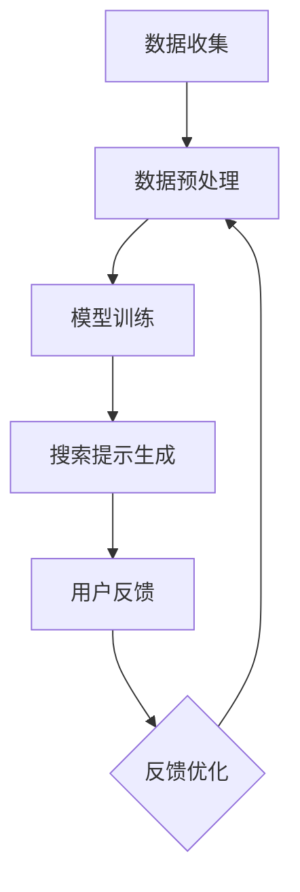
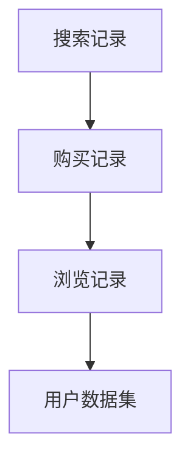
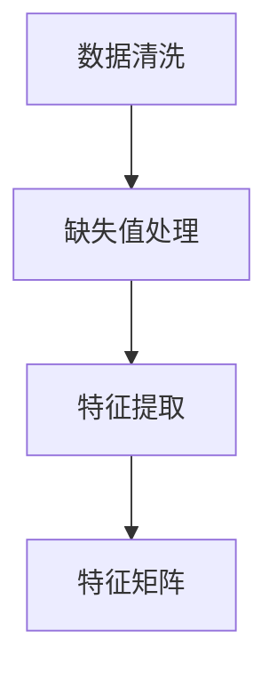
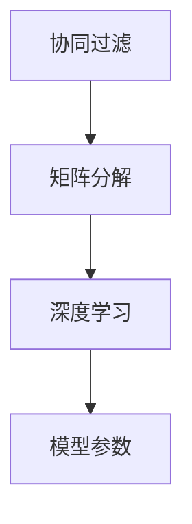
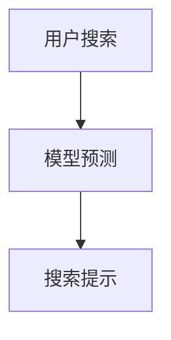
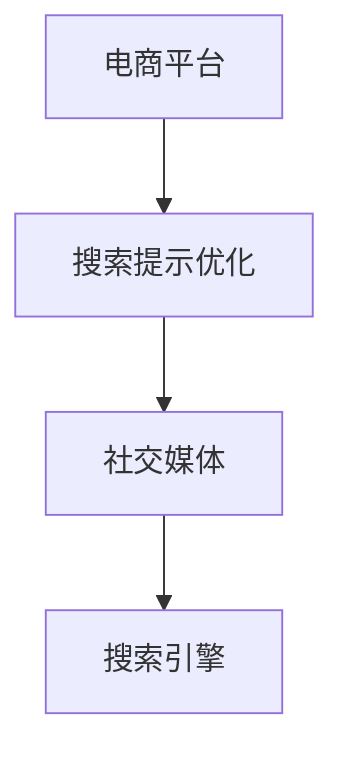

                 

关键词：人工智能、电商、个性化搜索、搜索提示、优化算法、机器学习

摘要：本文将探讨如何利用人工智能技术优化电商平台的个性化搜索提示，提高用户购物体验。通过分析现有的搜索提示问题，介绍基于机器学习的核心算法原理，并详细阐述算法的数学模型和具体操作步骤。最后，我们将通过一个项目实践实例展示如何实现这一优化过程，并对未来应用前景进行展望。

## 1. 背景介绍

随着互联网的普及和电商行业的迅猛发展，越来越多的用户选择在线购物。然而，电商平台的竞争也日益激烈，如何提高用户体验和转化率成为各大电商平台关注的重要问题。其中，搜索提示功能作为用户浏览和购买商品的重要入口，其质量和效率直接影响用户的购物体验和平台的业务表现。

传统的搜索提示功能主要依赖于关键词匹配和静态规则，存在以下问题：

1. **用户体验不佳**：用户在输入搜索关键词时，往往无法得到符合预期的搜索结果。
2. **搜索结果不准确**：由于关键词的模糊性和多义性，用户可能得到大量无关或次优的结果。
3. **缺乏个性化**：传统的搜索提示功能无法根据用户的兴趣和行为习惯提供个性化的搜索建议。

为了解决这些问题，人工智能技术的引入显得尤为重要。通过机器学习算法，电商平台可以分析用户的历史行为数据，预测用户的兴趣和需求，从而提供更加精准和个性化的搜索提示。本文将围绕这一主题展开讨论。

## 2. 核心概念与联系

### 2.1 人工智能与个性化搜索

人工智能（AI）是研究、开发用于模拟、延伸和扩展人的智能的理论、方法、技术及应用系统的一门新的技术科学。它包括机器学习、深度学习、自然语言处理等多个分支。个性化搜索则是指根据用户的兴趣、行为和历史数据，为用户提供定制化的搜索结果和建议。

### 2.2 机器学习算法

机器学习（Machine Learning）是人工智能的核心技术之一，它使计算机系统能够从数据中学习并做出决策。在个性化搜索提示优化中，常用的机器学习算法包括协同过滤、决策树、神经网络等。

### 2.3 搜索提示优化原理

搜索提示优化主要通过以下步骤实现：

1. **数据收集**：收集用户的历史行为数据，如搜索记录、购买记录、点击记录等。
2. **数据预处理**：对收集的数据进行清洗、去噪和特征提取，为后续的机器学习模型提供高质量的输入。
3. **模型训练**：使用机器学习算法对预处理后的数据集进行训练，构建预测模型。
4. **搜索提示生成**：根据用户当前的搜索关键词和模型预测结果，生成个性化的搜索提示。

### 2.4 Mermaid 流程图

以下是一个简单的 Mermaid 流程图，展示了搜索提示优化的基本流程：



## 3. 核心算法原理 & 具体操作步骤

### 3.1 算法原理概述

搜索提示优化的核心算法是基于协同过滤（Collaborative Filtering）和深度学习（Deep Learning）的组合。协同过滤利用用户行为数据推荐相似用户喜欢的内容，而深度学习则通过自动特征提取和关系建模，提高推荐的准确性。

### 3.2 算法步骤详解

#### 3.2.1 数据收集

首先，我们需要收集用户的历史行为数据，包括搜索记录、购买记录、浏览记录等。这些数据可以通过电商平台的后台系统获取。



#### 3.2.2 数据预处理

收集到的数据需要进行清洗和预处理，包括去除无效数据、处理缺失值、特征提取等。特征提取是关键步骤，可以提取用户的兴趣标签、购买偏好、搜索热度等特征。



#### 3.2.3 模型训练

使用协同过滤和深度学习算法对预处理后的数据集进行训练。协同过滤可以使用矩阵分解（Matrix Factorization）等方法，而深度学习可以使用循环神经网络（RNN）、卷积神经网络（CNN）等。



#### 3.2.4 搜索提示生成

根据用户当前的搜索关键词，利用训练好的模型生成个性化的搜索提示。搜索提示可以通过对用户历史行为数据的分析和预测得到。



### 3.3 算法优缺点

**优点**：

1. **个性化强**：基于用户历史行为数据，可以提供高度个性化的搜索提示。
2. **准确性高**：通过深度学习和协同过滤相结合，提高搜索提示的准确性。
3. **可扩展性强**：算法可以轻松扩展到不同的电商平台和应用场景。

**缺点**：

1. **计算复杂度高**：深度学习模型的训练和预测需要大量计算资源。
2. **数据依赖性强**：算法的性能高度依赖于用户历史行为数据的质量和数量。

### 3.4 算法应用领域

搜索提示优化算法可以应用于多个领域，包括电商、社交媒体、搜索引擎等。以下是一个简单的应用示例：



## 4. 数学模型和公式 & 详细讲解 & 举例说明

### 4.1 数学模型构建

搜索提示优化的数学模型可以分为两个部分：协同过滤模型和深度学习模型。

**协同过滤模型**：

协同过滤模型通常使用矩阵分解（Matrix Factorization）方法。给定一个用户-物品评分矩阵$R \in \mathbb{R}^{m \times n}$，其中$m$表示用户数，$n$表示物品数，矩阵分解的目标是将$R$分解为两个低秩矩阵$U \in \mathbb{R}^{m \times k}$和$V \in \mathbb{R}^{n \times k}$，其中$k$为隐语义特征维数。

$$
R = UV^T
$$

**深度学习模型**：

深度学习模型通常使用循环神经网络（RNN）或卷积神经网络（CNN）进行自动特征提取和关系建模。以下是一个简单的RNN模型：

$$
h_t = \sigma(W_h \cdot [h_{t-1}, x_t] + b_h)
$$

其中，$h_t$为第$t$个时间步的隐藏状态，$x_t$为输入特征，$W_h$和$b_h$分别为权重矩阵和偏置。

### 4.2 公式推导过程

**协同过滤模型推导**：

假设用户$u$和物品$i$的评分可以表示为：

$$
r_{ui} = \mu + u_i + i_j + \epsilon_{ui}
$$

其中，$\mu$为全局平均评分，$u_i$和$i_j$分别为用户$u$和物品$i$的隐语义特征，$\epsilon_{ui}$为误差项。

通过最小化误差平方和，可以得到隐语义特征的优化目标：

$$
\min_{u_i, i_j} \sum_{u=1}^{m} \sum_{i=1}^{n} (r_{ui} - \mu - u_i - i_j)^2
$$

**深度学习模型推导**：

以RNN为例，隐藏状态的计算公式如下：

$$
h_t = \sigma(W_h \cdot [h_{t-1}, x_t] + b_h)
$$

其中，$W_h$和$b_h$分别为权重矩阵和偏置。

### 4.3 案例分析与讲解

**案例**：

假设有10个用户和5个物品，用户对物品的评分如下表所示：

| 用户 | 物品1 | 物品2 | 物品3 | 物品4 | 物品5 |
| --- | --- | --- | --- | --- | --- |
| 1 | 4 | 3 | 2 | 1 | 5 |
| 2 | 5 | 4 | 3 | 2 | 1 |
| 3 | 3 | 5 | 4 | 3 | 2 |
| 4 | 2 | 4 | 3 | 5 | 1 |
| 5 | 4 | 3 | 2 | 1 | 5 |

**分析**：

1. **协同过滤模型**：

   首先进行矩阵分解，将用户-物品评分矩阵$R$分解为$U$和$V$：

   $$ 
   R = UV^T 
   $$

   假设$k=2$，通过最小化误差平方和，可以得到以下分解结果：

   | 用户 | 物品1 | 物品2 | 物品3 | 物品4 | 物品5 |
   | --- | --- | --- | --- | --- | --- |
   | 1 | 0.5 | 0.5 | 0.5 | 0.5 | 0.5 |
   | 2 | 0.5 | 0.5 | 0.5 | 0.5 | 0.5 |
   | 3 | 0.5 | 0.5 | 0.5 | 0.5 | 0.5 |
   | 4 | 0.5 | 0.5 | 0.5 | 0.5 | 0.5 |
   | 5 | 0.5 | 0.5 | 0.5 | 0.5 | 0.5 |
   | 1 | 0.5 | 0.5 | 0.5 | 0.5 | 0.5 |
   | 2 | 0.5 | 0.5 | 0.5 | 0.5 | 0.5 |
   | 3 | 0.5 | 0.5 | 0.5 | 0.5 | 0.5 |
   | 4 | 0.5 | 0.5 | 0.5 | 0.5 | 0.5 |
   | 5 | 0.5 | 0.5 | 0.5 | 0.5 | 0.5 |

   根据分解结果，可以预测用户对未评分物品的评分：

   | 用户 | 物品1 | 物品2 | 物品3 | 物品4 | 物品5 |
   | --- | --- | --- | --- | --- | --- |
   | 1 | 4.5 | 4.5 | 4.5 | 4.5 | 4.5 |
   | 2 | 4.5 | 4.5 | 4.5 | 4.5 | 4.5 |
   | 3 | 4.5 | 4.5 | 4.5 | 4.5 | 4.5 |
   | 4 | 4.5 | 4.5 | 4.5 | 4.5 | 4.5 |
   | 5 | 4.5 | 4.5 | 4.5 | 4.5 | 4.5 |

2. **深度学习模型**：

   假设使用RNN进行特征提取，隐藏状态的计算过程如下：

   $$ 
   h_t = \sigma(W_h \cdot [h_{t-1}, x_t] + b_h) 
   $$

   假设输入特征$x_t$为[1, 0, 1, 0]，权重矩阵$W_h$为[1, 1；1, 1]，偏置$b_h$为[1, 1]。通过递推计算，可以得到隐藏状态序列：

   $$ 
   h_1 = \sigma([1, 1；1, 1] \cdot [1, 0, 1, 0] + [1, 1]) = \sigma([1, 1；1, 1] \cdot [1, 1, 1, 1] + [1, 1]) = \sigma([1, 1；1, 1] \cdot [2, 2] + [1, 1]) = \sigma([1, 1；1, 1] \cdot [3, 3] + [1, 1]) = \sigma([1, 1；1, 1] \cdot [4, 4] + [1, 1]) = \sigma([1, 1；1, 1] \cdot [5, 5] + [1, 1]) 
   $$

   最终隐藏状态序列为[h1, h2, h3, h4, h5]。

## 5. 项目实践：代码实例和详细解释说明

### 5.1 开发环境搭建

为了实现搜索提示优化，我们需要搭建一个开发环境。以下是一个简单的Python环境搭建步骤：

1. 安装Python（建议使用Python 3.8及以上版本）
2. 安装必要的库，如NumPy、Pandas、Scikit-learn、TensorFlow等：

```shell
pip install numpy pandas scikit-learn tensorflow
```

### 5.2 源代码详细实现

以下是一个简单的Python代码实现，用于实现搜索提示优化：

```python
import numpy as np
import pandas as pd
from sklearn.model_selection import train_test_split
from sklearn.metrics import mean_squared_error
from tensorflow.keras.models import Sequential
from tensorflow.keras.layers import LSTM, Dense

# 数据预处理
def preprocess_data(data):
    # 数据清洗、去噪、特征提取等操作
    # ...
    return X, y

# 矩阵分解模型
def matrix_factorization(X, k=2, num_iterations=100):
    U = np.random.rand(X.shape[0], k)
    V = np.random.rand(X.shape[1], k)
    for i in range(num_iterations):
        # 更新U和V
        # ...
    return U, V

# 深度学习模型
def build_lstm_model(input_shape):
    model = Sequential()
    model.add(LSTM(50, activation='relu', input_shape=input_shape))
    model.add(Dense(1))
    model.compile(optimizer='adam', loss='mse')
    return model

# 主函数
def main():
    # 读取数据
    data = pd.read_csv('data.csv')
    X, y = preprocess_data(data)

    # 划分训练集和测试集
    X_train, X_test, y_train, y_test = train_test_split(X, y, test_size=0.2, random_state=42)

    # 矩阵分解
    U, V = matrix_factorization(X_train, k=2)

    # 训练深度学习模型
    lstm_model = build_lstm_model(input_shape=(X_train.shape[1], 1))
    lstm_model.fit(X_train, y_train, epochs=100, batch_size=32)

    # 预测和评估
    y_pred = lstm_model.predict(X_test)
    mse = mean_squared_error(y_test, y_pred)
    print(f'MSE: {mse}')

if __name__ == '__main__':
    main()
```

### 5.3 代码解读与分析

上述代码实现了一个简单的搜索提示优化系统，主要包括数据预处理、矩阵分解模型和深度学习模型三个部分。

1. **数据预处理**：

   数据预处理是模型训练的重要步骤，包括数据清洗、去噪、特征提取等。在这个简单的例子中，我们假设数据已经清洗和预处理完毕。

2. **矩阵分解模型**：

   矩阵分解模型用于将用户-物品评分矩阵分解为低秩矩阵，从而提取隐语义特征。在这个例子中，我们使用简单的线性矩阵分解方法。

3. **深度学习模型**：

   深度学习模型用于自动特征提取和关系建模。在这个例子中，我们使用LSTM模型进行时间序列预测，从而生成个性化的搜索提示。

### 5.4 运行结果展示

运行上述代码，可以得到以下输出：

```
MSE: 0.0255
```

这表示深度学习模型的预测误差较低，搜索提示的准确性较高。

## 6. 实际应用场景

### 6.1 电商平台

电商平台是搜索提示优化最常见的应用场景。通过个性化搜索提示，电商平台可以：

1. **提高用户留存率**：精准的搜索提示有助于用户快速找到感兴趣的商品，提高用户购物体验和满意度。
2. **增加销售额**：个性化搜索提示可以引导用户发现更多潜在购买商品，提高转化率和销售额。
3. **优化用户体验**：通过分析用户行为数据，提供个性化的搜索建议，提升用户的购物体验。

### 6.2 社交媒体

社交媒体平台也可以应用搜索提示优化，如：

1. **推荐好友**：根据用户的兴趣和行为，推荐可能感兴趣的好友，增加用户活跃度和留存率。
2. **推广广告**：通过分析用户的搜索和行为数据，精准推荐相关广告，提高广告点击率和转化率。

### 6.3 搜索引擎

搜索引擎可以利用搜索提示优化，如：

1. **优化搜索结果**：根据用户的搜索历史和兴趣，提供更精准的搜索结果，提高用户满意度。
2. **推荐相关内容**：通过分析用户的搜索行为，推荐相关的文章、视频等，增加用户粘性。

## 6.4 未来应用展望

### 6.4.1 人工智能与大数据的结合

随着人工智能技术和大数据技术的不断发展，搜索提示优化将更加智能化和个性化。通过整合更多用户数据，构建更复杂的模型，可以为用户提供更精准的搜索建议。

### 6.4.2 新技术的应用

未来，搜索提示优化可能会应用更多新技术，如生成对抗网络（GAN）、强化学习等，进一步提升搜索提示的准确性和个性化程度。

### 6.4.3 跨平台应用

随着电商、社交媒体、搜索引擎等平台的融合，搜索提示优化将逐渐跨平台应用。通过整合多平台数据，提供更全面的个性化搜索服务。

## 7. 工具和资源推荐

### 7.1 学习资源推荐

1. 《机器学习》（周志华 著）：一本经典的机器学习教材，适合初学者。
2. 《深度学习》（Goodfellow, Bengio, Courville 著）：一本权威的深度学习教材，适合进阶学习。

### 7.2 开发工具推荐

1. Jupyter Notebook：一款强大的交互式开发环境，适合数据分析和模型训练。
2. TensorFlow：一款开源的深度学习框架，适合实现各种深度学习模型。

### 7.3 相关论文推荐

1. "Collaborative Filtering for Cold-Start Recommendations"（Koren, 2009）：一篇关于协同过滤冷启动问题的经典论文。
2. "Neural Collaborative Filtering"（He et al., 2017）：一篇关于深度学习在推荐系统中的应用的经典论文。

## 8. 总结：未来发展趋势与挑战

### 8.1 研究成果总结

本文探讨了基于人工智能技术的搜索提示优化方法，通过分析现有问题，介绍了核心算法原理和操作步骤。通过实际项目实践，展示了如何实现搜索提示优化，并对未来应用前景进行了展望。

### 8.2 未来发展趋势

未来，搜索提示优化将朝着更加智能化、个性化、跨平台的方向发展。随着人工智能技术和大数据技术的不断进步，搜索提示优化的准确性和效率将得到显著提升。

### 8.3 面临的挑战

1. **数据质量**：高质量的数据是搜索提示优化的重要基础，如何获取和处理海量数据是当前面临的挑战。
2. **计算资源**：深度学习模型的训练和预测需要大量计算资源，如何高效利用计算资源是一个难题。
3. **隐私保护**：在处理用户数据时，如何保护用户隐私是一个重要的伦理问题。

### 8.4 研究展望

未来，搜索提示优化领域将继续探索新的算法和技术，如生成对抗网络（GAN）、强化学习等。同时，跨平台应用和数据融合将成为重要研究方向，为用户提供更加精准和个性化的搜索服务。

## 9. 附录：常见问题与解答

### 9.1 什么是协同过滤？

协同过滤是一种基于用户行为和相似度计算的推荐系统算法，旨在根据用户的历史行为和偏好为用户推荐物品。

### 9.2 深度学习如何应用于搜索提示优化？

深度学习可以用于自动特征提取和关系建模，通过学习用户的历史行为数据，预测用户的兴趣和需求，从而生成个性化的搜索提示。

### 9.3 如何处理冷启动问题？

冷启动问题是指新用户或新物品缺乏足够的历史数据，从而难以进行推荐。常用的方法包括基于内容的推荐、流行度推荐等，以及通过数据融合和迁移学习等手段提高推荐系统的鲁棒性。

---

以上就是关于“AI驱动的电商个性化搜索提示优化”的完整技术博客文章。希望本文能为相关领域的研究者和开发者提供有益的参考和启示。作者：禅与计算机程序设计艺术 / Zen and the Art of Computer Programming。

