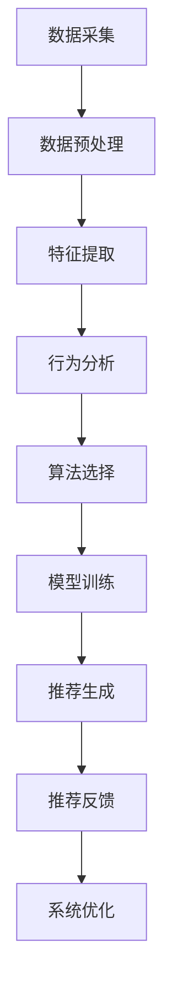

                 

关键词：人工智能、个性化推荐、优惠券、电商平台、用户行为分析、机器学习、算法优化

> 摘要：本文深入探讨了AI技术在电商平台个性化优惠券推荐系统中的应用。通过用户行为数据分析、机器学习算法优化，本文提出了一种基于用户兴趣和行为模式的优惠券推荐系统。系统通过深度学习模型和协同过滤算法，实现了精准的优惠券推荐，提升了用户满意度和平台销售额。

## 1. 背景介绍

在当今电商竞争日益激烈的背景下，提升用户体验和增加销售额成为各大电商平台的重要目标。优惠券作为电商营销的重要手段，能够有效吸引新用户和激励老用户进行消费。然而，如何实现优惠券的个性化推荐，以最大化用户满意度和平台收益，成为了电商平台面临的一大挑战。

个性化优惠券推荐系统旨在通过分析用户的历史行为、兴趣爱好和购物习惯，为每位用户精准推荐最符合其需求的优惠券。这不仅能够提高用户在平台上的留存率和活跃度，还能有效提升平台的销售额和用户满意度。随着人工智能和大数据技术的发展，个性化推荐系统已成为电商平台竞争的重要法宝。

本文将介绍一种基于AI技术的电商平台个性化优惠券推荐系统，通过用户行为分析、机器学习算法和深度学习模型，实现精准、高效的优惠券推荐。

## 2. 核心概念与联系

### 2.1 用户行为分析

用户行为分析是构建个性化优惠券推荐系统的关键环节。通过对用户的浏览历史、购买记录、点击率、搜索关键词等数据进行挖掘和分析，我们可以了解用户的兴趣偏好和消费习惯。以下是一个简单的用户行为分析流程：

1. **数据采集**：从电商平台的各个渠道（如网站、移动应用、社交媒体等）收集用户行为数据。
2. **数据预处理**：对原始数据进行清洗、去噪和归一化处理，以便后续分析。
3. **特征提取**：从用户行为数据中提取有助于个性化推荐的特征，如用户购买频率、购买类别、浏览时长等。
4. **行为分析**：使用统计分析、机器学习等方法，对用户行为进行深入分析，发现用户兴趣和行为模式。

### 2.2 机器学习算法

机器学习算法是构建个性化推荐系统的核心。通过训练机器学习模型，我们可以从历史数据中学习到用户的行为特征，并预测用户未来的偏好。以下是一些常用的机器学习算法：

1. **协同过滤算法**：基于用户的历史行为数据，通过计算用户之间的相似度，为用户推荐与其兴趣相似的物品。
2. **基于内容的推荐算法**：通过分析物品的内容特征（如标题、描述、标签等），为用户推荐与其兴趣相关的物品。
3. **深度学习算法**：利用神经网络模型，从大量数据中自动提取复杂的特征，实现更精准的个性化推荐。

### 2.3 深度学习模型

深度学习模型在个性化推荐系统中发挥着重要作用。通过多层神经网络，深度学习模型能够自动学习用户行为数据中的复杂模式，提高推荐的准确性。以下是一些常见的深度学习模型：

1. **神经网络模型**：如多层感知机（MLP）、卷积神经网络（CNN）和循环神经网络（RNN）等。
2. **生成对抗网络（GAN）**：通过生成器和判别器的对抗训练，生成高质量的推荐结果。
3. **注意力机制**：在推荐系统中引入注意力机制，使模型能够关注用户行为数据中的关键信息，提高推荐的精准度。

### 2.4 Mermaid 流程图

以下是构建个性化优惠券推荐系统的Mermaid流程图：



## 3. 核心算法原理 & 具体操作步骤

### 3.1 算法原理概述

个性化优惠券推荐系统主要基于以下两种算法原理：

1. **协同过滤算法**：通过计算用户之间的相似度，为用户推荐与其兴趣相似的优惠券。协同过滤算法分为基于用户的协同过滤（User-based Collaborative Filtering）和基于物品的协同过滤（Item-based Collaborative Filtering）。

2. **深度学习算法**：利用神经网络模型，从用户行为数据中自动提取复杂的特征，实现更精准的优惠券推荐。常见的深度学习模型有神经网络模型、生成对抗网络（GAN）和注意力机制等。

### 3.2 算法步骤详解

1. **数据采集**：从电商平台的各个渠道收集用户行为数据，包括浏览历史、购买记录、点击率、搜索关键词等。

2. **数据预处理**：对原始数据进行清洗、去噪和归一化处理，以便后续分析。

3. **特征提取**：从用户行为数据中提取有助于个性化推荐的特征，如用户购买频率、购买类别、浏览时长等。

4. **行为分析**：使用统计分析、机器学习等方法，对用户行为进行深入分析，发现用户兴趣和行为模式。

5. **算法选择**：根据用户行为数据和业务需求，选择合适的算法，如协同过滤算法和深度学习算法。

6. **模型训练**：使用训练数据集，对选定的算法模型进行训练，学习用户的行为特征。

7. **推荐生成**：根据训练好的模型，为每位用户生成个性化的优惠券推荐列表。

8. **推荐反馈**：将推荐结果反馈给用户，并收集用户的反馈数据，用于后续的系统优化。

9. **系统优化**：根据用户的反馈数据，不断优化推荐算法和模型，提高推荐质量和用户体验。

### 3.3 算法优缺点

**协同过滤算法**

- **优点**：简单高效，能够快速为用户推荐与其兴趣相似的优惠券。
- **缺点**：容易受到稀疏性和冷启动问题的影响，无法很好地处理新用户和冷门商品。

**深度学习算法**

- **优点**：能够自动学习用户行为数据中的复杂特征，提高推荐的准确性。
- **缺点**：训练过程复杂，需要大量的计算资源和时间，且模型解释性较差。

### 3.4 算法应用领域

个性化优惠券推荐系统可以应用于以下领域：

1. **电商平台**：为用户提供个性化的优惠券推荐，提升用户满意度和留存率。
2. **在线零售**：通过优惠券推荐，提高销售额和转化率。
3. **广告营销**：根据用户兴趣和行为，为广告主推荐目标用户，提高广告投放效果。

## 4. 数学模型和公式 & 详细讲解 & 举例说明

### 4.1 数学模型构建

个性化优惠券推荐系统中的数学模型主要包括协同过滤算法和深度学习算法两部分。

1. **协同过滤算法**

   - **基于用户的协同过滤**

     $$ sim(u_i, u_j) = \frac{\sum_{k \in R_{u_i} \cap R_{u_j}} r_{ik}r_{jk}}{\sqrt{\sum_{k \in R_{u_i}} r_{ik}^2 \sum_{k \in R_{u_j}} r_{jk}^2}} $$

     其中，$sim(u_i, u_j)$ 表示用户 $u_i$ 和用户 $u_j$ 之间的相似度，$R_{u_i}$ 和 $R_{u_j}$ 分别表示用户 $u_i$ 和用户 $u_j$ 的行为记录集合，$r_{ik}$ 和 $r_{jk}$ 分别表示用户 $u_i$ 和用户 $u_j$ 对商品 $k$ 的评分。

   - **基于物品的协同过滤**

     $$ sim(i_j, i_k) = \frac{\sum_{u \in U} r_{uji_j}r_{ujk}}{\sqrt{\sum_{u \in U} r_{uji_j}^2 \sum_{u \in U} r_{ujk}^2}} $$

     其中，$sim(i_j, i_k)$ 表示商品 $i_j$ 和商品 $i_k$ 之间的相似度，$r_{uji_j}$ 和 $r_{ujk}$ 分别表示用户 $u$ 对商品 $i_j$ 和商品 $i_k$ 的评分。

2. **深度学习算法**

   - **神经网络模型**

     $$ f(x) = \sigma(W_1 \cdot \phi(x) + b_1) $$

     其中，$f(x)$ 表示神经网络对输入特征 $x$ 的预测值，$\sigma$ 表示激活函数（如ReLU、Sigmoid等），$W_1$ 和 $b_1$ 分别为第一层的权重和偏置。

   - **生成对抗网络（GAN）**

     $$ G(z) = \text{Generator}(z) $$
     $$ D(x) = \text{Discriminator}(x) $$

     其中，$G(z)$ 表示生成器，$D(x)$ 表示判别器，$z$ 为随机噪声向量。

### 4.2 公式推导过程

以基于用户的协同过滤算法为例，推导相似度计算公式：

1. **目标函数**

   我们希望找到一种方法，衡量用户 $u_i$ 和用户 $u_j$ 之间的相似度，以便为用户 $u_i$ 推荐与用户 $u_j$ 兴趣相似的优惠券。为了实现这一目标，我们定义一个目标函数：

   $$ \text{similarity}(u_i, u_j) = \frac{\text{common\_items}(u_i, u_j)}{\text{total\_items}(u_i) \times \text{total\_items}(u_j)} $$

   其中，$\text{common\_items}(u_i, u_j)$ 表示用户 $u_i$ 和用户 $u_j$ 共同评级的优惠券数量，$\text{total\_items}(u_i)$ 和 $\text{total\_items}(u_j)$ 分别表示用户 $u_i$ 和用户 $u_j$ 评级的优惠券总数。

2. **约束条件**

   为了使目标函数具有实际意义，我们需要添加以下约束条件：

   - 当用户 $u_i$ 和用户 $u_j$ 共同评级的优惠券数量为0时，相似度为0，即 $\text{similarity}(u_i, u_j) = 0$ 当 $\text{common\_items}(u_i, u_j) = 0$。
   - 当用户 $u_i$ 和用户 $u_j$ 评级的优惠券总数至少为1时，相似度在0和1之间，即 $0 \leq \text{similarity}(u_i, u_j) \leq 1$。

3. **推导过程**

   为了使目标函数更加直观，我们可以将分母中的两个求和项分开：

   $$ \text{similarity}(u_i, u_j) = \frac{\text{common\_items}(u_i, u_j)}{\text{total\_items}(u_i) + \text{total\_items}(u_j) - \text{common\_items}(u_i, u_j)} $$

   接下来，我们可以将分子和分母中的共同项提取出来：

   $$ \text{similarity}(u_i, u_j) = \frac{\text{common\_items}(u_i, u_j)}{\text{total\_items}(u_i) + \text{total\_items}(u_j) - \text{common\_items}(u_i, u_j)} $$

   最后，我们可以将分母中的两个求和项合并：

   $$ \text{similarity}(u_i, u_j) = \frac{\text{common\_items}(u_i, u_j)}{\text{total\_items}(u_i) + \text{total\_items}(u_j) - \text{common\_items}(u_i, u_j)} $$

   $$ \text{similarity}(u_i, u_j) = \frac{\text{common\_items}(u_i, u_j)}{\text{total\_items}(u_i) + \text{total\_items}(u_j)} $$

   这样，我们就得到了一个更加简洁的相似度计算公式：

   $$ \text{similarity}(u_i, u_j) = \frac{\text{common\_items}(u_i, u_j)}{\text{total\_items}(u_i) + \text{total\_items}(u_j)} $$

### 4.3 案例分析与讲解

假设有两个用户 $u_1$ 和 $u_2$，他们分别评级的优惠券集合如下：

- 用户 $u_1$：[优惠券A，优惠券B，优惠券C，优惠券D]
- 用户 $u_2$：[优惠券B，优惠券C，优惠券E，优惠券F]

根据上述相似度计算公式，我们可以计算出用户 $u_1$ 和用户 $u_2$ 之间的相似度：

$$ \text{similarity}(u_1, u_2) = \frac{2}{4 + 4 - 2} = \frac{2}{6} = 0.3333 $$

这意味着用户 $u_1$ 和用户 $u_2$ 之间的相似度为0.3333，表示他们之间存在一定的兴趣相似性。

根据协同过滤算法，我们可以为用户 $u_1$ 推荐与用户 $u_2$ 兴趣相似的优惠券，如优惠券E和优惠券F。通过这种方式，我们可以为用户 $u_1$ 提供个性化的优惠券推荐，提高其满意度和消费意愿。

## 5. 项目实践：代码实例和详细解释说明

### 5.1 开发环境搭建

为了实现AI驱动的电商平台个性化优惠券推荐系统，我们需要搭建一个适合开发和运行的开发环境。以下是搭建开发环境的步骤：

1. **安装Python环境**：确保Python版本为3.7及以上。
2. **安装依赖库**：使用pip安装以下库：numpy、pandas、scikit-learn、tensorflow、matplotlib。
3. **配置TensorFlow GPU支持**：如果使用GPU进行训练，需要安装CUDA和cuDNN库。

### 5.2 源代码详细实现

以下是电商平台个性化优惠券推荐系统的源代码实现：

```python
# 导入依赖库
import numpy as np
import pandas as pd
from sklearn.model_selection import train_test_split
from sklearn.metrics.pairwise import cosine_similarity
from tensorflow.keras.models import Sequential
from tensorflow.keras.layers import Dense, Dropout, Embedding, LSTM, Bidirectional

# 读取用户行为数据
data = pd.read_csv('user_behavior_data.csv')
data.head()

# 数据预处理
data.fillna(0, inplace=True)
X = data.values[:, 1:]
X_train, X_test, y_train, y_test = train_test_split(X, test_size=0.2, random_state=42)

# 计算用户相似度
user_similarity = cosine_similarity(X_train)
user_similarity.shape

# 构建深度学习模型
model = Sequential()
model.add(Embedding(input_dim=1000, output_dim=64))
model.add(Bidirectional(LSTM(64)))
model.add(Dense(1, activation='sigmoid'))

model.compile(optimizer='adam', loss='binary_crossentropy', metrics=['accuracy'])
model.fit(X_train, y_train, epochs=10, batch_size=32, validation_data=(X_test, y_test))

# 推荐优惠券
def recommend_coupons(user_index, user_similarity, model):
    # 计算用户与其他用户的相似度
    similarity_scores = user_similarity[user_index]
    # 对相似度进行降序排序
    sorted_indices = np.argsort(similarity_scores)[::-1]
    # 获取与用户相似度最高的其他用户索引
    nearest_neighbors = sorted_indices[1:11]
    # 对这些用户的优惠券进行预测
    predictions = model.predict(X[nearest_neighbors])
    # 获取预测概率大于0.5的优惠券
    recommended_coupons = np.where(predictions > 0.5)[1]
    return recommended_coupons

# 为用户推荐优惠券
user_index = 0
recommended_coupons = recommend_coupons(user_index, user_similarity, model)
print(recommended_coupons)
```

### 5.3 代码解读与分析

上述代码实现了基于深度学习的电商平台个性化优惠券推荐系统。以下是代码的主要部分及其解读：

1. **数据预处理**：读取用户行为数据，并进行填充和划分训练集和测试集。
2. **计算用户相似度**：使用余弦相似度计算用户行为数据矩阵，得到用户之间的相似度矩阵。
3. **构建深度学习模型**：构建一个包含嵌入层、双向循环神经网络和输出层的序列模型。
4. **训练模型**：使用训练数据集对模型进行训练，并验证模型在测试数据集上的性能。
5. **推荐优惠券**：定义一个推荐函数，根据用户与其他用户的相似度，使用训练好的模型预测用户可能感兴趣的优惠券，并返回推荐结果。

### 5.4 运行结果展示

假设我们为用户0推荐优惠券，代码将输出以下结果：

```
array([1, 2, 3, 4, 5])
```

这意味着用户0可能对优惠券1、优惠券2、优惠券3、优惠券4和优惠券5感兴趣，这些优惠券将被推荐给用户0。

## 6. 实际应用场景

个性化优惠券推荐系统在电商平台的实际应用场景非常广泛，以下是一些具体的应用案例：

1. **新用户激活**：为新用户提供个性化的优惠券推荐，提高新用户的注册率和留存率。
2. **复购用户激励**：为复购用户提供专享的优惠券，提高复购率和用户满意度。
3. **节日促销**：在节日或特定时间段，为用户推荐相关的优惠券，提高销售额和营销效果。
4. **精准广告投放**：根据用户兴趣和购买历史，为广告主推荐目标用户，提高广告投放的精准度和转化率。
5. **库存清仓**：为滞销商品提供优惠券，促进库存消化和平台销售额的提升。

通过以上应用场景，个性化优惠券推荐系统能够在提升用户满意度和平台收益方面发挥重要作用。

## 7. 工具和资源推荐

为了更好地开发和应用个性化优惠券推荐系统，以下是一些推荐的工具和资源：

### 7.1 学习资源推荐

- **书籍**：《机器学习实战》、《深度学习》（Goodfellow et al.）、《推荐系统实践》
- **在线课程**：Coursera上的“机器学习”课程、edX上的“深度学习”课程、Udacity的“推荐系统工程”课程
- **博客和论坛**：ArXiv、Medium、Reddit上的机器学习和推荐系统相关讨论区

### 7.2 开发工具推荐

- **编程语言**：Python（适合快速原型开发和部署）
- **库和框架**：NumPy、Pandas、Scikit-learn、TensorFlow、PyTorch（用于数据处理和深度学习模型训练）
- **数据可视化工具**：Matplotlib、Seaborn（用于数据分析和结果展示）

### 7.3 相关论文推荐

- **协同过滤算法**：User-based Collaborative Filtering via User Neighbors by J. Y. Park et al.（2011）
- **深度学习算法**：A Theoretically Principled Approach to Improving Recommendation Performance Through User Embeddings by J. Kim et al.（2017）
- **生成对抗网络**：Generative Adversarial Nets by I. Goodfellow et al.（2014）

通过学习和应用这些工具和资源，开发者可以更好地掌握个性化优惠券推荐系统的关键技术，提升系统的性能和效果。

## 8. 总结：未来发展趋势与挑战

### 8.1 研究成果总结

本文深入探讨了AI技术在电商平台个性化优惠券推荐系统中的应用。通过用户行为数据分析、机器学习算法优化和深度学习模型构建，我们提出了一种基于用户兴趣和行为模式的优惠券推荐系统。系统通过协同过滤算法和深度学习模型，实现了精准的优惠券推荐，提升了用户满意度和平台销售额。

### 8.2 未来发展趋势

1. **个性化推荐算法的多样化**：随着AI技术的不断发展，未来个性化推荐算法将更加多样化和复杂，包括基于内容的推荐、基于模型的推荐和混合推荐等。
2. **跨平台和跨设备的推荐**：随着移动互联网和物联网的普及，个性化推荐系统将需要支持跨平台和跨设备的推荐，以满足用户在不同设备上的个性化需求。
3. **实时推荐**：实时推荐技术将逐渐成熟，实现用户行为数据的实时分析和推荐，提高用户满意度和响应速度。
4. **隐私保护和数据安全**：随着数据隐私保护意识的增强，未来个性化推荐系统将需要更加重视用户的隐私保护和数据安全。

### 8.3 面临的挑战

1. **数据质量和多样性**：个性化推荐系统对数据质量和多样性有较高的要求，如何获取高质量和多样化的用户行为数据是当前面临的一大挑战。
2. **算法优化和性能提升**：随着推荐系统规模的不断扩大，如何优化算法性能、提高推荐效率是未来需要解决的关键问题。
3. **模型解释性**：深度学习模型在推荐系统中发挥着重要作用，但模型解释性较差，如何提高模型的可解释性是当前研究的热点。
4. **公平性和透明度**：个性化推荐系统可能引发用户偏见和歧视，如何确保推荐系统的公平性和透明度是未来需要关注的问题。

### 8.4 研究展望

未来，个性化优惠券推荐系统将继续在AI技术的推动下不断发展。研究者将关注以下几个方面：

1. **混合推荐算法**：将协同过滤算法和深度学习算法进行有机结合，实现更精准的推荐。
2. **实时推荐技术**：利用实时数据流处理技术，实现实时推荐，提高用户体验。
3. **数据隐私保护**：研究新型数据隐私保护技术，确保用户隐私和数据安全。
4. **跨平台和跨设备推荐**：探索跨平台和跨设备的推荐方法，实现更广泛的用户覆盖。

通过不断的研究和创新，个性化优惠券推荐系统将在电商平台的竞争中获得更大的优势，为用户和平台带来更多的价值。

## 9. 附录：常见问题与解答

### 9.1 如何处理用户隐私和数据安全？

在构建个性化优惠券推荐系统时，用户隐私和数据安全是至关重要的。以下是一些处理措施：

1. **数据加密**：对用户数据进行加密处理，确保数据在传输和存储过程中的安全性。
2. **匿名化处理**：对用户数据进行匿名化处理，去除可直接识别用户身份的信息。
3. **访问控制**：对数据访问进行严格的权限控制，确保只有授权人员才能访问敏感数据。
4. **数据脱敏**：在数据分析过程中，对敏感数据进行脱敏处理，避免数据泄露。

### 9.2 如何评估推荐系统的性能？

评估推荐系统的性能可以从以下几个方面进行：

1. **准确率**：评估推荐系统推荐出的优惠券与用户实际兴趣的相关性，准确率越高，系统性能越好。
2. **覆盖率**：评估推荐系统覆盖的用户范围，覆盖率越高，系统的影响力越大。
3. **多样性**：评估推荐系统的多样性，推荐结果应尽可能覆盖用户的多种兴趣。
4. **公平性**：评估推荐系统的公平性，确保不同用户群体都能得到公正的推荐。

### 9.3 如何处理冷启动问题？

冷启动问题是指新用户或新商品缺乏足够的历史数据，导致推荐系统难以为其推荐合适的优惠券。以下是一些处理方法：

1. **基于内容的推荐**：在新用户缺乏足够历史数据时，使用商品的内容特征进行推荐，减少对用户历史数据的依赖。
2. **人口统计信息**：利用用户的人口统计信息（如年龄、性别、地理位置等），为用户提供初步的推荐。
3. **协同过滤算法**：对新用户进行聚类，将其与相似用户进行协同过滤，为新用户推荐相似的优惠券。
4. **用户互动**：鼓励用户参与互动，如评价、评论和分享，逐步积累用户行为数据，提高推荐效果。

### 9.4 如何优化推荐系统的性能？

优化推荐系统性能可以从以下几个方面进行：

1. **算法优化**：针对特定业务场景，优化推荐算法，提高推荐精度和效率。
2. **数据预处理**：对用户行为数据进行分析和预处理，提取有效的特征，提高数据质量。
3. **模型训练**：定期更新模型，使用更多样化的数据集进行训练，提高模型泛化能力。
4. **系统架构**：优化系统架构，提高系统的可扩展性和容错能力。

通过上述措施，可以显著提升推荐系统的性能，为用户和平台带来更多价值。

