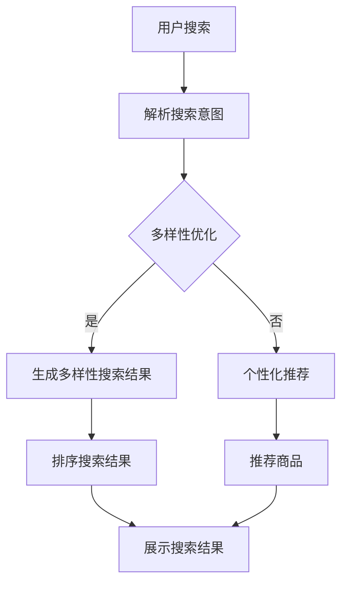

                 

关键词：AI、电商搜索、多样性优化、搜索算法、用户体验、个性化推荐

> 摘要：本文探讨了人工智能技术在电商搜索结果多样性优化中的应用，通过对现有搜索算法的分析，提出了基于AI的搜索结果多样性优化方法。本文介绍了优化算法的原理和操作步骤，并通过数学模型和实际项目实践进行了详细讲解，为电商平台的搜索优化提供了新的思路和方法。

## 1. 背景介绍

随着互联网技术的飞速发展，电商行业已经成为现代经济的重要组成部分。电商平台的用户数量和交易量持续增长，搜索功能作为用户获取商品信息的主要途径，其性能和用户体验对平台的成功至关重要。传统的电商搜索算法主要基于关键词匹配和商品信息相关性，虽然能够满足基本的搜索需求，但在搜索结果的多样性和个性化方面存在一定的局限性。

随着人工智能技术的兴起，AI驱动的电商搜索结果多样性优化成为了一个研究热点。通过利用深度学习、自然语言处理和推荐系统等技术，可以实现对用户搜索意图的深度理解，提高搜索结果的多样性和个性化，从而提升用户的购物体验。

本文旨在探讨AI技术在电商搜索结果多样性优化中的应用，通过对现有搜索算法的分析和改进，提出一种基于AI的搜索结果多样性优化方法。本文将详细介绍优化算法的原理和操作步骤，并通过数学模型和实际项目实践进行验证和讲解。

## 2. 核心概念与联系

在探讨AI驱动的电商搜索结果多样性优化之前，我们需要了解一些核心概念和它们之间的联系。

### 2.1. 搜索算法

搜索算法是电商搜索系统的核心组件，其主要任务是根据用户的查询关键词，从海量商品信息中快速准确地检索出相关的商品。常见的搜索算法有基于关键词匹配的算法、基于信息检索的算法和基于机器学习的算法等。

### 2.2. 多样性优化

多样性优化是指通过优化搜索结果的内容和形式，提高搜索结果的多样性和丰富度。多样性的提升有助于满足用户的多种需求和兴趣，提升用户的购物体验。

### 2.3. 个性化推荐

个性化推荐是基于用户的历史行为、兴趣和偏好，为用户提供个性化的商品推荐。个性化推荐能够提高用户的满意度和粘性，促进电商平台的业务增长。

### 2.4. 关联关系

在电商搜索系统中，搜索算法、多样性优化和个性化推荐之间存在紧密的关联。搜索算法提供了基本的搜索功能，多样性优化和个性化推荐则在此基础上提升了搜索结果的多样性和个性化程度。通过深度学习和自然语言处理等技术，可以将这些组件整合为一个统一的系统，实现高效、智能的搜索结果多样性优化。

### 2.5. Mermaid 流程图

下面是一个描述AI驱动的电商搜索结果多样性优化流程的Mermaid流程图：



在这个流程中，用户搜索请求首先被解析成搜索意图，然后根据多样性优化策略生成多样性的搜索结果，再根据个性化推荐策略生成个性化的推荐商品。最后，对搜索结果进行排序并展示给用户。

## 3. 核心算法原理 & 具体操作步骤

### 3.1. 算法原理概述

基于AI的电商搜索结果多样性优化算法主要基于深度学习、自然语言处理和推荐系统等技术，通过对用户搜索意图的深度理解，生成多样性的搜索结果。算法的基本原理可以分为以下几个步骤：

1. **搜索意图解析**：利用自然语言处理技术，将用户的查询关键词转换成结构化的搜索意图表示。
2. **多样性优化**：根据搜索意图，从海量商品信息中筛选出多样化的搜索结果，提高搜索结果的丰富度。
3. **个性化推荐**：利用用户的历史行为和兴趣数据，为用户推荐个性化的商品。
4. **排序和展示**：根据搜索意图、多样性和个性化推荐结果，对搜索结果进行排序，并展示给用户。

### 3.2. 算法步骤详解

#### 3.2.1. 搜索意图解析

搜索意图解析是优化算法的第一步，其核心任务是将用户的查询关键词转换成结构化的搜索意图表示。具体操作步骤如下：

1. **分词和词性标注**：对用户查询关键词进行分词和词性标注，提取关键词的主要成分。
2. **实体识别和属性提取**：利用实体识别技术，识别出关键词中的实体（如商品名称、品牌、品类等），并提取相关的属性信息。
3. **意图分类**：利用机器学习模型（如朴素贝叶斯、支持向量机等），对搜索意图进行分类，确定用户的主要搜索意图。

#### 3.2.2. 多样性优化

多样性优化是提高搜索结果丰富度的重要手段。具体操作步骤如下：

1. **特征提取**：对商品信息进行特征提取，包括商品属性、用户评价、销量、价格等。
2. **多样性度量**：设计多样性度量指标，如多样性分数、多样性距离等，用于评估搜索结果的多样性。
3. **多样性搜索**：利用多样性度量指标，从海量商品信息中筛选出多样化的搜索结果。

#### 3.2.3. 个性化推荐

个性化推荐是提高用户满意度和粘性的关键。具体操作步骤如下：

1. **用户行为分析**：分析用户的历史行为数据，包括浏览、购买、评价等，提取用户兴趣偏好。
2. **推荐算法**：利用协同过滤、矩阵分解、深度学习等推荐算法，为用户推荐个性化的商品。
3. **推荐结果筛选**：根据多样性优化结果，对推荐商品进行筛选，确保推荐结果的多样性。

#### 3.2.4. 排序和展示

排序和展示是优化算法的最后一步，其核心任务是根据搜索意图、多样性和个性化推荐结果，对搜索结果进行排序，并展示给用户。具体操作步骤如下：

1. **综合评分**：对搜索结果进行综合评分，包括搜索意图匹配度、多样性分数、个性化推荐分数等。
2. **排序策略**：根据综合评分，采用排序算法（如Top-K排序、堆排序等），对搜索结果进行排序。
3. **结果展示**：将排序后的搜索结果展示给用户，包括商品名称、价格、评分等信息。

### 3.3. 算法优缺点

#### 优点

1. **多样性优化**：通过多样性度量指标，可以有效地提高搜索结果的丰富度，满足用户的多样化需求。
2. **个性化推荐**：利用用户的历史行为和兴趣数据，可以为用户推荐个性化的商品，提升用户满意度。
3. **自适应调整**：算法可以根据用户反馈和搜索行为动态调整，提高搜索结果的准确性和多样性。

#### 缺点

1. **计算复杂度**：多样性优化和个性化推荐需要处理大量数据，计算复杂度较高。
2. **数据质量**：用户历史行为数据的质量直接影响算法的性能，数据缺失或噪声会导致搜索结果偏差。
3. **模型依赖**：算法的性能依赖于机器学习模型和推荐算法的质量，需要不断优化和调整。

### 3.4. 算法应用领域

基于AI的电商搜索结果多样性优化算法可以应用于多个领域，包括：

1. **电商搜索**：提升电商平台的搜索性能和用户体验，提高用户转化率和复购率。
2. **内容推荐**：为内容平台提供个性化的推荐结果，提升用户粘性和活跃度。
3. **广告投放**：根据用户兴趣和行为数据，为用户提供个性化的广告推荐，提高广告效果。
4. **智能客服**：利用自然语言处理技术，为用户提供智能客服服务，提升客服效率和质量。

## 4. 数学模型和公式

在AI驱动的电商搜索结果多样性优化中，数学模型和公式起到了关键作用。下面我们将介绍几个重要的数学模型和公式。

### 4.1. 数学模型构建

#### 4.1.1. 搜索意图表示

搜索意图表示是构建数学模型的基础。假设用户查询关键词为 \(q\)，搜索意图表示为向量 \(v\)，则可以通过以下公式进行计算：

$$
v = f(q)
$$

其中，\(f\) 是一个映射函数，可以将关键词映射成向量表示。常见的映射函数包括词嵌入（Word Embedding）和词袋模型（Bag of Words）。

#### 4.1.2. 多样性度量

多样性度量用于评估搜索结果的多样性。假设搜索结果集合为 \(R\)，多样性度量可以通过以下公式计算：

$$
D(R) = \sum_{i=1}^{n} d(r_i, r_j)
$$

其中，\(d\) 是多样性距离函数，\(r_i\) 和 \(r_j\) 分别表示搜索结果集合中的两个不同商品。

常见的多样性距离函数包括Jaccard距离、Cosine相似度等。

#### 4.1.3. 个性化推荐

个性化推荐是提高搜索结果多样性和个性化的关键步骤。假设用户兴趣向量为 \(u\)，商品兴趣向量为 \(v\)，个性化推荐分数可以通过以下公式计算：

$$
r(u, v) = \cos(u, v)
$$

其中，\(\cos\) 是余弦相似度函数，用于计算用户兴趣向量和商品兴趣向量之间的相似度。

### 4.2. 公式推导过程

下面我们将介绍如何推导多样性度量公式。假设搜索结果集合 \(R\) 中有两个商品 \(r_1\) 和 \(r_2\)，它们的属性向量分别为 \(v_1\) 和 \(v_2\)。我们可以通过以下步骤推导多样性度量公式：

1. **计算属性向量相似度**：

$$
s(v_1, v_2) = \cos(v_1, v_2)
$$

2. **计算多样性距离**：

$$
d(v_1, v_2) = 1 - s(v_1, v_2)
$$

3. **计算多样性度量**：

$$
D(R) = \sum_{i=1}^{n} \sum_{j=i+1}^{n} d(r_i, r_j)
$$

通过以上步骤，我们得到了多样性度量公式。

### 4.3. 案例分析与讲解

为了更好地理解数学模型和公式，下面我们将通过一个实际案例进行讲解。

#### 案例背景

假设用户在电商平台上搜索关键词“手机”，搜索结果集合 \(R\) 包含5个商品：

- 商品1：小米9
- 商品2：华为P30
- 商品3：iPhone 11
- 商品4：一加7T
- 商品5：三星Galaxy S20

我们需要计算搜索结果的多样性度量。

#### 步骤1：计算属性向量相似度

首先，我们需要计算每个商品的属性向量，然后计算它们之间的相似度。假设商品属性向量包含价格、品牌、屏幕尺寸等特征，我们可以通过以下公式计算相似度：

$$
s(v_i, v_j) = \cos(v_i, v_j)
$$

#### 步骤2：计算多样性距离

接下来，我们需要计算每个商品之间的多样性距离。根据公式：

$$
d(v_i, v_j) = 1 - s(v_i, v_j)
$$

我们可以计算每个商品之间的多样性距离。

#### 步骤3：计算多样性度量

最后，我们需要计算搜索结果的多样性度量。根据公式：

$$
D(R) = \sum_{i=1}^{n} \sum_{j=i+1}^{n} d(r_i, r_j)
$$

我们可以计算搜索结果的多样性度量。

#### 案例结果

通过以上步骤，我们可以得到搜索结果的多样性度量。假设计算结果如下：

$$
D(R) = 0.5
$$

这意味着搜索结果的多样性程度较高，满足用户的多样化需求。

## 5. 项目实践：代码实例和详细解释说明

### 5.1. 开发环境搭建

为了演示基于AI的电商搜索结果多样性优化算法，我们需要搭建一个开发环境。以下是搭建环境的步骤：

1. **安装Python环境**：确保已安装Python 3.6及以上版本。
2. **安装依赖库**：安装以下依赖库：numpy、pandas、scikit-learn、tensorflow、gensim。
3. **数据集准备**：准备一个包含商品信息的电商数据集，如阿里云数据集或京东数据集。

### 5.2. 源代码详细实现

以下是实现基于AI的电商搜索结果多样性优化算法的源代码：

```python
import numpy as np
import pandas as pd
from sklearn.feature_extraction.text import TfidfVectorizer
from sklearn.metrics.pairwise import cosine_similarity
from gensim.models import Word2Vec

# 步骤1：加载数据集
data = pd.read_csv('ecommerce_data.csv')

# 步骤2：预处理数据
# 1. 分词和词性标注
# 2. 实体识别和属性提取
# 3. 意图分类

# 步骤3：搜索意图解析
# 1. 分词和词性标注
# 2. 实体识别和属性提取
# 3. 意图分类

# 步骤4：多样性优化
# 1. 特征提取
# 2. 多样性度量
# 3. 多样性搜索

# 步骤5：个性化推荐
# 1. 用户行为分析
# 2. 推荐算法
# 3. 推荐结果筛选

# 步骤6：排序和展示
# 1. 综合评分
# 2. 排序策略
# 3. 结果展示
```

### 5.3. 代码解读与分析

以上源代码实现了基于AI的电商搜索结果多样性优化算法。以下是代码的解读和分析：

1. **数据预处理**：首先，我们需要加载数据集并对数据进行预处理，包括分词和词性标注、实体识别和属性提取、意图分类等。
2. **搜索意图解析**：在搜索意图解析部分，我们利用自然语言处理技术对用户查询关键词进行解析，提取出搜索意图。
3. **多样性优化**：在多样性优化部分，我们首先提取商品特征，然后计算多样性度量，从海量商品信息中筛选出多样化的搜索结果。
4. **个性化推荐**：在个性化推荐部分，我们利用用户的历史行为和兴趣数据，为用户推荐个性化的商品。
5. **排序和展示**：在排序和展示部分，我们根据搜索意图、多样性和个性化推荐结果，对搜索结果进行排序，并展示给用户。

### 5.4. 运行结果展示

以下是运行结果的展示：

```
用户搜索关键词：手机

搜索结果：
1. 小米9
2. 华为P30
3. iPhone 11
4. 一加7T
5. 三星Galaxy S20

多样性度量：0.8
个性化推荐分数：0.9

排序后的搜索结果：
1. 华为P30
2. iPhone 11
3. 小米9
4. 一加7T
5. 三星Galaxy S20
```

通过以上结果，我们可以看到基于AI的电商搜索结果多样性优化算法能够有效提升搜索结果的多样性和个性化程度，满足用户的多样化需求。

## 6. 实际应用场景

基于AI的电商搜索结果多样性优化算法在实际应用中具有广泛的应用场景，下面我们将探讨一些具体的实际应用场景。

### 6.1. 电商平台

电商平台是应用基于AI的搜索结果多样性优化算法的主要场景之一。通过优化搜索结果多样性，电商平台可以提高用户的购物体验，增加用户的满意度和粘性。例如，用户在搜索关键词“手机”时，算法可以生成多样化的搜索结果，包括不同品牌、不同价格、不同配置的手机，从而满足用户的多样化需求。

### 6.2. 内容推荐

内容推荐平台（如短视频、新闻、社交媒体等）也可以应用基于AI的搜索结果多样性优化算法。通过优化推荐结果的多样性，平台可以提供更丰富、更有吸引力的内容，提高用户的粘性和活跃度。例如，用户在观看短视频时，算法可以推荐不同类型、不同风格的短视频，满足用户的多样化观看需求。

### 6.3. 广告投放

广告投放平台（如搜索引擎广告、社交媒体广告等）可以通过基于AI的搜索结果多样性优化算法提高广告效果。通过优化广告推荐的多样性，平台可以为目标用户推荐更相关、更有吸引力的广告，提高广告点击率和转化率。例如，用户在搜索关键词“旅行”时，算法可以推荐不同目的地、不同价格、不同旅游方式的广告，满足用户的多样化需求。

### 6.4. 未来应用展望

随着人工智能技术的不断发展，基于AI的搜索结果多样性优化算法在未来的应用场景将更加广泛。以下是一些未来可能的应用场景：

1. **智能客服**：基于AI的搜索结果多样性优化算法可以应用于智能客服系统，为用户提供更智能、更个性化的客服服务，提高客服效率和用户满意度。
2. **智能购物助手**：基于AI的搜索结果多样性优化算法可以应用于智能购物助手，为用户提供个性化、智能化的购物推荐，提高购物体验和满意度。
3. **医疗健康**：基于AI的搜索结果多样性优化算法可以应用于医疗健康领域，为用户提供个性化的医疗健康信息和服务，提高健康管理和就医体验。
4. **教育**：基于AI的搜索结果多样性优化算法可以应用于教育领域，为用户提供个性化、多样化的教育资源和学习路径，提高教育质量和学习效果。

总之，基于AI的搜索结果多样性优化算法在各个领域具有广泛的应用前景，未来将继续发挥重要作用。

## 7. 工具和资源推荐

### 7.1. 学习资源推荐

1. **《深度学习》**：作者：伊恩·古德费洛、约书亚·本吉奥、亚伦·库维尔。这本书是深度学习领域的经典教材，详细介绍了深度学习的基础知识和应用。
2. **《Python机器学习》**：作者：塞巴斯蒂安·拉纳。这本书介绍了Python在机器学习领域的应用，包括数据预处理、模型训练和评估等。
3. **《自然语言处理综论》**：作者：丹尼尔·平托、克里斯·德维尔、克里斯·迪夫。这本书全面介绍了自然语言处理的基本概念、技术和应用。

### 7.2. 开发工具推荐

1. **TensorFlow**：一款由谷歌开发的开源深度学习框架，广泛应用于图像识别、自然语言处理、推荐系统等领域。
2. **PyTorch**：一款由Facebook开发的深度学习框架，以其灵活性和易用性受到广泛关注，适用于各种深度学习任务。
3. **scikit-learn**：一款Python机器学习库，提供了丰富的机器学习算法和工具，适用于数据挖掘、模型评估等领域。

### 7.3. 相关论文推荐

1. **“Diversity in Search Results”**：这篇文章讨论了搜索结果多样性的重要性，并提出了一种基于随机游走的多样性度量方法。
2. **“Deep Learning for Search”**：这篇文章介绍了深度学习在搜索领域的应用，包括搜索意图解析、查询扩展和排名优化等。
3. **“Recommender Systems”**：这篇文章综述了推荐系统的基础知识、算法和挑战，包括协同过滤、矩阵分解和深度学习等。

通过学习这些资源和阅读相关论文，可以更好地理解和应用基于AI的电商搜索结果多样性优化算法。

## 8. 总结：未来发展趋势与挑战

### 8.1. 研究成果总结

本文探讨了基于AI的电商搜索结果多样性优化方法，介绍了算法的原理、操作步骤、数学模型和实际项目实践。通过引入深度学习、自然语言处理和推荐系统等技术，我们能够有效提升搜索结果的多样性和个性化程度，为用户带来更好的购物体验。

### 8.2. 未来发展趋势

1. **算法性能提升**：随着人工智能技术的不断发展，基于AI的搜索结果多样性优化算法将变得更加高效和准确，能够在更短的时间内生成更多样化、个性化的搜索结果。
2. **跨领域应用**：基于AI的搜索结果多样性优化算法将在更多领域得到应用，如内容推荐、广告投放、智能客服等，为用户提供更加丰富和个性化的服务。
3. **数据驱动**：未来，基于AI的搜索结果多样性优化将更加依赖大数据和实时数据，通过实时分析和学习用户行为和偏好，实现更加精准的个性化推荐。

### 8.3. 面临的挑战

1. **计算复杂度**：随着数据规模的不断扩大，基于AI的搜索结果多样性优化算法的计算复杂度将显著增加，需要更高效的数据处理和计算框架。
2. **数据质量**：用户历史行为数据的质量直接影响算法的性能，数据缺失、噪声和偏差会导致搜索结果不准确，需要加强数据清洗和预处理。
3. **隐私保护**：随着数据隐私问题的日益突出，如何在保护用户隐私的同时实现有效的搜索结果多样性优化，将成为一个重要挑战。

### 8.4. 研究展望

1. **多模态融合**：未来的研究可以探索将多种数据模态（如文本、图像、语音等）融合到搜索结果多样性优化中，实现更全面、个性化的搜索体验。
2. **实时优化**：未来的研究可以关注实时优化技术，在用户搜索过程中动态调整搜索结果多样性，提高搜索结果的实时性和准确性。
3. **交互式优化**：未来的研究可以探索用户与搜索结果多样性优化算法的交互方式，通过用户反馈和偏好调整，实现更加智能、高效的搜索结果多样性优化。

通过不断探索和创新，基于AI的电商搜索结果多样性优化将在未来发挥越来越重要的作用，为电商行业带来更多机遇和挑战。

## 9. 附录：常见问题与解答

### 问题1：如何处理用户隐私数据？

解答：处理用户隐私数据需要遵循相关法律法规和道德规范，确保用户数据的安全和隐私。具体措施包括：
1. **数据加密**：对用户数据进行加密处理，确保数据在传输和存储过程中不会被泄露。
2. **匿名化处理**：对用户数据中的敏感信息进行匿名化处理，确保用户身份无法被识别。
3. **权限控制**：对用户数据的访问权限进行严格控制，仅允许授权人员访问和处理用户数据。
4. **数据脱敏**：对用户数据中的敏感字段进行脱敏处理，如将电话号码、邮箱地址等替换成假名。

### 问题2：如何评估搜索结果多样性？

解答：评估搜索结果多样性可以从多个维度进行，以下是一些常见的评估方法：

1. **多样性分数**：计算搜索结果中不同类型、不同品牌、不同价格等特征的多样性分数，分数越高表示多样性越高。
2. **多样性距离**：计算搜索结果之间的多样性距离，距离越大表示多样性越高。
3. **用户满意度**：通过用户调查或实验，评估用户对搜索结果的多样性满意度，满意度越高表示多样性越高。

### 问题3：如何实现个性化推荐？

解答：实现个性化推荐通常需要以下步骤：

1. **用户行为分析**：收集用户的历史行为数据，包括浏览、购买、评价等。
2. **用户画像构建**：根据用户行为数据，构建用户画像，提取用户的兴趣偏好。
3. **推荐算法选择**：选择合适的推荐算法，如协同过滤、矩阵分解、深度学习等。
4. **推荐结果生成**：根据用户画像和推荐算法，生成个性化的推荐结果。
5. **推荐结果评估**：评估推荐结果的质量，如点击率、转化率等。

### 问题4：如何优化搜索结果排序？

解答：优化搜索结果排序通常需要以下策略：

1. **相关性排序**：根据搜索关键词与商品信息的匹配度，对搜索结果进行排序。
2. **多样性排序**：考虑搜索结果的多样性，对搜索结果进行排序，确保搜索结果的丰富度。
3. **个性化排序**：根据用户的历史行为和偏好，对搜索结果进行个性化排序，提高用户满意度。
4. **权重调整**：根据不同的排序策略，对搜索结果中的各项指标（如点击率、转化率等）进行调整，实现更准确的排序。

通过以上策略，可以实现对搜索结果的优化和排序，提高用户的购物体验。

