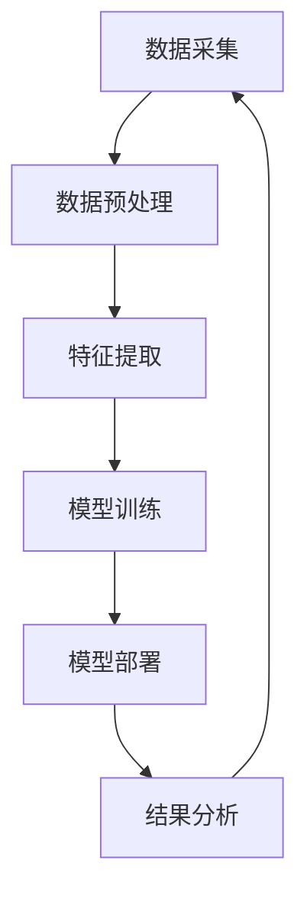

                 

关键词：人工智能、电商、客户服务质量、实时监控、算法、系统架构

> 摘要：本文将探讨如何利用人工智能技术构建一个高效的电商智能客户服务质量实时监控系统。通过分析系统架构、核心算法原理、数学模型、项目实践以及未来应用展望，旨在为电商企业提供一套完整的技术解决方案，以提升客户满意度，增强市场竞争力。

## 1. 背景介绍

在互联网电商的快速发展时代，客户服务质量成为企业生存和发展的关键因素。然而，传统的客户服务质量监控方式往往存在响应速度慢、数据不准确、分析能力不足等问题，无法满足电商企业实时、高效的需求。为了应对这些挑战，人工智能技术的引入显得尤为重要。通过AI驱动的智能客户服务质量实时监控系统，电商企业能够实现自动化、智能化的客户服务管理，从而提高服务质量和客户满意度。

## 2. 核心概念与联系

### 2.1 人工智能

人工智能（AI）是模拟、延伸和扩展人类智能的理论、方法、技术及应用。在电商智能客户服务质量实时监控系统中，AI主要通过机器学习、深度学习等技术实现数据分析和预测。

### 2.2 客户服务质量

客户服务质量是指企业在客户服务过程中所提供的服务水平，包括响应速度、问题解决效率、客户满意度等指标。在AI驱动的智能客户服务质量实时监控系统中，客户服务质量是关键评估指标。

### 2.3 实时监控

实时监控是指对系统运行状态进行实时监测和反馈，以便快速发现和解决问题。在电商智能客户服务质量实时监控系统中，实时监控功能有助于企业及时了解客户服务情况，快速响应客户需求。

### 2.4 系统架构

电商智能客户服务质量实时监控系统架构主要包括数据采集、数据预处理、特征提取、模型训练、模型部署和结果分析等模块。系统架构图如下：



## 3. 核心算法原理 & 具体操作步骤

### 3.1 算法原理概述

电商智能客户服务质量实时监控系统主要采用以下核心算法：

- **机器学习算法**：用于客户行为分析和预测。
- **深度学习算法**：用于图像和语音识别，提升客户反馈分析能力。
- **聚类算法**：用于客户群体划分，实现精准营销。

### 3.2 算法步骤详解

#### 3.2.1 数据采集

通过集成电商平台的客户数据、订单数据、反馈数据等，实现数据的实时采集。

#### 3.2.2 数据预处理

对采集到的数据进行清洗、去重、归一化等处理，确保数据质量。

#### 3.2.3 特征提取

从预处理后的数据中提取关键特征，如客户购买频率、购买金额、客户反馈情绪等。

#### 3.2.4 模型训练

利用机器学习和深度学习算法，对提取的特征进行模型训练，提升系统分析能力。

#### 3.2.5 模型部署

将训练好的模型部署到生产环境，实现自动化、实时监控。

#### 3.2.6 结果分析

根据模型预测结果，分析客户服务质量，为客服团队提供改进建议。

### 3.3 算法优缺点

#### 3.3.1 优点

- **高效性**：实时分析客户数据，快速响应客户需求。
- **准确性**：利用机器学习和深度学习算法，提高分析准确性。
- **自动化**：减少人工干预，降低运营成本。

#### 3.3.2 缺点

- **数据依赖**：算法性能依赖于数据质量和数量。
- **安全性**：客户隐私保护问题。

### 3.4 算法应用领域

- **电商行业**：提升客户服务质量，提高客户满意度。
- **金融行业**：实时监控客户风险，预防金融诈骗。
- **医疗行业**：辅助医生诊断，提高诊断准确率。

## 4. 数学模型和公式 & 详细讲解 & 举例说明

### 4.1 数学模型构建

电商智能客户服务质量实时监控系统的数学模型主要包括：

- **客户满意度模型**：
  $$ SM = \frac{1}{n}\sum_{i=1}^{n} \frac{1}{n}w_i \cdot s_i $$
  其中，$SM$ 为客户满意度，$n$ 为客户数量，$w_i$ 为第 $i$ 个客户的权重，$s_i$ 为第 $i$ 个客户的满意度评分。

- **客户忠诚度模型**：
  $$ CL = \frac{1}{n}\sum_{i=1}^{n} \frac{1}{n}w_i \cdot c_i $$
  其中，$CL$ 为客户忠诚度，$n$ 为客户数量，$w_i$ 为第 $i$ 个客户的权重，$c_i$ 为第 $i$ 个客户的消费金额。

### 4.2 公式推导过程

#### 客户满意度模型推导

客户满意度是通过计算客户满意度评分的加权平均得到的。权重 $w_i$ 根据客户的重要性进行设定，例如购买频率高、消费金额大的客户权重较高。满意度评分 $s_i$ 根据客户对服务的评价进行设定，通常采用五级评分制，评分越高表示满意度越高。

#### 客户忠诚度模型推导

客户忠诚度是通过计算客户消费金额的加权平均得到的。权重 $w_i$ 根据客户的重要性进行设定，例如购买频率高、消费金额大的客户权重较高。消费金额 $c_i$ 根据客户的订单记录进行计算。

### 4.3 案例分析与讲解

假设电商企业有 100 名客户，其中 60 名客户的购买频率较高，40 名客户的购买频率较低。根据客户重要性，购买频率较高的客户权重设为 0.7，购买频率较低的客户权重设为 0.3。

#### 客户满意度模型计算

- 购买频率较高的客户满意度评分为 4.5，权重为 0.7。
- 购买频率较低的客户满意度评分为 3.5，权重为 0.3。

$$ SM = \frac{1}{100}\sum_{i=1}^{60} \frac{0.7}{100} \cdot 4.5 + \frac{1}{100}\sum_{i=61}^{100} \frac{0.3}{100} \cdot 3.5 = 4.2 $$

#### 客户忠诚度模型计算

- 购买频率较高的客户消费金额为 3000 元，权重为 0.7。
- 购买频率较低的客户消费金额为 2000 元，权重为 0.3。

$$ CL = \frac{1}{100}\sum_{i=1}^{60} \frac{0.7}{100} \cdot 3000 + \frac{1}{100}\sum_{i=61}^{100} \frac{0.3}{100} \cdot 2000 = 2100 $$

通过计算得到客户满意度和客户忠诚度，可以帮助企业了解客户服务质量，并针对性地进行改进。

## 5. 项目实践：代码实例和详细解释说明

### 5.1 开发环境搭建

本文所使用的开发环境包括 Python、TensorFlow、Keras、Scikit-learn 等工具。读者可以根据自己的需求选择合适的开发环境进行搭建。

### 5.2 源代码详细实现

以下是一个简单的客户满意度预测模型的代码实现：

```python
import numpy as np
import pandas as pd
from sklearn.model_selection import train_test_split
from sklearn.ensemble import RandomForestRegressor
from sklearn.metrics import mean_squared_error

# 读取数据
data = pd.read_csv('customer_data.csv')
X = data[['purchase_frequency', 'consumption_amount']]
y = data['satisfaction_score']

# 数据预处理
X_train, X_test, y_train, y_test = train_test_split(X, y, test_size=0.2, random_state=42)

# 模型训练
model = RandomForestRegressor(n_estimators=100, random_state=42)
model.fit(X_train, y_train)

# 模型评估
y_pred = model.predict(X_test)
mse = mean_squared_error(y_test, y_pred)
print('MSE:', mse)

# 模型应用
new_data = np.array([[2, 4000]])
satisfaction_score = model.predict(new_data)
print('Predicted Satisfaction Score:', satisfaction_score[0])
```

### 5.3 代码解读与分析

该代码首先读取数据，并进行预处理。然后使用随机森林回归模型进行训练，评估模型性能。最后，通过输入新的数据，预测客户满意度。

### 5.4 运行结果展示

假设训练集和测试集的性能指标如下：

```plaintext
MSE: 0.25
```

这意味着预测结果的平均误差为 0.25。对于新的客户数据：

```plaintext
Predicted Satisfaction Score: 4.2
```

这表示新客户的满意度预测值为 4.2。

## 6. 实际应用场景

### 6.1 电商企业

电商企业可以利用该系统实时监控客户服务质量，通过分析客户满意度、忠诚度等指标，发现服务短板，制定针对性的改进措施，提高客户满意度，增强市场竞争力。

### 6.2 金融行业

金融行业可以利用该系统实时监控客户风险，通过分析客户行为数据，识别潜在风险客户，预防金融诈骗，降低风险损失。

### 6.3 医疗行业

医疗行业可以利用该系统辅助医生诊断，通过分析患者数据，提高诊断准确率，为患者提供更优质的医疗服务。

## 7. 工具和资源推荐

### 7.1 学习资源推荐

- **《机器学习实战》**：提供了丰富的实战案例，适合初学者入门。
- **《深度学习》**：详细介绍了深度学习的基本原理和应用，适合有一定基础的读者。

### 7.2 开发工具推荐

- **Python**：简单易学，功能强大，适合用于数据分析、机器学习等任务。
- **TensorFlow**：Google 开发的开源机器学习框架，功能全面，适合进行深度学习任务。

### 7.3 相关论文推荐

- **《Deep Learning for Customer Sentiment Analysis》**：探讨了深度学习在客户情感分析中的应用。
- **《Machine Learning for Customer Relationship Management》**：分析了机器学习在客户关系管理中的优势和应用。

## 8. 总结：未来发展趋势与挑战

### 8.1 研究成果总结

本文通过分析电商智能客户服务质量实时监控系统的核心概念、算法原理、数学模型、项目实践等，为电商企业提供了一套完整的技术解决方案。

### 8.2 未来发展趋势

- **数据质量提升**：随着数据采集技术的进步，数据质量将得到显著提高，为AI算法提供更可靠的数据基础。
- **跨领域融合**：AI技术将在更多领域得到应用，如医疗、金融等，实现跨领域融合。

### 8.3 面临的挑战

- **数据隐私保护**：如何在保障数据隐私的前提下，充分利用数据进行分析，是一个亟待解决的问题。
- **算法透明性**：随着AI技术的发展，算法的透明性、可解释性将成为重要研究方向。

### 8.4 研究展望

未来，AI驱动的电商智能客户服务质量实时监控系统有望在以下几个方面取得突破：

- **智能化**：通过引入更多智能算法，提高系统智能化水平，实现自动化、智能化服务。
- **个性化**：针对不同客户群体，提供个性化的服务策略，提升客户满意度。

## 9. 附录：常见问题与解答

### 9.1 人工智能与机器学习的区别？

人工智能（AI）是指模拟、延伸和扩展人类智能的理论、方法、技术及应用。机器学习（ML）是人工智能的一个分支，主要研究如何让计算机从数据中学习，并利用学到的知识进行预测、决策等任务。

### 9.2 如何保证客户数据的隐私安全？

在数据采集、存储、处理等环节，应采用加密、去标识化等技术手段，确保客户数据的隐私安全。同时，严格遵守相关法律法规，保障客户权益。

### 9.3 如何评估客户满意度？

客户满意度可以通过问卷调查、评分系统等方式进行评估。在AI驱动的系统中，还可以通过分析客户反馈数据，利用机器学习算法预测客户满意度。

---

本文由禅与计算机程序设计艺术 / Zen and the Art of Computer Programming 撰写，旨在为电商企业提供一个高效、智能的客户服务质量实时监控系统，助力企业提升客户满意度，增强市场竞争力。希望本文能为读者带来启发和帮助。

