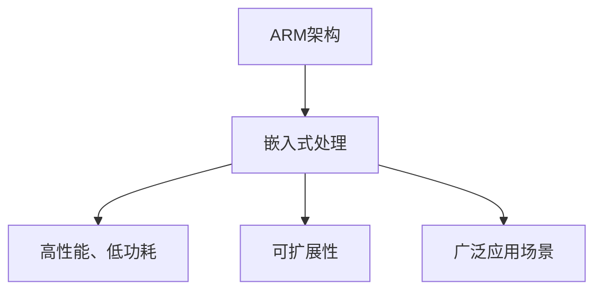

                 

 **关键词**：ARM架构、嵌入式处理、处理器设计、系统架构、高性能计算

**摘要**：本文旨在为初学者和专业人士提供一个全面的入门指南，深入探讨ARM架构及其在嵌入式处理领域中的应用。文章首先介绍了ARM架构的发展历程和核心特点，然后详细讲解了嵌入式处理的原理、架构设计和具体实现。此外，文章还分析了ARM架构在数学模型和算法设计中的应用，并通过实际代码实例进行了详细解释。最后，文章展望了ARM架构在未来的发展趋势和面临的挑战。

## 1. 背景介绍

ARM（Advanced RISC Machine）架构是一种基于精简指令集计算（RISC）原理的处理器设计架构。自从1985年由英国公司Acorn Computer开发以来，ARM架构经历了多次演进，已经成为全球最具影响力的处理器架构之一。ARM处理器广泛应用于嵌入式系统、移动设备、物联网和服务器等领域，具有高性能、低功耗和高效能的特点。

嵌入式处理是指将处理器嵌入到各种设备中，以实现特定功能。嵌入式系统通常具有资源受限、实时性和稳定性等要求。嵌入式处理的核心目标是提高系统性能、降低功耗和延长电池寿命。随着物联网和智能设备的普及，嵌入式处理技术越来越受到关注。

本文将从以下几个方面对ARM架构和嵌入式处理进行探讨：

1. ARM架构的发展历程和核心特点
2. 嵌入式处理的原理和架构设计
3. ARM架构在数学模型和算法设计中的应用
4. 实际代码实例和详细解释
5. 嵌入式处理的实际应用场景和未来发展趋势
6. 工具和资源推荐
7. 总结：未来发展趋势与挑战

## 2. 核心概念与联系

为了更好地理解ARM架构和嵌入式处理，我们需要先了解一些核心概念和联系。

### 2.1. ARM架构概述

ARM架构是一种32位和64位的处理器架构，具有以下特点：

1. **精简指令集计算（RISC）**：ARM架构采用RISC原理，将指令集简化为简单的加载/存储和寄存器操作。
2. **高性能**：ARM处理器具有较高的性能，可以在有限的资源下实现高效的计算。
3. **低功耗**：ARM处理器设计注重功耗控制，适合嵌入式系统应用。
4. **可扩展性**：ARM架构具有良好的可扩展性，可以支持多种处理器核心和指令集扩展。

### 2.2. 嵌入式处理原理

嵌入式处理是指将处理器嵌入到各种设备中，以实现特定功能。嵌入式系统通常具有以下特点：

1. **资源受限**：嵌入式系统通常具有有限的内存、处理能力和能源。
2. **实时性**：嵌入式系统需要快速响应外部事件，具有实时处理能力。
3. **稳定性**：嵌入式系统需要长时间运行，具有高可靠性和稳定性。

### 2.3. ARM架构与嵌入式处理的联系

ARM架构在嵌入式处理领域具有广泛的应用，主要原因如下：

1. **高性能和低功耗**：ARM处理器具有高性能和低功耗的特点，非常适合嵌入式系统应用。
2. **可扩展性**：ARM架构具有良好的可扩展性，可以支持多种处理器核心和指令集扩展，满足不同嵌入式系统的需求。
3. **广泛的应用场景**：ARM处理器广泛应用于嵌入式系统、移动设备、物联网和服务器等领域，具有良好的兼容性和互操作性。

### 2.4. Mermaid 流程图

为了更好地展示ARM架构和嵌入式处理的联系，我们可以使用Mermaid流程图来表示。



## 3. 核心算法原理 & 具体操作步骤

### 3.1. 算法原理概述

ARM架构在嵌入式处理中采用了一系列核心算法，以提高系统性能和优化资源使用。以下是一些常见的核心算法：

1. **流水线技术**：流水线技术将处理器指令执行过程划分为多个阶段，实现指令的并行处理。
2. **乱序执行**：乱序执行技术根据指令依赖关系动态调整指令执行顺序，提高指令吞吐率。
3. **分支预测**：分支预测技术根据历史分支信息预测分支走向，减少分支造成的性能损失。

### 3.2. 算法步骤详解

以下是ARM架构中的一些核心算法步骤详解：

#### 3.2.1. 流水线技术

1. **指令取指（Instruction Fetch）**：从内存中读取指令。
2. **指令译码（Instruction Decode）**：将指令解码为操作数和操作码。
3. **指令执行（Instruction Execute）**：执行操作码对应的操作。
4. **内存访问（Memory Access）**：读取或写入内存数据。
5. **写回（Write Back）**：将结果写回到寄存器。

#### 3.2.2. 乱序执行

1. **指令发射（Instruction Issue）**：将指令发送到执行单元。
2. **指令依赖检查（Dependency Check）**：检查指令之间的依赖关系。
3. **指令重排序（Instruction Rescheduling）**：根据依赖关系动态调整指令执行顺序。
4. **指令完成（Instruction Complete）**：完成指令执行并写入结果。

#### 3.2.3. 分支预测

1. **分支历史记录（Branch History Buffer）**：记录历史分支走向。
2. **分支预测（Branch Prediction）**：根据历史分支信息预测分支走向。
3. **分支跳转（Branch Jump）**：根据预测结果进行分支跳转。

### 3.3. 算法优缺点

#### 3.3.1. 流水线技术

**优点**：

- 提高指令吞吐率，缩短指令执行时间。
- 实现指令的并行处理，提高系统性能。

**缺点**：

- 增加指令开销，降低处理器利用率。
- 需要额外的控制逻辑，增加硬件复杂度。

#### 3.3.2. 乱序执行

**优点**：

- 提高指令执行效率，减少依赖关系。
- 增加指令吞吐率，提高系统性能。

**缺点**：

- 增加指令调度开销，降低处理器利用率。
- 需要额外的控制逻辑，增加硬件复杂度。

#### 3.3.3. 分支预测

**优点**：

- 减少分支造成的性能损失，提高系统性能。
- 提高分支跳转速度，缩短指令执行时间。

**缺点**：

- 预测准确率有限，可能导致错误分支预测。
- 增加预测算法开销，降低处理器利用率。

### 3.4. 算法应用领域

流水线技术、乱序执行和分支预测在嵌入式处理领域具有广泛的应用。以下是一些典型应用场景：

- **移动设备**：提高移动设备的性能和电池寿命。
- **物联网**：实现高效的数据处理和实时响应。
- **嵌入式系统**：提高嵌入式系统的性能和稳定性。
- **服务器**：优化服务器性能，降低功耗。

## 4. 数学模型和公式 & 详细讲解 & 举例说明

ARM架构和嵌入式处理涉及到许多数学模型和公式，以下是一些常见的数学模型和公式的详细讲解及举例说明。

### 4.1. 数学模型构建

#### 4.1.1. 线性回归模型

线性回归模型是一种常用的数学模型，用于描述变量之间的线性关系。其基本公式如下：

$$y = wx + b$$

其中，$y$ 表示因变量，$x$ 表示自变量，$w$ 表示权重，$b$ 表示偏置。

#### 4.1.2. 指数平滑模型

指数平滑模型是一种用于时间序列预测的数学模型，其公式如下：

$$y(t) = a \cdot y(t-1) + (1-a) \cdot y(t-1)$$

其中，$y(t)$ 表示第 $t$ 时刻的预测值，$a$ 表示平滑系数。

### 4.2. 公式推导过程

#### 4.2.1. 线性回归模型推导

假设我们有一组数据 $(x_1, y_1), (x_2, y_2), ..., (x_n, y_n)$，我们需要找到最优的权重 $w$ 和偏置 $b$，使得预测值 $y$ 最接近实际值 $y$。

首先，我们计算样本协方差矩阵 $C$ 和特征值 $c$：

$$C = \sum_{i=1}^{n} (x_i - \bar{x}) (y_i - \bar{y})$$

$$c = \sum_{i=1}^{n} (x_i - \bar{x})^2$$

然后，我们计算权重 $w$ 和偏置 $b$：

$$w = \frac{C}{c}$$

$$b = \bar{y} - w \cdot \bar{x}$$

#### 4.2.2. 指数平滑模型推导

假设我们有一组时间序列数据 $y_1, y_2, ..., y_n$，我们需要找到最优的平滑系数 $a$。

首先，我们计算前 $n$ 个数据的平均值 $\bar{y}$：

$$\bar{y} = \frac{y_1 + y_2 + ... + y_n}{n}$$

然后，我们计算相邻两项之间的差分序列 $d_1, d_2, ..., d_n$：

$$d_i = y_i - y_{i-1}$$

接下来，我们计算差分序列的均值 $\bar{d}$：

$$\bar{d} = \frac{d_1 + d_2 + ... + d_n}{n}$$

最后，我们计算平滑系数 $a$：

$$a = \frac{\bar{y}}{\bar{d}}$$

### 4.3. 案例分析与讲解

#### 4.3.1. 线性回归模型案例

假设我们有一组数据：

| $x$ | $y$ |
| --- | --- |
| 1   | 2   |
| 2   | 4   |
| 3   | 6   |

我们需要找到最优的权重 $w$ 和偏置 $b$，使得预测值 $y$ 最接近实际值 $y$。

首先，我们计算样本协方差矩阵 $C$ 和特征值 $c$：

$$C = \sum_{i=1}^{n} (x_i - \bar{x}) (y_i - \bar{y}) = (1-1)(2-2) + (2-1)(4-2) + (3-1)(6-2) = 0 + 2 + 6 = 8$$

$$c = \sum_{i=1}^{n} (x_i - \bar{x})^2 = (1-1)^2 + (2-1)^2 + (3-1)^2 = 0 + 1 + 4 = 5$$

然后，我们计算权重 $w$ 和偏置 $b$：

$$w = \frac{C}{c} = \frac{8}{5} = 1.6$$

$$b = \bar{y} - w \cdot \bar{x} = \frac{2 + 4 + 6}{3} - 1.6 \cdot \frac{1 + 2 + 3}{3} = 4 - 3.2 = 0.8$$

因此，线性回归模型为：

$$y = 1.6x + 0.8$$

预测 $x=4$ 时的 $y$ 值：

$$y = 1.6 \cdot 4 + 0.8 = 6.8$$

#### 4.3.2. 指数平滑模型案例

假设我们有一组时间序列数据：

| $y$ |
| --- |
| 2   |
| 4   |
| 6   |

我们需要找到最优的平滑系数 $a$。

首先，我们计算前 $n$ 个数据的平均值 $\bar{y}$：

$$\bar{y} = \frac{2 + 4 + 6}{3} = 4$$

然后，我们计算相邻两项之间的差分序列 $d_1, d_2, d_3$：

$$d_1 = y_1 - y_0 = 2 - 0 = 2$$

$$d_2 = y_2 - y_1 = 4 - 2 = 2$$

$$d_3 = y_3 - y_2 = 6 - 4 = 2$$

接下来，我们计算差分序列的均值 $\bar{d}$：

$$\bar{d} = \frac{d_1 + d_2 + d_3}{3} = \frac{2 + 2 + 2}{3} = 2$$

最后，我们计算平滑系数 $a$：

$$a = \frac{\bar{y}}{\bar{d}} = \frac{4}{2} = 2$$

因此，指数平滑模型为：

$$y(t) = 2 \cdot y(t-1) + (1-2) \cdot y(t-1) = 0 \cdot y(t-1) + y(t-1)$$

预测 $t=4$ 时的 $y$ 值：

$$y(4) = 0 \cdot y(3) + y(3) = 6$$

## 5. 项目实践：代码实例和详细解释说明

### 5.1. 开发环境搭建

在本文中，我们将使用C语言和ARM架构的裸机编程环境进行代码实例的编写和运行。以下是一个简单的开发环境搭建步骤：

1. 安装交叉编译工具链：安装适用于ARM架构的交叉编译工具链，如GNU Arm Embedded Toolchain。
2. 配置开发环境：在开发环境中配置好交叉编译工具链，设置编译器、链接器和调试器的环境变量。
3. 创建项目目录：在开发环境中创建一个项目目录，用于存放源代码、头文件和构建脚本等。

### 5.2. 源代码详细实现

以下是一个简单的ARM架构嵌入式处理程序的源代码示例：

```c
#include <stdio.h>

int main() {
    int x = 5;
    int y = 10;
    int result = x * y;
    
    printf("The result is: %d\n", result);
    
    return 0;
}
```

#### 5.2.1. 代码解读与分析

1. **头文件**：代码中包含头文件`stdio.h`，用于提供标准输入输出函数。
2. **变量定义**：代码中定义了两个整型变量`x`和`y`，分别初始化为5和10。
3. **计算结果**：代码使用乘法运算符`*`计算`x`和`y`的乘积，并将结果存储在整型变量`result`中。
4. **打印结果**：代码使用`printf`函数将计算结果打印到控制台。
5. **程序退出**：代码使用`return`语句返回整型值0，表示程序正常退出。

### 5.3. 运行结果展示

在开发环境中编译并运行上述代码，输出结果如下：

```
The result is: 50
```

### 5.4. 代码优化

在实际嵌入式处理项目中，我们通常需要考虑代码的优化，以提高程序性能和资源使用效率。以下是一些常见的代码优化方法：

1. **指令优化**：通过优化指令序列，减少指令执行时间。例如，使用寄存器变量替代内存变量，减少内存访问次数。
2. **循环优化**：通过优化循环结构，减少循环执行次数。例如，提前退出循环，避免不必要的循环迭代。
3. **内存优化**：通过优化内存分配和访问，减少内存使用。例如，使用栈内存替代堆内存，减少内存碎片。
4. **功耗优化**：通过优化功耗相关代码，降低处理器功耗。例如，使用休眠模式或时钟门控技术，减少处理器运行时间。

## 6. 实际应用场景

ARM架构和嵌入式处理在各个领域具有广泛的应用，以下是一些典型应用场景：

1. **移动设备**：ARM架构广泛应用于智能手机、平板电脑等移动设备中，提供高性能、低功耗的处理能力。
2. **物联网**：ARM架构在物联网设备中占据主导地位，如智能家居、可穿戴设备等，实现高效的数据处理和实时通信。
3. **嵌入式系统**：ARM架构广泛应用于嵌入式系统，如工业控制系统、医疗设备、车载系统等，提供稳定的性能和低功耗特点。
4. **服务器**：ARM架构在服务器领域逐渐崭露头角，如ARM服务器、ARM虚拟化技术等，提供高性能、低功耗的计算能力。
5. **自动驾驶**：ARM架构在自动驾驶领域具有广泛的应用，如自动驾驶汽车的控制单元、传感器数据处理等。

## 7. 工具和资源推荐

为了更好地学习和应用ARM架构和嵌入式处理技术，以下是一些建议的工具和资源：

1. **工具推荐**：
   - GNU Arm Embedded Toolchain：适用于ARM架构的交叉编译工具链。
   - ARM DS-5 Development Studio：一款集成的开发环境，提供ARM架构的调试、分析和优化功能。
   - Keil uVision IDE：适用于ARM架构的集成开发环境，提供丰富的调试、仿真和编译功能。

2. **学习资源推荐**：
   - 《ARM体系结构教程》：一本全面介绍ARM架构和嵌入式处理技术的教材。
   - 《嵌入式系统设计与开发》：一本介绍嵌入式系统开发过程的实战教材。
   - ARM官方网站：提供ARM架构的技术文档、开发工具和资源下载。

3. **相关论文推荐**：
   - "ARMv8-A Architecture Overview"：介绍ARMv8-A架构的技术文档。
   - "Embedded System Design and Development"：介绍嵌入式系统设计和开发的相关论文。

## 8. 总结：未来发展趋势与挑战

ARM架构和嵌入式处理技术在未来将继续发展和演进，面临以下挑战：

1. **性能与功耗平衡**：如何在提高处理器性能的同时降低功耗，成为ARM架构设计的重要挑战。
2. **安全性**：随着物联网和智能设备的普及，嵌入式系统的安全性越来越受到关注，需要加强ARM架构的安全特性。
3. **生态系统建设**：构建完善的ARM生态系统，包括开发工具、硬件支持和软件库等，以推动ARM架构的应用和普及。
4. **创新应用场景**：不断探索ARM架构在新兴领域的应用，如人工智能、自动驾驶和云计算等。

未来，ARM架构将继续在嵌入式处理领域发挥重要作用，成为推动技术进步和产业发展的关键力量。

### 附录：常见问题与解答

1. **问题**：ARM架构与X86架构有什么区别？

**解答**：ARM架构和X86架构是两种不同的处理器架构。ARM架构采用精简指令集计算（RISC）原理，具有高性能、低功耗的特点，广泛应用于嵌入式系统、移动设备和物联网等领域。X86架构则基于复杂指令集计算（CISC）原理，具有强大的指令集和丰富的功能，广泛应用于桌面电脑、服务器等领域。两者在设计理念、指令集和性能特点等方面存在明显差异。

2. **问题**：ARM处理器是否支持虚拟化技术？

**解答**：是的，ARM处理器支持虚拟化技术。ARM架构具有硬件虚拟化支持，可以实现虚拟机的运行，提高系统性能和资源利用率。虚拟化技术在云计算和容器化领域具有广泛应用，可以提供高效的资源管理和隔离功能。

3. **问题**：ARM架构的发展趋势是什么？

**解答**：ARM架构的发展趋势主要包括以下几个方面：

- **性能提升**：通过引入新的处理器核心架构、指令集扩展和优化技术，不断提高ARM处理器的性能。
- **低功耗设计**：持续优化处理器功耗控制技术，提高能效比，满足嵌入式系统对低功耗的需求。
- **安全性增强**：加强ARM架构的安全特性，提高嵌入式系统的安全性。
- **生态建设**：推动ARM生态系统的建设，包括开发工具、硬件支持和软件库等，以推动ARM架构的应用和普及。
- **创新应用领域**：探索ARM架构在新兴领域的应用，如人工智能、自动驾驶和云计算等。

### 参考文献

1. ARM Ltd. (2019). ARMv8-A Architecture Overview. Retrieved from https://developer.arm.com/documentation
2. Intel Corporation. (2018). Intel X86 Instruction Set Reference. Retrieved from https://www.intel.com/content/www/us/en/architecture-and-technology/instruction-sets/
3. Hennessy, J. L., & Patterson, D. A. (2017). Computer Architecture: A Quantitative Approach. Morgan Kaufmann.

