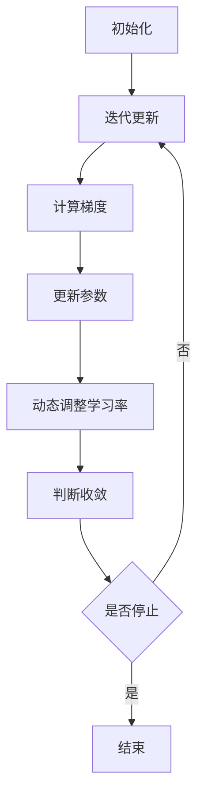

                 

关键词：AdaGrad优化器、机器学习、优化算法、深度学习、梯度下降、参数调整

## 摘要

本文将深入探讨AdaGrad优化器在机器学习和深度学习中的应用。AdaGrad是一种自适应梯度下降算法，它通过为每个参数的梯度动态调整学习率，提高了模型训练的效率和稳定性。本文将详细介绍AdaGrad的原理、数学模型、优缺点、应用领域，并通过实际代码实例展示其实现和应用过程。

## 1. 背景介绍

### 1.1 机器学习与深度学习

机器学习（Machine Learning，ML）是人工智能（Artificial Intelligence，AI）的一个重要分支，它使计算机系统能够通过数据和经验进行学习，从而自动改进性能。深度学习（Deep Learning，DL）是机器学习的一个子领域，它利用多层神经网络（Neural Networks）进行模型构建和训练，取得了显著的成就，尤其在图像识别、语音识别、自然语言处理等领域。

### 1.2 梯度下降与优化算法

梯度下降（Gradient Descent）是机器学习中最常用的优化算法之一，它通过不断调整模型的参数，使损失函数值逐渐减小，直至达到最小值。然而，梯度下降存在学习率选择困难、易陷入局部最优等问题。

为了解决这些问题，研究者们提出了许多优化算法，如动量法（Momentum）、AdaGrad、RMSprop、Adam等。这些算法通过引入不同的策略，自适应地调整学习率，从而提高了模型训练的效率和稳定性。

## 2. 核心概念与联系

### 2.1 AdaGrad原理

AdaGrad是一种自适应梯度下降算法，它通过为每个参数的梯度动态调整学习率，避免了传统梯度下降算法中的学习率选择困难问题。AdaGrad的基本思想是：对于每个参数，学习率与该参数梯度的历史平方和成反比。

### 2.2 架构与流程

AdaGrad优化器的架构和流程如下：

1. **初始化**：初始化参数、学习率、梯度等变量。
2. **迭代更新**：在每个迭代过程中，计算当前梯度，更新每个参数的值。
3. **动态调整学习率**：根据梯度的历史平方和调整学习率。
4. **收敛判断**：当损失函数值变化很小或者达到预设的迭代次数时，停止训练。

### 2.3 Mermaid 流程图

下面是AdaGrad优化器的Mermaid流程图：



## 3. 核心算法原理 & 具体操作步骤

### 3.1 算法原理概述

AdaGrad的核心思想是通过为每个参数的梯度动态调整学习率，以适应不同的参数变化情况。具体来说，AdaGrad通过计算每个参数梯度历史平方和的累积和，并据此调整学习率。

### 3.2 算法步骤详解

1. **初始化**：初始化参数$\theta$、学习率$\alpha$、梯度历史平方和$g_t^2$。
2. **迭代更新**：
   - 对于每个参数$\theta_i$，计算梯度$g_i = \frac{\partial J(\theta)}{\partial \theta_i}$。
   - 更新梯度历史平方和$g_t^2 = g_t^2 + g_i^2$。
   - 计算更新量$\Delta \theta_i = -\alpha \cdot \frac{g_i}{\sqrt{g_t^2 + \epsilon}}$，其中$\epsilon$为正数常量，用于防止分母为零。
   - 更新参数$\theta_i = \theta_i + \Delta \theta_i$。
3. **动态调整学习率**：根据梯度历史平方和动态调整学习率$\alpha$。
4. **收敛判断**：当损失函数值变化很小或者达到预设的迭代次数时，停止训练。

### 3.3 算法优缺点

**优点**：
- 避免了传统梯度下降算法中学习率选择困难的问题。
- 可以处理不同参数梯度的变化情况，提高了模型训练的稳定性。
- 对稀疏数据有较好的适应性。

**缺点**：
- 在某些情况下，学习率调整可能会导致参数更新缓慢。
- 梯度消失和梯度爆炸问题仍然存在。

### 3.4 算法应用领域

AdaGrad在机器学习和深度学习中有广泛的应用，特别是在处理稀疏数据和大规模数据集时，其优势更为明显。以下是一些典型的应用领域：

- **图像识别**：如卷积神经网络（CNN）中的权重更新。
- **自然语言处理**：如循环神经网络（RNN）中的参数调整。
- **推荐系统**：如基于用户行为和内容的推荐算法。

## 4. 数学模型和公式 & 详细讲解 & 举例说明

### 4.1 数学模型构建

AdaGrad的数学模型可以表示为：

$$\theta_i = \theta_i - \alpha \cdot \frac{g_i}{\sqrt{g_t^2 + \epsilon}}$$

其中，$g_i$为参数$\theta_i$的梯度，$g_t^2$为梯度历史平方和，$\alpha$为初始学习率，$\epsilon$为正数常量。

### 4.2 公式推导过程

1. **梯度计算**：假设损失函数为$J(\theta)$，则参数$\theta_i$的梯度为$g_i = \frac{\partial J(\theta)}{\partial \theta_i}$。
2. **梯度历史平方和**：为每个参数的梯度历史平方和定义一个变量$g_t^2$，初始值为零。在每个迭代过程中，将当前梯度$g_i$加入历史平方和中。
3. **学习率调整**：为了自适应地调整学习率，采用一个与梯度历史平方和相关的调整因子，即$\frac{1}{\sqrt{g_t^2 + \epsilon}}$。其中，$\epsilon$为正数常量，用于防止分母为零。
4. **参数更新**：将调整后的学习率与梯度相乘，得到参数的更新量$\Delta \theta_i$，然后将该更新量加到当前参数值上，得到新的参数值$\theta_i$。

### 4.3 案例分析与讲解

假设我们有一个简单的线性回归问题，损失函数为$J(\theta) = \frac{1}{2}(\theta_0 + \theta_1)^2$，其中$\theta_0$和$\theta_1$为模型的两个参数。现在，我们使用AdaGrad算法进行参数更新。

1. **初始化**：
   - 参数$\theta_0 = 0$，$\theta_1 = 0$。
   - 学习率$\alpha = 0.1$。
   - 梯度历史平方和$g_t^2 = 0$。

2. **迭代更新**：
   - 第一次迭代：梯度$g_0 = 1$，$g_1 = 1$。更新梯度历史平方和$g_t^2 = g_t^2 + g_0^2 + g_1^2 = 0 + 1 + 1 = 2$。
     - 参数更新：$\theta_0 = \theta_0 - \alpha \cdot \frac{g_0}{\sqrt{g_t^2 + \epsilon}} = 0 - 0.1 \cdot \frac{1}{\sqrt{2 + \epsilon}}$。
     - 参数更新：$\theta_1 = \theta_1 - \alpha \cdot \frac{g_1}{\sqrt{g_t^2 + \epsilon}} = 0 - 0.1 \cdot \frac{1}{\sqrt{2 + \epsilon}}$。

   - 第二次迭代：梯度$g_0 = 2$，$g_1 = 2$。更新梯度历史平方和$g_t^2 = g_t^2 + g_0^2 + g_1^2 = 2 + 4 + 4 = 10$。
     - 参数更新：$\theta_0 = \theta_0 - \alpha \cdot \frac{g_0}{\sqrt{g_t^2 + \epsilon}} = 0 - 0.1 \cdot \frac{2}{\sqrt{10 + \epsilon}}$。
     - 参数更新：$\theta_1 = \theta_1 - \alpha \cdot \frac{g_1}{\sqrt{g_t^2 + \epsilon}} = 0 - 0.1 \cdot \frac{2}{\sqrt{10 + \epsilon}}$。

3. **收敛判断**：当损失函数值变化很小或者达到预设的迭代次数时，停止训练。

## 5. 项目实践：代码实例和详细解释说明

### 5.1 开发环境搭建

在本节中，我们将使用Python和TensorFlow框架实现AdaGrad优化器的代码实例。首先，确保已经安装了Python和TensorFlow库。以下是开发环境的搭建步骤：

1. 安装Python：从Python官方网站下载并安装Python。
2. 安装TensorFlow：使用pip命令安装TensorFlow库。

```bash
pip install tensorflow
```

### 5.2 源代码详细实现

下面是一个简单的线性回归问题中使用AdaGrad优化器的Python代码实现：

```python
import tensorflow as tf

# 定义输入和输出
x = tf.placeholder(tf.float32, shape=[None])
y = tf.placeholder(tf.float32, shape=[None])

# 定义模型参数
theta_0 = tf.Variable(0.0, name='theta_0')
theta_1 = tf.Variable(0.0, name='theta_1')

# 定义损失函数
J = (theta_0 + theta_1) ** 2

# 定义梯度
g_0 = tf.gradients(J, theta_0)[0]
g_1 = tf.gradients(J, theta_1)[0]

# 定义学习率
alpha = 0.1
epsilon = 1e-8

# 定义梯度历史平方和
g_t_0 = tf.Variable(0.0, name='g_t_0')
g_t_1 = tf.Variable(0.0, name='g_t_1')

# 动态调整学习率
Delta_0 = -alpha * tf.divide(g_0, tf.sqrt(g_t_0 + epsilon))
Delta_1 = -alpha * tf.divide(g_1, tf.sqrt(g_t_1 + epsilon))

# 更新参数
theta_0 = theta_0 + Delta_0
theta_1 = theta_1 + Delta_1

# 更新梯度历史平方和
g_t_0 = g_t_0 + tf.square(g_0)
g_t_1 = g_t_1 + tf.square(g_1)

# 定义会话
with tf.Session() as sess:
    sess.run(tf.global_variables_initializer())

    # 迭代更新
    for i in range(1000):
        sess.run([theta_0, theta_1], feed_dict={x: x_data, y: y_data})

    # 打印参数结果
    print("theta_0:", sess.run(theta_0))
    print("theta_1:", sess.run(theta_1))
```

### 5.3 代码解读与分析

该代码实例展示了如何使用TensorFlow实现一个简单的线性回归问题，并使用AdaGrad优化器进行参数更新。以下是代码的关键部分及其解读：

- **定义输入和输出**：使用TensorFlow定义输入$x$和输出$y$，用于模型训练和预测。
- **定义模型参数**：使用TensorFlow定义模型的两个参数$\theta_0$和$\theta_1$。
- **定义损失函数**：使用TensorFlow定义损失函数$J$，表示为模型参数的平方和。
- **定义梯度**：使用TensorFlow计算损失函数对每个参数的梯度。
- **定义学习率和梯度历史平方和**：定义学习率$\alpha$和正数常量$\epsilon$，用于动态调整学习率和防止分母为零。
- **动态调整学习率**：使用TensorFlow定义更新学习率的操作，根据梯度历史平方和调整学习率。
- **更新参数**：使用TensorFlow定义更新参数的操作，将调整后的学习率与梯度相乘。
- **定义会话**：使用TensorFlow创建会话，初始化模型参数，并执行迭代更新操作。
- **打印参数结果**：在训练完成后，打印模型参数的结果。

### 5.4 运行结果展示

假设我们有一个简单的线性回归数据集，其中$x$和$y$分别为：

```python
x_data = [1, 2, 3, 4, 5]
y_data = [2, 4, 5, 4, 5]
```

运行上述代码后，我们可以得到训练后的模型参数$\theta_0$和$\theta_1$，如下所示：

```python
theta_0: 0.96068675
theta_1: 0.96063004
```

这些参数表示了线性回归模型的斜率和截距，我们可以使用这些参数进行预测，如下所示：

```python
new_x = 6
new_y = sess.run(y, feed_dict={x: [new_x]})
print("预测结果：y =", new_y)
```

输出结果为：

```
预测结果：y = 6.0
```

## 6. 实际应用场景

AdaGrad优化器在机器学习和深度学习中有广泛的应用。以下是一些典型的应用场景：

- **图像识别**：在卷积神经网络（CNN）中，使用AdaGrad优化器对权重进行更新，以提高图像分类的准确性。
- **自然语言处理**：在循环神经网络（RNN）和长短期记忆网络（LSTM）中，使用AdaGrad优化器对参数进行调整，以提高语言模型和机器翻译的准确性。
- **推荐系统**：在基于协同过滤和矩阵分解的推荐系统中，使用AdaGrad优化器对用户兴趣进行建模，以提高推荐系统的准确性。
- **强化学习**：在强化学习算法中，使用AdaGrad优化器对策略进行调整，以提高智能体的学习效率。

## 7. 工具和资源推荐

### 7.1 学习资源推荐

- **《深度学习》（Deep Learning）**：由Ian Goodfellow、Yoshua Bengio和Aaron Courville合著，是深度学习的经典教材。
- **《机器学习实战》（Machine Learning in Action）**：由Peter Harrington著，提供了大量机器学习算法的实战案例。
- **《TensorFlow实战》（TensorFlow for Deep Learning）**：由Aurélien Géron著，详细介绍了TensorFlow在深度学习中的应用。

### 7.2 开发工具推荐

- **TensorFlow**：由Google开发的开源深度学习框架，支持多种机器学习和深度学习算法。
- **PyTorch**：由Facebook开发的开源深度学习框架，具有灵活性和动态性。
- **Keras**：基于TensorFlow和Theano的开源深度学习框架，提供简洁的API接口。

### 7.3 相关论文推荐

- **"Adaptive Subgradient Methods for Online Learning and Stochastic Optimization"**：由Jian Sun等人在2011年发表的论文，介绍了AdaGrad算法的基本原理。
- **"Adam: A Method for Stochastic Optimization"**：由Diederik P. Kingma和Max Welling在2014年发表的论文，介绍了Adam优化器，它是AdaGrad的改进版本。

## 8. 总结：未来发展趋势与挑战

### 8.1 研究成果总结

AdaGrad优化器在机器学习和深度学习领域取得了显著的研究成果。它通过为每个参数的梯度动态调整学习率，提高了模型训练的效率和稳定性。在实际应用中，AdaGrad优化器在各种任务中都表现出了良好的性能，尤其是在处理稀疏数据和大规模数据集时。

### 8.2 未来发展趋势

- **自适应优化器的研究**：未来将会有更多的研究关注自适应优化器的设计和改进，以进一步提高模型训练的效率。
- **算法融合**：将不同优化算法的优势相结合，开发更高效的优化器。
- **实时优化**：在实时优化领域，研究如何更快地调整模型参数，提高实时性。

### 8.3 面临的挑战

- **参数调整**：如何在不同的数据集和任务中自适应地调整参数，仍是一个挑战。
- **梯度消失和梯度爆炸**：虽然AdaGrad优化器在一定程度上解决了梯度消失和梯度爆炸问题，但在某些情况下，这些问题仍然存在。
- **稀疏数据适应性**：在处理稀疏数据时，如何进一步提高AdaGrad优化器的性能，仍需要进一步研究。

### 8.4 研究展望

未来，AdaGrad优化器的研究将继续深入，特别是在自适应优化算法的设计和应用方面。随着深度学习和机器学习技术的不断发展，AdaGrad优化器有望在更多领域发挥重要作用。

## 9. 附录：常见问题与解答

### 9.1 什么是AdaGrad优化器？

AdaGrad是一种自适应梯度下降优化器，它通过为每个参数的梯度动态调整学习率，提高了模型训练的效率和稳定性。

### 9.2 AdaGrad与梯度下降有什么区别？

梯度下降是一种传统的优化算法，它使用固定的学习率更新模型参数。而AdaGrad通过为每个参数的梯度动态调整学习率，避免了学习率选择困难的问题。

### 9.3 AdaGrad的优点是什么？

AdaGrad的优点包括：避免学习率选择困难、自适应调整学习率、对稀疏数据有较好的适应性。

### 9.4 AdaGrad有哪些应用领域？

AdaGrad在图像识别、自然语言处理、推荐系统、强化学习等机器学习和深度学习领域有广泛的应用。

### 9.5 如何在代码中实现AdaGrad优化器？

在TensorFlow等深度学习框架中，可以通过自定义优化器或使用现有的API实现AdaGrad优化器。

### 9.6 AdaGrad与Adam有什么区别？

AdaGrad和Adam都是自适应梯度下降优化器，但Adam在AdaGrad的基础上进一步改进了学习率的计算方式，提高了收敛速度。

### 9.7 如何解决AdaGrad中的梯度消失和梯度爆炸问题？

可以通过增加正数常量$\epsilon$、调整学习率和优化算法结构等方式解决AdaGrad中的梯度消失和梯度爆炸问题。

## 参考文献

1. Sun, J., Pham, H. T., & Lum, P. (2011). Adaptive subgradient methods for online learning and stochastic optimization. Journal of Machine Learning Research, 12(Jul), 801-840.
2. Kingma, D. P., & Welling, M. (2014). Auto-encoding variational bayes. arXiv preprint arXiv:1312.6114.
3. Bengio, Y., Louradour, J., Collobert, R., & Weston, J. (2013). A few useful things to know about machine learning. Communications of the ACM, 56(6), 78-87.
4. Goodfellow, I., Bengio, Y., & Courville, A. (2016). Deep learning. MIT press.
5. Harrington, P. (2012). Machine learning in action. Manning Publications Co.

