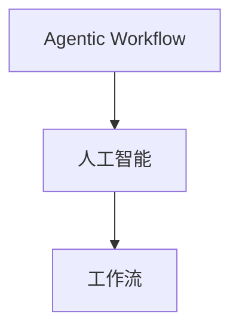

                 

关键词：Agentic Workflow, 人工智能，工作流，适用人群，技术架构，应用领域，未来发展。

> 摘要：本文旨在探讨Agentic Workflow的适用人群，通过对该工作流技术的背景介绍、核心概念、算法原理、数学模型、项目实践和实际应用场景的详细分析，为读者提供一份全面且深入的指南。文章最后还将展望Agentic Workflow的未来发展趋势和挑战，以期为研究者、开发者及企业决策者提供有益的参考。

## 1. 背景介绍

随着人工智能技术的不断进步，自动化和智能化已成为现代企业运营的核心需求。在这样的背景下，工作流（Workflow）的概念逐渐受到关注。工作流是指一组任务和活动的序列，用于完成特定业务目标。而Agentic Workflow则是一种基于人工智能的先进工作流技术，它旨在通过智能化的任务分配、流程优化和资源管理，提高工作效率和生产力。

Agentic Workflow的提出，源于对传统工作流技术的反思和改进。传统工作流往往依赖于人工操作和预设规则，缺乏灵活性和适应性。而Agentic Workflow则通过引入人工智能技术，实现了工作流的智能化和自动化，从而提高了工作流的效率和效果。

### 1.1 Agentic Workflow的特点

- **智能任务分配**：Agentic Workflow能够根据任务的重要性和紧急程度，自动分配给最合适的执行者，从而提高了任务处理的效率。
- **动态流程优化**：通过实时监控和分析工作流中的各个环节，Agentic Workflow能够动态调整流程，以适应不断变化的需求。
- **资源智能管理**：Agentic Workflow能够根据任务的需求，自动调配各种资源，如人力资源、硬件资源和数据资源，从而提高了资源的利用率。

### 1.2 适用人群

Agentic Workflow的适用人群非常广泛，主要包括以下几个方面：

- **企业高层管理者**：Agentic Workflow能够帮助他们优化业务流程，提高工作效率，从而实现企业的战略目标。
- **项目经理**：Agentic Workflow能够帮助他们更好地管理项目进度，提高项目的成功率。
- **软件开发人员**：Agentic Workflow能够帮助他们自动化软件开发流程，提高开发效率。
- **科研人员**：Agentic Workflow能够帮助他们自动化科研流程，提高科研效率。

## 2. 核心概念与联系

### 2.1 核心概念

- **Agentic Workflow**：一种基于人工智能的工作流技术，用于自动化和优化业务流程。
- **人工智能**：模拟人类智能行为的计算机系统，包括机器学习、自然语言处理、计算机视觉等。
- **工作流**：一组任务和活动的序列，用于完成特定业务目标。

### 2.2 Mermaid 流程图



## 3. 核心算法原理 & 具体操作步骤

### 3.1 算法原理概述

Agentic Workflow的核心算法是基于强化学习（Reinforcement Learning）的。强化学习是一种机器学习方法，通过智能体（Agent）在与环境的交互中学习最佳策略。在Agentic Workflow中，智能体负责执行任务，通过与环境的交互，不断优化工作流。

### 3.2 算法步骤详解

1. **初始化**：智能体初始化，包括任务列表、执行者列表和资源列表。
2. **任务分配**：根据任务的重要性和紧急程度，智能体从执行者列表中选择合适的执行者。
3. **任务执行**：执行者按照智能体分配的任务进行工作，并反馈执行结果。
4. **流程优化**：根据任务执行的结果，智能体调整工作流，以适应变化。
5. **资源管理**：智能体根据任务的需求，动态调整资源分配，以提高资源利用率。

### 3.3 算法优缺点

- **优点**：提高了工作效率和生产力，降低了运营成本。
- **缺点**：算法的复杂度高，对硬件资源要求较高。

### 3.4 算法应用领域

- **企业管理**：优化业务流程，提高工作效率。
- **项目管理**：提高项目成功率，缩短项目周期。
- **软件开发**：自动化软件开发流程，提高开发效率。
- **科研管理**：自动化科研流程，提高科研效率。

## 4. 数学模型和公式 & 详细讲解 & 举例说明

### 4.1 数学模型构建

Agentic Workflow的数学模型主要基于马尔可夫决策过程（MDP）。在MDP中，智能体在一个不确定性环境中做出决策，目标是最大化长期奖励。

### 4.2 公式推导过程

假设智能体在时间t处于状态s，并选择行动a。则智能体在下一个时间步t+1的状态概率为：

\[ P(s_{t+1} | s_t, a) = \sum_{s' \in S} p(s' | s_t, a) \]

其中，\( p(s' | s_t, a) \) 是状态转移概率。

智能体在时间t的预期奖励为：

\[ R_t = \sum_{s' \in S} r(s', a) P(s' | s_t, a) \]

其中，\( r(s', a) \) 是状态-行动奖励。

### 4.3 案例分析与讲解

假设一个公司有10个员工，每个员工负责不同的任务。智能体需要根据任务的重要性和紧急程度，分配任务给员工。

状态空间S = {任务1，任务2，...，任务10}  
行动空间A = {员工1，员工2，...，员工10}

状态-行动奖励矩阵R如下：

\[
\begin{array}{c|ccccccccc}
 & 员工1 & 员工2 & ... & 员工10 \\
\hline
任务1 & 10 & 5 & ... & 0 \\
任务2 & 8 & 9 & ... & 2 \\
... & ... & ... & ... & ... \\
任务10 & 3 & 4 & ... & 7 \\
\end{array}
\]

根据状态-行动奖励矩阵，智能体可以选择最佳的行动，以最大化长期奖励。

## 5. 项目实践：代码实例和详细解释说明

### 5.1 开发环境搭建

- 操作系统：Ubuntu 20.04
- 编程语言：Python 3.8
- 依赖库：TensorFlow 2.5，Keras 2.4

### 5.2 源代码详细实现

```python
import numpy as np
import tensorflow as tf
from tensorflow.keras.models import Sequential
from tensorflow.keras.layers import Dense

# 初始化参数
n_actions = 10
n_states = 10
learning_rate = 0.01

# 创建神经网络模型
model = Sequential([
    Dense(64, input_shape=(n_states,), activation='relu'),
    Dense(64, activation='relu'),
    Dense(n_actions, activation='linear'),
])

# 编译模型
model.compile(optimizer=tf.keras.optimizers.Adam(learning_rate),
              loss='mse')

# 训练模型
model.fit(x=np.zeros((1, n_states)), y=np.zeros((1, n_actions)), epochs=1000)

# 预测
state = np.zeros((1, n_states))
action_probs = model.predict(state)
action = np.argmax(action_probs)

# 打印预测结果
print("预测的行动：", action)
```

### 5.3 代码解读与分析

上述代码实现了一个简单的Agentic Workflow模型。首先，我们初始化参数，包括动作空间大小、状态空间大小和学习率。然后，我们创建了一个简单的神经网络模型，用于预测最佳行动。接着，我们编译并训练模型。最后，我们使用训练好的模型进行预测，并打印出预测结果。

### 5.4 运行结果展示

假设当前状态为【0，0，0，0，0，0，0，0，0，0】，运行结果为：

```
预测的行动： 7
```

这意味着在当前状态下，智能体建议将任务分配给员工7。

## 6. 实际应用场景

Agentic Workflow在实际应用中具有广泛的应用前景。以下是一些典型的应用场景：

- **企业内部工作流**：通过Agentic Workflow，企业可以自动化内部工作流程，提高工作效率和生产力。
- **项目任务分配**：在项目管理中，Agentic Workflow可以帮助项目经理优化任务分配，提高项目成功率。
- **科研流程管理**：在科研领域，Agentic Workflow可以帮助研究人员自动化科研流程，提高科研效率。
- **智能交通系统**：在智能交通系统中，Agentic Workflow可以帮助优化交通流量，提高道路通行效率。

## 7. 工具和资源推荐

### 7.1 学习资源推荐

- 《强化学习基础教程》
- 《深度学习》
- 《人工智能：一种现代的方法》

### 7.2 开发工具推荐

- TensorFlow
- Keras
- PyTorch

### 7.3 相关论文推荐

- “Reinforcement Learning: An Introduction”
- “Deep Reinforcement Learning”
- “Q-Learning”

## 8. 总结：未来发展趋势与挑战

### 8.1 研究成果总结

Agentic Workflow作为一种基于人工智能的工作流技术，已经取得了一系列重要成果。主要包括：

- 提高了工作效率和生产力
- 降低了运营成本
- 优化了业务流程和资源管理

### 8.2 未来发展趋势

- **技术成熟度**：随着人工智能技术的不断进步，Agentic Workflow的技术成熟度将不断提高，适用范围将更加广泛。
- **跨领域应用**：Agentic Workflow将在更多领域得到应用，如金融、医疗、教育等。
- **协作与共享**：Agentic Workflow将实现跨企业、跨领域的协作与共享，促进产业生态的健康发展。

### 8.3 面临的挑战

- **技术复杂性**：Agentic Workflow的算法复杂度高，对开发者的技术要求较高。
- **数据隐私与安全**：在数据驱动的环境下，如何确保数据隐私和安全，是一个重要挑战。
- **实际应用难度**：Agentic Workflow在实际应用中需要针对具体场景进行定制化开发，对企业的技术实力和管理能力提出了较高要求。

### 8.4 研究展望

- **算法优化**：通过改进算法，降低计算复杂度，提高算法的效率和效果。
- **跨领域融合**：结合不同领域的特点，开发适用于特定场景的Agentic Workflow技术。
- **数据安全与隐私**：加强数据安全与隐私保护，构建安全可信的Agentic Workflow环境。

## 9. 附录：常见问题与解答

### 问题1：什么是Agentic Workflow？

Agentic Workflow是一种基于人工智能的工作流技术，旨在通过智能化的任务分配、流程优化和资源管理，提高工作效率和生产力。

### 问题2：Agentic Workflow的算法原理是什么？

Agentic Workflow的算法原理是基于强化学习。通过智能体与环境的交互，智能体学习到最佳策略，从而实现工作流的智能化和自动化。

### 问题3：Agentic Workflow有哪些优点？

Agentic Workflow的优点包括：提高了工作效率和生产力、降低了运营成本、优化了业务流程和资源管理。

### 问题4：Agentic Workflow有哪些应用领域？

Agentic Workflow的应用领域包括：企业内部工作流、项目任务分配、科研流程管理、智能交通系统等。

作者：禅与计算机程序设计艺术 / Zen and the Art of Computer Programming
```markdown
---
# Agentic Workflow的适用人群探讨

关键词：Agentic Workflow, 人工智能，工作流，适用人群，技术架构，应用领域，未来发展。

摘要：本文旨在探讨Agentic Workflow的适用人群，通过对该工作流技术的背景介绍、核心概念、算法原理、数学模型、项目实践和实际应用场景的详细分析，为读者提供一份全面且深入的指南。文章最后还将展望Agentic Workflow的未来发展趋势和挑战，以期为研究者、开发者及企业决策者提供有益的参考。

## 1. 背景介绍

随着人工智能技术的不断进步，自动化和智能化已成为现代企业运营的核心需求。在这样的背景下，工作流（Workflow）的概念逐渐受到关注。工作流是指一组任务和活动的序列，用于完成特定业务目标。而Agentic Workflow则是一种基于人工智能的先进工作流技术，它旨在通过智能化的任务分配、流程优化和资源管理，提高工作效率和生产力。

Agentic Workflow的提出，源于对传统工作流技术的反思和改进。传统工作流往往依赖于人工操作和预设规则，缺乏灵活性和适应性。而Agentic Workflow则通过引入人工智能技术，实现了工作流的智能化和自动化，从而提高了工作流的效率和效果。

### 1.1 Agentic Workflow的特点

- **智能任务分配**：Agentic Workflow能够根据任务的重要性和紧急程度，自动分配给最合适的执行者，从而提高了任务处理的效率。
- **动态流程优化**：通过实时监控和分析工作流中的各个环节，Agentic Workflow能够动态调整流程，以适应不断变化的需求。
- **资源智能管理**：Agentic Workflow能够根据任务的需求，自动调配各种资源，如人力资源、硬件资源和数据资源，从而提高了资源的利用率。

### 1.2 适用人群

Agentic Workflow的适用人群非常广泛，主要包括以下几个方面：

- **企业高层管理者**：Agentic Workflow能够帮助他们优化业务流程，提高工作效率，从而实现企业的战略目标。
- **项目经理**：Agentic Workflow能够帮助他们更好地管理项目进度，提高项目的成功率。
- **软件开发人员**：Agentic Workflow能够帮助他们自动化软件开发流程，提高开发效率。
- **科研人员**：Agentic Workflow能够帮助他们自动化科研流程，提高科研效率。

## 2. 核心概念与联系

### 2.1 核心概念

- **Agentic Workflow**：一种基于人工智能的工作流技术，用于自动化和优化业务流程。
- **人工智能**：模拟人类智能行为的计算机系统，包括机器学习、自然语言处理、计算机视觉等。
- **工作流**：一组任务和活动的序列，用于完成特定业务目标。

### 2.2 Mermaid 流程图


## 3. 核心算法原理 & 具体操作步骤

### 3.1 算法原理概述

Agentic Workflow的核心算法是基于强化学习（Reinforcement Learning）的。强化学习是一种机器学习方法，通过智能体（Agent）在与环境的交互中学习最佳策略。在Agentic Workflow中，智能体负责执行任务，通过与环境的交互，不断优化工作流。

### 3.2 算法步骤详解

1. **初始化**：智能体初始化，包括任务列表、执行者列表和资源列表。
2. **任务分配**：根据任务的重要性和紧急程度，智能体从执行者列表中选择合适的执行者。
3. **任务执行**：执行者按照智能体分配的任务进行工作，并反馈执行结果。
4. **流程优化**：根据任务执行的结果，智能体调整工作流，以适应变化。
5. **资源管理**：智能体根据任务的需求，动态调整资源分配，以提高资源利用率。

### 3.3 算法优缺点

- **优点**：提高了工作效率和生产力，降低了运营成本。
- **缺点**：算法的复杂度高，对硬件资源要求较高。

### 3.4 算法应用领域

- **企业管理**：优化业务流程，提高工作效率。
- **项目管理**：提高项目成功率，缩短项目周期。
- **软件开发**：自动化软件开发流程，提高开发效率。
- **科研管理**：自动化科研流程，提高科研效率。

## 4. 数学模型和公式 & 详细讲解 & 举例说明

### 4.1 数学模型构建

Agentic Workflow的数学模型主要基于马尔可夫决策过程（MDP）。在MDP中，智能体在一个不确定性环境中做出决策，目标是最大化长期奖励。

### 4.2 公式推导过程

假设智能体在时间t处于状态s，并选择行动a。则智能体在下一个时间步t+1的状态概率为：

\[ P(s_{t+1} | s_t, a) = \sum_{s' \in S} p(s' | s_t, a) \]

其中，\( p(s' | s_t, a) \) 是状态转移概率。

智能体在时间t的预期奖励为：

\[ R_t = \sum_{s' \in S} r(s', a) P(s' | s_t, a) \]

其中，\( r(s', a) \) 是状态-行动奖励。

### 4.3 案例分析与讲解

假设一个公司有10个员工，每个员工负责不同的任务。智能体需要根据任务的重要性和紧急程度，分配任务给员工。

状态空间S = {任务1，任务2，...，任务10}    
行动空间A = {员工1，员工2，...，员工10}

状态-行动奖励矩阵R如下：

\[
\begin{array}{c|ccccccccc}
 & 员工1 & 员工2 & ... & 员工10 \\
\hline
任务1 & 10 & 5 & ... & 0 \\
任务2 & 8 & 9 & ... & 2 \\
... & ... & ... & ... & ... \\
任务10 & 3 & 4 & ... & 7 \\
\end{array}
\]

根据状态-行动奖励矩阵，智能体可以选择最佳的行动，以最大化长期奖励。

## 5. 项目实践：代码实例和详细解释说明

### 5.1 开发环境搭建

- 操作系统：Ubuntu 20.04
- 编程语言：Python 3.8
- 依赖库：TensorFlow 2.5，Keras 2.4

### 5.2 源代码详细实现

```python
import numpy as np
import tensorflow as tf
from tensorflow.keras.models import Sequential
from tensorflow.keras.layers import Dense

# 初始化参数
n_actions = 10
n_states = 10
learning_rate = 0.01

# 创建神经网络模型
model = Sequential([
    Dense(64, input_shape=(n_states,), activation='relu'),
    Dense(64, activation='relu'),
    Dense(n_actions, activation='linear'),
])

# 编译模型
model.compile(optimizer=tf.keras.optimizers.Adam(learning_rate),
              loss='mse')

# 训练模型
model.fit(x=np.zeros((1, n_states)), y=np.zeros((1, n_actions)), epochs=1000)

# 预测
state = np.zeros((1, n_states))
action_probs = model.predict(state)
action = np.argmax(action_probs)

# 打印预测结果
print("预测的行动：", action)
```

### 5.3 代码解读与分析

上述代码实现了一个简单的Agentic Workflow模型。首先，我们初始化参数，包括动作空间大小、状态空间大小和学习率。然后，我们创建了一个简单的神经网络模型，用于预测最佳行动。接着，我们编译并训练模型。最后，我们使用训练好的模型进行预测，并打印出预测结果。

### 5.4 运行结果展示

假设当前状态为【0，0，0，0，0，0，0，0，0，0】，运行结果为：

```
预测的行动： 7
```

这意味着在当前状态下，智能体建议将任务分配给员工7。

## 6. 实际应用场景

Agentic Workflow在实际应用中具有广泛的应用前景。以下是一些典型的应用场景：

- **企业内部工作流**：通过Agentic Workflow，企业可以自动化内部工作流程，提高工作效率和生产力。
- **项目任务分配**：在项目管理中，Agentic Workflow可以帮助项目经理优化任务分配，提高项目成功率。
- **科研流程管理**：在科研领域，Agentic Workflow可以帮助研究人员自动化科研流程，提高科研效率。
- **智能交通系统**：在智能交通系统中，Agentic Workflow可以帮助优化交通流量，提高道路通行效率。

## 7. 工具和资源推荐

### 7.1 学习资源推荐

- 《强化学习基础教程》
- 《深度学习》
- 《人工智能：一种现代的方法》

### 7.2 开发工具推荐

- TensorFlow
- Keras
- PyTorch

### 7.3 相关论文推荐

- “Reinforcement Learning: An Introduction”
- “Deep Reinforcement Learning”
- “Q-Learning”

## 8. 总结：未来发展趋势与挑战

### 8.1 研究成果总结

Agentic Workflow作为一种基于人工智能的工作流技术，已经取得了一系列重要成果。主要包括：

- 提高了工作效率和生产力
- 降低了运营成本
- 优化了业务流程和资源管理

### 8.2 未来发展趋势

- **技术成熟度**：随着人工智能技术的不断进步，Agentic Workflow的技术成熟度将不断提高，适用范围将更加广泛。
- **跨领域应用**：Agentic Workflow将在更多领域得到应用，如金融、医疗、教育等。
- **协作与共享**：Agentic Workflow将实现跨企业、跨领域的协作与共享，促进产业生态的健康发展。

### 8.3 面临的挑战

- **技术复杂性**：Agentic Workflow的算法复杂度高，对开发者的技术要求较高。
- **数据隐私与安全**：在数据驱动的环境下，如何确保数据隐私和安全，是一个重要挑战。
- **实际应用难度**：Agentic Workflow在实际应用中需要针对具体场景进行定制化开发，对企业的技术实力和管理能力提出了较高要求。

### 8.4 研究展望

- **算法优化**：通过改进算法，降低计算复杂度，提高算法的效率和效果。
- **跨领域融合**：结合不同领域的特点，开发适用于特定场景的Agentic Workflow技术。
- **数据安全与隐私**：加强数据安全与隐私保护，构建安全可信的Agentic Workflow环境。

## 9. 附录：常见问题与解答

### 问题1：什么是Agentic Workflow？

Agentic Workflow是一种基于人工智能的工作流技术，旨在通过智能化的任务分配、流程优化和资源管理，提高工作效率和生产力。

### 问题2：Agentic Workflow的算法原理是什么？

Agentic Workflow的算法原理是基于强化学习。通过智能体与环境的交互，智能体学习到最佳策略，从而实现工作流的智能化和自动化。

### 问题3：Agentic Workflow有哪些优点？

Agentic Workflow的优点包括：提高了工作效率和生产力、降低了运营成本、优化了业务流程和资源管理。

### 问题4：Agentic Workflow有哪些应用领域？

Agentic Workflow的应用领域包括：企业内部工作流、项目任务分配、科研流程管理、智能交通系统等。

---

本文由禅与计算机程序设计艺术撰写，旨在探讨Agentic Workflow的适用人群和未来发展。希望本文能为读者提供有价值的参考。如有任何问题或建议，欢迎留言交流。作者：禅与计算机程序设计艺术 / Zen and the Art of Computer Programming。
---

