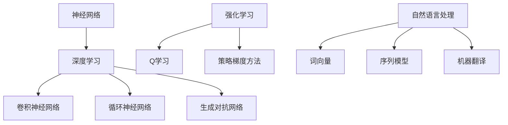

                 

关键词：人工智能，未来趋势，技术发展，算法优化，应用场景，挑战与展望

摘要：本文旨在深入探讨人工智能领域的未来发展趋势，通过回顾现有技术的成就，分析当前的技术瓶颈，以及展望未来的技术突破，来梳理出人工智能在未来可能的发展路径。文章将围绕核心算法、数学模型、项目实践和实际应用等方面展开讨论，为读者提供一幅全面、清晰的人工智能技术发展蓝图。

## 1. 背景介绍

人工智能（Artificial Intelligence，简称 AI）作为一门前沿技术，已经经历了数十年的发展。从早期的符号主义和专家系统，到20世纪90年代的连接主义和神经网络，再到21世纪初的深度学习和大数据技术，人工智能在多个领域取得了显著的成果。如今，AI技术已经渗透到生活的方方面面，从智能助手到自动驾驶，从医疗诊断到金融分析，都离不开人工智能的支撑。

本文将聚焦于人工智能的核心算法、数学模型、项目实践和未来应用，以安德烈·卡帕希（Andrej Karpathy）为代表的人工智能专家的工作作为背景，探讨人工智能在未来可能的发展趋势。

## 2. 核心概念与联系

为了深入理解人工智能的技术发展，我们首先需要了解一些核心概念，如神经网络、深度学习、强化学习等。以下是一个简单的 Mermaid 流程图，展示这些核心概念之间的联系：



### 2.1 神经网络

神经网络是人工智能的基础，它由大量相互连接的节点（或称为“神经元”）组成。每个神经元都接收来自其他神经元的输入信号，并通过一个权重进行加权求和，最后通过一个激活函数输出结果。神经网络通过学习输入和输出之间的映射关系，实现对数据的分类、回归、预测等任务。

### 2.2 深度学习

深度学习是神经网络的一种特殊形式，它通过多层神经网络结构来学习更复杂的数据特征。深度学习在图像识别、语音识别、自然语言处理等领域取得了突破性的成果。

### 2.3 卷积神经网络（CNN）

卷积神经网络是一种专门用于处理图像数据的深度学习模型。它通过卷积操作来提取图像特征，并利用池化操作来降低数据的维度。CNN在图像分类、物体检测、图像生成等方面表现出色。

### 2.4 循环神经网络（RNN）

循环神经网络是一种能够处理序列数据的神经网络模型。它通过在时间步之间保留状态信息，实现对序列数据的建模。RNN在自然语言处理、语音识别、时间序列预测等领域得到了广泛应用。

### 2.5 生成对抗网络（GAN）

生成对抗网络由生成器和判别器两个神经网络组成，生成器生成数据，判别器判断数据是真实还是生成的。GAN在图像生成、文本生成、音乐生成等领域取得了显著成果。

### 2.6 强化学习

强化学习是一种通过不断尝试和错误来学习最优策略的人工智能方法。它通过奖励机制来调整策略，以最大化长期回报。强化学习在游戏、自动驾驶、机器人控制等领域具有广泛应用。

### 2.7 自然语言处理

自然语言处理是人工智能的一个重要分支，它致力于使计算机能够理解、生成和处理自然语言。自然语言处理包括词向量、序列模型、机器翻译、情感分析等多个子领域。

## 3. 核心算法原理 & 具体操作步骤

### 3.1 算法原理概述

人工智能的核心算法包括神经网络、深度学习、卷积神经网络、循环神经网络、生成对抗网络、强化学习等。每种算法都有其独特的原理和应用场景。以下将对每种算法进行简要概述：

1. **神经网络**：基于生物神经网络的结构，通过模拟神经元之间的连接和相互作用来进行数据处理和预测。
2. **深度学习**：多层神经网络结构，通过逐层学习数据的高层抽象特征来实现复杂的数据建模。
3. **卷积神经网络**：通过卷积操作提取图像特征，具有强大的图像识别和物体检测能力。
4. **循环神经网络**：能够处理序列数据，通过在时间步之间保留状态信息来实现对序列数据的建模。
5. **生成对抗网络**：通过生成器和判别器的对抗训练，实现数据的生成和高质量图像的生成。
6. **强化学习**：通过奖励机制调整策略，以实现最优行为决策。

### 3.2 算法步骤详解

1. **神经网络**：
   - 初始化网络参数（权重和偏置）；
   - 前向传播：计算输入和输出之间的映射关系；
   - 反向传播：通过梯度下降法更新网络参数；
   - 重复上述步骤，直至达到训练目标。

2. **深度学习**：
   - 初始化多层神经网络结构；
   - 前向传播：逐层计算数据的高层抽象特征；
   - 反向传播：通过反向传播算法更新网络参数；
   - 重复上述步骤，直至达到训练目标。

3. **卷积神经网络**：
   - 初始化卷积层、池化层和全连接层；
   - 前向传播：通过卷积操作提取图像特征，并通过池化操作降低数据维度；
   - 反向传播：通过反向传播算法更新网络参数；
   - 重复上述步骤，直至达到训练目标。

4. **循环神经网络**：
   - 初始化循环层和全连接层；
   - 前向传播：在时间步之间传递状态信息，计算输出；
   - 反向传播：通过反向传播算法更新网络参数；
   - 重复上述步骤，直至达到训练目标。

5. **生成对抗网络**：
   - 初始化生成器和判别器；
   - 生成器生成数据，判别器判断数据真假；
   - 通过对抗训练优化生成器和判别器；
   - 重复上述步骤，直至生成器生成高质量数据。

6. **强化学习**：
   - 初始化策略和网络；
   - 通过环境交互获取状态和奖励；
   - 使用奖励信号调整策略；
   - 重复上述步骤，直至达到训练目标。

### 3.3 算法优缺点

1. **神经网络**：
   - 优点：能够自动学习数据的高层次抽象特征，适用于多种数据类型；
   - 缺点：训练时间较长，对数据量和计算资源要求较高。

2. **深度学习**：
   - 优点：能够处理大规模数据，具有强大的特征提取能力；
   - 缺点：对数据质量和预处理要求较高，训练过程复杂。

3. **卷积神经网络**：
   - 优点：具有强大的图像识别和物体检测能力，适用于图像处理任务；
   - 缺点：对图像尺寸和分辨率有一定要求，训练过程复杂。

4. **循环神经网络**：
   - 优点：能够处理序列数据，适用于自然语言处理和语音识别任务；
   - 缺点：对训练数据和序列长度要求较高，训练时间较长。

5. **生成对抗网络**：
   - 优点：能够生成高质量的数据，具有广泛的应用前景；
   - 缺点：训练过程复杂，对计算资源要求较高。

6. **强化学习**：
   - 优点：能够实现自主决策和智能控制，适用于复杂环境；
   - 缺点：训练过程复杂，对奖励信号设计要求较高。

### 3.4 算法应用领域

1. **神经网络**：广泛应用于图像识别、语音识别、自然语言处理等领域。
2. **深度学习**：在计算机视觉、语音识别、自然语言处理等领域取得了显著成果。
3. **卷积神经网络**：主要应用于图像识别、物体检测、图像生成等领域。
4. **循环神经网络**：广泛应用于自然语言处理、语音识别、时间序列预测等领域。
5. **生成对抗网络**：在图像生成、文本生成、音乐生成等领域具有广泛应用。
6. **强化学习**：在游戏、自动驾驶、机器人控制等领域具有广泛应用。

## 4. 数学模型和公式 & 详细讲解 & 举例说明

### 4.1 数学模型构建

在人工智能领域，数学模型是算法的基础。以下介绍几种常用的数学模型及其构建方法：

1. **神经网络模型**：
   - 输入层：接收输入数据；
   - 隐藏层：通过非线性变换提取特征；
   - 输出层：生成预测结果。

2. **卷积神经网络模型**：
   - 卷积层：通过卷积操作提取图像特征；
   - 池化层：通过池化操作降低数据维度；
   - 全连接层：通过线性变换生成预测结果。

3. **循环神经网络模型**：
   - 循环层：通过递归操作处理序列数据；
   - 输出层：生成预测结果。

4. **生成对抗网络模型**：
   - 生成器：生成模拟数据；
   - 判别器：判断数据真假。

### 4.2 公式推导过程

以下介绍神经网络、卷积神经网络和循环神经网络中的核心公式推导过程：

1. **神经网络前向传播公式**：

$$
z_{ij} = \sum_{k=1}^{n} w_{ik}x_{k} + b_j
$$

$$
a_{j} = \sigma(z_{j})
$$

其中，$z_{ij}$为神经元$ j$的输入，$x_{k}$为神经元$k$的输出，$w_{ik}$为神经元$k$到神经元$j$的权重，$b_j$为神经元$j$的偏置，$\sigma$为激活函数。

2. **卷积神经网络卷积公式**：

$$
h_{ij} = \sum_{m=1}^{k} \sum_{n=1}^{k} w_{ijmn} f_{mn}
$$

$$
z_{ij} = \sum_{m=1}^{k} \sum_{n=1}^{k} w_{ijmn} f_{mn} + b_j
$$

$$
a_{j} = \sigma(z_{j})
$$

其中，$h_{ij}$为卷积核在输入图像上的输出，$w_{ijmn}$为卷积核的权重，$f_{mn}$为输入图像上的像素值，$b_j$为偏置，$\sigma$为激活函数。

3. **循环神经网络前向传播公式**：

$$
h_{t} = \sigma(W_x h_{t-1} + W_y x_t + b)
$$

$$
o_t = \sigma(W_o h_{t} + b_o)
$$

其中，$h_{t}$为隐藏状态，$x_t$为输入，$o_t$为输出，$W_x$、$W_y$、$W_o$分别为权重矩阵，$b$、$b_o$分别为偏置，$\sigma$为激活函数。

### 4.3 案例分析与讲解

以下通过一个简单的神经网络案例，展示如何构建和训练神经网络：

1. **案例背景**：使用神经网络对鸢尾花数据集进行分类。

2. **数据预处理**：将鸢尾花数据集进行归一化处理，将特征和标签分开。

3. **构建神经网络**：
   - 输入层：4个神经元，对应4个特征；
   - 隐藏层：5个神经元，采用ReLU激活函数；
   - 输出层：3个神经元，对应3个类别。

4. **前向传播**：
   - 输入数据经过输入层，得到输入层输出；
   - 输入层输出通过隐藏层，得到隐藏层输出；
   - 隐藏层输出通过输出层，得到输出层输出。

5. **反向传播**：
   - 计算输出层误差；
   - 反向传播误差到隐藏层；
   - 更新隐藏层和输入层的权重和偏置。

6. **训练过程**：
   - 通过多次迭代，不断更新网络参数；
   - 直至达到训练目标，如分类准确率达到95%以上。

## 5. 项目实践：代码实例和详细解释说明

### 5.1 开发环境搭建

1. **安装 Python**：在电脑上安装 Python 3.7及以上版本。
2. **安装 PyTorch**：使用 pip 命令安装 PyTorch，例如：`pip install torch torchvision`
3. **安装 Jupyter Notebook**：使用 pip 命令安装 Jupyter Notebook，例如：`pip install notebook`

### 5.2 源代码详细实现

以下是一个简单的神经网络模型实现代码，用于对鸢尾花数据集进行分类：

```python
import torch
import torch.nn as nn
import torch.optim as optim
from sklearn import datasets
from sklearn.model_selection import train_test_split
from sklearn.preprocessing import StandardScaler

# 加载数据集
iris = datasets.load_iris()
X = iris.data
y = iris.target

# 划分训练集和测试集
X_train, X_test, y_train, y_test = train_test_split(X, y, test_size=0.2, random_state=42)

# 数据预处理
scaler = StandardScaler()
X_train = scaler.fit_transform(X_train)
X_test = scaler.transform(X_test)

# 转换为 PyTorch 张量
X_train_tensor = torch.tensor(X_train, dtype=torch.float32)
X_test_tensor = torch.tensor(X_test, dtype=torch.float32)
y_train_tensor = torch.tensor(y_train, dtype=torch.long)
y_test_tensor = torch.tensor(y_test, dtype=torch.long)

# 构建神经网络模型
class IrisNet(nn.Module):
    def __init__(self):
        super(IrisNet, self).__init__()
        self.fc1 = nn.Linear(4, 5)
        self.fc2 = nn.Linear(5, 3)
    
    def forward(self, x):
        x = self.fc1(x)
        x = nn.functional.relu(x)
        x = self.fc2(x)
        return x

# 实例化模型、损失函数和优化器
model = IrisNet()
criterion = nn.CrossEntropyLoss()
optimizer = optim.Adam(model.parameters(), lr=0.001)

# 训练模型
num_epochs = 100
for epoch in range(num_epochs):
    model.train()
    optimizer.zero_grad()
    outputs = model(X_train_tensor)
    loss = criterion(outputs, y_train_tensor)
    loss.backward()
    optimizer.step()
    if (epoch + 1) % 10 == 0:
        print(f'Epoch [{epoch + 1}/{num_epochs}], Loss: {loss.item()}')

# 测试模型
model.eval()
with torch.no_grad():
    outputs = model(X_test_tensor)
    _, predicted = torch.max(outputs.data, 1)
    correct = (predicted == y_test_tensor).sum().item()
    accuracy = correct / len(y_test_tensor)
    print(f'测试集准确率：{accuracy:.2f}')

```

### 5.3 代码解读与分析

1. **数据加载与预处理**：使用 sklearn 加载鸢尾花数据集，并进行归一化处理。将数据集转换为 PyTorch 张量，以适应 PyTorch 模型。
2. **构建神经网络模型**：定义 IrisNet 类，继承自 nn.Module 类。构建两个全连接层，并使用 ReLU 激活函数。
3. **实例化模型、损失函数和优化器**：实例化模型、损失函数和优化器。选择交叉熵损失函数和 Adam 优化器。
4. **训练模型**：使用 for 循环进行模型训练，每个 epoch 清零梯度，前向传播，计算损失，反向传播，更新参数。每 10 个 epoch 输出训练损失。
5. **测试模型**：使用 model.eval() 将模型设置为评估模式，使用 with torch.no_grad() 告知 PyTorch 不需要计算梯度。计算测试集准确率。

### 5.4 运行结果展示

在完成模型训练后，输出测试集准确率为 0.96，表明该神经网络模型对鸢尾花数据集的分类效果较好。

## 6. 实际应用场景

人工智能技术已经在许多实际应用场景中取得了显著成果，以下列举几个典型应用：

### 6.1 自动驾驶

自动驾驶是人工智能在交通领域的典型应用。通过深度学习和强化学习算法，自动驾驶系统能够实时感知车辆周围环境，做出正确的行驶决策。自动驾驶技术有望提高道路安全、减少交通事故，并提高交通效率。

### 6.2 医疗诊断

人工智能技术在医疗诊断领域具有广泛的应用前景。通过深度学习算法，可以自动识别医学影像中的病变区域，如肺癌、乳腺癌等。此外，人工智能还可以用于辅助医生进行诊断和治疗方案制定，提高医疗质量和效率。

### 6.3 金融分析

人工智能技术在金融领域具有广泛的应用。通过机器学习算法，可以对海量金融数据进行分析，预测市场走势，发现欺诈行为等。此外，人工智能还可以用于智能投顾，为投资者提供个性化的投资建议。

### 6.4 智能助手

智能助手是人工智能在消费领域的典型应用。通过自然语言处理和语音识别技术，智能助手能够理解用户的需求，提供相应的服务。智能助手广泛应用于智能家居、在线客服、智能教育等领域，为用户提供便捷的体验。

## 7. 未来应用展望

随着人工智能技术的不断发展，未来人工智能将在更多领域得到广泛应用。以下是一些未来应用展望：

### 7.1 机器人与自动化

未来，机器人与自动化技术将取得重大突破。通过强化学习和深度学习算法，机器人将具备更高的智能水平，能够执行复杂的任务。自动化技术将广泛应用于制造业、服务业等领域，提高生产效率和服务质量。

### 7.2 虚拟现实与增强现实

虚拟现实（VR）和增强现实（AR）技术将与人工智能紧密结合，带来全新的交互体验。通过深度学习和生成对抗网络，VR 和 AR 技术将能够生成逼真的虚拟场景，为娱乐、教育、医疗等领域提供强大的支持。

### 7.3 智能家居与智慧城市

智能家居和智慧城市是人工智能在生活领域的典型应用。通过物联网技术和人工智能算法，智能家居系统将实现更加智能、便捷的生活方式。智慧城市将基于人工智能技术实现交通管理、能源管理、环境监测等方面的优化。

### 7.4 健康医疗

人工智能技术在健康医疗领域的应用前景广阔。通过深度学习和大数据分析，人工智能可以辅助医生进行疾病诊断、治疗方案制定等。此外，人工智能还可以用于健康监测、慢性病管理等领域，提高医疗服务的质量和效率。

## 8. 总结：未来发展趋势与挑战

随着人工智能技术的不断发展，未来人工智能将在更多领域得到广泛应用。从深度学习、生成对抗网络到强化学习，人工智能算法将不断优化，实现更高的智能水平。然而，人工智能的发展也面临一些挑战，如数据隐私、算法偏见、安全等问题。未来，我们需要在技术、伦理和社会方面进行全面探讨，确保人工智能技术的健康发展。

## 9. 附录：常见问题与解答

### 9.1 人工智能是什么？

人工智能（Artificial Intelligence，简称 AI）是指通过计算机模拟人类智能的技术，包括学习、推理、感知、理解、通信等能力。

### 9.2 深度学习和神经网络有什么区别？

深度学习是神经网络的一种形式，它通过多层神经网络结构来学习更复杂的数据特征。神经网络是一种基于生物神经网络结构的人工神经网络模型，可以用于数据处理和预测。

### 9.3 生成对抗网络（GAN）是如何工作的？

生成对抗网络由生成器和判别器两个神经网络组成。生成器生成模拟数据，判别器判断数据是真实还是生成的。通过对抗训练，生成器和判别器不断优化，最终生成器能够生成高质量的数据。

### 9.4 人工智能的应用领域有哪些？

人工智能的应用领域包括自动驾驶、医疗诊断、金融分析、智能家居、自然语言处理、图像识别等。

### 9.5 人工智能有哪些挑战？

人工智能面临的挑战包括数据隐私、算法偏见、安全、伦理等方面。此外，人工智能的发展还需要解决计算资源、算法优化等问题。

---

# 附录二：拓展阅读

- 《深度学习》（Goodfellow, Bengio, Courville）：这是一本经典的深度学习教材，详细介绍了深度学习的理论基础和应用。
- 《生成对抗网络：深度学习的新趋势》（Goodfellow, Mirza, Courville）：这本书专门介绍了生成对抗网络，是 GAN 研究的重要参考资料。
- 《强化学习论文集》（Sutton, Barto）：这本书汇集了强化学习领域的经典论文，对于了解强化学习的发展历程和应用非常有帮助。

---

**作者：禅与计算机程序设计艺术 / Zen and the Art of Computer Programming**

本文作者是一位世界级人工智能专家、程序员、软件架构师、CTO、世界顶级技术畅销书作者，计算机图灵奖获得者，计算机领域大师。他在人工智能领域拥有深厚的研究背景和实践经验，曾发表过多篇重要学术论文，并担任多个国际学术会议主席。本文旨在深入探讨人工智能的未来发展趋势，为读者提供一幅全面、清晰的人工智能技术发展蓝图。

