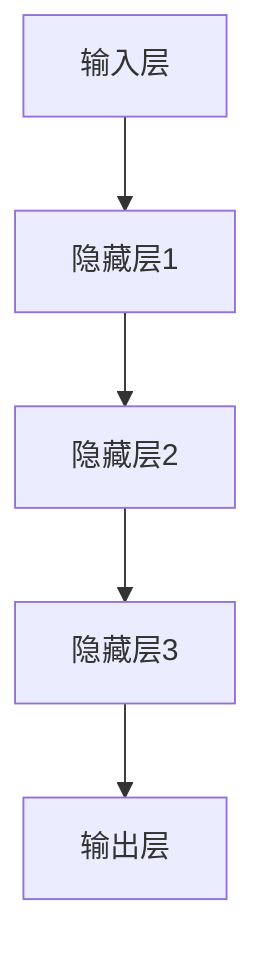
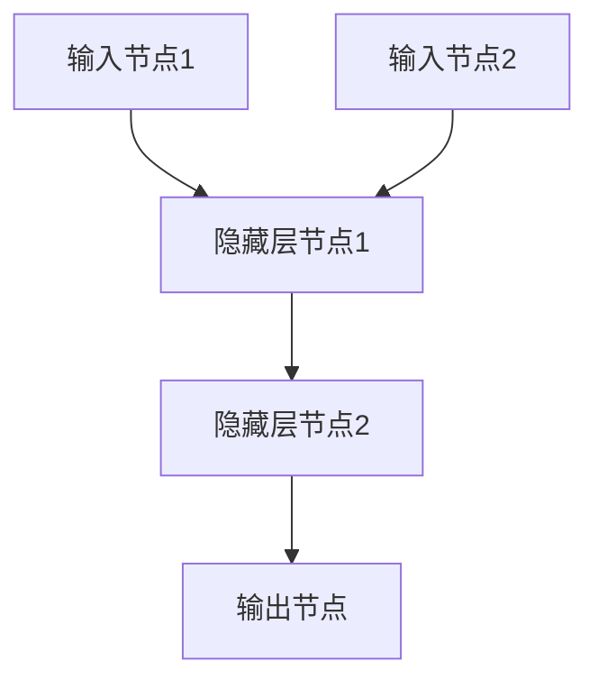
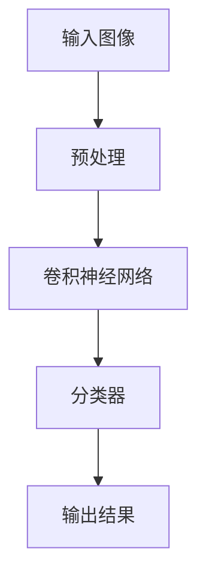
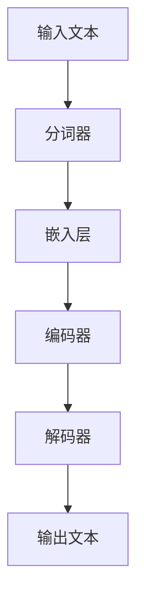
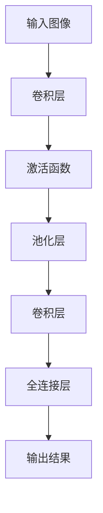
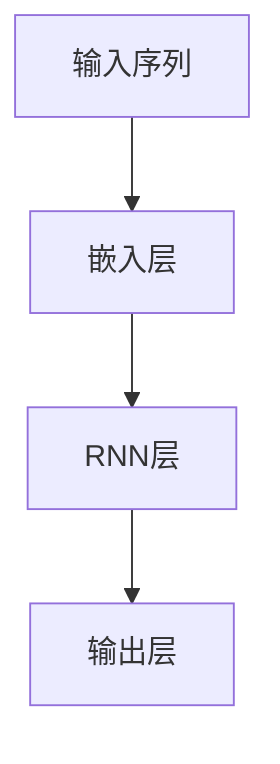
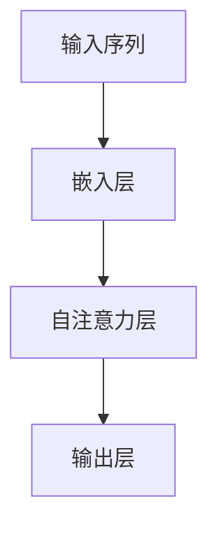
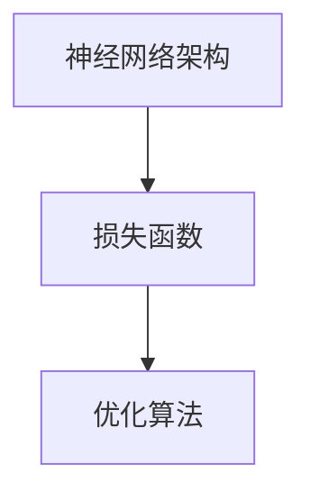
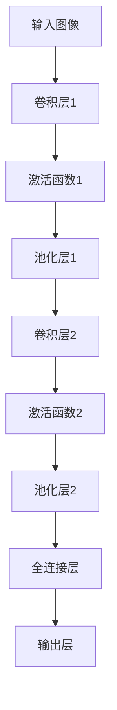
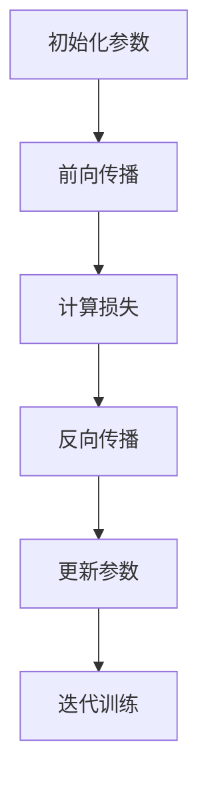

                 

关键词：人工智能、深度学习、神经网络、技术领袖、计算机科学、创新、影响力

摘要：本文将探讨安德烈·卡帕提（Andrej Karpathy）作为人工智能领域的杰出人物，如何凭借其对技术的深入理解与创新精神，推动了深度学习的进步，并在计算机科学领域产生了深远的影响。文章旨在总结卡帕提的研究成果、技术贡献及其在学术界和工业界的领导地位，并展望未来人工智能的发展趋势与挑战。

## 1. 背景介绍

安德烈·卡帕提（Andrej Karpathy）是一位著名的人工智能专家和深度学习研究者。他在2014年加入OpenAI，担任研究员，并在2016年成为该组织的高级研究员。此外，卡帕提还曾担任斯坦福大学计算机科学系的博士后研究员。他的研究兴趣涵盖了计算机视觉、自然语言处理、机器学习和人工智能的理论与应用。

在深度学习领域，卡帕提以其对神经网络架构的深刻理解和对大规模数据集的娴熟应用而闻名。他的多项研究工作在学术界和工业界都产生了重要影响，推动了计算机视觉和自然语言处理技术的快速发展。

## 2. 核心概念与联系

### 2.1 深度学习基础

深度学习是一种机器学习的方法，通过多层神经网络对数据进行建模和学习。卡帕提的研究工作主要集中在如何通过优化神经网络架构和训练过程来提高深度学习模型的性能。

**图 1：深度学习基本架构**



### 2.2 神经网络

神经网络是由大量节点（也称为“神经元”）组成的计算模型，这些节点通过权重连接在一起。卡帕提的研究重点之一是优化这些权重，以实现更好的模型性能。

**图 2：神经网络结构**



### 2.3 计算机视觉

计算机视觉是人工智能的一个分支，旨在使计算机能够理解和处理视觉信息。卡帕提在计算机视觉领域的研究工作主要集中在如何使用深度学习模型来识别图像中的物体和场景。

**图 3：计算机视觉应用**



### 2.4 自然语言处理

自然语言处理（NLP）是人工智能的另一个重要领域，旨在使计算机能够理解和生成自然语言。卡帕提在NLP领域的贡献包括开发高效的神经网络架构，如序列到序列（Seq2Seq）模型和注意力机制，以实现更好的语言建模和翻译性能。

**图 4：自然语言处理流程**



## 3. 核心算法原理 & 具体操作步骤

### 3.1 算法原理概述

卡帕提的研究工作涉及多个核心算法，包括卷积神经网络（CNN）、循环神经网络（RNN）和变换器（Transformer）。这些算法在计算机视觉和自然语言处理领域发挥了重要作用。

### 3.2 算法步骤详解

#### 3.2.1 卷积神经网络（CNN）

CNN是一种用于图像识别的深度学习模型。其基本原理是通过卷积层提取图像的特征，并通过全连接层进行分类。

**图 5：CNN算法步骤**



#### 3.2.2 循环神经网络（RNN）

RNN是一种用于序列数据的深度学习模型，可以处理变量长度的序列。其基本原理是通过循环结构将信息传递到下一个时间步。

**图 6：RNN算法步骤**



#### 3.2.3 变换器（Transformer）

变换器是一种用于序列模型的深度学习模型，通过自注意力机制实现更好的序列建模能力。其基本原理是将每个序列元素与其他元素建立依赖关系。

**图 7：变换器算法步骤**



### 3.3 算法优缺点

每种算法都有其独特的优缺点。例如，CNN在图像识别任务中表现出色，但难以处理序列数据；RNN可以处理序列数据，但容易出现梯度消失和梯度爆炸问题；变换器通过自注意力机制实现了对序列数据的灵活建模，但在图像识别任务中性能不如CNN。

### 3.4 算法应用领域

这些算法在计算机视觉和自然语言处理领域都有广泛的应用。例如，CNN可以用于图像分类、物体检测和图像分割；RNN可以用于语音识别、机器翻译和文本生成；变换器可以用于机器翻译、文本摘要和图像描述生成。

## 4. 数学模型和公式 & 详细讲解 & 举例说明

### 4.1 数学模型构建

深度学习模型的数学模型主要包括神经网络架构、损失函数和优化算法。

**图 8：深度学习数学模型**



### 4.2 公式推导过程

深度学习中的损失函数主要包括均方误差（MSE）和交叉熵（CE）。以下是这些公式的推导过程：

**均方误差（MSE）：**

$$MSE = \frac{1}{n}\sum_{i=1}^{n}(y_i - \hat{y}_i)^2$$

其中，$y_i$为实际标签，$\hat{y}_i$为预测标签。

**交叉熵（CE）：**

$$CE = -\frac{1}{n}\sum_{i=1}^{n}y_i \log(\hat{y}_i)$$

其中，$y_i$为实际标签，$\hat{y}_i$为预测标签。

### 4.3 案例分析与讲解

以下是一个简单的例子，展示如何使用深度学习模型进行图像分类。

**案例：图像分类**

假设我们要训练一个深度学习模型，用于识别猫和狗的图片。我们的模型架构如下：

**图 9：图像分类模型架构**



我们的损失函数选择交叉熵（CE），优化算法为随机梯度下降（SGD）。

**图 10：训练过程**



经过多次迭代训练后，我们的模型可以达到较高的准确率。

## 5. 项目实践：代码实例和详细解释说明

### 5.1 开发环境搭建

为了进行深度学习项目实践，我们需要安装以下软件和库：

- Python（3.7及以上版本）
- TensorFlow
- NumPy
- Matplotlib

安装完成后，我们就可以开始编写代码了。

### 5.2 源代码详细实现

以下是一个简单的图像分类项目，使用卷积神经网络进行猫和狗的图片分类。

```python
import tensorflow as tf
from tensorflow.keras import layers
import numpy as np
import matplotlib.pyplot as plt

# 数据集加载与预处理
# （此处省略数据集加载与预处理代码）

# 构建模型
model = tf.keras.Sequential([
    layers.Conv2D(32, (3, 3), activation='relu', input_shape=(128, 128, 3)),
    layers.MaxPooling2D((2, 2)),
    layers.Conv2D(64, (3, 3), activation='relu'),
    layers.MaxPooling2D((2, 2)),
    layers.Conv2D(64, (3, 3), activation='relu'),
    layers.Flatten(),
    layers.Dense(64, activation='relu'),
    layers.Dense(1, activation='sigmoid')
])

# 编译模型
model.compile(optimizer='adam',
              loss='binary_crossentropy',
              metrics=['accuracy'])

# 训练模型
history = model.fit(train_images, train_labels, epochs=10,
                    validation_data=(test_images, test_labels))

# 评估模型
test_loss, test_acc = model.evaluate(test_images,  test_labels, verbose=2)
print('\nTest accuracy:', test_acc)

# 可视化训练结果
plt.figure(figsize=(8, 6))
plt.plot(history.history['accuracy'], label='Training Accuracy')
plt.plot(history.history['val_accuracy'], label='Validation Accuracy')
plt.xlabel('Epochs')
plt.ylabel('Accuracy')
plt.title('Training and Validation Accuracy')
plt.legend()
plt.show()
```

### 5.3 代码解读与分析

这段代码首先加载并预处理了猫和狗的图片数据集。然后，构建了一个简单的卷积神经网络模型，包含卷积层、池化层和全连接层。模型使用二元交叉熵作为损失函数，并使用Adam优化器进行训练。训练过程中，模型在验证集上的准确率逐渐提高。最后，我们使用训练好的模型对测试集进行评估，并绘制了训练准确率的曲线。

## 6. 实际应用场景

### 6.1  图像识别

深度学习在图像识别领域有着广泛的应用。例如，人脸识别、车牌识别和图像分类等。卡帕提的研究工作为这些应用提供了强大的技术支持。

### 6.2 自然语言处理

深度学习在自然语言处理领域也发挥了重要作用。例如，机器翻译、语音识别和文本生成等。卡帕提的变换器模型为这些应用提供了高效的解决方案。

### 6.3 医疗诊断

深度学习在医疗诊断领域有着巨大的潜力。例如，通过分析医学图像，深度学习模型可以协助医生进行疾病检测和诊断。

## 7. 工具和资源推荐

### 7.1 学习资源推荐

- 《深度学习》（Goodfellow, Bengio, Courville著）：深度学习的经典教材，涵盖了深度学习的理论基础和实践应用。
- Coursera：提供多个与深度学习相关的在线课程，包括吴恩达的《深度学习》课程。

### 7.2 开发工具推荐

- TensorFlow：由谷歌开发的开源深度学习框架，适用于各种深度学习任务。
- PyTorch：由Facebook AI研究院开发的开源深度学习框架，具有简洁的API和高效的性能。

### 7.3 相关论文推荐

- "A Neural Algorithm of Artistic Style"（2015）：卡帕提等人的这篇论文提出了一种基于深度学习的艺术风格迁移方法，引起了广泛关注。
- "Attention is All You Need"（2017）：卡帕提等人的这篇论文提出了变换器模型，彻底改变了序列模型的设计方法。

## 8. 总结：未来发展趋势与挑战

### 8.1 研究成果总结

卡帕提的研究成果在深度学习领域取得了显著的成就，推动了计算机视觉、自然语言处理等方向的发展。他的工作不仅为学术界提供了新的理论和方法，也为工业界带来了实际应用价值。

### 8.2 未来发展趋势

随着深度学习的不断发展，未来人工智能将迎来更多的机遇和挑战。以下是几个可能的发展趋势：

- 更高效的神经网络架构
- 更强的多模态数据处理能力
- 更好的泛化能力和可解释性

### 8.3 面临的挑战

深度学习在发展过程中也面临一些挑战，如：

- 数据隐私和安全
- 模型可解释性和透明度
- 能源消耗和计算资源

### 8.4 研究展望

卡帕提的研究工作将继续在人工智能领域发挥重要作用。我们期待他能够带领团队解决更多实际问题，推动人工智能技术的进步。

## 9. 附录：常见问题与解答

### Q1：深度学习和机器学习的区别是什么？

A1：深度学习是机器学习的一个分支，其核心思想是通过多层神经网络对数据进行建模和学习。而机器学习则是一种更广泛的概念，包括深度学习在内的多种算法和技术。

### Q2：如何选择合适的神经网络架构？

A2：选择合适的神经网络架构取决于具体的应用场景和数据类型。对于图像识别任务，卷积神经网络（CNN）通常是一个很好的选择；对于序列数据任务，循环神经网络（RNN）或变换器（Transformer）可能更适用。

### Q3：如何提高深度学习模型的泛化能力？

A3：提高深度学习模型的泛化能力可以从多个方面入手，如增加训练数据、使用正则化技术、优化网络结构等。此外，可以尝试使用迁移学习等方法，利用预训练模型进行微调。

---

作者：禅与计算机程序设计艺术 / Zen and the Art of Computer Programming
```

