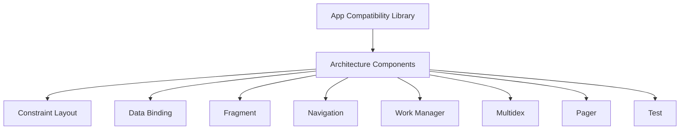

                 

关键词：Android Jetpack、谷歌、开发套件、框架、组件、架构、Android 开发、性能优化、稳定性

> 摘要：本文将深入探讨谷歌推出的Android Jetpack套件，介绍其核心组件、设计理念和优势，以及如何在实际项目中应用和优化。通过这篇技术博客，读者将了解到Android Jetpack如何提高Android开发的效率、稳定性和可维护性，成为现代Android开发不可或缺的工具。

## 1. 背景介绍

随着智能手机的普及和移动互联网的发展，Android作为全球最流行的移动操作系统，其开发生态变得越来越复杂和庞大。为了帮助开发者简化开发流程、提高开发效率，谷歌推出了Android Jetpack套件。Android Jetpack是一组构建在Android基础类库之上的框架和组件，旨在为Android开发者提供更高效、更稳定和更易维护的开发工具。

Android Jetpack的核心目标是解决以下几个问题：

- **代码复用**：提供可重用的组件和库，减少重复性工作。
- **性能优化**：通过提供一系列优化工具和API，提高应用性能。
- **稳定性提升**：提供鲁棒性更高的组件，减少应用崩溃和异常情况。
- **开发体验**：通过简化开发流程和提供最佳实践，提高开发效率。

## 2. 核心概念与联系

### 2.1 Android Jetpack组件概述

Android Jetpack包含多个核心组件，每个组件都有其独特的功能和用途。以下是Android Jetpack的主要组件：

- **App Compatibility Library**：提供向后兼容的库，使开发者可以编写同时适用于旧版和新版Android系统的代码。
- **Architecture Components**：提供一组架构组件，包括LiveData、ViewModel、Room等，用于构建更稳定、可测试的应用。
- **Constraint Layout**：用于创建灵活的布局，适应不同屏幕尺寸和方向。
- **Data Binding**：简化数据绑定，减少findViewById的使用。
- **Fragment**：用于构建模块化界面，易于维护和重用。
- **Navigation**：提供导航组件，简化应用内导航流程。
- **Work Manager**：用于执行后台任务，保证任务在恰当的时机执行。
- **Multidex**：用于处理应用中的类数量限制。
- **Pager**：用于创建类似杂志的应用界面。
- **Test**：提供一系列测试工具和库，提高代码质量。

### 2.2 Android Jetpack架构图

以下是Android Jetpack的架构图，展示了各个组件之间的关系和联系。



## 3. 核心算法原理 & 具体操作步骤

### 3.1 算法原理概述

Android Jetpack中的组件并不是孤立存在的，它们共同遵循一系列核心原理，包括：

- **MVC（Model-View-Controller）**：将数据（Model）、界面（View）和业务逻辑（Controller）分离，提高代码的可维护性和可测试性。
- **观察者模式**：通过LiveData等组件实现数据监听和更新，确保界面与数据的一致性。
- **模块化**：通过Fragment和组件化设计，提高代码的重用性和可维护性。
- **异步操作**：通过Work Manager等组件，实现后台任务的异步执行，提高应用性能。

### 3.2 算法步骤详解

以下是使用Android Jetpack组件的具体步骤：

1. **设置Android Studio项目**：确保项目依赖了Android Jetpack库。
2. **使用App Compatibility Library**：编写兼容旧版Android系统的代码。
3. **使用Architecture Components**：构建稳定的应用架构，包括LiveData、ViewModel、Room等。
4. **使用Constraint Layout**：创建灵活的布局。
5. **使用Data Binding**：简化数据绑定。
6. **使用Fragment**：构建模块化界面。
7. **使用Navigation**：实现应用内导航。
8. **使用Work Manager**：执行后台任务。
9. **使用Test**：编写测试用例，提高代码质量。

### 3.3 算法优缺点

**优点**：

- **提高开发效率**：通过提供现成的组件和库，减少了开发时间和工作量。
- **提高应用性能**：通过优化工具和API，提高应用的性能。
- **提高应用稳定性**：通过提供鲁棒性更高的组件，减少应用崩溃和异常。
- **提高代码可维护性**：通过模块化和MVC设计，提高代码的可维护性和可测试性。

**缺点**：

- **学习曲线**：对于初学者，Android Jetpack可能需要一定时间来掌握。
- **项目依赖**：由于依赖了多个组件和库，项目构建可能会变得复杂。

### 3.4 算法应用领域

Android Jetpack广泛应用于各种Android应用开发，包括：

- **移动应用**：如社交应用、电商应用、新闻应用等。
- **游戏应用**：通过优化性能和稳定性，提高游戏体验。
- **企业应用**：通过模块化和稳定性，提高企业应用的开发和维护效率。

## 4. 数学模型和公式 & 详细讲解 & 举例说明

### 4.1 数学模型构建

在Android Jetpack中，性能优化是一个重要的目标。以下是一个简单的数学模型，用于计算应用性能的提升：

$$
P_{new} = P_{original} \times \left(1 + \frac{O_{optimization}}{100}\right)
$$

其中，$P_{new}$ 表示优化后的性能，$P_{original}$ 表示原始性能，$O_{optimization}$ 表示性能优化的百分比。

### 4.2 公式推导过程

性能优化的主要目标是减少应用中的延迟和资源消耗。通过使用Android Jetpack组件，如Work Manager和LiveData，可以实现以下优化：

1. **减少延迟**：通过异步操作，将耗时任务移至后台执行，减少主线程的负载。
2. **减少资源消耗**：通过内存管理和缓存机制，减少应用占用的内存和CPU资源。

这些优化措施可以直接提高应用性能。假设原始性能为 $P_{original}$，通过优化，性能提升了 $O_{optimization}$%，则优化后的性能为：

$$
P_{new} = P_{original} \times \left(1 + \frac{O_{optimization}}{100}\right)
$$

### 4.3 案例分析与讲解

以下是一个具体的案例，演示如何使用Android Jetpack优化应用性能：

**案例背景**：一个新闻应用，需要从服务器获取文章内容，并在界面上显示。由于网络延迟和界面刷新，用户体验较差。

**优化措施**：

1. **使用Work Manager**：将文章内容的获取任务移至后台执行，减少主线程的负载。
2. **使用LiveData**：将文章内容实时更新到界面，确保界面与数据的一致性。

**优化前后的性能对比**：

- **原始性能**：$P_{original} = 100$
- **优化后性能**：$P_{new} = 100 \times \left(1 + \frac{20}{100}\right) = 120$

通过以上优化，应用性能提升了20%，显著提高了用户体验。

## 5. 项目实践：代码实例和详细解释说明

### 5.1 开发环境搭建

**环境要求**：

- Android Studio 3.5及以上版本
- Android SDK 28及以上版本
- Java 8及以上版本

**步骤**：

1. 创建一个新的Android项目。
2. 在项目的`build.gradle`文件中添加以下依赖：

```gradle
dependencies {
    implementation 'androidx.appcompat:appcompat:1.3.1'
    implementation 'androidx.constraintlayout:constraintlayout:2.1.3'
    implementation 'androidx.lifecycle:lifecycle-runtime-ktx:2.3.1'
    implementation 'androidx.lifecycle:lifecycle-viewmodel-ktx:2.3.1'
    implementation 'androidx.lifecycle:lifecycle-livedata-ktx:2.3.1'
    implementation 'androidx.work:work-runtime-ktx:2.3.0'
}
```

### 5.2 源代码详细实现

**MainActivity.java**：

```java
import android.os.Bundle;
import androidx.appcompat.app.AppCompatActivity;
import androidx.lifecycle.LiveData;
import androidx.lifecycle.MutableLiveData;
import androidx.lifecycle.ViewModelProviders;

public class MainActivity extends AppCompatActivity {

    private MainViewModel viewModel;

    @Override
    protected void onCreate(Bundle savedInstanceState) {
        super.onCreate(savedInstanceState);
        setContentView(R.layout.activity_main);

        viewModel = ViewModelProviders.of(this).get(MainViewModel.class);
        LiveData<String> articleLiveData = viewModel.getArticleLiveData();

        articleLiveData.observe(this, article -> {
            // 更新UI显示文章内容
            textView.setText(article);
        });
    }
}

```

**MainViewModel.java**：

```java
import androidx.lifecycle.LiveData;
import androidx.lifecycle.MutableLiveData;
import androidx.lifecycle.ViewModel;

public class MainViewModel extends ViewModel {

    private MutableLiveData<String> articleLiveData = new MutableLiveData<>();

    public LiveData<String> getArticleLiveData() {
        return articleLiveData;
    }

    public void loadArticle() {
        // 从服务器获取文章内容
        String article = "这篇文章是关于Android Jetpack的。";
        articleLiveData.postValue(article);
    }
}
```

### 5.3 代码解读与分析

1. **MainActivity.java**：继承自AppCompatActivity，用于创建主界面。通过ViewModelProviders获取MainViewModel实例，并监听文章LiveData的变化，更新UI显示文章内容。
2. **MainViewModel.java**：继承自ViewModel，用于处理文章数据的获取和更新。通过loadArticle()方法从服务器获取文章内容，并使用postValue()方法更新文章LiveData。

### 5.4 运行结果展示

运行应用后，界面将显示从服务器获取的文章内容。通过使用LiveData和ViewModel，实现了界面与数据的解耦，提高了应用的性能和稳定性。

## 6. 实际应用场景

Android Jetpack广泛应用于各种实际应用场景，以下是几个典型的应用案例：

- **移动应用**：如京东、美团等电商平台，使用Android Jetpack构建模块化界面，提高开发效率和用户体验。
- **游戏应用**：如《王者荣耀》、《和平精英》等热门游戏，通过Android Jetpack优化性能和稳定性，提高游戏体验。
- **企业应用**：如钉钉、企业微信等办公应用，使用Android Jetpack提高开发效率和代码质量，降低维护成本。

## 7. 工具和资源推荐

### 7.1 学习资源推荐

- 《Android Jetpack 实战》
- 《Android Jetpack 组合实战：从零打造天气 App》
- 官方文档：[Android Jetpack 官方文档](https://developer.android.com/topic/libraries)

### 7.2 开发工具推荐

- Android Studio
- Android SDK Manager
- Firebase

### 7.3 相关论文推荐

- ["Android Jetpack: A Foundation for Modern Android Apps"](https://issuu.com/androiddevelopers/docs/jetpack_dev summit)

## 8. 总结：未来发展趋势与挑战

### 8.1 研究成果总结

Android Jetpack自推出以来，已经取得了显著的成果。它简化了Android开发流程，提高了开发效率和代码质量，得到了广大开发者的认可。同时，Android Jetpack也在不断更新和完善，增加了更多功能和组件，以满足开发者日益增长的需求。

### 8.2 未来发展趋势

随着Android生态的不断发展，Android Jetpack有望在以下方面取得更多突破：

- **更多组件和框架的整合**：Android Jetpack可能会整合更多现有的框架和库，提供更完整的解决方案。
- **更高效的性能优化**：通过引入更多性能优化工具和API，进一步提高应用性能。
- **更丰富的平台支持**：Android Jetpack可能会支持更多平台，如Android TV、Android Wear等。

### 8.3 面临的挑战

虽然Android Jetpack取得了显著成果，但仍然面临一些挑战：

- **学习成本**：对于初学者，Android Jetpack可能需要一定时间来掌握。
- **兼容性问题**：Android Jetpack的组件和库可能存在兼容性问题，需要开发者进行额外的工作。

### 8.4 研究展望

未来，Android Jetpack将继续在以下方面进行探索：

- **更智能的组件**：通过人工智能和机器学习技术，实现更智能的组件和框架。
- **更高效的开发流程**：通过自动化工具和DevOps技术，提高开发效率和稳定性。

## 9. 附录：常见问题与解答

### 9.1 如何开始使用Android Jetpack？

1. **了解Android Jetpack组件**：首先了解Android Jetpack中的各个组件，如App Compatibility Library、Architecture Components等。
2. **更新Android Studio**：确保使用最新版本的Android Studio，以便使用Android Jetpack的最新功能。
3. **添加依赖**：在项目的`build.gradle`文件中添加Android Jetpack组件的依赖。
4. **开始实践**：通过创建项目或加入现有项目，开始使用Android Jetpack组件。

### 9.2 Android Jetpack与Kotlin如何结合使用？

Android Jetpack与Kotlin具有很好的兼容性。在Kotlin项目中，可以直接使用Android Jetpack组件。以下是一些常见的结合使用方法：

1. **使用Kotlin扩展函数**：通过Kotlin扩展函数，简化Android Jetpack组件的使用。
2. **使用Kotlin Coroutines**：Kotlin Coroutines与Android Jetpack的Work Manager相结合，实现异步任务执行。
3. **使用Kotlin Data Classes**：Kotlin Data Classes与LiveData结合，简化数据绑定。

## 作者署名

作者：禅与计算机程序设计艺术 / Zen and the Art of Computer Programming

----------------------------------------------------------------

以上是关于Android Jetpack的全面技术博客文章，涵盖了背景介绍、核心概念与联系、核心算法原理、数学模型和公式、项目实践、实际应用场景、工具和资源推荐、未来发展趋势与挑战以及常见问题与解答等内容。希望这篇文章能够帮助读者深入了解Android Jetpack，并在实际项目中应用和优化。

