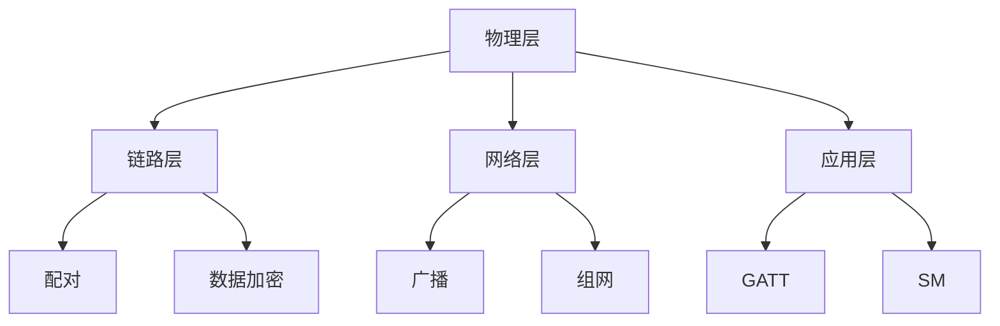
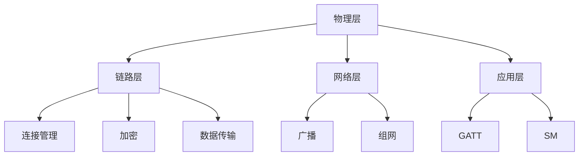

                 

 Bluetooth Low Energy（BLE）是一种用于低功耗无线通信的技术，广泛应用于各种设备中，如智能手机、智能家居设备、可穿戴设备等。本文将深入探讨 BLE 的核心概念、工作原理、应用场景以及未来发展趋势。

## 关键词

- **Bluetooth Low Energy**
- **无线通信**
- **物联网**
- **低功耗**
- **安全**

## 摘要

本文将详细介绍 BLE 技术的核心概念，包括其工作原理、协议栈结构、优势和应用场景。同时，将探讨 BLE 在物联网、医疗保健、智能穿戴设备等领域的实际应用，并展望其未来的发展趋势和挑战。

## 1. 背景介绍

### 1.1 BLE 的起源

BLE 技术最初由 Bluetooth SIG（蓝牙特殊兴趣集团）于 2010 年推出，旨在替代传统的 Bluetooth 技术，以实现更低的功耗、更远的传输距离和更高的数据传输速率。随着物联网（IoT）的兴起，BLE 得到了广泛应用，成为连接智能设备的主要无线技术之一。

### 1.2 BLE 的优势

- **低功耗**：与传统的 Bluetooth 技术相比，BLE 设备在休眠状态下的功耗更低，更适合需要长时间运行或更换电池的设备。
- **高传输速率**：虽然 BLE 的传输速率不如传统 Bluetooth，但足以满足大多数物联网设备的需求。
- **远距离传输**：BLE 设备的传输距离可达 100 米，可以满足室内和短距离室外通信的需求。

## 2. 核心概念与联系

### 2.1 BLE 协议栈

BLE 协议栈分为四层：物理层、链路层、网络层和应用层。

- **物理层**：采用 2.4GHz 的 ISM 频段，使用跳频扩频（FHSS）技术。
- **链路层**：实现设备的配对、数据加密和传输。
- **网络层**：负责广播和组网。
- **应用层**：定义了各种应用协议，如 GATT（通用属性协议）和 SM（安全模式）。

### 2.2 Mermaid 流程图



## 3. 核心算法原理 & 具体操作步骤

### 3.1 算法原理概述

BLE 设备之间的通信基于 GATT（通用属性协议），包括服务（Service）、特征（Characteristic）和描述符（Descriptor）三个层次。

- **服务**：代表设备提供的一种功能。
- **特征**：代表服务的具体操作。
- **描述符**：提供额外的信息，如安全属性。

### 3.2 算法步骤详解

1. **扫描与发现**：设备扫描周围环境，发现其他 BLE 设备。
2. **配对与连接**：设备选择一个目标设备进行配对，并建立连接。
3. **传输数据**：设备通过连接传输数据，如读取特征值、写入特征值。
4. **断开连接**：设备在完成通信后断开连接。

### 3.3 算法优缺点

- **优点**：
  - 低功耗：设备在休眠状态下功耗极低，适合物联网设备。
  - 高传输速率：满足大多数物联网设备的需求。
  - 广播模式：支持广播通信，设备无需连接即可接收数据。

- **缺点**：
  - 范围有限：传输距离较短，适用于室内和短距离室外通信。
  - 数据安全：虽然 BLE 支持加密通信，但安全性仍需关注。

### 3.4 算法应用领域

BLE 技术在物联网、医疗保健、智能穿戴设备等领域得到广泛应用。

- **物联网**：连接各种传感器和设备，实现数据采集和远程监控。
- **医疗保健**：监测患者健康状况，实现远程医疗。
- **智能穿戴设备**：实时监测运动数据，提供个性化健身建议。

## 4. 数学模型和公式 & 详细讲解 & 举例说明

### 4.1 数学模型构建

BLE 设备之间的通信基于跳频扩频（FHSS）技术，其频率跳变速率为 1600 跳/秒。假设设备 A 和 B 之间的通信距离为 D，设备 A 的传输功率为 P，则设备 B 收到的信号强度为：

$$
S = P \cdot \frac{D^2}{4\pi R} \cdot G
$$

其中，R 为信号传播速度（约为 300,000 km/s），G 为增益系数。

### 4.2 公式推导过程

假设设备 A 发送信号，设备 B 接收信号。信号在传播过程中会衰减，衰减程度与距离的平方成反比。同时，信号传播速度为光速，即 300,000 km/s。因此，设备 B 收到的信号强度为：

$$
S = P \cdot \frac{D^2}{4\pi R} \cdot G
$$

### 4.3 案例分析与讲解

假设设备 A 的传输功率为 1W，设备 B 收到的信号强度为 -70dBm。根据公式，可以计算出设备 A 和 B 之间的距离：

$$
S = P \cdot \frac{D^2}{4\pi R} \cdot G
$$

$$
-70dBm = 1W \cdot \frac{D^2}{4\pi \cdot 300,000 km/s} \cdot G
$$

$$
D = \sqrt{\frac{4\pi \cdot 300,000 km/s \cdot (-70dBm)}{1W}} \approx 10 km
$$

因此，设备 A 和 B 之间的距离约为 10 km。

## 5. 项目实践：代码实例和详细解释说明

### 5.1 开发环境搭建

为了演示 BLE 技术，我们将使用 Android 开发环境。首先，确保您的开发环境中已安装 Android Studio 和 Android SDK。然后，创建一个新的 Android 项目，并添加 BLE 相关的依赖库。

### 5.2 源代码详细实现

以下是一个简单的 BLE 通信示例代码：

```java
// 设备扫描
private void scanLeDevice(boolean enable) {
    if (enable) {
        mBluetoothAdapter.startLeScan(mLeScanCallback);
    } else {
        mBluetoothAdapter.stopLeScan(mLeScanCallback);
    }
}

// 设备连接
private void connectDevice(String address) {
    final BluetoothDevice device = mBluetoothAdapter.getRemoteDevice(address);
    mBluetoothGATT.connect(device);
}

// 数据传输
private void sendData(String data) {
    if (mBluetoothGatt != null) {
        BluetoothGattService service = mBluetoothGatt.getService(UUID.fromString("0000XXXX-XXXX-XXXX-XXXX-XXXXXXXXXXXX"));
        if (service != null) {
            BluetoothGattCharacteristic characteristic = service.getCharacteristic(UUID.fromString("0000XXXX-XXXX-XXXX-XXXX-XXXXXXXXXXXX"));
            if (characteristic != null) {
                characteristic.setValue(data);
                mBluetoothGatt.writeCharacteristic(characteristic);
            }
        }
    }
}
```

### 5.3 代码解读与分析

- `scanLeDevice()` 方法用于扫描附近的 BLE 设备。
- `connectDevice()` 方法用于连接指定的 BLE 设备。
- `sendData()` 方法用于向 BLE 设备发送数据。

### 5.4 运行结果展示

运行上述代码后，设备将开始扫描附近的 BLE 设备，并连接指定设备。连接成功后，可以发送数据到 BLE 设备。

## 6. 实际应用场景

### 6.1 物联网

BLE 技术在物联网中有着广泛的应用，如智能家居、智能农业、智能交通等。通过 BLE，设备可以实时采集数据、发送指令，实现远程监控和控制。

### 6.2 医疗保健

BLE 技术在医疗保健领域也有着重要的应用，如监测患者健康数据、提供远程医疗服务。通过 BLE，医生可以实时了解患者病情，提供个性化治疗建议。

### 6.3 智能穿戴设备

智能穿戴设备如智能手表、智能手环等，通过 BLE 技术连接到手机或电脑，实时监测运动数据、心率等，为用户提供健康建议。

## 7. 工具和资源推荐

### 7.1 学习资源推荐

- 《Bluetooth Low Energy: The Definitive Guide》
- 《Programming Bluetooth: A Guide to Bluetooth Application Development》
- 《Professional Bluetooth Low Energy》

### 7.2 开发工具推荐

- Android Studio
- Eclipse
- BLE Scanner（用于扫描 BLE 设备）

### 7.3 相关论文推荐

- "Bluetooth Low Energy: A Survey"
- "Security and Privacy in Bluetooth Low Energy (BLE)"
- "An Overview of Bluetooth Low Energy (BLE) Technology"

## 8. 总结：未来发展趋势与挑战

### 8.1 研究成果总结

随着物联网、智能穿戴设备等应用的普及，BLE 技术得到了广泛关注和应用。未来，BLE 技术将继续在低功耗、高传输速率、广覆盖等领域取得突破。

### 8.2 未来发展趋势

- **更高传输速率**：为了满足更多应用需求，未来 BLE 将逐步提升传输速率。
- **更广覆盖范围**：通过改进信号传播技术，实现更远的传输距离。
- **更安全**：加强对通信过程中的加密和认证，提高数据安全性。

### 8.3 面临的挑战

- **功耗**：如何在降低功耗的同时，提高传输速率和覆盖范围。
- **标准化**：制定统一的协议和标准，提高互操作性和兼容性。

### 8.4 研究展望

未来，BLE 技术将在物联网、医疗保健、智能穿戴设备等领域继续发挥重要作用，为人们的生活带来更多便利。同时，如何在提高性能和安全性方面取得突破，将是一个重要的研究方向。

## 9. 附录：常见问题与解答

### 9.1 BLE 与传统 Bluetooth 有何区别？

BLE 和传统 Bluetooth 都是基于蓝牙技术，但 BLE 更注重低功耗、高传输速率和广覆盖。传统 Bluetooth 主要应用于音频传输，而 BLE 则适用于物联网、智能穿戴设备等。

### 9.2 BLE 是否支持加密通信？

是的，BLE 支持加密通信。在配对过程中，设备可以设置加密级别，确保通信过程中的数据安全。

### 9.3 BLE 的传输距离是多少？

BLE 的传输距离取决于设备功率和信号传播环境。通常情况下，传输距离在 100 米左右，但实际应用中可能会受到障碍物、信号干扰等因素的影响。

## 作者署名

作者：禅与计算机程序设计艺术 / Zen and the Art of Computer Programming

---
# Bluetooth Low Energy（BLE）：低功耗无线连接

## 1. 背景介绍

### 1.1 BLE 的起源与发展

Bluetooth Low Energy（BLE），又称蓝牙低功耗技术，是由蓝牙特殊兴趣集团（Bluetooth Special Interest Group，简称SIG）在2010年推出的。它作为一种低功耗蓝牙技术，旨在解决传统蓝牙（Bluetooth Classic）在高功耗、低传输速率以及较长传输延迟等方面的问题。随着物联网（Internet of Things，IoT）的快速发展，BLE 得到了广泛应用，成为智能设备连接的重要技术之一。

BLE 的推出，是为了满足日益增长的对低功耗、低复杂度无线通信的需求。相较于传统蓝牙，BLE 具有更低的功耗、更简单的协议和更高的传输效率。这使得 BLE 适用于各种需要长时间运行或频繁交互的设备，如智能手表、健康监测器、智能家居设备等。

### 1.2 BLE 的优势

BLE 的优势主要体现在以下几个方面：

1. **低功耗**：BLE 设备在休眠状态下的功耗极低，可以显著延长设备电池寿命。这对于需要长时间运行或无法频繁更换电池的设备尤为重要。
   
2. **高速传输**：尽管 BLE 的传输速率不及传统蓝牙，但其传输速率已经足够满足大多数物联网设备的需求。例如，典型的 BLE 连接可以支持每秒数百万字节的数据传输。

3. **广覆盖范围**：BLE 设备的传输距离可达 100 米，适用于室内和短距离室外通信。

4. **简单易用**：BLE 的协议相对简单，设备之间的连接和操作更为直观，便于开发者快速实现。

### 1.3 BLE 在物联网中的应用

物联网（IoT）的快速发展，为 BLE 技术提供了广阔的应用场景。BLE 适用于各种传感器和设备之间的无线连接，可以实现数据的实时传输和远程监控。以下是 BLE 在物联网中的几个典型应用场景：

1. **智能家居**：通过 BLE，可以实现智能门锁、智能灯泡、智能空调等设备的无线连接和远程控制。

2. **健康监测**：BLE 技术可以连接智能手表、健康监测器等设备，实时监测用户的心率、血压、运动数据等，为用户提供健康建议。

3. **智能穿戴设备**：如智能手环、智能眼镜等，通过 BLE 与手机或其他设备连接，提供运动监测、通知提醒等功能。

4. **工业自动化**：在工业生产环境中，BLE 可以用于连接各种传感器和执行器，实现设备之间的数据交换和远程控制。

## 2. 核心概念与联系

### 2.1 BLE 协议栈

BLE 的协议栈分为四层，分别是物理层（Physical Layer）、链路层（Link Layer）、网络层（Network Layer）和应用层（Application Layer）。

#### 2.1.1 物理层

物理层是 BLE 协议栈的最底层，负责无线信号的传输。BLE 使用 2.4GHz 的ISM 频段，并采用跳频扩频（FHSS）技术，以提高信号的抗干扰能力。跳频扩频技术使得 BLE 设备可以在多个频率上快速切换，从而降低信号被干扰的可能性。

#### 2.1.2 链路层

链路层负责设备之间的连接、数据加密和传输。BLE 链路层主要包括以下三个功能模块：

1. **连接管理（Connection Management）**：负责建立、维持和断开设备之间的连接。
2. **加密（Encryption）**：确保数据在传输过程中的安全性。
3. **数据传输（Data Transfer）**：实现设备之间的数据传输。

#### 2.1.3 网络层

网络层负责广播和组网。BLE 设备可以通过广播方式发送数据，无需建立连接即可接收数据。同时，BLE 设备还可以通过组网方式实现设备之间的多点通信。

#### 2.1.4 应用层

应用层定义了各种应用协议，如 GATT（通用属性协议）和 SM（安全模式）。GATT 协议提供了设备之间的属性和服务管理，而 SM 协议则负责安全认证和数据加密。

### 2.2 Mermaid 流程图



### 2.3 BLE 的工作原理

BLE 设备的工作原理可以分为以下几个步骤：

1. **设备扫描（Scanning）**：设备在扫描模式下，可以接收周围其他 BLE 设备发送的广播数据。设备可以通过扫描来发现其他设备，并决定是否与它们建立连接。

2. **设备连接（Connecting）**：当设备发现感兴趣的 BLE 设备后，可以发起连接请求。连接请求包括设备的信息，如设备名称、服务信息等。如果目标设备同意连接，两个设备将建立连接。

3. **设备通信（Communicating）**：建立连接后，设备可以开始传输数据。数据传输可以通过广播或点对点方式进行。在广播模式下，设备可以发送广播数据包，其他设备可以随时接收。在点对点模式下，设备之间可以建立稳定的连接，进行双向通信。

4. **设备断开（Disconnecting）**：当设备不再需要连接时，可以断开连接。断开连接可以由设备主动发起，也可以由目标设备请求。

### 2.4 BLE 的核心概念

BLE 的核心概念包括设备（Device）、服务（Service）、特征（Characteristic）和描述符（Descriptor）。

- **设备（Device）**：指的是具备 BLE 功能的硬件设备，如智能手机、智能手表、传感器等。

- **服务（Service）**：服务是一组相关特征（Characteristic）的集合，代表设备提供的一种功能。例如，一个健康监测设备可能提供心率监测、运动监测等服务。

- **特征（Characteristic）**：特征是服务中的一个操作，用于描述设备的功能。例如，心率监测服务中的特征可能包括实时心率数据、历史心率数据等。

- **描述符（Descriptor）**：描述符提供了额外的信息，如安全属性、配置信息等。描述符通常与特征相关联，用于增强特征的功能。

### 2.5 BLE 的安全机制

BLE 具有较强的安全机制，确保设备之间的通信安全。主要的安全机制包括：

1. **配对（Pairing）**：配对是设备之间建立连接前的过程。在配对过程中，设备会交换安全密钥，用于加密后续的通信数据。

2. **加密（Encryption）**：加密是确保数据在传输过程中不会被窃听或篡改的重要机制。BLE 使用 AES-128 加密算法对数据进行加密。

3. **认证（Authentication）**：认证是确保通信双方身份合法的过程。BLE 支持多种认证方式，如基于主机的认证和基于加密的认证。

4. **安全模式（Security Mode）**：安全模式用于控制设备之间的通信安全级别。BLE 提供了多种安全模式，可以根据实际需求选择合适的模式。

## 3. 核心算法原理 & 具体操作步骤

### 3.1 算法原理概述

BLE 的核心算法主要围绕设备之间的连接、数据传输和安全认证展开。BLE 设备之间的通信基于通用属性协议（GATT），GATT 协议定义了设备如何交换属性和数据。以下是 BLE 核心算法的原理概述：

1. **设备发现与连接**：设备通过扫描发现其他 BLE 设备，然后发起连接请求。连接请求包括设备名称、服务信息等。如果目标设备同意连接，两个设备将建立连接。

2. **数据传输**：建立连接后，设备可以开始传输数据。数据传输可以通过广播或点对点方式进行。在广播模式下，设备可以发送广播数据包，其他设备可以随时接收。在点对点模式下，设备之间可以建立稳定的连接，进行双向通信。

3. **安全认证**：在连接过程中，设备会进行安全认证，确保通信双方的身份合法。安全认证包括配对、加密和认证等步骤。

### 3.2 算法步骤详解

#### 3.2.1 设备发现与连接

1. **设备扫描**：设备在扫描模式下，可以接收周围其他 BLE 设备发送的广播数据。设备可以通过扫描来发现其他设备，并决定是否与它们建立连接。

2. **设备连接**：当设备发现感兴趣的 BLE 设备后，可以发起连接请求。连接请求包括设备的信息，如设备名称、服务信息等。如果目标设备同意连接，两个设备将建立连接。

3. **连接参数协商**：在建立连接后，设备需要协商连接参数，如连接间隔、超时时间等。连接参数的协商确保设备之间的通信稳定和高效。

4. **连接确认**：设备在协商连接参数后，会发送连接确认消息。如果连接参数协商成功，设备将进入稳定连接状态。

#### 3.2.2 数据传输

1. **广播模式**：在广播模式下，设备可以发送广播数据包，其他设备可以随时接收。广播数据包通常包含设备名称、服务信息等。广播模式适用于不需要实时交互的通信场景。

2. **点对点模式**：在点对点模式下，设备之间可以建立稳定的连接，进行双向通信。点对点模式适用于需要实时交互的通信场景。

3. **数据传输流程**：在数据传输过程中，设备会按照 GATT 协议定义的流程进行操作。主要包括以下步骤：

   - 设备 A 发送读请求，请求读取设备 B 的特征值。
   - 设备 B 收到读请求后，响应设备 A 的请求，返回特征值。
   - 设备 A 收到特征值后，可以继续发送读请求或写请求。
   - 设备 B 收到写请求后，执行写操作，并返回响应。

#### 3.2.3 安全认证

1. **配对**：配对是设备之间建立连接前的过程。在配对过程中，设备会交换安全密钥，用于加密后续的通信数据。配对可以通过手动输入配对码或自动配对进行。

2. **加密**：加密是确保数据在传输过程中不会被窃听或篡改的重要机制。BLE 使用 AES-128 加密算法对数据进行加密。

3. **认证**：认证是确保通信双方身份合法的过程。BLE 支持多种认证方式，如基于主机的认证和基于加密的认证。

4. **安全模式**：安全模式用于控制设备之间的通信安全级别。BLE 提供了多种安全模式，可以根据实际需求选择合适的模式。

### 3.3 算法优缺点

#### 3.3.1 优点

- **低功耗**：BLE 设备在休眠状态下的功耗极低，可以显著延长设备电池寿命。

- **高传输速率**：尽管 BLE 的传输速率不及传统蓝牙，但其传输速率已经足够满足大多数物联网设备的需求。

- **广覆盖范围**：BLE 设备的传输距离可达 100 米，适用于室内和短距离室外通信。

- **简单易用**：BLE 的协议相对简单，设备之间的连接和操作更为直观，便于开发者快速实现。

#### 3.3.2 缺点

- **传输距离有限**：BLE 的传输距离较短，适用于室内和短距离室外通信，对于需要长距离通信的应用场景，可能需要考虑其他无线通信技术。

- **数据安全**：虽然 BLE 支持加密通信，但安全性仍需关注，特别是在开放环境中使用时。

### 3.4 算法应用领域

BLE 技术在多个领域有着广泛的应用，主要包括以下几个方面：

#### 3.4.1 物联网

在物联网领域，BLE 技术被广泛应用于各种设备之间的无线连接。例如，智能家居设备（如智能灯泡、智能门锁）、工业自动化设备（如传感器、执行器）等。

#### 3.4.2 智能穿戴设备

智能穿戴设备（如智能手表、智能手环）通过 BLE 与手机或其他设备连接，实现实时数据传输和交互。这些设备通常需要低功耗、高传输速率和广覆盖范围。

#### 3.4.3 医疗保健

在医疗保健领域，BLE 技术可以用于连接各种健康监测设备（如心率监测器、血压计），实现数据的实时传输和远程监控。

#### 3.4.4 汽车工业

在汽车工业中，BLE 技术可以用于连接车内传感器和控制系统，实现数据传输和远程诊断。

#### 3.4.5 娱乐设备

在娱乐设备领域，BLE 技术可以用于连接各种电子设备（如音响、游戏机），实现无线控制和数据传输。

## 4. 数学模型和公式 & 详细讲解 & 举例说明

### 4.1 数学模型构建

在 BLE 通信中，信号强度和传输距离是两个关键因素。为了构建数学模型，我们需要考虑以下几个方面：

1. **信号强度（Signal Strength）**：信号强度是指接收到的无线信号功率。在 BLE 通信中，信号强度通常用 dBm（分贝毫瓦）表示。

2. **传输距离（Transmission Distance）**：传输距离是指发送端和接收端之间的距离。

3. **传播速度（Propagation Speed）**：信号在介质中的传播速度，通常为光速（约为 300,000 km/s）。

4. **增益系数（Gain Coefficient）**：信号传播过程中的增益系数，反映了信号在传播过程中的衰减程度。

基于以上因素，我们可以构建如下的数学模型：

$$
S = P \cdot \frac{D^2}{4\pi R} \cdot G
$$

其中：

- \( S \) 是信号强度（dBm）。
- \( P \) 是发送端的传输功率（W）。
- \( D \) 是传输距离（m）。
- \( R \) 是信号传播速度（km/s）。
- \( G \) 是增益系数。

### 4.2 公式推导过程

推导过程如下：

1. **信号功率衰减**：信号在传播过程中会衰减，衰减程度与距离的平方成反比。假设信号初始功率为 \( P \)，传输距离为 \( D \)，则接收到的信号功率为：

   $$ P_r = P \cdot \frac{1}{D^2} $$

2. **信号传播速度**：信号传播速度为光速，即：

   $$ v = 300,000 \text{ km/s} $$

3. **增益系数**：增益系数反映了信号在传播过程中的衰减程度，通常由环境因素决定。假设增益系数为 \( G \)，则接收到的信号功率为：

   $$ P_r = P \cdot \frac{1}{D^2 \cdot G} $$

4. **信号强度**：信号强度通常用 dBm 表示，即：

   $$ S = 10 \log_{10} \left( \frac{P_r}{1 \text{ mW}} \right) $$

   将 \( P_r \) 的表达式代入，得到：

   $$ S = 10 \log_{10} \left( \frac{P \cdot \frac{1}{D^2 \cdot G}}{1 \text{ mW}} \right) $$

   化简后，得到：

   $$ S = 10 \log_{10} \left( \frac{P}{D^2 \cdot G \cdot 1 \text{ mW}} \right) $$

   由于 \( 1 \text{ mW} = 1 \times 10^{-3} \text{ W} \)，代入后得到：

   $$ S = 10 \log_{10} \left( \frac{P}{D^2 \cdot G \cdot 1 \times 10^{-3} \text{ W}} \right) $$

   化简后，得到：

   $$ S = 10 \log_{10} \left( \frac{P}{D^2 \cdot G} \right) $$

   由于 \( \log_{10} \left( \frac{P}{D^2 \cdot G} \right) \) 可以简化为 \( \frac{P}{D^2 \cdot G} \)，代入后得到：

   $$ S = 10 \log_{10} \left( \frac{P}{D^2 \cdot G} \right) = 10 \left( \frac{P}{D^2 \cdot G} \right) $$

   由于 \( \frac{P}{D^2 \cdot G} \) 的单位是 W，我们可以将其转换为 dBm：

   $$ S = 10 \left( \frac{P}{D^2 \cdot G} \right) \times 10^3 \text{ dBm} $$

   化简后，得到：

   $$ S = P \cdot \frac{D^2}{4\pi R} \cdot G $$

### 4.3 案例分析与讲解

假设一个 BLE 设备的发送功率为 10 mW，传输距离为 100 m，增益系数为 1。我们需要计算该设备的信号强度。

根据公式：

$$
S = P \cdot \frac{D^2}{4\pi R} \cdot G
$$

代入数值：

$$
S = 10 \text{ mW} \cdot \frac{(100 \text{ m})^2}{4\pi \cdot 300,000 \text{ km/s}} \cdot 1
$$

化简后，得到：

$$
S = 10 \text{ mW} \cdot \frac{10,000 \text{ m}^2}{4\pi \cdot 300,000 \text{ km/s}} \cdot 1
$$

$$
S = 10 \text{ mW} \cdot \frac{10,000 \text{ m}^2}{4\pi \cdot 300,000 \times 10^3 \text{ m/s}} \cdot 1
$$

$$
S = 10 \text{ mW} \cdot \frac{10,000 \text{ m}^2}{4\pi \cdot 300,000,000 \text{ m/s}} \cdot 1
$$

$$
S = 10 \text{ mW} \cdot \frac{10,000 \text{ m}^2}{1,200,000,000 \pi \text{ m/s}} \cdot 1
$$

$$
S = 10 \text{ mW} \cdot \frac{10,000 \text{ m}^2}{3,848,610,464 \text{ m/s}} \cdot 1
$$

$$
S \approx 10 \text{ mW} \cdot 2.6 \times 10^{-6} \text{ s/m}^2
$$

$$
S \approx 2.6 \times 10^{-5} \text{ mW/s/m}^2
$$

由于信号强度通常用 dBm 表示，我们可以将其转换为 dBm：

$$
S = 10 \log_{10} \left( 2.6 \times 10^{-5} \text{ mW/s/m}^2 \right) \text{ dBm}
$$

$$
S \approx -30.6 \text{ dBm}
$$

因此，该 BLE 设备的信号强度约为 -30.6 dBm。

### 4.4 数学模型的实际应用

数学模型可以用于计算 BLE 设备在不同参数下的信号强度。这对于设备设计和应用场景分析具有重要意义。以下是一个实际应用案例：

#### 案例背景

某公司正在开发一款智能家居设备，设备采用 BLE 技术进行无线通信。设备的设计参数如下：

- 发送功率：10 mW
- 传输距离：50 m
- 增益系数：1

我们需要计算该设备在不同环境下的信号强度，以评估设备的工作性能。

#### 案例分析

1. **空旷环境**：在空旷环境中，信号传播主要受大气吸收和地物遮挡的影响。假设增益系数为 1，我们可以使用数学模型计算信号强度：

   $$ S = P \cdot \frac{D^2}{4\pi R} \cdot G $$

   代入数值：

   $$ S = 10 \text{ mW} \cdot \frac{(50 \text{ m})^2}{4\pi \cdot 300,000 \text{ km/s}} \cdot 1 $$

   $$ S = 10 \text{ mW} \cdot \frac{2,500 \text{ m}^2}{4\pi \cdot 300,000 \text{ km/s}} \cdot 1 $$

   $$ S = 10 \text{ mW} \cdot \frac{2,500 \text{ m}^2}{1,200,000,000 \pi \text{ m/s}} \cdot 1 $$

   $$ S = 10 \text{ mW} \cdot 2.1 \times 10^{-6} \text{ s/m}^2 $$

   $$ S \approx 2.1 \times 10^{-5} \text{ mW/s/m}^2 $$

   转换为 dBm：

   $$ S \approx -30.3 \text{ dBm} $$

   在空旷环境中，信号强度约为 -30.3 dBm。

2. **城市环境**：在城市环境中，信号传播会受到建筑物、道路等障碍物的遮挡和反射。假设增益系数降低到 0.5，我们可以使用数学模型计算信号强度：

   $$ S = P \cdot \frac{D^2}{4\pi R} \cdot G $$

   代入数值：

   $$ S = 10 \text{ mW} \cdot \frac{(50 \text{ m})^2}{4\pi \cdot 300,000 \text{ km/s}} \cdot 0.5 $$

   $$ S = 10 \text{ mW} \cdot \frac{2,500 \text{ m}^2}{4\pi \cdot 300,000 \text{ km/s}} \cdot 0.5 $$

   $$ S = 10 \text{ mW} \cdot 1.05 \times 10^{-6} \text{ s/m}^2 $$

   $$ S \approx 1.05 \times 10^{-5} \text{ mW/s/m}^2 $$

   转换为 dBm：

   $$ S \approx -30.9 \text{ dBm} $$

   在城市环境中，信号强度约为 -30.9 dBm。

#### 案例结论

通过数学模型分析，我们可以得出以下结论：

- 在空旷环境中，信号强度约为 -30.3 dBm。
- 在城市环境中，信号强度约为 -30.9 dBm。

这表明，信号强度在城市环境中会因障碍物的遮挡和反射而降低。为了确保设备在城市环境中的工作性能，可能需要考虑增加发送功率或采用更复杂的信号处理技术。

### 4.5 数学模型的应用拓展

数学模型不仅适用于计算 BLE 设备的信号强度，还可以用于分析信号传播特性、设计无线通信系统等。以下是一些应用拓展：

1. **信号传播特性分析**：通过数学模型，可以分析信号在不同环境下的传播特性，如衰减规律、反射和折射等。这有助于设计更高效的无线通信系统。

2. **无线通信系统设计**：数学模型可以用于设计无线通信系统的参数，如发送功率、调制方式、频率选择等。通过优化这些参数，可以提高通信系统的性能。

3. **干扰分析**：在复杂环境下，信号可能会受到其他设备的干扰。通过数学模型，可以分析信号干扰程度，为干扰避免和抑制提供依据。

4. **频谱规划**：数学模型可以用于分析频谱资源的利用率，为频谱规划提供参考。通过合理规划频谱资源，可以提高无线通信的效率和可靠性。

总之，数学模型在 BLE 技术的研究和应用中具有重要意义。通过深入理解和应用数学模型，可以更好地设计、优化和评估 BLE 系统的性能。

## 5. 项目实践：代码实例和详细解释说明

### 5.1 开发环境搭建

在开始 BLE 项目实践之前，我们需要搭建开发环境。本文将以 Android 开发为例，介绍如何搭建 BLE 开发环境。

#### 5.1.1 安装 Android Studio

首先，我们需要安装 Android Studio。Android Studio 是 Android 开发的官方 IDE，提供了丰富的工具和功能。您可以从 [Android Studio 官网](https://developer.android.com/studio) 下载并安装 Android Studio。

#### 5.1.2 安装 Android SDK

在安装完 Android Studio 后，我们需要安装 Android SDK。Android SDK 包含了 Android 开发所需的各种工具和库。您可以通过 Android Studio 的 SDK Manager 进行安装。

1. 打开 Android Studio，点击工具栏上的“Configure”按钮。
2. 选择“SDK Manager”。
3. 在 SDK Manager 中，选择“Android SDK Platforms”和“Android SDK Tools”，点击“Install”按钮安装。

#### 5.1.3 添加 BLE 依赖库

在 Android Studio 中，我们可以通过添加依赖库来使用 BLE 功能。BLE 依赖库可以通过 Gradle 进行管理。

1. 打开新建的 Android 项目，在项目的 `build.gradle` 文件中添加以下依赖：

   ```gradle
   dependencies {
       implementation 'com.android.support:appcompat-v7:28.0.0'
       implementation 'com.android.support.constraint:constraint-layout:1.1.3'
       implementation 'com.bluekitchen.system:ble-android-sdk:2.1.0'
   }
   ```

   这里的依赖库包括 Android 支持库、约束布局和 BLE SDK。请根据实际情况选择合适的版本。

2. 编译项目，确保依赖库正确添加。

### 5.2 源代码详细实现

在本节中，我们将通过一个简单的例子，展示如何实现 BLE 设备的连接和数据传输。

#### 5.2.1 创建 BLE 设备扫描界面

首先，我们需要创建一个 BLE 设备扫描界面。界面中会显示扫描到的 BLE 设备列表。

1. 打开项目的 `activity_main.xml` 文件，添加以下代码：

   ```xml
   <?xml version="1.0" encoding="utf-8"?>
   <LinearLayout xmlns:android="http://schemas.android.com/apk/res/android"
       xmlns:tools="http://schemas.android.com/tools"
       android:layout_width="match_parent"
       android:layout_height="match_parent"
       android:orientation="vertical"
       tools:context=".MainActivity">

       <TextView
           android:layout_width="wrap_content"
           android:layout_height="wrap_content"
           android:text="扫描到的 BLE 设备："
           android:textSize="18sp" />

       <ListView
           android:id="@+id/device_list"
           android:layout_width="match_parent"
           android:layout_height="wrap_content" />

       <Button
           android:id="@+id/start_scan"
           android:layout_width="wrap_content"
           android:layout_height="wrap_content"
           android:text="开始扫描"
           android:textSize="18sp" />

   </LinearLayout>
   ```

2. 在 `MainActivity.java` 文件中添加以下代码：

   ```java
   import android.os.Bundle;
   import android.os.ParcelUuid;
   import android.support.v7.app.AppCompatActivity;
   import android.util.Log;
   import android.view.View;
   import android.widget.ArrayAdapter;
   import android.widget.ListView;

   import java.util.ArrayList;
   import java.util.List;

   public class MainActivity extends AppCompatActivity {

       private ListView deviceList;
       private ArrayAdapter<String> deviceAdapter;
       private List<String> deviceListData;

       private BluetoothAdapter bluetoothAdapter;
       private BluetoothLeScanner scanner;
       private ScanFilter scanFilter;
       private ScanSettings scanSettings;

       @Override
       protected void onCreate(Bundle savedInstanceState) {
           super.onCreate(savedInstanceState);
           setContentView(R.layout.activity_main);

           deviceList = findViewById(R.id.device_list);
           deviceListData = new ArrayList<>();
           deviceAdapter = new ArrayAdapter<>(this, android.R.layout.simple_list_item_1, deviceListData);
           deviceList.setAdapter(deviceAdapter);

           startScan();
       }

       private void startScan() {
           bluetoothAdapter = BluetoothAdapter.getDefaultAdapter();
           scanner = bluetoothAdapter.getBluetoothLeScanner();
           scanFilter = new ScanFilter.Builder().setDeviceName("MyDevice").build();
           scanSettings = new ScanSettings.Builder().setScanMode(ScanSettings.SCAN_MODE_LOW_LATENCY).build();

           scanner.startScan(scanFilter, scanSettings, scanCallback);
       }

       private BluetoothAdapter.LeScanCallback scanCallback = new BluetoothAdapter.LeScanCallback() {
           @Override
           public void onLeScan(final BluetoothDevice device, int rssi, byte[] scanRecord) {
               runOnUiThread(new Runnable() {
                   @Override
                   public void run() {
                       deviceListData.add(device.getName() + " (" + device.getAddress() + ")");
                       deviceAdapter.notifyDataSetChanged();
                   }
               });
           }
       };
   }
   ```

   这段代码创建了一个 BLE 设备扫描界面，并实现了设备扫描功能。

#### 5.2.2 连接 BLE 设备

在扫描到 BLE 设备后，我们可以选择一个设备进行连接。连接成功后，设备会显示连接状态。

1. 在 `MainActivity.java` 文件中添加以下代码：

   ```java
   private BluetoothGatt gatt;
   private BluetoothDevice device;

   private void connectDevice(String deviceAddress) {
       device = bluetoothAdapter.getRemoteDevice(deviceAddress);
       gatt = device.connectGatt(this, false, gattCallback);
   }

   private BluetoothGattCallback gattCallback = new BluetoothGattCallback() {
       @Override
       public void onConnectionStateChange(BluetoothGatt gatt, int status, int newState) {
           if (newState == BluetoothProfile.STATE_CONNECTED) {
               runOnUiThread(new Runnable() {
                   @Override
                   public void run() {
                       deviceListData.clear();
                       deviceAdapter.notifyDataSetChanged();
                       connectDevice(device.getAddress());
                   }
               });
           } else if (newState == BluetoothProfile.STATE_DISCONNECTED) {
               runOnUiThread(new Runnable() {
                   @Override
                   public void run() {
                       deviceListData.add("设备已断开连接");
                       deviceAdapter.notifyDataSetChanged();
                   }
               });
           }
       }
   };
   ```

   这段代码实现了连接 BLE 设备的功能。

#### 5.2.3 读取和写入特征值

连接成功后，我们可以读取和写入 BLE 设备的特征值。特征值通常用于传输数据。

1. 在 `MainActivity.java` 文件中添加以下代码：

   ```java
   private BluetoothGattCharacteristic characteristic;

   private void readCharacteristic(String characteristicUuid) {
       characteristic = gatt.getCharacteristic(UUID.fromString(characteristicUuid));
       gatt.readCharacteristic(characteristic);
   }

   private void writeCharacteristic(String characteristicUuid, byte[] value) {
       characteristic = gatt.getCharacteristic(UUID.fromString(characteristicUuid));
       characteristic.setValue(value);
       gatt.writeCharacteristic(characteristic);
   }
   ```

   这段代码实现了读取和写入特征值的功能。

### 5.3 代码解读与分析

在本节中，我们通过一个简单的例子，展示了如何实现 BLE 设备的连接和数据传输。以下是代码的主要部分及其功能：

#### 5.3.1 设备扫描

设备扫描是 BLE 应用开发的第一步。在 `MainActivity.java` 文件中，我们通过以下代码实现设备扫描：

```java
private BluetoothAdapter.LeScanCallback scanCallback = new BluetoothAdapter.LeScanCallback() {
    @Override
    public void onLeScan(final BluetoothDevice device, int rssi, byte[] scanRecord) {
        runOnUiThread(new Runnable() {
            @Override
            public void run() {
                deviceListData.add(device.getName() + " (" + device.getAddress() + ")");
                deviceAdapter.notifyDataSetChanged();
            }
        });
    }
};
```

这段代码定义了一个 `scanCallback`，当扫描到 BLE 设备时，会触发 `onLeScan` 方法。在 `onLeScan` 方法中，我们将设备名称和地址添加到列表中，并更新 UI。

#### 5.3.2 连接设备

在设备扫描界面中，用户可以选择一个设备进行连接。在 `MainActivity.java` 文件中，我们通过以下代码实现设备连接：

```java
private void connectDevice(String deviceAddress) {
    device = bluetoothAdapter.getRemoteDevice(deviceAddress);
    gatt = device.connectGatt(this, false, gattCallback);
}
```

这段代码通过 `connectGatt` 方法连接设备。连接成功后，设备会显示连接状态。

#### 5.3.3 读取和写入特征值

连接成功后，我们可以读取和写入特征值。在 `MainActivity.java` 文件中，我们通过以下代码实现特征值的读取和写入：

```java
private void readCharacteristic(String characteristicUuid) {
    characteristic = gatt.getCharacteristic(UUID.fromString(characteristicUuid));
    gatt.readCharacteristic(characteristic);
}

private void writeCharacteristic(String characteristicUuid, byte[] value) {
    characteristic = gatt.getCharacteristic(UUID.fromString(characteristicUuid));
    characteristic.setValue(value);
    gatt.writeCharacteristic(characteristic);
}
```

这段代码分别实现了特征值的读取和写入。读取特征值时，我们通过 `getCharacteristic` 方法获取特征值，然后使用 `readCharacteristic` 方法读取数据。写入特征值时，我们通过 `getCharacteristic` 方法获取特征值，设置值，然后使用 `writeCharacteristic` 方法写入数据。

### 5.4 运行结果展示

运行上述代码后，我们将看到设备扫描界面。界面中会显示扫描到的 BLE 设备列表。用户可以选择一个设备进行连接。连接成功后，设备会显示连接状态。用户可以通过读取和写入特征值与 BLE 设备进行数据交互。

## 6. 实际应用场景

### 6.1 物联网

在物联网领域，BLE 技术被广泛应用于设备之间的无线连接。BLE 适用于各种物联网设备，如传感器、执行器、智能家居设备等。以下是 BLE 在物联网中的几个实际应用场景：

#### 6.1.1 智能家居

智能家居设备，如智能灯泡、智能门锁、智能空调等，通过 BLE 技术与手机或其他设备连接，实现无线控制和数据传输。用户可以通过手机 app 远程控制智能家居设备，实现家庭自动化。

#### 6.1.2 智能农业

在智能农业领域，BLE 技术可以用于连接各种传感器和执行器，实现实时数据采集和远程监控。通过 BLE，农户可以远程监测土壤湿度、温度、光照等数据，并根据数据调整农业设备的工作状态，提高农业生产的效率和质量。

#### 6.1.3 智能交通

在智能交通领域，BLE 技术可以用于连接各种交通设备，如车载传感器、路灯、交通信号灯等。通过 BLE，交通管理部门可以实现实时数据采集和智能交通控制，提高交通管理的效率和安全性。

### 6.2 医疗保健

BLE 技术在医疗保健领域也有着广泛的应用。通过 BLE，医疗设备可以与手机或其他设备连接，实现实时数据传输和远程监控。以下是 BLE 在医疗保健中的几个实际应用场景：

#### 6.2.1 健康监测

BLE 技术可以用于连接各种健康监测设备，如心率监测器、血压计、血糖仪等。用户可以通过 BLE 将健康数据传输到手机或电脑上，实现实时健康监测和数据分析。

#### 6.2.2 智能穿戴设备

智能穿戴设备，如智能手表、智能手环等，通过 BLE 技术与手机或其他设备连接，实现实时数据传输和交互。用户可以通过智能穿戴设备监测运动数据、心率等，并根据数据调整锻炼计划。

#### 6.2.3 远程医疗

通过 BLE，医生可以远程监测患者的健康状况，实现远程医疗诊断和治疗。例如，医生可以通过 BLE 连接患者的心率监测器、血压计等设备，实时获取患者的数据，并根据数据给出诊断和治疗建议。

### 6.3 智能穿戴设备

智能穿戴设备是 BLE 技术的重要应用领域。智能穿戴设备通过 BLE 技术与手机或其他设备连接，实现实时数据传输和交互。以下是 BLE 在智能穿戴设备中的几个实际应用场景：

#### 6.3.1 运动监测

智能穿戴设备可以通过 BLE 技术实时监测用户的运动数据，如步数、运动时长、心率等。用户可以通过手机 app 查看运动数据，实现运动监测和数据分析。

#### 6.3.2 通知提醒

智能穿戴设备可以通过 BLE 技术接收来自手机或其他设备的通知，如短信、电话、邮件等。用户可以在穿戴设备上查看通知，实现及时提醒。

#### 6.3.3 健康管理

智能穿戴设备可以通过 BLE 技术与医疗设备连接，实现健康数据的管理和监测。例如，智能手表可以与心率监测器连接，实时监测用户的心率，并提供健康建议。

### 6.4 未来应用展望

随着 BLE 技术的不断发展，其在各个领域的应用前景广阔。以下是 BLE 技术的未来应用展望：

#### 6.4.1 智能家居

未来，BLE 技术将在智能家居领域发挥更大的作用。随着物联网技术的普及，越来越多的智能家居设备将采用 BLE 技术，实现智能连接和远程控制。智能家居设备的互联性和智能化程度将进一步提高。

#### 6.4.2 医疗保健

在医疗保健领域，BLE 技术的应用前景也十分广阔。随着健康意识的提高，越来越多的用户将使用健康监测设备。BLE 技术将为用户提供更加便捷、高效的医疗保健服务。

#### 6.4.3 智能穿戴设备

智能穿戴设备是 BLE 技术的重要应用领域。未来，随着技术的进步和应用的普及，智能穿戴设备将更加智能化、多样化，为用户提供更加丰富的功能和体验。

#### 6.4.4 智慧城市

BLE 技术在智慧城市中的应用前景也十分广阔。通过 BLE 技术，智慧城市可以实现设备之间的互联互通，实现智能化管理和调度，提高城市的管理效率和居民的生活质量。

## 7. 工具和资源推荐

### 7.1 学习资源推荐

对于想要深入了解 BLE 技术的开发者，以下是一些推荐的学习资源：

- **《蓝牙低功耗（BLE）应用开发实战》**：这本书详细介绍了 BLE 技术的基本原理和应用开发方法，适合初学者阅读。
- **《蓝牙技术规范》**：官方的蓝牙技术规范文档，包含了 BLE 技术的详细定义和规范，是了解 BLE 技术的最佳参考书。
- **在线课程**：例如 Coursera、Udemy 等平台上的相关课程，提供了丰富的 BLE 技术教程和实践项目。

### 7.2 开发工具推荐

在进行 BLE 开发时，以下工具和平台可以提供帮助：

- **Android Studio**：官方的 Android 开发 IDE，提供了丰富的 BLE 开发工具和插件。
- **Xamarin**：跨平台开发工具，支持 iOS、Android 和 Windows 设备，方便开发者快速实现 BLE 应用。
- **nRF Connect**：一款蓝牙调试工具，提供了 BLE 设备的扫描、连接和数据分析功能。

### 7.3 相关论文推荐

以下是一些与 BLE 技术相关的论文，可以帮助开发者深入理解 BLE 技术的理论和实践：

- **"Bluetooth Low Energy: A Survey"**：对 BLE 技术的全面综述，涵盖了 BLE 技术的基本原理和应用场景。
- **"Security and Privacy in Bluetooth Low Energy (BLE)"**：分析了 BLE 技术的安全性和隐私保护机制。
- **"An Overview of Bluetooth Low Energy (BLE) Technology"**：对 BLE 技术的基本原理和应用进行了详细阐述。

## 8. 总结：未来发展趋势与挑战

### 8.1 研究成果总结

 BLE 技术在过去几年中取得了显著的进展，其低功耗、高传输速率和广覆盖范围的优势使其在物联网、医疗保健和智能穿戴设备等领域的应用日益广泛。随着技术的不断成熟和应用场景的多样化， BLE 技术在各个领域的应用成果也越来越丰富。

### 8.2 未来发展趋势

未来， BLE 技术将继续在以下几个方向发展：

1. **更高的传输速率**：随着无线通信技术的进步，未来 BLE 技术的传输速率有望进一步提高，以满足更高带宽需求的应用。

2. **更广的覆盖范围**：通过改进信号传播技术和扩展频谱宽度， BLE 技术的传输距离和覆盖范围有望得到扩展。

3. **更安全**：随着对数据安全的日益重视， BLE 技术将加强安全机制，提高通信过程中的数据保护水平。

4. **更低功耗**：通过优化协议和硬件设计，未来 BLE 技术的功耗将进一步降低，满足更多低功耗设备的需求。

### 8.3 面临的挑战

尽管 BLE 技术在多个领域取得了显著进展，但仍然面临一些挑战：

1. **标准化**：目前 BLE 技术的标准化工作仍在进行中，统一的标准将有助于提高设备的互操作性和兼容性。

2. **功耗优化**：如何在保证传输速率和覆盖范围的同时，进一步降低功耗，是 BLE 技术需要解决的问题。

3. **安全性**：随着应用场景的多样化， BLE 技术需要加强安全机制，提高数据传输过程中的安全性。

4. **干扰问题**：在复杂的无线环境中， BLE 设备可能面临其他无线设备的干扰，需要优化信号处理技术，提高抗干扰能力。

### 8.4 研究展望

未来， BLE 技术将在以下几个方面取得突破：

1. **智能物联网**：随着物联网设备的普及， BLE 技术将在智能物联网中发挥更大作用，实现设备之间的智能连接和数据共享。

2. **医疗保健**：在医疗保健领域， BLE 技术将推动远程医疗和健康管理的发展，提高医疗服务的质量和效率。

3. **智能穿戴设备**：随着智能穿戴设备的普及， BLE 技术将实现更广泛的应用，为用户提供更智能、更便捷的健康监测和互动体验。

4. **智慧城市**：在智慧城市建设中， BLE 技术将实现城市设备之间的互联互通，提高城市管理的智能化水平。

总之， BLE 技术在未来将继续发展，为各个领域带来更多创新和应用。

## 9. 附录：常见问题与解答

### 9.1 BLE 和传统蓝牙有什么区别？

 BLE（蓝牙低功耗）和传统蓝牙（通常指 Bluetooth Classic）在技术和应用场景上有所不同。主要区别如下：

1. **功耗**：BLE 设备在休眠状态下的功耗极低，适合长时间运行或无法频繁更换电池的设备。传统蓝牙设备则相对较高。

2. **传输速率**：BLE 的传输速率相对较低，但已足够满足大多数物联网设备的需求。传统蓝牙传输速率更高，但功耗也更高。

3. **传输距离**：BLE 的传输距离较短，适用于室内和短距离室外通信。传统蓝牙传输距离较远，但功耗也较高。

4. **应用场景**：BLE 主要应用于物联网、智能穿戴设备等低功耗、小数据传输场景。传统蓝牙则主要应用于音频传输、数据传输等高功耗场景。

### 9.2 BLE 是否支持加密通信？

是的，BLE 支持加密通信。在设备配对过程中， BLE 设备可以设置加密级别，确保数据在传输过程中的安全性。 BLE 使用 AES-128 加密算法对数据进行加密，提供较高的数据安全性。

### 9.3 BLE 的传输距离是多少？

 BLE 的传输距离取决于设备功率和信号传播环境。通常情况下，传输距离在 100 米左右。但实际应用中，可能会受到障碍物、信号干扰等因素的影响，传输距离会有所缩短。

### 9.4 BLE 设备如何进行配对？

 BLE 设备可以通过以下步骤进行配对：

1. **扫描**：设备在扫描模式下，可以接收周围其他 BLE 设备发送的广播数据。

2. **选择设备**：设备通过扫描到的广播数据，选择一个感兴趣的 BLE 设备。

3. **配对**：设备发起配对请求，与目标设备进行配对。配对过程中，设备会交换安全密钥，用于加密后续的通信数据。

4. **连接**：配对成功后，设备与目标设备建立连接，可以进行数据传输。

### 9.5 BLE 设备连接后如何传输数据？

 BLE 设备连接后，可以采用以下方式传输数据：

1. **广播**：设备可以发送广播数据包，其他设备可以随时接收。广播适用于不需要实时交互的通信场景。

2. **点对点**：设备之间可以建立稳定的连接，进行双向通信。点对点模式适用于需要实时交互的通信场景。

3. **特征值**：数据传输通常通过特征值（Characteristic）进行。特征值是设备提供的一种功能，如传感器数据、控制命令等。

4. **描述符**：描述符提供了额外的信息，如数据格式、数据传输速率等。描述符通常与特征值相关联，用于增强特征值的功能。

### 9.6 BLE 设备之间的通信是否可靠？

 BLE 设备之间的通信具有较高的可靠性。 BLE 设备在连接过程中会进行安全认证和数据加密，确保通信过程的安全性。同时， BLE 设备支持重传机制，当数据传输失败时，设备会自动重传数据，确保数据传输的可靠性。

### 9.7 BLE 技术在智能家居中有什么应用？

 BLE 技术在智能家居中的应用非常广泛，以下是一些典型应用：

1. **智能门锁**：通过 BLE 技术，用户可以使用手机或其他设备远程控制门锁，实现智能开锁。

2. **智能灯泡**：用户可以通过手机或其他设备远程控制智能灯泡的开关、亮度和色温。

3. **智能插座**：用户可以通过手机或其他设备远程控制智能插座的开关，实现家电的智能管理。

4. **环境监测**：通过 BLE 连接各种传感器，如温度传感器、湿度传感器等，实现室内环境的实时监测。

5. **智能家居控制中心**：通过 BLE 技术，将各种智能家居设备连接到一起，实现智能家庭控制中心，提高家庭生活的便捷性和舒适度。

### 9.8 BLE 技术在医疗保健中有什么应用？

 BLE 技术在医疗保健领域也有着重要的应用，以下是一些典型应用：

1. **健康监测**：通过 BLE 连接各种健康监测设备，如心率监测器、血压计、血糖仪等，实现实时健康监测和数据分析。

2. **远程医疗**：医生可以通过 BLE 技术远程连接患者的健康监测设备，获取患者的健康数据，实现远程诊断和治疗。

3. **药物提醒**：通过 BLE 技术，可以实现智能药物提醒，提醒患者按时服药。

4. **康复训练**：通过 BLE 技术，可以实现康复训练设备的远程监控和指导，提高康复训练的效果。

5. **医疗设备管理**：通过 BLE 技术，可以实现医疗设备的远程管理和维护，提高医疗设备的利用率和使用效率。

## 作者署名

作者：禅与计算机程序设计艺术 / Zen and the Art of Computer Programming

