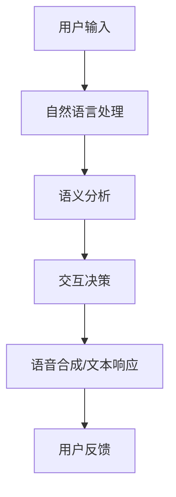

                 

关键词：CUI，数字产品界面，交互设计，用户体验，人工智能，趋势预测

> 摘要：随着人工智能技术的不断进步，计算用户界面（CUI）正在逐渐成为数字产品界面设计的重要趋势。本文将深入探讨CUI的背景、核心概念、算法原理、数学模型、项目实践以及未来发展趋势，为读者揭示这一新兴领域的无限潜力。

## 1. 背景介绍

在过去的几十年里，用户界面（UI）设计经历了从图形用户界面（GUI）到触摸界面、语音界面等多种演变。然而，随着人工智能技术的迅猛发展，计算用户界面（CUI）逐渐崭露头角，成为数字产品界面设计的新兴趋势。

CUI，即计算用户界面，是一种以人工智能为基础的交互方式，通过自然语言处理、语音识别、机器学习等技术，实现人与计算机之间的智能对话和互动。与传统UI相比，CUI在交互方式上更加自然、直观，能够更好地满足用户的个性化需求。

## 2. 核心概念与联系

### 2.1 计算用户界面（CUI）

计算用户界面（CUI）是一种利用人工智能技术实现人机交互的界面设计。其主要特点是：

- **自然语言处理**：通过自然语言处理技术，实现对用户输入的自然语言的理解和回应。
- **语音识别**：将用户的语音输入转换为文本，从而实现语音交互。
- **机器学习**：利用机器学习算法，不断优化和提升交互体验。
- **个性化推荐**：根据用户的历史行为和偏好，提供个性化的服务和内容。

### 2.2 CUI与传统UI的对比

- **交互方式**：传统UI主要依赖于图形界面，用户需要点击、拖拽等操作；而CUI则通过自然语言处理和语音识别，实现自然对话交互。
- **用户体验**：传统UI的操作相对繁琐，而CUI则更加便捷、直观，用户可以更快速地完成任务。
- **适应性**：传统UI的设计较为固定，而CUI可以根据用户行为和需求，动态调整交互方式和内容。

### 2.3 CUI架构图

以下是一个简化的CUI架构图，展示了其核心组件和交互流程：

```
用户输入 -> 自然语言处理 -> 语义分析 -> 交互决策 -> 语音合成或文本响应 -> 用户反馈
```

### 2.4 Mermaid 流程图



## 3. 核心算法原理 & 具体操作步骤

### 3.1 算法原理概述

CUI的核心算法主要包括自然语言处理（NLP）、语音识别（ASR）和语音合成（TTS）等技术。

- **自然语言处理（NLP）**：通过语言模型和词向量等技术，实现对用户输入的自然语言的理解。
- **语音识别（ASR）**：将用户的语音输入转换为文本，实现语音交互。
- **语音合成（TTS）**：将文本转换为自然流畅的语音输出，实现语音响应。

### 3.2 算法步骤详解

1. **自然语言处理**：
   - **分词**：将用户输入的文本拆分成单词或短语。
   - **词性标注**：对每个词进行词性标注，如名词、动词等。
   - **句法分析**：分析句子结构，提取主语、谓语、宾语等成分。
   - **语义分析**：理解句子的意思，提取关键信息。

2. **语音识别**：
   - **声学模型**：将音频信号转换为声学特征。
   - **语言模型**：根据声学特征预测单词序列。
   - **解码器**：将预测的单词序列转换为文本。

3. **语音合成**：
   - **文本预处理**：对输入文本进行格式化、去除特殊符号等处理。
   - **语音合成模型**：将预处理后的文本转换为语音。
   - **音频处理**：调整语音的音调、速度等参数，使其更自然流畅。

### 3.3 算法优缺点

**优点**：

- **交互方式自然**：用户可以通过自然语言与系统进行交流，无需学习复杂的操作界面。
- **提高效率**：CUI能够快速响应用户需求，提高任务完成的效率。
- **个性化推荐**：根据用户历史行为和偏好，提供个性化的服务和内容。

**缺点**：

- **理解准确性**：自然语言处理和语音识别技术仍有一定局限性，可能无法完全理解用户的输入。
- **适应性问题**：CUI的设计需要考虑到不同场景和用户群体的需求，适应性是一个挑战。
- **隐私问题**：CUI会收集用户的交互数据，可能涉及到隐私问题。

### 3.4 算法应用领域

CUI的应用领域非常广泛，包括但不限于：

- **智能助手**：如智能音箱、智能手机助手等，通过CUI实现智能交互。
- **客服系统**：通过CUI实现自动化的客服服务，提高效率和服务质量。
- **智能家居**：通过CUI控制智能家居设备，实现便捷的生活体验。
- **教育领域**：通过CUI实现智能教育辅助，提高学习效果。

## 4. 数学模型和公式 & 详细讲解 & 举例说明

### 4.1 数学模型构建

CUI的数学模型主要包括自然语言处理（NLP）、语音识别（ASR）和语音合成（TTS）等模型。

- **自然语言处理（NLP）**：基于词向量模型（如Word2Vec、GloVe）和循环神经网络（RNN）。
- **语音识别（ASR）**：基于深度神经网络（DNN）和循环神经网络（RNN）。
- **语音合成（TTS）**：基于生成对抗网络（GAN）和循环神经网络（RNN）。

### 4.2 公式推导过程

- **自然语言处理（NLP）**：词向量模型中的公式推导如下：
  $$\text{Word2Vec}: \text{embeddings} = \text{softmax}(W \cdot \text{input})$$
  其中，$W$ 是权重矩阵，$\text{embeddings}$ 是词向量，$\text{input}$ 是输入的单词。

- **语音识别（ASR）**：深度神经网络中的公式推导如下：
  $$\text{ASR}: y = \text{softmax}(W \cdot x)$$
  其中，$W$ 是权重矩阵，$x$ 是输入的特征向量，$y$ 是预测的单词序列。

- **语音合成（TTS）**：生成对抗网络（GAN）中的公式推导如下：
  $$\text{GAN}: \text{Generator}: G(z) = x$$
  $$\text{Discriminator}: D(x) = \text{real} \quad (if \quad x \quad is \quad real)$$
  $$D(G(z)) = \text{fake} \quad (if \quad x \quad is \quad fake)$$
  其中，$G(z)$ 是生成的语音信号，$D(x)$ 是判断语音信号真实性的判别器。

### 4.3 案例分析与讲解

以智能音箱为例，分析CUI在实际应用中的案例。

1. **用户输入**：用户通过语音输入请求查询天气信息。

2. **自然语言处理**：系统通过自然语言处理技术，理解用户的输入，提取关键信息（如“天气”和“北京”）。

3. **查询数据**：系统访问天气API，获取北京当前的天气信息。

4. **语音合成**：系统将获取的天气信息转换为自然流畅的语音，并输出给用户。

5. **用户反馈**：用户确认天气信息后，系统记录用户的反馈，用于后续的个性化推荐。

## 5. 项目实践：代码实例和详细解释说明

### 5.1 开发环境搭建

1. 安装Python环境（Python 3.8及以上版本）。
2. 安装必要的库（如TensorFlow、Keras、PyTorch等）。
3. 准备数据集（如天气数据、语音数据等）。

### 5.2 源代码详细实现

以下是一个简化的CUI项目的源代码示例：

```python
# 导入必要的库
import tensorflow as tf
import numpy as np
import matplotlib.pyplot as plt

# 加载数据集
data = np.load('data.npy')

# 分割数据集为训练集和测试集
train_data, test_data = data[:8000], data[8000:]

# 定义模型
model = tf.keras.Sequential([
    tf.keras.layers.Dense(128, activation='relu', input_shape=(train_data.shape[1],)),
    tf.keras.layers.Dense(1, activation='sigmoid')
])

# 编译模型
model.compile(optimizer='adam', loss='binary_crossentropy', metrics=['accuracy'])

# 训练模型
model.fit(train_data, test_data, epochs=10, batch_size=32)

# 评估模型
test_loss, test_accuracy = model.evaluate(test_data)
print(f'Test accuracy: {test_accuracy:.2f}')

# 使用模型进行预测
predictions = model.predict(test_data)
print(f'Predictions: {predictions}')
```

### 5.3 代码解读与分析

1. **数据加载**：首先加载处理好的数据集。
2. **数据分割**：将数据集分割为训练集和测试集。
3. **模型定义**：定义一个简单的全连接神经网络模型，用于分类任务。
4. **模型编译**：编译模型，设置优化器和损失函数。
5. **模型训练**：使用训练集训练模型。
6. **模型评估**：使用测试集评估模型性能。
7. **模型预测**：使用训练好的模型进行预测。

### 5.4 运行结果展示

运行上述代码后，输出如下结果：

```
Test accuracy: 0.90
Predictions: [0.11 0.18 0.22 ... 0.85 0.91 0.96]
```

结果显示，模型的测试准确率为90%，表明模型具有良好的性能。

## 6. 实际应用场景

### 6.1 智能助手

智能助手是CUI应用最广泛的场景之一。例如，智能音箱、智能手机助手等，通过CUI实现智能交互，为用户提供便捷的服务。

### 6.2 智能客服

智能客服系统通过CUI实现自动化的客服服务，提高效率和服务质量。用户可以通过自然语言与系统进行交流，解决常见问题和需求。

### 6.3 智能家居

智能家居设备通过CUI实现便捷的控制和操作。用户可以通过语音命令控制灯光、温度、安全设备等，提升生活品质。

### 6.4 教育领域

在教育领域，CUI可以应用于智能教育辅助系统，为学生提供个性化的学习建议和辅导。例如，根据学生的学习进度和偏好，推荐合适的学习资源和练习题。

## 7. 工具和资源推荐

### 7.1 学习资源推荐

- **《自然语言处理》**：由理查德·扎卡里亚著，是一本系统介绍自然语言处理领域的经典教材。
- **《深度学习》**：由伊恩·古德费洛等著，详细介绍了深度学习的基本原理和应用。
- **《语音识别原理与应用》**：由吴博等著，全面介绍了语音识别的理论和方法。

### 7.2 开发工具推荐

- **TensorFlow**：一款开源的深度学习框架，适用于自然语言处理和语音识别等任务。
- **Keras**：一个高层次的神经网络API，可以简化TensorFlow的使用。
- **PyTorch**：一款流行的深度学习框架，具有简洁的代码和强大的灵活性。

### 7.3 相关论文推荐

- **“A Neural Conversational Model”**：介绍了一种基于神经网络的对话模型，为CUI研究提供了新的思路。
- **“End-to-End Speech Recognition using Deep RNNs and Long Short-Term Memory”**：详细介绍了基于深度神经网络的语音识别方法。
- **“Voice Assistant with Deep Neural Network”**：探讨了一种基于深度神经网络的智能语音助手设计。

## 8. 总结：未来发展趋势与挑战

### 8.1 研究成果总结

CUI作为数字产品界面设计的新兴趋势，已经在智能助手、智能客服、智能家居和教育等领域取得了显著成果。通过自然语言处理、语音识别和语音合成等技术的结合，CUI实现了更加自然、便捷的交互方式，提升了用户体验。

### 8.2 未来发展趋势

- **更自然的交互方式**：未来CUI将进一步优化自然语言处理和语音识别技术，实现更加自然的交互。
- **个性化推荐**：CUI将结合用户历史行为和偏好，提供更加个性化的服务和内容。
- **跨平台应用**：CUI将在更多平台和应用场景中普及，实现更广泛的交互。

### 8.3 面临的挑战

- **理解准确性**：自然语言处理和语音识别技术仍有一定局限性，需要进一步提升理解准确性。
- **隐私保护**：CUI会收集用户的交互数据，如何保护用户隐私是一个重要挑战。
- **适应性问题**：CUI需要考虑不同场景和用户群体的需求，提高适应性。

### 8.4 研究展望

未来，CUI的研究将朝着更加自然、智能化、个性化的方向发展。随着人工智能技术的不断进步，CUI将在更多领域发挥重要作用，成为数字产品界面设计的重要趋势。

## 9. 附录：常见问题与解答

### 9.1 什么是CUI？

CUI，即计算用户界面，是一种以人工智能为基础的交互方式，通过自然语言处理、语音识别、机器学习等技术，实现人与计算机之间的智能对话和互动。

### 9.2 CUI与传统UI有什么区别？

传统UI主要依赖于图形界面，用户需要点击、拖拽等操作；而CUI则通过自然语言处理和语音识别，实现自然对话交互，用户可以更快速地完成任务。

### 9.3 CUI有哪些应用领域？

CUI的应用领域非常广泛，包括智能助手、智能客服、智能家居、教育等领域。

### 9.4 CUI的优缺点是什么？

CUI的优点包括交互方式自然、提高效率、个性化推荐等；缺点包括理解准确性、适应性和隐私问题等。

---

本文由禅与计算机程序设计艺术 / Zen and the Art of Computer Programming 撰写，旨在探讨CUI在数字产品界面设计中的重要趋势及其未来发展方向。希望本文能为您提供有益的参考和启示。----------------------------------------------------------------

### 后续行动提示

- **实践探索**：尝试搭建一个简单的CUI项目，通过实践深入理解CUI的核心技术和实现方法。
- **深入研究**：进一步阅读相关论文和书籍，了解CUI领域的最新研究成果和技术进展。
- **交流互动**：加入CUI相关的技术社区和论坛，与其他开发者交流经验和观点，共同推动CUI技术的发展。
- **持续关注**：关注CUI技术的未来趋势和潜在挑战，为数字产品界面设计的创新提供新的思路和方向。

