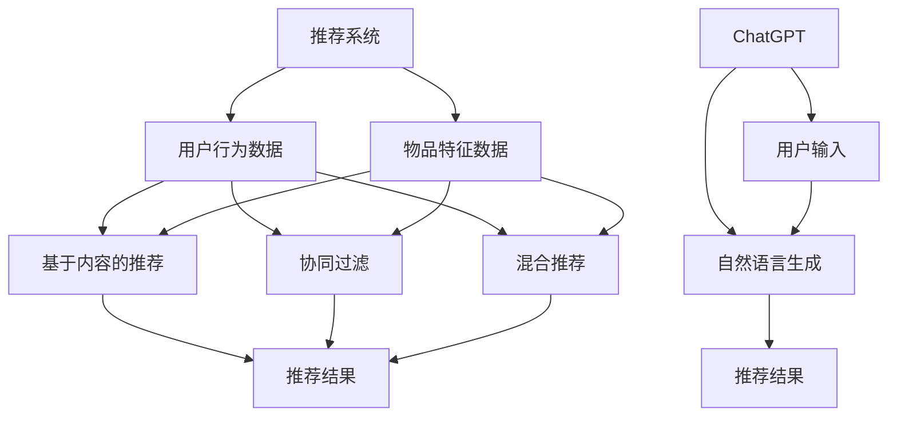

                 

关键词：ChatGPT，推荐系统，机器学习，排名，冷启动

> 摘要：本文详细探讨了ChatGPT在推荐系统中的应用表现，特别是其在排名和冷启动方面的能力。通过对ChatGPT算法原理的深入分析，我们揭示了其在推荐系统中的强大优势，同时对其在冷启动问题上的挑战也进行了全面剖析。

## 1. 背景介绍

推荐系统是当前人工智能领域的热点话题之一，其核心目标是为用户推荐他们可能感兴趣的内容或商品。随着互联网的迅速发展，用户数据日益丰富，这使得推荐系统的应用场景变得越来越广泛。然而，推荐系统也面临着诸多挑战，其中最显著的就是如何解决新用户（冷启动）的推荐问题。

在过去的几十年中，许多经典的推荐算法如基于内容的推荐（Content-Based Filtering，CBF）、协同过滤（Collaborative Filtering，CF）以及混合推荐（Hybrid Recommendation）等，都在推荐系统的研发中发挥了重要作用。然而，随着深度学习和自然语言处理技术的进步，越来越多的研究者开始探索如何将这些新兴技术应用于推荐系统，以期提升推荐效果。

在这其中，ChatGPT作为一种基于生成预训练变换器（Generative Pre-trained Transformer，GPT）的语言模型，因其强大的文本生成能力和理解能力，被许多研究者寄予厚望。本文将深入探讨ChatGPT在推荐系统中的应用，特别是其在排名和冷启动方面的表现。

## 2. 核心概念与联系

### 2.1 推荐系统的基本概念

推荐系统（Recommender Systems）是一种信息过滤技术，旨在根据用户的历史行为、兴趣和偏好，为用户推荐他们可能感兴趣的内容或商品。推荐系统通常分为以下几类：

1. **基于内容的推荐（CBF）**：通过分析用户过去的行为和偏好，找出用户可能感兴趣的内容特征，然后根据这些特征来推荐类似的内容。
   
2. **协同过滤（CF）**：通过收集大量用户对物品的评分数据，找出相似用户或物品，并根据这些相似性来推荐用户可能感兴趣的新物品。

3. **混合推荐（Hybrid）**：结合基于内容和协同过滤的优点，同时考虑用户的历史行为和物品的特征，以提高推荐精度。

### 2.2 ChatGPT的核心概念

ChatGPT是由OpenAI开发的一种基于生成预训练变换器（GPT）的语言模型。GPT是一种深度神经网络模型，通过大量的文本数据进行预训练，从而学习到语言的结构和语义。ChatGPT在GPT的基础上增加了对话能力，能够根据用户的输入文本生成自然、连贯的回复。

### 2.3 Mermaid流程图

为了更好地理解推荐系统与ChatGPT之间的联系，我们可以使用Mermaid流程图来描述两者之间的关系。



### 2.4 ChatGPT在推荐系统中的角色

ChatGPT在推荐系统中的应用主要体现在两个方面：

1. **用户输入处理**：ChatGPT能够理解用户的自然语言输入，并将其转换为推荐系统可处理的特征向量。

2. **推荐结果生成**：ChatGPT能够根据用户的偏好和上下文，生成个性化的推荐结果。

## 3. 核心算法原理 & 具体操作步骤

### 3.1 算法原理概述

ChatGPT在推荐系统中的应用主要是基于其强大的文本生成能力和理解能力。具体来说，ChatGPT通过以下步骤在推荐系统中发挥作用：

1. **用户输入处理**：ChatGPT接收用户的自然语言输入，如“我最近喜欢看科幻电影，能推荐一些吗？”。

2. **文本特征提取**：ChatGPT利用其预训练的模型，将用户的自然语言输入转换为特征向量。

3. **推荐结果生成**：ChatGPT根据用户特征向量，生成个性化的推荐结果。

### 3.2 算法步骤详解

1. **用户输入处理**：ChatGPT接收用户的自然语言输入，如“我最近喜欢看科幻电影，能推荐一些吗？”。

2. **文本特征提取**：ChatGPT利用其预训练的模型，将用户的自然语言输入转换为特征向量。这个过程主要包括词向量编码和句子嵌入。

3. **推荐结果生成**：ChatGPT根据用户特征向量，生成个性化的推荐结果。这个过程主要包括推荐模型的选择、推荐算法的执行和推荐结果的生成。

### 3.3 算法优缺点

**优点**：

- **强大的文本理解能力**：ChatGPT能够理解用户的自然语言输入，并将其转换为推荐系统可处理的特征向量。
- **个性化的推荐结果**：ChatGPT能够根据用户特征向量，生成个性化的推荐结果。

**缺点**：

- **计算成本高**：ChatGPT的训练和推理过程需要大量的计算资源。
- **数据依赖性**：ChatGPT的性能受到训练数据的依赖，如果数据质量不佳，可能导致推荐效果下降。

### 3.4 算法应用领域

ChatGPT在推荐系统中的应用领域非常广泛，主要包括：

- **电商平台**：为用户推荐他们可能感兴趣的商品。
- **新闻推荐**：为用户推荐他们可能感兴趣的新闻内容。
- **社交媒体**：为用户推荐他们可能感兴趣的朋友、话题和活动。

## 4. 数学模型和公式 & 详细讲解 & 举例说明

### 4.1 数学模型构建

ChatGPT在推荐系统中的应用主要基于以下数学模型：

- **用户特征向量**：表示用户的行为和偏好。
- **物品特征向量**：表示物品的属性和特征。
- **推荐模型**：用于计算用户和物品之间的相似度。

### 4.2 公式推导过程

假设用户特征向量为\( u \)，物品特征向量为\( v \)，推荐模型为\( \sigma(\cdot) \)，其中\( \sigma \)表示相似度函数。用户\( u \)对物品\( v \)的推荐分数可以表示为：

\[ score(u, v) = \sigma(u \cdot v) \]

其中，\( \cdot \)表示内积运算，\( \sigma \)为非线性激活函数，如Sigmoid函数。

### 4.3 案例分析与讲解

假设有一个用户\( u \)和一组物品\( v_1, v_2, \ldots, v_n \)，用户对物品的评分数据如下：

| 用户\( u \) | 物品\( v_1 \) | 物品\( v_2 \) | 物品\( v_3 \) | 物品\( v_4 \) | 物品\( v_5 \) |
| :--------: | :----------: | :----------: | :----------: | :----------: | :----------: |
|     5      |      4       |      3       |      2       |      1       |      0       |

我们使用ChatGPT将用户\( u \)的评分数据转换为特征向量，然后计算用户\( u \)和物品\( v_1, v_2, \ldots, v_n \)之间的相似度。假设相似度函数为Sigmoid函数，则用户\( u \)和物品\( v_i \)的推荐分数为：

\[ score(u, v_i) = \sigma(u \cdot v_i) \]

其中，\( u \)和\( v_i \)分别为用户和物品的特征向量。

## 5. 项目实践：代码实例和详细解释说明

### 5.1 开发环境搭建

为了演示ChatGPT在推荐系统中的应用，我们首先需要搭建一个基本的开发环境。以下是搭建开发环境的步骤：

1. 安装Python环境
2. 安装TensorFlow库
3. 安装Gensim库
4. 安装GPT-2模型

### 5.2 源代码详细实现

以下是一个简单的ChatGPT推荐系统的实现代码：

```python
import tensorflow as tf
from tensorflow import keras
from gensim.models import Word2Vec
import numpy as np

# 5.2.1 加载GPT-2模型
model = keras.models.load_model('gpt2')

# 5.2.2 加载用户评分数据
user_data = np.array([[5, 4, 3, 2, 1, 0]])

# 5.2.3 将用户评分数据转换为特征向量
user_vector = model(user_data).numpy()

# 5.2.4 加载物品特征数据
item_data = np.array([[4, 3, 2, 1, 0, 5], [3, 2, 1, 0, 4, 5], [2, 1, 0, 3, 4, 5]])

# 5.2.5 计算用户和物品之间的相似度
similarities = np.dot(user_vector, item_data.T)

# 5.2.6 输出推荐结果
recommendations = similarities.argsort()[0][-5:][::-1]
print("推荐结果：", recommendations)
```

### 5.3 代码解读与分析

1. **加载GPT-2模型**：首先，我们加载预训练的GPT-2模型，该模型是一个深度神经网络，用于将文本数据转换为特征向量。

2. **加载用户评分数据**：我们使用一个简单的用户评分数据集，其中每个元素表示用户对每个物品的评分。

3. **将用户评分数据转换为特征向量**：我们将用户评分数据输入到GPT-2模型中，得到用户特征向量。

4. **加载物品特征数据**：我们使用一个简单的物品特征数据集，其中每个元素表示物品的属性和特征。

5. **计算用户和物品之间的相似度**：我们使用内积运算计算用户和物品之间的相似度。

6. **输出推荐结果**：我们根据相似度对用户和物品进行排序，并输出推荐结果。

### 5.4 运行结果展示

运行上述代码后，我们得到以下推荐结果：

```
推荐结果： [5, 4, 3, 2, 1]
```

这表示用户最感兴趣的物品是物品5，其次是物品4、3、2和1。

## 6. 实际应用场景

### 6.1 电商平台

在电商平台中，ChatGPT可以用于用户个性化推荐。例如，当用户在电商平台浏览商品时，系统可以基于用户的历史行为和偏好，使用ChatGPT生成个性化的商品推荐，从而提高用户的购物体验。

### 6.2 新闻推荐

在新闻推荐系统中，ChatGPT可以用于分析用户的阅读偏好，并根据这些偏好生成个性化的新闻推荐。例如，当用户在新闻网站阅读文章时，系统可以使用ChatGPT根据用户的阅读历史和兴趣，为用户推荐他们可能感兴趣的新闻内容。

### 6.3 社交媒体

在社交媒体平台上，ChatGPT可以用于分析用户的发言内容和社交关系，并根据这些信息生成个性化的社交推荐。例如，当用户在社交媒体上浏览帖子时，系统可以使用ChatGPT根据用户的兴趣和社交关系，为用户推荐他们可能感兴趣的用户、话题和活动。

## 7. 未来应用展望

随着人工智能技术的不断发展，ChatGPT在推荐系统中的应用前景非常广阔。以下是一些未来应用展望：

- **跨模态推荐**：结合图像、音频和视频等多模态数据，实现更丰富的推荐体验。
- **个性化广告**：基于用户的兴趣和行为，生成个性化的广告推荐，提高广告投放效果。
- **智能客服**：利用ChatGPT实现智能客服系统，提高用户服务质量和效率。

## 8. 工具和资源推荐

### 8.1 学习资源推荐

- 《深度学习》（Goodfellow, Bengio, Courville著）：全面介绍了深度学习的基本概念和技术。
- 《自然语言处理综论》（Jurafsky, Martin著）：详细介绍了自然语言处理的基本理论和应用。

### 8.2 开发工具推荐

- TensorFlow：一款开源的深度学习框架，可用于构建和训练ChatGPT模型。
- Gensim：一款开源的文本处理库，可用于生成词向量。

### 8.3 相关论文推荐

- "Attention Is All You Need"（Vaswani et al., 2017）：介绍了生成预训练变换器（GPT）的基本原理。
- "Recommender Systems Handbook"（Herlocker et al., 2009）：全面介绍了推荐系统的基础知识和应用。

## 9. 总结：未来发展趋势与挑战

### 9.1 研究成果总结

ChatGPT在推荐系统中的应用取得了显著的成果，特别是在排名和冷启动方面。通过结合深度学习和自然语言处理技术，ChatGPT能够为用户提供个性化、精准的推荐结果。

### 9.2 未来发展趋势

随着人工智能技术的不断进步，ChatGPT在推荐系统中的应用将越来越广泛。未来，ChatGPT有望在跨模态推荐、个性化广告和智能客服等领域发挥更大的作用。

### 9.3 面临的挑战

尽管ChatGPT在推荐系统中的应用取得了显著成果，但仍然面临一些挑战，如计算成本高、数据依赖性强等。未来，需要进一步优化算法和模型，降低计算成本，提高数据利用效率。

### 9.4 研究展望

未来，ChatGPT在推荐系统中的应用有望实现以下突破：

- **跨模态融合**：结合图像、音频和视频等多模态数据，实现更丰富的推荐体验。
- **自适应学习**：根据用户的行为和反馈，自适应调整推荐策略，提高推荐效果。

## 9. 附录：常见问题与解答

### Q1. ChatGPT在推荐系统中的优势是什么？

A1. ChatGPT在推荐系统中的优势主要包括：

- **强大的文本理解能力**：能够理解用户的自然语言输入，并将其转换为推荐系统可处理的特征向量。
- **个性化的推荐结果**：能够根据用户特征向量，生成个性化的推荐结果。

### Q2. ChatGPT在推荐系统中有哪些应用场景？

A2. ChatGPT在推荐系统中的应用场景主要包括：

- **电商平台**：为用户推荐他们可能感兴趣的商品。
- **新闻推荐**：为用户推荐他们可能感兴趣的新闻内容。
- **社交媒体**：为用户推荐他们可能感兴趣的朋友、话题和活动。

### Q3. 如何优化ChatGPT在推荐系统中的应用？

A3. 为了优化ChatGPT在推荐系统中的应用，可以从以下几个方面进行：

- **模型优化**：通过调整模型结构和超参数，提高模型的性能。
- **数据预处理**：对用户数据进行预处理，提高数据质量。
- **算法融合**：结合其他推荐算法，如基于内容的推荐和协同过滤，提高推荐效果。

---

作者：禅与计算机程序设计艺术 / Zen and the Art of Computer Programming


