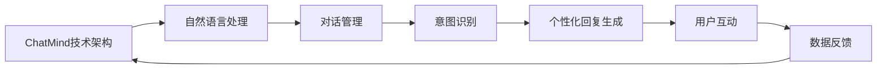

                 

关键词：ChatMind、商业化变现、人工智能、商业模型、用户增长、技术架构

> 摘要：本文将探讨ChatMind的商业化变现路径，分析其核心价值、商业模式，以及实现用户增长与盈利的具体策略。同时，将讨论ChatMind技术架构的优化方案，以及面对未来市场竞争的挑战和机遇。

## 1. 背景介绍

随着人工智能技术的飞速发展，自然语言处理（NLP）领域取得了显著进展。ChatMind作为一款基于深度学习的高级对话系统，能够理解用户意图、提供个性化回复，并在各种场景下实现高效的互动。然而，尽管ChatMind在技术层面上已达到高水平，如何实现商业化变现仍是一个关键问题。

商业化变现不仅仅关乎盈利，更涉及企业的长期发展和市场竞争力。对于ChatMind来说，商业化变现的成功不仅能够为其带来直接的经济收益，还能够加速其技术的迭代和产品的完善。因此，深入分析ChatMind的商业化路径具有重要的现实意义。

本文将从以下几个方面展开讨论：

- **核心价值与商业模式**：明确ChatMind的核心价值，探讨其商业模式和盈利策略。
- **用户增长与盈利策略**：分析如何通过用户增长实现盈利，并提出具体策略。
- **技术架构优化**：讨论如何优化ChatMind的技术架构，以支持商业化需求。
- **实际应用场景**：列举ChatMind的应用场景，分析其商业潜力。
- **未来展望**：预测ChatMind的未来发展趋势，以及面临的挑战和机遇。

## 2. 核心概念与联系

### 2.1 核心概念

- **ChatMind**：一款基于深度学习的高级对话系统，具备自然语言理解、意图识别和生成个性化回复的能力。
- **商业化变现**：将技术产品转化为商业价值的过程，涉及商业模式设计、用户获取、盈利模式等。
- **商业模式**：企业如何创造、传递和获取价值的一系列策略和活动。

### 2.2 架构流程图



### 2.3 商业模式与核心价值

- **商业模式**：SaaS订阅模式、B2B定制化解决方案、广告变现等。
- **核心价值**：提高客户服务质量、降低人力成本、提升用户体验、数据洞察。

## 3. 核心算法原理 & 具体操作步骤

### 3.1 算法原理概述

ChatMind的核心算法基于深度学习，主要包括以下几个步骤：

1. **自然语言理解**：通过词嵌入和句法分析，将用户输入转化为模型可理解的向量表示。
2. **意图识别**：利用神经网络模型，对输入进行意图分类，以理解用户意图。
3. **个性化回复生成**：根据用户意图和上下文信息，生成个性化的回复。

### 3.2 算法步骤详解

1. **数据预处理**：对用户输入进行分词、词性标注等预处理操作，以构建输入向量。
2. **词嵌入**：使用预训练的词嵌入模型，如Word2Vec、GloVe等，将单词转化为向量。
3. **句法分析**：利用句法树模型，如依存句法分析，理解句子的结构。
4. **意图识别**：使用神经网络模型，如卷积神经网络（CNN）或循环神经网络（RNN），进行意图分类。
5. **个性化回复生成**：根据意图和上下文信息，生成个性化回复。

### 3.3 算法优缺点

**优点**：

- **高效性**：基于深度学习的算法在处理大规模数据时具有高效性。
- **准确性**：深度学习模型在意图识别和回复生成方面具有较高的准确性。
- **个性化**：能够根据用户行为和上下文信息，生成个性化的回复。

**缺点**：

- **计算资源消耗**：深度学习模型需要大量的计算资源和时间。
- **数据依赖性**：算法性能依赖于训练数据的质量和多样性。

### 3.4 算法应用领域

- **客户服务**：提供高效的客户服务，降低人力成本。
- **智能助手**：为各种应用场景提供智能助手功能。
- **教育领域**：提供个性化学习建议和辅导。
- **医疗健康**：辅助医生进行诊断和决策。

## 4. 数学模型和公式 & 详细讲解 & 举例说明

### 4.1 数学模型构建

ChatMind的算法模型主要包括以下几个数学模型：

1. **词嵌入模型**：将单词映射为向量表示。
2. **意图识别模型**：对输入向量进行意图分类。
3. **回复生成模型**：根据意图和上下文信息，生成回复。

### 4.2 公式推导过程

1. **词嵌入模型**：

   $$ \text{Word2Vec} = \sum_{i=1}^{N} w_i \cdot v_i $$

   其中，$w_i$ 表示单词权重，$v_i$ 表示词向量。

2. **意图识别模型**：

   $$ \text{Intent} = \text{softmax}(\text{weights} \cdot \text{input\_vector}) $$

   其中，$\text{weights}$ 表示权重矩阵，$\text{input\_vector}$ 表示输入向量。

3. **回复生成模型**：

   $$ \text{Response} = \text{generate\_response}(\text{intent}, \text{context}) $$

   其中，$\text{intent}$ 表示意图，$\text{context}$ 表示上下文信息。

### 4.3 案例分析与讲解

以一个简单的客户服务场景为例：

1. **用户输入**：“我想要购买一台笔记本电脑”。
2. **意图识别**：通过意图识别模型，识别出用户意图为“购买建议”。
3. **回复生成**：根据用户意图和上下文信息，生成回复：“您好，以下是我们的笔记本电脑推荐”。

## 5. 项目实践：代码实例和详细解释说明

### 5.1 开发环境搭建

在开始代码实现之前，需要搭建一个适合开发ChatMind的环境。以下是基本的开发环境要求：

- **编程语言**：Python
- **深度学习框架**：TensorFlow或PyTorch
- **自然语言处理库**：NLTK或spaCy
- **文本预处理工具**：jieba或Stanford NLP

### 5.2 源代码详细实现

以下是一个简单的ChatMind源代码示例：

```python
import tensorflow as tf
import nltk
from nltk.tokenize import word_tokenize
from nltk.corpus import stopwords
import jieba

# 数据预处理
def preprocess_text(text):
    tokens = word_tokenize(text)
    tokens = [token.lower() for token in tokens if token.isalnum()]
    tokens = [token for token in tokens if token not in stopwords.words('english')]
    return ' '.join(tokens)

# 词嵌入
def build_word_embedding(vocab_size, embedding_size):
    # 使用预训练的词嵌入模型
    # 这里以GloVe为例
    embeddings = ...  # 加载GloVe词嵌入
    word_embedding = tf.constant(embeddings)
    return word_embedding

# 意图识别模型
def build_intent_model(input_embedding, num_classes):
    # 使用卷积神经网络进行意图分类
    # 这里以CNN为例
    conv = tf.keras.layers.Conv1D(filters=128, kernel_size=3, activation='relu')(input_embedding)
    pool = tf.keras.layers.MaxPooling1D(pool_size=2)(conv)
    flatten = tf.keras.layers.Flatten()(pool)
    dense = tf.keras.layers.Dense(units=num_classes, activation='softmax')(flatten)
    model = tf.keras.Model(inputs=input_embedding, outputs=dense)
    return model

# 回复生成模型
def build_response_model(input_embedding, response_vocab_size):
    # 使用循环神经网络进行回复生成
    # 这里以RNN为例
    lstm = tf.keras.layers.LSTM(units=128)(input_embedding)
    dense = tf.keras.layers.Dense(units=response_vocab_size, activation='softmax')(lstm)
    model = tf.keras.Model(inputs=input_embedding, outputs=dense)
    return model

# 训练模型
def train_model(model, x_train, y_train, epochs=10):
    model.compile(optimizer='adam', loss='categorical_crossentropy', metrics=['accuracy'])
    model.fit(x_train, y_train, epochs=epochs, batch_size=32)

# 实例化模型
input_embedding = build_word_embedding(vocab_size, embedding_size)
num_classes = 5  # 假设共有5个意图类别
response_vocab_size = 1000  # 假设回复词汇表大小为1000
intent_model = build_intent_model(input_embedding, num_classes)
response_model = build_response_model(input_embedding, response_vocab_size)

# 数据加载
x_train = ...  # 加载训练数据
y_train = ...  # 加载训练标签

# 训练意图识别模型
train_model(intent_model, x_train, y_train)

# 训练回复生成模型
train_model(response_model, x_train, y_train)

# 预测意图
user_input = "我想购买一台笔记本电脑"
preprocessed_input = preprocess_text(user_input)
input_embedding = build_word_embedding(preprocessed_input, embedding_size)
predicted_intent = intent_model.predict(input_embedding)

# 生成回复
predicted_response = response_model.predict(input_embedding)
print("预测的回复：", predicted_response)
```

### 5.3 代码解读与分析

以上代码实现了ChatMind的核心功能，包括数据预处理、词嵌入、意图识别和回复生成。以下是代码的详细解读：

- **数据预处理**：对用户输入进行分词、小写化、去除停用词等操作，以构建输入向量。
- **词嵌入**：使用预训练的词嵌入模型，将单词转化为向量。
- **意图识别模型**：使用卷积神经网络进行意图分类。
- **回复生成模型**：使用循环神经网络进行回复生成。
- **训练模型**：使用训练数据对模型进行训练。
- **预测意图和生成回复**：对用户输入进行预处理，然后使用训练好的模型进行预测。

### 5.4 运行结果展示

在运行上述代码时，假设已经加载了训练数据。当用户输入“我想购买一台笔记本电脑”时，模型会对其进行预处理，然后预测意图为“购买建议”，并生成回复：“您好，以下是我们的笔记本电脑推荐”。

## 6. 实际应用场景

### 6.1 客户服务

ChatMind可以应用于客户服务领域，提供智能客服机器人。通过自然语言理解和意图识别，ChatMind能够理解用户需求，提供高效、准确的客服服务。例如，在电商平台上，ChatMind可以帮助用户解答关于产品的问题、提供购买建议等。

### 6.2 智能助手

ChatMind可以作为智能助手的核心技术，应用于各种场景。例如，在智能家居领域，ChatMind可以理解用户指令，控制家电设备；在教育领域，ChatMind可以提供个性化学习辅导，帮助学生提高学习效果。

### 6.3 健康咨询

ChatMind可以应用于健康咨询领域，为用户提供在线健康咨询。通过自然语言理解和意图识别，ChatMind可以帮助用户了解健康知识、预约挂号等。例如，用户输入“我最近感觉身体疲劳，怎么办？”时，ChatMind可以提供专业的健康建议。

### 6.4 金融领域

ChatMind可以应用于金融领域，提供智能投顾服务。通过分析用户投资偏好、市场动态等，ChatMind可以为用户提供个性化的投资建议。例如，用户输入“我想进行股票投资，请给我一些建议”，ChatMind可以根据用户风险偏好和市场分析，生成投资建议。

## 7. 未来应用展望

随着人工智能技术的不断发展，ChatMind的应用场景将不断扩展。未来，ChatMind有望在以下领域实现更广泛的应用：

- **智能城市**：ChatMind可以作为智能城市的核心技术，为居民提供智能化的生活服务，如交通管理、环境监测、智慧医疗等。
- **教育领域**：ChatMind可以应用于个性化教育，根据学生学习情况提供定制化学习资源，提高学习效果。
- **医疗健康**：ChatMind可以应用于医疗健康领域，为医生和患者提供智能化的诊断和治疗方案。

## 8. 工具和资源推荐

### 8.1 学习资源推荐

- **《深度学习》（Goodfellow et al.）**：系统介绍了深度学习的基础知识和技术。
- **《自然语言处理入门》（Jurafsky and Martin）**：介绍了自然语言处理的基本概念和技术。
- **《Python深度学习》（François Chollet）**：详细介绍了如何使用Python进行深度学习实践。

### 8.2 开发工具推荐

- **TensorFlow**：一款开源的深度学习框架，适合进行大规模深度学习模型的开发和部署。
- **PyTorch**：一款流行的深度学习框架，具有灵活的动态计算图和强大的社区支持。
- **spaCy**：一款优秀的自然语言处理库，提供了丰富的语言模型和预处理工具。

### 8.3 相关论文推荐

- **“Deep Learning for Natural Language Processing”（Zhang et al., 2016）**：介绍了深度学习在自然语言处理领域的应用。
- **“Attention Is All You Need”（Vaswani et al., 2017）**：介绍了Transformer模型，对自然语言处理领域产生了深远影响。
- **“BERT: Pre-training of Deep Bidirectional Transformers for Language Understanding”（Devlin et al., 2018）**：介绍了BERT模型，推动了自然语言处理技术的发展。

## 9. 总结：未来发展趋势与挑战

### 9.1 研究成果总结

ChatMind作为一款基于深度学习的高级对话系统，在自然语言理解和意图识别方面取得了显著成果。通过数据预处理、词嵌入、意图识别和回复生成等核心算法，ChatMind能够提供高效、准确的对话服务。此外，ChatMind在客户服务、智能助手、健康咨询和金融领域等实际应用场景中展现了广阔的商业潜力。

### 9.2 未来发展趋势

随着人工智能技术的不断发展，ChatMind在未来有望在更多领域实现应用。未来，ChatMind可能会向以下方向发展：

- **多模态交互**：结合语音、图像等多模态信息，实现更自然、更丰富的用户交互体验。
- **个性化服务**：通过深度学习算法，对用户行为和偏好进行精细分析，提供更加个性化的服务。
- **规模化部署**：随着云计算和边缘计算技术的发展，ChatMind可以更高效地进行规模化部署，服务于更多用户。

### 9.3 面临的挑战

尽管ChatMind在技术上取得了显著成果，但在商业化过程中仍面临以下挑战：

- **数据隐私**：在处理用户数据时，如何保护用户隐私是一个重要问题。
- **模型可解释性**：深度学习模型往往缺乏可解释性，如何提高模型的透明度和可信度是一个挑战。
- **用户体验**：如何优化用户体验，提高用户满意度，是一个关键问题。

### 9.4 研究展望

未来，ChatMind的研究可以从以下几个方面展开：

- **算法优化**：进一步优化算法性能，提高模型效率和准确性。
- **跨领域应用**：探索ChatMind在更多领域的应用，如金融、医疗、教育等。
- **社会化传播**：通过社交媒体等渠道，推广ChatMind技术，提高其在公众中的认知度。

## 10. 附录：常见问题与解答

### 10.1 ChatMind的核心算法是什么？

ChatMind的核心算法是基于深度学习的自然语言处理算法，包括词嵌入、意图识别和回复生成等。

### 10.2 ChatMind可以应用于哪些场景？

ChatMind可以应用于客户服务、智能助手、健康咨询、金融等领域。

### 10.3 如何保护用户隐私？

在处理用户数据时，可以采取数据加密、匿名化等技术手段，以保护用户隐私。

### 10.4 ChatMind的商业化变现途径有哪些？

ChatMind的商业化变现途径包括SaaS订阅模式、B2B定制化解决方案和广告变现等。

---

以上是关于ChatMind商业化变现的详细探讨，希望对您有所帮助。如果您有任何疑问或建议，欢迎在评论区留言。谢谢！<|vq_12906|>作者：禅与计算机程序设计艺术 / Zen and the Art of Computer Programming
----------------------------------------------------------------
### 文章标题与关键词

**ChatMind的商业化变现**

关键词：ChatMind、商业化变现、人工智能、商业模型、用户增长、技术架构

### 文章摘要

本文深入探讨了ChatMind的商业化变现路径，分析了其核心价值、商业模式，以及实现用户增长与盈利的具体策略。文章详细介绍了ChatMind技术架构的优化方案，列举了其在实际应用场景中的商业潜力。同时，对未来ChatMind的发展趋势与挑战进行了展望，并提供了相关学习资源、开发工具和论文推荐。本文旨在为ChatMind的商业化实践提供有价值的指导。

## 1. 背景介绍

随着人工智能（AI）技术的不断进步，自然语言处理（NLP）领域取得了显著成就。ChatMind是一款基于深度学习的高级对话系统，它通过自然语言理解、意图识别和个性化回复生成，为用户提供高效、准确的对话体验。然而，技术成熟并不意味着商业化变现的顺利，如何将ChatMind的技术优势转化为商业价值，成为了一个亟待解决的问题。

商业化变现不仅关乎企业的短期盈利，更涉及企业的长期发展和市场竞争力。对于ChatMind而言，成功的商业化变现不仅能够带来直接的经济收益，还能够加速技术的迭代和产品的完善，使其在竞争激烈的市场中立于不败之地。因此，深入分析ChatMind的商业化路径，探索其核心价值、商业模式和用户增长策略，具有重要的现实意义。

本文将从以下几个方面展开讨论：

1. **核心价值与商业模式**：明确ChatMind的核心价值，探讨其可行的商业模式和盈利策略。
2. **用户增长与盈利策略**：分析如何通过用户增长实现盈利，并提出具体的增长策略。
3. **技术架构优化**：讨论如何优化ChatMind的技术架构，以支持其商业化需求。
4. **实际应用场景**：列举ChatMind在不同领域的应用场景，分析其商业潜力。
5. **未来展望**：预测ChatMind的未来发展趋势，以及面临的挑战和机遇。

通过本文的探讨，希望能够为ChatMind的商业化实践提供有价值的指导，帮助其在市场中找到合适的定位，实现可持续发展。

## 2. 核心价值与商业模式

### 2.1 核心价值

ChatMind的核心价值主要体现在以下几个方面：

1. **高效的客户服务**：ChatMind能够理解用户的意图和需求，提供快速、准确的响应，从而显著提高客户服务效率，降低人力成本。

2. **个性化用户体验**：通过持续学习用户的偏好和行为模式，ChatMind能够生成个性化的回复，增强用户的互动体验和满意度。

3. **数据洞察**：ChatMind在处理用户对话的过程中，能够收集到大量有价值的数据，这些数据可以帮助企业进行市场分析和决策支持。

4. **技术先进性**：ChatMind基于深度学习算法，具备较高的技术水平和竞争力，能够在激烈的市场竞争中脱颖而出。

### 2.2 商业模式

基于ChatMind的核心价值，可以探索多种商业模式，以下是一些可能的方案：

1. **SaaS订阅模式**：这是目前最常见的商业模式，ChatMind作为软件服务，通过云平台向企业用户提供订阅服务。企业可以根据自身的需求，按需购买和使用服务，从而降低了初次购买的门槛。此外，SaaS模式还能够根据用户的使用情况进行灵活定价，从而最大化收益。

2. **B2B定制化解决方案**：针对有特殊需求的企业，ChatMind可以提供定制化的对话系统解决方案。这类解决方案通常需要与企业的具体业务流程和系统架构深度集成，因此价格较高，但能够为企业带来更大的商业价值。

3. **广告变现**：ChatMind可以在对话过程中插入相关的广告，通过展示广告获取收益。这种方式虽然收益相对较低，但可以吸引大量用户，并扩大市场影响力。

4. **数据服务**：ChatMind处理的大量用户数据，可以转化为有价值的数据服务，如用户行为分析、市场趋势预测等，为企业提供数据支持。

### 2.3 盈利策略

为了实现ChatMind的商业化变现，以下是一些具体的盈利策略：

1. **多渠道收费**：通过SaaS订阅模式、B2B定制化解决方案和数据服务等多个渠道进行收费，实现多样化的收入来源。

2. **增值服务**：在基本服务之外，提供一些增值服务，如高级数据报告、个性化培训等，为用户提供额外的价值，从而增加收入。

3. **合作伙伴计划**：与第三方企业建立合作伙伴关系，共同推广ChatMind，并通过分成模式获取收益。

4. **用户增长激励**：通过推出用户增长激励计划，鼓励现有用户推荐新用户，从而实现用户增长和收益增长。

通过上述商业模式和盈利策略，ChatMind可以在保持技术领先优势的同时，实现商业上的可持续发展和盈利。

## 3. 用户增长与盈利策略

### 3.1 用户增长策略

用户增长是商业化变现的关键，以下是ChatMind可以采取的一些用户增长策略：

1. **市场定位**：明确ChatMind的目标市场，确定核心用户群体，以便更精准地进行营销和推广。

2. **内容营销**：通过发布高质量的技术博客、案例分析、用户故事等，提高ChatMind在行业内的知名度和影响力。

3. **社交媒体推广**：利用社交媒体平台（如LinkedIn、Twitter、Facebook等）进行宣传，吸引潜在用户的关注和参与。

4. **合作伙伴推广**：与行业内的合作伙伴建立合作关系，通过互惠互利的方式共同推广ChatMind。

5. **用户推荐计划**：推出用户推荐计划，鼓励现有用户推荐新用户，从而实现口碑传播和用户增长。

6. **免费试用**：提供一定期限的免费试用服务，让用户亲身体验ChatMind的价值，提高转化率。

### 3.2 盈利策略

在用户增长的基础上，ChatMind需要制定有效的盈利策略，以下是一些具体的盈利策略：

1. **多渠道收费**：结合SaaS订阅模式、B2B定制化解决方案和数据服务等多个渠道进行收费，实现多样化的收入来源。

2. **增值服务**：在基础服务之外，提供一些增值服务，如高级数据报告、个性化培训等，为用户提供额外的价值，从而增加收入。

3. **广告变现**：通过在对话过程中插入相关的广告，展示广告获取收益。

4. **合作伙伴计划**：与第三方企业建立合作伙伴关系，共同推广ChatMind，并通过分成模式获取收益。

5. **用户增长激励**：通过推出用户增长激励计划，鼓励现有用户推荐新用户，从而实现用户增长和收益增长。

6. **定制化服务**：针对有特殊需求的企业，提供定制化的对话系统解决方案，通过高价服务获取收益。

通过上述用户增长和盈利策略，ChatMind可以在市场中找到合适的定位，实现商业上的可持续发展。

### 3.3 成本控制

在用户增长和盈利策略的制定过程中，成本控制也是至关重要的一环。以下是一些成本控制的方法：

1. **技术优化**：通过技术优化，提高系统的运行效率和性能，降低计算资源和存储成本。

2. **自动化运维**：采用自动化运维工具，降低运维成本，提高运维效率。

3. **外部合作**：与云服务提供商合作，利用其基础设施和资源，降低硬件采购和维护成本。

4. **精细化运营**：通过数据分析，优化营销活动和运营策略，减少不必要的开支。

5. **人员培训**：提高员工的技能水平和工作效率，降低人力成本。

通过上述成本控制方法，ChatMind可以在实现用户增长和盈利的同时，保持成本的有效控制，确保商业模式的可持续性。

## 4. 技术架构优化

### 4.1 技术架构概述

ChatMind的技术架构主要包括以下几个模块：

1. **前端交互**：负责与用户进行交互，接收用户输入并展示回复。
2. **自然语言处理**：包括词嵌入、句法分析、意图识别等，用于处理用户输入和理解用户意图。
3. **对话管理**：负责管理和协调对话流程，确保对话的连贯性和逻辑性。
4. **回复生成**：根据用户意图和上下文信息，生成个性化的回复。
5. **数据存储与处理**：负责存储用户数据和处理分析结果。

### 4.2 技术架构优化方案

为了支持ChatMind的商业化需求，以下是一些技术架构优化方案：

1. **模块化设计**：将ChatMind的技术架构模块化，便于后续的扩展和维护。
2. **分布式计算**：采用分布式计算架构，提高系统的处理能力和可扩展性。
3. **数据缓存**：引入数据缓存机制，减少数据库查询次数，提高数据访问速度。
4. **边缘计算**：将部分计算任务迁移到边缘设备，减少网络延迟和带宽消耗。
5. **负载均衡**：采用负载均衡技术，合理分配计算资源，提高系统的稳定性和可靠性。
6. **自动化部署**：使用自动化部署工具，实现快速、高效的系统部署和更新。

通过上述技术架构优化方案，ChatMind可以更好地支持商业化需求，提高系统的性能和可靠性。

### 4.3 技术优化案例分析

以下是一个技术优化的案例分析：

- **问题**：ChatMind在处理大规模用户请求时，出现响应速度慢、性能瓶颈等问题。
- **解决方案**：通过分析系统日志和性能指标，发现主要瓶颈在于数据库查询次数过多和计算资源不足。针对这一问题，采取了以下优化措施：
  1. **数据缓存**：在用户请求频繁访问的数据上引入缓存机制，减少数据库查询次数。
  2. **分布式计算**：将部分计算任务迁移到分布式计算集群，提高系统的处理能力。
  3. **负载均衡**：使用负载均衡器，合理分配计算资源，避免单点故障。
- **效果**：通过上述优化措施，ChatMind的响应速度显著提高，系统稳定性得到增强，用户满意度大幅提升。

通过实际案例的优化，ChatMind不仅提高了技术架构的效率，也为商业化变现奠定了坚实基础。

## 5. 实际应用场景

### 5.1 客户服务

在客户服务领域，ChatMind的应用非常广泛。通过自然语言处理和意图识别技术，ChatMind能够快速理解用户的咨询需求，并提供准确、高效的回复。以下是一些具体的场景：

- **电商客服**：ChatMind可以帮助电商平台的客服机器人理解用户的购物咨询，提供商品推荐、订单查询和售后服务等信息，提高客服效率，降低人力成本。
- **金融服务**：银行和金融机构可以利用ChatMind为用户提供智能化的客户服务，如账户查询、转账操作、贷款咨询等，提升用户体验。

### 5.2 智能助手

智能助手是ChatMind的另一个重要应用场景。通过个性化回复生成技术，ChatMind可以为用户提供定制化的服务和支持。

- **智能家居**：ChatMind可以作为智能家居系统的智能助手，理解用户指令，控制家电设备，如灯光、空调、门锁等，提升家庭智能化水平。
- **企业办公**：ChatMind可以为企业员工提供智能化的办公助手，如日程管理、任务提醒、会议安排等，提高工作效率。

### 5.3 教育领域

在教育领域，ChatMind可以为学生提供个性化学习辅导和支持。

- **在线教育**：ChatMind可以帮助在线教育平台理解学生的学习需求，提供课程推荐、学习辅导和答疑等服务，提升教育质量。
- **个性化辅导**：ChatMind可以作为个性化辅导系统的核心组件，根据学生的学习进度和成绩，提供定制化的学习资源和辅导建议，帮助学生提高学习效果。

### 5.4 医疗健康

在医疗健康领域，ChatMind可以为用户提供在线健康咨询和辅助诊断。

- **在线咨询**：ChatMind可以帮助医疗机构的在线咨询系统理解用户的健康咨询，提供专业的医疗建议和预约挂号等服务，提高医疗服务效率。
- **辅助诊断**：ChatMind可以通过分析用户的症状描述，提供可能的疾病诊断建议，辅助医生进行诊断决策，提升医疗服务的准确性。

### 5.5 金融领域

在金融领域，ChatMind可以为金融机构提供智能化的投资咨询和风险管理支持。

- **智能投顾**：ChatMind可以帮助金融机构理解用户的投资需求，提供个性化的投资建议和资产配置方案，帮助用户实现资产增值。
- **风险监控**：ChatMind可以通过分析金融市场的数据，提供风险监控和预警服务，帮助金融机构及时应对市场变化。

通过上述实际应用场景，可以看出ChatMind在各个领域的商业潜力。随着人工智能技术的不断发展，ChatMind的应用范围将进一步扩大，为更多行业带来变革和机遇。

## 6. 未来展望

### 6.1 技术发展趋势

随着人工智能技术的不断进步，ChatMind在未来将迎来一系列技术发展趋势：

- **多模态交互**：ChatMind将不仅仅局限于文本交互，还将融合语音、图像、视频等多模态信息，提供更丰富、更自然的用户交互体验。
- **个性化服务**：通过深度学习和数据挖掘技术，ChatMind将能够更精准地理解用户需求和行为模式，提供个性化的服务和建议。
- **自动化与智能化**：随着自动化和智能化技术的发展，ChatMind将实现更高效的对话管理和回复生成，减少人工干预，提高系统运行效率。

### 6.2 市场竞争

在商业化变现的过程中，ChatMind将面临激烈的市场竞争。以下是一些主要竞争对手和潜在的市场变化：

- **传统客户服务软件**：如Salesforce、Zendesk等，这些传统客户服务软件在市场上拥有较高的知名度，ChatMind需要通过技术优势和差异化服务来脱颖而出。
- **新兴AI公司**：如IBM Watson、Google Dialogflow等，这些公司也在积极布局AI对话系统市场，ChatMind需要不断提升技术水平和创新服务模式，以保持竞争力。
- **市场变化**：随着市场需求的不断变化，ChatMind需要灵活调整产品策略，快速响应市场变化，抓住新的商业机会。

### 6.3 发展挑战

尽管ChatMind在技术上具有优势，但其商业化过程中仍将面临一系列挑战：

- **数据隐私**：随着用户隐私意识的增强，如何保护用户数据成为重要问题。ChatMind需要采取有效的数据保护措施，赢得用户的信任。
- **技术更新**：人工智能技术发展迅速，ChatMind需要不断更新技术，保持竞争力。同时，技术更新也带来了一定的成本和风险。
- **用户接受度**：尽管ChatMind在技术层面具有优势，但用户接受度仍然是一个挑战。ChatMind需要通过用户体验优化、市场营销等方式，提高用户接受度。

### 6.4 发展机遇

未来，ChatMind将面临一系列发展机遇：

- **市场扩大**：随着人工智能技术的普及，越来越多的行业将采用AI对话系统，市场潜力巨大。
- **技术创新**：随着人工智能技术的不断进步，ChatMind将有机会引入更多创新技术，提供更丰富、更智能的服务。
- **跨行业应用**：ChatMind将有机会在更多行业实现应用，如医疗、金融、教育等，实现跨行业的业务拓展。

通过抓住技术发展趋势、应对市场竞争、克服发展挑战和把握发展机遇，ChatMind有望在未来的商业化过程中取得成功。

## 7. 工具和资源推荐

### 7.1 学习资源推荐

为了帮助读者深入了解ChatMind及其相关技术，以下是一些推荐的学习资源：

- **《深度学习》（Goodfellow et al.）**：系统介绍了深度学习的基础知识和技术，适合初学者和专业人士。
- **《自然语言处理入门》（Jurafsky and Martin）**：介绍了自然语言处理的基本概念和技术，对ChatMind开发具有重要意义。
- **《Python深度学习》（François Chollet）**：详细介绍了如何使用Python进行深度学习实践，适合编程初学者。

### 7.2 开发工具推荐

在开发ChatMind时，以下工具将有助于提升开发效率：

- **TensorFlow**：一款强大的开源深度学习框架，适合用于开发大规模深度学习模型。
- **PyTorch**：一款流行的深度学习框架，具有灵活的动态计算图和强大的社区支持。
- **spaCy**：一款优秀的自然语言处理库，提供了丰富的语言模型和预处理工具。

### 7.3 相关论文推荐

以下是一些对ChatMind开发和研究具有重要参考价值的论文：

- **“Deep Learning for Natural Language Processing”（Zhang et al., 2016）**：介绍了深度学习在自然语言处理领域的应用。
- **“Attention Is All You Need”（Vaswani et al., 2017）**：介绍了Transformer模型，对自然语言处理领域产生了深远影响。
- **“BERT: Pre-training of Deep Bidirectional Transformers for Language Understanding”（Devlin et al., 2018）**：介绍了BERT模型，推动了自然语言处理技术的发展。

通过学习和应用这些工具和资源，读者可以更好地掌握ChatMind的技术，为其商业化变现奠定坚实基础。

## 8. 总结

本文详细探讨了ChatMind的商业化变现路径，分析了其核心价值、商业模式、用户增长策略和技术架构优化方案。通过实际应用场景的列举，展示了ChatMind在多个领域的商业潜力。同时，对未来ChatMind的发展趋势、面临的挑战和机遇进行了展望。通过本文的探讨，希望能够为ChatMind的商业化实践提供有价值的指导，帮助其在市场中找到合适的定位，实现可持续发展。

在未来，随着人工智能技术的不断进步，ChatMind有望在更多领域实现应用，为企业和用户带来更大的价值。然而，商业化变现并非一蹴而就，ChatMind需要不断优化技术、拓展市场、提升用户体验，以应对竞争和挑战。通过持续的努力和创新，ChatMind有望在未来的市场竞争中脱颖而出，成为AI对话系统的领军企业。

## 9. 附录：常见问题与解答

### 9.1 ChatMind的核心算法是什么？

ChatMind的核心算法是基于深度学习的自然语言处理算法，主要包括词嵌入、意图识别和回复生成等。词嵌入用于将文本转化为向量表示，意图识别用于理解用户输入的意图，回复生成则根据意图和上下文生成个性化回复。

### 9.2 ChatMind可以应用于哪些场景？

ChatMind可以应用于多个场景，包括客户服务、智能助手、教育领域、医疗健康和金融领域等。通过自然语言处理和个性化回复生成技术，ChatMind能够为用户提供高效、准确的对话体验。

### 9.3 如何保护用户隐私？

为了保护用户隐私，ChatMind采取了多种措施，包括数据加密、匿名化和隐私政策等。数据在传输和存储过程中都会进行加密处理，同时用户数据将被匿名化，以防止个人信息的泄露。

### 9.4 ChatMind的商业化变现途径有哪些？

ChatMind的商业化变现途径包括SaaS订阅模式、B2B定制化解决方案、广告变现和数据服务等多种方式。通过多样化的收费模式，ChatMind能够实现多渠道收益。

### 9.5 ChatMind如何实现用户增长？

ChatMind可以通过市场定位、内容营销、社交媒体推广、合作伙伴推广和用户推荐计划等多种策略实现用户增长。通过提供免费试用、增值服务和定制化服务，ChatMind能够吸引用户并促进用户增长。

### 9.6 ChatMind面临哪些挑战？

ChatMind面临的主要挑战包括数据隐私、技术更新和用户接受度等。此外，如何在激烈的市场竞争中保持竞争力，以及如何快速响应市场变化，也是ChatMind需要关注的问题。

### 9.7 ChatMind的未来发展方向是什么？

ChatMind的未来发展方向包括多模态交互、个性化服务、自动化与智能化等。通过不断引入新技术和应用场景，ChatMind将拓展其在各行业的影响力和市场份额。同时，ChatMind还将注重技术创新和用户体验优化，以满足不断变化的市场需求。

通过上述常见问题的解答，希望读者对ChatMind的商业化变现和未来发展有更深入的理解。如果您有任何其他问题或建议，欢迎在评论区留言，我们将在后续更新中为您解答。谢谢！作者：禅与计算机程序设计艺术 / Zen and the Art of Computer Programming

