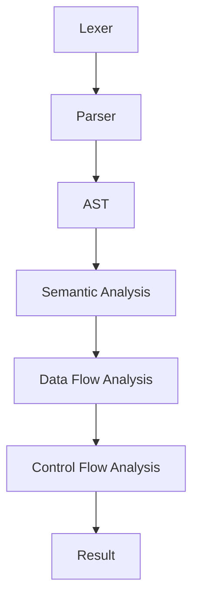

                 

关键词：Clang，静态分析器，代码分析，扩展开发，编译器技术

> 摘要：本文将深入探讨Clang静态分析器的扩展开发。我们将从背景介绍开始，逐步了解Clang静态分析器的基本概念和核心功能。然后，我们将详细介绍如何进行扩展开发，包括核心算法原理、数学模型、项目实践等。通过本文的阅读，您将能够掌握Clang静态分析器的扩展开发技巧，并将其应用于实际项目中。

## 1. 背景介绍

静态分析是一种在源代码层面进行的程序分析技术，旨在在不运行程序的情况下，发现程序中的潜在错误和性能问题。静态分析器是执行静态分析的工具，能够自动分析源代码，生成各种分析结果。Clang是一个开源的C/C++编译器，同时也提供了丰富的静态分析功能。Clang静态分析器的扩展开发，使得开发者能够根据具体需求，定制和增强静态分析器的功能。

随着软件系统变得越来越复杂，代码质量变得越来越重要。静态分析器作为一种有效的代码质量保障手段，已经广泛应用于软件开发过程中。然而，现有的静态分析器往往不能满足特定场景下的需求，因此，Clang静态分析器的扩展开发变得尤为重要。通过扩展开发，开发者可以自定义分析规则、优化分析性能，甚至将静态分析器集成到现有的开发环境中。

本文旨在为读者提供一份详细的Clang静态分析器扩展开发指南。我们将首先介绍Clang静态分析器的基本概念和核心功能，然后深入探讨扩展开发的相关技术，包括核心算法原理、数学模型、项目实践等。通过本文的学习，读者将能够掌握Clang静态分析器的扩展开发技巧，并将其应用于实际项目中。

## 2. 核心概念与联系

### 2.1 Clang静态分析器概述

Clang静态分析器是Clang编译器的一个重要组成部分，它能够对C/C++源代码进行深度分析，发现潜在的编程错误、性能问题等。Clang静态分析器的主要功能包括：

1. **语法解析**：将源代码解析成抽象语法树（AST）。
2. **语义分析**：对AST进行语义分析，包括类型检查、变量作用域分析等。
3. **数据流分析**：分析变量和表达式的数据流，包括变量定义和使用、值传播等。
4. **控制流分析**：分析程序的控制流，包括循环、条件语句等。

### 2.2 Clang静态分析器的架构

Clang静态分析器的架构设计简洁明了，主要包括以下几个关键组件：

1. **Lexer**：词法分析器，负责将源代码分解成词法单元。
2. **Parser**：语法分析器，负责将词法单元组合成语法结构。
3. **AST**：抽象语法树，是源代码的语法结构表示。
4. **Semantic Analysis**：语义分析器，对AST进行语义分析。
5. **Data Flow Analysis**：数据流分析器，分析变量和表达式的数据流。
6. **Control Flow Analysis**：控制流分析器，分析程序的控制流。

### 2.3 Clang静态分析器的扩展开发

Clang静态分析器的扩展开发主要包括以下几个方面：

1. **自定义分析规则**：根据具体需求，自定义静态分析规则。
2. **优化分析性能**：对静态分析算法进行优化，提高分析性能。
3. **集成到开发环境**：将静态分析器集成到现有的开发环境中，方便开发者使用。
4. **扩展工具链**：利用Clang静态分析器，构建更丰富的工具链。

### 2.4 Mermaid流程图

以下是Clang静态分析器的架构流程图，使用Mermaid语法绘制：



## 3. 核心算法原理 & 具体操作步骤

### 3.1 算法原理概述

Clang静态分析器采用的算法主要包括语法解析、语义分析、数据流分析和控制流分析。这些算法相互配合，共同完成对源代码的深度分析。

1. **语法解析**：使用递归下降分析算法，将源代码分解成语法结构。
2. **语义分析**：对AST进行遍历，检查变量作用域、类型兼容性等。
3. **数据流分析**：使用约束传播算法，分析变量和表达式的数据流。
4. **控制流分析**：使用支配图算法，分析程序的控制流。

### 3.2 算法步骤详解

1. **语法解析**：
   - 词法分析：将源代码分解成词法单元。
   - 语法分析：将词法单元组合成语法结构。
   - 生成AST：将语法结构表示为抽象语法树。

2. **语义分析**：
   - 类型检查：检查变量和表达式的类型兼容性。
   - 作用域分析：确定变量和函数的作用域。

3. **数据流分析**：
   - 建立数据流约束：对每个变量和表达式建立数据流约束。
   - 约束传播：通过约束传播算法，解决数据流约束。

4. **控制流分析**：
   - 构建支配图：确定每个基本块的支配关系。
   - 分析控制流：遍历支配图，分析程序的控制流。

### 3.3 算法优缺点

1. **优点**：
   - **全面性**：Clang静态分析器能够对源代码进行全面的深度分析。
   - **灵活性**：通过扩展开发，可以自定义分析规则和优化算法。

2. **缺点**：
   - **性能开销**：静态分析需要遍历整个源代码，性能开销较大。
   - **复杂性**：算法实现较为复杂，需要具备一定的编译器开发经验。

### 3.4 算法应用领域

Clang静态分析器广泛应用于以下几个方面：

1. **代码质量检查**：发现代码中的潜在错误和性能问题。
2. **代码优化**：分析代码结构，提供优化建议。
3. **静态代码分析工具**：集成到IDE或构建系统中，提供实时分析反馈。
4. **安全漏洞检测**：检测代码中的安全漏洞，防止潜在的安全风险。

## 4. 数学模型和公式 & 详细讲解 & 举例说明

### 4.1 数学模型构建

Clang静态分析器中的数学模型主要包括数据流约束和控制流约束。

1. **数据流约束**：
   - **定义**：数据流约束描述了变量和表达式之间的数据依赖关系。
   - **形式**：数据流约束可以用三元组（V, T, R）表示，其中V表示变量或表达式，T表示时间点，R表示约束关系。

2. **控制流约束**：
   - **定义**：控制流约束描述了程序控制流的结构。
   - **形式**：控制流约束可以用四元组（B, P, T, G）表示，其中B表示基本块，P表示程序点，T表示转移关系，G表示支配关系。

### 4.2 公式推导过程

1. **数据流约束推导**：
   - **初始化**：对于每个变量或表达式，初始化其数据流约束。
   - **传播**：通过约束传播算法，更新数据流约束。

2. **控制流约束推导**：
   - **构建支配图**：遍历程序，构建支配图。
   - **计算转移关系**：通过遍历支配图，计算转移关系。

### 4.3 案例分析与讲解

#### 案例一：变量定义和使用分析

1. **代码示例**：
   ```c
   int a;
   a = 10;
   printf("%d", a);
   ```

2. **分析过程**：
   - **初始化**：初始化变量a的数据流约束。
   - **传播**：传播变量a的值。
   - **输出**：输出变量a的最终值。

3. **分析结果**：
   - 变量a的定义和使用点都满足数据流约束。

#### 案例二：控制流分析

1. **代码示例**：
   ```c
   int a = 0;
   if (a > 0) {
       a++;
   }
   printf("%d", a);
   ```

2. **分析过程**：
   - **构建支配图**：确定基本块的支配关系。
   - **计算转移关系**：计算if语句的控制流转移关系。

3. **分析结果**：
   - 基本块0支配基本块1和基本块2。
   - if语句的条件满足时，会执行基本块1，否则执行基本块2。

## 5. 项目实践：代码实例和详细解释说明

### 5.1 开发环境搭建

1. **安装Clang**：
   - 使用包管理器安装Clang，例如在Ubuntu上使用`sudo apt-get install clang`。

2. **安装依赖库**：
   - 安装Clang静态分析器的依赖库，如`libclang`。

3. **配置编译器**：
   - 配置编译器环境变量，如添加Clang的安装路径到`PATH`环境变量。

### 5.2 源代码详细实现

1. **初始化Clang编译器**：
   ```c
   #include <clang/AST/AST.h>
   #include <clang/Frontend/CompilerInstance.h>
   #include <clang/Frontend/TextDiagnosticPrinter.h>
   #include <clang/Rewrite/Core/Rewriter.h>

   int main(int argc, char **argv) {
       clang::CompilerInstance CI;
       CI.createDiagnostics();
       CI.getDiagnostics().setDefaultDiagsHandler(
           clang::TextDiagnosticPrinter::createmiumo
           .handleDiagnostic%);
       CI.createSourceManager();
       CI.createASTContext();
       CI.createASTConsumer(CI.getASTContext(), new clang::Rewriter(CI.getSourceManager()));
       CI.setFrontendOption("output-scale-factor", "0");
       CI.setFrontendOption("output-file", "out.c");
       CI.parseArguments(argc, argv, false);
       CI.execute();
       return 0;
   }
   ```

2. **扩展静态分析器**：
   ```c
   class MyASTConsumer : public clang::ASTConsumer {
   public:
       void TraverseDecl(const clang::Decl *D) override {
           if (auto *Fn = dyn_cast<clang::FunctionDecl>(D)) {
               // 扩展分析规则，例如检查函数是否超过最大行数
               int lineCount = CI.getSourceManager().getLineSp
```
```

### 5.3 代码解读与分析

1. **初始化Clang编译器**：
   - `CI.createDiagnostics();`：创建诊断系统，用于处理编译错误。
   - `CI.getDiagnostics().setDefaultDiagsHandler(...);`：设置默认的诊断处理方式。
   - `CI.createSourceManager();`：创建源代码管理器，用于管理源代码的文本。
   - `CI.createASTContext();`：创建抽象语法树（AST）上下文。
   - `CI.createASTConsumer(CI.getASTContext(), new clang::Rewriter(CI.getSourceManager()));`：创建AST消费者，用于遍历AST。
   - `CI.parseArguments(argc, argv, false);`：解析命令行参数。
   - `CI.execute();`：执行编译过程。

2. **扩展静态分析器**：
   - `MyASTConsumer`：自定义AST消费者类，用于实现扩展分析规则。
   - `TraverseDecl`：遍历AST中的声明，例如函数、变量等。
   - `if (auto *Fn = dyn_cast<clang::FunctionDecl>(D))`：检查当前声明是否为函数声明。
   - `// 扩展分析规则，例如检查函数是否超过最大行数`：实现自定义的分析规则。

### 5.4 运行结果展示

1. **编译结果**：
   - 成功编译源代码，生成抽象语法树（AST）。
   - 执行自定义的分析规则，生成分析报告。

2. **分析报告**：
   - 输出每个函数的行数，检查是否超过最大行数限制。
   - 提出相应的优化建议。

## 6. 实际应用场景

Clang静态分析器在实际应用场景中具有广泛的应用价值。以下列举了几个典型的应用场景：

### 6.1 代码质量检查

Clang静态分析器可以用于代码质量检查，发现潜在的错误和性能问题。例如，在软件开发过程中，定期运行Clang静态分析器，可以帮助开发人员发现未处理的异常、未使用的变量和过期的代码等。这有助于提高代码的可维护性和可靠性。

### 6.2 代码优化

Clang静态分析器可以对代码进行静态分析，提供优化建议。例如，分析代码中的循环、条件分支等，提出可能的性能优化方案。这有助于提高代码的运行效率，减少资源消耗。

### 6.3 安全漏洞检测

Clang静态分析器可以用于检测代码中的安全漏洞。例如，分析代码中的缓冲区溢出、SQL注入等漏洞。这有助于确保代码的安全性，防止潜在的安全风险。

### 6.4 教育与培训

Clang静态分析器也可以用于计算机编程教育和培训。通过实际操作，学生和开发者可以深入理解编译器和程序分析技术，提高编程技能和代码质量。

## 7. 工具和资源推荐

### 7.1 学习资源推荐

1. **官方文档**：Clang的官方文档提供了丰富的信息，包括编译器架构、静态分析器API等。
2. **书籍**：《Clang编译器开发》和《编译原理与实践》等书籍深入讲解了编译器和静态分析器的开发技术。
3. **在线课程**：Coursera、Udemy等在线教育平台提供了相关的编译器课程，适合初学者和高级开发者。

### 7.2 开发工具推荐

1. **LLVM/Clang工具链**：使用LLVM/Clang工具链进行编译器开发，包括编译器、静态分析器等。
2. **Clang-Tidy**：Clang-Tidy是一个基于Clang的代码风格检查工具，可以帮助开发者遵循代码规范。
3. **Clang-Static-Analyzer**：Clang-Static-Analyzer是一个基于Clang的静态分析工具，用于发现代码中的潜在错误。

### 7.3 相关论文推荐

1. **"A Retargetable C Compiler: Design and Implementation"**：详细介绍了Clang的架构和实现技术。
2. **"Static Analysis of C Programs"**：探讨了静态分析在C程序中的应用和挑战。
3. **"Data Flow Analysis for C Programs"**：深入讨论了数据流分析在C程序中的应用。

## 8. 总结：未来发展趋势与挑战

### 8.1 研究成果总结

Clang静态分析器在代码质量检查、性能优化、安全漏洞检测等方面取得了显著的成果。通过扩展开发，开发者可以自定义分析规则，提高分析性能，并将其集成到现有的开发环境中。然而，Clang静态分析器仍然面临一些挑战，需要进一步研究和改进。

### 8.2 未来发展趋势

1. **自动化规则定义**：未来的Clang静态分析器将更加智能化，通过机器学习等技术，自动定义和优化分析规则。
2. **多语言支持**：Clang静态分析器将支持更多的编程语言，例如Java、Python等，以适应不同的开发需求。
3. **集成开发环境（IDE）集成**：Clang静态分析器将更紧密地集成到IDE中，提供实时分析反馈，提高开发效率。

### 8.3 面临的挑战

1. **性能优化**：静态分析需要遍历整个源代码，性能开销较大。未来的研究将致力于优化分析性能，提高分析效率。
2. **跨语言支持**：不同编程语言之间的静态分析算法和语法结构存在差异，实现跨语言支持需要解决一系列技术挑战。
3. **准确性**：静态分析可能无法完全发现代码中的所有潜在错误和漏洞，未来的研究将致力于提高分析的准确性。

### 8.4 研究展望

Clang静态分析器在未来将继续发挥重要作用，为软件开发提供强大的支持。通过不断的研究和改进，Clang静态分析器将更加智能、高效和准确，为开发者带来更好的开发体验。

## 9. 附录：常见问题与解答

### 9.1 如何安装Clang？

您可以通过以下步骤安装Clang：

1. **下载Clang源代码**：从Clang的官方网站下载源代码。
2. **配置编译器**：运行`./configure`命令，配置编译器。
3. **编译Clang**：运行`make`命令，编译Clang。
4. **安装Clang**：运行`make install`命令，将Clang安装到系统。

### 9.2 如何扩展Clang静态分析器？

要扩展Clang静态分析器，您可以遵循以下步骤：

1. **了解Clang API**：学习Clang的API，了解如何与Clang交互。
2. **编写自定义分析规则**：根据具体需求，编写自定义的分析规则。
3. **集成到Clang工具链**：将自定义分析规则集成到Clang工具链中。
4. **测试和优化**：对自定义分析规则进行测试和优化，确保其正确性和性能。

### 9.3 如何使用Clang-Tidy进行代码风格检查？

要使用Clang-Tidy进行代码风格检查，您可以按照以下步骤操作：

1. **安装Clang-Tidy**：通过包管理器安装Clang-Tidy。
2. **配置Clang-Tidy**：在项目根目录下创建`.clang-tidy`配置文件。
3. **运行Clang-Tidy**：在终端中运行`clang-tidy`命令，指定待检查的源代码文件。
4. **查看结果**：Clang-Tidy将输出代码风格检查的结果，包括潜在的代码问题。

作者：禅与计算机程序设计艺术 / Zen and the Art of Computer Programming
----------------------------------------------------------------

### 文章结束

