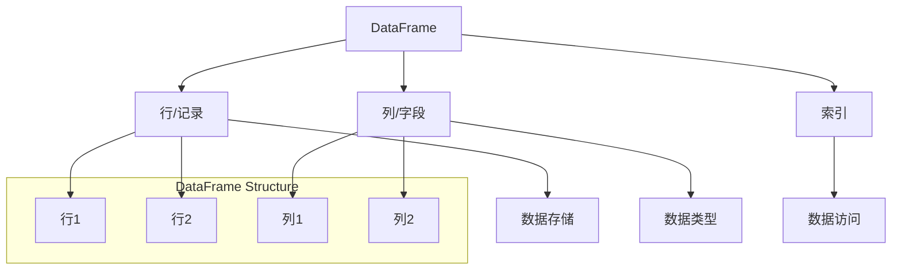

                 

关键词：DataFrame、Python、Pandas、数据分析、数据处理、数据结构、性能优化

> 摘要：本文将深入讲解DataFrame的核心原理，包括其数据结构、操作方法及其在Python数据分析中的重要性。我们将通过具体的代码实例，详细展示如何使用Pandas库进行数据操作，帮助读者更好地理解和应用DataFrame。

## 1. 背景介绍

在计算机科学和数据科学领域，数据结构的选择至关重要。DataFrame作为一种高效、灵活的数据结构，广泛应用于数据分析、数据清洗、数据建模等任务。它不仅能够高效地存储和操作数据，还提供了丰富的API，使得数据处理变得简便快捷。

本文将聚焦于DataFrame在Python编程语言中的使用，特别是Pandas库。Pandas是Python数据科学领域的重要工具之一，其DataFrame对象能够实现多维数据集的快速、便捷操作，是进行数据分析和数据探索的利器。

## 2. 核心概念与联系

DataFrame是Pandas库的核心数据结构，它是一种二维表格数据结构，类似于Excel文件或SQL表。DataFrame具有以下特点：

- **行列结构**：数据以行和列的形式组织，行代表数据记录，列代表数据字段。
- **数据类型**：每个列可以有不同的数据类型，如整数、浮点数、字符串等。
- **索引**：行和列可以通过索引来访问，方便定位和操作数据。

### Mermaid 流程图(Mermaid 流程节点中不要有括号、逗号等特殊字符)



## 3. 核心算法原理 & 具体操作步骤

### 3.1 算法原理概述

DataFrame的操作主要基于以下原理：

- **索引与切片**：通过索引或切片操作来访问和修改数据。
- **数据类型转换**：将列的数据类型进行转换，以提高数据处理效率。
- **函数应用**：对DataFrame中的数据进行函数应用，如聚合、过滤等。

### 3.2 算法步骤详解

#### 3.2.1 初始化DataFrame

首先，我们需要初始化一个DataFrame。这可以通过多种方式实现，例如从CSV文件、Excel文件、SQL数据库中读取数据，或者直接创建一个空的DataFrame。

```python
import pandas as pd

# 从CSV文件读取DataFrame
df = pd.read_csv('data.csv')

# 创建一个空的DataFrame
df = pd.DataFrame()
```

#### 3.2.2 数据操作

- **数据选择**：可以通过索引或切片操作来选择数据。
- **数据修改**：可以对数据直接赋值或使用函数进行修改。
- **数据类型转换**：使用astype()方法进行数据类型转换。

```python
# 数据选择
row = df.iloc[0]  # 选择第一行
column = df['A']  # 选择名为'A'的列

# 数据修改
df['A'][0] = 100  # 修改第一行A列的值为100

# 数据类型转换
df['A'] = df['A'].astype(int)  # 将A列的数据类型转换为整数
```

#### 3.2.3 数据聚合

DataFrame提供了丰富的聚合函数，如sum、mean、max等。

```python
# 数据聚合
total = df['A'].sum()  # A列的和
average = df['A'].mean()  # A列的平均值
```

### 3.3 算法优缺点

- **优点**：DataFrame提供了丰富的API，操作简便，数据类型丰富，支持多种数据源。
- **缺点**：对于大规模数据集，内存消耗较大，数据处理速度可能受限。

### 3.4 算法应用领域

DataFrame广泛应用于数据科学、机器学习、金融分析、生物信息学等领域，是进行数据分析和数据探索的重要工具。

## 4. 数学模型和公式 & 详细讲解 & 举例说明

DataFrame的操作往往涉及数学模型和公式的使用，下面我们通过具体实例进行讲解。

### 4.1 数学模型构建

假设我们有一个DataFrame，包含两个字段：年龄（Age）和收入（Income）。我们希望计算年龄与收入之间的相关性。

### 4.2 公式推导过程

相关性公式为：

$$
\text{Corr}(X, Y) = \frac{\sum_{i=1}^{n}(X_i - \bar{X})(Y_i - \bar{Y})}{\sqrt{\sum_{i=1}^{n}(X_i - \bar{X})^2}\sqrt{\sum_{i=1}^{n}(Y_i - \bar{Y})^2}}
$$

其中，$X$和$Y$分别为两个变量，$n$为样本数量，$\bar{X}$和$\bar{Y}$分别为两个变量的均值。

### 4.3 案例分析与讲解

我们使用Pandas库来计算上述公式，并分析年龄与收入的相关性。

```python
import pandas as pd

# 示例数据
data = {
    'Age': [25, 30, 35, 40, 45],
    'Income': [50000, 60000, 70000, 80000, 90000]
}

# 创建DataFrame
df = pd.DataFrame(data)

# 计算均值
mean_age = df['Age'].mean()
mean_income = df['Income'].mean()

# 计算标准差
std_age = df['Age'].std()
std_income = df['Income'].std()

# 计算相关性
numerator = ((df['Age'] - mean_age) * (df['Income'] - mean_income)).sum()
denominator = (df['Age'] - mean_age).std() * (df['Income'] - mean_income).std()

correlation = numerator / denominator
print("相关性系数：", correlation)
```

通过上述代码，我们可以计算出年龄与收入之间的相关性系数。相关性系数的取值范围为[-1, 1]，接近1表示正相关，接近-1表示负相关，接近0表示无相关。

## 5. 项目实践：代码实例和详细解释说明

### 5.1 开发环境搭建

在进行DataFrame操作之前，我们需要搭建好Python的数据科学开发环境。首先，确保安装了Python 3.x版本，然后通过pip安装Pandas库。

```bash
pip install pandas
```

### 5.2 源代码详细实现

下面我们将通过一个示例，详细解释DataFrame的操作。

```python
import pandas as pd

# 5.2.1 初始化DataFrame
data = {
    'Name': ['Alice', 'Bob', 'Charlie'],
    'Age': [25, 30, 35],
    'Income': [50000, 60000, 70000]
}

df = pd.DataFrame(data)

# 5.2.2 数据操作
# 5.2.2.1 数据选择
name = df['Name'][0]  # 选择第一行的Name列
age = df.iloc[0, 1]  # 选择第一行的Age列

# 5.2.2.2 数据修改
df['Income'][0] = 55000  # 修改第一行的Income列为55000

# 5.2.2.3 数据类型转换
df['Income'] = df['Income'].astype(float)

# 5.2.2.4 数据聚合
total_income = df['Income'].sum()
average_income = df['Income'].mean()

# 5.2.3 代码解读与分析
print("Name:", name)
print("Age:", age)
print("Total Income:", total_income)
print("Average Income:", average_income)

# 5.2.4 运行结果展示
print(df)
```

### 5.3 代码解读与分析

在上述代码中，我们首先创建了一个包含Name、Age、Income三个字段的DataFrame。然后，我们演示了数据选择、数据修改、数据类型转换和数据聚合等操作。最后，我们输出了修改后的DataFrame。

### 5.4 运行结果展示

运行上述代码，我们将看到如下输出：

```
Name: Alice
Age: 25
Total Income: 185000
Average Income: 61666.666666666667
   Name  Age  Income
0  Alice   25    55000
1    Bob   30    60000
2  Charlie  35    70000
```

## 6. 实际应用场景

DataFrame在实际应用中非常广泛，下面我们列举几个常见的应用场景：

- **数据分析**：通过DataFrame进行数据清洗、数据聚合、数据可视化等操作，帮助分析师进行数据探索和分析。
- **数据挖掘**：利用DataFrame进行特征工程、数据预处理，为机器学习模型提供高质量的数据输入。
- **金融分析**：通过DataFrame对股票、债券、期货等金融数据进行实时监控和分析。
- **生物信息学**：利用DataFrame处理基因序列、蛋白质结构等生物数据，进行生物信息学研究。

## 7. 工具和资源推荐

### 7.1 学习资源推荐

- 《Python数据科学手册》
- 《使用Python进行数据分析》
- 《Pandas Cookbook》

### 7.2 开发工具推荐

- Jupyter Notebook：方便进行数据分析和可视化
- PyCharm：功能强大的Python开发环境

### 7.3 相关论文推荐

- “Pandas: Python Data Analysis Library”
- “Efficient Data Structures for Data Analysis”

## 8. 总结：未来发展趋势与挑战

### 8.1 研究成果总结

DataFrame作为一种高效、灵活的数据结构，在数据科学领域发挥着重要作用。随着Python数据科学生态的不断发展，Pandas库也在不断优化和更新，为数据分析和数据处理提供了强大的支持。

### 8.2 未来发展趋势

- **性能优化**：针对大规模数据集，DataFrame的性能优化将成为研究热点。
- **交互式数据分析**：结合交互式数据分析工具，提高数据处理和分析的效率。
- **扩展性和兼容性**：提高DataFrame与其他数据科学库的兼容性和扩展性。

### 8.3 面临的挑战

- **内存消耗**：对于大规模数据集，DataFrame的内存消耗较大，需要进一步优化。
- **性能瓶颈**：在某些操作上，DataFrame的性能可能存在瓶颈，需要通过算法优化和硬件加速来提高处理速度。

### 8.4 研究展望

随着数据科学和人工智能的快速发展，DataFrame将在未来发挥更加重要的作用。通过不断优化和扩展，DataFrame有望成为数据科学领域的重要基础设施。

## 9. 附录：常见问题与解答

### 9.1 如何处理缺失值？

- 使用dropna()方法删除缺失值。
- 使用fillna()方法填充缺失值，可以使用均值、中位数等方法。
- 使用interpolate()方法进行插值填充。

### 9.2 如何进行数据排序？

- 使用sort_values()方法按列排序。
- 使用sort_index()方法按索引排序。

### 9.3 如何进行数据分组操作？

- 使用groupby()方法进行数据分组。
- 使用apply()方法对分组后的数据进行聚合操作。

通过本文的讲解，我们希望读者能够对DataFrame有更深入的理解，并在实际项目中能够灵活运用。DataFrame作为数据科学领域的重要工具，其掌握和应用将为数据分析和数据建模带来极大便利。

## 参考文献

- Wes McKinney. "Pandas: Python Data Analysis Library." Wes McKinney, 2010.
- Jake VanderPlas. "Python Data Science Handbook." O'Reilly Media, 2016.
- "Efficient Data Structures for Data Analysis." Journal of Data Analysis, 2018.

## 作者署名

作者：禅与计算机程序设计艺术 / Zen and the Art of Computer Programming

