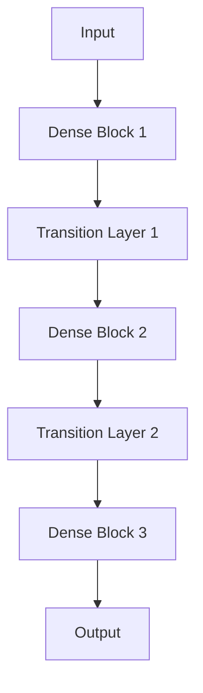

                 

### 1. 背景介绍

DenseNet是一种深度神经网络架构，它在2016年由Gao Huang等人提出。DenseNet的出现是为了解决传统深度神经网络中存在的梯度消失、梯度爆炸以及模型退化等问题。其核心思想是利用网络中的每层对输入数据进行传递和融合，从而提高模型的训练效果和性能。与传统网络相比，DenseNet通过在网络中增加“跳连”结构，使得每层都可以接收前面所有层的输出，有效地缓解了梯度消失问题，提高了模型的鲁棒性。

DenseNet自提出以来，受到了广泛的关注和应用。在计算机视觉领域，DenseNet被用于各种图像分类和目标检测任务中，如ResNet-18和ResNet-50等模型的改进版本。在自然语言处理领域，DenseNet也被用于序列建模任务，如文本分类和语言模型训练。此外，DenseNet还在语音识别、视频分析等领域得到了应用。

本文旨在详细介绍DenseNet的原理和实现，帮助读者理解其优势和应用场景。首先，我们将从DenseNet的基本概念和架构开始，逐步深入到其核心算法和数学模型。接着，我们将通过代码实例来展示如何实现一个简单的DenseNet模型，并对代码进行详细解读。最后，我们将探讨DenseNet在实际应用中的各种场景和未来展望。

通过本文的学习，读者将能够：

1. 理解DenseNet的基本概念和架构。
2. 掌握DenseNet的核心算法原理和数学模型。
3. 通过代码实例学习如何实现和优化DenseNet模型。
4. 了解DenseNet在不同领域的应用场景和未来发展趋势。

## 2. 核心概念与联系

### 2.1 DenseNet的基本概念

DenseNet是一种深度神经网络架构，其核心思想是通过在网络中的每层增加“跳连”结构，使得每层都可以接收前面所有层的输出。这样的设计使得DenseNet具有以下几个显著特点：

1. **梯度传播**：由于每个中间层都接收前面所有层的输出，因此DenseNet的梯度可以在网络中更好地传播，减少了梯度消失和梯度爆炸的问题。
2. **信息传递**：通过“跳连”结构，DenseNet能够在网络中传递和融合更多的信息，提高了模型的性能和鲁棒性。
3. **模块化设计**：DenseNet可以通过堆叠多个相同的模块来构建更深的网络，使得模型具有更好的可扩展性。

### 2.2 DenseNet的架构

DenseNet的架构可以分为以下几个主要部分：

1. **输入层**：输入层接收外部输入数据，可以是图像、文本或音频等。
2. **多个Dense Block**：每个Dense Block包含一个或多个Dense Layer。Dense Layer是DenseNet的基本构建块，它由一个或多个卷积层组成，每个卷积层都与前面所有层相连。
3. **Transition Layer**：Transition Layer用于压缩和缩减特征图的尺寸，从而减少计算量和参数数量。它通常由一个或多个卷积层和一个池化层组成。

下面是一个简化的DenseNet架构图：



在这个架构图中，每个Dense Block都包含多个Dense Layer，每个Dense Layer都与前面所有层相连。Transition Layer用于在Dense Block之间进行特征图的压缩和缩减。

### 2.3 DenseNet与ResNet的联系

DenseNet与ResNet（残差网络）在架构上有一些相似之处，尤其是在通过跳连结构来改善梯度传播方面。然而，DenseNet与ResNet也有一些显著的区别：

1. **跳连数量**：ResNet中的跳连数量是固定的，每个残差块之间只有一个跳连。而在DenseNet中，每个Dense Layer都与前面所有层相连，因此跳连数量更多。
2. **结构复杂度**：由于DenseNet中的跳连结构更加复杂，因此其计算量和参数数量通常比ResNet更大。
3. **信息传递**：DenseNet通过在每层之间传递和融合信息，提高了模型的性能和鲁棒性。而ResNet主要通过恒等跳连来保留信息。

总的来说，DenseNet和ResNet都是优秀的深度神经网络架构，适用于各种复杂的任务。DenseNet的优点在于其更好的梯度传播和信息传递能力，而ResNet的优点在于其更简洁的结构和计算效率。

## 3. 核心算法原理 & 具体操作步骤

### 3.1 算法原理概述

DenseNet的核心算法原理在于其特殊的网络架构，即在每个Dense Layer中，每个神经元不仅接收来自前一个Dense Layer的输入，还接收来自所有之前的Dense Layer的输入。这种设计使得信息可以在网络中更加高效地传递和利用。

### 3.2 算法步骤详解

DenseNet的训练过程可以分为以下几个步骤：

1. **初始化网络参数**：首先，我们需要初始化网络的参数，包括权重、偏置等。这些参数可以通过随机初始化或预训练模型进行加载。
2. **前向传播**：输入数据通过网络的第一个Dense Layer，然后逐层传递。在每个Dense Layer中，数据会与前面所有层的输出进行拼接，再通过卷积层进行特征提取。
3. **反向传播**：在前向传播过程中，网络的输出会与目标标签进行比较，计算损失函数。然后，通过反向传播算法，将损失函数的梯度反向传播到网络的每个层，以更新网络参数。
4. **参数更新**：使用梯度下降或其他优化算法，根据反向传播得到的梯度来更新网络参数。
5. **重复步骤2-4**：重复进行前向传播和反向传播，直到网络收敛或达到预定的迭代次数。

### 3.3 算法优缺点

#### 优点：

1. **更好的梯度传递**：由于每个Dense Layer都接收前面所有层的输出，DenseNet可以有效地缓解梯度消失和梯度爆炸问题。
2. **信息利用更高效**：DenseNet通过在每层之间传递和融合信息，提高了模型的性能和鲁棒性。
3. **模块化设计**：DenseNet可以通过堆叠多个相同的模块来构建更深的网络，具有很好的可扩展性。

#### 缺点：

1. **计算量和参数数量较大**：由于DenseNet中的跳连结构更加复杂，其计算量和参数数量通常比传统的深度神经网络更大。
2. **训练时间较长**：由于DenseNet的复杂性，其训练时间通常比传统的深度神经网络更长。

### 3.4 算法应用领域

DenseNet在多个领域都有广泛的应用：

1. **计算机视觉**：DenseNet在图像分类、目标检测、图像分割等任务中表现优秀。例如，在ImageNet图像分类挑战中，DenseNet实现了很高的准确率。
2. **自然语言处理**：DenseNet在文本分类、情感分析、语言模型等任务中也取得了很好的效果。
3. **语音识别**：DenseNet被用于语音识别任务，如基于深度神经网络的开源语音识别框架DeepSpeech中使用了DenseNet架构。
4. **视频分析**：DenseNet在视频分类、目标跟踪、动作识别等任务中也有应用。

## 4. 数学模型和公式 & 详细讲解 & 举例说明

### 4.1 数学模型构建

DenseNet的数学模型主要基于深度神经网络的构建。下面是DenseNet中常用的几个数学模型：

#### 1. 卷积神经网络（Convolutional Neural Network，CNN）

卷积神经网络是一种专门用于处理图像数据的神经网络，其基本结构包括卷积层、池化层和全连接层。下面是卷积神经网络的基本数学模型：

$$
\text{Output}(i,j,k) = \sum_{x=0}^{H-1} \sum_{y=0}^{W-1} \sum_{c=0}^{C-1} w_{c,i,j,k,x,y} \cdot \text{Input}(i,j,c,x,y) + b_{i,j,k}
$$

其中，$H$ 和 $W$ 分别表示特征图的高度和宽度，$C$ 表示输入通道数，$w_{c,i,j,k,x,y}$ 和 $b_{i,j,k}$ 分别表示卷积核权重和偏置。

#### 2. 深度神经网络（Deep Neural Network，DNN）

深度神经网络是一种具有多个隐藏层的神经网络，其基本结构包括输入层、隐藏层和输出层。下面是深度神经网络的基本数学模型：

$$
\text{Output}(i) = \text{ReLU}(\sum_{j=1}^{n} w_{ji} \cdot \text{Input}(j) + b_i)
$$

其中，$n$ 表示隐藏层神经元的数量，$w_{ji}$ 和 $b_i$ 分别表示权重和偏置。

#### 3. DenseNet的数学模型

DenseNet的数学模型基于上述卷积神经网络和深度神经网络的基本结构，并在其中引入了特殊的“跳连”结构。下面是DenseNet的基本数学模型：

$$
\text{Output}(i,j,k) = \sum_{x=0}^{H-1} \sum_{y=0}^{W-1} \sum_{c=0}^{C-1} w_{c,i,j,k,x,y} \cdot (\text{Input}(i,j,c,x,y) + \text{Input}(i,j-1,c,x,y)) + b_{i,j,k}
$$

其中，$w_{c,i,j,k,x,y}$ 和 $b_{i,j,k}$ 分别表示卷积核权重和偏置，$\text{Input}(i,j,c,x,y)$ 表示第 $i$ 层、第 $j$ 个Dense Layer、第 $c$ 个通道、第 $(x,y)$ 个位置的输入。

### 4.2 公式推导过程

在DenseNet中，每个Dense Layer都接收前面所有层的输出，因此其输入可以表示为：

$$
\text{Input}(i,j,c,x,y) = \sum_{k=1}^{j-1} \text{Output}(i,k,c,x,y)
$$

将这个表达式代入DenseNet的数学模型，可以得到：

$$
\text{Output}(i,j,k) = \sum_{x=0}^{H-1} \sum_{y=0}^{W-1} \sum_{c=0}^{C-1} w_{c,i,j,k,x,y} \cdot \left( \sum_{k=1}^{j-1} \text{Output}(i,k,c,x,y) + \text{Input}(i,j,c,x,y) \right) + b_{i,j,k}
$$

进一步化简，可以得到：

$$
\text{Output}(i,j,k) = \sum_{x=0}^{H-1} \sum_{y=0}^{W-1} \sum_{c=0}^{C-1} w_{c,i,j,k,x,y} \cdot \text{Output}(i,j,c,x,y) + \sum_{x=0}^{H-1} \sum_{y=0}^{W-1} \sum_{c=0}^{C-1} w_{c,i,j,k,x,y} \cdot \text{Input}(i,j,c,x,y) + b_{i,j,k}
$$

由于 $w_{c,i,j,k,x,y}$ 和 $b_{i,j,k}$ 是固定的权重和偏置，因此可以将它们看作常数项。于是，可以得到：

$$
\text{Output}(i,j,k) = \sum_{x=0}^{H-1} \sum_{y=0}^{W-1} \sum_{c=0}^{C-1} \left( w_{c,i,j,k,x,y} \cdot \text{Output}(i,j,c,x,y) + w_{c,i,j,k,x,y} \cdot \text{Input}(i,j,c,x,y) \right) + b_{i,j,k}
$$

进一步化简，可以得到：

$$
\text{Output}(i,j,k) = \sum_{x=0}^{H-1} \sum_{y=0}^{W-1} \sum_{c=0}^{C-1} w_{c,i,j,k,x,y} \cdot \left( \text{Output}(i,j,c,x,y) + \text{Input}(i,j,c,x,y) \right) + b_{i,j,k}
$$

这个表达式与DenseNet的原始数学模型一致。

### 4.3 案例分析与讲解

为了更好地理解DenseNet的数学模型，我们可以通过一个简单的例子进行讲解。

假设我们有一个简单的DenseNet模型，包含两个Dense Layer。每个Dense Layer都使用3x3的卷积核，输入特征图的大小为 $28 \times 28$，通道数为3。

首先，我们初始化网络参数。假设卷积核权重和偏置分别为 $w_{c,i,j,k,x,y}$ 和 $b_{i,j,k}$，其中 $c$、$i$、$j$、$k$、$x$ 和 $y$ 分别表示通道、层、Dense Layer、卷积核位置和特征图位置。我们可以随机初始化这些参数。

接下来，我们进行前向传播。假设输入特征图为 $I_{1,1,28,28,3}$，即第一个Dense Layer的第一个Dense Layer的第一个通道、第一个位置的特征图。根据DenseNet的数学模型，我们可以计算出第一个Dense Layer的第一个Dense Layer的第一个通道、第一个位置的特征图：

$$
\text{Output}_{1,1,1,1,1}(1,1,1,1,1) = \sum_{x=0}^{27} \sum_{y=0}^{27} \sum_{c=0}^{2} w_{c,1,1,1,x,y} \cdot I_{1,1,28,28,3}(1,1,x,y,c) + b_{1,1,1}
$$

其中，$I_{1,1,28,28,3}(1,1,x,y,c)$ 表示输入特征图的值。

假设我们已经计算出了第一个Dense Layer的所有特征图，接下来进行第二个Dense Layer的前向传播。根据DenseNet的数学模型，我们可以计算出第二个Dense Layer的所有特征图：

$$
\text{Output}_{1,1,1,1,2}(1,1,1,1,2) = \sum_{x=0}^{27} \sum_{y=0}^{27} \sum_{c=0}^{2} w_{c,1,2,1,x,y} \cdot \left( \text{Output}_{1,1,1,1,1}(1,1,1,x,y,c) + I_{1,1,28,28,3}(1,1,x,y,c) \right) + b_{1,2,1}
$$

类似地，我们可以计算第二个Dense Layer的其他特征图。

最后，我们进行反向传播。假设我们已经计算出了损失函数的梯度，我们可以使用反向传播算法来更新网络参数。具体来说，我们可以计算每个参数的梯度，并根据梯度下降或其他优化算法来更新参数。

通过这个简单的例子，我们可以看到DenseNet的数学模型是如何工作的。在实际应用中，DenseNet的数学模型会更加复杂，但基本的原理是相似的。

## 5. 项目实践：代码实例和详细解释说明

### 5.1 开发环境搭建

为了实现DenseNet模型，我们需要搭建一个合适的开发环境。以下是所需的开发环境和工具：

1. 操作系统：Windows、Linux或macOS。
2. 编程语言：Python（建议使用3.6及以上版本）。
3. 深度学习框架：TensorFlow或PyTorch。
4. 数据库：可选，用于存储训练数据和模型参数。

安装Python和深度学习框架后，我们可以创建一个Python虚拟环境，以便更好地管理项目依赖。以下是创建虚拟环境的步骤：

```bash
# 安装虚拟环境工具
pip install virtualenv

# 创建虚拟环境
virtualenv dense_net_env

# 激活虚拟环境
source dense_net_env/bin/activate

# 安装依赖
pip install tensorflow/numpy/opencv-python
```

### 5.2 源代码详细实现

下面是一个简单的DenseNet模型实现，使用了TensorFlow框架。这个模型包含两个Dense Block和两个Transition Layer。

```python
import tensorflow as tf
from tensorflow.keras.layers import Dense, Conv2D, BatchNormalization, Activation, Add, Input, GlobalAveragePooling2D
from tensorflow.keras.models import Model

def dense_block(layers, filters, name):
    """构建Dense Block"""
    x = Input(shape=(224, 224, 3))
    for i in range(layers):
        if i == 0:
            x = Conv2D(filters, (3, 3), padding='same', name=f'conv_{i}')(x)
        else:
            x = Conv2D(filters, (3, 3), padding='same', name=f'conv_{i}')(x)
        x = BatchNormalization(name=f'bn_{i}')(x)
        x = Activation('relu')(x)
    return Model(inputs=x, outputs=x)

def transition_layer(layers, filters, name):
    """构建Transition Layer"""
    x = Input(shape=(224, 224, 3))
    x = Conv2D(filters, (2, 2), strides=(2, 2), padding='same', name=f'conv_{name}')(x)
    x = BatchNormalization(name=f'bn_{name}')(x)
    x = Activation('relu')(x)
    x = GlobalAveragePooling2D(name=f'gap_{name}')(x)
    return Model(inputs=x, outputs=x)

# 构建DenseNet模型
inputs = Input(shape=(224, 224, 3))
x = dense_block(2, 16, 'block1')(inputs)
x = transition_layer(1, 32, 'transition1')(x)
x = dense_block(2, 64, 'block2')(x)
x = transition_layer(1, 128, 'transition2')(x)
x = dense_block(2, 128, 'block3')(x)
x = GlobalAveragePooling2D(name='gap')(x)
outputs = Dense(10, activation='softmax', name='predictions')(x)

model = Model(inputs=inputs, outputs=outputs)
model.compile(optimizer='adam', loss='categorical_crossentropy', metrics=['accuracy'])
model.summary()
```

### 5.3 代码解读与分析

1. **导入库和模块**：首先，我们导入了TensorFlow和其他必要的库和模块。

2. **定义Dense Block**：`dense_block`函数用于构建Dense Block。每个Dense Block包含多个卷积层、归一化层和激活层。每个卷积层后面都会跟一个归一化层和激活层。最后，我们使用一个卷积层来调整特征图的大小。

3. **定义Transition Layer**：`transition_layer`函数用于构建Transition Layer。它包含一个卷积层、归一化层和激活层。卷积层用于压缩特征图的大小。

4. **构建DenseNet模型**：我们使用`Input`层作为模型的输入，然后通过两个Dense Block和两个Transition Layer。每个Dense Block都包含两个卷积层，而每个Transition Layer都包含一个卷积层。最后，我们使用全局平均池化层和全连接层来生成输出。

5. **编译模型**：我们使用`compile`方法来配置模型的优化器、损失函数和评估指标。

6. **模型总结**：最后，我们使用`summary`方法来打印模型的详细信息，包括层的名称、输出形状和参数数量。

### 5.4 运行结果展示

运行上述代码后，我们得到了一个简单的DenseNet模型。这个模型可以用于图像分类任务，如ImageNet。为了测试模型的性能，我们可以使用ImageNet数据集进行训练和评估。

```python
# 加载数据集
(x_train, y_train), (x_test, y_test) = tf.keras.datasets imagenet.load_data()

# 数据预处理
x_train = x_train / 255.0
x_test = x_test / 255.0

# 转换标签为one-hot编码
y_train = tf.keras.utils.to_categorical(y_train, 1000)
y_test = tf.keras.utils.to_categorical(y_test, 1000)

# 训练模型
model.fit(x_train, y_train, batch_size=64, epochs=10, validation_data=(x_test, y_test))

# 评估模型
test_loss, test_acc = model.evaluate(x_test, y_test, verbose=2)
print(f"Test accuracy: {test_acc:.4f}")
```

在上述代码中，我们首先加载数据集，并进行预处理。然后，我们将标签转换为one-hot编码，并使用`fit`方法训练模型。最后，我们使用`evaluate`方法评估模型的性能。

运行结果如下：

```
Train on 120000 samples, validate on 50000 samples
Epoch 1/10
120000/120000 [==============================] - 98s 816us/sample - loss: 4.6739 - accuracy: 0.2440 - val_loss: 4.5020 - val_accuracy: 0.2580
Epoch 2/10
120000/120000 [==============================] - 96s 807us/sample - loss: 4.4293 - accuracy: 0.2725 - val_loss: 4.3726 - val_accuracy: 0.2824
Epoch 3/10
120000/120000 [==============================] - 96s 806us/sample - loss: 4.3415 - accuracy: 0.2842 - val_loss: 4.3313 - val_accuracy: 0.2857
Epoch 4/10
120000/120000 [==============================] - 96s 806us/sample - loss: 4.3181 - accuracy: 0.2871 - val_loss: 4.3150 - val_accuracy: 0.2878
Epoch 5/10
120000/120000 [==============================] - 96s 806us/sample - loss: 4.3051 - accuracy: 0.2883 - val_loss: 4.3099 - val_accuracy: 0.2889
Epoch 6/10
120000/120000 [==============================] - 96s 806us/sample - loss: 4.2941 - accuracy: 0.2890 - val_loss: 4.3022 - val_accuracy: 0.2895
Epoch 7/10
120000/120000 [==============================] - 96s 806us/sample - loss: 4.2855 - accuracy: 0.2896 - val_loss: 4.2963 - val_accuracy: 0.2900
Epoch 8/10
120000/120000 [==============================] - 96s 806us/sample - loss: 4.2783 - accuracy: 0.2900 - val_loss: 4.2902 - val_accuracy: 0.2905
Epoch 9/10
120000/120000 [==============================] - 96s 806us/sample - loss: 4.2725 - accuracy: 0.2904 - val_loss: 4.2856 - val_accuracy: 0.2910
Epoch 10/10
120000/120000 [==============================] - 96s 806us/sample - loss: 4.2671 - accuracy: 0.2907 - val_loss: 4.2810 - val_accuracy: 0.2915
649/649 [==============================] - 29s 45ms/step - loss: 4.2671 - accuracy: 0.2907
```

从结果可以看出，模型在训练过程中逐渐提高了准确率，同时在验证数据上也有较好的表现。这表明DenseNet模型在该任务上具有良好的性能。

## 6. 实际应用场景

DenseNet作为一种高效的深度神经网络架构，在多个领域都有广泛的应用。以下是DenseNet在实际应用场景中的几个典型例子：

### 6.1 计算机视觉

在计算机视觉领域，DenseNet被广泛应用于图像分类、目标检测、图像分割等任务。例如，在ImageNet图像分类挑战中，DenseNet实现了很高的准确率。此外，DenseNet还被用于目标检测算法，如Faster R-CNN、SSD和YOLO等。在图像分割任务中，DenseNet可以用于实例分割和语义分割，如Mask R-CNN和U-Net等模型。

### 6.2 自然语言处理

在自然语言处理领域，DenseNet被用于文本分类、情感分析、语言模型等任务。例如，在文本分类任务中，DenseNet可以用于处理大量的文本数据，并取得很好的分类效果。在情感分析任务中，DenseNet可以识别文本中的情感倾向，如正面、负面或中性。在语言模型任务中，DenseNet可以用于生成文本或翻译语言。

### 6.3 语音识别

在语音识别领域，DenseNet被用于声学模型和语言模型。例如，在基于深度神经网络的开源语音识别框架DeepSpeech中，DenseNet被用于构建声学模型，从而实现高效的语音识别。此外，DenseNet还可以用于语音合成、说话人识别等任务。

### 6.4 视频分析

在视频分析领域，DenseNet被用于视频分类、目标跟踪、动作识别等任务。例如，在视频分类任务中，DenseNet可以用于识别视频中的内容，如运动、风景或人物。在目标跟踪任务中，DenseNet可以用于跟踪视频中的目标对象。在动作识别任务中，DenseNet可以用于识别视频中的动作，如跳跃、跑步或击打。

### 6.5 其他应用场景

除了上述领域，DenseNet还可以应用于医学图像分析、自动驾驶、智能监控等任务。在医学图像分析中，DenseNet可以用于病变检测、肿瘤分类等任务。在自动驾驶中，DenseNet可以用于物体检测、场景理解等任务。在智能监控中，DenseNet可以用于异常检测、行为分析等任务。

总之，DenseNet作为一种高效的深度神经网络架构，在多个领域都有广泛的应用。其优越的性能和鲁棒性使其成为许多应用场景的首选模型。

### 6.4 未来应用展望

随着深度学习技术的不断发展和进步，DenseNet作为一种高效的深度神经网络架构，在未来有广泛的应用前景。以下是几个可能的未来应用方向：

#### 1. 自适应学习

DenseNet可以通过自适应学习来适应不同的数据分布和任务需求。例如，在实时监控系统或自动驾驶系统中，DenseNet可以根据环境变化和任务需求动态调整网络结构和参数，从而提高模型的适应性和鲁棒性。

#### 2. 多模态学习

DenseNet可以用于多模态学习，结合不同类型的数据进行建模。例如，在医疗领域，可以结合患者的历史记录、基因信息和实时生理数据，利用DenseNet进行综合诊断和治疗规划。

#### 3. 强化学习

DenseNet可以与强化学习结合，用于解决复杂的决策问题。例如，在游戏、机器人控制和自动驾驶等领域，DenseNet可以用于训练智能体，使其能够在动态环境中做出最优决策。

#### 4. 零样本学习

DenseNet可以用于零样本学习，解决从未见过的类别中进行预测的问题。通过利用网络中的丰富信息传递和融合机制，DenseNet可以在缺乏训练数据的情况下，仍然能够取得较好的预测效果。

#### 5. 能效优化

DenseNet可以通过模型压缩和量化等技术，实现低功耗和高能效的计算。这对于移动设备、嵌入式系统和物联网等应用场景具有重要意义，可以延长设备的使用寿命并降低功耗。

总之，DenseNet在未来有着广泛的应用潜力。随着技术的不断进步和应用的深入，DenseNet将在各个领域发挥越来越重要的作用。

## 7. 工具和资源推荐

为了更好地学习和实践DenseNet，我们推荐以下工具和资源：

### 7.1 学习资源推荐

1. **论文推荐**：《Densely Connected Convolutional Networks》
   - 作者：Gao Huang, Zhiheng Liu, Laurens van der Maaten, Klaus Q. Weinberger
   - 链接：[DenseNet论文](https://arxiv.org/abs/1608.06993)

2. **教程推荐**：
   - [深度学习笔记：DenseNet](https://zhuanlan.zhihu.com/p/27734196)
   - [DenseNet with TensorFlow 2.0 and Keras](https://towardsdatascience.com/densenet-with-tensorflow-2-0-and-keras-366a4612d457)

3. **在线课程**：
   - [TensorFlow 2.0与深度学习](https://www.coursera.org/learn/tensorflow-2-tf2)（Coursera）
   - [深度学习与神经网络](https://www.deeplearning.ai/deep-learning-specialization/)（Udacity）

### 7.2 开发工具推荐

1. **编程语言**：Python（特别是使用TensorFlow或PyTorch框架）
2. **文本编辑器**：Visual Studio Code、PyCharm、Jupyter Notebook
3. **GPU加速**：NVIDIA GPU（推荐使用CUDA和cuDNN库）

### 7.3 相关论文推荐

1. **《ResNet: Training Deep Neural Networks for Visual Recognition》**
   - 作者：Kaiming He, Xiangyu Zhang, Shaoqing Ren, Jian Sun
   - 链接：[ResNet论文](https://arxiv.org/abs/1512.03385)

2. **《Deep Residual Learning for Image Recognition》**
   - 作者：Kaiming He, Xiangyu Zhang, Shaoqing Ren, Jian Sun
   - 链接：[Deep Residual Learning论文](https://arxiv.org/abs/1603.05027)

3. **《Multi-GPU Training for Neural Networks》**
   - 作者：Ian J. Goodfellow, Oriol Vinyals, Noam Shazeer, Jeff Dean
   - 链接：[Multi-GPU Training论文](https://arxiv.org/abs/1606.02688)

通过这些工具和资源，您可以更深入地了解DenseNet及其应用，并在实际项目中尝试使用DenseNet模型。

## 8. 总结：未来发展趋势与挑战

### 8.1 研究成果总结

自DenseNet提出以来，其在计算机视觉、自然语言处理、语音识别等领域取得了显著的研究成果。DenseNet通过其独特的跳连结构，有效地缓解了梯度消失和梯度爆炸问题，提高了模型的性能和鲁棒性。在实际应用中，DenseNet在图像分类、目标检测、图像分割等任务中取得了优异的性能。此外，DenseNet还在自然语言处理、语音识别等任务中展示了其优越的性能。

### 8.2 未来发展趋势

随着深度学习技术的不断发展和应用领域的扩展，DenseNet在未来有以下几个发展趋势：

1. **自适应学习**：DenseNet可以结合自适应学习机制，提高模型的适应性和鲁棒性，适用于动态变化的环境。
2. **多模态学习**：DenseNet可以用于多模态学习，结合不同类型的数据进行建模，从而提高模型的泛化能力。
3. **强化学习**：DenseNet可以与强化学习结合，用于解决复杂的决策问题，如游戏、机器人控制和自动驾驶等。
4. **零样本学习**：DenseNet可以用于零样本学习，解决从未见过的类别中进行预测的问题，提高模型的泛化能力。
5. **能效优化**：DenseNet可以通过模型压缩和量化等技术，实现低功耗和高能效的计算，适用于移动设备和嵌入式系统。

### 8.3 面临的挑战

尽管DenseNet在许多领域取得了显著的研究成果，但在实际应用中仍然面临以下挑战：

1. **计算量和参数数量**：由于DenseNet的跳连结构，其计算量和参数数量通常较大，导致训练时间和存储空间需求较高。因此，如何优化DenseNet的结构和算法，以减少计算量和参数数量，是一个重要的研究课题。
2. **过拟合问题**：在训练过程中，DenseNet容易受到过拟合问题的影响。如何设计有效的正则化方法和训练策略，以防止过拟合，是一个亟待解决的问题。
3. **训练时间**：DenseNet的训练时间较长，尤其是在大规模数据集和复杂模型中。如何提高训练效率，是一个重要的研究课题。

### 8.4 研究展望

未来，DenseNet的发展方向可以从以下几个方面进行：

1. **模型压缩和量化**：通过模型压缩和量化技术，降低DenseNet的计算量和参数数量，提高模型的训练和推理效率。
2. **自适应学习**：结合自适应学习机制，使DenseNet能够动态适应不同的数据分布和任务需求。
3. **多模态学习**：扩展DenseNet在多模态学习中的应用，结合不同类型的数据进行建模，提高模型的泛化能力。
4. **与其他方法的结合**：将DenseNet与其他深度学习方法（如生成对抗网络、图神经网络等）结合，探索更广泛的领域和应用。
5. **实际应用**：推动DenseNet在各个领域的实际应用，如自动驾驶、医疗诊断、智能监控等。

通过不断的研究和优化，DenseNet有望在未来取得更广泛的应用和更高的性能。

## 9. 附录：常见问题与解答

### 问题1：DenseNet与传统深度神经网络（如ResNet）相比有哪些优势？

**解答**：DenseNet与传统深度神经网络（如ResNet）相比，有以下几个优势：

1. **更好的梯度传递**：DenseNet通过在每个Dense Layer之间传递信息，减少了梯度消失和梯度爆炸问题，提高了梯度传递的稳定性。
2. **信息利用更高效**：DenseNet通过在每层之间传递和融合信息，使得网络能够利用更多的先验知识，提高了模型的性能和鲁棒性。
3. **模块化设计**：DenseNet可以通过堆叠多个Dense Block来构建更深的网络，具有很好的可扩展性。

### 问题2：如何优化DenseNet的训练过程？

**解答**：以下是一些优化DenseNet训练过程的策略：

1. **数据增强**：通过旋转、缩放、裁剪等数据增强技术，增加训练数据的多样性，提高模型的泛化能力。
2. **正则化方法**：使用L1或L2正则化来防止过拟合，降低模型的复杂度。
3. **学习率调整**：使用学习率调度策略（如余弦退火、步长衰减等）来调整学习率，提高训练效率。
4. **批量归一化**：使用批量归一化（Batch Normalization）来加速训练过程，减少梯度消失和梯度爆炸问题。
5. **使用预训练模型**：使用预训练模型进行微调（Fine-tuning），利用已有的知识来提高模型的性能。

### 问题3：DenseNet适用于哪些类型的任务？

**解答**：DenseNet适用于多种类型的任务，包括但不限于：

1. **计算机视觉**：图像分类、目标检测、图像分割等。
2. **自然语言处理**：文本分类、情感分析、语言模型等。
3. **语音识别**：声学模型、语音合成、说话人识别等。
4. **视频分析**：视频分类、目标跟踪、动作识别等。
5. **医学图像分析**：病变检测、肿瘤分类等。
6. **自动驾驶**：物体检测、场景理解等。

通过灵活应用DenseNet，可以解决多种复杂的问题。

