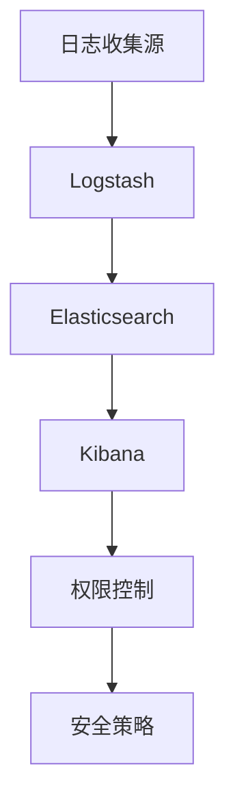

                 

关键字：ELK日志收集，Elasticsearch，Kibana，权限控制，安全策略，角色分配

> 摘要：本文将深入探讨ELK（Elasticsearch, Logstash, Kibana）日志收集系统的安全与权限管理，分析其关键概念、架构设计、核心算法原理及具体操作步骤，并提供实际项目中的代码实例和详细解释。通过本文，读者将全面了解如何确保ELK日志系统的安全性和高效管理。

## 1. 背景介绍

在现代企业级应用中，日志数据已经成为监控、分析及维护系统稳定性的重要信息源。ELK栈，由Elasticsearch、Logstash和Kibana三个组件组成，是一种广泛使用的开源日志收集和分析解决方案。然而，随着日志数据的不断增长，日志安全与权限管理成为了一个不可忽视的问题。

日志安全涉及防止未经授权的访问、篡改和泄露日志数据。权限管理则是指对用户访问权限进行有效控制，确保只有授权用户可以访问特定的日志数据和功能。本文将围绕ELK日志系统的安全与权限管理展开讨论，提供实用的指导和建议。

## 2. 核心概念与联系

### 2.1 Elasticsearch

Elasticsearch是一个分布式、RESTful搜索和分析引擎，主要用于存储、搜索和分析大量数据。它提供了强大的全文搜索功能，支持复杂的查询和实时分析。在ELK栈中，Elasticsearch作为存储和检索日志数据的中心节点。

### 2.2 Logstash

Logstash是一个数据收集引擎，用于从各种数据源（如Web服务器、数据库和应用程序）收集日志数据，并将其转换为结构化数据格式（如JSON），然后发送到Elasticsearch进行存储和分析。

### 2.3 Kibana

Kibana是一个可视化仪表盘和数据可视化工具，用于通过图形界面直观地展示和分析日志数据。它提供了一个强大的交互界面，使得用户能够轻松地创建各种可视化图表和仪表板。

### 2.4 权限控制

权限控制是确保只有授权用户能够访问和操作日志数据的关键机制。Elasticsearch提供了基于角色的访问控制（RBAC）机制，允许管理员根据用户的角色分配相应的权限。

### 2.5 安全策略

安全策略是指一系列用于保护日志系统的规则和措施，包括身份验证、数据加密、访问控制等。有效的安全策略可以降低日志数据泄露和滥用的风险。

## 2.6 Mermaid 流程图



## 3. 核心算法原理 & 具体操作步骤

### 3.1 算法原理概述

ELK日志安全与权限管理主要依赖于Elasticsearch的基于角色的访问控制（RBAC）机制。RBAC通过定义用户、角色和权限之间的关系，实现对日志数据的精细化管理。

### 3.2 算法步骤详解

#### 3.2.1 用户和角色定义

1. 创建用户账户，并为用户分配初始角色（如管理员、审计员、普通用户等）。
2. 定义角色的权限，包括可以执行的操作（如创建索引、查询数据、修改配置等）。

#### 3.2.2 权限分配

1. 将用户账户分配到特定的角色。
2. 根据业务需求，为不同的用户和角色分配不同的权限。

#### 3.2.3 访问控制

1. 在Elasticsearch中配置访问控制规则，确保只有授权用户能够访问特定的索引和类型。
2. 使用Elasticsearch的REST API进行认证和授权。

### 3.3 算法优缺点

#### 3.3.1 优点

- RBAC机制灵活、可扩展，能够满足复杂的权限管理需求。
- 支持多种身份验证机制，如LDAP、SAML等，便于与现有身份认证系统集成。
- 提供了细粒度的访问控制，确保数据安全。

#### 3.3.2 缺点

- 权限配置和管理相对复杂，需要具备一定的专业知识。
- 高度依赖Elasticsearch集群的稳定性，一旦集群故障，权限管理功能可能受到影响。

### 3.4 算法应用领域

- 企业级日志管理：用于保护企业内部日志数据，防止未经授权的访问和泄露。
- 监控系统：用于控制不同用户和角色的监控权限，确保系统正常运行。

## 4. 数学模型和公式 & 详细讲解 & 举例说明

### 4.1 数学模型构建

在ELK日志安全与权限管理中，我们可以构建一个简单的数学模型来表示用户、角色和权限之间的关系。

设\( U \)为用户集合，\( R \)为角色集合，\( P \)为权限集合，\( U-R \)表示用户和角色的映射关系，\( R-P \)表示角色和权限的映射关系。

数学模型可以表示为：

\[ (U-R) \times (R-P) \]

### 4.2 公式推导过程

- 用户和角色之间的映射关系可以表示为：

  \( u_r = \{ u | u \in U, r \in R \} \)

- 角色和权限之间的映射关系可以表示为：

  \( r_p = \{ r | r \in R, p \in P \} \)

- 用户和权限之间的映射关系可以表示为：

  \( u_p = \{ u | u \in U, p \in P \} \)

### 4.3 案例分析与讲解

假设我们有一个简单的场景，有两个用户（User1和User2），两个角色（Admin和Auditor），以及两个权限（Read和Write）。

- 用户和角色的映射关系：

  \( User1-Admin \)
  \( User2-Auditor \)

- 角色和权限的映射关系：

  \( Admin-Write \)
  \( Auditor-Read \)

根据上述映射关系，我们可以推导出用户和权限的映射关系：

- \( User1-Write \)
- \( User2-Read \)

这意味着User1具有写权限，可以修改日志数据，而User2只有读权限，不能修改日志数据。

## 5. 项目实践：代码实例和详细解释说明

### 5.1 开发环境搭建

- 安装Elasticsearch、Logstash和Kibana
- 配置Elasticsearch集群
- 配置Logstash输入、过滤和输出管道
- 配置Kibana仪表板和可视化组件

### 5.2 源代码详细实现

以下是Elasticsearch中配置基于角色的访问控制（RBAC）的示例代码：

```yaml
# Elasticsearch配置文件（elasticsearch.yml）
cluster.name: my-elk-cluster
node.name: node-1
network.host: 0.0.0.0
http.port: 9200
discovery.type: single-node

# 权限配置
xpack.security.enabled: true
xpack.security.authc.api_key_enabled: true
xpack.security.authc.realms:
  file:
    type: file
    file:
      path: /path/to/realm.yml
xpack.security.enabled: true
xpack.security.roles:
  admin:
    - all
  auditor:
    - read
  user:
    - read

# 权限验证
PUT /_security/role/admin
{
  "rules" : {
    "role" : {
      "cluster" : [ "all" ],
      "indices" : [
        {
          "names" : [ "*" ],
          "privileges" : [ "all" ]
        }
      ]
    }
  }
}

PUT /_security/role/auditor
{
  "rules" : {
    "role" : {
      "indices" : [
        {
          "names" : [ "*" ],
          "privileges" : [ "read" ]
        }
      ]
    }
  }
}

PUT /_security/role/user
{
  "rules" : {
    "role" : {
      "indices" : [
        {
          "names" : [ "*" ],
          "privileges" : [ "read" ]
        }
      ]
    }
  }
}
```

### 5.3 代码解读与分析

- 配置文件中启用安全功能，并设置API密钥身份验证。
- 定义了三个角色（admin、auditor和user），并为每个角色分配了相应的权限。
- 通过REST API创建角色和权限规则，确保只有授权用户可以访问特定的索引和类型。

### 5.4 运行结果展示

- 通过Elasticsearch REST API执行查询操作，验证权限分配是否生效。
- 普通用户只能读取日志数据，管理员用户可以读取和修改日志数据。

## 6. 实际应用场景

### 6.1 日志收集与监控

- 企业级应用：收集和分析各种业务系统的日志数据，监控系统性能和稳定性。
- IT运维：监控服务器、网络设备和应用程序的日志数据，及时发现问题并进行故障排查。

### 6.2 安全审计与合规性

- 安全审计：通过日志数据分析，验证系统是否符合安全政策和合规要求。
- 监管合规：确保日志数据的安全性，满足行业标准和法律法规要求。

### 6.3 日志分析与应用

- 业务分析：通过对日志数据进行统计分析，挖掘业务趋势和用户行为。
- 风险评估：识别潜在的安全威胁和异常行为，提前采取预防措施。

## 7. 工具和资源推荐

### 7.1 学习资源推荐

- Elasticsearch官方文档：[https://www.elastic.co/guide/en/elasticsearch/reference/current/index.html](https://www.elastic.co/guide/en/elasticsearch/reference/current/index.html)
- Kibana官方文档：[https://www.elastic.co/guide/en/kibana/current/index.html](https://www.elastic.co/guide/en/kibana/current/index.html)
- Logstash官方文档：[https://www.elastic.co/guide/en/logstash/current/index.html](https://www.elastic.co/guide/en/logstash/current/index.html)

### 7.2 开发工具推荐

- Elasticsearch-head：[https://github.com/mobz/elasticsearch-head](https://github.com/mobz/elasticsearch-head)
- Kibana Dev Tools：[https://www.elastic.co/guide/en/kibana/current/setting-up-kibana-dev-tools.html](https://www.elastic.co/guide/en/kibana/current/setting-up-kibana-dev-tools.html)

### 7.3 相关论文推荐

- "Elasticsearch: The Definitive Guide" by Carlos Navarro
- "Kibana for Elastic Stack: The Definitive Guide" by Leif Mortensen
- "Logstash Cookbook" by Avi Flombaum

## 8. 总结：未来发展趋势与挑战

### 8.1 研究成果总结

- ELK日志系统已经成为企业级日志管理的标准解决方案。
- 基于角色的访问控制（RBAC）机制在ELK日志安全中发挥了重要作用。
- 日志数据的加密、审计和备份等技术逐步得到应用。

### 8.2 未来发展趋势

- 日志数据量的快速增长，将推动日志系统的性能优化和分布式架构的发展。
- 日志分析技术的进步，将提高日志数据的利用价值和业务洞察力。
- 日志系统的安全性将得到进一步重视，安全功能将更加完善。

### 8.3 面临的挑战

- 处理海量日志数据带来的性能挑战。
- 随着日志数据的多样性和复杂性增加，日志系统的可扩展性和灵活性成为关键。
- 日志数据的隐私保护和合规性问题日益突出。

### 8.4 研究展望

- 深入研究日志数据的分布式存储和计算技术。
- 探索日志数据在人工智能和大数据分析中的应用。
- 加强日志系统的安全性和隐私保护，满足法规要求。

## 9. 附录：常见问题与解答

### Q：如何为ELK日志系统设置基本的安全策略？

A：首先，启用Elasticsearch的安全功能，设置身份验证机制。然后，创建角色和权限规则，将用户分配到相应的角色，确保只有授权用户可以访问日志数据。

### Q：如何备份ELK日志数据？

A：可以使用Elasticsearch的REST API执行数据备份，将数据导出为JSON格式。此外，可以使用第三方工具，如Logstash的备份插件，实现自动化备份。

### Q：如何提高ELK日志系统的性能？

A：优化Elasticsearch集群配置，增加节点数量和内存资源。使用Logstash的管道优化技术，减少数据传输和处理延迟。合理设计索引和映射，提高查询效率。

---

作者：禅与计算机程序设计艺术 / Zen and the Art of Computer Programming

本文通过深入探讨ELK日志系统的安全与权限管理，分析了其核心概念、架构设计、算法原理及具体操作步骤。实际项目中的代码实例和详细解释，使读者能够全面了解如何确保ELK日志系统的安全性和高效管理。未来，随着日志数据量的不断增长，日志系统的性能优化、安全性增强和分布式架构将成为重要研究方向。希望本文能为读者在日志管理领域提供有益的参考和启示。|

