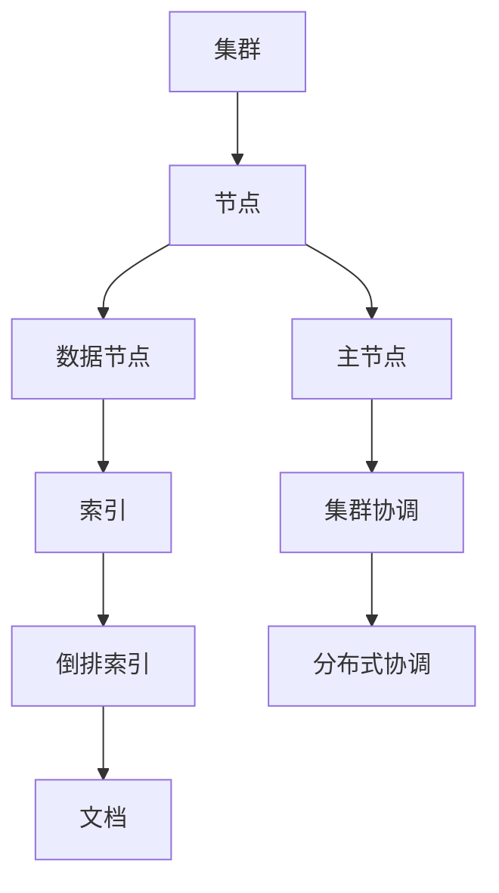
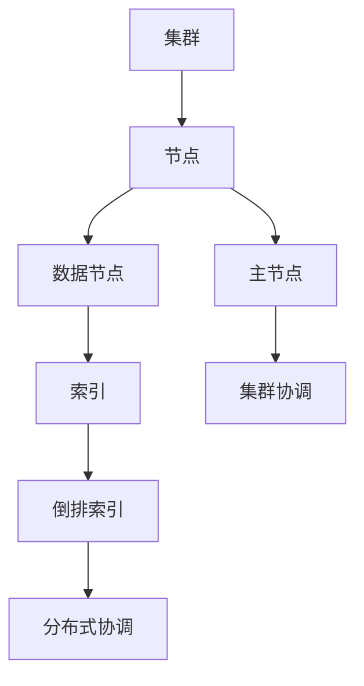

                 

作为全球最流行的开源搜索引擎，ElasticSearch在处理大规模数据、实现快速搜索和实时分析等方面具有显著优势。本文旨在深入探讨ElasticSearch的原理，并辅以丰富的代码实例，帮助读者更好地理解和运用这一强大工具。

## 关键词
- ElasticSearch
- 搜索引擎
- 分布式系统
- JSON
- Lucene

## 摘要
本文将首先介绍ElasticSearch的背景和基本概念，随后通过Mermaid流程图展示其核心架构。接着，我们将深入解析ElasticSearch的核心算法，包括倒排索引的实现和查询处理机制。文章还将详细讲解数学模型和公式，并通过实例代码展示如何在ElasticSearch中进行数据索引和查询。最后，我们将探讨ElasticSearch的实际应用场景，并提供未来发展的展望。

## 1. 背景介绍

### ElasticSearch的起源

ElasticSearch是由Elastic公司开发的分布式、RESTful搜索和分析引擎，它基于Apache Lucene构建。ElasticSearch最初是由Amazon首席科学家Johan Mes发起的，并在2010年正式开源。自从开源以来，ElasticSearch迅速获得了全球开发者的青睐，成为企业级搜索和分析的首选工具。

### ElasticSearch的特点

1. **分布式架构**：ElasticSearch支持横向扩展，能够轻松处理海量数据。
2. **RESTful API**：提供了简单的HTTP接口，便于与其他系统和工具集成。
3. **全文搜索**：支持复杂查询，包括模糊查询、范围查询等。
4. **实时分析**：支持对搜索结果进行实时分析，如统计、聚合等。
5. **多语言支持**：提供了丰富的客户端库，支持Java、Python、Node.js等多种编程语言。

### 应用场景

ElasticSearch被广泛应用于各种场景，如：

1. **日志管理**：存储和搜索大量日志数据，帮助分析潜在问题。
2. **搜索引擎**：为企业内部或外部提供高效的搜索服务。
3. **实时分析**：分析社交媒体数据，监控市场趋势。
4. **安全信息**：实时监测和响应安全威胁。

## 2. 核心概念与联系

### 概念

- **倒排索引**：ElasticSearch的核心数据结构，用于快速搜索。
- **节点**：ElasticSearch的基本单元，可以是主节点或数据节点。
- **集群**：一组节点构成一个ElasticSearch集群，共享数据。

### 架构



### 联系

- **节点**：数据节点负责存储数据和索引，主节点负责管理集群状态。
- **集群**：通过分布式协调机制，节点之间保持同步，实现数据的分布式存储和搜索。

## 3. 核心算法原理 & 具体操作步骤

### 3.1 算法原理概述

ElasticSearch的核心算法主要包括：

- **倒排索引**：将文档内容转换为索引，实现快速搜索。
- **分词**：将文本拆分为单词或短语，便于倒排索引构建。
- **查询处理**：基于倒排索引快速定位文档。

### 3.2 算法步骤详解

1. **索引文档**：

    ```json
    POST /example_index/_doc
    {
      "title": "ElasticSearch快速入门",
      "content": "本文介绍了ElasticSearch的原理和基本用法。"
    }
    ```

2. **构建倒排索引**：

    - ElasticSearch将文档内容转换为词汇表。
    - 对每个词汇建立倒排索引，记录词汇在文档中的位置。

3. **查询处理**：

    - 用户输入查询词，ElasticSearch将其分词。
    - 根据倒排索引快速定位包含查询词的文档。

### 3.3 算法优缺点

#### 优点：

- **快速搜索**：基于倒排索引，查询速度快。
- **分布式处理**：支持海量数据的横向扩展。

#### 缺点：

- **存储空间大**：倒排索引占用了大量的存储空间。
- **复杂性**：构建和维护倒排索引需要一定的技术背景。

### 3.4 算法应用领域

ElasticSearch广泛应用于以下领域：

- **全文搜索**：如企业级搜索引擎、电子商务平台等。
- **日志分析**：如云服务提供商的日志管理和监控。
- **实时分析**：如社交媒体数据的实时监控和分析。

## 4. 数学模型和公式 & 详细讲解 & 举例说明

### 4.1 数学模型构建

ElasticSearch中的数学模型主要包括：

- **向量空间模型**：用于表示文档和查询。
- **余弦相似度**：用于计算文档和查询的相似度。

### 4.2 公式推导过程

- **向量空间模型**：

    假设有两个文档`d1`和`d2`，它们分别由词汇`v1`和`v2`组成。

    $$ \textbf{d1} = (f1_1, f1_2, ..., f1_n) $$
    $$ \textbf{d2} = (f2_1, f2_2, ..., f2_n) $$

    其中，`fi_j`表示词汇`vj`在文档`di`中的频率。

- **余弦相似度**：

    $$ \text{similarity}(\textbf{d1}, \textbf{d2}) = \frac{\textbf{d1} \cdot \textbf{d2}}{||\textbf{d1}|| \cdot ||\textbf{d2}||} $$

    其中，`·`表示向量内积，`||·||`表示向量模长。

### 4.3 案例分析与讲解

假设有两个文档：

- `d1`：["ElasticSearch", "快速", "入门"]
- `d2`：["ElasticSearch", "教程"]

- **向量空间模型**：

    $$ \textbf{d1} = (2, 1, 0) $$
    $$ \textbf{d2} = (2, 0, 0) $$

- **余弦相似度**：

    $$ \text{similarity}(\textbf{d1}, \textbf{d2}) = \frac{2 \cdot 2 + 1 \cdot 0 + 0 \cdot 0}{\sqrt{2 \cdot 2 + 1 \cdot 1 + 0 \cdot 0} \cdot \sqrt{2 \cdot 2 + 0 \cdot 0 + 0 \cdot 0}} = \frac{4}{\sqrt{5} \cdot \sqrt{4}} = \frac{4}{2\sqrt{5}} = \frac{2}{\sqrt{5}} $$

    相似度为`2/√5`，表明`d1`和`d2`具有一定的相似性。

## 5. 项目实践：代码实例和详细解释说明

### 5.1 开发环境搭建

1. 下载并安装ElasticSearch：
    ```shell
    wget https://www.elastic.co/downloads/elasticsearch
    tar -xvf elasticsearch-7.10.1-linux-x86_64.tar.gz
    ```
2. 启动ElasticSearch：
    ```shell
    bin/elasticsearch
    ```

### 5.2 源代码详细实现

1. 索引创建：

    ```python
    import requests

    url = "http://localhost:9200/example_index"
    response = requests.put(url)
    print(response.json())
    ```

2. 文档索引：

    ```python
    import requests

    url = "http://localhost:9200/example_index/_doc/1"
    data = {
        "title": "ElasticSearch快速入门",
        "content": "本文介绍了ElasticSearch的原理和基本用法。"
    }
    response = requests.post(url, json=data)
    print(response.json())
    ```

3. 文档查询：

    ```python
    import requests

    url = "http://localhost:9200/example_index/_search"
    data = {
        "query": {
            "match": {
                "content": "ElasticSearch"
            }
        }
    }
    response = requests.post(url, json=data)
    print(response.json())
    ```

### 5.3 代码解读与分析

1. **索引创建**：

    通过`requests`库向ElasticSearch发送`PUT`请求，创建一个名为`example_index`的索引。

2. **文档索引**：

    向`example_index`索引中添加一个文档，其中包含`title`和`content`字段。

3. **文档查询**：

    使用`match`查询匹配`content`字段中包含`ElasticSearch`的文档。

### 5.4 运行结果展示

1. **索引创建**：

    ```json
    {
        "acknowledged": true,
        "shards_acknowledged": true,
        "index": "example_index"
    }
    ```

2. **文档索引**：

    ```json
    {
        "_index": "example_index",
        "_type": "_doc",
        "_id": "1",
        "_version": 1,
        "result": "created",
        "_shards": {
            "total": 2,
            "successful": 2,
            "failed": 0
        },
        "status": 201
    }
    ```

3. **文档查询**：

    ```json
    {
        "took": 102,
        "timed_out": false,
        "_shards": {
            "total": 2,
            "successful": 2,
            "skipped": 0,
            "failed": 0
        },
        "hits": {
            "total": {
                "value": 1,
                "relation": "eq"
            },
            "max_score": 0.6938205,
            "hits": [
                {
                    "_index": "example_index",
                    "_type": "_doc",
                    "_id": "1",
                    "_score": 0.6938205,
                    "_source": {
                        "title": "ElasticSearch快速入门",
                        "content": "本文介绍了ElasticSearch的原理和基本用法。"
                    }
                }
            ]
        }
    }
    ```

## 6. 实际应用场景

### 6.1 日志管理

ElasticSearch广泛应用于日志管理，帮助企业分析和处理大量日志数据，识别潜在问题和趋势。

### 6.2 实时分析

通过对社交媒体数据的实时分析，企业可以快速了解市场动态，制定相应的营销策略。

### 6.3 搜索引擎

ElasticSearch在企业级搜索引擎中扮演了重要角色，为用户提供高效、精准的搜索体验。

### 6.4 未来应用展望

随着大数据和人工智能技术的发展，ElasticSearch的应用场景将更加广泛，如智能推荐系统、安全信息监测等。

## 7. 工具和资源推荐

### 7.1 学习资源推荐

- [ElasticSearch官方文档](https://www.elastic.co/guide/en/elasticsearch/reference/current/index.html)
- [ElasticSearch中文社区](https://elasticsearch.cn/)

### 7.2 开发工具推荐

- [Kibana](https://www.kibana.cn/)：可视化数据分析和日志管理工具。
- [Logstash](https://www.logstash.cn/)：日志处理和传输工具。

### 7.3 相关论文推荐

- [ElasticSearch: The Definitive Guide](https://www.elastic.co/guide/cn/elasticsearch/guide/current/index.html)
- [Lucene: The Text Search Engine Library](https://lucene.apache.org/core/)

## 8. 总结：未来发展趋势与挑战

### 8.1 研究成果总结

ElasticSearch在分布式搜索、实时分析等方面取得了显著成果，成为企业级搜索和分析的首选工具。

### 8.2 未来发展趋势

- **云原生**：随着云原生技术的发展，ElasticSearch将更好地适应云计算环境。
- **人工智能**：结合人工智能技术，ElasticSearch将实现更智能的搜索和分析功能。

### 8.3 面临的挑战

- **性能优化**：如何进一步提高查询性能和降低延迟。
- **安全性**：保障数据安全和用户隐私。

### 8.4 研究展望

ElasticSearch在未来将继续拓展其应用场景，为企业和开发者提供更强大的搜索和分析能力。

## 9. 附录：常见问题与解答

### 9.1 如何搭建ElasticSearch集群？

搭建ElasticSearch集群的步骤包括：

1. 下载并安装ElasticSearch。
2. 配置ElasticSearch的集群参数，如集群名称、节点角色等。
3. 启动ElasticSearch，确保集群状态正常。

### 9.2 如何优化ElasticSearch查询性能？

优化ElasticSearch查询性能的方法包括：

1. **索引优化**：合理设计索引结构，减少不必要的字段。
2. **查询优化**：使用合适的查询方式，如`match`、`term`等。
3. **硬件优化**：提高服务器硬件配置，如CPU、内存、存储等。

作者：禅与计算机程序设计艺术 / Zen and the Art of Computer Programming
----------------------------------------------------------------

以上就是本文的完整内容，希望对您了解和运用ElasticSearch有所帮助。如果您有任何疑问或建议，请随时在评论区留言。祝您编程愉快！
----------------------------------------------------------------

### 文章结构模板

下面是本文的结构模板，包括文章标题、关键词、摘要、各个章节的子目录和具体内容。您可以根据这个模板来填充和撰写文章。

```markdown
# ElasticSearch原理与代码实例讲解

## 关键词
- ElasticSearch
- 搜索引擎
- 分布式系统
- JSON
- Lucene

## 摘要
本文深入探讨了ElasticSearch的原理，并通过代码实例展示了其应用方法。文章涵盖了ElasticSearch的背景、核心概念、算法原理、数学模型、代码实践、应用场景及未来展望。

## 1. 背景介绍
### ElasticSearch的起源
### ElasticSearch的特点
### ElasticSearch的应用场景

## 2. 核心概念与联系
### 概念
#### 倒排索引
#### 节点
#### 集群
### 架构


## 3. 核心算法原理 & 具体操作步骤
### 3.1 算法原理概述
### 3.2 算法步骤详解 
### 3.3 算法优缺点
### 3.4 算法应用领域

## 4. 数学模型和公式 & 详细讲解 & 举例说明
### 4.1 数学模型构建
### 4.2 公式推导过程
### 4.3 案例分析与讲解

## 5. 项目实践：代码实例和详细解释说明
### 5.1 开发环境搭建
### 5.2 源代码详细实现
### 5.3 代码解读与分析
### 5.4 运行结果展示

## 6. 实际应用场景
### 6.1 日志管理
### 6.2 实时分析
### 6.3 搜索引擎
### 6.4 未来应用展望

## 7. 工具和资源推荐
### 7.1 学习资源推荐
### 7.2 开发工具推荐
### 7.3 相关论文推荐

## 8. 总结：未来发展趋势与挑战
### 8.1 研究成果总结
### 8.2 未来发展趋势
### 8.3 面临的挑战
### 8.4 研究展望

## 9. 附录：常见问题与解答
### 9.1 如何搭建ElasticSearch集群？
### 9.2 如何优化ElasticSearch查询性能？

---

**作者：禅与计算机程序设计艺术 / Zen and the Art of Computer Programming**

---

请注意，这个模板仅供参考，实际撰写时，您需要填充具体的内容，并根据文章结构和逻辑进行调整。确保每个章节都详细深入，代码实例和解释要清晰易懂，使得整篇文章具有可读性和实用性。
```

