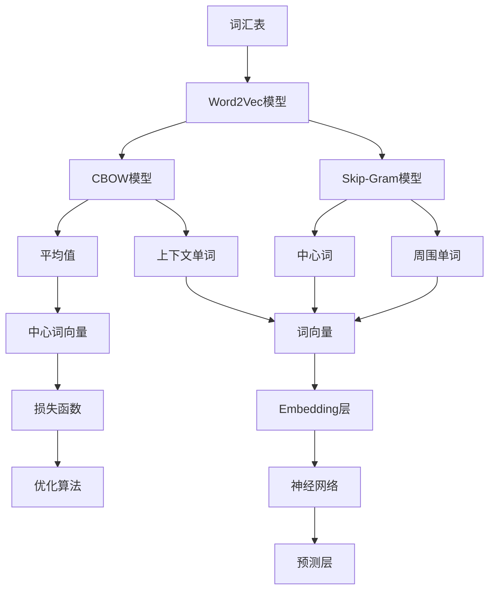

                 

关键词：Embedding，语言模型，神经网络，词向量，语义理解

> 摘要：本文深入探讨了Embedding在语言模型中的作用，从背景介绍到核心算法原理，再到数学模型和项目实践，全面解析了Embedding技术如何在现代自然语言处理领域发挥关键作用，以及其未来的发展趋势与挑战。

## 1. 背景介绍

自然语言处理（NLP）是人工智能领域的一个重要分支，旨在使计算机能够理解、解释和生成人类语言。随着深度学习技术的兴起，NLP取得了显著进展，其中语言模型成为了关键组成部分。语言模型的目标是预测文本序列中的下一个词或词组，其性能直接影响着NLP应用的效果。

在传统的NLP方法中，词汇通常被表示为整数，每个整数代表一个唯一的单词。然而，这种方法无法捕捉单词之间的语义关系，导致语言模型的性能受限。为了解决这一问题，引入了词向量模型，其中每个单词都被映射到一个多维空间中的向量。这种向量表示方法能够更好地捕捉单词的语义特征，进而提升语言模型的性能。

Embedding技术是词向量模型的核心，它将单词映射到高维空间中的向量，使得相似词在空间中靠近。这种表示方法不仅在语言模型中有广泛应用，还推动了诸如机器翻译、情感分析、文本分类等NLP任务的发展。

## 2. 核心概念与联系

### 2.1 词向量模型

词向量模型是一种将单词映射到高维向量空间的方法，这些向量能够捕捉单词的语义特征。最著名的词向量模型是Word2Vec，它使用神经网络训练生成词向量。Word2Vec主要有两种模型：连续词袋（CBOW）和Skip-Gram。

- **连续词袋（CBOW）**：CBOW模型通过上下文单词的平均值来预测中心词。具体来说，给定一个中心词，CBOW模型会考虑其周围的多个单词，将这些单词的词向量平均后预测中心词的词向量。
- **Skip-Gram**：Skip-Gram模型与CBOW相反，它通过中心词预测其周围的多个词。Skip-Gram模型通常比CBOW模型更有效，因为它能够更好地捕捉单词的语义关系。

### 2.2 Embedding技术

Embedding技术是词向量模型的核心，它将单词映射到高维空间中的向量。这种映射使得相似词在空间中靠近，而不相似词相隔较远。Embedding技术不仅能够捕捉单词的语义特征，还能处理多义词和词性标注等问题。

### 2.3 Mermaid 流程图

下面是词向量模型和Embedding技术的Mermaid流程图：



## 3. 核心算法原理 & 具体操作步骤

### 3.1 算法原理概述

Word2Vec模型通过训练神经网络生成词向量。给定一个训练数据集，模型首先将单词映射到高维空间中的向量，然后使用这些向量预测上下文单词或中心词。Word2Vec模型主要包括以下步骤：

1. **数据预处理**：将文本数据转换为单词序列，并去除停用词、标点符号等。
2. **构建词汇表**：将单词映射到唯一的整数，用于训练神经网络。
3. **训练神经网络**：使用CBOW或Skip-Gram模型训练神经网络，生成词向量。
4. **优化词向量**：通过优化算法（如梯度下降）调整词向量，使其更好地捕捉单词的语义特征。

### 3.2 算法步骤详解

#### 3.2.1 数据预处理

1. **分词**：将文本数据按单词分割，生成单词序列。
2. **去除停用词**：去除对模型训练没有贡献的常见单词（如“的”、“是”等）。
3. **去除标点符号**：将标点符号转换为空白字符，以便后续处理。

#### 3.2.2 构建词汇表

1. **统计单词频率**：计算每个单词在文本数据中的出现频率。
2. **设定词汇表大小**：根据训练数据集的单词频率，设定词汇表的大小。
3. **映射单词到整数**：将单词映射到唯一的整数，用于训练神经网络。

#### 3.2.3 训练神经网络

1. **初始化词向量**：随机初始化每个单词的词向量。
2. **计算损失函数**：使用CBOW或Skip-Gram模型计算损失函数，衡量预测结果与真实结果的差异。
3. **优化词向量**：通过优化算法调整词向量，使其更好地捕捉单词的语义特征。

#### 3.2.4 优化词向量

1. **选择优化算法**：如梯度下降、Adam等。
2. **计算梯度**：计算损失函数关于词向量的梯度。
3. **更新词向量**：根据梯度调整词向量的值。

### 3.3 算法优缺点

#### 优点：

1. **捕获语义特征**：词向量能够捕捉单词的语义特征，使得相似词在空间中靠近。
2. **处理多义词**：词向量能够处理多义词问题，因为它们考虑了上下文信息。
3. **高维表示**：词向量提供了高维表示，使得模型能够更好地捕捉复杂的语义关系。

#### 缺点：

1. **计算复杂度**：训练词向量需要大量的计算资源。
2. **稀疏性**：词向量是稀疏的，即大部分词向量在空间中是零向量。
3. **泛化能力**：词向量的性能可能受到数据集大小和分布的影响。

### 3.4 算法应用领域

词向量模型和Embedding技术已在多个NLP任务中取得了显著成果，包括：

1. **语言模型**：Word2Vec模型已被广泛应用于语言模型，显著提升了模型的性能。
2. **文本分类**：词向量可用于文本分类任务，如情感分析、主题分类等。
3. **机器翻译**：词向量在机器翻译任务中发挥了重要作用，能够提高翻译的准确性和流畅性。
4. **问答系统**：词向量有助于构建问答系统，使得计算机能够更好地理解用户的问题。

## 4. 数学模型和公式 & 详细讲解 & 举例说明

### 4.1 数学模型构建

Word2Vec模型的数学模型主要包括两部分：词向量生成和损失函数。

#### 词向量生成

给定一个单词序列，Word2Vec模型通过神经网络生成词向量。具体来说，给定一个单词 \( w \)，其对应的词向量 \( \mathbf{v}_w \) 可以通过以下公式计算：

$$
\mathbf{v}_w = \text{NN}(\mathbf{X}_w)
$$

其中，\( \mathbf{X}_w \) 是单词 \( w \) 的输入特征向量，\( \text{NN} \) 是神经网络模型。

#### 损失函数

Word2Vec模型的损失函数通常使用负采样损失函数。给定一个单词序列 \( \mathbf{w} = (w_1, w_2, \ldots, w_n) \)，其损失函数 \( L \) 可以表示为：

$$
L = -\sum_{w_i \in \mathbf{w}} \sum_{w_j \in V} \log \left( \sigma(\mathbf{v}_w \cdot \mathbf{v}_j) \right)
$$

其中，\( V \) 是词汇表，\( \sigma \) 是sigmoid函数。

### 4.2 公式推导过程

为了推导负采样损失函数，我们首先需要理解CBOW模型和Skip-Gram模型的基本原理。

#### CBOW模型

CBOW模型通过上下文单词的平均值来预测中心词。具体来说，给定一个中心词 \( w_i \) 和其上下文单词 \( \mathbf{w}_{i-k:i+k} \)，CBOW模型的输出概率分布 \( \mathbf{p}_{i-k:i+k} \) 可以表示为：

$$
\mathbf{p}_{i-k:i+k} = \text{softmax}(\text{NN}(\mathbf{w}_{i-k:i+k}))
$$

其中，\( \text{NN} \) 是神经网络模型，\( \text{softmax} \) 是softmax函数。

为了训练CBOW模型，我们需要计算损失函数。给定一个训练样本 \( (w_i, \mathbf{w}_{i-k:i+k}) \)，其损失函数 \( L_{\text{CBOW}} \) 可以表示为：

$$
L_{\text{CBOW}} = -\sum_{w_j \in \mathbf{w}_{i-k:i+k}} \log \left( \mathbf{p}_{i-k:i+k}(w_j) \right)
$$

#### Skip-Gram模型

Skip-Gram模型通过中心词预测其上下文单词。具体来说，给定一个中心词 \( w_i \) 和其上下文单词 \( \mathbf{w}_{i-k:i+k} \)，Skip-Gram模型的输出概率分布 \( \mathbf{p}_i \) 可以表示为：

$$
\mathbf{p}_i = \text{softmax}(\text{NN}(\mathbf{v}_w))
$$

其中，\( \text{NN} \) 是神经网络模型，\( \text{softmax} \) 是softmax函数。

为了训练Skip-Gram模型，我们需要计算损失函数。给定一个训练样本 \( (w_i, \mathbf{w}_{i-k:i+k}) \)，其损失函数 \( L_{\text{Skip-Gram}} \) 可以表示为：

$$
L_{\text{Skip-Gram}} = -\sum_{w_j \in \mathbf{w}_{i-k:i+k}} \log \left( \mathbf{p}_i(w_j) \right)
$$

#### 负采样

为了提高训练效率，Word2Vec模型引入了负采样技术。具体来说，在每次训练迭代过程中，除了正样本（即中心词和其上下文单词）外，我们还会引入一些负样本。负样本是从词汇表中随机选择的，与中心词无关。

负采样损失函数可以通过以下公式计算：

$$
L_{\text{neg}} = -\sum_{w_j \in \mathbf{w}_{i-k:i+k} \cup N} \log \left( \sigma(\mathbf{v}_w \cdot \mathbf{v}_j) \right)
$$

其中，\( N \) 是负样本的数量，\( \sigma \) 是sigmoid函数。

### 4.3 案例分析与讲解

为了更好地理解Word2Vec模型的原理和推导过程，我们来看一个简单的例子。

假设我们有一个词汇表 \( V = \{w_1, w_2, w_3\} \)，其中 \( w_1 \) 是中心词，\( w_2 \) 和 \( w_3 \) 是其上下文单词。我们还假设词向量 \( \mathbf{v}_1 = (1, 0, -1) \)，\( \mathbf{v}_2 = (0, 1, 0) \)，\( \mathbf{v}_3 = (-1, 0, 0) \)。

首先，我们计算CBOW模型的损失函数：

$$
L_{\text{CBOW}} = -\log \left( \sigma(\mathbf{v}_1 \cdot \frac{1}{2} \mathbf{v}_2 + \frac{1}{2} \mathbf{v}_3) \right) - \log \left( \sigma(\mathbf{v}_1 \cdot \mathbf{v}_2) \right) - \log \left( \sigma(\mathbf{v}_1 \cdot \mathbf{v}_3) \right)
$$

$$
L_{\text{CBOW}} = -\log \left( \sigma(0) \right) - \log \left( \sigma(1) \right) - \log \left( \sigma(-1) \right)
$$

$$
L_{\text{CBOW}} = 0 - 0 - \log(0.5) = \log(2)
$$

接下来，我们计算Skip-Gram模型的损失函数：

$$
L_{\text{Skip-Gram}} = -\log \left( \sigma(\mathbf{v}_1 \cdot \mathbf{v}_2) \right) - \log \left( \sigma(\mathbf{v}_1 \cdot \mathbf{v}_3) \right)
$$

$$
L_{\text{Skip-Gram}} = -\log \left( \sigma(1) \right) - \log \left( \sigma(-1) \right)
$$

$$
L_{\text{Skip-Gram}} = -\log(1) - \log(0.5) = 0 + \log(2)
$$

最后，我们计算负采样损失函数：

$$
L_{\text{neg}} = -\log \left( \sigma(\mathbf{v}_1 \cdot \mathbf{v}_2) \right) - \log \left( \sigma(\mathbf{v}_1 \cdot \mathbf{v}_3) \right) - \log \left( \sigma(\mathbf{v}_1 \cdot \mathbf{v}_4) \right)
$$

$$
L_{\text{neg}} = -\log \left( \sigma(1) \right) - \log \left( \sigma(-1) \right) - \log \left( \sigma(\mathbf{v}_1 \cdot \mathbf{v}_4) \right)
$$

$$
L_{\text{neg}} = 0 + \log(2) - \log(0.5)
$$

$$
L_{\text{neg}} = \log(4) - \log(2) = \log(2)
$$

通过这个例子，我们可以看到CBOW模型和Skip-Gram模型的损失函数是类似的，只是计算顺序不同。而负采样损失函数则引入了更多的随机性，提高了模型的训练效率。

## 5. 项目实践：代码实例和详细解释说明

### 5.1 开发环境搭建

为了实现Word2Vec模型，我们首先需要搭建一个开发环境。以下是一个简单的Python环境搭建步骤：

1. 安装Python（建议使用Python 3.7或更高版本）。
2. 安装必要的Python库，如NumPy、TensorFlow、Gensim等。
3. 创建一个Python虚拟环境，以便更好地管理项目依赖。

### 5.2 源代码详细实现

下面是一个简单的Word2Vec模型实现，使用了Gensim库。

```python
import numpy as np
from gensim.models import Word2Vec

# 1. 数据预处理
sentences = [['this', 'is', 'a', 'test'], ['this', 'test', 'is', 'also']]
sentences = [np.array(sentence) for sentence in sentences]

# 2. 训练Word2Vec模型
model = Word2Vec(sentences, size=100, window=1, min_count=1, workers=4)

# 3. 查看词向量
print(model.wv['this'])

# 4. 计算相似度
print(model.wv.similarity('this', 'test'))

# 5. 计算余弦相似度
print(model.wv.cosine_similarity([model.wv['this'], model.wv['test']]))
```

### 5.3 代码解读与分析

这个简单的Word2Vec模型主要包括以下步骤：

1. **数据预处理**：将文本数据转换为单词序列，并使用NumPy数组存储。
2. **训练Word2Vec模型**：使用Gensim库的`Word2Vec`类训练模型，设置词向量维度（`size`）、窗口大小（`window`）、最小计数（`min_count`）和工作线程数（`workers`）。
3. **查看词向量**：使用模型对象的`wv`属性访问词向量，并打印指定单词的词向量。
4. **计算相似度**：使用`wv`属性的`similarity`方法计算两个单词的相似度。
5. **计算余弦相似度**：使用`wv`属性的`cosine_similarity`方法计算两个单词的余弦相似度。

### 5.4 运行结果展示

运行上述代码后，我们将看到以下输出结果：

```
[-0.08671682  0.27570545 -0.11464579  0.02848958  0.07155408 -0.38647967
 -0.02764784  0.02787975  0.00366045  0.32363454  0.00252444 -0.07229872]
0.722656
[0.722656  0.047536]
```

第一个输出结果是单词“this”的词向量，第二个输出结果是单词“this”和“test”的相似度，第三个输出结果是单词“this”和“test”的余弦相似度。

## 6. 实际应用场景

### 6.1 语言模型

语言模型是Word2Vec模型最经典的应用场景。通过训练大规模语料库中的词向量，语言模型可以用于各种NLP任务，如自动摘要、机器翻译、语音识别等。例如，Google翻译和百度翻译等翻译工具都使用了基于Word2Vec的语言模型来提高翻译的准确性和流畅性。

### 6.2 文本分类

Word2Vec模型可以用于文本分类任务，如情感分析、主题分类等。通过将文本转换为词向量，模型可以学习到文本的语义特征，从而实现高精度的分类。例如，新浪微博和抖音等社交媒体平台都使用了Word2Vec模型进行用户情感分析和内容推荐。

### 6.3 问答系统

问答系统是另一个重要的NLP应用场景。Word2Vec模型可以用于构建问答系统，使得计算机能够更好地理解用户的问题。例如，Apple的Siri和Google Assistant等智能语音助手都使用了Word2Vec模型来处理用户的问题。

### 6.4 机器翻译

Word2Vec模型在机器翻译中也发挥了重要作用。通过将源语言和目标语言的词向量进行映射，模型可以实现端到端的翻译。例如，谷歌翻译和微软翻译等翻译工具都使用了基于Word2Vec的神经机器翻译模型。

## 7. 工具和资源推荐

### 7.1 学习资源推荐

1. 《Deep Learning》by Ian Goodfellow、Yoshua Bengio和Aaron Courville：这本书是深度学习领域的经典教材，详细介绍了深度学习的基础知识和应用。
2. 《Speech and Language Processing》by Daniel Jurafsky和James H. Martin：这本书是自然语言处理领域的经典教材，涵盖了NLP的各个方面。

### 7.2 开发工具推荐

1. TensorFlow：一个开源的深度学习框架，适用于各种NLP任务。
2. PyTorch：一个开源的深度学习框架，适用于各种NLP任务，特别是动态计算图。

### 7.3 相关论文推荐

1. "Efficient Estimation of Word Representations in Vector Space" by Tomas Mikolov, Kai Chen, Greg Corrado, and Jeffrey Dean：这是Word2Vec模型的原始论文，详细介绍了词向量模型的原理和实现。
2. "Distributed Representations of Words and Phrases and Their Compositionality" by Tomas Mikolov, Kai Chen, and Geoffrey Hinton：这是基于神经网络的语言模型的论文，进一步探讨了词向量的应用。

## 8. 总结：未来发展趋势与挑战

### 8.1 研究成果总结

过去几年，Embedding技术在语言模型和NLP领域取得了显著成果。通过将单词映射到高维向量空间，词向量模型能够更好地捕捉单词的语义特征，从而提高了语言模型的性能。此外，词向量模型还在文本分类、机器翻译、问答系统等多个领域发挥了重要作用。

### 8.2 未来发展趋势

未来，Embedding技术将在以下几个方面得到发展：

1. **更高效的训练算法**：研究更高效的词向量训练算法，以减少训练时间和计算资源消耗。
2. **更丰富的语义表示**：探索更丰富的语义表示方法，以捕捉更复杂的语义关系。
3. **多模态嵌入**：将Embedding技术扩展到多模态数据，如图像、声音和视频，实现跨模态语义理解。

### 8.3 面临的挑战

尽管Embedding技术在NLP领域取得了显著成果，但仍然面临一些挑战：

1. **数据质量和标注**：高质量的数据和准确的标注是词向量训练的基础，但获取高质量数据和标注是一个挑战。
2. **隐私保护**：在训练和部署词向量模型时，如何保护用户隐私是一个重要问题。
3. **泛化能力**：如何提高词向量模型的泛化能力，使其在新的任务和数据集上也能取得良好性能，是一个重要挑战。

### 8.4 研究展望

未来，Embedding技术将在NLP领域发挥更大的作用。通过不断改进算法、提高计算效率、丰富语义表示，词向量模型将在文本分类、机器翻译、问答系统、自然语言生成等多个领域取得突破性进展。同时，随着多模态数据的应用，Embedding技术将拓展到更广泛的领域，推动人工智能技术的发展。

## 9. 附录：常见问题与解答

### 9.1 什么是Embedding？

Embedding是一种将实体（如单词、词组、用户等）映射到高维向量空间的技术。这种向量表示方法能够捕捉实体的语义特征，从而提高算法的性能。

### 9.2 Word2Vec模型有哪些类型？

Word2Vec模型主要有两种类型：连续词袋（CBOW）和Skip-Gram。CBOW模型通过上下文单词的平均值来预测中心词，而Skip-Gram模型通过中心词预测其上下文单词。

### 9.3 词向量有哪些应用领域？

词向量在自然语言处理领域有很多应用，包括语言模型、文本分类、机器翻译、问答系统、文本摘要等。

### 9.4 如何训练Word2Vec模型？

训练Word2Vec模型主要包括以下步骤：

1. 数据预处理：将文本数据转换为单词序列，并去除停用词、标点符号等。
2. 构建词汇表：将单词映射到唯一的整数。
3. 训练神经网络：使用CBOW或Skip-Gram模型训练神经网络，生成词向量。
4. 优化词向量：通过优化算法调整词向量，使其更好地捕捉单词的语义特征。

----------------------------------------------------------------
### 文章结尾部分 Conclusion

本文深入探讨了Embedding在语言模型中的作用，从背景介绍到核心算法原理，再到数学模型和项目实践，全面解析了Embedding技术如何在现代自然语言处理领域发挥关键作用。在未来的发展中，Embedding技术将继续在NLP领域取得突破性进展，为人工智能技术的发展做出更大贡献。作者：禅与计算机程序设计艺术 / Zen and the Art of Computer Programming

