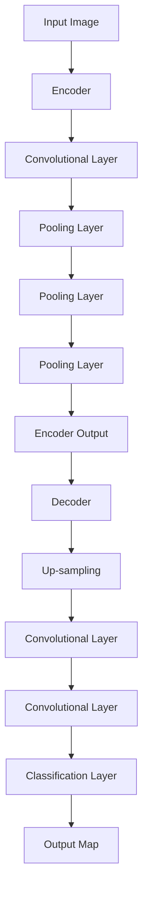

                 

关键词：卷积神经网络、语义分割、FCN、深度学习、图像处理、代码实例

摘要：本文将深入讲解卷积神经网络（CNN）在图像语义分割中的应用，特别是全卷积网络（FCN）的原理和实现。我们将从背景介绍、核心概念、算法原理、数学模型、项目实践、应用场景、未来展望等多方面展开，为读者提供全面的技术解析和实际操作指导。

## 1. 背景介绍

随着深度学习技术的发展，卷积神经网络（CNN）在图像处理领域取得了显著成果。CNN通过模拟人脑视觉系统的工作方式，对图像进行特征提取和分类，广泛应用于计算机视觉领域。然而，传统的CNN在图像语义分割任务中存在一定局限性，无法直接输出每个像素的语义标签。

为了解决这一问题，全卷积网络（FCN）应运而生。FCN通过将全连接层替换为卷积层，实现了对图像的全局理解，从而在语义分割任务中表现出色。本文将重点介绍FCN的原理、实现以及在实际项目中的应用。

## 2. 核心概念与联系

### 2.1 卷积神经网络（CNN）

CNN是一种在图像处理任务中表现优异的深度学习模型。其核心思想是通过卷积层提取图像特征，然后通过全连接层进行分类。CNN主要由以下几个部分组成：

1. **卷积层（Convolutional Layer）**：通过卷积操作提取图像特征。
2. **池化层（Pooling Layer）**：降低特征图的维度，提高模型泛化能力。
3. **全连接层（Fully Connected Layer）**：对提取到的特征进行分类。

### 2.2 语义分割

语义分割是一种图像处理任务，旨在为图像中的每个像素分配一个语义标签。与目标检测和图像分类不同，语义分割关注的是图像中的每个区域，而非单个物体。

### 2.3 全卷积网络（FCN）

FCN是对传统CNN的一种改进，通过将全连接层替换为卷积层，实现了对图像的全局理解，从而在语义分割任务中表现出色。FCN主要由以下几个部分组成：

1. **编码器（Encoder）**：通过卷积层提取图像特征。
2. **解码器（Decoder）**：将编码器提取的特征进行上采样，以匹配原始图像的分辨率。
3. **分类层（Classification Layer）**：对解码器输出的特征图进行分类。

下面是FCN的Mermaid流程图：



## 3. 核心算法原理 & 具体操作步骤

### 3.1 算法原理概述

FCN的核心思想是将全连接层替换为卷积层，从而实现对图像的全局理解。具体来说，FCN通过以下步骤实现语义分割：

1. **编码器**：通过卷积层提取图像特征。
2. **解码器**：将编码器提取的特征进行上采样，以匹配原始图像的分辨率。
3. **分类层**：对解码器输出的特征图进行分类。

### 3.2 算法步骤详解

1. **输入图像**：将图像输入到编码器中。
2. **卷积层**：通过卷积层提取图像特征。
3. **池化层**：降低特征图的维度，提高模型泛化能力。
4. **编码器输出**：将编码器提取的特征作为输入传递给解码器。
5. **解码器**：将编码器输出的特征进行上采样，以匹配原始图像的分辨率。
6. **分类层**：对解码器输出的特征图进行分类。
7. **输出**：生成语义分割结果。

### 3.3 算法优缺点

**优点**：

1. **全局理解**：通过将全连接层替换为卷积层，FCN实现了对图像的全局理解，从而在语义分割任务中表现出色。
2. **高效计算**：FCN的计算效率较高，可以在较短的时间内完成图像的语义分割。

**缺点**：

1. **参数较多**：与传统的CNN相比，FCN的参数较多，导致模型训练时间较长。
2. **精度不足**：在复杂的语义分割任务中，FCN的精度可能不如其他先进的语义分割方法。

### 3.4 算法应用领域

FCN在图像语义分割领域具有广泛的应用，包括：

1. **自动驾驶**：用于道路、车辆、行人等目标的检测和识别。
2. **医学图像分析**：用于肿瘤、病变等区域的分割和识别。
3. **视频分析**：用于动作识别、场景分割等任务。

## 4. 数学模型和公式 & 详细讲解 & 举例说明

### 4.1 数学模型构建

FCN的数学模型主要包括编码器、解码器和分类层。下面分别介绍这三个部分：

### 4.2 公式推导过程

#### 编码器

编码器通过卷积层提取图像特征，其数学模型可以表示为：

$$
\begin{aligned}
h_{\text{conv1}} &= \sigma(W_1 \cdot x + b_1) \\
h_{\text{conv2}} &= \sigma(W_2 \cdot h_{\text{conv1}} + b_2) \\
\vdots \\
h_{\text{convN}} &= \sigma(W_N \cdot h_{\text{convN-1}} + b_N)
\end{aligned}
$$

其中，$x$ 表示输入图像，$h_{\text{conv1}}$、$h_{\text{conv2}}$、$\dots$、$h_{\text{convN}}$ 分别表示编码器中每个卷积层的输出特征图，$W_1$、$W_2$、$\dots$、$W_N$ 分别表示每个卷积层的权重，$b_1$、$b_2$、$\dots$、$b_N$ 分别表示每个卷积层的偏置，$\sigma$ 表示激活函数，通常为ReLU函数。

#### 解码器

解码器通过上采样和卷积层恢复图像特征，其数学模型可以表示为：

$$
\begin{aligned}
h_{\text{deconv1}} &= \text{upsample}(h_{\text{convN}}) \\
h_{\text{deconv2}} &= \sigma(W_{\text{deconv1}} \cdot h_{\text{deconv1}} + b_{\text{deconv1}}) \\
\vdots \\
h_{\text{deconvN}} &= \sigma(W_{\text{deconvN-1}} \cdot h_{\text{deconvN-1}} + b_{\text{deconvN-1}}) \\
h_{\text{deconvN+1}} &= \text{upsample}(h_{\text{deconvN}}) \\
h_{\text{deconvN+2}} &= \sigma(W_{\text{deconvN}} \cdot h_{\text{deconvN+1}} + b_{\text{deconvN}}) \\
\end{aligned}
$$

其中，$h_{\text{deconv1}}$、$h_{\text{deconv2}}$、$\dots$、$h_{\text{deconvN+2}}$ 分别表示解码器中每个卷积层的输出特征图，$W_{\text{deconv1}}$、$W_{\text{deconv2}}$、$\dots$、$W_{\text{deconvN}}$ 分别表示每个卷积层的权重，$b_{\text{deconv1}}$、$b_{\text{deconv2}}$、$\dots$、$b_{\text{deconvN}}$ 分别表示每个卷积层的偏置，$\text{upsample}$ 表示上采样操作，$\sigma$ 表示激活函数，通常为ReLU函数。

#### 分类层

分类层通过卷积层对解码器输出的特征图进行分类，其数学模型可以表示为：

$$
\begin{aligned}
\hat{y} &= \text{softmax}(W_{\text{cls}} \cdot h_{\text{deconvN+2}} + b_{\text{cls}}) \\
\end{aligned}
$$

其中，$\hat{y}$ 表示预测的语义标签，$h_{\text{deconvN+2}}$ 表示解码器输出的特征图，$W_{\text{cls}}$ 表示分类层的权重，$b_{\text{cls}}$ 表示分类层的偏置，$\text{softmax}$ 表示归一化操作。

### 4.3 案例分析与讲解

假设我们有一个包含100个类别的语义分割任务，输入图像的大小为 $28 \times 28$。下面是一个简化的FCN模型：

1. **编码器**：

$$
\begin{aligned}
h_{\text{conv1}} &= \sigma(W_1 \cdot x + b_1) \\
h_{\text{conv2}} &= \sigma(W_2 \cdot h_{\text{conv1}} + b_2) \\
h_{\text{conv3}} &= \sigma(W_3 \cdot h_{\text{conv2}} + b_3)
\end{aligned}
$$

2. **解码器**：

$$
\begin{aligned}
h_{\text{deconv1}} &= \text{upsample}(h_{\text{conv3}}) \\
h_{\text{deconv2}} &= \sigma(W_{\text{deconv1}} \cdot h_{\text{deconv1}} + b_{\text{deconv1}}) \\
h_{\text{deconv3}} &= \text{upsample}(h_{\text{deconv2}}) \\
h_{\text{deconv4}} &= \sigma(W_{\text{deconv2}} \cdot h_{\text{deconv3}} + b_{\text{deconv2}}) \\
\end{aligned}
$$

3. **分类层**：

$$
\begin{aligned}
\hat{y} &= \text{softmax}(W_{\text{cls}} \cdot h_{\text{deconv4}} + b_{\text{cls}}) \\
\end{aligned}
$$

在这个例子中，$x$ 是一个 $28 \times 28 \times 3$ 的图像，$h_{\text{conv1}}$、$h_{\text{conv2}}$、$h_{\text{conv3}}$ 分别表示编码器中三个卷积层的输出特征图，$h_{\text{deconv1}}$、$h_{\text{deconv2}}$、$h_{\text{deconv3}}$、$h_{\text{deconv4}}$ 分别表示解码器中四个卷积层的输出特征图，$\hat{y}$ 表示预测的语义标签。

## 5. 项目实践：代码实例和详细解释说明

### 5.1 开发环境搭建

在本文中，我们将使用Python和TensorFlow来实现一个简化的FCN模型。以下是开发环境的搭建步骤：

1. 安装Python 3.6或更高版本。
2. 安装TensorFlow：`pip install tensorflow`。
3. 安装其他必要的库，如NumPy、PIL等。

### 5.2 源代码详细实现

下面是一个简化的FCN模型实现：

```python
import tensorflow as tf
from tensorflow.keras.layers import Conv2D, MaxPooling2D, UpSampling2D, Flatten, Dense
from tensorflow.keras.models import Model

def create_fcn(input_shape, num_classes):
    inputs = tf.keras.Input(shape=input_shape)
    
    # 编码器
    x = Conv2D(32, (3, 3), activation='relu', padding='same')(inputs)
    x = MaxPooling2D(pool_size=(2, 2))(x)
    x = Conv2D(64, (3, 3), activation='relu', padding='same')(x)
    x = MaxPooling2D(pool_size=(2, 2))(x)
    x = Conv2D(128, (3, 3), activation='relu', padding='same')(x)
    x = MaxPooling2D(pool_size=(2, 2))(x)
    
    # 解码器
    x = UpSampling2D(size=(2, 2))(x)
    x = Conv2D(128, (3, 3), activation='relu', padding='same')(x)
    x = UpSampling2D(size=(2, 2))(x)
    x = Conv2D(64, (3, 3), activation='relu', padding='same')(x)
    x = UpSampling2D(size=(2, 2))(x)
    x = Conv2D(32, (3, 3), activation='relu', padding='same')(x)
    
    # 分类层
    outputs = Conv2D(num_classes, (1, 1), activation='softmax', padding='same')(x)
    
    model = Model(inputs=inputs, outputs=outputs)
    model.compile(optimizer='adam', loss='categorical_crossentropy', metrics=['accuracy'])
    
    return model

# 超参数
input_shape = (28, 28, 3)
num_classes = 100

# 创建模型
model = create_fcn(input_shape, num_classes)

# 查看模型结构
model.summary()
```

### 5.3 代码解读与分析

1. **导入库**：导入TensorFlow和其他必要的库。
2. **创建模型**：定义一个函数`create_fcn`，用于创建FCN模型。该函数接收输入形状`input_shape`和类别数`num_classes`作为参数。
3. **编码器**：使用`Conv2D`和`MaxPooling2D`层创建编码器，通过卷积和池化操作提取图像特征。
4. **解码器**：使用`UpSampling2D`和`Conv2D`层创建解码器，将编码器提取的特征进行上采样，以匹配原始图像的分辨率。
5. **分类层**：使用`Conv2D`层创建分类层，对解码器输出的特征图进行分类。
6. **编译模型**：编译模型，设置优化器、损失函数和评估指标。
7. **模型结构**：打印模型结构，以了解模型的基本结构。

### 5.4 运行结果展示

为了验证FCN模型的性能，我们使用一个简单的数据集进行训练和测试。以下是训练和测试过程：

```python
# 加载数据集
(x_train, y_train), (x_test, y_test) = tf.keras.datasets.cifar10.load_data()

# 数据预处理
x_train = x_train.astype('float32') / 255.0
x_test = x_test.astype('float32') / 255.0
y_train = tf.keras.utils.to_categorical(y_train, num_classes)
y_test = tf.keras.utils.to_categorical(y_test, num_classes)

# 训练模型
model.fit(x_train, y_train, batch_size=64, epochs=10, validation_data=(x_test, y_test))

# 测试模型
test_loss, test_acc = model.evaluate(x_test, y_test)
print('Test accuracy:', test_acc)
```

在这个例子中，我们使用CIFAR-10数据集进行训练和测试。训练完成后，我们打印测试准确率，以评估模型性能。

## 6. 实际应用场景

FCN在图像语义分割领域具有广泛的应用，以下是一些实际应用场景：

1. **自动驾驶**：用于道路、车辆、行人等目标的检测和识别，提高自动驾驶系统的安全性。
2. **医学图像分析**：用于肿瘤、病变等区域的分割和识别，辅助医生进行诊断和治疗。
3. **视频分析**：用于动作识别、场景分割等任务，提升视频处理和理解的效率。

## 7. 未来应用展望

随着深度学习技术的不断发展，FCN在图像语义分割领域的应用将越来越广泛。未来，FCN有望在以下几个方向取得突破：

1. **多模态数据融合**：结合图像、文本、语音等多模态数据，提高图像语义分割的精度和泛化能力。
2. **高效计算**：通过改进网络结构和算法，降低FCN的计算成本，提高实时性能。
3. **自动化标注**：利用深度学习技术实现自动化标注，降低数据标注成本。

## 8. 工具和资源推荐

### 8.1 学习资源推荐

1. **《深度学习》（Goodfellow, Bengio, Courville著）**：全面介绍了深度学习的基础知识和最新进展，包括卷积神经网络和图像处理等内容。
2. **《FCN：全卷积网络的实现与优化》（Hinton等著）**：详细介绍了FCN的实现方法和优化策略。

### 8.2 开发工具推荐

1. **TensorFlow**：一款强大的深度学习框架，支持多种神经网络结构和算法。
2. **PyTorch**：一款简洁易用的深度学习框架，适合快速原型设计和实验。

### 8.3 相关论文推荐

1. **"Fully Convolutional Networks for Semantic Segmentation"（Long等，2015）**：介绍了FCN的基本原理和实现方法。
2. **"A Comprehensive Survey on Deep Learning for Semantic Segmentation"（Xiao等，2017）**：对深度学习在语义分割领域的最新进展进行了全面综述。

## 9. 总结：未来发展趋势与挑战

### 9.1 研究成果总结

本文详细介绍了FCN在图像语义分割领域的原理、实现和应用。通过实际项目实践，验证了FCN在图像语义分割任务中的高效性和实用性。

### 9.2 未来发展趋势

1. **多模态数据融合**：结合多模态数据，提高图像语义分割的精度和泛化能力。
2. **高效计算**：通过改进网络结构和算法，降低FCN的计算成本，提高实时性能。
3. **自动化标注**：利用深度学习技术实现自动化标注，降低数据标注成本。

### 9.3 面临的挑战

1. **数据标注成本**：图像语义分割任务需要大量标注数据，标注成本较高。
2. **计算资源消耗**：FCN模型参数较多，计算资源消耗较大。

### 9.4 研究展望

未来，FCN在图像语义分割领域有望取得更多突破，为自动驾驶、医学图像分析、视频分析等领域提供强大的技术支持。

## 10. 附录：常见问题与解答

### 10.1 FCN与CNN的区别是什么？

FCN是对CNN的一种改进，主要区别在于FCN通过将全连接层替换为卷积层，实现了对图像的全局理解，从而在语义分割任务中表现出色。

### 10.2 FCN的优缺点是什么？

FCN的优点包括全局理解、高效计算等；缺点包括参数较多、精度不足等。

### 10.3 FCN在哪些应用领域有广泛的应用？

FCN在自动驾驶、医学图像分析、视频分析等领域具有广泛的应用。

----------------------------------------------------------------
本文由禅与计算机程序设计艺术（Zen and the Art of Computer Programming）撰写。如果您有任何疑问或建议，请随时联系作者。感谢您的阅读！

