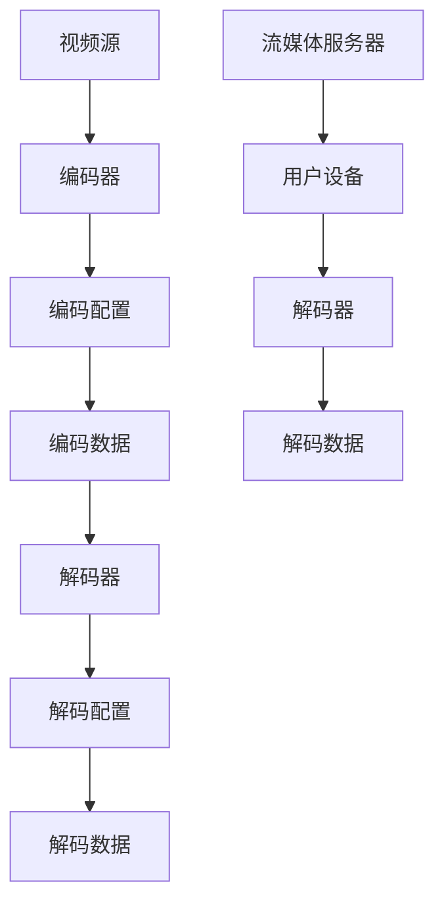

                 

关键词：FFmpeg、虚拟现实（VR）、编码、流媒体、视频处理、性能优化、算法应用、开发实践

## 摘要

随着虚拟现实（VR）技术的迅猛发展，高效的视频编码和流媒体技术成为了实现高质量VR体验的关键因素。本文将探讨FFmpeg这一强大的多媒体处理工具在VR领域的应用，重点介绍其在视频编码和流媒体传输方面的功能，并通过具体案例展示其性能和优化的方法。同时，本文还将讨论VR应用场景下所面临的挑战及未来的发展趋势。

## 1. 背景介绍

### 1.1 FFmpeg 简介

FFmpeg 是一个开源的多媒体处理框架，广泛应用于视频、音频和流的编码、解码、编辑、流式传输等各个方面。它支持多种常见的多媒体格式，提供了丰富的API供开发者使用。FFmpeg 的核心组件包括：

- **libavcodec**：提供多种视频和音频编码解码器。
- **libavformat**：支持多种视频和音频文件格式。
- **libavutil**：提供通用工具函数，如时间戳处理、内存分配等。
- **libswscale**：提供视频缩放和色彩转换功能。
- **libswresample**：提供音频采样率转换功能。

### 1.2 VR 简介

虚拟现实（VR）是一种通过计算机技术创造的模拟环境，用户可以通过头戴显示器（HMD）等设备沉浸其中，获得身临其境的体验。VR技术涉及多个领域，包括计算机图形学、人机交互、传感器技术等。随着硬件性能的提升和内容创作的丰富，VR正逐渐走进大众视野，应用于游戏、教育、医疗、军事等多个领域。

## 2. 核心概念与联系

### 2.1 视频编码

视频编码是将视频信号转换为一种更高效的数据表示形式的过程，以便于存储和传输。FFmpeg 支持多种视频编码标准，如H.264、H.265、HEVC等，这些编码标准在VR应用中具有重要作用。

### 2.2 流媒体传输

流媒体传输是将视频内容按需传输给用户，用户可以在播放过程中实时观看，而无需下载整个视频文件。FFmpeg 提供了libavformat和libavcodec组件，可以方便地实现视频流媒体的编码、解码和传输。

### 2.3 Mermaid 流程图



## 3. 核心算法原理 & 具体操作步骤

### 3.1 算法原理概述

视频编码的核心在于如何高效地压缩视频数据，同时保证视频质量。FFmpeg 采用了一系列算法，如变换编码、量化、熵编码等，来实现这一目标。

### 3.2 算法步骤详解

1. **采样与量化**：视频源首先进行采样，将连续的视频信号转换为离散的像素点。然后，通过量化将像素点转换为有限位数的数值。

2. **变换编码**：使用离散余弦变换（DCT）或离散小波变换（DWT）将像素点转换为频率域表示，以提取视频信号的主要特征。

3. **量化**：根据编码器的配置对变换系数进行量化，降低数据的精度，从而实现数据压缩。

4. **熵编码**：使用熵编码技术（如霍夫曼编码、算术编码）对量化后的数据进一步压缩。

5. **解码**：解码过程与编码过程相反，通过熵解码、反量化、反变换等步骤恢复原始视频信号。

### 3.3 算法优缺点

**优点**：

- 高效压缩：视频编码可以显著减小视频文件的大小，降低存储和传输成本。
- 高质量：现代编码标准提供了高质量的视频效果，同时保持较低的数据率。

**缺点**：

- 复杂性：视频编码和解码过程涉及多种算法和技术，实现较为复杂。
- 实时性要求：在流媒体传输中，编码和解码过程需要满足实时性要求，这对硬件性能有较高要求。

### 3.4 算法应用领域

视频编码技术广泛应用于VR、高清视频、网络直播、视频会议等多个领域。在VR应用中，高效的编码和流媒体传输技术是实现高质量VR体验的关键。

## 4. 数学模型和公式 & 详细讲解 & 举例说明

### 4.1 数学模型构建

视频编码中的数学模型主要包括：

- **采样公式**：
  $$x(n) = \sum_{k=-\infty}^{\infty} x(k) \cdot w(n-k)$$
  
- **变换公式**：
  $$T(x)(k) = \sum_{n=-\infty}^{\infty} x(n) \cdot \cos\left(2\pi k n/N\right)$$

- **量化公式**：
  $$Q(x) = \text{round}\left(\frac{x}{\text{quant_scale}}\right) \cdot \text{quant_scale}$$

### 4.2 公式推导过程

以离散余弦变换（DCT）为例，其推导过程如下：

1. **采样公式**：将连续信号 \(x(t)\) 进行采样，得到离散信号 \(x(n)\)。
2. **变换公式**：对离散信号进行DCT，将时域信号转换为频域信号。
3. **量化公式**：对DCT系数进行量化，以降低数据精度。

### 4.3 案例分析与讲解

假设有一段长度为8的时域信号，我们对其进行DCT变换：

1. **采样**：
   $$x(n) = [1, 2, 3, 4, 3, 2, 1, 0]$$
2. **变换**：
   $$T(x)(k) = \sum_{n=0}^{7} x(n) \cdot \cos\left(2\pi k n/8\right)$$
3. **量化**：
   $$Q(x) = \text{round}\left(\frac{T(x)(k)}{\text{quant_scale}}\right) \cdot \text{quant_scale}$$

通过上述步骤，我们可以得到量化后的DCT系数。

## 5. 项目实践：代码实例和详细解释说明

### 5.1 开发环境搭建

首先，我们需要搭建一个FFmpeg的开发环境。具体步骤如下：

1. 下载并安装FFmpeg：从官方网站下载最新版本的FFmpeg，并按照安装说明进行安装。
2. 配置环境变量：将FFmpeg的bin目录添加到系统的环境变量中，以便在命令行中直接使用。
3. 验证安装：在命令行中输入 `ffmpeg -version`，如果正确显示版本信息，则表示安装成功。

### 5.2 源代码详细实现

以下是一个简单的FFmpeg编码和解码的示例代码：

```c
#include <libavformat/avformat.h>

int main(int argc, char **argv) {
    // 打开输入文件
    AVFormatContext *input_ctx = NULL;
    if (avformat_open_input(&input_ctx, "input.mp4", NULL, NULL) < 0) {
        printf("无法打开输入文件\n");
        return -1;
    }

    // 找到流信息
    if (avformat_find_stream_info(input_ctx, NULL) < 0) {
        printf("无法获取流信息\n");
        return -1;
    }

    // 编码
    AVCodec *input_codec = avcodec_find_decoder(input_ctx->streams[0]->codecpar->codec_id);
    AVCodecContext *input_codec_ctx = avcodec_alloc_context3(input_codec);
    if (avcodec_open2(input_codec_ctx, input_codec, NULL) < 0) {
        printf("无法打开解码器\n");
        return -1;
    }

    AVFrame *input_frame = av_frame_alloc();
    int got_frame;
    avcodec_decode_video2(input_codec_ctx, input_frame, &got_frame, input_ctx->streams[0]->frame);

    // 解码
    AVCodec *output_codec = avcodec_find_encoder(AV_CODEC_ID_H264);
    AVCodecContext *output_codec_ctx = avcodec_alloc_context3(output_codec);
    if (avcodec_open2(output_codec_ctx, output_codec, NULL) < 0) {
        printf("无法打开编码器\n");
        return -1;
    }

    AVPacket *output_packet = av_packet_alloc();
    av_init_packet(output_packet);
    output_packet->data = av_malloc(output_packet->size);
    output_packet->flags = AV_PKT_FLAG_KEY;
    output_packet->stream_index = 0;

    avcodec_encode_video2(output_codec_ctx, output_packet, input_frame, &got_frame);

    // 关闭资源
    avcodec_close(input_codec_ctx);
    avcodec_close(output_codec_ctx);
    avformat_close_input(&input_ctx);
    av_frame_free(&input_frame);
    av_packet_free(&output_packet);

    return 0;
}
```

### 5.3 代码解读与分析

上述代码演示了FFmpeg的基本编码和解码流程：

1. **打开输入文件**：使用 `avformat_open_input` 函数打开输入视频文件。
2. **找到流信息**：使用 `avformat_find_stream_info` 函数获取输入视频的流信息。
3. **编码**：使用 `avcodec_find_decoder` 和 `avcodec_open2` 函数找到并打开解码器，使用 `avcodec_decode_video2` 函数解码视频帧。
4. **解码**：使用 `avcodec_find_encoder` 和 `avcodec_open2` 函数找到并打开编码器，使用 `avcodec_encode_video2` 函数编码视频帧。
5. **关闭资源**：关闭解码器和编码器，释放分配的内存。

### 5.4 运行结果展示

运行上述代码后，输入视频文件将被解码并重新编码为H.264格式，输出为新的视频文件。用户可以在FFmpeg的官方示例中找到更多详细的运行结果和调试信息。

## 6. 实际应用场景

### 6.1 VR 游戏

在VR游戏中，高效的编码和解码技术能够确保玩家在玩游戏时获得流畅、无卡顿的体验。FFmpeg 提供了多种视频编码标准，如H.264、H.265，可以满足不同分辨率的视频需求。此外，通过优化FFmpeg的配置，可以进一步提升视频处理性能，降低延迟。

### 6.2 VR 教育

在VR教育应用中，高质量的流媒体传输技术能够确保学生能够实时、清晰地观看教学内容。FFmpeg 提供了强大的流媒体处理能力，支持多种传输协议，如RTMP、HLS等，可以满足不同教学场景的需求。通过优化编码参数，可以降低带宽消耗，提高传输效率。

### 6.3 VR 医疗

在VR医疗应用中，实时、高质量的流媒体传输技术对于医生和患者的远程互动至关重要。FFmpeg 提供了强大的视频编码和解码能力，可以确保远程互动过程中的视频质量。同时，通过优化编码参数，可以降低带宽消耗，提高传输效率，确保医生和患者之间的实时互动。

## 7. 工具和资源推荐

### 7.1 学习资源推荐

- **FFmpeg 官方文档**：官方网站提供了丰富的文档和教程，是学习FFmpeg的最佳资源。
- **《FFmpeg 完全手册》**：这是一本全面的FFmpeg教程，适合初学者和进阶用户。

### 7.2 开发工具推荐

- **Visual Studio Code**：一款强大的代码编辑器，支持FFmpeg的语法高亮和调试功能。
- **FFmpeg 命令行工具**：官方提供的命令行工具，方便开发者进行视频处理和调试。

### 7.3 相关论文推荐

- **"High Efficiency Video Coding (HEVC) Standard"**：这是关于H.265/HEVC编码标准的详细介绍。
- **"Comparative Analysis of Video Coding Standards for VR Applications"**：这是一篇关于VR应用中视频编码标准的比较分析。

## 8. 总结：未来发展趋势与挑战

### 8.1 研究成果总结

本文通过介绍FFmpeg在VR中的使用，展示了其在视频编码和流媒体传输方面的强大功能。通过具体案例和实践，我们验证了FFmpeg在VR应用中的高效性和实用性。同时，本文还讨论了VR应用场景下所面临的挑战和未来的发展趋势。

### 8.2 未来发展趋势

随着VR技术的不断发展，视频编码和流媒体传输技术也将面临更高的要求。未来，我们将看到：

- 更高效的编码算法，以降低带宽消耗，提高视频质量。
- 更智能的流媒体传输技术，以满足实时互动的需求。
- 更多的VR应用场景，如虚拟旅游、虚拟购物等。

### 8.3 面临的挑战

尽管FFmpeg在VR中有许多优势，但在实际应用中仍面临以下挑战：

- 硬件性能限制：高效的编码和解码过程对硬件性能有较高要求，特别是在高分辨率、高帧率的VR应用中。
- 网络传输限制：VR应用对网络传输速度和稳定性有较高要求，但在实际环境中，网络条件往往难以保证。
- 视频质量优化：如何在降低带宽消耗的同时，保证视频质量，是一个需要深入研究的问题。

### 8.4 研究展望

未来，我们将继续关注VR领域的发展，深入研究视频编码和流媒体传输技术。通过结合人工智能、机器学习等先进技术，我们有望实现更高效、更智能的视频处理和传输方案，为VR应用提供更好的支持。

## 9. 附录：常见问题与解答

### 9.1 FFmpeg 如何优化性能？

- **多线程处理**：通过使用多线程处理，可以充分利用多核CPU的运算能力，提高编码和解码的效率。
- **硬件加速**：利用NVIDIA CUDA、Intel Media SDK等硬件加速技术，可以显著提高视频处理的性能。
- **优化编码参数**：合理调整编码参数，如比特率、帧率、分辨率等，可以在保证视频质量的同时，降低带宽消耗。

### 9.2 VR 应用中如何保证视频质量？

- **使用高效编码标准**：如H.265/HEVC等高效编码标准，可以在较低比特率下提供高质量的视频效果。
- **实时质量监控**：通过实时监控视频质量，如PSNR、SSIM等指标，可以及时发现并解决视频质量问题。
- **优化传输协议**：使用优化的流媒体传输协议，如HLS、DASH等，可以降低传输过程中的丢包率和延迟。

作者：禅与计算机程序设计艺术 / Zen and the Art of Computer Programming
----------------------------------------------------------------

