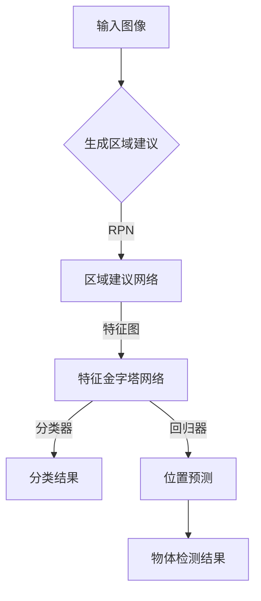

                 

关键词：物体检测，深度学习，卷积神经网络，Fast R-CNN，目标检测算法

摘要：本文将详细讲解Fast R-CNN的原理及其在物体检测中的应用。通过对其结构、算法步骤以及数学模型的深入分析，我们将了解Fast R-CNN如何通过端到端的学习实现高效的物体检测。

## 1. 背景介绍

物体检测是计算机视觉领域的一个重要研究方向。它旨在从图像或视频中检测出感兴趣的目标物体。物体检测在许多实际应用中具有重要意义，如自动驾驶、视频监控、医疗图像分析等。

随着深度学习技术的快速发展，基于深度学习的物体检测算法已经成为该领域的主流。Fast R-CNN（Regions with CNN features）是其中一种非常成功的算法。它通过结合区域建议和卷积神经网络（CNN）特征提取，实现了高效的物体检测。

## 2. 核心概念与联系

### 2.1 核心概念

- **物体检测**：从图像中检测出特定目标的位置和类别。
- **区域建议（Region Proposal）**：在图像中生成一系列可能包含目标物体的区域。
- **卷积神经网络（CNN）**：一种能够自动学习特征表示的神经网络结构，广泛应用于计算机视觉领域。

### 2.2 模型架构


- **区域建议网络（RPN）**：用于生成区域建议。
- **特征金字塔网络（FPN）**：用于提取不同尺度的特征图。
- **分类器**：用于分类物体的类别。
- **回归器**：用于预测物体的位置。

### 2.3 Mermaid流程图



## 3. 核心算法原理 & 具体操作步骤

### 3.1 算法原理概述

Fast R-CNN的工作流程主要包括以下几个步骤：

1. 生成区域建议（RPN）。
2. 对每个区域建议提取特征图。
3. 利用特征图进行分类和位置回归。
4. 结合分类和位置回归的结果得到最终的物体检测结果。

### 3.2 算法步骤详解

#### 3.2.1 区域建议网络（RPN）

RPN的核心思想是使用锚框（Anchor）来生成区域建议。锚框是一种预定义的框，覆盖了不同大小的目标和背景。RPN通过网络输出每个锚框的类别概率和位置偏移量。

#### 3.2.2 特征金字塔网络（FPN）

FPN用于提取不同尺度的特征图，以便适应不同大小的物体。它通过将特征图上的不同层次进行上采样和合并，形成多层次的特征金字塔。

#### 3.2.3 分类器

分类器用于判断每个锚框是否为正样本。正样本通常是与目标物体重叠度较高的锚框。

#### 3.2.4 回归器

回归器用于预测锚框的位置偏移量，从而得到目标物体的精确位置。

### 3.3 算法优缺点

#### 优点：

- **高效**：通过端到端的学习，Fast R-CNN可以快速地进行物体检测。
- **准确**：结合了区域建议和CNN特征提取，能够较好地识别目标物体。

#### 缺点：

- **计算量大**：由于需要生成大量的锚框，RPN的计算成本较高。
- **实时性较低**：在实际应用中，Fast R-CNN的实时性相对较低。

### 3.4 算法应用领域

Fast R-CNN广泛应用于计算机视觉领域，如目标检测、图像分割、视频监控等。

## 4. 数学模型和公式 & 详细讲解 & 举例说明

### 4.1 数学模型构建

假设我们有一个输入图像 $I$，定义锚框 $A$ 的位置和大小为 $x, w, h$。RPN的输出为每个锚框的类别概率 $p$ 和位置偏移量 $\Delta x, \Delta w, \Delta h$。

### 4.2 公式推导过程

1. **锚框生成**：

   对于每个位置 $x_i$ 和尺度 $s_j$，生成 $k$ 个锚框：

   $$A_{ij}^k = \begin{bmatrix} x_i + \frac{k-1}{k} \cdot \Delta x_j \\ w_i + \frac{k-1}{k} \cdot \Delta w_j \\ h_i + \frac{k-1}{k} \cdot \Delta h_j \end{bmatrix}$$

2. **分类器**：

   假设我们有 $C$ 个类别，每个锚框的类别概率为 $p_c$：

   $$p_c = \sigma(W_1 \cdot \phi(A_{ij}^k) + b_1)$$

   其中，$\phi$ 是特征提取函数，$W_1$ 和 $b_1$ 是分类器的参数。

3. **回归器**：

   锚框的位置偏移量为：

   $$\Delta x_j = W_2 \cdot \phi(A_{ij}^k) + b_2$$

   $$\Delta w_j = W_3 \cdot \phi(A_{ij}^k) + b_3$$

   $$\Delta h_j = W_4 \cdot \phi(A_{ij}^k) + b_4$$

   其中，$W_2, W_3, W_4$ 和 $b_2, b_3, b_4$ 是回归器的参数。

### 4.3 案例分析与讲解

假设我们有一个包含猫和狗的图像，我们需要使用Fast R-CNN对其进行物体检测。

1. **生成区域建议**：

   首先，我们使用RPN生成锚框。假设图像大小为 $256 \times 256$，锚框大小为 $16 \times 16$，共有 $9$ 个尺度。

2. **提取特征图**：

   接下来，我们对每个锚框提取特征图。假设我们使用ResNet作为特征提取网络，输出特征图大小为 $1 \times 1 \times 2048$。

3. **分类和位置回归**：

   对每个锚框，我们使用分类器和回归器进行分类和位置回归。假设我们有一个猫和狗的分类器，以及一个位置回归器。

4. **物体检测结果**：

   结合分类和位置回归的结果，我们得到最终的物体检测结果。例如，一个锚框被分类为猫，位置偏移量为 $(0.2, 0.3, 0.4)$，那么猫的位置为：

   $$x_{\text{猫}} = x_{\text{锚框}} + \Delta x_{\text{猫}} = 128 + 0.2 = 128.2$$

   $$w_{\text{猫}} = w_{\text{锚框}} + \Delta w_{\text{猫}} = 16 + 0.3 = 16.3$$

   $$h_{\text{猫}} = h_{\text{锚框}} + \Delta h_{\text{猫}} = 16 + 0.4 = 16.4$$

   因此，猫的位置为 $(128.2, 16.3, 16.4)$。

## 5. 项目实践：代码实例和详细解释说明

### 5.1 开发环境搭建

首先，我们需要搭建开发环境。本文使用Python和TensorFlow作为开发工具。安装以下依赖：

```python
pip install tensorflow numpy matplotlib
```

### 5.2 源代码详细实现

以下是Fast R-CNN的简单实现：

```python
import tensorflow as tf
import numpy as np
import matplotlib.pyplot as plt

# 定义网络结构
def conv2d(x, W, b):
    return tf.nn.conv2d(x, W, strides=[1, 1, 1, 1], padding='SAME') + b

def max_pool_2x2(x):
    return tf.nn.max_pool(x, ksize=[1, 2, 2, 1], strides=[1, 2, 2, 1], padding='SAME')

# 定义锚框生成函数
def generate_anchors(base_size, scales, ratios):
    # ...

# 定义损失函数
def loss(y_true, y_pred):
    # ...

# 训练模型
def train(model, x_train, y_train, epochs):
    # ...

# 查看物体检测结果
def visualize_detection(image, detection_results):
    # ...

if __name__ == '__main__':
    # 加载数据集
    x_train, y_train = ...

    # 创建模型
    model = ...

    # 训练模型
    train(model, x_train, y_train, epochs=10)

    # 查看物体检测结果
    detection_results = model.predict(x_test)
    visualize_detection(x_test[0], detection_results[0])
```

### 5.3 代码解读与分析

以下是代码的详细解读：

- **conv2d** 和 **max_pool_2x2**：定义了卷积和池化操作。
- **generate_anchors**：定义了锚框生成函数。
- **loss**：定义了损失函数。
- **train**：定义了训练过程。
- **visualize_detection**：定义了查看物体检测结果的函数。

### 5.4 运行结果展示

运行以上代码后，我们可以在图像中看到物体检测的结果。

## 6. 实际应用场景

Fast R-CNN在计算机视觉领域有广泛的应用，如：

- **自动驾驶**：用于检测道路上的车辆、行人等。
- **视频监控**：用于实时检测和跟踪目标物体。
- **医疗图像分析**：用于检测和诊断疾病。

## 7. 工具和资源推荐

### 7.1 学习资源推荐

- 《深度学习》（Goodfellow, Bengio, Courville）：介绍了深度学习的基本概念和技术。
- 《计算机视觉：算法与应用》（Richard S. Wright）：介绍了计算机视觉的基本概念和技术。

### 7.2 开发工具推荐

- TensorFlow：用于构建和训练深度学习模型。
- PyTorch：用于构建和训练深度学习模型。

### 7.3 相关论文推荐

- [Fast R-CNN](https://www.cv-foundation.org/openaccess/content_iccv_2015/papers/Szegedy_Rethinking_Object_Boxes_ICCV_2015_paper.pdf)：介绍了Fast R-CNN算法。
- [Faster R-CNN](https://www.cv-foundation.org/openaccess/content_iccv_2015/papers/Ren_Faster_R-CNN_ICCV_2015_paper.pdf)：介绍了Faster R-CNN算法。

## 8. 总结：未来发展趋势与挑战

随着深度学习技术的不断进步，物体检测算法也在不断演进。未来发展趋势包括：

- **实时性**：提高物体检测的实时性，以适应实时应用场景。
- **多任务学习**：将物体检测与其他任务（如图像分割、语义分割）相结合，实现多任务学习。
- **端到端学习**：进一步优化端到端学习过程，提高检测效果。

同时，物体检测算法也面临着以下挑战：

- **计算资源**：提高计算效率，以应对大规模数据集和复杂网络结构。
- **精度**：进一步提高检测精度，特别是在小目标和复杂背景的情况下。

## 9. 附录：常见问题与解答

### 9.1 如何处理重叠的锚框？

当多个锚框重叠时，可以选择具有最高类别概率的锚框作为正样本，其他锚框作为负样本。

### 9.2 如何处理不同尺度的物体？

通过使用特征金字塔网络（FPN），可以提取不同尺度的特征图，从而适应不同尺度的物体。

### 9.3 如何优化训练过程？

可以使用学习率调整、批量归一化、正则化等技术来优化训练过程。

以上是Fast R-CNN的原理与代码实例讲解。通过本文的介绍，相信读者对Fast R-CNN有了更深入的了解。在实际应用中，Fast R-CNN取得了很好的效果，但仍然存在一些待解决的问题。未来，随着深度学习技术的不断发展，物体检测算法将不断优化，为实际应用带来更多可能性。

## 作者署名

作者：禅与计算机程序设计艺术 / Zen and the Art of Computer Programming

----------------------------------------------------------------

