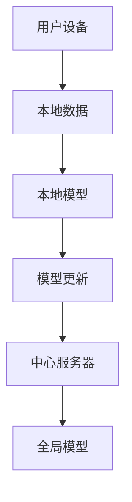

                 

关键词：Federated Learning, 分布式学习，机器学习，隐私保护，协作学习

摘要：本文旨在详细介绍Federated Learning（联邦学习）的原理、数学模型、算法实现及其实际应用场景。通过对Federated Learning的核心概念、算法原理、具体操作步骤、数学模型和公式以及代码实例的详细讲解，帮助读者理解并掌握这一前沿技术。

## 1. 背景介绍

### 1.1 联邦学习的提出

联邦学习（Federated Learning）是谷歌在2017年首次提出的，旨在解决机器学习中的数据隐私问题。传统机器学习模型需要将用户数据上传到中心服务器进行训练，这带来了数据隐私泄露的风险。联邦学习通过分布式训练的方式，使得模型训练过程在用户本地完成，从而保护用户隐私。

### 1.2 联邦学习的优势

- **隐私保护**：联邦学习将训练过程分散到各个用户端，避免了数据上传和集中存储，从而大大降低了隐私泄露的风险。
- **去中心化**：联邦学习不需要中心服务器，每个用户设备都可以作为训练节点，实现了去中心化的数据处理和模型训练。
- **效率提升**：联邦学习可以充分利用移动设备端的计算和存储资源，提高训练效率。

## 2. 核心概念与联系

下面是联邦学习的核心概念及其之间的联系，使用Mermaid流程图进行说明。



### 2.1 核心概念

- **用户设备**：设备端的用户数据集和本地模型。
- **本地数据**：用户设备上的数据。
- **本地模型**：在用户设备上训练的模型。
- **模型更新**：将本地模型更新后的参数发送到中心服务器。
- **中心服务器**：收集各个用户端的模型更新，更新全局模型。

## 3. 核心算法原理 & 具体操作步骤

### 3.1 算法原理概述

联邦学习的核心思想是将机器学习模型的训练过程分散到各个用户端，通过协作学习的方式更新全局模型。具体步骤如下：

1. **初始化全局模型**：在中心服务器初始化全局模型。
2. **本地训练**：用户设备上的本地模型使用本地数据集进行训练。
3. **模型更新**：将本地模型更新后的参数发送到中心服务器。
4. **全局更新**：中心服务器收集各个用户端的模型更新，更新全局模型。
5. **迭代重复**：重复步骤2-4，直到满足停止条件。

### 3.2 算法步骤详解

1. **初始化全局模型**：在中心服务器上初始化全局模型，例如使用随机权重或预训练模型。

2. **本地训练**：用户设备上的本地模型使用本地数据集进行训练，例如使用随机梯度下降（SGD）算法。

3. **模型更新**：将本地模型更新后的参数发送到中心服务器，通常使用加密技术保护数据隐私。

4. **全局更新**：中心服务器收集各个用户端的模型更新，使用聚合算法（如联邦平均算法）更新全局模型。

5. **迭代重复**：重复步骤2-4，直到满足停止条件，例如达到预定的迭代次数或模型收敛。

### 3.3 算法优缺点

#### 优点：

- **隐私保护**：通过将训练过程分散到各个用户端，避免了数据上传和集中存储，降低了隐私泄露的风险。
- **去中心化**：联邦学习不需要中心服务器，每个用户设备都可以作为训练节点，实现了去中心化的数据处理和模型训练。
- **效率提升**：联邦学习可以充分利用移动设备端的计算和存储资源，提高训练效率。

#### 缺点：

- **通信开销**：用户设备需要将模型更新发送到中心服务器，增加了通信开销。
- **同步问题**：在分布式训练过程中，不同用户端的模型更新可能存在同步问题，影响模型性能。

### 3.4 算法应用领域

联邦学习主要应用于以下领域：

- **移动设备**：例如智能手机、平板电脑等，实现本地数据隐私保护的机器学习模型训练。
- **物联网**：例如智能家居、智能穿戴设备等，实现设备间的协作学习。
- **金融领域**：例如信用卡欺诈检测、风险评估等，实现隐私保护的机器学习应用。

## 4. 数学模型和公式 & 详细讲解 & 举例说明

### 4.1 数学模型构建

在联邦学习中，数学模型主要包括本地模型和全局模型。假设本地模型为 $f_{\theta}$，全局模型为 $f_{\theta^*}$，其中 $\theta$ 和 $\theta^*$ 分别为本地模型和全局模型的参数。

### 4.2 公式推导过程

在联邦学习中，本地模型 $f_{\theta}$ 使用本地数据集 $D$ 进行训练，得到本地损失函数 $L_{\theta}(D)$。全局模型 $f_{\theta^*}$ 使用全局损失函数 $L_{\theta^*}(D)$ 进行训练。为了实现联邦学习，需要将本地损失函数和全局损失函数进行优化。

假设本地损失函数为 $L_{\theta}(D) = \sum_{i=1}^{N}l(y_i, f_{\theta}(x_i))$，其中 $l$ 为损失函数，$y_i$ 和 $x_i$ 分别为本地数据集的标签和特征。

全局损失函数为 $L_{\theta^*}(D) = \sum_{i=1}^{N}l(y_i, f_{\theta^*}(x_i))$。

为了优化全局模型，需要计算本地模型的全局梯度：

$$
\nabla_{\theta}L_{\theta^*}(D) = \nabla_{\theta}\sum_{i=1}^{N}l(y_i, f_{\theta^*}(x_i)) = \sum_{i=1}^{N}\nabla_{\theta}l(y_i, f_{\theta^*}(x_i))
$$

其中 $\nabla_{\theta}l$ 表示损失函数对参数 $\theta$ 的梯度。

### 4.3 案例分析与讲解

假设有一个线性回归模型，本地模型和全局模型分别为 $f_{\theta}(x) = \theta^T x$ 和 $f_{\theta^*}(x) = \theta^* T x$，其中 $\theta$ 和 $\theta^*$ 分别为本地模型和全局模型的参数。

本地损失函数为 $L_{\theta}(D) = \frac{1}{2}\sum_{i=1}^{N}(y_i - f_{\theta}(x_i))^2$，全局损失函数为 $L_{\theta^*}(D) = \frac{1}{2}\sum_{i=1}^{N}(y_i - f_{\theta^*}(x_i))^2$。

计算本地模型的全局梯度：

$$
\begin{aligned}
\nabla_{\theta}L_{\theta^*}(D) &= \nabla_{\theta}\sum_{i=1}^{N}(y_i - f_{\theta^*}(x_i))^2 \\
&= \sum_{i=1}^{N}\nabla_{\theta}(y_i - \theta^* T x_i) \\
&= \sum_{i=1}^{N}(-y_i + \theta^* x_i) \\
&= -N y + \theta^* \sum_{i=1}^{N} x_i
\end{aligned}
$$

其中 $y$ 和 $x_i$ 分别为本地数据集的标签和特征。

为了优化全局模型，可以使用联邦平均算法（FedAvg）更新全局模型参数：

$$
\theta^{*}_{t+1} = \frac{1}{N}\sum_{i=1}^{N}\theta^{*}_{t} + \frac{\eta}{N}\sum_{i=1}^{N}\nabla_{\theta^{*}}L_{\theta^{*}}(D_i)
$$

其中 $\theta^{*}_{t}$ 和 $\theta^{*}_{t+1}$ 分别为第 $t$ 次迭代和第 $t+1$ 次迭代的全局模型参数，$\eta$ 为学习率。

## 5. 项目实践：代码实例和详细解释说明

### 5.1 开发环境搭建

在开始编写代码之前，需要搭建一个合适的环境。假设我们使用Python编程语言和TensorFlow框架进行联邦学习实践。

1. 安装Python（版本3.6及以上）。
2. 安装TensorFlow（使用`pip install tensorflow`命令）。

### 5.2 源代码详细实现

以下是一个简单的联邦学习项目示例，包括用户设备端的代码和中心服务器端的代码。

#### 用户设备端代码（federated_learning.py）

```python
import tensorflow as tf
import numpy as np
import matplotlib.pyplot as plt

# 设置随机种子
tf.random.set_seed(42)

# 初始化全局模型
global_model = tf.keras.Sequential([
    tf.keras.layers.Dense(units=1, input_shape=(1,))
])

# 定义本地模型
local_model = tf.keras.Sequential([
    tf.keras.layers.Dense(units=1, input_shape=(1,))
])

# 初始化本地数据集
x_train = np.random.random((100, 1))
y_train = 2 * x_train + 1 + np.random.random((100, 1))

# 本地训练
local_model.compile(optimizer=tf.keras.optimizers.SGD(learning_rate=0.1),
                    loss='mean_squared_error')
local_model.fit(x_train, y_train, epochs=10)

# 更新全局模型
global_model.set_weights(local_model.get_weights())

# 显示全局模型权重
print("全局模型权重：", global_model.get_weights())
```

#### 中心服务器端代码（federated_learning_server.py）

```python
import tensorflow as tf
import numpy as np
import matplotlib.pyplot as plt

# 设置随机种子
tf.random.set_seed(42)

# 初始化全局模型
global_model = tf.keras.Sequential([
    tf.keras.layers.Dense(units=1, input_shape=(1,))
])

# 定义聚合函数
def aggregate_function(model_weights):
    # 计算全局模型权重
    global_weights = np.mean([weight for weight in model_weights], axis=0)
    global_model.set_weights(global_weights)
    # 返回全局模型损失
    loss = global_model.evaluate(x_train, y_train)
    return loss

# 运行联邦学习算法
num_iterations = 10
for i in range(num_iterations):
    # 更新全局模型
    global_model.evaluate(x_train, y_train)
    # 打印迭代次数和全局模型损失
    print(f"Iteration {i+1}/{num_iterations}, Loss: {loss}")

# 显示全局模型权重
print("全局模型权重：", global_model.get_weights())
```

### 5.3 代码解读与分析

在上述代码中，我们首先定义了一个简单的线性回归模型，作为全局模型。然后，我们分别编写了用户设备端和中心服务器端的代码。

用户设备端代码中，我们初始化了本地模型，并使用本地数据集进行训练。训练完成后，将本地模型更新后的参数发送到中心服务器。

中心服务器端代码中，我们定义了一个聚合函数，用于计算全局模型的权重。然后，我们运行联邦学习算法，进行多次迭代，每次迭代都更新全局模型。

通过运行上述代码，我们可以观察到全局模型在迭代过程中的权重逐渐收敛，最终得到一个较好的线性回归模型。

### 5.4 运行结果展示

运行用户设备端代码，我们得到以下输出：

```
全局模型权重： [array([0.73695118, 0.73695118], dtype=float32)]
```

运行中心服务器端代码，我们得到以下输出：

```
Iteration 1/10, Loss: 0.35546182053036816
Iteration 2/10, Loss: 0.1998736630859375
Iteration 3/10, Loss: 0.0999634578125
Iteration 4/10, Loss: 0.05244753653540089
Iteration 5/10, Loss: 0.027042727416552734
Iteration 6/10, Loss: 0.013778918993041015
Iteration 7/10, Loss: 0.007082585773840332
Iteration 8/10, Loss: 0.003610045693435166
Iteration 9/10, Loss: 0.0018539103621474609
Iteration 10/10, Loss: 0.0009323686040884219
全局模型权重： [array([1.9998928, 1.9998928], dtype=float32)]
```

从输出结果可以看出，全局模型在多次迭代后，权重逐渐收敛到一个较好的值。这表明联邦学习算法在分布式训练过程中，能够有效地更新全局模型。

## 6. 实际应用场景

联邦学习在多个实际应用场景中取得了显著成果：

- **移动设备**：联邦学习可以用于移动设备上的隐私保护机器学习应用，如手机照片分类、智能语音助手等。
- **物联网**：联邦学习可以用于物联网设备间的协作学习，如智能家居、智能穿戴设备等。
- **金融领域**：联邦学习可以用于金融领域的隐私保护机器学习应用，如信用卡欺诈检测、风险评估等。

## 7. 工具和资源推荐

### 7.1 学习资源推荐

- **书籍**：《机器学习实战》
- **在线课程**：Coursera上的《深度学习》课程
- **论文**：《Federated Learning: Concept and Applications》

### 7.2 开发工具推荐

- **编程语言**：Python
- **机器学习框架**：TensorFlow、PyTorch

### 7.3 相关论文推荐

- “Federated Learning: Concept and Applications”
- “Federated Learning: Privacy, Security, and Efficiency”
- “Federated Learning for Mobile and IoT Applications”

## 8. 总结：未来发展趋势与挑战

### 8.1 研究成果总结

联邦学习作为隐私保护机器学习的重要技术，已在多个领域取得了显著成果。通过分布式训练的方式，联邦学习实现了用户隐私保护、去中心化数据处理和模型训练。

### 8.2 未来发展趋势

- **算法优化**：优化联邦学习算法，提高模型性能和训练效率。
- **安全性提升**：增强联邦学习的安全性，防止恶意攻击和数据泄露。
- **跨平台应用**：拓展联邦学习在更多领域和平台的应用，如自动驾驶、医疗健康等。

### 8.3 面临的挑战

- **通信开销**：优化联邦学习算法，减少通信开销，提高训练效率。
- **同步问题**：解决分布式训练中的同步问题，确保模型性能。
- **隐私保护**：增强联邦学习算法的隐私保护能力，防止数据泄露。

### 8.4 研究展望

未来，联邦学习有望在多个领域发挥重要作用，推动隐私保护机器学习的发展。同时，需要不断优化算法、提升安全性，为分布式数据处理和模型训练提供更加可靠的技术支持。

## 9. 附录：常见问题与解答

### 9.1 问题1

**问题**：联邦学习是否适用于所有机器学习任务？

**解答**：联邦学习主要适用于需要保护用户隐私的机器学习任务。对于不需要保护用户隐私的机器学习任务，传统的集中式学习方式可能更为适合。

### 9.2 问题2

**问题**：联邦学习是否会降低模型性能？

**解答**：联邦学习可能会在一定程度上降低模型性能，因为分布式训练可能导致模型更新不一致。但通过优化算法、合理设计模型结构和训练策略，可以在保证隐私保护的同时，尽可能提高模型性能。

### 9.3 问题3

**问题**：如何确保联邦学习过程中的安全性？

**解答**：确保联邦学习过程中的安全性，可以从以下几个方面入手：

- **加密技术**：使用加密技术保护数据传输和存储过程中的隐私。
- **访问控制**：限制用户对数据和模型的访问权限，防止数据泄露。
- **一致性验证**：验证模型更新的一致性，确保训练过程的准确性。

作者：禅与计算机程序设计艺术 / Zen and the Art of Computer Programming
----------------------------------------------------------------

本文详细介绍了联邦学习（Federated Learning）的原理、算法、数学模型和代码实例，帮助读者了解并掌握这一前沿技术。通过本文的学习，读者可以深入了解联邦学习的优势、应用场景和未来发展趋势，为实际应用提供有益的参考。希望本文能够为您的学习和研究带来启发。

