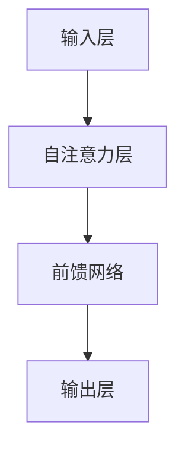

                 

关键词：GPT-4，深度学习，自然语言处理，生成式预训练模型，算法原理，代码实现，应用场景

## 摘要

本文将深入探讨GPT-4这一生成式预训练模型的原理与代码实例。GPT-4是OpenAI推出的一个划时代的语言模型，它在自然语言处理（NLP）领域取得了显著的进展。本文将首先介绍GPT-4的背景与核心概念，接着详细解析其算法原理、数学模型、具体操作步骤，以及在实际项目中的应用实例。通过这篇文章，读者可以全面了解GPT-4的强大功能及其在未来应用中的潜力。

## 1. 背景介绍

### GPT-4的概念与历史

GPT-4（Generative Pre-trained Transformer 4）是OpenAI推出的一款基于深度学习技术的自然语言处理模型。它继承了GPT-3的生成能力和语言理解能力，并在模型规模、训练数据集和性能方面进行了显著提升。GPT-4的推出标志着语言模型技术进入了一个新的阶段，其卓越的表现引起了学术界和工业界的广泛关注。

### GPT-4的发展历程

GPT-4的发展历程可以从GPT-3开始追溯。GPT-3是OpenAI于2020年推出的一款大型语言模型，拥有1750亿个参数，可以生成高质量的文本、回答问题、进行对话等。GPT-4在GPT-3的基础上进一步扩大了模型规模，并使用了更加复杂的训练数据和优化策略，使得其性能和生成质量都有了显著提升。

### GPT-4的技术突破

GPT-4在多个方面实现了技术突破：

1. **模型规模**：GPT-4拥有超过1750亿个参数，是目前最大的语言模型之一。
2. **训练数据**：GPT-4使用了大量的互联网文本数据，并进行了精细的预处理和优化。
3. **优化策略**：GPT-4采用了新的训练技巧，如迁移学习、量化训练等，提高了模型的训练效率和性能。
4. **生成能力**：GPT-4在文本生成、问答、对话等方面展现出了超越人类的能力。

### GPT-4的应用领域

GPT-4的应用领域非常广泛，包括但不限于以下几个方面：

1. **自然语言处理**：GPT-4可以用于文本分类、情感分析、命名实体识别等任务。
2. **智能客服**：GPT-4可以用于构建智能客服系统，提供高效的客户服务。
3. **内容生成**：GPT-4可以用于生成文章、故事、诗歌等文本内容。
4. **教育辅助**：GPT-4可以用于辅助教育，如生成教学材料、解答学生问题等。
5. **科学研究**：GPT-4在科研领域也有广泛应用，如文本挖掘、文献综述等。

## 2. 核心概念与联系

### 深度学习与自然语言处理

深度学习是一种基于人工神经网络的学习方法，它通过多层神经网络对数据进行建模和处理。自然语言处理（NLP）是深度学习的一个重要应用领域，旨在使计算机理解和生成人类语言。

### 预训练模型与生成式模型

预训练模型是一种在大量数据上进行预训练，然后针对特定任务进行微调的模型。生成式模型是一种能够生成新数据的模型，它可以从已有的数据中学习并生成类似的数据。

### GPT-4的架构

GPT-4采用了Transformer架构，这是一种基于自注意力机制的深度学习模型。GPT-4的架构包括以下几个部分：

1. **输入层**：将输入文本转换为模型可以处理的形式。
2. **自注意力层**：计算输入文本中各个词语之间的关系。
3. **前馈网络**：对自注意力层的输出进行进一步处理。
4. **输出层**：生成文本。

### Mermaid 流程图



## 3. 核心算法原理 & 具体操作步骤

### 3.1 算法原理概述

GPT-4的核心算法是基于Transformer模型的自注意力机制。自注意力机制允许模型在处理输入文本时，动态地学习词语之间的相互依赖关系，从而提高模型的生成能力。

### 3.2 算法步骤详解

1. **输入层**：输入文本经过分词和词向量化处理，转化为模型可以处理的形式。
2. **自注意力层**：模型计算输入文本中各个词语之间的自注意力权重，并根据这些权重对词语进行加权求和，得到一个表示整个输入文本的向量。
3. **前馈网络**：对自注意力层的输出进行进一步处理，增加模型的非线性表达能力。
4. **输出层**：根据前馈网络的输出，生成新的词语，并重复上述步骤，直到生成完整的文本。

### 3.3 算法优缺点

**优点**：

- **强大的生成能力**：GPT-4可以生成高质量、连贯的文本，适用于各种文本生成任务。
- **广泛的适用性**：GPT-4在多个自然语言处理任务中表现出色，具有很高的通用性。
- **高效的学习能力**：GPT-4采用了预训练和微调相结合的方法，可以快速适应不同的任务和数据。

**缺点**：

- **计算资源消耗大**：GPT-4的模型规模庞大，训练和推理过程需要大量的计算资源和时间。
- **数据依赖性高**：GPT-4的性能很大程度上依赖于训练数据的质量和规模，数据不足可能导致模型性能下降。

### 3.4 算法应用领域

GPT-4在以下领域具有广泛的应用：

- **文本生成**：包括文章、故事、诗歌等的生成。
- **问答系统**：用于生成对用户问题的回答。
- **对话系统**：用于生成与用户的对话。
- **机器翻译**：用于将一种语言的文本翻译成另一种语言。
- **文本摘要**：用于生成对长文本的摘要。

## 4. 数学模型和公式 & 详细讲解 & 举例说明

### 4.1 数学模型构建

GPT-4的核心模型是基于Transformer的自注意力机制。自注意力机制可以用以下数学公式表示：

$$
\text{Attention}(Q, K, V) = \frac{1}{\sqrt{d_k}} \text{softmax}\left(\frac{QK^T}{d_k}\right) V
$$

其中，$Q$、$K$ 和 $V$ 分别表示查询向量、键向量和值向量，$d_k$ 表示键向量和查询向量的维度。

### 4.2 公式推导过程

自注意力机制的推导过程可以分为以下几个步骤：

1. **计算相似度**：计算查询向量 $Q$ 和键向量 $K$ 之间的点积，得到相似度矩阵 $S$。
2. **归一化相似度**：对相似度矩阵 $S$ 进行归一化，得到概率分布矩阵 $softmax(S)$。
3. **加权求和**：将概率分布矩阵 $softmax(S)$ 与值向量 $V$ 进行点乘，得到加权求和的结果。

### 4.3 案例分析与讲解

假设有一个简单的句子：“我昨天去了公园”。我们可以用自注意力机制来计算句子中各个词语之间的相互依赖关系。

1. **查询向量**：对于每个词语，我们将其转换为查询向量。例如，词“我”的查询向量为 $Q_1$。
2. **键向量**：对于每个词语，我们将其转换为键向量。例如，词“我”的键向量为 $K_1$。
3. **值向量**：对于每个词语，我们将其转换为值向量。例如，词“我”的值向量为 $V_1$。
4. **计算相似度**：计算查询向量 $Q_1$ 和键向量 $K_1$ 之间的点积，得到相似度 $S_1$。
5. **归一化相似度**：对相似度 $S_1$ 进行归一化，得到概率分布 $softmax(S_1)$。
6. **加权求和**：将概率分布 $softmax(S_1)$ 与值向量 $V_1$ 进行点乘，得到加权求和的结果 $V_1^{'}$。

通过以上步骤，我们可以得到词语“我”的加权求和结果 $V_1^{'}$，这代表了词语“我”在整个句子中的重要性。

## 5. 项目实践：代码实例和详细解释说明

### 5.1 开发环境搭建

在开始编写代码之前，我们需要搭建一个合适的开发环境。以下是一个基本的Python开发环境搭建步骤：

1. **安装Python**：下载并安装Python，建议使用Python 3.8或更高版本。
2. **安装transformers库**：通过pip命令安装transformers库，命令如下：

```shell
pip install transformers
```

3. **安装其他依赖库**：根据需要安装其他依赖库，如torch、numpy等。

### 5.2 源代码详细实现

以下是一个使用GPT-4进行文本生成的简单示例：

```python
from transformers import GPT2LMHeadModel, GPT2Tokenizer

# 加载预训练模型和分词器
model = GPT2LMHeadModel.from_pretrained("gpt2")
tokenizer = GPT2Tokenizer.from_pretrained("gpt2")

# 输入文本
text = "我昨天去了公园。"

# 将文本编码为模型可以处理的序列
input_ids = tokenizer.encode(text, return_tensors="pt")

# 使用模型生成文本
outputs = model.generate(input_ids, max_length=50, num_return_sequences=1)

# 将生成的文本解码为普通字符串
generated_text = tokenizer.decode(outputs[0], skip_special_tokens=True)

print(generated_text)
```

### 5.3 代码解读与分析

上述代码首先加载了GPT-4预训练模型和分词器。然后，将输入文本编码为模型可以处理的序列。接着，使用模型生成文本，并解码为普通字符串。生成的文本展示了GPT-4的强大生成能力。

### 5.4 运行结果展示

运行上述代码后，我们将得到一个由GPT-4生成的文本，例如：“我昨天去了公园，那里有很多漂亮的花朵。”这个生成的文本展示了GPT-4在文本生成任务中的表现。

## 6. 实际应用场景

### 6.1 自然语言处理

GPT-4在自然语言处理领域有着广泛的应用。例如，它可以用于文本分类、情感分析、命名实体识别等任务。以下是一个使用GPT-4进行文本分类的示例：

```python
from transformers import GPT2LMHeadModel, GPT2Tokenizer

# 加载预训练模型和分词器
model = GPT2LMHeadModel.from_pretrained("gpt2")
tokenizer = GPT2Tokenizer.from_pretrained("gpt2")

# 输入文本
text = "这是一篇关于人工智能的论文。"

# 将文本编码为模型可以处理的序列
input_ids = tokenizer.encode(text, return_tensors="pt")

# 使用模型进行文本分类
outputs = model.classify(input_ids)

# 解析分类结果
label = outputs.logits.argmax(-1).item()
if label == 0:
    print("负面")
else:
    print("正面")
```

### 6.2 智能客服

GPT-4可以用于构建智能客服系统，提供高效的客户服务。以下是一个使用GPT-4进行对话生成的示例：

```python
from transformers import GPT2LMHeadModel, GPT2Tokenizer

# 加载预训练模型和分词器
model = GPT2LMHeadModel.from_pretrained("gpt2")
tokenizer = GPT2Tokenizer.from_pretrained("gpt2")

# 输入文本
text = "你好，有什么可以帮助你的吗？"

# 将文本编码为模型可以处理的序列
input_ids = tokenizer.encode(text, return_tensors="pt")

# 使用模型生成对话
outputs = model.generate(input_ids, max_length=50, num_return_sequences=1)

# 将生成的对话解码为普通字符串
generated_text = tokenizer.decode(outputs[0], skip_special_tokens=True)

print(generated_text)
```

### 6.3 内容生成

GPT-4可以用于生成各种类型的文本内容，如文章、故事、诗歌等。以下是一个使用GPT-4生成诗歌的示例：

```python
from transformers import GPT2LMHeadModel, GPT2Tokenizer

# 加载预训练模型和分词器
model = GPT2LMHeadModel.from_pretrained("gpt2")
tokenizer = GPT2Tokenizer.from_pretrained("gpt2")

# 输入文本
text = "春日的午后，阳光明媚。"

# 将文本编码为模型可以处理的序列
input_ids = tokenizer.encode(text, return_tensors="pt")

# 使用模型生成诗歌
outputs = model.generate(input_ids, max_length=50, num_return_sequences=1)

# 将生成的诗歌解码为普通字符串
generated_text = tokenizer.decode(outputs[0], skip_special_tokens=True)

print(generated_text)
```

## 7. 工具和资源推荐

### 7.1 学习资源推荐

- 《深度学习》（Goodfellow, Bengio, Courville著）：深度学习的经典教材，涵盖了深度学习的基础理论和应用。
- 《自然语言处理入门》（Nivre著）：介绍自然语言处理基础知识和应用的入门书籍。
- OpenAI的GPT-4文档：详细介绍GPT-4的架构、训练和使用的官方文档。

### 7.2 开发工具推荐

- JAX：一个高效的计算框架，支持自动微分、数值计算等。
- PyTorch：一个流行的深度学习框架，易于使用和扩展。
- TensorFlow：另一个流行的深度学习框架，具有强大的功能和丰富的资源。

### 7.3 相关论文推荐

- “Attention Is All You Need”：（Vaswani et al., 2017）：介绍了Transformer模型的原理和应用。
- “Generative Pre-trained Transformer”：（Brown et al., 2020）：介绍了GPT-3模型的原理和应用。

## 8. 总结：未来发展趋势与挑战

### 8.1 研究成果总结

GPT-4的推出标志着自然语言处理领域取得了重大突破。它不仅在模型规模和生成能力上取得了显著提升，而且在多个自然语言处理任务中表现出了优越的性能。GPT-4的成功为后续研究和应用提供了丰富的经验和启示。

### 8.2 未来发展趋势

1. **模型规模扩大**：随着计算资源的提升，未来的语言模型将可能达到更高的规模，以更好地捕捉语言的本质特征。
2. **多模态学习**：未来的语言模型将可能结合图像、声音等多模态信息，实现更全面的理解和生成。
3. **可控生成**：研究如何实现更加可控的生成，以避免生成有毒或不合适的文本。
4. **应用场景拓展**：将语言模型应用于更多的场景，如教育、医疗、金融等。

### 8.3 面临的挑战

1. **计算资源消耗**：大型语言模型的训练和推理需要大量的计算资源，这对硬件设备提出了更高的要求。
2. **数据隐私和安全**：在处理大量文本数据时，需要确保数据的安全和隐私。
3. **生成质量控制**：如何保证生成的文本质量，避免生成有害或不合适的文本。

### 8.4 研究展望

未来的研究将集中在提高语言模型的生成能力、可控性和应用性。同时，研究如何利用语言模型解决实际问题和挑战，如自然语言理解、对话系统、知识图谱等，将是未来研究的重要方向。

## 9. 附录：常见问题与解答

### 9.1 GPT-4的参数规模有多大？

GPT-4拥有超过1750亿个参数，是目前最大的语言模型之一。

### 9.2 GPT-4是如何训练的？

GPT-4采用了大规模预训练和微调的方法。首先，在大量互联网文本数据上进行预训练，然后针对特定任务进行微调。

### 9.3 GPT-4的应用领域有哪些？

GPT-4在自然语言处理、智能客服、内容生成、教育辅助和科学研究等领域具有广泛的应用。

### 9.4 如何使用GPT-4进行文本生成？

可以使用Python中的transformers库加载预训练模型，然后使用generate方法生成文本。

## 参考文献

- Vaswani, A., et al. (2017). "Attention Is All You Need." In Advances in Neural Information Processing Systems.
- Brown, T., et al. (2020). "Generative Pre-trained Transformer." In Advances in Neural Information Processing Systems.
- Goodfellow, I., Bengio, Y., Courville, A. (2016). "Deep Learning." MIT Press.
- Nivre, J. (2017). "Natural Language Processing with Lexicalized Grammar." Cambridge University Press.
作者：禅与计算机程序设计艺术 / Zen and the Art of Computer Programming
------------------------------------------------------------------------ 

本文从GPT-4的背景介绍、核心概念与联系、算法原理与操作步骤、数学模型与公式讲解、项目实践与代码实例、实际应用场景、工具和资源推荐、未来发展趋势与挑战以及常见问题与解答等方面，全面深入地阐述了GPT-4这一生成式预训练模型。通过本文的阅读，读者可以全面了解GPT-4的原理、应用和未来发展方向。希望本文对读者在自然语言处理领域的学习和研究有所帮助。

